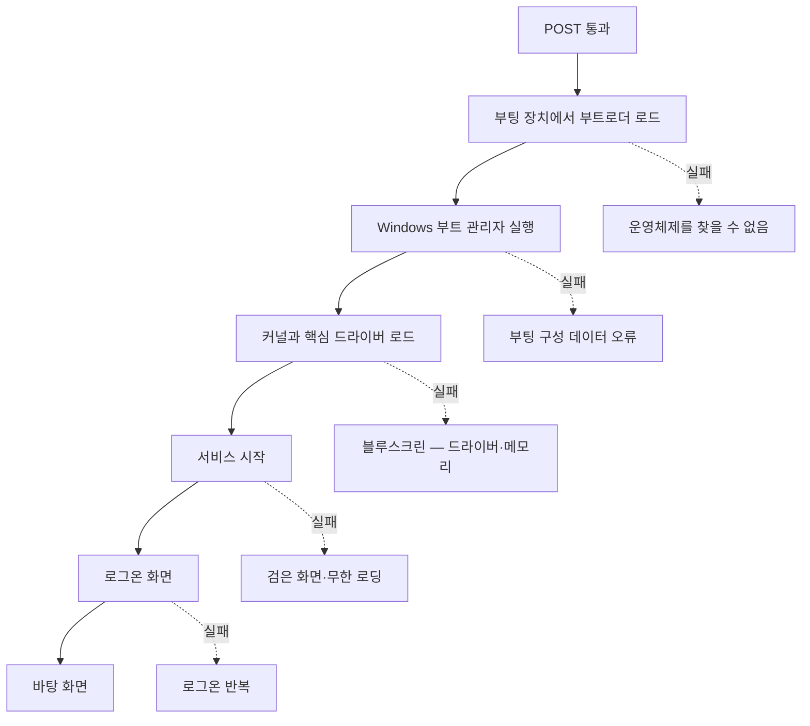

<Callout type="info">
  **이번 문서의 목표:** 이 파일을 다 읽으면 POST는 통과했는데 Windows가 제대로 뜨지 않는 상황을 원인별로 나눌 수 있고, 안전 모드와 시스템 구성으로 문제를 격리할 수 있으며, 서비스 관리자에서 지정된 서비스를 정확한 시작 유형으로 바꾸고 중지할 수 있습니다.
</Callout>

## POST 이후의 세계

09편까지는 하드웨어가 스스로를 점검하는 구간이었습니다. 이번 편은 **BIOS가 제어권을 넘긴 다음**의 이야기입니다. 화면에 제조사 로고가 뜨고 그 뒤부터 문제가 생긴다면, 원인은 대개 하드웨어가 아니라 **부팅 파일·드라이버·서비스·설정** 쪽입니다.

부팅 과정을 단계로 나누면 어디서 멈췄는지가 곧 원인 범위가 됩니다.

> **쉽게 말하면:** 어디까지 갔다가 멈췄는지를 보면 무엇이 문제인지 절반은 알 수 있습니다.

## 1. 부팅 실패 메시지별 원인

| 화면 메시지 | 멈춘 지점 | 원인 | 조치 |
|-------------|-----------|------|------|
| 부팅 장치를 찾을 수 없음 | 부트로더 로드 전 | 부팅 순서 오류, 저장장치 미인식 | BIOS에서 부팅 순서 확인, 06편 절차 |
| 운영 체제를 찾을 수 없음 | 부트로더 로드 | 부팅 파티션 손상, 활성 파티션 미지정 | 복구 환경에서 부팅 복구 |
| 부팅 구성 데이터 오류 | 부트 관리자 | BCD 손상 | 복구 환경에서 BCD 재생성 |
| 파란 화면과 정지 코드 | 커널·드라이버 | 드라이버·메모리·저장장치 | 안전 모드 진입 후 격리 |
| 로고에서 무한 로딩 | 서비스 시작 | 서비스·시작 프로그램 충돌 | 시스템 구성으로 격리 |
| 로그온 후 검은 화면 | 셸 시작 | 그래픽 드라이버·탐색기 프로세스 | 안전 모드에서 드라이버 롤백 |

**BCD**(Boot Configuration Data, 부팅 구성 데이터)는 "어느 디스크의 어느 위치에 있는 Windows를 어떤 옵션으로 띄울지"를 적어 둔 목록입니다. 예전 BIOS 시절의 `boot.ini` 텍스트 파일을 대체한 것으로, 이 목록이 깨지면 Windows는 자기 자신이 어디 있는지 모르게 됩니다.

## 2. 복구 환경 — 부팅이 안 될 때 들어가는 방

**WinRE**(Windows Recovery Environment, 복구 환경)는 Windows가 뜨지 않을 때 진입하는 축소판 운영체제입니다.

<Steps>

### 진입 방법 ① 자동 진입

부팅에 연속 실패하면 Windows가 스스로 복구 환경으로 들어갑니다. 강제로 유발하려면 로고가 뜬 직후 전원 버튼을 길게 눌러 끄기를 두세 번 반복합니다.

### 진입 방법 ② 설치 미디어

설치 USB로 부팅해 첫 화면에서 **컴퓨터 복구**를 선택합니다. 이 방법이 더 안전하고 확실합니다.

### 문제 해결 → 고급 옵션

여기에 실제 도구들이 있습니다.

</Steps>

| 고급 옵션 도구 | 하는 일 | 언제 쓰나 |
|----------------|---------|-----------|
| 시작 복구 | 부팅 파일·BCD 자동 복구 시도 | 부팅 메시지 오류 |
| 시스템 복원 | 이전 복원 지점 상태로 되돌림 | 최근 변경 후 문제 발생 |
| 명령 프롬프트 | `bootrec`, `sfc`, `chkdsk` 실행 | 수동 복구 |
| 시작 설정 | 안전 모드 등 부팅 옵션 선택 | 드라이버·서비스 격리 |
| 업데이트 제거 | 최근 품질·기능 업데이트 삭제 | 업데이트 직후 문제 발생 |

### 명령 프롬프트에서 쓰는 복구 명령

| 명령 | 하는 일 |
|------|---------|
| `bootrec /fixmbr` | 마스터 부트 레코드를 다시 씀 |
| `bootrec /fixboot` | 부트 섹터를 다시 씀 |
| `bootrec /rebuildbcd` | 설치된 Windows를 찾아 BCD 목록을 다시 만듦 |
| `sfc /scannow` | 시스템 파일 무결성 검사와 복구 |
| `chkdsk C: /f /r` | 디스크 오류 검사 및 불량 섹터 복구 |

`sfc` 는 System File Checker(시스템 파일 검사기)의 줄임말이고, `chkdsk` 는 Check Disk입니다. `/f` 는 발견한 오류를 고치라는 뜻(fix), `/r` 은 불량 섹터를 찾아 읽을 수 있는 정보를 옮기라는 뜻(recover)입니다.

## 3. 블루스크린 — 정지 코드로 읽기

**블루스크린**(BSOD, Blue Screen of Death)은 Windows 커널이 "이대로 계속하면 데이터가 손상된다"고 판단해 스스로 실행을 멈춘 화면입니다. 고장이 아니라 **안전장치가 작동한 결과**입니다.

화면에는 정지 코드(Stop Code)가 표시되며, 이 코드가 원인 범위를 좁혀 줍니다.

| 정지 코드 | 뜻 | 주 원인 |
|-----------|-----|---------|
| `MEMORY_MANAGEMENT` | 메모리 관리 오류 | RAM 불량·접촉 불량 |
| `PAGE_FAULT_IN_NONPAGED_AREA` | 있어야 할 메모리 페이지가 없음 | RAM, 드라이버 |
| `IRQL_NOT_LESS_OR_EQUAL` | 드라이버가 잘못된 우선순위에서 메모리 접근 | 드라이버 |
| `SYSTEM_SERVICE_EXCEPTION` | 시스템 서비스 예외 | 드라이버, 보안 프로그램 |
| `CRITICAL_PROCESS_DIED` | 핵심 프로세스 종료 | 시스템 파일 손상 |
| `INACCESSIBLE_BOOT_DEVICE` | 부팅 장치에 접근 불가 | 저장장치 컨트롤러 모드 변경, 드라이버 |
| `UNEXPECTED_KERNEL_MODE_TRAP` | 커널 모드 오류 | 하드웨어, 과열, 오버클럭 |

`INACCESSIBLE_BOOT_DEVICE` 는 원인이 특이해서 기억해 둘 만합니다. BIOS에서 SATA 동작 모드를 `AHCI` 와 `RAID`, `IDE` 사이에서 바꾸면 Windows가 저장장치를 다루는 드라이버를 못 찾아 이 오류가 납니다. 조치는 **BIOS 설정을 원래대로 되돌리는 것**입니다.

### 블루스크린 진단 절차

<Steps>

### 정지 코드와 실패한 항목 기록

화면에 표시된 정지 코드와, 있다면 파일 이름(예: `.sys` 로 끝나는 드라이버 파일)을 적어 둡니다. 파일 이름이 나오면 그 드라이버가 범인일 확률이 높습니다.

### 최근 변경 사항 확인

증상 직전에 무엇을 했는지 따집니다 — 드라이버 업데이트, 새 하드웨어 장착, 프로그램 설치, Windows 업데이트. 가장 강력한 단서입니다.

### 안전 모드로 진입

복구 환경 → 시작 설정 → 다시 시작 → `4` 또는 `F4` 로 안전 모드를 선택합니다.

### 안전 모드에서 정상이면 소프트웨어 문제

안전 모드는 최소한의 드라이버와 서비스만 띄웁니다. 여기서 멀쩡하다면 하드웨어가 아니라 **드라이버나 서비스, 시작 프로그램**이 원인입니다.

### 원인 격리

드라이버 롤백(08편), 최근 설치 프로그램 제거, 시스템 구성으로 서비스 격리(아래 4절)를 순서대로 시도합니다.

### 하드웨어 검증

안전 모드에서도 블루스크린이 나면 메모리 진단(`mdsched.exe`)과 디스크 검사(`chkdsk`)로 하드웨어를 검증합니다.

</Steps>

### 이벤트 뷰어로 뒤늦게 확인하기

블루스크린 화면을 놓쳤다면 이벤트 뷰어에서 확인합니다. 실행 창에 `eventvwr.msc` 를 입력하고 `Windows 로그 → 시스템` 에서 빨간 오류 항목을 시간순으로 봅니다. `Kernel-Power` 원본의 오류는 정상 종료 없이 전원이 끊겼다는 기록으로, 전원·과열 문제를 시사합니다.

## 4. 시스템 구성과 서비스 관리자

### 서비스란 무엇인가

**서비스**(service)는 사용자가 로그인하지 않아도 백그라운드에서 도는 프로그램입니다. 인쇄 대기열, 네트워크 연결 관리, 업데이트 확인 같은 일을 합니다. 화면에 창을 띄우지 않고 조용히 도는 점원이라고 생각하면 됩니다.

서비스가 많을수록 메모리와 CPU를 쓰고, 잘못 만들어진 서비스는 부팅을 지연시키거나 충돌을 일으킵니다. 그래서 진단과 최적화 양쪽에서 서비스 관리가 등장합니다.

### 서비스 관리자 다루기

실행 창에 `services.msc` 를 입력해 엽니다. 각 서비스에는 **상태**와 **시작 유형** 두 가지 속성이 있습니다. 이 둘을 혼동하면 실기에서 점수를 잃습니다.

| 속성 | 의미 | 값 |
|------|------|-----|
| 상태(Status) | **지금** 돌고 있는가 | 실행 중 / 중지됨 |
| 시작 유형(Startup type) | **다음 부팅 때** 어떻게 할 것인가 | 자동 / 자동(지연된 시작) / 수동 / 사용 안 함 |

| 시작 유형 | 동작 |
|-----------|------|
| 자동 | 부팅 시 바로 시작 |
| 자동(지연된 시작) | 부팅 후 잠시 뒤 시작해 부팅 속도 영향 최소화 |
| 수동 | 다른 프로그램이 요청할 때만 시작 |
| 사용 안 함 | 어떤 요청이 있어도 시작하지 않음 |

**"중지"만 하고 시작 유형을 그대로 두면 다음 부팅에 다시 켜집니다.** 그래서 "차단하시오"라는 지시에는 **중지 + 사용 안 함** 두 가지를 모두 수행해야 합니다.

### 실기 예제 — 진단 데이터 전송 차단

문항은 이런 형태로 나옵니다. "사용자의 진단 및 행동 분석 데이터가 외부로 전송되지 않도록 관련 서비스를 차단하시오."

정답 서비스는 **Connected User Experiences and Telemetry**(서비스 이름 `DiagTrack`)입니다. 이 서비스는 Windows 사용 중 수집한 진단·사용 현황 데이터를 마이크로소프트로 보내는 역할을 합니다. **텔레메트리**(telemetry)는 tele(멀리) + metry(측정)이므로 "원격 측정"이라는 뜻이며, 기기의 상태 정보를 원격 서버로 보내는 것을 가리킵니다.

<Steps>

### 서비스 관리자 실행

실행 창에 `services.msc` 를 입력합니다.

### 서비스 찾기

목록에서 `Connected User Experiences and Telemetry` 를 찾습니다. 목록은 이름순이므로 `C` 구역에 있습니다. 표시 이름 대신 서비스 이름으로 찾을 때는 `DiagTrack` 입니다.

### 속성 열기

항목을 더블클릭해 속성 창을 엽니다.

### 시작 유형 변경

시작 유형 드롭다운을 **사용 안 함**으로 바꿉니다.

### 서비스 중지

바로 아래 서비스 상태 영역의 `[중지]` 버튼을 눌러 지금 실행 중인 서비스를 멈춥니다.

### 적용 후 확인

`[적용]` → `[확인]` 을 누르고, 목록으로 돌아와 상태가 비어 있고 시작 유형이 사용 안 함인지 눈으로 확인합니다.

</Steps>

<Callout type="warning">
  **채점 항목으로 쪼개 보기:** ① 올바른 서비스 선택 ② 시작 유형을 사용 안 함으로 변경 ③ 현재 상태를 중지로 변경 ④ 적용·확인 클릭. 특히 ②만 하고 ③을 빠뜨리는 실수가 잦습니다. 순서상 시작 유형을 먼저 바꾸고 중지하면 재시작 방지가 확실합니다.
</Callout>

### 함부로 끄면 안 되는 서비스

실기 문제 밖에서 임의로 서비스를 끄면 시스템이 망가집니다. 다음은 대표적으로 유지해야 하는 것들입니다.

| 서비스 | 역할 | 끄면 |
|--------|------|------|
| Windows Update | 업데이트 | 보안 패치 중단 |
| Windows Defender 관련 | 보안 | 실시간 보호 중단 |
| Plug and Play | 하드웨어 자동 인식 | 장치 인식 실패 |
| RPC(Remote Procedure Call) | 프로세스 간 통신 기반 | 다수 서비스 연쇄 실패 |
| DHCP Client | IP 자동 할당 | 네트워크 연결 실패 |

### 시스템 구성 — 부팅 문제 격리 도구

실행 창에 `msconfig` 를 입력해 엽니다.

| 탭 | 용도 |
|-----|------|
| 일반 | 정상 시작 / 진단 시작 / 선택 시작 중 선택 |
| 부팅 | 안전 부팅 옵션, 타임아웃, 부팅 로그 |
| 서비스 | 서비스 목록과 일괄 사용 안 함 |
| 시작프로그램 | 작업 관리자의 시작 프로그램 탭으로 연결 |
| 도구 | 각종 관리 도구 바로 실행 |

**클린 부팅**(clean boot)은 부팅 문제를 격리하는 표준 기법입니다.

<Steps>

### 서비스 탭에서 Microsoft 서비스 숨기기 체크

이 체크를 먼저 해야 Windows 핵심 서비스를 실수로 끄지 않습니다. **이 단계를 빠뜨리고 모두 사용 안 함을 누르면 부팅이 되지 않을 수 있습니다.**

### 모두 사용 안 함 클릭

남은 목록(타사 서비스)을 전부 끕니다.

### 시작프로그램 탭에서 항목 사용 안 함

작업 관리자로 이동해 시작 프로그램을 모두 끕니다.

### 재부팅 후 증상 확인

증상이 사라졌다면 원인은 꺼 둔 것들 중에 있습니다.

### 절반씩 켜며 범인 찾기

절반을 켜고 재부팅, 증상이 나면 그 절반 안에 범인이 있습니다. 다시 절반으로 나누며 좁힙니다. 이 방식을 이분 탐색이라고 하며, 항목이 32개라도 다섯 번이면 찾아집니다.

### 원상 복구

원인을 찾으면 나머지를 모두 되돌리고 일반 탭에서 정상 시작으로 되돌립니다.

</Steps>

## 5. 불안정 증상 종합 표

| 증상 | 우선 확인 | 도구 |
|------|-----------|------|
| 무작위 블루스크린 | 메모리 검사, 최근 드라이버 | `mdsched.exe`, 드라이버 롤백 |
| 특정 프로그램 실행 시만 오류 | 그 프로그램·그래픽 드라이버 | 재설치, 롤백 |
| 부팅이 매우 느림 | 시작 프로그램·서비스 | `msconfig`, 작업 관리자 |
| 부팅 중 재시작 반복 | 자동 다시 시작 옵션 | 시스템 속성에서 자동 재시작 해제 후 코드 확인 |
| 업데이트 후 문제 | 최근 업데이트 | 복구 환경 → 업데이트 제거 |
| 저장장치 접근 시 멈춤 | 디스크 상태 | `chkdsk`, 이벤트 뷰어 디스크 오류 |

**자동 다시 시작 해제**는 실무 요령입니다. 기본 설정에서는 블루스크린이 뜨자마자 재부팅되어 코드를 읽을 수 없습니다. 시스템 속성(`sysdm.cpl`) → 고급 → 시작 및 복구 설정에서 **자동으로 다시 시작** 체크를 해제하면 화면이 유지되어 정지 코드를 읽을 수 있습니다.

## 핵심 정리

- 부팅은 부트로더 → 부트 관리자 → 커널·드라이버 → 서비스 → 로그온 순으로 진행되며, 멈춘 지점이 원인 범위를 알려 줍니다.
- 복구 환경의 시작 복구·시스템 복원·명령 프롬프트가 부팅 실패의 표준 도구이며 `bootrec` 계열 명령으로 BCD를 재생성합니다.
- 블루스크린은 안전장치이며 정지 코드가 원인 범위를 좁혀 줍니다. 안전 모드에서 정상이면 소프트웨어 문제입니다.
- 서비스는 **상태(지금**)와 **시작 유형(다음 부팅**)이 별개이므로, 차단 지시에는 사용 안 함으로 변경하고 중지까지 해야 합니다.
- 진단 데이터 전송을 막는 서비스는 `Connected User Experiences and Telemetry`(`DiagTrack`)입니다.

## 마무리 복습

<Quiz
  questionNumber={1}
  question="사용자 진단 및 행동 분석 데이터의 외부 전송을 차단하기 위해 중지해야 할 서비스는?"
  options={['Windows Update', 'Connected User Experiences and Telemetry', 'Plug and Play', 'DHCP Client']}
  correctAnswer={2}
  explanation="Connected User Experiences and Telemetry 서비스가 진단 및 사용 현황 데이터를 수집해 전송합니다. 서비스 이름은 DiagTrack입니다."
  optionExplanations={['업데이트 배포를 담당하는 서비스입니다', '진단 데이터 수집과 전송을 담당하는 서비스입니다', '하드웨어 자동 인식 서비스입니다', 'IP 자동 할당 서비스입니다']}
/>

<Quiz
  questionNumber={2}
  question="서비스를 중지만 하고 시작 유형을 그대로 두었을 때 발생하는 일은?"
  options={['영구히 차단된다', '다음 부팅 때 다시 시작된다', '서비스가 삭제된다', '시스템이 부팅되지 않는다']}
  correctAnswer={2}
  explanation="상태는 현재 실행 여부이고 시작 유형은 다음 부팅 시 동작을 결정합니다. 차단하려면 시작 유형을 사용 안 함으로 바꾸고 현재 상태도 중지해야 합니다."
  optionExplanations={['시작 유형이 남아 있으면 영구 차단이 아닙니다', '시작 유형이 자동이면 다시 시작됩니다', '중지는 삭제가 아닙니다', '중지 자체가 부팅을 막지는 않습니다']}
/>

<Quiz
  questionNumber={3}
  question="안전 모드로 부팅했더니 블루스크린이 발생하지 않았다면 원인의 범위는?"
  options={['전원 공급 장치', '드라이버, 서비스, 시작 프로그램 등 소프트웨어 영역', 'CPU 소켓 핀', '케이스 팬']}
  correctAnswer={2}
  explanation="안전 모드는 최소한의 드라이버와 서비스만 로드합니다. 여기서 정상이라면 일반 모드에서 추가로 로드되는 소프트웨어 요소가 원인입니다."
  optionExplanations={['전원 문제라면 안전 모드에서도 증상이 나타납니다', '추가 로드되는 소프트웨어 요소로 범위가 좁혀집니다', '하드웨어 결함은 모드와 무관하게 나타납니다', '냉각 부품은 모드와 무관합니다']}
/>

<Quiz
  questionNumber={4}
  question="msconfig에서 클린 부팅을 설정할 때 서비스 탭에서 반드시 먼저 해야 할 일은?"
  options={['모두 사용으로 설정', 'Microsoft 서비스 숨기기를 체크', '진단 시작 선택', '부팅 로그 활성화']}
  correctAnswer={2}
  explanation="Microsoft 서비스 숨기기를 먼저 체크해야 Windows 핵심 서비스를 실수로 끄지 않습니다. 이를 빠뜨리고 모두 사용 안 함을 누르면 부팅이 불가능해질 수 있습니다."
  optionExplanations={['모두 사용은 격리 목적과 반대입니다', '핵심 서비스를 보호하기 위한 필수 선행 조치입니다', '진단 시작은 별개 옵션입니다', '부팅 로그는 다른 목적의 기능입니다']}
/>

<Quiz
  questionNumber={5}
  question="BIOS에서 SATA 동작 모드를 변경한 뒤 INACCESSIBLE_BOOT_DEVICE 오류로 부팅이 되지 않는다면 올바른 조치는?"
  options={['하드디스크를 교체한다', 'BIOS의 SATA 동작 모드를 원래 설정으로 되돌린다', '메모리를 추가한다', '그래픽 드라이버를 재설치한다']}
  correctAnswer={2}
  explanation="Windows는 설치 당시의 저장장치 컨트롤러 모드에 맞는 드라이버를 사용합니다. 모드를 바꾸면 드라이버를 찾지 못해 부팅 장치에 접근할 수 없게 되므로 설정을 되돌립니다."
  optionExplanations={['디스크 자체는 정상입니다', '설정 변경이 원인이므로 되돌리는 것이 정답입니다', '메모리와 무관한 오류입니다', '그래픽과 무관한 오류입니다']}
/>

<Quiz
  questionNumber={6}
  question="블루스크린 발생 시 정지 코드를 읽을 수 있도록 하려면 어떤 설정을 바꿔야 하는가?"
  options={['시스템 속성의 시작 및 복구 설정에서 자동으로 다시 시작 체크를 해제', '전원 옵션에서 절전 모드 해제', '디스플레이 해상도 변경', '방화벽 해제']}
  correctAnswer={1}
  explanation="기본 설정에서는 오류 발생 직후 자동으로 재부팅되어 코드를 읽을 시간이 없습니다. 자동 다시 시작을 해제하면 화면이 유지됩니다."
  optionExplanations={['자동 재시작 해제가 코드 확인의 전제입니다', '절전 설정과는 무관합니다', '해상도는 코드 표시와 무관합니다', '방화벽은 관련이 없습니다']}
/>

<Quiz
  questionNumber={7}
  question="부팅 구성 데이터가 손상되어 부팅이 되지 않을 때 복구 환경의 명령 프롬프트에서 사용할 명령은?"
  options={['chkdsk C: /f', 'bootrec /rebuildbcd', 'ipconfig /all', 'diskpart clean']}
  correctAnswer={2}
  explanation="bootrec의 rebuildbcd 옵션은 설치된 Windows를 검색해 부팅 구성 데이터를 다시 만듭니다. chkdsk는 디스크 오류 검사, diskpart clean은 파티션 삭제 명령입니다."
  optionExplanations={['디스크 오류 검사 명령으로 BCD를 재생성하지 않습니다', 'BCD 재생성 전용 명령입니다', '네트워크 정보 조회 명령입니다', '파티션을 삭제하는 위험한 명령입니다']}
/>

<Quiz
  questionNumber={8}
  question="클린 부팅에서 원인 항목을 찾을 때 절반씩 켜 가며 좁히는 방식을 쓰는 이유는?"
  options={['항목을 하나씩 켜는 것보다 재부팅 횟수가 크게 줄어들기 때문', '항목이 자동으로 정렬되기 때문', '서비스가 알파벳순이기 때문', '한 번에 모두 켜야 하기 때문']}
  correctAnswer={1}
  explanation="절반씩 나누어 확인하면 항목이 32개여도 다섯 번의 재부팅으로 원인을 찾을 수 있습니다. 하나씩 확인하면 최대 32번이 필요합니다."
  optionExplanations={['이분 탐색으로 시도 횟수가 크게 줄어듭니다', '정렬과는 무관한 절차입니다', '이름 순서는 탐색 방법과 관계없습니다', '모두 켜면 격리 자체가 불가능합니다']}
/>

## 참고 자료

- [Microsoft Learn - Boot to UEFI Mode or Legacy BIOS mode](https://learn.microsoft.com/en-us/windows-hardware/manufacture/desktop/boot-to-uefi-mode-or-legacy-bios-mode?view=windows-11)
- [UEFI Forum - Windows Boot Environment](https://uefi.org/sites/default/files/resources/UEFI-Plugfest-WindowsBootEnvironment.pdf)
- [Dell Support - UEFI Windows Install Error](https://www.dell.com/support/kbdoc/en-ie/000146878/uefi-windows-install-error)
