<Callout type="info">
  **이번 문서의 목표:** 이 파일을 다 읽으면 화면이 안 나오거나 소리가 안 나거나 USB가 인식되지 않을 때 어느 층에서 끊겼는지 순서대로 짚어낼 수 있고, 원격 데스크톱 연결에서 컴퓨터 주소·사용자 이름·연결 표시줄·프린터 리디렉션을 지정된 대로 설정할 수 있습니다.
</Callout>

## 주변장치 문제는 네 개의 층으로 나뉜다

화면·소리·USB는 겉보기에 다른 문제 같지만, 진단 구조는 똑같습니다. 신호가 지나가는 길을 층으로 나누고 아래층부터 올라갑니다.

```mermaid
graph TD
  L1[1층 물리 — 케이블·포트·전원] --> L2[2층 장치 인식 — 장치 관리자에 보이는가]
  L2 --> L3[3층 설정 — 기본 장치·출력 대상·볼륨]
  L3 --> L4[4층 드라이버·소프트웨어 — 버전·충돌]
```

이 순서를 지켜야 하는 이유는, 위층 문제를 고쳐도 아래층이 끊겨 있으면 아무 소용이 없기 때문입니다. 드라이버를 열 번 재설치해도 케이블이 안 꽂혀 있으면 화면은 안 나옵니다.

> **쉽게 말하면:** 진단은 물이 안 나올 때 수도꼭지부터 볼 게 아니라 수도 밸브부터 보는 일입니다.

## 1. 디스플레이 — 화면이 안 나온다

### 1층 물리

| 확인 | 흔한 실수 |
|------|-----------|
| 모니터 전원 | 대기 LED만 켜진 상태를 켜졌다고 오인 |
| 케이블 연결 위치 | **외장 그래픽카드가 있는데 메인보드 단자에 연결** |
| 케이블 양쪽 체결 | DP 케이블은 걸쇠가 있어 눌러야 빠짐 |
| 모니터 입력 소스 | HDMI 1로 되어 있는데 HDMI 2에 연결 |
| 케이블 자체 | 다른 케이블로 교체 테스트 |

첫 줄부터 셋째 줄까지가 실제 현장 원인의 대부분입니다. 특히 **외장 그래픽 장착 PC에서 메인보드 단자에 연결하는 실수**는 09편에서도 언급한 실기 단골입니다.

### 2층 인식

화면이 나오되 해상도가 이상하거나 한 대만 나온다면, 장치 관리자의 **디스플레이 어댑터** 항목을 봅니다. 노란 느낌표가 있으면 드라이버 문제입니다. `dxdiag` 의 디스플레이 탭에서 실제 GPU 모델명이 나오는지도 확인합니다.

### 3층 설정

| 증상 | 확인 위치 | 조치 |
|------|-----------|------|
| 듀얼 모니터 중 한 대만 나옴 | 설정 → 시스템 → 디스플레이 | 검색을 눌러 감지, 표시 방식을 확장으로 |
| 화면이 늘어남·흐림 | 디스플레이 설정 | 권장 해상도로 변경 |
| 글자가 너무 작음 | 배율 설정 | 권장 배율 적용 |
| 화면이 깜빡임 | 고급 디스플레이 설정 | 주사율(Hz)을 모니터 지원값으로 |

키보드로 빠르게 전환하려면 `Win` 키와 `P` 키를 함께 눌러 표시 모드(PC 화면만, 복제, 확장, 두 번째 화면만)를 고를 수 있습니다. "화면이 갑자기 안 나와요"의 원인이 **두 번째 화면만 모드로 잘못 설정된 것**인 경우가 실제로 있습니다.

### 4층 드라이버

증상이 최근 업데이트 후에 생겼다면 드라이버 롤백, 오래된 드라이버라면 업데이트를 시도합니다. 절차는 08편에 있습니다.

## 2. 사운드 — 소리가 안 난다

### 1층 물리

3.5mm 아날로그 연결이라면 **색 규약**을 먼저 확인합니다.

| 색 | 역할 |
|-----|------|
| 연두색 | 라인 아웃 — 스피커·헤드폰 |
| 분홍색 | 마이크 입력 |
| 하늘색 | 라인 인 — 외부 음원 입력 |

스피커 플러그를 분홍색 구멍에 꽂아 놓고 "소리가 안 난다"고 하는 경우가 흔합니다. 또한 **전면 패널 오디오 잭**은 메인보드의 `F_AUDIO` 헤더에 연결되어 있어야 동작하며, 조립 시 이 케이블을 빠뜨리면 전면 잭만 무음이 됩니다.

HDMI나 DisplayPort로 모니터에 연결한 경우, 소리는 **모니터 스피커로** 나갑니다. 모니터에 스피커가 없으면 아무 소리도 안 납니다. 이때는 출력 장치를 아날로그 쪽으로 바꿔야 합니다.

### 2층 인식

장치 관리자의 **사운드, 비디오 및 게임 컨트롤러** 항목을 봅니다. `dxdiag` 의 사운드 탭도 유용합니다.

### 3층 설정 — 가장 흔한 원인

<Steps>

### 출력 장치 확인

작업 표시줄의 스피커 아이콘을 클릭해 현재 출력 장치가 무엇인지 봅니다. HDMI 모니터가 기본으로 잡혀 있는 경우가 많습니다.

### 기본 장치 변경

설정 → 시스템 → 소리에서 출력 장치를 실제 스피커로 바꿉니다.

### 볼륨 믹서 확인

앱별 볼륨이 따로 있습니다. 시스템 볼륨은 켜져 있는데 특정 앱만 음소거된 경우가 있습니다.

### 장치 사용 여부 확인

소리 제어판(실행 창에 `mmsys.cpl`)의 재생 탭에서 장치가 **사용 안 함**으로 되어 있지 않은지 봅니다. 빈 곳을 우클릭해 사용 안 함 장치 표시를 켜야 보입니다.

</Steps>

### 4층 드라이버

오디오 드라이버를 재설치합니다. 메인보드 제조사 페이지의 오디오 드라이버가 기본입니다.

## 3. USB와 주변장치

### USB 인식 실패 진단

<Steps>

### 다른 포트에 꽂아 본다

전면 포트는 케이스 내부 케이블을 거치므로 후면 포트보다 문제가 잦습니다. **후면 포트로 옮겨 테스트**하는 것이 표준 절차입니다.

### 다른 PC에 꽂아 본다

장치 자체 불량인지 PC 문제인지 한 번에 갈립니다.

### 허브를 배제한다

USB 허브를 거치고 있다면 직접 연결로 바꿉니다. 외장 HDD처럼 전력을 많이 쓰는 장치는 **버스 전원만으로 부족**해 허브에서 인식되지 않을 수 있습니다.

### 장치 관리자에서 확인한다

범용 직렬 버스 컨트롤러 항목과 알 수 없는 장치 항목을 봅니다.

### 선택적 절전을 해제한다

장치 관리자에서 USB 루트 허브 속성 → 전원 관리 탭 → **전력을 절약하기 위해 컴퓨터가 이 장치를 끌 수 있음** 체크를 해제합니다. 절전 중 USB 장치가 끊기는 증상의 표준 조치입니다.

</Steps>

### USB 저장장치가 인식은 되는데 탐색기에 없을 때

06편과 같은 원리입니다. 디스크 관리(`diskmgmt.msc`)를 열어 확인합니다.

| 디스크 관리에서 보이는 상태 | 원인 | 조치 |
|-----------------------------|------|------|
| 비할당 | 파티션 없음 | 새 단순 볼륨 생성 |
| 드라이브 문자 없음 | 문자 미할당 | 우클릭 → 드라이브 문자 및 경로 변경 |
| RAW로 표시 | 파일 시스템 손상 | 데이터 복구 검토 후 포맷 |
| 아예 없음 | 물리·전원 문제 | 포트·케이블 변경 |

### 키보드·마우스

| 증상 | 원인 | 조치 |
|------|------|------|
| BIOS에서는 되는데 Windows에서 안 됨 | 드라이버·USB 컨트롤러 | 드라이버 재설치 |
| 아무 데서도 안 됨 | 포트·케이블·장치 | 다른 포트, 다른 장치로 교체 테스트 |
| 특정 키만 안 눌림 | 물리 손상·이물질 | 청소 또는 교체 |
| 마우스 커서가 튐 | 표면 반사, 센서 오염 | 마우스 패드 사용, 센서 청소 |
| 숫자 키패드가 문자로 입력 | NumLock 꺼짐 | NumLock 켜기 |

### 프린터

| 증상 | 확인 |
|------|------|
| 인쇄가 안 됨 | 기본 프린터 지정 여부, 오프라인 상태 여부 |
| 대기열에 쌓임 | Print Spooler 서비스 상태 확인(`services.msc`) |
| 네트워크 프린터 미검색 | 같은 네트워크인지, IP 직접 추가 시도 |

**Print Spooler**(인쇄 대기열 관리자)는 인쇄 작업을 순서대로 줄 세우는 서비스입니다. 이 서비스가 멈추면 인쇄 명령이 아무 반응 없이 사라집니다. 재시작 절차는 `services.msc` 에서 해당 서비스를 우클릭 → 다시 시작입니다.

## 4. 원격 데스크톱 연결 — 실기 에뮬레이터 문항

### 원격 데스크톱이란

**원격 데스크톱**(Remote Desktop)은 네트워크로 다른 컴퓨터의 화면을 가져와 마치 앞에 앉은 것처럼 조작하는 기능입니다. 사용하는 규약은 **RDP**(Remote Desktop Protocol, 원격 데스크톱 프로토콜)이며 기본 포트는 `3389` 번입니다.

실행 명령어는 `mstsc` 입니다. Microsoft Terminal Services Client의 줄임말로, 원격 데스크톱의 옛 이름이 터미널 서비스였기 때문에 붙은 이름입니다.

### 창의 탭 구조

`mstsc` 를 실행하고 **옵션 표시**를 누르면 여섯 개 탭이 나타납니다. 어느 항목이 어느 탭에 있는지가 곧 점수입니다.

| 탭 | 담당 항목 |
|-----|-----------|
| 일반 | 컴퓨터(주소), 사용자 이름, 연결 설정 저장·열기 |
| 디스플레이 | 화면 크기, 색 품질, **전체 화면 사용 시 연결 표시줄 표시** |
| 로컬 리소스 | 원격 오디오, 키보드 조합 적용 대상, **프린터·클립보드 등 로컬 장치 사용** |
| 환경 | 연결 속도에 따른 성능 옵션, 배경·글꼴 등 시각 요소 |
| 고급 | 서버 인증 실패 시 동작, 게이트웨이 설정 |
| 지원 | 원격 지원 관련 |

### 실기 예제 — 지정 조건대로 설정하기

문항은 이런 형태로 나옵니다.

> ① 컴퓨터: `192.168.10.208` ② 사용자 이름: `AD13` ③ 전체 화면을 사용할 때 연결 표시줄이 표시되게 설정 ④ 프린터를 원격 세션에서 사용하도록 설정

<Steps>

### 원격 데스크톱 연결 실행

실행 창에 `mstsc` 를 입력합니다.

### 옵션 표시 펼치기

기본 화면에는 컴퓨터 입력란만 있습니다. 왼쪽 아래 **옵션 표시**를 눌러야 탭들이 나타납니다. 이 단계를 놓치면 나머지 항목에 접근할 수 없습니다.

### 일반 탭 — 주소와 사용자 이름

컴퓨터 입력란에 `192.168.10.208` 을 입력하고, 사용자 이름 입력란에 `AD13` 을 입력합니다. IP의 점 하나까지 정확해야 합니다.

### 디스플레이 탭 — 연결 표시줄

`[디스플레이]` 탭으로 이동해 **전체 화면을 사용할 때 연결 표시줄 표시** 체크박스를 켭니다.

### 로컬 리소스 탭 — 프린터

`[로컬 리소스]` 탭으로 이동해 로컬 장치 및 리소스 영역에서 **프린터** 체크박스를 켭니다.

### 확인

각 탭을 다시 훑어 네 값이 모두 남아 있는지 확인한 뒤 연결 또는 저장을 수행합니다.

</Steps>

### 각 항목이 무엇을 하는지

**연결 표시줄**(connection bar)은 전체 화면으로 원격 접속했을 때 화면 맨 위에 나타나는 얇은 막대입니다. 여기에 상대 컴퓨터 주소와 최소화·복원·닫기 버튼이 있습니다. 이 옵션을 끄면 전체 화면 상태에서 창을 빠져나올 방법이 사라져 곤란해집니다. 그래서 켜 두는 것이 기본입니다.

**프린터 체크**는 **리디렉션**(redirection, 방향 돌리기) 기능입니다. 원격 컴퓨터에서 인쇄 명령을 내리면, 그 인쇄물이 원격지의 프린터가 아니라 **내 앞의 프린터**로 되돌아와 출력됩니다. 클립보드 체크도 같은 원리로, 원격에서 복사한 내용을 내 PC에 붙여넣을 수 있게 합니다.

<Callout type="warning">
  **자주 하는 실수:** ① 옵션 표시를 누르지 않아 탭에 접근하지 못함 ② 연결 표시줄 항목을 로컬 리소스 탭에서 찾음(디스플레이 탭입니다) ③ 프린터 항목을 디스플레이 탭에서 찾음(로컬 리소스 탭입니다) ④ IP 주소 오타. 탭 위치를 바꿔 기억하는 것이 가장 흔한 감점 원인입니다.
</Callout>

### 원격 접속이 안 될 때

| 원인 | 확인 |
|------|------|
| 대상 PC에서 원격 데스크톱 허용이 꺼짐 | 대상 PC의 시스템 속성 → 원격 탭 |
| 방화벽이 3389 포트를 차단 | 방화벽 인바운드 규칙 |
| 네트워크가 다름 | 같은 대역인지, IP 확인(`ipconfig`) |
| 대상 PC가 절전 상태 | 절전 해제 설정 |
| 사용자 계정에 원격 접속 권한 없음 | 원격 데스크톱 사용자 그룹에 추가 |

## 5. 종합 진단 표

| 증상 | 1층 | 2층 | 3층 | 4층 |
|------|-----|-----|-----|-----|
| 화면 무출력 | 케이블 위치·모니터 입력 | 어댑터 인식 | 표시 모드 | 그래픽 드라이버 |
| 소리 없음 | 잭 색상·전면 헤더 | 사운드 장치 인식 | 기본 출력 장치·볼륨 | 오디오 드라이버 |
| USB 미인식 | 포트 변경·허브 배제 | 컨트롤러 인식 | 선택적 절전 해제 | USB 드라이버 |
| USB 저장장치 안 보임 | 포트·케이블 | 디스크 관리에 표시 | 드라이브 문자 할당 | – |
| 인쇄 안 됨 | 프린터 전원·케이블 | 프린터 인식 | 기본 프린터·오프라인 | Print Spooler 재시작 |

## 핵심 정리

- 주변장치 진단은 물리 → 인식 → 설정 → 드라이버 네 층을 아래부터 확인합니다.
- 외장 그래픽카드가 있으면 모니터 케이블은 반드시 그 카드의 단자에 연결해야 합니다.
- 오디오 잭은 연두색이 출력, 분홍색이 마이크이며 HDMI 연결 시 소리는 모니터로 나갑니다.
- USB 문제는 후면 포트로 옮기기, 허브 배제, 선택적 절전 해제가 표준 3종 조치입니다.
- 원격 데스크톱은 `mstsc` 로 실행하며, 주소와 사용자 이름은 일반 탭, 연결 표시줄은 디스플레이 탭, 프린터 사용은 로컬 리소스 탭에 있습니다.

## 마무리 복습

<Quiz
  questionNumber={1}
  question="원격 데스크톱 연결에서 전체 화면을 사용할 때 연결 표시줄을 표시하는 옵션은 어느 탭에 있는가?"
  options={['일반 탭', '디스플레이 탭', '로컬 리소스 탭', '고급 탭']}
  correctAnswer={2}
  explanation="연결 표시줄은 화면 표시와 관련된 옵션이므로 디스플레이 탭에 있습니다. 프린터 사용은 로컬 리소스 탭에 있어 서로 다른 탭입니다."
  optionExplanations={['일반 탭은 주소와 사용자 이름을 다룹니다', '화면 관련 옵션이 모인 탭입니다', '로컬 장치와 리소스 리디렉션을 다루는 탭입니다', '서버 인증과 게이트웨이를 다루는 탭입니다']}
/>

<Quiz
  questionNumber={2}
  question="원격 세션에서 내 앞의 프린터로 인쇄가 되도록 설정하려면 어디를 체크해야 하는가?"
  options={['일반 탭의 연결 설정 저장', '디스플레이 탭의 색 품질', '로컬 리소스 탭의 프린터', '환경 탭의 성능 옵션']}
  correctAnswer={3}
  explanation="로컬 리소스 탭의 로컬 장치 및 리소스 영역에서 프린터를 체크하면 원격에서의 인쇄 작업이 내 프린터로 리디렉션됩니다."
  optionExplanations={['연결 설정 저장은 프로필 관리 기능입니다', '색 품질은 화면 표현 설정입니다', '프린터 리디렉션 설정 위치입니다', '성능 옵션은 시각 요소 조절입니다']}
/>

<Quiz
  questionNumber={3}
  question="외장 그래픽카드가 장착된 PC에서 화면이 나오지 않을 때 1층 물리 단계에서 확인할 핵심 항목은?"
  options={['그래픽 드라이버 버전', '모니터 케이블이 그래픽카드 단자에 연결되었는지 여부', '해상도 설정값', '사운드 출력 장치']}
  correctAnswer={2}
  explanation="외장 그래픽이 장착되면 화면 신호는 그 카드에서 나옵니다. 메인보드 단자에 연결하면 화면이 표시되지 않으며 이는 물리 단계의 문제입니다."
  optionExplanations={['드라이버는 4층에 해당합니다', '케이블 연결 위치가 물리 단계의 핵심 확인 항목입니다', '해상도는 3층 설정 문제입니다', '사운드는 다른 계통입니다']}
/>

<Quiz
  questionNumber={4}
  question="HDMI로 모니터를 연결했는데 소리가 나지 않는 가장 흔한 이유는?"
  options={['HDMI는 소리를 전송하지 않기 때문', '소리가 모니터 스피커로 출력되는데 모니터에 스피커가 없거나 볼륨이 꺼져 있기 때문', 'HDMI 케이블이 단선되었기 때문', '사운드 카드가 없기 때문']}
  correctAnswer={2}
  explanation="HDMI는 영상과 음성을 함께 전송하므로 기본 출력 장치가 모니터로 잡힙니다. 모니터에 스피커가 없으면 소리가 나지 않으므로 출력 장치를 아날로그 쪽으로 바꿔야 합니다."
  optionExplanations={['HDMI는 음성도 함께 전송합니다', '출력 장치가 모니터로 지정된 것이 원인입니다', '단선이면 영상도 나오지 않습니다', '내장 사운드가 있어도 출력 대상이 다르면 소리가 안 납니다']}
/>

<Quiz
  questionNumber={5}
  question="절전 모드에서 복귀할 때마다 USB 장치가 끊기는 증상의 표준 조치는?"
  options={['USB 케이블을 짧은 것으로 교체', '장치 관리자에서 USB 루트 허브 속성의 전원 관리 탭에서 전력 절약을 위한 장치 끄기 체크를 해제', '해상도를 낮춘다', '방화벽을 해제한다']}
  correctAnswer={2}
  explanation="Windows는 절전을 위해 USB 컨트롤러의 전원을 끌 수 있습니다. 이 선택적 절전 옵션을 해제하면 복귀 시 장치가 끊기는 증상이 해결됩니다."
  optionExplanations={['케이블 길이는 절전 동작과 무관합니다', '선택적 절전 해제가 표준 조치입니다', '화면 설정과 무관합니다', '방화벽과 무관합니다']}
/>

<Quiz
  questionNumber={6}
  question="USB 저장장치가 장치 관리자에는 나타나지만 탐색기에 보이지 않고 디스크 관리에서 드라이브 문자가 없다면 조치는?"
  options={['USB 포트를 교체한다', '디스크 관리에서 드라이브 문자 및 경로 변경으로 문자를 할당한다', '메인보드를 교체한다', 'BIOS를 초기화한다']}
  correctAnswer={2}
  explanation="장치와 볼륨은 인식되었으나 드라이브 문자가 없어 탐색기에 표시되지 않는 상태입니다. 문자를 할당하면 즉시 나타납니다."
  optionExplanations={['이미 인식되었으므로 포트 문제가 아닙니다', '문자 할당이 누락된 단계입니다', '하드웨어 교체 사유가 없습니다', 'BIOS와 무관한 단계입니다']}
/>

<Quiz
  questionNumber={7}
  question="인쇄 명령을 내려도 아무 반응이 없고 작업이 대기열에 쌓이기만 할 때 확인할 서비스는?"
  options={['Print Spooler', 'DHCP Client', 'Windows Update', 'Plug and Play']}
  correctAnswer={1}
  explanation="Print Spooler는 인쇄 작업을 순서대로 관리하는 서비스입니다. 중지되거나 오류가 나면 인쇄 작업이 처리되지 않고 쌓입니다."
  optionExplanations={['인쇄 대기열을 관리하는 서비스입니다', 'IP 자동 할당 서비스입니다', '업데이트 서비스입니다', '하드웨어 인식 서비스입니다']}
/>

<Quiz
  questionNumber={8}
  question="원격 데스크톱 연결 창에서 컴퓨터 주소 외의 항목을 설정하려면 먼저 해야 할 조작은?"
  options={['전체 화면으로 전환', '옵션 표시를 클릭해 탭을 펼침', '관리자 권한으로 실행', '방화벽 예외 추가']}
  correctAnswer={2}
  explanation="기본 화면에는 컴퓨터 입력란만 표시됩니다. 옵션 표시를 눌러야 일반, 디스플레이, 로컬 리소스 등 탭이 나타나 세부 설정이 가능합니다."
  optionExplanations={['화면 전환과는 무관합니다', '옵션 표시 클릭이 세부 설정 접근의 전제입니다', '권한 상승이 필요한 조작이 아닙니다', '방화벽은 연결 단계의 문제입니다']}
/>

## 참고 자료

- [한국정보통신자격협회 - PC정비사 2급](https://www.icqa.or.kr/cn/page/pc)
- [Intel - How to Configure the System in UEFI Mode before Installing Windows](https://www.intel.com/content/www/us/en/support/articles/000025535/memory-and-storage/intel-optane-memory.html)
- [Microsoft Learn - Boot to UEFI Mode or Legacy BIOS mode](https://learn.microsoft.com/en-us/windows-hardware/manufacture/desktop/boot-to-uefi-mode-or-legacy-bios-mode?view=windows-11)
