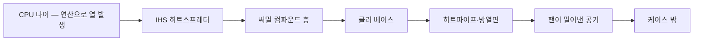
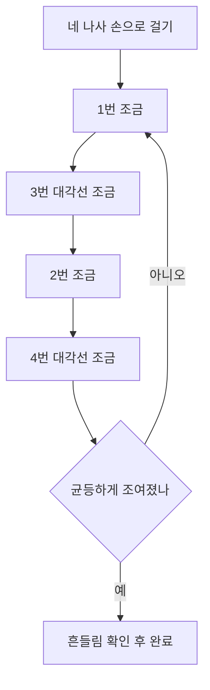
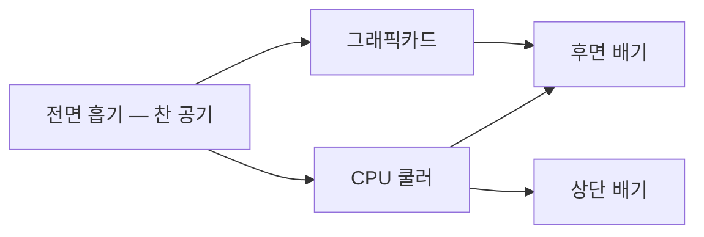
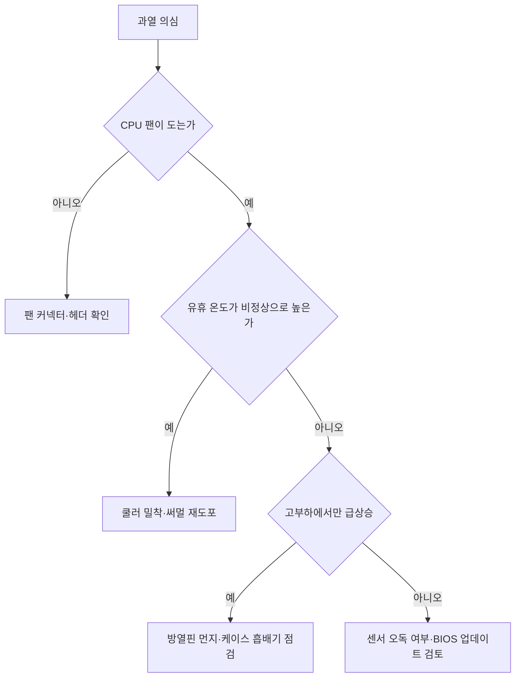

<Callout type="info">
  **이번 문서의 목표:** 이 파일을 다 읽으면 쿨러를 올바른 순서로 체결하고, 팬 커넥터를 제 자리에 꽂고, 케이스의 공기 흐름과 케이블 라우팅을 정리한 뒤, 뚜껑을 닫기 전 마지막 점검표를 한 번에 훑어 감점 요소를 스스로 잡아낼 수 있습니다.
</Callout>

## 마감은 별도의 작업이 아니라 채점 항목이다

조립형 실기에서 감독관이 마지막에 보는 것은 "켜지는가"만이 아닙니다. **뚜껑을 닫은 상태의 완성도**가 함께 점수입니다. 케이블이 팬에 닿아 있으면 감점, 쿨러 나사 한 개가 덜 조여져 있으면 감점, 팬 커넥터가 엉뚱한 헤더에 꽂혀 있으면 감점입니다.

그래서 이 편은 "예쁘게 정리하는 법"이 아니라 **점수를 잃지 않는 마감 절차**로 읽어야 합니다.

> **쉽게 말하면:** 조립은 부품을 넣는 일이고, 마감은 넣은 것들이 서로 방해하지 않게 만드는 일입니다.

## 1. 열은 어떤 길로 빠져나가는가

### 열전달 경로

CPU가 만든 열은 다음 순서로 이동합니다. 이 사슬 중 **한 군데만 끊겨도 온도가 치솟습니다.**

각 단계의 의미는 이렇습니다.

| 단계 | 이름 | 하는 일 | 여기서 끊기면 |
|------|------|---------|---------------|
| 1 | 다이(die) | 실제 연산이 일어나는 실리콘 | – |
| 2 | IHS | CPU 위의 금속 뚜껑, 열을 넓게 퍼뜨림 | – |
| 3 | 써멀 컴파운드 | IHS와 쿨러 사이의 미세한 틈을 메움 | 미도포·과다 도포 시 급격한 온도 상승 |
| 4 | 쿨러 베이스 | 열을 받아 히트파이프로 넘김 | 밀착 불량 시 열이 전달되지 않음 |
| 5 | 방열핀 | 표면적을 늘려 공기에 열을 넘김 | 먼지가 쌓이면 효율 급감 |
| 6 | 팬 | 데워진 공기를 밀어냄 | 팬 미연결·역방향 시 열이 고임 |
| 7 | 케이스 배기 | 뜨거운 공기를 밖으로 | 흡배기 불균형 시 내부에 열이 갇힘 |

### 왜 써멀 컴파운드가 필요한가

금속 두 면을 아무리 매끄럽게 깎아도 현미경으로 보면 울퉁불퉁하고, 그 사이에는 **공기**가 들어갑니다. 공기는 열을 거의 전달하지 않는 단열재입니다. 써멀 컴파운드는 그 공기 틈을 열이 잘 통하는 물질로 대신 채우는 역할을 합니다.

<Callout type="warning">
  **자주 하는 오해:** 써멀을 많이 바를수록 좋다고 생각하는 경우가 많습니다. 반대입니다. 써멀 자체는 금속보다 열전도가 나쁩니다. **틈을 메울 만큼만 얇게** 있어야 하고, 두꺼우면 오히려 저항이 됩니다. 넘쳐서 소켓이나 메인보드로 흘러내리면 그 자체가 감점이자 고장 원인입니다.
</Callout>

### 도포 방법

| 방식 | 설명 | 적합한 상황 |
|------|------|-------------|
| 완두콩 크기 한 점 | 중앙에 쌀알–완두콩 크기로 한 점 | 정사각형에 가까운 인텔 소비자용 CPU |
| 가는 선 두 줄 | 세로로 얇은 선 두 개 | 직사각형이 긴 CPU |
| 얇게 펴 바르기 | 카드로 전체를 얇게 도포 | IHS가 넓은 경우, 숙련자 |

기본은 **중앙 한 점**입니다. 쿨러를 누르면 압력으로 저절로 퍼집니다. 손으로 펴 바르다가 기포가 들어가는 것보다 낫습니다.

### 재도포가 필요한 경우

쿨러를 한 번 떼어냈다면 **써멀은 반드시 닦아내고 새로 발라야 합니다.** 한 번 눌려 퍼진 층을 다시 붙이면 그 사이에 공기가 들어가기 때문입니다. 닦을 때는 마른 천으로 굵게 걷어낸 뒤 소독용 알코올을 적신 천으로 마무리합니다.

## 2. 쿨러 체결 — 순서가 곧 밀착도다

### 대각선 순서로 조인다

나사가 네 개라면 시계 방향으로 차례대로 조이면 안 됩니다. 먼저 조인 쪽이 먼저 눌려 쿨러가 **기울어진 채로 고정**되고, 한쪽 면만 CPU에 닿게 됩니다.

<Steps>

### 네 나사를 손으로 가볍게 걸어 둔다

한 바퀴씩만 돌려 위치를 잡습니다. 이 단계에서 조이면 안 됩니다.

### 대각선 짝으로 조금씩 조인다

1번을 조였으면 다음은 맞은편인 3번, 그다음 2번, 그다음 4번 순서입니다. 한 번에 다 조이지 말고 두세 바퀴씩 돌아가며 균등하게 압력을 올립니다.

### 더 돌아가지 않을 때 멈춘다

스프링 나사는 끝까지 들어가면 헛도는 느낌이 옵니다. 그 이상 힘을 주면 메인보드가 휩니다.

### 쿨러를 좌우로 살짝 흔들어 본다

미세하게도 움직이면 덜 조인 것입니다. 다시 순서대로 조입니다.

</Steps>

### 쿨러 방향

타워형 공랭 쿨러는 **바람이 후면 배기 팬 쪽을 향하도록** 답니다. 케이스 앞에서 뒤로 흐르는 전체 공기 흐름과 방향을 맞추는 것입니다. 반대로 달면 CPU 열이 케이스 앞쪽으로 밀려 그래픽카드 위에 고입니다.

### 백플레이트

메인보드 뒷면의 받침판입니다. 나사 압력이 보드 한 점에 몰리지 않게 받쳐 주는 역할입니다. 케이스에 보드를 넣기 **전에** 붙여야 하는 경우가 많으니, 작업 순서를 뒤집지 않도록 주의합니다. 케이스에 백플레이트용 개구부가 있으면 나중에도 가능합니다.

## 3. 팬 커넥터 — 어디에 꽂는가

### 헤더 종류

| 헤더 이름 | 용도 | 놓치면 생기는 일 |
|-----------|------|------------------|
| `CPU_FAN` | CPU 쿨러 팬 | POST 단계에서 CPU Fan Error로 부팅 정지 |
| `CPU_OPT` | CPU 보조 팬(2번째 팬) | 보조 팬만 미동작 |
| `SYS_FAN` 또는 `CHA_FAN` | 케이스 팬 | 케이스 환기 저하 |
| `AIO_PUMP` / `W_PUMP` | 수랭 펌프 | 펌프 미동작 시 급격한 과열 |
| `ARGB` / `RGB` | 조명 전용 | 조명만 미동작 |

<Callout type="warning">
  **CPU 쿨러 팬을 `SYS_FAN` 에 꽂는 실수**가 실기에서 가장 흔합니다. 조립은 멀쩡히 끝났는데 전원을 켜면 "CPU Fan Error, Press F1"이 뜨고 멈춥니다. 팬은 돌고 있는데 에러가 나므로 원인을 못 찾는 경우가 많습니다. **팬이 돈다고 정답이 아니라, 지정된 헤더에 꽂혀 있어야 정답입니다.**
</Callout>

### 3핀과 4핀

| 구분 | 핀 구성 | 속도 조절 방식 |
|------|---------|----------------|
| 3핀 | 전원, 접지, 회전수 신호 | 공급 전압을 낮춰 조절(DC 방식) |
| 4핀 | 3핀 + 제어 신호 | 전압은 그대로, 펄스 폭으로 조절(PWM 방식) |

**PWM**(Pulse Width Modulation, 펄스 폭 변조)은 전원을 아주 빠르게 켰다 껐다 하는 비율로 속도를 조절하는 방식입니다. 전압을 낮추는 방식보다 저속에서 안정적이라 요즘 CPU 쿨러는 대부분 4핀입니다.

4핀 헤더에 3핀 팬을 꽂아도 **동작은 합니다.** 핀 하나가 남고, 대신 속도 제어는 DC 방식으로 해야 합니다. 이때 BIOS에서 팬 제어 방식이 PWM으로 고정되어 있으면 팬이 항상 최대 속도로 돌아 소음이 커집니다. 이 경우 BIOS의 팬 제어 항목을 DC 모드로 바꿉니다.

### 커넥터의 방향

팬 커넥터에는 한쪽에 **돌기 가이드**가 있습니다. 헤더의 플라스틱 벽과 맞추면 한 방향으로만 들어갑니다. 억지로 반대로 밀어 넣으면 핀이 휩니다. 들어가지 않으면 방향이 틀린 것입니다.

## 4. 케이스 공기 흐름

### 기본 원칙

일반적인 데스크톱은 **앞에서 차가운 공기를 들이고, 뒤와 위로 더운 공기를 내보냅니다.** 더운 공기는 위로 뜨기 때문에 상단을 배기로 쓰는 것이 자연 대류와 방향이 맞습니다.

### 팬의 앞뒤 구분

팬에는 방향 표시가 있습니다.

| 확인 방법 | 내용 |
|-----------|------|
| 화살표 각인 | 팬 옆면에 공기 방향과 회전 방향 화살표가 새겨져 있음 |
| 프레임 모양 | 지지대(스포크)가 있는 쪽이 **바람이 나가는 쪽** |
| 라벨 스티커 | 모터 라벨이 붙은 면이 배출 방향 |

가장 확실한 것은 **옆면 화살표**입니다. 표시가 지워졌다면, 전원을 넣고 손을 대어 바람이 나오는 쪽을 확인합니다.

### 양압과 음압

| 상태 | 정의 | 특징 |
|------|------|------|
| 양압 | 흡기 풍량이 배기보다 많음 | 케이스 틈으로 공기가 밖으로 나감, 먼지가 필터를 거쳐 들어와 내부 먼지가 적음 |
| 음압 | 배기 풍량이 흡기보다 많음 | 틈으로 공기가 빨려 들어와 먼지가 곳곳에서 유입, 냉각 효율은 유리할 수 있음 |
| 균형 | 비슷함 | 무난한 절충 |

실기에서는 **전면 흡기 / 후면 배기**라는 기본 배치를 지켰는지, 팬 방향이 서로 싸우지 않는지가 확인 대상입니다. 흡기와 배기가 마주 보며 서로 밀어내면 공기가 순환하지 않습니다.

### 그 밖에 온도를 올리는 것들

| 원인 | 설명 |
|------|------|
| 방열핀 먼지 | 핀 사이가 막히면 표면적이 무용지물이 됨 |
| 필터 막힘 | 전면 흡기 필터가 막히면 흡기량 자체가 줄어듦 |
| 케이스 밀착 배치 | 벽에 딱 붙이면 후면 배기가 다시 빨려 들어옴 |
| 케이블이 팬 앞을 막음 | 흡기 경로 차단 |
| 확장 슬롯 커버 개방 | 열려 있으면 공기 흐름이 지름길로 새 나감 |

## 5. 소음 — 어디서 나는 소리인가

소음은 **소리의 성질**로 발생원을 좁힐 수 있습니다.

| 소리의 성질 | 유력한 원인 | 조치 |
|-------------|-------------|------|
| 규칙적인 드르륵, 팬 속도에 비례 | 팬 날개에 케이블·먼지가 닿음 | 케이블 재정리, 청소 |
| 고음의 위잉, 부하 시 커짐 | 팬 속도가 최대로 고정됨 | BIOS 팬 제어 곡선 조정, 3핀 팬이면 DC 모드로 |
| 낮은 웅웅, 진동 전달 | 케이스 나사 풀림, HDD 진동 | 나사 재조임, 방진 와셔 |
| 딸깍딸깍 반복 | HDD 헤드 이상 | 즉시 백업, 디스크 교체 검토 |
| 지지직 전기 소음 | 파워 코일 소음 | 부하 상태 확인, 지속되면 파워 점검 |
| 갑자기 커졌다 작아짐을 반복 | 온도가 임계값 근처를 오르내림 | 팬 곡선의 히스테리시스 조정, 쿨링 개선 |

<Callout type="warning">
  **딸깍 소리(클릭 노이즈)는 다른 소음과 성격이 다릅니다.** 팬 소음은 불편함이지만 HDD의 반복적인 딸깍 소리는 **데이터 손실 직전 신호**일 수 있습니다. 진단 문항에서 이 소리가 언급되면 "저장장치 물리 불량, 즉시 백업"이 정답 방향입니다.
</Callout>

### BIOS 팬 제어

메인보드 제조사마다 이름이 다릅니다.

| 제조사 계열 | 기능 이름 |
|-------------|-----------|
| ASUS | Q-Fan Control |
| GIGABYTE | Smart Fan |
| MSI | Hardware Monitor |
| ASRock | FAN-Tastic Tuning |

공통으로 조절하는 값은 **온도 대비 팬 속도 곡선**입니다. 특정 온도에서 몇 퍼센트로 돌지를 점으로 지정합니다. 저온에서 속도를 낮추면 조용해지고, 고온 구간을 가파르게 하면 과열을 막습니다.

## 6. 케이블 정리

### 왜 정리가 점수인가

| 이유 | 설명 |
|------|------|
| 공기 흐름 | 케이블 다발이 흡기 앞을 막으면 냉각이 나빠짐 |
| 안전 | 팬 날개에 닿으면 소음과 파손 |
| 정비성 | 나중에 부품을 교체할 때 접근 가능 |
| 접촉 신뢰성 | 당겨진 상태의 커넥터는 진동으로 빠짐 |

### 라우팅 원칙

<Steps>

### 뒷면 공간으로 넘긴다

메인보드 트레이 뒤쪽에는 케이블용 공간이 있습니다. 전원 케이블은 앞면에서 최단거리로 가로지르지 말고 **가까운 구멍으로 넣어 뒤로 넘긴 뒤, 목적지 근처 구멍으로 다시 꺼냅니다.**

### 굵은 것부터 자리를 잡는다

24핀 메인 전원과 8핀 CPU 보조 전원처럼 굵고 뻣뻣한 케이블의 경로를 먼저 정합니다. 나중에 넣으려면 다른 케이블을 다 풀어야 합니다.

### 여유를 조금 남긴다

팽팽하게 당기면 커넥터에 힘이 걸립니다. 손가락 하나 들어갈 여유를 둡니다.

### 타이로 묶는다

케이블 타이나 벨크로로 다발을 정리합니다. 조일 때 **신호선을 짓눌러 꺾지 않도록** 적당히 조입니다.

### 팬 반경을 확인한다

모든 팬 주위를 손으로 훑어 케이블이 닿는 곳이 없는지 확인합니다.

</Steps>

### 케이블별 자리

| 케이블 | 출발 | 도착 | 주의 |
|--------|------|------|------|
| 24핀 ATX | 파워 | 메인보드 우측 | 걸쇠가 딸깍 걸릴 때까지 |
| 8핀 EPS | 파워 | 보드 좌측 상단 | PCIe 8핀과 혼동 금지, 형상이 다름 |
| PCIe 보조 전원 | 파워 | 그래픽카드 | 여러 개면 모두 연결 |
| SATA 전원 | 파워 | 저장장치 | 방향 L자 홈 확인 |
| SATA 데이터 | 보드 포트 | 저장장치 | 부팅 디스크는 낮은 번호 포트 권장 |
| 전면 패널 | 케이스 | `F_PANEL` 헤더 | 극성이 있는 LED 주의 |
| 전면 USB | 케이스 | `F_USB` / `USB3` 헤더 | 핀 휨 주의 |
| 전면 오디오 | 케이스 | `F_AUDIO` 헤더 | 누락 시 전면 잭 무음 |

## 7. 뚜껑을 닫기 전 마지막 점검

<Steps>

### 눈으로 훑기

빠진 커넥터, 반쯤 걸린 커넥터, 남은 나사, 케이스 안에 굴러다니는 부품이 없는지 봅니다. **떨어진 나사 한 개가 보드 뒤에서 합선을 일으킵니다.**

### 손으로 확인하기

그래픽카드, RAM, 쿨러, 저장장치를 가볍게 눌러 흔들림이 없는지 봅니다.

### 나사 개수 세기

메인보드 스탠드오프 나사, 확장카드 브래킷 나사, 케이스 측면 나사를 빠짐없이 채웠는지 셉니다.

### 팬 회전 방향 확인

전원을 넣고 각 팬의 바람 방향이 계획대로인지 손등으로 확인합니다.

### 첫 부팅 관찰

POST 화면 진입, CPU Fan Error 유무, BIOS의 온도·팬 회전수 표시를 봅니다.

### 온도 확인

BIOS 하드웨어 모니터에서 유휴 상태 CPU 온도를 봅니다.

### 측면 패널 닫고 재확인

패널을 닫은 뒤 소음이 새로 생기면 케이블이 패널에 눌린 것입니다.

</Steps>

### 온도 판단 기준

| 상태 | 대략적인 목표 | 이상 신호 |
|------|---------------|-----------|
| 유휴 | 30–50도 | 유휴인데 70도 이상이면 밀착·써멀 의심 |
| 일반 작업 | 40–65도 | – |
| 고부하 | 70–85도 | 90도 이상 지속, 클럭이 떨어짐 |

정확한 한계 온도는 CPU 모델마다 다릅니다. 시험에서는 절대값 암기보다 **유휴 상태인데도 온도가 매우 높다 → 쿨러 밀착 또는 써멀 문제, 팬 미연결 의심**이라는 판단 흐름이 중요합니다.

### 과열 증상의 분기

**열 스로틀링**(thermal throttling)은 CPU가 한계 온도에 닿으면 스스로 클럭을 낮춰 열을 줄이는 보호 동작입니다. 그래서 과열의 첫 증상은 고장이 아니라 **갑작스러운 성능 저하**로 나타나는 경우가 많습니다. "평소보다 느려졌다"는 증상에서 과열을 후보로 두는 이유입니다.

## 8. 감점 포인트 총정리

| 감점 항목 | 왜 감점인가 |
|-----------|-------------|
| 쿨러 나사 일부만 조임 | 밀착 불균형, 접촉 불량 |
| CPU 팬을 `SYS_FAN` 에 연결 | 지정 헤더 위반, Fan Error |
| 써멀 과다 도포·미도포 | 열전달 실패 또는 오염 |
| 팬 방향이 서로 반대 | 공기 순환 불성립 |
| 케이블이 팬에 접촉 | 소음·파손 위험 |
| 24핀·8핀이 반쯤 걸림 | 진동으로 이탈, 불안정 |
| 케이스 나사 누락 | 마감 미완료 |
| 확장카드 브래킷 미고정 | 카드 이탈 위험 |
| 케이스 내부에 공구·나사 방치 | 합선 위험, 즉시 감점 |
| 전면 패널 케이블 미연결 | 전원 버튼·전면 포트 미동작 |

## 핵심 정리

- 열은 다이에서 써멀, 쿨러, 팬, 케이스 배기까지 사슬로 이동하며 한 단계만 끊겨도 온도가 급등합니다.
- 써멀 컴파운드는 틈을 메울 만큼만 얇게 바르고, 쿨러를 뗐다면 반드시 닦고 재도포합니다.
- 쿨러 나사는 대각선 순서로 조금씩 돌아가며 조여 균등한 밀착을 만듭니다.
- CPU 쿨러 팬은 반드시 `CPU_FAN` 헤더에 연결해야 하며, 다른 헤더에 꽂으면 POST에서 Fan Error가 납니다.
- 케이블은 뒷면 공간으로 넘겨 라우팅하고, 뚜껑을 닫기 전 나사·커넥터·팬 반경을 순서대로 점검합니다.

## 마무리 복습

<Quiz
  questionNumber={1}
  question="CPU 쿨러의 팬 커넥터를 SYS_FAN 헤더에 연결했을 때 나타나는 대표적인 증상은?"
  options={['팬이 아예 돌지 않는다', '팬은 돌지만 POST 단계에서 CPU Fan Error가 표시되며 부팅이 멈춘다', 'BIOS에 진입할 수 없다', '메모리 인식이 되지 않는다']}
  correctAnswer={2}
  explanation="메인보드는 CPU_FAN 헤더의 회전수 신호로 CPU 쿨러 동작 여부를 판단합니다. 다른 헤더에 꽂으면 팬은 전원을 받아 돌지만 CPU_FAN 신호가 없으므로 Fan Error로 부팅이 중단됩니다."
  optionExplanations={['다른 헤더에서도 전원은 공급되므로 팬은 돕니다', '신호 감지 실패로 인한 전형적인 증상입니다', 'F1을 누르면 BIOS 진입 자체는 가능합니다', '메모리 인식과는 무관한 항목입니다']}
/>

<Quiz
  questionNumber={2}
  question="써멀 컴파운드를 두껍게 바르면 안 되는 이유로 옳은 것은?"
  options={['컴파운드가 전기를 통하게 만들기 때문', '컴파운드 자체는 금속보다 열전도가 낮아 두꺼우면 오히려 열 저항이 되기 때문', '쿨러 나사가 들어가지 않기 때문', '컴파운드가 팬 속도를 낮추기 때문']}
  correctAnswer={2}
  explanation="써멀 컴파운드의 목적은 금속 표면의 미세한 틈에 낀 공기를 대체하는 것입니다. 필요 이상으로 두꺼우면 그 층 자체가 열 전달을 방해하고 넘쳐서 주변을 오염시킵니다."
  optionExplanations={['일반 컴파운드는 비전도성 제품이 많고 이것이 핵심 이유가 아닙니다', '얇게 발라야 하는 근본 이유입니다', '체결 자체는 가능하며 밀착이 나빠질 뿐입니다', '팬 속도와는 관계가 없습니다']}
/>

<Quiz
  questionNumber={3}
  question="네 개의 나사로 고정하는 CPU 쿨러의 올바른 체결 순서는?"
  options={['1번을 끝까지 조인 뒤 2, 3, 4번 순서로 시계 방향으로 조인다', '네 나사를 가볍게 건 뒤 대각선 짝으로 조금씩 번갈아 조인다', '2번과 4번만 조인다', '아무 순서나 상관없이 최대한 세게 조인다']}
  correctAnswer={2}
  explanation="한쪽부터 끝까지 조이면 쿨러가 기울어져 CPU 표면과 부분적으로만 닿습니다. 대각선으로 조금씩 번갈아 조여야 압력이 고르게 걸려 밀착이 균등해집니다."
  optionExplanations={['먼저 조인 쪽으로 기울어져 밀착이 불균등해집니다', '균등한 압력을 만드는 표준 방법입니다', '고정력이 부족해 이탈 위험이 있습니다', '과도한 힘은 메인보드를 휘게 만듭니다']}
/>

<Quiz
  questionNumber={4}
  question="4핀 팬 헤더가 사용하는 PWM 제어 방식의 원리는?"
  options={['공급 전압의 크기를 낮춰 속도를 줄인다', '전압은 유지한 채 전원을 매우 빠르게 켜고 끄는 비율로 속도를 조절한다', '팬 날개 각도를 바꾼다', '팬에 저항을 직렬로 연결한다']}
  correctAnswer={2}
  explanation="PWM은 펄스 폭 변조로, 일정한 전압을 빠르게 단속하는 비율을 조정해 평균 출력을 바꿉니다. 전압을 낮추는 DC 방식보다 저속 구간에서 안정적입니다."
  optionExplanations={['이것은 3핀에서 쓰는 DC 방식입니다', 'PWM의 정확한 원리입니다', '팬 날개는 고정된 형상입니다', '외부 저항 방식은 표준 제어 방식이 아닙니다']}
/>

<Quiz
  questionNumber={5}
  question="일반적인 데스크톱 케이스의 표준 공기 흐름 방향은?"
  options={['전면 배기, 후면 흡기', '전면 흡기, 후면과 상단 배기', '상단 흡기, 하단 배기', '모든 팬을 흡기로 설정']}
  correctAnswer={2}
  explanation="찬 공기를 앞에서 들이고 데워진 공기를 뒤와 위로 내보내는 것이 표준입니다. 더운 공기가 위로 뜨는 자연 대류 방향과 일치하기 때문입니다."
  optionExplanations={['방향이 반대라 부품에 더운 공기가 먼저 닿습니다', '자연 대류와 일치하는 표준 배치입니다', '더운 공기를 아래로 밀어내는 비효율적인 배치입니다', '배기가 없으면 내부 압력만 오르고 열이 빠지지 않습니다']}
/>

<Quiz
  questionNumber={6}
  question="유휴 상태인데도 CPU 온도가 매우 높게 표시되는 경우 가장 먼저 의심할 항목은?"
  options={['그래픽카드 드라이버 버전', '쿨러 밀착 불량 또는 써멀 도포 문제', '네트워크 케이블 규격', '모니터 주사율 설정']}
  correctAnswer={2}
  explanation="부하가 없는데도 온도가 높다는 것은 발열량이 아니라 열이 빠져나가지 못하는 전달 경로의 문제를 뜻합니다. 밀착 불량, 써멀 미도포, 팬 미연결이 대표적인 원인입니다."
  optionExplanations={['드라이버는 유휴 온도와 직접 관계가 없습니다', '열전달 경로의 문제를 우선 확인해야 합니다', '네트워크와 무관합니다', '표시 설정과 무관합니다']}
/>

<Quiz
  questionNumber={7}
  question="저장장치에서 규칙적인 딸깍 소리가 반복될 때 가장 우선해야 할 조치는?"
  options={['팬 속도 곡선을 조정한다', '즉시 데이터를 백업하고 디스크 교체를 검토한다', '케이스 나사를 다시 조인다', '써멀 컴파운드를 재도포한다']}
  correctAnswer={2}
  explanation="반복적인 클릭 노이즈는 HDD 헤드 계통의 물리적 이상을 시사하며 데이터 손실 직전 신호일 수 있습니다. 원인 분석보다 백업이 우선입니다."
  optionExplanations={['팬 소음과 성질이 다른 소리입니다', '데이터 보호가 최우선인 상황입니다', '진동 소음이 아닌 헤드 이상 신호입니다', 'CPU 냉각과 무관한 증상입니다']}
/>

<Quiz
  questionNumber={8}
  question="케이스 팬의 바람이 나가는 방향을 판별하는 가장 확실한 방법은?"
  options={['팬 옆면에 새겨진 화살표 표시를 확인한다', '팬의 색상으로 구분한다', '케이블 길이로 판단한다', '팬의 나사 구멍 개수로 판단한다']}
  correctAnswer={1}
  explanation="대부분의 팬 프레임 옆면에는 공기 흐름 방향과 회전 방향 화살표가 각인되어 있습니다. 지지대가 있는 쪽이 배출 방향이라는 형상 규칙도 보조 단서가 됩니다."
  optionExplanations={['각인된 화살표가 표준 판별 방법입니다', '색상은 방향과 무관합니다', '케이블 길이는 방향 정보가 아닙니다', '나사 구멍은 규격상 네 개로 동일합니다']}
/>

<Quiz
  questionNumber={9}
  question="조립 마감 시 케이스 내부에 나사가 굴러다니는 상태를 즉시 바로잡아야 하는 이유는?"
  options={['보기에 좋지 않아서', '금속 나사가 메인보드 회로에 닿아 합선을 일으킬 수 있어서', '무게가 늘어나서', '팬 소음이 줄어들어서']}
  correctAnswer={2}
  explanation="전도성 금속이 통전 중인 기판에 접촉하면 단락이 발생해 부품이 손상될 수 있습니다. 안전 항목이자 명확한 감점 사유입니다."
  optionExplanations={['미관보다 심각한 안전 문제입니다', '단락으로 인한 부품 손상 위험이 핵심입니다', '무게는 문제가 아닙니다', '소음과 무관합니다']}
/>

<Quiz
  questionNumber={10}
  question="열 스로틀링이 발생했을 때 사용자가 체감하는 대표적인 증상은?"
  options={['화면 해상도가 낮아진다', '갑작스러운 성능 저하가 나타난다', '네트워크가 끊어진다', '사운드 장치가 사라진다']}
  correctAnswer={2}
  explanation="열 스로틀링은 한계 온도에 도달한 CPU가 스스로 클럭을 낮춰 발열을 줄이는 보호 동작입니다. 그래서 과열의 첫 신호는 고장이 아니라 성능 저하로 나타납니다."
  optionExplanations={['해상도는 그래픽 설정 항목입니다', '클럭 저하로 인한 전형적인 체감 증상입니다', '네트워크와 직접 관계가 없습니다', '장치 목록과는 무관합니다']}
/>

## 참고 자료

- [한국정보통신자격협회 - PC정비사 2급](https://www.icqa.or.kr/cn/page/pc)
- [Intel - How to Configure the System in UEFI Mode before Installing Windows](https://www.intel.com/content/www/us/en/support/articles/000025535/memory-and-storage/intel-optane-memory.html)
- [Intel - Supported Memory and Memory Population Rules for the Intel Server Board S2600WF](https://www.intel.com/content/www/us/en/support/articles/000055509/server-products/server-boards.html)
