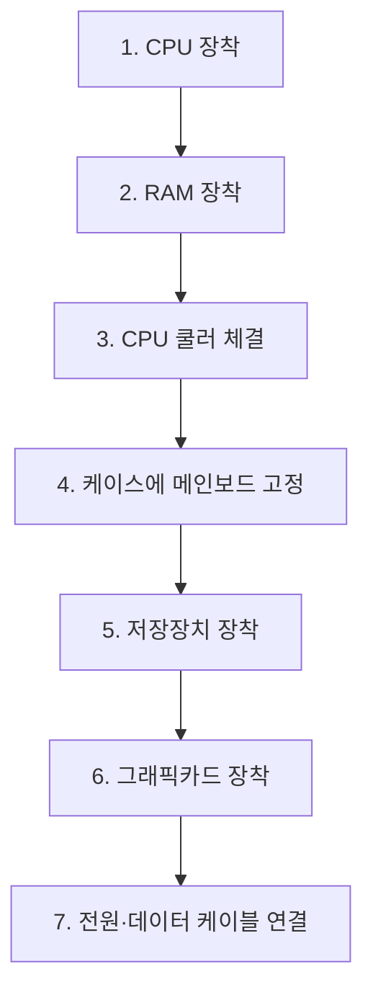

<Callout type="warning">
  **이 문서는 실제 기출문제의 복제가 아닙니다.** 공개된 출제 유형과 채점 관점을 바탕으로 **재구성한 연습 과제**이며, 값·조건·수치는 학습 목적에 맞게 바꾸었습니다. 원문의 설명이 불명확하거나 근거가 약한 부분은 표준 규격에 맞게 바로잡아 실었습니다. 실제 시험의 문항 수·배점·화면 구성은 시행 회차에 따라 달라질 수 있으므로 반드시 시행처 공지를 확인하세요.
</Callout>

<Callout type="info">
  **이번 문서의 목표:** 이 파일을 다 읽으면 T568B 배선을 순서까지 정확히 외워 다이렉트 케이블을 만들 수 있고, 백패널 포트를 색과 형상으로 구분할 수 있으며, 조립 직후 최초 부팅에서 무엇을 어떤 순서로 확인해야 하는지 말할 수 있습니다.
</Callout>

## 이 편에서 다루는 과제 형태

조립·초기 점검 영역은 실기에서 **손으로 결과물을 만들어 제출하는 작업형**과 **부품·포트를 식별하는 선택·연결형**으로 나뉩니다.

| 과제 | 형태 | 채점 기준 |
|------|------|-----------|
| 과제 1 | LAN 케이블 제작 | 배선 순서, 피복 처리, 압착 상태, 도통 |
| 과제 2 | 백패널 포트 식별 | 포트 명칭 정확도 |
| 과제 3 | 조립 순서 배열 | 순서의 논리적 타당성 |
| 과제 4 | 최초 부팅 점검 | 확인 항목의 완결성 |
| 과제 5 | 단답형 용어 | 정확한 표기 |

---

## 과제 1. LAN 케이블 제작 (작업형)

### 문제

> 지참한 LAN Tool과 UTP 케이블, RJ-45 커넥터를 사용해 **PC와 공유기의 LAN 포트를 연결하는 케이블**을 제작하시오. 배선 규격은 **T568B**를 사용한다.

### ① 정답

**다이렉트(스트레이트) 케이블 — 양쪽 모두 T568B**

핀 번호와 색은 다음과 같습니다. 양쪽 커넥터가 **완전히 동일한 순서**여야 합니다.

| 핀 | 색 (T568B) | 짝(페어) | 100BASE-TX에서의 역할 |
|----|------------|----------|------------------------|
| 1 | 흰색–주황 | 2번 페어 | 송신 + |
| 2 | 주황 | 2번 페어 | 송신 – |
| 3 | 흰색–초록 | 3번 페어 | 수신 + |
| 4 | 파랑 | 1번 페어 | 미사용(기가비트에서는 사용) |
| 5 | 흰색–파랑 | 1번 페어 | 미사용(기가비트에서는 사용) |
| 6 | 초록 | 3번 페어 | 수신 – |
| 7 | 흰색–갈색 | 4번 페어 | 미사용(기가비트에서는 사용) |
| 8 | 갈색 | 4번 페어 | 미사용(기가비트에서는 사용) |

외우는 방법은 "**흰주 주 흰초 파 흰파 초 흰갈 갈**"입니다. 흰색 선이 먼저 오고, 초록 페어만 3번과 6번으로 갈라진다는 점이 핵심입니다.

### ② 왜 그렇게 되는가

**첫째, 왜 다이렉트인가.**

이더넷 장비는 신호를 보내는 핀과 받는 핀의 위치가 역할에 따라 정해져 있습니다.

| 구분 | 장비 | 1·2번 핀 | 3·6번 핀 |
|------|------|----------|----------|
| MDI | PC, 서버 등 단말 | 송신 | 수신 |
| MDI-X | 스위치, 허브, 공유기 LAN 포트 | 수신 | 송신 |

PC는 MDI, 공유기 LAN 포트는 MDI-X입니다. **서로 다른 방식끼리 연결**되므로 케이블 안에서 선을 꼬아 줄 필요가 없습니다. 즉 양쪽을 같은 순서로 만드는 다이렉트 케이블이 정답입니다.

반대로 PC와 PC, 스위치와 스위치처럼 **같은 방식끼리** 연결할 때는 케이블 안에서 송수신을 교차시켜야 하며, 이때 한쪽만 T568A로 만든 것이 **크로스 케이블**입니다.

| 연결 조합 | 필요한 케이블 |
|-----------|---------------|
| PC ↔ 공유기 LAN 포트 | 다이렉트 |
| PC ↔ 스위치 | 다이렉트 |
| PC ↔ PC | 크로스 |
| 스위치 ↔ 스위치(일반 포트) | 크로스 |
| 공유기 WAN ↔ 모뎀 | 다이렉트 |

<Callout type="info">
  **현실 보충:** 요즘 장비는 대부분 **Auto MDI/MDIX** 기능이 있어 크로스 케이블을 꽂아도 스스로 핀 역할을 바꿔 통신이 됩니다. 하지만 **시험은 규격 지식을 평가**하므로 문제에 명시된 규격대로 제작해야 하며, 자동 감지 기능을 근거로 다른 케이블을 내면 오답입니다.
</Callout>

**둘째, 왜 3번과 6번이 같은 초록 페어인가.**

UTP 케이블의 여덟 가닥은 두 가닥씩 꼬인 네 쌍입니다. 꼬임은 두 선에 반대 방향의 잡음을 태워 **서로 상쇄시키기 위한 것**입니다. 이 상쇄가 성립하려면 한 신호의 플러스와 마이너스가 **같은 꼬임쌍**에 있어야 합니다.

송신은 1·2번, 수신은 3·6번을 씁니다. 그래서 초록 페어를 3번과 6번에 갈라 배치하는 것이며, 그 사이의 4·5번을 파랑 페어가 채우는 형태가 됩니다. 순서를 마음대로 바꿔 3·4번을 초록으로 쓰면 **꼬임쌍이 어긋나 잡음에 취약해지고**, 길이가 길어질수록 통신이 불안정해집니다. 이것을 **스플릿 페어**(split pair) 오류라고 하며, 짧은 케이블에서는 도통 시험을 통과해 버리기 때문에 더 위험합니다.

### ③ 제작 절차

<Steps>

### 외피 제거

끝에서 약 3cm 정도 겉피복을 벗깁니다. 스트리퍼의 날 깊이가 깊으면 **속 심선의 절연까지 긁혀** 도통 불량이 됩니다. 겉피복만 돌려 자르고 당겨 빼는 감각을 익힙니다.

### 꼬임 풀고 정렬

네 쌍을 풀어 T568B 순서로 나란히 폅니다. 꼬임을 푸는 구간은 **최대한 짧게**, 대체로 13mm 이내로 유지합니다. 길게 풀수록 잡음에 약해집니다.

### 길이 맞춰 자르기

여덟 가닥 끝을 한 번에 직각으로 잘라 길이를 같게 만듭니다. 길이가 들쭉날쭉하면 짧은 선이 커넥터 끝까지 닿지 않아 접촉 불량이 됩니다.

### 커넥터 삽입

RJ-45 커넥터의 걸쇠를 **아래로** 두면 왼쪽이 1번 핀입니다. 여덟 가닥을 동시에 밀어 넣고, 커넥터 앞쪽 투명한 부분으로 **모든 선 끝이 끝까지 닿았는지** 눈으로 확인합니다.

### 겉피복 물림 확인

겉피복이 커넥터 안쪽 압착 턱까지 들어가 있어야 합니다. 심선만 들어가 있으면 당길 때 빠집니다.

### 압착

압착 공구에 넣고 한 번에 끝까지 눌러 딸깍 소리가 날 때까지 쥡니다. 덜 눌리면 금속 날이 심선 절연을 뚫지 못해 도통이 안 됩니다.

### 반대쪽도 동일 순서로

같은 순서로 반대쪽을 제작합니다.

### 도통 시험

케이블 테스터에 양쪽을 꽂아 1번부터 8번까지 **순서대로** 램프가 켜지는지 봅니다. 순서가 뒤바뀌거나 건너뛰면 재작업합니다.

</Steps>

### ④ 자주 하는 실수

| 실수 | 결과 |
|------|------|
| 1번과 3번 색을 바꿔 넣음 | 배선 순서 오류, 전면 감점 |
| 흰색 선의 짝을 잘못 봄(흰초록을 흰파랑으로) | 페어 어긋남 |
| 꼬임을 너무 길게 품 | 도통은 되나 규격 미달, 감점 |
| 심선 끝이 커넥터 끝까지 안 닿음 | 도통 불량 |
| 겉피복이 압착 턱 밖에 있음 | 당기면 빠짐, 마감 불량 |
| 압착을 두 번에 나눠 함 | 불완전 압착 |
| 한쪽만 T568B, 반대쪽을 T568A로 | 크로스 케이블이 되어 문제 조건 위반 |
| 자르지 않고 그대로 삽입 | 길이 불균일 |

---

## 과제 2. 메인보드 백패널 포트 식별 (연결형)

### 문제

> 아래 백패널 그림에서 표시된 네 개의 포트 명칭을 각각 고르시오.
> ① 검은색 사각형 USB 단자 ② 한쪽 모서리가 비대칭으로 깎인 영상 단자 ③ 파란색 사각형 USB 단자 ④ 위아래 대칭인 작은 타원형 단자

### ① 정답

| 표시 | 정답 | 식별 단서 |
|------|------|-----------|
| ① | USB 2.0 | 내부 플라스틱이 **검은색**, 핀 4개 |
| ② | DisplayPort(DP) | 한쪽 모서리가 깎인 **비대칭 사각형**, 걸쇠 있음 |
| ③ | USB 3.0(USB 3.2 Gen 1) | 내부 플라스틱이 **파란색**, 핀 9개 |
| ④ | USB Type-C | 위아래 구분 없는 **작은 타원**, 뒤집어 꽂을 수 있음 |

### ② 원리 — 색과 형상은 규약이다

**USB 단자의 색 규약**

| 색 | 규격 | 이론상 최대 속도 |
|-----|------|------------------|
| 검정 또는 흰색 | USB 2.0 | 480Mbps |
| 파랑 | USB 3.0 / 3.2 Gen 1 | 5Gbps |
| 청록 또는 빨강 | USB 3.1 Gen 2 / 3.2 Gen 2 | 10Gbps |
| 노랑 | 상시 전원 공급 포트 | 규격은 별개 |

USB 3.0이 파란색인 이유는 단순한 표시용이 아닙니다. 2.0은 신호선 한 쌍이지만 3.0은 **송신·수신용 고속 차동쌍이 추가로 들어가 핀이 9개**입니다. 커넥터 안쪽 깊은 곳에 추가 핀이 있으며, 그래서 2.0 기기를 3.0 포트에 꽂아도 앞쪽 4핀만 쓰여 정상 동작합니다. 즉 **하위 호환**이 성립합니다.

**영상 단자의 형상 규약**

| 단자 | 형상 특징 | 비고 |
|------|-----------|------|
| DisplayPort | 한쪽 모서리가 깎인 비대칭, 걸쇠 | VESA 표준 |
| HDMI | 아래쪽이 좁아지는 사다리꼴 | 가전 계열 표준 |
| DVI | 흰색 넓은 커넥터, 나사 고정 | 구형 디지털 |
| D-SUB(VGA) | 파란색 사다리꼴, 15핀 3열, 나사 고정 | 아날로그 |

DP는 **VESA**(Video Electronics Standards Association)가 정한 디스플레이 인터페이스 표준입니다. 걸쇠가 있어 손으로 그냥 당기면 빠지지 않으며, 걸쇠 버튼을 누르고 빼야 합니다. **DP 케이블이 안 빠진다고 힘으로 당기다 포트를 망가뜨리는 것**이 현장의 흔한 사고입니다.

### ③ 자주 하는 실수

| 실수 | 바로잡기 |
|------|----------|
| 파란 포트를 D-SUB로 착각 | D-SUB는 15핀 사다리꼴, USB 3.0은 사각형 |
| DP와 HDMI 혼동 | DP는 한쪽 모서리 깎임, HDMI는 사다리꼴 |
| Type-C를 마이크로 USB로 답함 | Type-C는 상하 대칭 타원 |
| USB 3.0을 USB 3.1이라고 표기 | 색이 파랑이면 Gen 1 계열로 답함 |

---

## 과제 3. 조립 순서 배열

### 문제

> 다음 작업을 조립 순서에 맞게 배열하시오.
> ㉠ 케이스에 메인보드 고정 ㉡ CPU 장착 ㉢ 그래픽카드 장착 ㉣ RAM 장착 ㉤ CPU 쿨러 체결 ㉥ 전원 케이블 연결 ㉦ 저장장치 장착

### ① 정답

**㉡ → ㉣ → ㉤ → ㉠ → ㉦ → ㉢ → ㉥**

### ② 원리 — 왜 이 순서인가

| 순서 | 이유 |
|------|------|
| CPU를 가장 먼저 | 소켓 레버 조작에 공간이 필요하고, 케이스에 넣은 뒤에는 손이 들어가지 않음 |
| RAM을 쿨러보다 먼저 | 큰 타워 쿨러는 첫 번째 DIMM 슬롯 위를 덮어 나중에 꽂기 어려움 |
| 쿨러를 케이스 밖에서 | 백플레이트 부착과 대각선 조임이 평평한 곳에서 훨씬 정확함 |
| 그래픽카드를 나중에 | 먼저 꽂으면 SATA 포트와 전면 패널 헤더를 가려 손이 못 들어감 |
| 케이블 연결을 마지막 | 부품이 다 자리 잡은 뒤 라우팅해야 다시 풀 일이 없음 |

<Callout type="warning">
  **순서 위반의 대가:** 그래픽카드를 먼저 꽂고 SATA 케이블을 연결하려 하면, 카드를 다시 빼거나 손등을 긁혀 가며 억지로 끼우게 됩니다. 후자는 커넥터를 반쯤 걸린 상태로 만들어 **부팅 후 저장장치 미인식**으로 이어집니다. 순서는 취향이 아니라 실패 확률의 문제입니다.
</Callout>

### ③ 조립 전 준비의 필수 항목

| 항목 | 이유 |
|------|------|
| 정전기 방지 손목띠 착용 또는 금속부 접촉 | 인체 정전기가 반도체를 손상시킴 |
| 파워 스위치 차단 및 전원선 분리 | 대기 전원이 살아 있으면 부품 손상 |
| 부품을 정전기 방지 봉투 위에 둠 | 일반 비닐·카펫은 대전 위험 |
| 스탠드오프 위치 확인 | 잘못된 위치의 스탠드오프는 보드 뒷면 합선의 원인 |

---

## 과제 4. 최초 부팅 점검

### 문제

> 조립을 마친 뒤 처음 전원을 넣었을 때 수행해야 할 점검 항목을 순서대로 서술하시오.

### ① 정답 — 표준 순서

<Steps>

### 전원부 반응 확인

파워 스위치를 켜고 전면 전원 버튼을 눌렀을 때 **팬이 도는지, 메인보드 LED가 켜지는지** 봅니다. 아무 반응이 없으면 파워 스위치, 전면 패널 헤더, 24핀·8핀 체결을 순서대로 확인합니다.

### POST 진행 확인

화면에 제조사 로고나 POST 메시지가 뜨는지 봅니다. **CPU Fan Error**가 뜨면 팬 커넥터가 `CPU_FAN` 이 아닌 곳에 꽂힌 것입니다.

### BIOS 진입

`Del` 또는 `F2` 로 BIOS에 들어갑니다.

### 인식 항목 대조

BIOS 메인 화면에서 다음을 눈으로 확인합니다.

### CPU 모델명과 클럭

장착한 제품과 일치하는지 봅니다.

### 메모리 총 용량

두 장을 꽂았는데 한 장 용량만 잡히면 슬롯 접촉 불량입니다.

### 저장장치 목록

SATA 또는 NVMe 장치가 모두 보이는지 봅니다.

### 팬 회전수와 온도

하드웨어 모니터에서 CPU 팬 RPM이 0이 아닌지, 온도가 비정상적으로 높지 않은지 봅니다.

### 부팅 순서 지정

설치 미디어를 첫 순위로 지정하고 저장 후 종료합니다.

</Steps>

### ② 원리 — POST가 알려주는 것

**POST**(Power-On Self-Test, 전원 인가 자가 진단)는 전원이 들어온 직후 펌웨어가 핵심 부품을 순서대로 확인하는 절차입니다. 확인 순서는 대체로 **CPU → 메모리 → 그래픽 → 저장장치** 방향이며, 앞 단계에서 막히면 뒤 단계는 시도조차 하지 않습니다.

그래서 **증상이 멈춘 지점이 곧 고장 후보**입니다.

| 증상 | 막힌 지점 | 우선 확인 |
|------|-----------|-----------|
| 팬도 안 돔, LED 없음 | 전원 인가 이전 | 파워 스위치, 전면 패널, 24핀 |
| 팬은 도는데 화면 없음 | CPU 또는 메모리 단계 | RAM 재장착, CPU 보조 8핀 |
| 화면은 나오나 저장장치 없음 | 저장장치 단계 | SATA 데이터·전원, M.2 나사 |
| 부팅 미디어를 못 찾음 | 부팅 순서 | BIOS 부팅 우선순위 |

### ③ 자주 하는 실수

| 실수 | 결과 |
|------|------|
| 파워 뒷면 스위치를 켜지 않음 | 전원 무반응, 원인 탐색에 시간 낭비 |
| 전면 패널 헤더의 전원 스위치 핀을 잘못 꽂음 | 버튼을 눌러도 반응 없음 |
| CPU 보조 8핀 미연결 | 팬은 도나 화면이 안 나옴 |
| 외장 그래픽 장착 상태에서 보드 단자에 모니터 연결 | 화면 무출력 |
| BIOS에서 저장 없이 종료 | 설정이 반영되지 않음 |

---

## 과제 5. 단답형

| 문제 | 정답 | 근거 |
|------|------|------|
| 데이터·영상·전원을 하나의 케이블로 전송하며 번개 모양 아이콘이 표시된 다용도 인터페이스 | 썬더볼트(Thunderbolt) | Type-C 형상을 공유하되 별도 규격 |
| VESA가 제정한 디스플레이 인터페이스 표준으로 한쪽 모서리가 깎인 단자 | DisplayPort(DP) | 형상 비대칭, 걸쇠 구조 |
| 여덟 가닥을 두 가닥씩 꼬아 잡음을 상쇄시키는 비차폐 케이블 | UTP | Unshielded Twisted Pair |
| 이더넷에서 송신과 수신 핀 배치가 단말과 반대인 장비 쪽 방식 | MDI-X | 스위치·공유기 LAN 포트 |

**썬더볼트와 USB Type-C의 관계**는 자주 헷갈립니다. Type-C는 **커넥터 모양의 이름**이고, 썬더볼트는 그 모양을 빌려 쓰는 **전송 규격의 이름**입니다. 그래서 생김새가 같아도 썬더볼트 포트에는 번개 아이콘이 따로 표시됩니다. 아이콘이 없는 Type-C 포트에 썬더볼트 전용 기기를 꽂으면 동작하지 않거나 속도가 떨어집니다.

## 핵심 정리

- T568B 순서는 흰주황, 주황, 흰초록, 파랑, 흰파랑, 초록, 흰갈색, 갈색이며 다이렉트 케이블은 양쪽이 동일합니다.
- 초록 페어가 3번과 6번으로 갈라지는 이유는 송신·수신 신호를 같은 꼬임쌍에 두어 잡음을 상쇄하기 위해서입니다.
- 백패널에서 검정은 USB 2.0, 파랑은 USB 3.0이며 DP는 한쪽 모서리가 깎인 비대칭 단자입니다.
- 조립 순서는 CPU, RAM, 쿨러를 케이스 밖에서 끝낸 뒤 보드를 넣고 저장장치, 그래픽카드, 케이블 순입니다.
- 최초 부팅 점검은 전원 반응, POST 진행, BIOS 인식 항목, 팬·온도, 부팅 순서의 순서로 확인합니다.

## 마무리 복습

<Quiz
  questionNumber={1}
  question="T568B 배선에서 3번 핀에 오는 색은?"
  options={['주황', '흰색-초록', '파랑', '흰색-파랑']}
  correctAnswer={2}
  explanation="T568B 순서는 흰주황, 주황, 흰초록, 파랑, 흰파랑, 초록, 흰갈색, 갈색입니다. 3번은 흰색-초록이며 초록은 6번에 배치됩니다."
  optionExplanations={['주황은 2번 핀입니다', '3번 핀의 정답입니다', '파랑은 4번 핀입니다', '흰색-파랑은 5번 핀입니다']}
/>

<Quiz
  questionNumber={2}
  question="PC와 공유기의 LAN 포트를 연결할 때 사용하는 케이블은?"
  options={['양쪽 모두 T568B인 다이렉트 케이블', '한쪽은 T568A 한쪽은 T568B인 크로스 케이블', '롤오버 케이블', '광 점퍼 케이블']}
  correctAnswer={1}
  explanation="PC는 MDI, 공유기 LAN 포트는 MDI-X로 송수신 핀 배치가 이미 반대입니다. 따라서 케이블에서 교차시킬 필요가 없어 양쪽을 같은 규격으로 만드는 다이렉트 케이블을 사용합니다."
  optionExplanations={['서로 다른 방식의 장비를 연결하는 표준입니다', '크로스는 같은 방식끼리 연결할 때 씁니다', '롤오버는 콘솔 접속용입니다', '광케이블은 UTP 과제와 무관합니다']}
/>

<Quiz
  questionNumber={3}
  question="초록 페어를 3번과 6번 핀에 나누어 배치하는 이유는?"
  options={['색 구분을 쉽게 하기 위해', '수신 신호의 플러스와 마이너스를 같은 꼬임쌍에 두어 잡음을 상쇄하기 위해', '커넥터에 잘 들어가게 하기 위해', '전원 공급을 나누기 위해']}
  correctAnswer={2}
  explanation="꼬임쌍은 두 선에 실린 잡음을 서로 상쇄시키는 구조입니다. 한 신호의 양극과 음극이 같은 페어에 있어야 상쇄가 성립하므로 수신용인 3번과 6번에 초록 페어를 배치합니다."
  optionExplanations={['색 구분은 부수적인 효과입니다', '꼬임쌍 유지가 배치의 근본 이유입니다', '삽입 편의와는 무관합니다', 'UTP의 이 핀들은 전원 공급용이 아닙니다']}
/>

<Quiz
  questionNumber={4}
  question="꼬임을 필요 이상으로 길게 풀어 제작한 케이블에서 발생할 수 있는 문제는?"
  options={['커넥터가 아예 안 들어간다', '짧은 거리에서는 도통 시험을 통과하지만 잡음에 취약해 통신이 불안정해진다', '전원이 공급되지 않는다', '색이 변한다']}
  correctAnswer={2}
  explanation="꼬임이 풀린 구간은 잡음 상쇄가 되지 않는 취약 구간입니다. 테스터는 도통만 확인하므로 통과할 수 있으나 실제 통신 품질이 떨어지고 규격상으로도 감점 대상입니다."
  optionExplanations={['삽입 자체는 가능합니다', '도통 시험만으로는 걸러지지 않는 대표적 결함입니다', 'UTP 통신선에서 전원 문제는 별개입니다', '물리적 색 변화는 일어나지 않습니다']}
/>

<Quiz
  questionNumber={5}
  question="RJ-45 커넥터에서 1번 핀의 위치를 판별하는 기준은?"
  options={['걸쇠를 위로 두었을 때 왼쪽', '걸쇠를 아래로 두었을 때 왼쪽', '케이블 색이 가장 진한 쪽', '커넥터 길이가 긴 쪽']}
  correctAnswer={2}
  explanation="걸쇠가 아래를 향하도록 잡고 접점이 보이는 상태에서 왼쪽이 1번 핀입니다. 이 기준을 뒤집으면 배선 순서 전체가 반대로 들어갑니다."
  optionExplanations={['걸쇠를 위로 두면 좌우가 반대가 됩니다', '표준 판별 기준입니다', '색은 핀 번호 기준이 아닙니다', '길이는 판별 기준이 아닙니다']}
/>

<Quiz
  questionNumber={6}
  question="LAN 케이블 압착 시 겉피복이 커넥터 안쪽 압착 턱까지 들어가야 하는 이유는?"
  options={['색을 가리기 위해', '케이블을 당겼을 때 심선이 빠지지 않도록 인장력을 겉피복이 받게 하기 위해', '길이를 맞추기 위해', '속도를 올리기 위해']}
  correctAnswer={2}
  explanation="압착 턱은 겉피복을 물어 케이블에 걸리는 힘을 심선 대신 받아냅니다. 심선만 들어가 있으면 조금만 당겨도 접점이 밀려나 접촉 불량이 됩니다."
  optionExplanations={['미관 목적이 아닙니다', '인장력 분산이 압착 턱의 기능입니다', '길이 정렬은 자르기 단계에서 합니다', '전송 속도와 직접 관계없습니다']}
/>

<Quiz
  questionNumber={7}
  question="메인보드 백패널에서 내부 플라스틱이 파란색인 USB 포트가 의미하는 것은?"
  options={['USB 2.0', 'USB 3.0(USB 3.2 Gen 1)', '상시 전원 공급 포트', '충전 전용 포트']}
  correctAnswer={2}
  explanation="색 규약상 검정 또는 흰색은 USB 2.0, 파랑은 USB 3.0 계열입니다. 3.0은 고속 차동쌍이 추가되어 핀이 9개이며 이론상 5Gbps입니다."
  optionExplanations={['USB 2.0은 검정 또는 흰색입니다', '파란색은 3.0 계열의 표준 표시입니다', '상시 전원은 보통 노란색입니다', '충전 전용은 별도 아이콘으로 표시합니다']}
/>

<Quiz
  questionNumber={8}
  question="USB 2.0 기기를 USB 3.0 포트에 연결했을 때 동작하는 이유는?"
  options={['3.0 포트가 자동으로 2.0으로 바뀌기 때문', '3.0 커넥터가 2.0의 4핀을 그대로 포함하고 추가 핀만 안쪽에 더 두었기 때문', '드라이버가 변환해 주기 때문', '실제로는 동작하지 않는다']}
  correctAnswer={2}
  explanation="USB 3.0은 기존 4핀을 앞쪽에 그대로 유지하고 고속 전송용 핀을 안쪽에 추가한 구조입니다. 2.0 기기는 앞쪽 4핀만 사용하므로 정상 동작하며 이를 하위 호환이라고 합니다."
  optionExplanations={['포트 규격이 바뀌는 것이 아닙니다', '핀 배치의 하위 호환 구조가 이유입니다', '소프트웨어 변환이 아니라 물리 구조 때문입니다', '정상적으로 동작합니다']}
/>

<Quiz
  questionNumber={9}
  question="한쪽 모서리가 깎여 비대칭이며 걸쇠 버튼을 눌러야 빠지는 영상 단자는?"
  options={['HDMI', 'DisplayPort', 'D-SUB', 'DVI']}
  correctAnswer={2}
  explanation="DisplayPort는 VESA가 제정한 표준으로 한쪽 모서리가 깎인 비대칭 형상이며 걸쇠 구조를 가집니다. 걸쇠를 누르지 않고 당기면 포트가 손상될 수 있습니다."
  optionExplanations={['HDMI는 아래가 좁아지는 사다리꼴입니다', '비대칭 형상과 걸쇠가 특징인 단자입니다', 'D-SUB는 15핀 아날로그 단자로 나사 고정입니다', 'DVI는 흰색 넓은 커넥터입니다']}
/>

<Quiz
  questionNumber={10}
  question="USB Type-C와 썬더볼트의 관계를 바르게 설명한 것은?"
  options={['둘은 완전히 같은 규격이다', 'Type-C는 커넥터 형상의 이름이고 썬더볼트는 그 형상을 사용하는 전송 규격의 이름이다', '썬더볼트는 Type-A 형상만 사용한다', 'Type-C는 영상 전송을 할 수 없다']}
  correctAnswer={2}
  explanation="Type-C는 물리적 커넥터 규격이고 썬더볼트는 그 위에서 동작하는 고속 전송 규격입니다. 모양이 같아도 썬더볼트 지원 여부는 포트의 번개 아이콘으로 구분합니다."
  optionExplanations={['형상 규격과 전송 규격은 별개입니다', '커넥터와 프로토콜의 관계를 정확히 설명합니다', '썬더볼트 3 이후는 Type-C 형상을 사용합니다', 'Type-C는 대체 모드로 영상 전송이 가능합니다']}
/>

<Quiz
  questionNumber={11}
  question="타워형 CPU 쿨러를 사용할 때 RAM을 쿨러보다 먼저 장착해야 하는 이유는?"
  options={['RAM이 먼저 전원을 받아야 하기 때문', '큰 쿨러가 첫 번째 DIMM 슬롯 위를 덮어 나중에는 삽입이 어렵기 때문', 'BIOS가 그 순서를 요구하기 때문', 'RAM이 정전기에 약하기 때문']}
  correctAnswer={2}
  explanation="타워형 쿨러의 방열핀은 CPU 소켓 옆 DIMM 슬롯 위까지 뻗는 경우가 많습니다. 쿨러를 먼저 달면 메모리를 끝까지 밀어 넣기 어려워 접촉 불량으로 이어집니다."
  optionExplanations={['전원 인가 순서와는 무관합니다', '물리적 간섭이 실제 이유입니다', 'BIOS는 장착 순서를 요구하지 않습니다', '정전기 대책은 전 과정에 공통으로 적용됩니다']}
/>

<Quiz
  questionNumber={12}
  question="그래픽카드를 조립 후반부에 장착하는 이유로 가장 적절한 것은?"
  options={['가장 비싼 부품이라서', '먼저 장착하면 SATA 포트와 전면 패널 헤더를 가려 케이블 작업 공간이 사라지기 때문', '전원을 가장 많이 쓰기 때문', '드라이버 설치 순서 때문']}
  correctAnswer={2}
  explanation="그래픽카드는 부피가 커서 메인보드 하단의 SATA 포트와 전면 패널 헤더 위를 덮습니다. 케이블 작업을 먼저 끝내지 않으면 커넥터를 반쯤 걸린 상태로 만들기 쉽습니다."
  optionExplanations={['가격은 조립 순서와 무관합니다', '작업 공간 확보가 실제 이유입니다', '전력 소비는 순서 근거가 아닙니다', '드라이버는 조립 이후 단계입니다']}
/>

<Quiz
  questionNumber={13}
  question="전원을 넣었을 때 팬은 정상적으로 도는데 화면이 전혀 나오지 않는다면 우선 확인할 항목으로 가장 적절한 것은?"
  options={['프린터 드라이버', 'RAM 재장착과 CPU 보조 8핀 전원 연결', '사운드 출력 장치 설정', '네트워크 케이블 규격']}
  correctAnswer={2}
  explanation="POST는 CPU와 메모리 단계를 통과해야 화면 출력을 시작합니다. 팬이 돈다는 것은 전원 인가는 되었다는 뜻이므로 메모리 접촉과 CPU 보조 전원을 우선 확인합니다."
  optionExplanations={['부팅 이전 단계와 무관합니다', 'POST 초기 단계의 표준 확인 항목입니다', '화면 출력과 관계없습니다', '네트워크는 부팅 이후 문제입니다']}
/>

<Quiz
  questionNumber={14}
  question="POST 화면에 CPU Fan Error가 표시되며 부팅이 멈추는 원인으로 가장 유력한 것은?"
  options={['쿨러 팬이 CPU_FAN 헤더가 아닌 다른 헤더에 연결됨', '메모리 용량 부족', '저장장치 파티션 오류', '모니터 케이블 불량']}
  correctAnswer={1}
  explanation="메인보드는 CPU_FAN 헤더의 회전수 신호로 쿨러 동작을 판단합니다. 다른 헤더에 연결하면 팬은 돌아도 신호가 없어 보호 목적으로 부팅을 중단합니다."
  optionExplanations={['헤더 연결 위치가 직접적인 원인입니다', '메모리 용량과 무관한 메시지입니다', '저장장치 이전 단계에서 발생합니다', '화면 출력은 되고 있는 상태입니다']}
/>

<Quiz
  questionNumber={15}
  question="BIOS 진입 후 최초 부팅 점검에서 확인해야 할 항목으로 거리가 먼 것은?"
  options={['CPU 모델명과 클럭', '메모리 총 용량', '저장장치 인식 목록', '설치된 응용 프로그램 목록']}
  correctAnswer={4}
  explanation="BIOS는 운영체제 이전 단계의 펌웨어이므로 응용 프로그램 정보를 갖지 않습니다. CPU, 메모리, 저장장치, 팬과 온도가 최초 부팅 시 확인 대상입니다."
  optionExplanations={['하드웨어 인식 확인 항목입니다', '슬롯 접촉 확인의 핵심 지표입니다', '연결 상태 확인 항목입니다', 'BIOS 단계에서 확인할 수 없는 정보입니다']}
/>

<Quiz
  questionNumber={16}
  question="조립 전 준비 단계에서 파워서플라이 뒷면 스위치를 차단하고 전원선을 분리해야 하는 이유는?"
  options={['소음을 줄이기 위해', '전원선이 연결되어 있으면 대기 전원이 메인보드에 공급되어 작업 중 부품 손상 위험이 있기 때문', '무게를 줄이기 위해', '팬 방향을 바꾸기 위해']}
  correctAnswer={2}
  explanation="ATX 전원은 시스템이 꺼져 있어도 대기 전원을 메인보드에 공급합니다. 이 상태에서 부품을 착탈하면 단락이나 손상이 발생할 수 있으므로 반드시 차단합니다."
  optionExplanations={['소음과 무관한 안전 조치입니다', '대기 전원 차단이 핵심 이유입니다', '무게와 관계없습니다', '팬 방향은 물리적 설치 문제입니다']}
/>

<Quiz
  questionNumber={17}
  question="이더넷에서 스위치나 공유기의 LAN 포트가 사용하는 핀 배치 방식은?"
  options={['MDI', 'MDI-X', 'PoE', 'QoS']}
  correctAnswer={2}
  explanation="단말 장비는 MDI로 1번과 2번이 송신입니다. 스위치와 공유기 LAN 포트는 MDI-X로 그 반대이므로 서로 연결할 때 다이렉트 케이블을 사용합니다."
  optionExplanations={['MDI는 PC 등 단말 쪽 방식입니다', '스위치 계열 장비의 핀 배치 방식입니다', 'PoE는 전원 공급 기술입니다', 'QoS는 트래픽 우선순위 기술입니다']}
/>

<Quiz
  questionNumber={18}
  question="메인보드 스탠드오프를 규격에 없는 위치에 추가로 끼웠을 때 발생할 수 있는 문제는?"
  options={['부팅 속도가 느려진다', '보드 뒷면 회로와 접촉해 단락이 발생하여 전원이 들어오지 않을 수 있다', '메모리 인식만 실패한다', '팬 소음이 커진다']}
  correctAnswer={2}
  explanation="스탠드오프는 보드의 나사 구멍 위치에만 있어야 합니다. 나사 구멍이 없는 곳에 있으면 금속 기둥이 보드 뒷면 배선에 닿아 단락을 일으키고 전원 무반응 증상으로 나타납니다."
  optionExplanations={['속도 문제가 아니라 전원 문제입니다', '단락으로 인한 전원 무반응이 대표 증상입니다', '특정 부품만의 문제가 아닙니다', '소음과는 무관합니다']}
/>

## 참고 자료

- [한국정보통신자격협회 - 실기 안내](https://www.icqa.or.kr/cn/page/mil_popup)
- [한국정보통신자격협회 - PC정비사 2급](https://www.icqa.or.kr/cn/page/pc)
- [한국정보통신자격협회 - 시험 공지(실기 시간)](https://www.icqa.or.kr/cn/board/notice/494)
