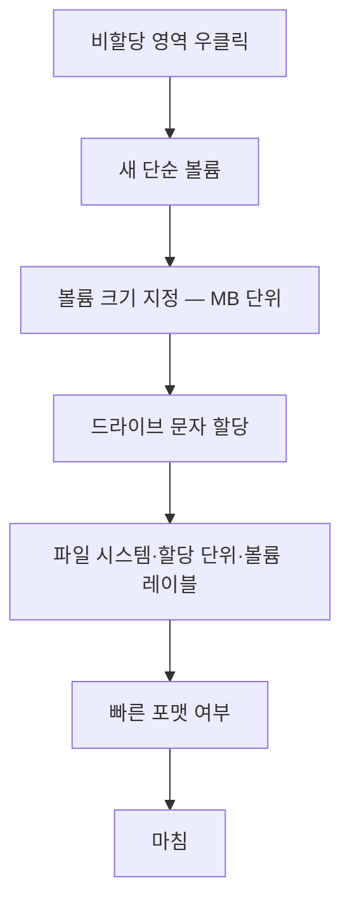

<Callout type="warning">
  **이 문서는 실제 기출문제의 복제가 아닙니다.** 공개된 출제 유형과 채점 관점을 바탕으로 **재구성한 연습 과제**이며, 항목명·용량·이름 등은 학습 목적에 맞게 바꾸었습니다. 원 자료의 수치가 어림값이거나 설명이 모호한 부분은 실제 화면 동작에 맞게 바로잡아 실었습니다. 에뮬레이터의 메뉴 구성은 시행 회차와 BIOS 종류에 따라 다를 수 있습니다.
</Callout>

## 이 편에서 다루는 과제 형태

| 과제 | 형태 | 채점 기준 |
|------|------|-----------|
| 과제 1 | BIOS 항목 설정 | 항목 위치, 설정값, 저장 여부 |
| 과제 2 | 디스크 관리자 파티션 | 크기, 파일 시스템, 드라이브 문자, 볼륨 이름 |
| 과제 3 | 폴더 옵션 | 탭 위치, 라디오·체크 정확도 |
| 과제 4 | UEFI 특징 선택 | 참·거짓 판별 |
| 과제 5 | 단답형 | 명령어·용어 표기 |

<Callout type="warning">
  **에뮬레이터 문항의 공통 함정 하나:** 값을 올바르게 바꿔 놓고 **적용·설정·확인 버튼을 누르지 않고 다음 문항으로 넘어가는 것**입니다. 화면상으로는 정답처럼 보이지만 실제 설정값은 반영되지 않아 0점 처리됩니다. 이 편에서 다루는 모든 과제의 마지막 단계는 예외 없이 "저장 또는 적용"입니다.
</Callout>

---

## 과제 1. BIOS 설정 (에뮬레이터)

### 문제

> BIOS 에뮬레이터에서 다음을 설정하시오.
> ① 비디오 BIOS를 시스템 메모리에 캐싱해 화면 처리 속도를 높이는 기능을 활성화 ② 첫 번째 부팅 장치를 USB 저장장치로 지정 ③ 설정을 저장하고 종료

### ① 정답

| 항목 | 위치 | 설정값 |
|------|------|--------|
| `Video BIOS Cacheable` | Advanced BIOS Features | **Enabled** |
| First Boot Device | Advanced BIOS Features 또는 Boot 메뉴 | **USB-HDD** 또는 USB 장치명 |
| 저장 종료 | 최상위 메뉴 | Save & Exit Setup(`F10`) 후 `Y` |

### ② 원리

**Video BIOS Cacheable이 무엇인가.**

그래픽카드에는 자체 초기화 코드가 담긴 **비디오 BIOS ROM**이 있습니다. 이 항목을 `Enabled` 로 두면 비디오 BIOS의 내용을 시스템 RAM의 특정 영역(`C0000h` 부근)에 복사해 두고, 이후 접근을 RAM에서 처리합니다.

비슷한 이름의 이웃 항목들과 구분해야 합니다.

| 항목 | 대상 | 설명 |
|------|------|------|
| `Video BIOS Cacheable` | 그래픽카드의 비디오 BIOS | 비디오 BIOS를 RAM에 캐싱 |
| `System BIOS Cacheable` | 메인보드의 시스템 BIOS | 시스템 BIOS를 RAM에 캐싱 |
| `Video BIOS Shadow` | 그래픽카드의 비디오 BIOS | ROM 내용을 RAM으로 복사(섀도잉) |
| `Video RAM Cacheable` | 그래픽 메모리 영역 | 비디오 RAM 접근 캐싱 |

문제에 "**비디오**"와 "**BIOS**"가 함께 나오면 `Video BIOS Cacheable` 입니다. "시스템"이 붙으면 `System BIOS Cacheable` 로 답이 바뀝니다. 채점은 항목명 단위이므로 이웃 항목을 켜면 오답입니다.

<Callout type="info">
  **왜 요즘 BIOS에는 이 항목이 없는가:** 섀도잉과 캐싱은 레거시 BIOS 시절 16비트 실행 환경의 느린 ROM 접근을 보완하려던 기술입니다. UEFI 환경에서는 펌웨어가 처음부터 메모리에서 실행되므로 이 옵션 자체가 사라졌습니다. 실기 에뮬레이터는 **항목의 의미를 묻기 위해 레거시 BIOS 화면을 그대로 재현**하는 것이며, 시험용 지식으로 익혀 두는 것이 맞습니다.
</Callout>

### ③ 조작 절차

### ④ 자주 하는 실수

| 실수 | 결과 |
|------|------|
| `System BIOS Cacheable` 을 대신 켬 | 항목 불일치, 오답 |
| `Enabled` 로 바꿔 놓고 `Esc` 로 그냥 나감 | 설정 미저장, 0점 |
| `Exit Without Saving` 선택 | 설정 전부 취소 |
| 확인 프롬프트에서 `N` 입력 | 저장 취소 |
| 부팅 순서를 지정했으나 설치 미디어를 꽂지 않음 | 부팅 실패 |

---

## 과제 2. 디스크 관리자 파티션 분할

### 문제

> 디스크 1의 **비할당 공간 750GiB**를 다음 두 개의 파티션으로 나누어 설정하시오.
> ① 크기 500GiB, 파일 시스템 NTFS, 드라이브 문자 D, 볼륨 이름 IT기술부
> ② 남은 공간 전부, 파일 시스템 exFAT, 드라이브 문자 E, 볼륨 이름 기술영업부

### ① 정답

| 파티션 | 크기 입력값 | 파일 시스템 | 드라이브 문자 | 볼륨 레이블 |
|--------|-------------|-------------|---------------|-------------|
| 1 | 512000 MB | NTFS | D | IT기술부 |
| 2 | 남은 전체 | exFAT | E | 기술영업부 |

<Callout type="warning">
  **단위 조건:** 이 과제는 500GiB를 요구하고 입력칸의 MB를 MiB 단위로 해석합니다. 따라서 500 × 1024 = 512000입니다. GB는 10진 단위이므로 제품 표기 500GB를 무조건 같은 값으로 환산해서는 안 됩니다. 에뮬레이터에서 지정한 입력값과 단위 조건을 우선합니다.
</Callout>

### ② 원리

**디스크 관리자 실행 방법**

| 방법 | 입력 |
|------|------|
| 실행 창 | `diskmgmt.msc` |
| 시작 버튼 우클릭 | 디스크 관리 |
| 컴퓨터 관리 | 저장소 아래 디스크 관리 |

**새 단순 볼륨 마법사의 순서**는 고정되어 있습니다. 이 순서가 곧 입력해야 할 값의 순서입니다.

```mermaid
graph TD
  A[비할당 영역 우클릭] --> B[새 단순 볼륨]
  B --> C[볼륨 크기 지정 — MB 단위]
  C --> D[드라이브 문자 할당]
  D --> E[파일 시스템·할당 단위·볼륨 레이블]
  E --> F[빠른 포맷 여부]
  F --> G[마침]
```

**파일 시스템 선택의 근거**

| 파일 시스템 | 최대 파일 크기 | 특징 | 주 용도 |
|-------------|----------------|------|---------|
| FAT32 | 4GB 미만 | 호환성 최고, 저널링 없음 | 소형 USB, 구형 장비 |
| exFAT | 사실상 제한 없음 | FAT32의 4GB 한계 해소, 권한 없음 | 대용량 USB, 외장 디스크, 기기 간 교환 |
| NTFS | 사실상 제한 없음 | 권한, 압축, 암호화, 저널링 | Windows 시스템·데이터 |

문제에서 두 파티션에 서로 다른 파일 시스템을 지정하는 이유는 **용도의 차이를 아는지 묻는 것**입니다. 사내 문서를 다루는 파티션에는 접근 권한 관리가 되는 NTFS를, 여러 기기를 오가는 파티션에는 호환성이 넓은 exFAT을 지정하는 식입니다.

**저널링**(journaling)은 파일을 고치기 전에 "무엇을 고칠 것인지"를 먼저 기록해 두는 방식입니다. 작업 도중 전원이 끊겨도 기록을 보고 복구할 수 있어 손상에 강합니다. NTFS는 이를 지원하고 FAT32와 exFAT은 지원하지 않습니다.

### ③ 조작 절차

### ④ 자주 하는 실수

| 실수 | 결과 |
|------|------|
| GB를 1000MB로 환산 | 용량 불일치 |
| 볼륨 레이블 미입력 | 이름 항목 오답 |
| 드라이브 문자 기본값 그대로 둠 | 지정 문자 불일치 |
| 첫 볼륨에 전체 용량을 할당 | 두 번째 볼륨을 만들 공간이 없음 |
| 파일 시스템을 둘 다 NTFS로 | 두 번째 파티션 오답 |
| 잘못된 디스크 번호에 작업 | 치명적 감점 |
| 마법사를 마침까지 진행하지 않음 | 볼륨 미생성 |

---

## 과제 3. 폴더 옵션

### 문제

> 파일 탐색기 옵션에서 다음을 설정하시오.
> ① 숨김 파일, 폴더 및 드라이브를 표시하지 않도록 설정 ② 알려진 파일 형식의 파일 확장명을 표시하도록 설정 ③ 검색 시 색인되지 않은 위치에서 시스템 디렉터리를 포함하도록 설정

### ① 정답

| 항목 | 탭 | 조작 |
|------|-----|------|
| 숨김 파일 표시 안 함 | 보기 | 라디오 버튼 **숨김 파일, 폴더 또는 드라이브 표시 안 함** 선택 |
| 확장명 표시 | 보기 | **알려진 파일 형식의 파일 확장명 숨기기** 체크 **해제** |
| 시스템 디렉터리 포함 | 검색 | 색인되지 않은 위치 검색 시 항목 체크 |

### ② 원리 — 탭 구조가 곧 답의 위치다

| 탭 | 담당 |
|-----|------|
| 일반 | 탐색기 시작 위치, 항목 열기 방식(한 번·두 번 클릭), 개인 정보 보호 |
| 보기 | 폴더 표시 방식, 숨김 파일, 확장명, 미리 보기, 폴더 창 옵션 |
| 검색 | 색인, 색인되지 않은 위치 검색 방식, 압축 파일 포함 여부 |

실기에서 틀리는 이유는 항목을 모르는 것이 아니라 **어느 탭에 있는지를 몰라 헤매다 시간을 잃는 것**입니다. 세 탭의 담당 영역을 "일반은 창 동작, 보기는 표시 방식, 검색은 찾는 방식"으로 묶어 기억합니다.

**확장명 항목이 부정형으로 되어 있다는 점**이 특히 함정입니다. 화면의 문구는 "알려진 파일 형식의 파일 확장명 숨기기"입니다. 확장명을 **표시**하려면 이 체크를 **해제**해야 합니다. 문제 문장과 화면 문구의 부정이 뒤집혀 있어 반사적으로 체크했다가 틀리는 경우가 많습니다.

<Callout type="warning">
  **확장명을 표시하는 것은 보안 문제이기도 합니다.** 확장명이 숨겨져 있으면 `보고서.pdf.exe` 라는 파일이 `보고서.pdf` 로만 보입니다. 실행 파일을 문서로 착각하게 만드는 고전적인 수법이며, 그래서 정비 관점에서는 확장명 표시를 켜 두는 것이 권장됩니다.
</Callout>

**숨김 파일 표시의 세 단계**

| 설정 | 보이는 것 |
|------|-----------|
| 숨김 파일 표시 안 함 | 일반 파일만 |
| 숨김 파일 표시 | 숨김 속성 파일까지 |
| 표시 + 보호된 운영 체제 파일 숨기기 해제 | 시스템 파일까지 전부 |

보호된 운영 체제 파일은 별도 체크로 관리되며, 해제할 때 경고 대화상자가 뜹니다. 이 대화상자에서 **예**를 눌러야 실제로 적용됩니다.

### ③ 조작 절차와 실수

| 실수 | 결과 |
|------|------|
| 확장명 항목을 체크함 | 의미가 반대가 되어 오답 |
| 보기 탭 항목을 검색 탭에서 찾음 | 시간 손실 |
| 라디오 버튼을 클릭했으나 다른 항목이 선택됨 | 위아래 항목 오선택 |
| 적용·확인 없이 창을 닫음 | 미반영 |

---

## 과제 4. UEFI 특징 판별 (선택형)

### 문제

> UEFI에 대한 설명으로 옳은 것을 모두 고르시오.
> ㉠ 레거시 BIOS보다 부팅 속도가 빠르다
> ㉡ 마우스를 사용한 그래픽 인터페이스 설정이 가능하다
> ㉢ 2.2TB를 초과하는 저장장치를 부팅 디스크로 사용할 수 있다
> ㉣ 시큐어 부트로 서명되지 않은 부트로더의 실행을 차단할 수 있다
> ㉤ 32비트 운영체제만 지원한다
> ㉥ 네트워크 부팅(PXE)을 지원한다

### ① 정답

**㉠, ㉡, ㉢, ㉣, ㉥** (㉤만 틀림)

### ② 각 항목의 근거

| 항목 | 판정 | 근거 |
|------|------|------|
| ㉠ 부팅 속도 | 옳음 | 레거시 BIOS의 16비트 실행과 장치 순차 검색을 거치지 않고, 부팅 항목을 NVRAM에 저장해 바로 호출 |
| ㉡ 그래픽 설정 | 옳음 | 펌웨어가 그래픽 출력 프로토콜을 지원해 마우스 조작 가능 |
| ㉢ 2.2TB 초과 | 옳음 | GPT 파티션 사용으로 MBR의 32비트 주소 한계를 넘어섬 |
| ㉣ 시큐어 부트 | 옳음 | 서명 검증으로 부팅 단계 악성코드 실행 차단 |
| ㉤ 32비트만 지원 | **틀림** | 오히려 64비트 환경이 표준이며, 64비트 UEFI는 64비트 OS를 요구 |
| ㉥ PXE 부팅 | 옳음 | 네트워크 부팅 기능이 펌웨어에 내장 |

**㉢이 왜 2.2TB인가.** MBR은 파티션의 시작 위치와 크기를 **32비트 섹터 번호**로 기록합니다. 표현 가능한 최대 섹터 수는 약 42억 개이고, 섹터 하나가 512바이트이므로 곱하면 약 2.2TB입니다.

| 구분 | MBR | GPT |
|------|-----|-----|
| 주소 폭 | 32비트 섹터 | 64비트 섹터 |
| 최대 용량 | 약 2.2TB | 사실상 무제한 |
| 주 파티션 수 | 4개(확장 파티션으로 우회) | 128개 |
| 파티션 표 사본 | 없음 | 디스크 끝에 백업 |
| 짝이 되는 펌웨어 | 레거시 BIOS | UEFI |

**㉤이 왜 틀렸는가.** 흔히 나오는 오답 유형입니다. 64비트 UEFI 펌웨어는 64비트 부트로더를 요구하며, 32비트 Windows를 64비트 UEFI 모드로 설치할 수 없습니다. 즉 UEFI는 32비트 전용이 아니라 오히려 **64비트 환경이 기본**입니다.

<Callout type="warning">
  **설치 단계의 실전 함정:** UEFI 모드로 부팅해 설치하면 디스크가 GPT여야 하고, 레거시 모드로 부팅해 설치하면 MBR이어야 합니다. 어긋나면 설치 화면에서 "선택한 디스크에 MBR 파티션 테이블이 있습니다" 같은 메시지가 뜹니다. **디스크를 탓하기 전에 부팅 모드를 먼저 보는 것**이 정답 순서입니다.
</Callout>

---

## 과제 5. 단답형

| 문제 | 정답 |
|------|------|
| Windows 실행 창에서 DirectX 진단 도구를 실행하는 명령어 | `dxdiag` |
| macOS의 최신 파일 시스템으로 SSD 최적화, 스냅샷, 공간 공유, 암호화를 지원 | APFS |
| 디스크 관리 콘솔을 실행하는 명령어 | `diskmgmt.msc` |
| 장치 관리자를 실행하는 명령어 | `devmgmt.msc` |
| 시스템 정보를 확인하는 명령어 | `msinfo32` |
| Windows에서 부팅 옵션과 서비스 시작 항목을 제어하는 도구 | `msconfig` |

**dxdiag가 알려 주는 것**은 이름과 달리 게임 관련 정보만이 아닙니다. 시스템 탭에서 OS 버전, CPU, 메모리 용량을, 디스플레이 탭에서 GPU 모델과 드라이버 버전을, 사운드 탭에서 오디오 장치를 한 화면에서 볼 수 있습니다. **드라이버 설치 후 확인 절차**로 자주 쓰이는 이유입니다.

**APFS의 공간 공유**(Space Sharing)는 한 컨테이너 안의 여러 볼륨이 빈 공간을 미리 나눠 갖지 않고 필요할 때 꺼내 쓰는 방식입니다. 기존 방식은 파티션 크기를 미리 정해야 해서 한쪽이 남고 한쪽이 모자라는 일이 생겼습니다.

## 핵심 정리

- 에뮬레이터 문항은 값을 바꾼 뒤 저장 또는 적용을 눌러야 점수가 됩니다.
- `Video BIOS Cacheable` 은 비디오 BIOS ROM 내용을 RAM에 캐싱하는 항목이며 이웃한 `System BIOS Cacheable` 과 구분해야 합니다.
- 이 연습에서 500GiB는 512000MiB이며, GB와 GiB를 구분해야 합니다.
- 폴더 옵션은 일반이 창 동작, 보기가 표시 방식, 검색이 찾는 방식을 담당하고 확장명 항목은 부정형이라 해제해야 표시됩니다.
- 2.2TB 한계는 UEFI가 아니라 MBR의 32비트 섹터 주소에서 오는 제약이며 GPT가 이를 해소합니다.

## 마무리 복습

<Quiz
  questionNumber={1}
  question={"BIOS에서 Video BIOS Cacheable 항목을 Enabled로 설정했을 때 일어나는 일은?"}
  options={["그래픽카드의 전력 소비가 줄어든다","비디오 BIOS ROM의 내용을 시스템 메모리에 복사해 두고 그곳에서 읽는다","해상도가 자동으로 최대로 설정된다","시큐어 부트가 활성화된다"]}
  correctAnswer={2}
  explanation={"ROM은 시스템 메모리보다 접근이 느립니다. 이 항목은 비디오 BIOS의 내용을 RAM 영역에 올려 두고 이후 접근을 RAM에서 처리하게 하여 화면 관련 처리를 빠르게 합니다."}
/>

<Quiz
  questionNumber={2}
  question={"BIOS 에뮬레이터에서 값을 올바르게 바꾸었는데도 오답 처리되는 가장 흔한 원인은?"}
  options={["방향키 대신 마우스를 사용해서","Save and Exit로 저장하지 않고 Esc로 빠져나와서","항목 이름을 소문자로 읽어서","화면 밝기를 조정하지 않아서"]}
  correctAnswer={2}
  explanation={"BIOS 설정은 저장 단계를 거쳐야 CMOS에 반영됩니다. 저장 없이 종료하면 변경 사항이 모두 취소되므로 화면상 조작이 무의미해집니다."}
/>

<Quiz
  questionNumber={3}
  question={"Windows 디스크 관리의 MB 입력칸을 MiB 단위로 해석할 때 500GiB 볼륨에 입력할 값은? (1GiB = 1024MiB)"}
  options={["500000","512000","5000","51200"]}
  correctAnswer={2}
  explanation={"이 연습의 이진 단위 조건에서 500 × 1024 = 512000이다."}
/>

## 참고 자료

- [Microsoft Learn - Boot to UEFI Mode or Legacy BIOS mode](https://learn.microsoft.com/en-us/windows-hardware/manufacture/desktop/boot-to-uefi-mode-or-legacy-bios-mode?view=windows-11)
- [Microsoft Learn - Windows Setup: Installing using the MBR or GPT partition style](https://learn.microsoft.com/en-us/windows-hardware/manufacture/desktop/windows-setup-installing-using-the-mbr-or-gpt-partition-style?view=windows-11)
- [Dell Support - UEFI Windows Install Error](https://www.dell.com/support/kbdoc/en-ie/000146878/uefi-windows-install-error)
- [한국정보통신자격협회 - 실기 안내](https://www.icqa.or.kr/cn/page/mil_popup)
