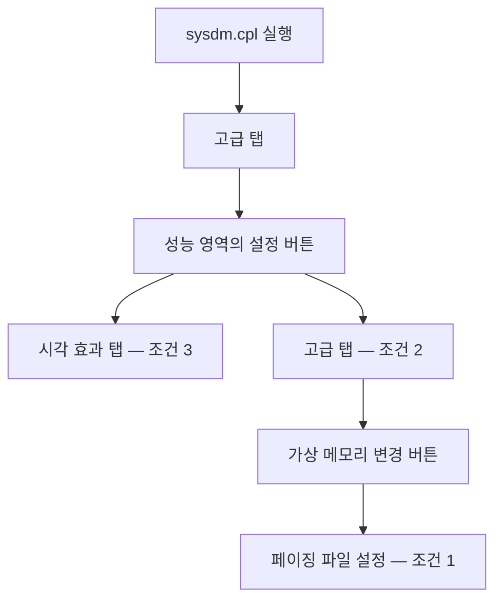
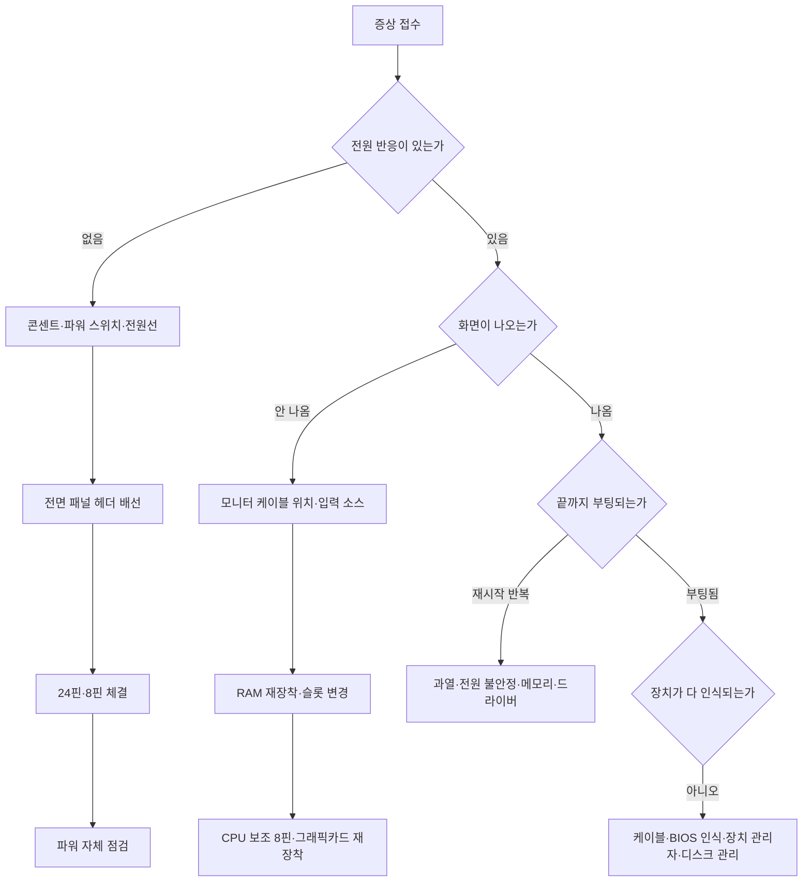

<Callout type="warning">
  **이 문서는 실제 기출문제의 복제가 아닙니다.** 공개된 출제 유형과 채점 관점을 바탕으로 **재구성한 연습 과제**이며, 값·이름·수치는 학습 목적에 맞게 바꾸었습니다. 원 자료에서 값의 형식이나 단위가 모호했던 부분은 실제 Windows 동작에 맞게 바로잡아 실었습니다. 레지스트리 편집은 되돌리기 어려운 조작이므로 실습은 반드시 시험용 가상 환경이나 에뮬레이터에서만 하세요.
</Callout>

<Callout type="info">
  **이번 문서의 목표:** 이 파일을 다 읽으면 레지스트리 경로와 값 종류를 정확히 지정해 정책을 적용하고, 서비스의 시작 유형을 지시대로 바꾸고, 가상 메모리와 성능 옵션을 탭별로 설정할 수 있으며, 증상만 주어진 상황에서 확인 순서를 스스로 세울 수 있습니다.
</Callout>

## 이 편에서 다루는 과제 형태

| 과제 | 형태 | 채점 기준 |
|------|------|-----------|
| 과제 1 | 레지스트리 편집 | 키 경로, 값 이름, 값 종류, 데이터 |
| 과제 2 | 서비스 관리자 | 서비스 식별, 시작 유형, 상태 |
| 과제 3 | 가상 메모리·성능 옵션 | 탭 위치, 수치, 설정 버튼 클릭 |
| 과제 4 | 증상 기반 분기 진단 | 확인 순서의 논리 |
| 과제 5 | 단답형 진단 도구 | 명령어 표기 |

---

## 과제 1. 레지스트리 편집

### 문제

> 조직 정책에 따라 **Windows 검색의 음성 비서 기능을 사용하지 못하도록** 레지스트리를 편집하시오. 값이 없으면 새로 만든다.

### ① 정답

| 항목 | 값 |
|------|-----|
| 키 경로 | `HKEY_LOCAL_MACHINE\SOFTWARE\Policies\Microsoft\Windows\Windows Search` |
| 값 이름 | `AllowCortana` |
| 값 종류 | `REG_DWORD` (DWORD 32비트) |
| 데이터 | `0` |

`0` 은 사용 안 함, `1` 은 사용을 의미합니다. 값 자체가 없으면 정책 미설정으로 취급되어 기본 동작을 따릅니다.

### ② 원리 — 왜 이 경로인가

레지스트리 경로는 아무렇게나 정해진 것이 아니라 **의미의 계층**입니다. 경로를 마디마디 읽으면 왜 그 자리인지 이해할 수 있습니다.

| 마디 | 뜻 |
|------|-----|
| `HKEY_LOCAL_MACHINE` | 이 컴퓨터 전체에 적용(사용자 개인이 아님) |
| `SOFTWARE` | 설치된 소프트웨어 설정 영역 |
| `Policies` | **관리자가 강제하는 정책**. 사용자 설정보다 우선 |
| `Microsoft\Windows\Windows Search` | 정책의 적용 대상 기능 |

`Policies` 아래에 있다는 점이 핵심입니다. 같은 기능이라도 사용자가 스스로 끄는 설정과 **관리자가 잠그는 정책**은 저장 위치가 다르며, 정책 쪽이 우선합니다. 문제가 "조직 정책에 따라 사용하지 못하게 하라"고 하면 `Policies` 경로가 정답입니다.

### 최상위 키의 역할

| 키 | 약칭 | 담당 |
|-----|------|------|
| `HKEY_LOCAL_MACHINE` | HKLM | 컴퓨터 전체 설정, 하드웨어, 서비스 |
| `HKEY_CURRENT_USER` | HKCU | 현재 로그인한 사용자 설정 |
| `HKEY_USERS` | HKU | 모든 사용자 프로필 설정 |
| `HKEY_CLASSES_ROOT` | HKCR | 파일 연결, COM 등록 정보 |
| `HKEY_CURRENT_CONFIG` | HKCC | 현재 하드웨어 프로필 |

**"이 PC를 쓰는 모든 사람에게" 적용하라면 HKLM, "지금 이 사용자에게만"이면 HKCU**입니다. 이 한 줄이 경로 앞부분을 결정합니다.

### 값 종류

| 종류 | 담는 것 | 예 |
|------|---------|-----|
| `REG_SZ` | 문자열 | 경로, 이름 |
| `REG_DWORD` | 32비트 정수 | 켜기·끄기(1·0), 숫자 설정 |
| `REG_QWORD` | 64비트 정수 | 큰 수치 |
| `REG_BINARY` | 이진 데이터 | 장치 설정 |
| `REG_MULTI_SZ` | 여러 줄 문자열 | 목록 |
| `REG_EXPAND_SZ` | 환경 변수를 포함한 문자열 | 변수가 들어간 경로 |

<Callout type="warning">
  **값 종류를 틀리면 값 이름과 데이터가 맞아도 동작하지 않습니다.** 켜기·끄기 정책은 거의 예외 없이 `REG_DWORD` 입니다. 문자열로 `0` 을 만들면 시스템이 그 값을 읽지 못하고 무시합니다. 실기에서 "값을 만들었는데 왜 오답이지" 하는 경우의 상당수가 종류 오선택입니다. 또한 64비트 Windows에서도 정책 값은 대부분 **DWORD 32비트**를 씁니다. QWORD를 고르면 틀립니다.
</Callout>

### ③ 조작 절차

<Steps>

### 레지스트리 편집기 실행

실행 창에 `regedit` 를 입력합니다. 관리자 권한 확인 창이 뜨면 예를 누릅니다.

### 경로 이동

왼쪽 트리를 차례로 펼치거나, 상단 주소 표시줄에 경로를 붙여 넣고 `Enter` 를 누릅니다. 주소 표시줄 방식이 오타 위험이 적습니다.

### 키가 없으면 만들기

`Windows Search` 키가 없다면 상위 키인 `Windows` 를 우클릭하고 새로 만들기에서 키를 선택한 뒤 이름을 정확히 `Windows Search` 로 입력합니다. **공백을 빠뜨려 `WindowsSearch` 로 만드는 실수**가 잦습니다.

### 값 만들기

오른쪽 빈 공간을 우클릭하고 새로 만들기에서 DWORD(32비트) 값을 선택합니다. 이름을 `AllowCortana` 로 입력합니다. 대소문자는 구분하지 않지만 철자는 정확해야 합니다.

### 데이터 입력

값을 더블클릭하고 값 데이터에 `0` 을 입력합니다. 단위는 16진수와 10진수 중 무엇이든 `0` 은 같습니다.

### 확인

확인을 눌러 창을 닫고, 목록에서 이름·종류·데이터 세 열이 모두 지시대로인지 대조합니다.

</Steps>

### ④ 자주 하는 실수

| 실수 | 결과 |
|------|------|
| HKCU에 만듦 | 컴퓨터 전체 정책이 아님, 오답 |
| `Policies` 를 빼고 `Microsoft\Windows` 아래에 만듦 | 경로 불일치 |
| 키 이름의 공백 누락 | 경로 불일치 |
| 값 종류를 문자열로 선택 | 정책 미적용 |
| DWORD 대신 QWORD 선택 | 정책 미적용 |
| 데이터에 `1` 입력 | 의미가 반대 |
| 값만 만들고 데이터 수정 창을 확인 없이 닫음 | 기본값 `0` 이 우연히 맞을 수는 있으나 다른 문항에서는 실패 |

---

## 과제 2. 서비스 관리자

### 문제

> 사용자 진단 및 사용 현황 데이터를 수집해 외부로 전송하는 Windows 서비스를 **중지**하고, 재부팅 후에도 자동으로 시작되지 않도록 **시작 유형을 사용 안 함**으로 변경하시오.

### ① 정답

| 항목 | 값 |
|------|-----|
| 표시 이름 | Connected User Experiences and Telemetry |
| 서비스 이름 | `DiagTrack` |
| 서비스 상태 | 중지 |
| 시작 유형 | 사용 안 함(Disabled) |

### ② 원리 — 상태와 시작 유형은 다른 것이다

이 문항의 핵심은 **두 가지를 모두 바꿔야 한다**는 점입니다.

| 구분 | 의미 | 바꾸지 않으면 |
|------|------|---------------|
| 서비스 상태 | 지금 이 순간 실행 중인가 | 지금 계속 돌아감 |
| 시작 유형 | 다음 부팅 때 시작할 것인가 | 재부팅하면 되살아남 |

중지만 하면 재부팅 후 다시 켜지고, 시작 유형만 바꾸면 지금 돌고 있는 프로세스는 그대로입니다. 문제가 "중지하고 자동 시작되지 않도록"이라고 두 조건을 붙이는 이유입니다.

### 시작 유형의 종류

| 시작 유형 | 동작 |
|-----------|------|
| 자동 | 부팅 시 즉시 시작 |
| 자동(지연된 시작) | 부팅 후 약간의 여유를 두고 시작. 부팅 초반 부하 분산 |
| 수동 | 다른 프로그램이 요청할 때만 시작 |
| 사용 안 함 | 어떤 요청이 와도 시작되지 않음 |

**수동과 사용 안 함의 차이**가 자주 출제됩니다. 수동은 잠긴 것이 아니라 "부르면 온다"는 상태입니다. 완전히 막으려면 사용 안 함이어야 합니다.

### ③ 조작 절차

<Steps>

### 서비스 관리자 실행

실행 창에 `services.msc` 를 입력합니다.

### 서비스 찾기

목록은 표시 이름의 가나다·알파벳 순입니다. 목록을 클릭하고 `C` 를 눌러 Connected로 시작하는 항목으로 건너뜁니다.

### 속성 열기

해당 항목을 더블클릭합니다.

### 서비스 중지

일반 탭의 **중지** 버튼을 누릅니다. 실행 중이 아니면 이 버튼은 비활성 상태입니다.

### 시작 유형 변경

시작 유형 드롭다운에서 **사용 안 함**을 선택합니다.

### 적용

**적용 버튼을 누른 뒤 확인**을 누릅니다. 순서를 지키면 변경이 확실히 반영됩니다.

### 확인

목록으로 돌아와 상태 열이 비어 있고 시작 유형 열이 사용 안 함인지 대조합니다.

</Steps>

### ④ 알아 두면 좋은 다른 서비스

| 표시 이름 | 서비스 이름 | 역할 | 자주 나오는 상황 |
|-----------|-------------|------|------------------|
| Print Spooler | `Spooler` | 인쇄 대기열 관리 | 인쇄 작업이 쌓이기만 할 때 재시작 |
| Windows Update | `wuauserv` | 업데이트 | 업데이트 오류 시 중지 후 캐시 정리 |
| Windows Audio | `Audiosrv` | 오디오 | 소리가 전혀 없고 스피커 아이콘에 X 표시 |
| DHCP Client | `Dhcp` | IP 자동 할당 | IP를 못 받아 오는 증상 |
| Superfetch / SysMain | `SysMain` | 사용 패턴 선반입 | 디스크 사용률 100퍼센트 증상 |
| Windows Search | `WSearch` | 색인 | 검색 지연, 디스크 부하 |

### ⑤ 자주 하는 실수

| 실수 | 결과 |
|------|------|
| 시작 유형만 바꾸고 중지하지 않음 | 현재 실행 상태 유지, 조건 미충족 |
| 중지만 하고 시작 유형은 자동 그대로 | 재부팅 시 재시작 |
| 사용 안 함 대신 수동 선택 | 요청 시 시작되므로 조건 미충족 |
| 적용을 누르지 않고 창을 닫음 | 미반영 |
| 비슷한 이름의 다른 서비스를 변경 | 대상 오선택 |

---

## 과제 3. 가상 메모리와 성능 옵션

### 문제

> 다음 조건에 맞게 시스템 성능을 설정하시오.
> ① 페이징 파일을 D 드라이브에 처음 크기 2048MB, 최대 크기 4096MB로 지정
> ② 프로세서 자원을 백그라운드 서비스에 최적화
> ③ 시각 효과는 사용자 지정으로 두고 화면 글꼴의 가장자리 다듬기 항목만 사용

### ① 정답과 경로

| 조건 | 경로 | 설정값 |
|------|------|--------|
| ① 페이징 파일 | 시스템 속성 → 고급 탭 → 성능 설정 → 고급 탭 → 가상 메모리 변경 | 자동 관리 **체크 해제** → D 드라이브 선택 → 사용자 지정 크기 → 처음 `2048`, 최대 `4096` → **설정** 클릭 |
| ② 프로세서 일정 | 성능 옵션 → 고급 탭 | 프로세서 사용 계획에서 **백그라운드 서비스** 선택 |
| ③ 시각 효과 | 성능 옵션 → 시각 효과 탭 | 사용자 지정 선택 후 **화면 글꼴의 가장자리 다듬기**만 체크 |

빠르게 가는 방법은 실행 창에 `sysdm.cpl` 을 입력해 시스템 속성을 바로 여는 것입니다.

### ② 원리

**페이징 파일이란 무엇인가.**

물리 메모리가 부족해지면 Windows는 당장 쓰지 않는 메모리 내용을 디스크의 파일(`pagefile.sys`)로 옮겨 두고 그 자리를 비웁니다. 이 파일이 **페이징 파일**이며, 물리 메모리와 합쳐 프로그램에 보여 주는 주소 공간이 **가상 메모리**입니다.

디스크는 메모리보다 훨씬 느리므로 페이징이 잦아지면 시스템이 눈에 띄게 느려집니다. 이 현상을 **스래싱**(thrashing)이라고 합니다. 그래서 페이징 파일을 늘리는 것은 근본 해결이 아니라 **부족을 견디는 완충 장치**입니다. 근본 해결은 물리 메모리 증설입니다.

| 설정 | 효과 |
|------|------|
| 처음 크기 | 부팅 시 미리 확보하는 크기 |
| 최대 크기 | 필요할 때 늘어날 수 있는 상한 |
| 처음과 최대를 같게 | 파일 조각화를 줄여 성능이 안정적 |
| 자동 관리 | Windows가 알아서 조절 |

**왜 자동 관리 체크를 먼저 해제해야 하는가.** 체크된 상태에서는 아래의 드라이브 목록과 크기 입력란이 전부 비활성입니다. 이 체크를 해제하지 않으면 값을 입력할 방법 자체가 없습니다. 실기에서 "입력이 안 된다"고 당황하는 상황의 원인이 이것입니다.

<Callout type="warning">
  **가상 메모리 설정에서 가장 많이 놓치는 것은 설정 버튼입니다.** 처음과 최대 크기를 입력한 뒤 **설정** 버튼을 눌러야 아래 목록의 해당 드라이브 항목에 값이 반영됩니다. 입력만 하고 곧바로 확인을 누르면 값이 사라집니다. 순서는 **입력 → 설정 → 확인**입니다. 그리고 페이징 파일 변경은 **다시 시작해야 적용**된다는 안내가 뜹니다.
</Callout>

**프로세서 사용 계획**

| 선택 | 우선순위를 주는 대상 | 적합한 환경 |
|------|----------------------|-------------|
| 프로그램 | 지금 화면 앞에 있는 응용 프로그램 | 일반 데스크톱 |
| 백그라운드 서비스 | 뒤에서 도는 서비스 | 서버, 파일 공유, 인쇄 서버 |

내부적으로는 실행 시간 단위(퀀텀)를 누구에게 길게 줄지의 문제입니다. 서버는 화면 반응성보다 **뒤에서 도는 작업의 처리량**이 중요하므로 백그라운드 서비스를 고릅니다.

**시각 효과**

| 선택 | 의미 |
|------|------|
| 컴퓨터가 최적을 선택 | 사양에 맞춰 자동 |
| 최적 모양 | 효과 전부 켜기 |
| 최적 성능 | 효과 전부 끄기 |
| 사용자 지정 | 항목별 선택 |

문제가 "특정 항목만 사용"이라고 하면 반드시 **사용자 지정**을 고른 뒤 그 항목만 체크해야 합니다. 최적 성능을 고르면 전부 꺼지고, 개별 항목을 체크하면 자동으로 사용자 지정으로 바뀌긴 하지만 **다른 항목의 체크를 모두 해제했는지**가 채점 대상입니다.

**화면 글꼴의 가장자리 다듬기**는 글자 테두리의 계단 현상을 완화해 부드럽게 보이게 하는 기능입니다. 이 항목만 남기라는 조건은 "성능을 위해 효과를 끄되 가독성은 지켜라"라는 실무 관점을 담고 있습니다.

### ③ 자주 하는 실수

| 실수 | 결과 |
|------|------|
| 자동 관리 체크를 해제하지 않음 | 입력란 비활성, 조작 불가 |
| 값 입력 후 설정 버튼 미클릭 | 값 미반영 |
| C 드라이브에 설정 | 지정 드라이브 불일치 |
| MB 대신 GB 값을 입력 | 단위 불일치 |
| 프로그램 항목을 그대로 둠 | 조건 미충족 |
| 시각 효과에서 최적 성능 선택 | 지정 항목까지 꺼짐 |
| 다른 시각 효과 항목의 체크를 남겨 둠 | 조건 미충족 |

---

## 과제 4. 증상 기반 분기 진단

### 문제

> 다음 각 증상에 대해 확인해야 할 순서를 서술하시오.
> ① 전원 버튼을 눌러도 아무 반응이 없다 ② 팬은 도는데 화면이 나오지 않는다 ③ 부팅 도중 재시작이 반복된다 ④ 저장장치가 인식되지 않는다

### ① 정답 — 진단 흐름

### ② 각 증상의 원리와 순서

**① 전원 무반응**

"아무 반응이 없다"는 것은 전기가 메인보드까지 도달하지 못했다는 뜻입니다. 그래서 **전기가 오는 길을 상류부터** 봅니다.

| 순서 | 확인 | 근거 |
|------|------|------|
| 1 | 콘센트, 멀티탭 스위치 | 가장 상류. 다른 기기로 확인 가능 |
| 2 | 파워 뒷면 스위치 | 실기 최다 실수 지점 |
| 3 | 전원 코드 양쪽 체결 | 헐거우면 접촉 불량 |
| 4 | 전면 패널 전원 스위치 배선 | 잘못 꽂으면 버튼이 동작하지 않음 |
| 5 | 24핀·8핀 체결 | 걸쇠가 걸릴 때까지 |
| 6 | 파워 자체 | 점퍼 테스트 또는 교체 확인 |

전면 패널 배선을 의심할 때는 **메인보드의 전원 스위치 핀 두 개를 드라이버로 순간 단락시켜** 켜지는지 봅니다. 이때 켜진다면 케이스 버튼이나 배선이 원인이라는 뜻입니다.

**② 팬은 도는데 화면 없음**

전원은 왔으나 POST가 화면 출력 단계까지 못 갔다는 뜻입니다.

| 순서 | 확인 |
|------|------|
| 1 | 모니터 전원과 입력 소스 |
| 2 | 케이블이 외장 그래픽카드 단자에 꽂혔는지 |
| 3 | RAM 한 장만 남기고 슬롯 바꿔 테스트 |
| 4 | CPU 보조 8핀 연결 |
| 5 | 그래픽카드 재장착과 보조 전원 |
| 6 | 비프음 또는 진단 LED 해석 |

메모리는 **한 장씩, 슬롯을 바꿔 가며** 테스트하는 것이 원칙입니다. 두 장을 함께 꽂은 채로는 어느 쪽이 불량인지 알 수 없습니다.

**③ 부팅 중 재시작 반복**

| 후보 | 확인 방법 |
|------|-----------|
| 과열 | BIOS에서 온도 확인, 쿨러 밀착·팬 동작 |
| 전원 부족·불안정 | 파워 용량, 보조 전원 연결 |
| 메모리 오류 | Windows 메모리 진단(`mdsched.exe`), 한 장씩 테스트 |
| 저장장치 오류 | `chkdsk`, SMART 정보 |
| 드라이버 충돌 | 안전 모드 진입 후 최근 설치 드라이버 롤백 |
| 시스템 파일 손상 | `sfc /scannow` |

**안전 모드**는 최소한의 드라이버와 서비스만 올려 부팅하는 모드입니다. 안전 모드에서 정상이면 **하드웨어가 아니라 드라이버나 소프트웨어 쪽**이라는 강력한 단서가 됩니다. 이 한 번의 판별이 진단 시간을 크게 줄입니다.

**④ 저장장치 미인식**

인식 실패는 **어느 층까지 보이는가**로 원인을 좁힙니다.

| BIOS | 장치 관리자 | 디스크 관리 | 탐색기 | 판정 |
|------|-------------|-------------|--------|------|
| 없음 | 없음 | 없음 | 없음 | 물리·케이블·전원 문제 |
| 있음 | 있음 | 있음 | 없음 | 드라이브 문자 미할당 또는 미포맷 |
| 있음 | 있음 | RAW 표시 | 없음 | 파일 시스템 손상 |
| 있음 | 노란 느낌표 | – | 없음 | 드라이버 문제 |

이 표가 진단의 핵심입니다. **BIOS에 보이는지 여부가 하드웨어와 소프트웨어를 가르는 분기점**입니다. BIOS에 안 보이면 Windows 안에서 아무리 뒤져도 소용이 없습니다.

---

## 과제 5. 단답형 진단 도구

| 문제 | 정답 |
|------|------|
| 레지스트리 편집기를 실행하는 명령어 | `regedit` |
| 서비스 관리자를 실행하는 명령어 | `services.msc` |
| 시스템 속성 창을 바로 여는 명령어 | `sysdm.cpl` |
| 메모리 진단 도구를 실행하는 명령어 | `mdsched.exe` |
| 보호된 시스템 파일의 무결성을 검사하고 복구하는 명령 | `sfc /scannow` |
| 디스크의 파일 시스템 오류를 검사하는 명령 | `chkdsk` |
| 이벤트 뷰어를 실행하는 명령어 | `eventvwr.msc` |
| 성능 모니터를 실행하는 명령어 | `perfmon` |

**이벤트 뷰어**는 진단형 문항에서 자주 언급됩니다. Windows 로그의 시스템 항목에는 예기치 않은 종료, 디스크 오류, 드라이버 실패가 시각과 함께 기록됩니다. "언제부터 그랬는지 모르겠다"는 상황에서 **시각을 특정해 주는 유일한 단서**인 경우가 많습니다.

## 핵심 정리

- 정책성 레지스트리 값은 `HKEY_LOCAL_MACHINE\SOFTWARE\Policies` 아래에 있으며 켜기·끄기 값은 DWORD 32비트를 사용합니다.
- 서비스를 완전히 막으려면 지금의 상태를 중지하고 시작 유형을 사용 안 함으로 함께 바꿔야 합니다.
- 가상 메모리는 자동 관리 체크를 먼저 해제해야 입력이 가능하고, 값 입력 후 설정 버튼을 눌러야 반영됩니다.
- 성능 옵션의 프로세서 사용 계획에서 서버 성격이면 백그라운드 서비스를, 시각 효과는 사용자 지정으로 지정 항목만 남깁니다.
- 저장장치 미인식은 BIOS에 보이는지가 하드웨어와 소프트웨어를 가르는 분기점입니다.

## 마무리 복습

<Quiz
  questionNumber={1}
  question="조직 정책으로 특정 기능을 컴퓨터 전체에 대해 차단하는 레지스트리 값은 일반적으로 어느 최상위 키 아래에 만드는가?"
  options={['HKEY_CURRENT_USER', 'HKEY_LOCAL_MACHINE', 'HKEY_CLASSES_ROOT', 'HKEY_CURRENT_CONFIG']}
  correctAnswer={2}
  explanation="컴퓨터 전체에 적용되는 설정은 HKEY_LOCAL_MACHINE 아래에 둡니다. HKEY_CURRENT_USER는 현재 로그인한 사용자에게만 적용되므로 조직 정책 조건을 충족하지 못합니다."
  optionExplanations={['현재 사용자에게만 적용됩니다', '컴퓨터 전체 설정의 최상위 키입니다', '파일 연결 정보를 담습니다', '현재 하드웨어 프로필 정보입니다']}
/>

<Quiz
  questionNumber={2}
  question="레지스트리 경로에서 Policies 마디가 의미하는 것은?"
  options={['설치 파일이 저장된 위치', '관리자가 강제하는 정책 영역으로 사용자 설정보다 우선한다', '임시 파일 캐시 영역', '드라이버 백업 영역']}
  correctAnswer={2}
  explanation="Policies 아래의 값은 관리자가 강제하는 정책으로 취급되어 사용자가 개별적으로 바꾼 설정보다 우선 적용됩니다. 그래서 차단 조건에는 이 경로가 쓰입니다."
  optionExplanations={['설치 경로 정보가 아닙니다', '정책 우선 적용이 핵심 의미입니다', '캐시와 무관합니다', '백업 영역이 아닙니다']}
/>

<Quiz
  questionNumber={3}
  question="기능의 사용 여부를 지정하는 레지스트리 값의 종류로 가장 일반적인 것은?"
  options={['REG_SZ 문자열', 'REG_DWORD 32비트 정수', 'REG_BINARY 이진 데이터', 'REG_MULTI_SZ 여러 줄 문자열']}
  correctAnswer={2}
  explanation="켜기와 끄기는 1과 0으로 표현되며 이런 값은 DWORD 32비트로 만듭니다. 문자열이나 QWORD로 만들면 이름과 데이터가 맞아도 시스템이 읽지 못해 적용되지 않습니다."
  optionExplanations={['문자열로 만들면 정책이 적용되지 않습니다', '켜기와 끄기 정책의 표준 형식입니다', '이진 데이터는 장치 설정 등에 쓰입니다', '목록 값을 담는 형식입니다']}
/>

<Quiz
  questionNumber={4}
  question="서비스를 중지만 하고 시작 유형을 자동 그대로 두면 어떤 일이 발생하는가?"
  options={['영구적으로 차단된다', '재부팅하면 다시 시작된다', '서비스가 삭제된다', '다른 서비스가 대신 시작된다']}
  correctAnswer={2}
  explanation="서비스 상태는 지금 실행 여부를, 시작 유형은 다음 부팅 시 시작 여부를 정합니다. 중지만 하면 재부팅과 함께 되살아나므로 두 가지를 모두 바꿔야 합니다."
  optionExplanations={['현재 세션에서만 멈춘 상태입니다', '시작 유형이 자동이므로 재시작됩니다', '중지는 삭제가 아닙니다', '대체 시작은 일어나지 않습니다']}
/>

<Quiz
  questionNumber={5}
  question="서비스 시작 유형 중 수동과 사용 안 함의 차이는?"
  options={['수동은 관리자만 시작할 수 있다', '수동은 다른 프로그램의 요청이 있으면 시작되지만 사용 안 함은 요청이 있어도 시작되지 않는다', '수동은 부팅 시 시작된다', '둘은 같은 의미다']}
  correctAnswer={2}
  explanation="수동은 필요할 때 호출되어 시작될 수 있는 상태이고, 사용 안 함은 호출 자체를 막습니다. 완전히 차단하라는 조건에는 사용 안 함을 선택해야 합니다."
  optionExplanations={['권한 구분이 아닙니다', '요청 시 시작 여부가 결정적 차이입니다', '부팅 시 시작은 자동 유형입니다', '동작이 명확히 다릅니다']}
/>

<Quiz
  questionNumber={6}
  question="Windows 서비스 관리자를 실행하는 명령어는?"
  options={['services.msc', 'secpol.msc', 'devmgmt.msc', 'sysdm.cpl']}
  correctAnswer={1}
  explanation="services.msc가 서비스 관리자입니다. secpol은 로컬 보안 정책, devmgmt는 장치 관리자, sysdm.cpl은 시스템 속성입니다."
  optionExplanations={['서비스 관리자의 명령어입니다', '로컬 보안 정책입니다', '장치 관리자입니다', '시스템 속성 창입니다']}
/>

<Quiz
  questionNumber={7}
  question="가상 메모리 설정 창에서 드라이브 목록과 크기 입력란이 모두 비활성 상태일 때 가장 먼저 해야 할 일은?"
  options={['관리자 권한으로 재실행한다', '모든 드라이브에 대한 페이징 파일 크기 자동 관리 체크를 해제한다', '재부팅한다', '디스크를 포맷한다']}
  correctAnswer={2}
  explanation="자동 관리가 체크되어 있으면 Windows가 크기를 스스로 정하므로 하위 입력란이 모두 잠깁니다. 이 체크를 해제해야 드라이브를 선택하고 값을 입력할 수 있습니다."
  optionExplanations={['권한 문제가 아닙니다', '자동 관리 해제가 입력의 전제입니다', '재부팅으로 해결되지 않습니다', '포맷은 무관한 조작입니다']}
/>

<Quiz
  questionNumber={8}
  question="가상 메모리에서 처음 크기와 최대 크기를 입력한 뒤 반드시 눌러야 반영되는 버튼은?"
  options={['적용', '설정', '취소', '초기화']}
  correctAnswer={2}
  explanation="입력란 옆의 설정 버튼을 눌러야 아래 드라이브 목록의 해당 항목에 값이 기록됩니다. 입력만 하고 확인을 누르면 값이 반영되지 않습니다."
  optionExplanations={['적용 버튼은 상위 성능 옵션 창의 것입니다', '값을 드라이브 항목에 기록하는 버튼입니다', '취소는 변경을 버립니다', '해당 창에 초기화 버튼은 없습니다']}
/>

<Quiz
  questionNumber={9}
  question="페이징 파일에 대한 설명으로 옳은 것은?"
  options={['물리 메모리를 물리적으로 늘려 주는 기능이다', '물리 메모리가 부족할 때 당장 쓰지 않는 내용을 디스크로 옮겨 두는 완충 장치다', 'CPU 캐시의 일부다', 'BIOS에 저장되는 설정값이다']}
  correctAnswer={2}
  explanation="페이징 파일은 물리 메모리 부족 시 사용하지 않는 페이지를 디스크에 내려 두는 영역입니다. 디스크는 메모리보다 훨씬 느리므로 근본 해결은 물리 메모리 증설입니다."
  optionExplanations={['물리 용량이 늘어나는 것은 아닙니다', '가상 메모리의 정확한 개념입니다', 'CPU 캐시와는 다른 계층입니다', '펌웨어 설정이 아닙니다']}
/>

<Quiz
  questionNumber={10}
  question="파일 서버처럼 뒤에서 도는 작업의 처리량이 중요한 환경에서 성능 옵션의 프로세서 사용 계획을 어떻게 설정하는가?"
  options={['프로그램에 최적화', '백그라운드 서비스에 최적화', '시각 효과 최대', '가상 메모리 자동 관리']}
  correctAnswer={2}
  explanation="프로그램 선택은 화면 앞의 응용 프로그램에 실행 시간을 길게 줍니다. 서버 성격에서는 배후 서비스의 처리량이 중요하므로 백그라운드 서비스를 선택합니다."
  optionExplanations={['일반 데스크톱에 적합한 설정입니다', '서버 성격 환경의 표준 설정입니다', '시각 효과는 별개 탭 항목입니다', '가상 메모리는 다른 조건입니다']}
/>

<Quiz
  questionNumber={11}
  question="시각 효과에서 특정 항목만 사용하도록 요구받았을 때 올바른 조작은?"
  options={['최적 성능을 선택한다', '사용자 지정을 선택하고 해당 항목만 체크한 뒤 나머지는 모두 해제한다', '최적 모양을 선택한다', '컴퓨터가 최적을 선택하도록 둔다']}
  correctAnswer={2}
  explanation="최적 성능은 모든 효과를 끄고 최적 모양은 모두 켭니다. 특정 항목만 남기라는 조건은 사용자 지정에서 해당 항목만 체크하고 나머지를 해제해야 충족됩니다."
  optionExplanations={['지정 항목까지 꺼집니다', '조건을 정확히 충족하는 조작입니다', '모든 효과가 켜집니다', '항목을 직접 지정할 수 없습니다']}
/>

<Quiz
  questionNumber={12}
  question="전원 버튼을 눌러도 아무 반응이 없을 때 확인 순서로 가장 적절한 것은?"
  options={['드라이버 재설치부터 시작한다', '콘센트와 파워 뒷면 스위치, 전원선, 전면 패널 배선, 24핀과 8핀 체결 순으로 상류부터 확인한다', '레지스트리를 먼저 확인한다', 'BIOS를 초기화한다']}
  correctAnswer={2}
  explanation="반응이 전혀 없다는 것은 전기가 보드까지 도달하지 못했다는 뜻입니다. 전기가 오는 경로를 상류부터 차례로 확인하는 것이 표준 절차입니다."
  optionExplanations={['운영체제가 시작되지도 않은 단계입니다', '전원 경로를 상류부터 확인하는 표준 순서입니다', '레지스트리는 OS 내부 영역입니다', '전원이 들어오지 않으면 BIOS에 접근할 수 없습니다']}
/>

<Quiz
  questionNumber={13}
  question="케이스 전원 버튼이 원인인지 확인하기 위해 사용할 수 있는 방법은?"
  options={['메인보드의 전원 스위치 핀 두 개를 드라이버로 순간 단락시켜 켜지는지 본다', '모니터 케이블을 바꿔 본다', 'RAM을 추가한다', '방화벽을 끈다']}
  correctAnswer={1}
  explanation="전원 스위치 핀을 직접 단락시켜 시스템이 켜진다면 메인보드와 파워는 정상이고 케이스 버튼이나 전면 패널 배선이 원인이라는 뜻으로 좁혀집니다."
  optionExplanations={['전원 경로를 직접 확인하는 표준 기법입니다', '화면 문제와 별개의 증상입니다', '메모리는 전원 인가 이후 단계입니다', '소프트웨어와 무관합니다']}
/>

<Quiz
  questionNumber={14}
  question="메모리 불량이 의심될 때 권장되는 테스트 방법은?"
  options={['모든 메모리를 동시에 꽂고 부하 테스트', '한 장씩만 꽂고 슬롯을 바꿔 가며 테스트', '메모리를 모두 제거하고 부팅', '메모리 클럭을 최대로 올린다']}
  correctAnswer={2}
  explanation="여러 장을 동시에 꽂으면 어느 모듈이나 어느 슬롯이 문제인지 구분할 수 없습니다. 한 장씩 슬롯을 바꿔 가며 확인해야 모듈 불량과 슬롯 불량을 분리할 수 있습니다."
  optionExplanations={['원인 분리가 불가능합니다', '모듈과 슬롯을 분리 판별하는 표준 방법입니다', '메모리 없이는 POST를 통과하지 못합니다', '오히려 불안정을 키웁니다']}
/>

<Quiz
  questionNumber={15}
  question="안전 모드로 부팅했을 때 문제가 나타나지 않는다면 알 수 있는 것은?"
  options={['하드웨어가 확실히 고장 났다', '최소 드라이버와 서비스만 올린 상태에서 정상이므로 드라이버나 소프트웨어 쪽 원인 가능성이 높다', 'BIOS 설정이 잘못되었다', '전원 공급이 부족하다']}
  correctAnswer={2}
  explanation="안전 모드는 필수 드라이버와 서비스만 올려 부팅합니다. 이 상태에서 정상이면 일반 부팅 시 추가로 올라오는 드라이버나 소프트웨어가 원인일 가능성이 커집니다."
  optionExplanations={['오히려 하드웨어 가능성이 줄어듭니다', '원인 범위를 좁히는 핵심 판별입니다', 'BIOS는 안전 모드와 무관하게 동작합니다', '전원 문제라면 안전 모드도 불안정할 것입니다']}
/>

<Quiz
  questionNumber={16}
  question="저장장치가 BIOS에서도 보이지 않고 장치 관리자에도 없다면 원인의 범위는?"
  options={['드라이브 문자 미할당', '파일 시스템 손상', '케이블이나 전원 등 물리 계층 문제', '탐색기 설정 문제']}
  correctAnswer={3}
  explanation="BIOS는 운영체제 이전 단계에서 장치를 인식합니다. 여기서도 보이지 않으면 소프트웨어가 아니라 데이터 케이블, 전원 케이블, 포트, 장치 자체 등 물리 계층의 문제입니다."
  optionExplanations={['문자 미할당이면 디스크 관리에는 보입니다', '파일 시스템 문제라면 BIOS에는 보입니다', 'BIOS 미인식은 물리 계층 문제를 뜻합니다', '탐색기 설정보다 훨씬 아래 단계의 문제입니다']}
/>

<Quiz
  questionNumber={17}
  question="보호된 시스템 파일의 손상 여부를 검사하고 복구하는 명령은?"
  options={['chkdsk', 'sfc /scannow', 'ipconfig /all', 'diskpart']}
  correctAnswer={2}
  explanation="sfc는 시스템 파일 검사기로 보호된 시스템 파일의 무결성을 확인하고 손상된 파일을 복원합니다. chkdsk는 파일 시스템과 디스크 오류를 검사하는 별개의 도구입니다."
  optionExplanations={['디스크 오류 검사 도구입니다', '시스템 파일 무결성 검사와 복구 명령입니다', '네트워크 정보 확인 명령입니다', '파티션 조작 도구입니다']}
/>

<Quiz
  questionNumber={18}
  question="증상이 언제부터 발생했는지 시각을 특정하고 예기치 않은 종료나 디스크 오류 기록을 확인할 수 있는 도구는?"
  options={['이벤트 뷰어', '작업 관리자', '디스크 정리', '메모장']}
  correctAnswer={1}
  explanation="이벤트 뷰어의 Windows 로그 중 시스템 항목에는 오류와 경고가 발생 시각과 함께 기록됩니다. 증상 발생 시점을 특정하는 데 가장 유용한 진단 도구입니다."
  optionExplanations={['시각이 기록된 로그를 제공하는 도구입니다', '작업 관리자는 현재 상태만 보여 줍니다', '디스크 정리는 임시 파일 삭제 도구입니다', '로그 분석 도구가 아닙니다']}
/>

<Quiz
  questionNumber={19}
  question="레지스트리에서 Windows Search 키를 만들어야 할 때 흔히 발생하는 실수는?"
  options={['키 이름의 공백을 빠뜨려 WindowsSearch로 만드는 것', '키를 두 개 만드는 것', '키를 소문자로 만드는 것', '키를 삭제하는 것']}
  correctAnswer={1}
  explanation="레지스트리 키 이름은 철자와 공백까지 정확히 일치해야 시스템이 해당 경로를 인식합니다. 공백을 빠뜨리면 전혀 다른 키가 되어 정책이 적용되지 않습니다."
  optionExplanations={['공백 누락이 대표적인 실수입니다', '중복 생성은 이름 충돌로 막힙니다', '대소문자는 구분하지 않습니다', '삭제는 별개의 조작입니다']}
/>

<Quiz
  questionNumber={20}
  question="페이징 파일의 처음 크기와 최대 크기를 같은 값으로 설정할 때 얻는 이점은?"
  options={['디스크 용량이 절약된다', '파일 크기가 변하지 않아 조각화가 줄고 성능이 안정적이다', '물리 메모리가 늘어난다', 'CPU 온도가 낮아진다']}
  correctAnswer={2}
  explanation="크기가 유동적이면 파일이 늘어날 때마다 디스크 여러 곳에 흩어질 수 있습니다. 고정 크기로 두면 연속된 영역을 확보해 조각화를 줄이고 접근 성능이 안정적입니다."
  optionExplanations={['오히려 최대 크기만큼 미리 차지합니다', '조각화 감소가 실제 이점입니다', '물리 메모리 용량은 변하지 않습니다', '발열과는 무관합니다']}
/>

## 참고 자료

- [한국정보통신자격협회 - 실기 안내](https://www.icqa.or.kr/cn/page/mil_popup)
- [한국정보통신자격협회 - PC정비사 2급](https://www.icqa.or.kr/cn/page/pc)
- [UEFI Forum - Windows Boot Environment](https://uefi.org/sites/default/files/resources/UEFI-Plugfest-WindowsBootEnvironment.pdf)
- [Intel - How to Configure the System in UEFI Mode before Installing Windows](https://www.intel.com/content/www/us/en/support/articles/000025535/memory-and-storage/intel-optane-memory.html)
