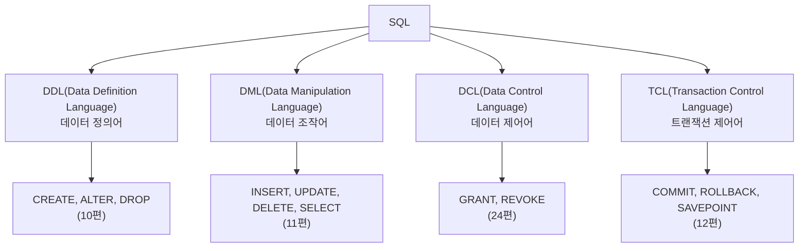

## 1. 데이터베이스와 DBMS — 창고와 창고지기

### 왜 파일만으로는 부족한가

회원 정보를 엑셀 파일 하나에 적어 관리한다고 해봅시다. 그런데 회원이 10만 명이 되고, 동시에 여러 직원이 그 파일을 열어 수정하려 하고, 정전이 나서 저장 중이던 파일이 깨지고, "탈퇴한 회원인데 왜 아직도 목록에 있지?" 같은 데이터 불일치가 생기기 시작하면 파일 하나로는 감당이 안 됩니다.

**데이터베이스**(Database, DB)는 여러 사람이 공유하며 사용할 목적으로 통합·저장된 데이터의 집합입니다. **DBMS**(DataBase Management System, 데이터베이스 관리 시스템)는 이 데이터베이스를 생성·조작·제어하는 소프트웨어 자체를 가리킵니다.

DBMS가 없다면 프로그램마다 각자 파일을 읽고 쓰는 코드를 직접 짜야 하고, 그 코드마다 제각각 방식으로 동시 접근을 처리하다 데이터가 깨질 위험이 커집니다. DBMS는 이 문제를 표준화된 방식으로 대신 처리해 줍니다.

| 구분 | 정의 | 예시 |
|------|------|------|
| 데이터베이스 | 통합·저장된 데이터의 집합 자체 | 회원 데이터, 주문 데이터가 쌓인 실체 |
| DBMS | 데이터베이스를 관리하는 소프트웨어 | Oracle, MySQL, PostgreSQL, SQL Server |

<Callout type="warning">
  **자주 틀리는 점:** "MySQL이 데이터베이스다"라고 말하는 경우가 많은데, 정확히는 MySQL은 **DBMS**(관리 소프트웨어)이고 그 안에 실제로 만들어 넣는 각각의 데이터 집합이 **데이터베이스**입니다. 하나의 DBMS 안에 여러 개의 데이터베이스를 만들 수 있습니다.
</Callout>

## 2. 관계형 모델 — 표(테이블)로 데이터를 담는 방식

### 왜 하필 표 모양인가

데이터를 저장하는 방식(모델)은 여러 가지가 있었습니다. 1970년 에드거 codd(에드거 커드)가 제안한 **관계형 모델**(Relational Model)은 이 문제를 아주 단순한 아이디어로 풀었습니다.

여기서 "관계형(Relational)"이라는 이름은 흔히 오해하는 것처럼 "표와 표 사이의 관계"만을 뜻하는 말이 아닙니다. 원래 수학의 **릴레이션**(Relation, 관계)이라는 집합 개념에서 온 용어로, 표 하나 자체가 하나의 릴레이션입니다.

### 테이블·행·열 — 세 이름을 정확히 맞춰라

관계형 데이터베이스의 표 하나는 아래처럼 생겼습니다.

| 사원번호 | 사원명 | 부서 |
|----------|--------|------|
| E01 | 홍길동 | 영업1팀 |
| E02 | 김민준 | 개발팀 |
| E03 | 이서연 | 영업1팀 |

이 표를 이루는 요소마다 이름이 여러 겹으로 붙습니다. 이 이름 대응이 SQLD 시험의 용어 문제에서 자주 나오므로 표로 정리합니다.

| 일상 용어 | SQL(관계형 DB) 용어 | 데이터 모델링 용어 | 뜻 |
|-----------|----------------------|----------------------|-----|
| 표 | 테이블(Table) | 엔터티(Entity) | 데이터를 담는 하나의 표 전체 |
| 세로줄 | 컬럼(Column) | 속성(Attribute) | 표의 각 항목(사원번호, 사원명, 부서) |
| 가로줄 | 로우(Row) | 인스턴스(Instance) | 표의 한 줄(홍길동 한 명의 정보) |
| 칸 하나 | 값(Value) | 속성값(Attribute Value) | 행과 열이 만나는 한 칸의 데이터 |

이 대응표는 외워두면 다음 편(ERD 표기법과 용어 지도)과 03편(엔터티·속성·관계)에서 등장하는 용어를 헷갈리지 않는 데 그대로 쓰입니다. **테이블 = 엔터티, 컬럼 = 속성, 로우 = 인스턴스**라는 세 쌍을 지금 확실히 잡아두십시오.

<Callout type="warning">
  **자주 틀리는 점:** "필드(Field)"라는 말도 자주 섞여 나옵니다. 필드는 컬럼과 거의 같은 뜻으로 쓰이지만, 엄밀히는 "특정 행의 특정 컬럼 값 하나"를 가리킬 때도 씁니다. 시험에서는 컬럼과 필드를 같은 의미로 취급하는 경우가 많으니 문맥으로 판단하십시오.
</Callout>

## 3. SQL이 하는 일 — 창고에 말을 거는 언어

### SQL은 프로그래밍 언어가 아니라 질의어다

**SQL**(Structured Query Language, 구조화 질의어)은 DBMS에게 "이 데이터를 넣어줘", "이 조건에 맞는 데이터를 찾아줘", "이 값을 바꿔줘"라고 요청하는 언어입니다. 자바·파이썬 같은 범용 프로그래밍 언어와 달리, SQL은 **데이터를 다루는 것 한 가지 목적**에 집중된 언어입니다.

SQL이 하는 일은 목적에 따라 네 갈래로 나뉩니다. 이 네 갈래는 이 과목 전체(10~24편)의 뼈대이므로, 지금은 "이런 이름의 큰 카테고리가 있다"는 지도만 그려둡니다. 각 항목의 구체적인 문법은 해당 편(괄호 안 편 번호)에서 다룹니다.

```mermaid
graph TD
  SQL["SQL"] --> DDL["DDL(Data Definition Language)<br/>데이터 정의어"]
  SQL --> DML["DML(Data Manipulation Language)<br/>데이터 조작어"]
  SQL --> DCL["DCL(Data Control Language)<br/>데이터 제어어"]
  SQL --> TCL["TCL(Transaction Control Language)<br/>트랜잭션 제어어"]
  DDL --> DDL1["CREATE, ALTER, DROP<br/>(10편)"]
  DML --> DML1["INSERT, UPDATE, DELETE, SELECT<br/>(11편)"]
  DCL --> DCL1["GRANT, REVOKE<br/>(24편)"]
  TCL --> TCL1["COMMIT, ROLLBACK, SAVEPOINT<br/>(12편)"]
```

| 분류 | 영문 풀이 | 하는 일 | 대표 명령어 |
|------|-----------|---------|-------------|
| DDL | Data Definition Language, 데이터 정의어 | 테이블 같은 **그릇 자체**를 만들고 바꾸고 없앤다 | `CREATE`, `ALTER`, `DROP` |
| DML | Data Manipulation Language, 데이터 조작어 | 그릇 **안의 내용물**을 넣고 고치고 지우고 조회한다 | `INSERT`, `UPDATE`, `DELETE`, `SELECT` |
| DCL | Data Control Language, 데이터 제어어 | 누가 그 그릇을 만지도록 **허락**할지 정한다 | `GRANT`, `REVOKE` |
| TCL | Transaction Control Language, 트랜잭션 제어어 | DML로 바꾼 내용을 **확정하거나 취소**한다 | `COMMIT`, `ROLLBACK`, `SAVEPOINT` |

<Callout type="warning">
  **자주 틀리는 점:** `SELECT`를 DML이 아닌 별도 분류로 착각하는 경우가 있습니다. `SELECT`는 데이터를 "조작"한다기보다 "조회"만 하지만, 공식 분류상 DML에 포함됩니다. 또한 DDL 명령은 실행 즉시 **자동으로 커밋(확정)** 되어 롤백으로 되돌릴 수 없다는 점도 자주 출제되는 함정입니다. 이 내용은 09편(트랜잭션)과 12편(TCL)에서 다시 깊게 다룹니다.
</Callout>

## 핵심 정리

- **데이터베이스**는 데이터의 집합 자체이고, **DBMS**는 그것을 관리하는 소프트웨어다. "MySQL이 데이터베이스다"는 흔한 오개념이다.
- **관계형 모델**은 데이터를 표(테이블)로 표현한다. **테이블 = 엔터티, 컬럼 = 속성, 로우 = 인스턴스**라는 세 겹의 용어 대응을 반드시 익혀둔다.
- SQL은 목적에 따라 **DDL**(정의: CREATE/ALTER/DROP), **DML**(조작: INSERT/UPDATE/DELETE/SELECT), **DCL**(제어: GRANT/REVOKE), **TCL**(트랜잭션: COMMIT/ROLLBACK/SAVEPOINT) 네 갈래로 나뉜다.

## 마무리 복습

<Quiz
  questionNumber={1}
  question={"데이터베이스와 DBMS의 관계를 가장 정확하게 설명한 것은?"}
  options={["데이터베이스는 DBMS를 실행하는 하드웨어 장비이다","DBMS는 데이터베이스를 관리하는 소프트웨어이고, 데이터베이스는 그 안에 저장된 데이터의 집합이다","데이터베이스와 DBMS는 완전히 같은 개념으로 혼용해도 무방하다","DBMS는 SQL 문법의 옛 이름이다"]}
  correctAnswer={2}
  explanation={"DBMS(DataBase Management System)는 데이터베이스를 생성·조작·제어하는 소프트웨어이고, 데이터베이스는 그 소프트웨어가 관리하는 실제 데이터의 집합이다. Oracle, MySQL 등은 DBMS 제품명이다."}
/>

<Quiz
  questionNumber={2}
  question={"관계형 데이터베이스의 테이블, 컬럼, 로우를 데이터 모델링 용어로 옳게 짝지은 것은?"}
  options={["테이블–속성, 컬럼–엔터티, 로우–인스턴스","테이블–엔터티, 컬럼–속성, 로우–인스턴스","테이블–인스턴스, 컬럼–엔터티, 로우–속성","테이블–엔터티, 컬럼–인스턴스, 로우–속성"]}
  correctAnswer={2}
  explanation={"테이블 전체는 엔터티, 테이블의 세로줄(항목)은 속성, 테이블의 가로줄(한 건의 데이터)은 인스턴스에 대응한다."}
/>

<Quiz
  questionNumber={3}
  question={"SQL의 네 분류 중 CREATE, ALTER, DROP이 속하는 것과 그 역할로 옳은 것은?"}
  options={["DML — 테이블 안의 데이터를 조작한다","DCL — 사용자에게 권한을 부여하거나 회수한다","DDL — 테이블 같은 객체 구조 자체를 정의한다","TCL — 트랜잭션을 확정하거나 취소한다"]}
  correctAnswer={3}
  explanation={"CREATE·ALTER·DROP은 테이블 등 데이터베이스 객체의 구조 자체를 만들고 바꾸고 없애는 명령으로, 데이터 정의어(DDL, Data Definition Language)에 속한다."}
/>

## 참고 자료

- [데이터자격시험 - SQLD 출제기준](https://www.dataq.or.kr/www/sub/a_04.do)
- [데이터자격검정 메인 - 데이터자격시험](https://www.dataq.or.kr/www/main.do)
- [MDN - SQL 개요 (관계형 DB 기초)](https://developer.mozilla.org/ko/docs/Glossary/SQL)
