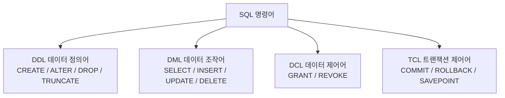

<Callout type="info">
  **이번 문서의 목표:** 테이블을 만들고 바꾸고 지우는 DDL(CREATE·ALTER·DROP·TRUNCATE) 문법을 정확히 쓸 수 있고, 제약조건(PK·FK·UNIQUE·NOT NULL·CHECK·DEFAULT)이 데이터 무결성을 어떻게 지키는지 설명하며, DROP·TRUNCATE·DELETE의 차이와 참조 무결성 옵션(CASCADE 등)을 실행 결과로 구분할 수 있다.
</Callout>

## 1. DDL은 무엇을 하는 명령어인가

01편에서 SQL 명령어를 DDL(Data Definition Language, 데이터 정의어)·DML(Data Manipulation Language, 데이터 조작어)·DCL(Data Control Language, 데이터 제어어)·TCL(Transaction Control Language, 트랜잭션 제어어) 네 갈래로 나눈다고 배웠습니다. 이번 편의 주인공인 DDL은 **테이블이라는 그릇 자체**를 만들고, 바꾸고, 없애는 명령어입니다. 그릇 안에 담긴 데이터(행)를 다루는 DML(11편)과는 다루는 대상이 다릅니다.

> **쉽게 말하면:** DML이 "밥그릇에 담긴 밥을 뜨고 비우는 일"이라면, DDL은 "밥그릇 자체를 굽고, 손잡이를 새로 달고, 깨뜨리는 일"입니다.



DDL을 다루는 이번 편에서 가장 먼저 기억해야 할 성질이 하나 있습니다. **DDL 문장은 실행되는 순간 그 이전까지 진행 중이던 트랜잭션을 자동으로 커밋(commit, 확정)시킵니다.** 이를 묵시적 커밋(implicit commit)이라 부릅니다. 트랜잭션과 커밋의 정확한 의미는 09편·12편에서 자세히 다루지만, 지금은 "DDL을 실행하면 그 앞의 INSERT·UPDATE·DELETE까지 전부 되돌릴 수 없게 확정된다"는 사실만 확실히 기억하고 넘어가면 됩니다. 이 편의 마지막 절에서 실제 예시로 확인합니다.

## 2. CREATE TABLE — 테이블 만들기와 데이터 타입

**CREATE**는 새로운 테이블(또는 뷰·인덱스 등 다른 객체)을 만드는 명령어입니다. 테이블을 만들 때는 각 컬럼(열)의 이름과 함께 그 컬럼에 어떤 종류의 값이 들어갈지 **데이터 타입**(data type)을 반드시 지정해야 합니다. 데이터 타입은 저장 공간을 얼마나 확보할지, 어떤 연산(더하기·문자 비교 등)이 가능할지를 결정합니다.

SQLD는 오라클(Oracle) SQL을 기준으로 출제되므로, 오라클의 대표 데이터 타입을 정리합니다.

| 분류 | 타입 | 설명 |
|------|------|------|
| 문자 | `CHAR(n)` | 고정 길이 문자열. 지정 길이보다 짧게 입력해도 공백으로 채워 n바이트를 고정 사용 |
| 문자 | `VARCHAR2(n)` | 가변 길이 문자열. 실제 입력된 길이만큼만 저장 공간 사용, 최대 n바이트 |
| 숫자 | `NUMBER(p,s)` | p는 전체 자릿수(precision), s는 소수점 이하 자릿수(scale). `NUMBER(5,2)`는 최대 999.99까지 저장 |
| 날짜 | `DATE` | 연·월·일·시·분·초까지 저장하는 날짜/시간 타입 |

> **쉽게 말하면:** `CHAR`는 항상 같은 크기의 상자(우편번호처럼 자릿수가 고정된 값), `VARCHAR2`는 내용물 크기에 맞춰 늘었다 줄었다 하는 봉투(이름처럼 길이가 제각각인 값)입니다.

**실행 전(테이블 없음) → 실행 SQL → 실행 후**로 CREATE TABLE의 동작을 확인해 보겠습니다.

실행 전: `학과` 테이블이 존재하지 않음.

```sql
CREATE TABLE 학과 (
  학과코드   VARCHAR2(10)  PRIMARY KEY,
  학과명     VARCHAR2(30)  NOT NULL,
  정원       NUMBER(3)     DEFAULT 30
);
```

실행 후: 아래와 같은 빈 테이블 구조가 생성됩니다(행은 아직 0건).

| 학과코드 | 학과명 | 정원 |
|----------|--------|------|
| (구조만 생성, 행 없음) | | |

## 3. ALTER TABLE — 이미 만든 테이블 구조 바꾸기

**ALTER**는 이미 존재하는 테이블의 구조를 바꾸는 명령어입니다. 컬럼을 추가·수정·삭제하거나, 테이블·컬럼의 이름 자체를 바꿀 수 있습니다.

| 목적 | 문법 | 비고 |
|------|------|------|
| 컬럼 추가 | `ALTER TABLE 학과 ADD (설립연도 NUMBER(4));` | 기존 행에는 NULL로 채워짐 |
| 컬럼 타입·제약 변경 | `ALTER TABLE 학과 MODIFY (정원 NUMBER(4));` | 자릿수를 늘리는 등 |
| 컬럼 삭제 | `ALTER TABLE 학과 DROP COLUMN 설립연도;` | 해당 컬럼의 모든 데이터도 함께 사라짐 |
| 컬럼 이름 변경 | `ALTER TABLE 학과 RENAME COLUMN 학과명 TO 학과이름;` | 데이터는 유지, 이름만 변경 |
| 테이블 이름 변경 | `ALTER TABLE 학과 RENAME TO 학부;` | 테이블 자체의 이름 변경 |

실행 전(학과 테이블 구조): 컬럼이 `학과코드`, `학과명`, `정원` 3개.

```sql
ALTER TABLE 학과 ADD (설립연도 NUMBER(4));
```

실행 후(학과 테이블 구조): 컬럼이 `학과코드`, `학과명`, `정원`, `설립연도` 4개로 늘어나고, 기존에 들어 있던 행이 있었다면 그 행들의 `설립연도` 값은 전부 NULL로 채워집니다.

<Callout type="warning">
  **자주 틀리는 점 1 — DROP COLUMN과 DROP TABLE을 혼동.** `ALTER TABLE ... DROP COLUMN`은 테이블은 그대로 두고 특정 컬럼 하나만 없애는 것이고, 뒤에서 다룰 `DROP TABLE`은 테이블 자체를 통째로 없애는 것입니다. 이름이 비슷해 시험에서 "DROP은 항상 테이블을 지운다"는 식의 오답 선택지가 나오기 쉽습니다.
</Callout>

## 4. DROP과 TRUNCATE — 테이블을 없애거나 비우기

**DROP TABLE**은 테이블의 구조(정의)와 데이터를 모두 영구히 제거합니다. **TRUNCATE TABLE**은 테이블 구조는 남긴 채 그 안의 모든 행만 한꺼번에 제거합니다. 이 둘, 그리고 11편에서 다룰 DML의 `DELETE`(조건에 맞는 행만 지우는 명령)까지 세 명령은 전부 "데이터를 지운다"는 결과만 보면 비슷해 보이지만, 분류부터 동작 원리까지 근본적으로 다릅니다. **이 표는 SQLD 시험에서 거의 매 회차 등장하는 핵심 비교이므로 반드시 통째로 외워야 합니다.**

| 구분 | DELETE | TRUNCATE | DROP |
|------|--------|----------|------|
| 명령어 분류 | DML | DDL | DDL |
| 삭제 대상 | 행(조건에 맞는 일부 또는 전체) | 테이블의 전체 행 | 테이블 구조 + 전체 행 |
| `WHERE` 절 사용 | 가능(일부 행만 삭제) | 불가능(항상 전체 삭제) | 해당 없음(테이블 단위) |
| 롤백 가능 여부 | 가능(COMMIT 전까지) | 불가능(DDL의 자동 커밋 때문) | 불가능(DDL의 자동 커밋 때문) |
| 저장 공간 반환 | 반환 안 함(공간은 남아 있음) | 반환함(초기 상태로 되돌림) | 반환함(객체 자체가 사라짐) |
| 자동 커밋 여부 | 안 됨(직접 COMMIT 필요) | 자동으로 커밋됨 | 자동으로 커밋됨 |
| 실행 속도(대량 삭제 시) | 느림(행 하나하나의 변경 기록을 남김) | 빠름(개별 행 로그 없이 초기화) | 빠름(객체 자체를 제거) |
| 테이블 구조 | 유지됨 | 유지됨 | 사라짐 |

DELETE가 TRUNCATE보다 느린 이유는 동작 원리 자체가 다르기 때문입니다. DELETE는 DML이라 각 행을 지울 때마다 "되돌릴 수 있도록" 변경 기록(실행 취소 정보)을 남기며 한 행씩 처리합니다. 반면 TRUNCATE는 DDL이라 애초에 롤백을 지원하지 않으므로 행 단위 기록 없이 테이블이 차지하던 공간을 통째로 초기화해 버립니다. 이 차이 때문에 수백만 건을 한꺼번에 비울 때는 TRUNCATE가 훨씬 빠릅니다.

실행 전(주문 테이블에 3건):

| 주문번호 | 회원번호 | 금액 |
|----------|----------|------|
| 1 | 100 | 5000 |
| 2 | 101 | 12000 |
| 3 | 100 | 3000 |

```sql
TRUNCATE TABLE 주문;
```

실행 후(주문 테이블): 0건. 테이블 구조(`주문번호`, `회원번호`, `금액` 컬럼 정의)는 그대로 남아 있어 즉시 다시 INSERT할 수 있습니다. 이 명령은 실행 즉시 자동 커밋되므로, 실행 직후 `ROLLBACK;`을 입력해도 3건은 되살아나지 않습니다.

같은 상황에서 `DROP TABLE 주문;`을 실행하면 결과가 또 다릅니다. 실행 후에는 `주문` 테이블 자체가 데이터베이스에서 사라져, `SELECT * FROM 주문;`을 실행하면 "테이블이 존재하지 않는다"는 오류가 발생합니다. 다시 쓰려면 `CREATE TABLE`부터 새로 해야 합니다.

DROP은 추가로 다른 객체와의 의존 관계를 어떻게 처리할지 옵션으로 지정할 수 있습니다.

- `DROP TABLE 학과 RESTRICT;`: 이 학과 테이블을 참조하는 다른 객체(예: 이 테이블을 조회하는 뷰, 이 테이블을 외래키로 참조하는 자식 테이블)가 하나라도 있으면 삭제를 **거부**합니다. 아무것도 지워지지 않고 오류만 발생합니다.
- `DROP TABLE 학과 CASCADE CONSTRAINTS;`: 학과 테이블을 삭제하면서, 이 테이블을 참조하던 다른 테이블의 **외래키 제약조건만** 함께 제거합니다. 자식 테이블 자체나 그 안의 데이터는 그대로 남고, 다만 더 이상 학과 테이블을 참조하지 않는 상태(제약 없는 컬럼)가 됩니다.

<Callout type="warning">
  **자주 틀리는 점 2 — TRUNCATE를 DML로 착각하거나 WHERE를 쓸 수 있다고 착각.** "TRUNCATE는 WHERE 절로 조건에 맞는 행만 지울 수 있다"거나 "TRUNCATE는 DML이라 롤백된다"는 선택지가 오답으로 즐겨 나옵니다. TRUNCATE는 **DDL**이며 **항상 테이블 전체**를 비우고, **자동 커밋**되어 롤백할 수 없습니다. 또한 `CASCADE CONSTRAINTS`(DROP 옵션, 참조 무결성 제약을 제거)와 다음 절에서 다룰 `ON DELETE CASCADE`(외래키 옵션, 자식 행 자체를 연쇄 삭제)를 서로 다른 것으로 구분해야 합니다.
</Callout>

## 5. 제약조건 — 데이터가 지켜야 할 규칙

**제약조건**(constraint)은 테이블에 어떤 데이터가 들어올 수 있는지를 데이터베이스 차원에서 강제하는 규칙입니다. 애플리케이션 코드에서 아무리 검증 로직을 잘 짜도, 다른 프로그램이나 담당자가 실수로 직접 SQL을 실행하면 잘못된 데이터가 들어갈 수 있습니다. 제약조건은 이런 상황까지 막아 주는 **최후의 방어선**입니다. 08편에서 다룬 외래키와 참조 무결성도 제약조건의 한 종류입니다.

> **쉽게 말하면:** 제약조건은 테이블 입구에 세워 둔 검문소입니다. 규칙에 안 맞는 데이터는 아예 테이블 안으로 들여보내지 않습니다.

| 제약조건 | 의미 | 한 테이블에 개수 제한 |
|----------|------|------------------------|
| `NOT NULL` | 이 컬럼에는 NULL(값 없음, 09편 참고)을 허용하지 않음 | 여러 컬럼에 각각 지정 가능 |
| `UNIQUE` | 이 컬럼(또는 컬럼 조합)의 값이 테이블 안에서 중복되지 않아야 함. NULL은 여러 개 허용 | 여러 개 지정 가능 |
| `PRIMARY KEY` | 유일성(UNIQUE) + NOT NULL을 동시에 강제. 그 행을 대표하는 식별자(04편 참고) | 테이블당 1개만 |
| `FOREIGN KEY` | 다른 테이블(또는 같은 테이블)의 특정 컬럼 값을 참조해야 함(참조 무결성) | 여러 개 지정 가능 |
| `CHECK` | 컬럼 값이 지정한 조건식을 만족해야 함(예: 나이가 0보다 커야 함) | 여러 개 지정 가능 |
| `DEFAULT` | INSERT 시 값을 지정하지 않으면 자동으로 채워 넣을 기본값 | 컬럼당 1개 |

<Callout type="warning">
  **자주 틀리는 점 3 — CHECK와 NOT NULL·FOREIGN KEY의 역할 혼동.** "특정 범위(예: 0 이상)의 값만 허용하려면 어떤 제약조건을 쓰는가"라는 문제에서 NOT NULL이나 PRIMARY KEY를 답으로 고르는 실수가 잦습니다. NOT NULL은 "값이 있는지 없는지"만 검사할 뿐 값의 범위·목록은 검사하지 않습니다. 값의 범위나 허용 목록(도메인)을 검사하는 것은 오직 **CHECK**뿐입니다. 또한 FOREIGN KEY는 "다른 테이블에 그 값이 존재하는가"를 검사하는 것이지, 조건식을 검사하는 것이 아닙니다.
</Callout>

다음 예시로 CHECK와 DEFAULT의 동작을 확인합니다.

실행 전: `회원` 테이블이 없는 상태.

```sql
CREATE TABLE 회원 (
  회원번호   NUMBER          PRIMARY KEY,
  이름       VARCHAR2(20)    NOT NULL,
  이메일     VARCHAR2(50)    UNIQUE,
  나이       NUMBER          CHECK (나이 >= 0),
  등급       VARCHAR2(10)    DEFAULT '일반'
);

INSERT INTO 회원 (회원번호, 이름, 이메일, 나이)
VALUES (1, '김민준', 'minjun@test.com', 25);
```

실행 후(회원 테이블):

| 회원번호 | 이름 | 이메일 | 나이 | 등급 |
|----------|------|--------|------|------|
| 1 | 김민준 | minjun@test.com | 25 | 일반 |

`등급` 값을 INSERT 문에서 지정하지 않았는데도 `DEFAULT`로 지정해 둔 `'일반'`이 자동으로 채워졌습니다. 만약 이어서 `INSERT INTO 회원 (회원번호, 이름, 나이) VALUES (2, '박서연', -5);`를 실행하면, `나이 >= 0`이라는 CHECK 조건을 위반하므로 이 행은 아예 삽입되지 않고 오류가 발생합니다(회원 테이블은 위 상태 그대로 유지).

## 6. 참조 무결성 옵션 — 부모 행이 삭제될 때 자식은 어떻게 되는가

08편에서 외래키(FOREIGN KEY)가 참조 무결성(referential integrity, 자식 테이블의 값이 반드시 부모 테이블에 존재하는 값이어야 한다는 규칙)을 지킨다고 배웠습니다. 그런데 부모 테이블의 행이 삭제되려고 할 때, 그 행을 참조하고 있던 자식 행은 어떻게 처리해야 할까요? 이 처리 방식을 외래키를 정의할 때 `ON DELETE` 옵션으로 미리 지정합니다.

예시로 부모 테이블 `학과`(학과코드가 PK)와 자식 테이블 `학생`(학과코드가 FK)을 놓고, 학과코드 `'CS'`인 학과 행을 삭제하려 할 때 옵션별로 결과가 어떻게 달라지는지 비교합니다.

| 옵션 | 의미 | 부모 행(`'CS'`) 삭제 시 자식 행(학과코드 `'CS'`인 학생들) |
|------|------|------------------------------------------------------------|
| `CASCADE` | 부모가 지워지면 자식도 연쇄적으로 함께 지움 | 학과코드가 `'CS'`인 학생 행이 전부 함께 삭제됨 |
| `SET NULL` | 부모가 지워지면 자식의 외래키 값을 NULL로 변경 | 학생 행은 남고, 그 학과코드 값만 NULL로 바뀜 |
| `SET DEFAULT` | 부모가 지워지면 자식의 외래키 값을 미리 정한 기본값으로 변경 | 학생 행은 남고, 학과코드가 지정된 기본 학과코드(예: `'GEN'`, 교양학부)로 바뀜 |
| `RESTRICT` | 자식이 하나라도 있으면 부모 삭제 자체를 거부 | 삭제 명령이 오류로 실패, 학과·학생 모두 그대로 유지 |
| `NO ACTION` | 삭제를 즉시 검사해 자식이 있으면 거부(표준 SQL의 기본값과 유사) | 삭제 명령이 오류로 실패, 학과·학생 모두 그대로 유지 |

실행 전(학과, 학생 테이블):

| 학과코드 | 학과명 |
|----------|--------|
| CS | 컴퓨터공학과 |
| ME | 기계공학과 |

| 학번 | 이름 | 학과코드 |
|------|------|----------|
| 1001 | 이지훈 | CS |
| 1002 | 최수아 | ME |

`학생.학과코드`를 `ON DELETE CASCADE` 옵션으로 `학과.학과코드`를 참조하도록 정의했다고 가정하고 다음을 실행합니다.

```sql
DELETE FROM 학과 WHERE 학과코드 = 'CS';
```

실행 후: `학과` 테이블에는 `ME`만 남고, `학생` 테이블에서도 학과코드가 `'CS'`였던 학번 1001(이지훈) 행이 함께 사라집니다.

만약 같은 외래키가 `ON DELETE SET NULL`로 정의되어 있었다면 결과는 달라집니다. 실행 후 `학생` 테이블은 학번 1001 행이 그대로 남되, 그 행의 `학과코드`만 NULL로 바뀝니다.

| 학번 | 이름 | 학과코드 |
|------|------|----------|
| 1001 | 이지훈 | NULL |
| 1002 | 최수아 | ME |

반대로 `RESTRICT`나 `NO ACTION`으로 정의되어 있었다면, `학생` 테이블에 학과코드 `'CS'`를 참조하는 행(학번 1001)이 남아 있는 한 `DELETE FROM 학과 WHERE 학과코드 = 'CS';` 자체가 오류로 실패하고 두 테이블 모두 실행 전 상태 그대로 유지됩니다.

<Callout type="warning">
  **자주 틀리는 점 4 — RESTRICT와 CASCADE를 반대로 기억.** "부모를 지웠는데 자식도 같이 지워졌다"면 CASCADE, "부모 삭제 자체가 막혔다"면 RESTRICT(또는 NO ACTION)입니다. 두 옵션의 이름과 동작을 뒤바꿔 외우기 쉬우므로, "**R**ESTRICT는 삭제를 거절(**R**eject)한다"처럼 앞글자로 연결해 기억하면 헷갈리지 않습니다.
</Callout>

## 7. DDL의 자동 커밋 — 왜 롤백이 안 되는가

이번 편 첫머리에서 예고한 DDL의 자동 커밋을 실제 시나리오로 확인합니다. 09편·12편에서 자세히 다루는 트랜잭션 개념을 미리 요약하면, 트랜잭션은 COMMIT(확정)되기 전까지는 ROLLBACK(취소)으로 되돌릴 수 있는 작업 단위입니다. 그런데 그 사이에 DDL 문장이 끼어들면 어떻게 될까요?

실행 전(주문 테이블에 0건, 아직 COMMIT하지 않은 상태):

```sql
INSERT INTO 주문 (주문번호, 회원번호, 금액) VALUES (1, 100, 5000);
-- 아직 COMMIT하지 않음

CREATE TABLE 임시로그 (기록 VARCHAR2(50));
-- 이 순간 DDL이 실행되면서 위 INSERT가 자동으로 커밋(확정)된다

ROLLBACK;
```

실행 후(주문 테이블): `ROLLBACK`을 실행했는데도 주문번호 1번 행이 그대로 남아 있습니다.

| 주문번호 | 회원번호 | 금액 |
|----------|----------|------|
| 1 | 100 | 5000 |

`CREATE TABLE 임시로그`라는 DDL이 실행되는 순간, 그 이전에 대기 중이던 INSERT가 이미 확정(커밋)되어 버렸기 때문입니다. 이후의 `ROLLBACK`은 DDL 실행 시점 이후의 변경만 취소할 수 있을 뿐, 이미 커밋된 INSERT는 되돌리지 못합니다. **DDL 문장 앞에 커밋하지 않은 DML이 있다면, 그 DML은 DDL이 실행되는 순간 함께 확정된다**는 점을 반드시 기억해야 합니다. 이 성질은 TRUNCATE·CREATE·ALTER·DROP 등 모든 DDL에 동일하게 적용됩니다.

## 직접 해보기

<Callout type="info">
  00편에서 만든 실습 환경(Docker + Oracle + DBeaver)에서 진행합니다. 아직 만들지 않았다면 00편을 먼저 보세요.
</Callout>

제약조건이 실제로 위반을 막아 주는지 새 테이블에 직접 만들어 확인해 본다. seed 테이블은 건드리지 않도록 이름을 `제약연습`으로 새로 만든다.

```sql
CREATE TABLE 제약연습 (
  아이디 NUMBER       PRIMARY KEY,
  이름   VARCHAR2(20) NOT NULL,
  이메일 VARCHAR2(50) UNIQUE,
  점수   NUMBER       CHECK (점수 >= 0)
);

INSERT INTO 제약연습 VALUES (1, '테스트', 'a@test.com', 90);
INSERT INTO 제약연습 (아이디, 이메일, 점수) VALUES (2, 'b@test.com', 80);
INSERT INTO 제약연습 VALUES (3, '중복이메일', 'a@test.com', 70);
INSERT INTO 제약연습 VALUES (4, '음수점수', 'c@test.com', -10);
```

**무엇을 보아야 하나**: 첫 번째 INSERT는 성공하고, 두 번째(이름 없이 삽입)·세 번째(이메일 중복)·네 번째(점수 음수) INSERT는 각각 어떤 오류 메시지(ORA로 시작하는 코드)로 거부되는지 직접 읽어 본다. 오류 코드와 어떤 제약조건을 위반했는지를 하나씩 연결해 본다.

> **왜 이걸 해보나:** 시험은 "이 INSERT가 성공하는가 거부되는가"를 묻는다. 오류 메시지를 실제로 한 번 읽어 두면 어떤 제약조건이 어떤 문구로 나오는지 감이 잡힌다.

실습이 끝나면 아래로 정리한다.

```sql
DROP TABLE 제약연습;
```

## 핵심 정리

- DDL(CREATE·ALTER·DROP·TRUNCATE)은 테이블 구조를 다루고, 실행되는 순간 그 이전 트랜잭션을 자동으로 커밋시켜 롤백을 불가능하게 만든다
- DELETE(DML)는 WHERE로 일부 삭제·롤백 가능·직접 커밋 필요, TRUNCATE(DDL)는 전체 삭제·롤백 불가·자동 커밋, DROP(DDL)은 구조까지 삭제·롤백 불가·자동 커밋 — 세 명령의 차이는 시험에서 거의 매회 출제된다
- 제약조건(NOT NULL·UNIQUE·PRIMARY KEY·FOREIGN KEY·CHECK·DEFAULT)은 잘못된 데이터가 테이블에 들어오지 못하게 막는 최후의 방어선이며, 값의 범위·목록을 검사하는 것은 CHECK뿐이다
- 참조 무결성 옵션(CASCADE·SET NULL·SET DEFAULT·RESTRICT·NO ACTION)은 부모 행 삭제 시 자식 행의 운명을 결정하며, CASCADE는 함께 삭제·SET NULL은 NULL로 변경·RESTRICT는 삭제 자체를 거부한다
- DROP TABLE의 `CASCADE CONSTRAINTS`(제약조건만 제거)와 외래키의 `ON DELETE CASCADE`(자식 행 연쇄 삭제)는 이름은 비슷하지만 서로 다른 동작이다

## 마무리 복습

<Quiz
  questionNumber={1}
  question="DELETE, TRUNCATE, DROP에 대한 설명으로 옳지 않은 것은?"
  options={['DELETE는 DML이며 WHERE 절로 일부 행만 삭제할 수 있다', 'TRUNCATE는 DDL이며 실행 즉시 자동으로 커밋된다', 'TRUNCATE는 WHERE 절을 사용해 조건에 맞는 행만 삭제할 수 있다', 'DROP은 테이블의 데이터뿐 아니라 구조 자체도 제거한다']}
  correctAnswer={3}
  explanation="TRUNCATE는 WHERE 절을 사용할 수 없으며 테이블의 모든 행을 조건 없이 한꺼번에 제거하는 DDL이다. 나머지 설명은 모두 옳다."
  optionExplanations={['DELETE는 DML로 분류되며 WHERE로 일부 행만 삭제할 수 있어 옳은 설명이다', 'TRUNCATE는 DDL이라 실행 즉시 자동 커밋되어 롤백할 수 없다는 설명이 옳다', 'TRUNCATE는 WHERE 절을 지원하지 않고 항상 전체 삭제만 가능해 이 설명이 틀렸다', 'DROP은 데이터와 테이블 정의(구조)를 모두 제거해 옳은 설명이다']}
/>

<Quiz
  questionNumber={2}
  question="외래키의 ON DELETE 옵션 중, 부모 행이 삭제될 때 자식 테이블의 참조 컬럼 값을 NULL로 변경하는 옵션은?"
  options={['CASCADE', 'SET NULL', 'RESTRICT', 'NO ACTION']}
  correctAnswer={2}
  explanation="SET NULL은 부모 행이 삭제되면 자식 행은 남기되 그 행의 외래키 값만 NULL로 바꾼다. CASCADE는 자식 행 자체를 함께 삭제하고, RESTRICT와 NO ACTION은 자식이 있으면 삭제 자체를 거부한다."
  optionExplanations={['CASCADE는 자식 행을 NULL로 바꾸는 것이 아니라 자식 행 자체를 연쇄 삭제하므로 오답이다', 'SET NULL이 자식 행을 유지하며 외래키 값만 NULL로 바꾸는 옵션이 맞다', 'RESTRICT는 자식이 있으면 부모 삭제 자체를 거부할 뿐 NULL로 바꾸지 않아 오답이다', 'NO ACTION도 RESTRICT와 유사하게 삭제를 거부할 뿐 NULL로 바꾸지 않아 오답이다']}
/>

<Quiz
  questionNumber={3}
  question={"다음 SQL을 실행했을 때 나타나는 현상으로 가장 알맞은 것은? (직전까지 커밋되지 않은 INSERT가 있다고 가정)\n\n```sql\nINSERT INTO 주문 VALUES (1, 100, 5000);\nCREATE TABLE 임시로그 (기록 VARCHAR2(50));\nROLLBACK;\n```"}
  options={['ROLLBACK으로 INSERT가 취소되어 주문 테이블은 0건이 된다', 'CREATE TABLE 실행 시 앞선 INSERT가 자동으로 커밋되어 ROLLBACK 후에도 1건이 남는다', 'CREATE TABLE이 실패하여 임시로그 테이블이 생성되지 않는다', 'ROLLBACK이 CREATE TABLE까지 포함해 모두 취소한다']}
  correctAnswer={2}
  explanation="DDL인 CREATE TABLE이 실행되는 순간 그 이전에 대기 중이던 INSERT가 자동으로 커밋된다. 따라서 뒤이은 ROLLBACK은 이미 확정된 INSERT를 되돌리지 못하고, 주문 테이블에는 1건이 그대로 남는다."
  optionExplanations={['DDL의 자동 커밋 때문에 INSERT는 이미 확정되어 ROLLBACK으로 취소되지 않으므로 오답이다', 'DDL 실행 시점의 묵시적 커밋을 정확히 설명한 정답이다', 'CREATE TABLE 문법 자체에는 문제가 없어 정상적으로 테이블이 생성된다', 'ROLLBACK은 DDL 실행 시점 이후의 변경만 취소할 수 있고, DDL 자체나 그 이전 커밋된 내용은 되돌리지 못해 오답이다']}
/>

<Quiz
  questionNumber={4}
  question="컬럼 값이 특정 범위(예: 0 이상)를 만족하는지 검사하기 위해 사용해야 하는 제약조건은?"
  options={['NOT NULL', 'CHECK', 'PRIMARY KEY', 'FOREIGN KEY']}
  correctAnswer={2}
  explanation="값의 범위나 허용 목록(도메인)을 조건식으로 검사하는 제약조건은 CHECK뿐이다. NOT NULL은 값의 존재 여부만, PRIMARY KEY는 유일성과 NOT NULL을, FOREIGN KEY는 다른 테이블의 값 존재 여부를 검사한다."
  optionExplanations={['NOT NULL은 값이 있는지 없는지만 검사할 뿐 값의 범위는 검사하지 않아 오답이다', 'CHECK가 조건식을 만족하는지 검사하는 정확한 제약조건이다', 'PRIMARY KEY는 유일성과 NOT NULL을 강제할 뿐 범위 검사 기능은 없어 오답이다', 'FOREIGN KEY는 다른 테이블에 값이 존재하는지 확인할 뿐 범위 조건 검사와는 무관해 오답이다']}
/>

<Quiz
  questionNumber={5}
  question="DROP TABLE 학과 RESTRICT; 를 실행했는데, 학과 테이블을 참조하는 학생 테이블이 존재한다. 실행 결과로 알맞은 것은?"
  options={['학과 테이블만 삭제된다', '학과 테이블과 학생 테이블이 함께 삭제된다', '삭제가 거부되어 아무 것도 삭제되지 않는다', '학생 테이블의 외래키 제약조건만 제거된다']}
  correctAnswer={3}
  explanation="RESTRICT 옵션은 삭제하려는 객체를 참조하는 다른 객체가 하나라도 있으면 삭제 자체를 거부한다. 학생 테이블이 학과를 참조하고 있으므로 DROP은 오류로 실패하고 두 테이블 모두 그대로 남는다."
  optionExplanations={['참조하는 자식 테이블이 있으면 RESTRICT는 삭제 자체를 거부하므로 학과 테이블도 삭제되지 않아 오답이다', '자식 테이블까지 함께 지우는 것은 CASCADE의 동작이라 오답이다', 'RESTRICT의 정확한 동작인 삭제 거부를 설명한 정답이다', '제약조건만 제거하는 것은 CASCADE CONSTRAINTS의 동작이며 RESTRICT와는 다르다']}
/>

<Quiz
  questionNumber={6}
  question="ALTER TABLE 학과 ADD (설립연도 NUMBER(4)); 를 실행한 직후, 이미 존재하던 학과 행들의 설립연도 컬럼 값은 어떻게 되는가?"
  options={['0으로 채워진다', 'NULL로 채워진다', '오류가 발생해 컬럼이 추가되지 않는다', '가장 최근 입력된 값이 복사된다']}
  correctAnswer={2}
  explanation="ALTER TABLE ADD로 새 컬럼을 추가하면, 그 컬럼에 DEFAULT를 지정하지 않는 한 기존 행들의 새 컬럼 값은 모두 NULL로 채워진다."
  optionExplanations={['0은 숫자 타입의 기본값이 아니며, 지정하지 않으면 NULL이 채워지므로 오답이다', 'DEFAULT 지정이 없는 새 컬럼은 기존 행에 NULL이 채워지는 것이 정확한 동작이다', 'ADD로 컬럼을 추가하는 것은 정상적으로 성공하는 문법이라 오답이다', '값을 복사하는 동작은 없으며 지정하지 않은 값은 NULL로 채워져 오답이다']}
/>

<Quiz
  questionNumber={7}
  question="회원 테이블의 나이 컬럼에 CHECK(나이가 0 이상) 제약조건이 걸려 있다. INSERT INTO 회원 (회원번호, 이름, 나이) VALUES (2, '박서연', -5); 를 실행하면 어떻게 되는가?"
  options={['나이 값이 자동으로 0으로 보정되어 삽입된다', 'CHECK 조건을 위반하여 삽입이 거부된다', 'CHECK는 INSERT에는 적용되지 않으므로 그대로 삽입된다', '나이 값만 NULL로 바뀌어 삽입된다']}
  correctAnswer={2}
  explanation="CHECK 제약조건은 INSERT·UPDATE 모두에서 조건식을 만족하지 못하는 값을 거부한다. -5는 나이가 0 이상이어야 한다는 조건을 위반하므로 이 행은 삽입되지 않고 오류가 발생한다."
  optionExplanations={['CHECK 위반 시 값을 자동으로 보정하는 기능은 없으며 삽입 자체가 거부되어 오답이다', 'CHECK 조건을 위반한 값은 삽입이 거부되는 것이 정확한 동작이다', 'CHECK는 INSERT·UPDATE 모두에 적용되는 제약조건이라 오답이다', 'CHECK 위반은 값을 NULL로 바꾸는 것이 아니라 삽입 자체를 막으므로 오답이다']}
/>

## 참고 자료

- [Oracle Database SQL Language Reference](https://docs.oracle.com/en/database/oracle/oracle-database/19/sqlrf/)
