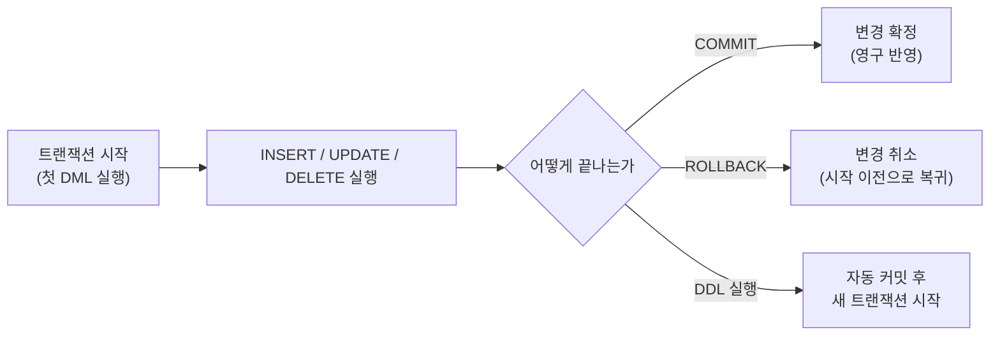

<Callout type="info">
  **이번 문서의 목표:** 트랜잭션이 언제 시작되고 끝나는지 설명하고, COMMIT과 ROLLBACK이 데이터를 어떻게 확정·취소하는지 실행 결과로 구분하며, 여러 개의 SAVEPOINT를 찍었을 때 특정 지점으로 롤백하면 그 뒤 SAVEPOINT들이 어떻게 되는지 시나리오로 추적할 수 있다.
</Callout>

## 1. 트랜잭션이란 — 복습과 이번 편의 목표

09편에서 **트랜잭션**(transaction)을 "더 이상 나눌 수 없는 하나의 논리적 작업 단위"로 정의하고, ACID(Atomicity 원자성·Consistency 일관성·Isolation 격리성·Durability 지속성)라는 네 가지 특성을 다뤘습니다. 예를 들어 계좌 이체는 "A 계좌에서 돈을 빼는 것"과 "B 계좌에 돈을 넣는 것" 두 동작이 반드시 함께 성공하거나 함께 실패해야 하는 하나의 트랜잭션입니다. 둘 중 하나만 성공하면 돈이 사라지거나 복제되는 사고가 나기 때문입니다.

이번 편의 **TCL**(Transaction Control Language, 트랜잭션 제어어)은 이 트랜잭션의 경계를 직접 다루는 명령어 그룹으로, `COMMIT`(확정)·`ROLLBACK`(취소)·`SAVEPOINT`(중간 저장점) 세 가지로 구성됩니다.

> **쉽게 말하면:** 트랜잭션은 게임의 "체크포인트 이전 구간"과 같습니다. COMMIT은 그 구간의 진행을 저장하는 것이고, ROLLBACK은 마지막 저장 지점으로 되돌아가는 것이며, SAVEPOINT는 그 사이에 추가로 찍어 두는 중간 체크포인트입니다.

## 2. 트랜잭션의 시작과 끝

트랜잭션은 언제 시작될까요? 대부분의 데이터베이스(오라클 포함)에서 트랜잭션은 `BEGIN TRANSACTION` 같은 별도의 명령 없이, **데이터를 변경하는 첫 DML 문장(INSERT·UPDATE·DELETE·MERGE)이 실행되는 순간 묵시적으로 시작**됩니다. 그리고 다음 세 가지 방법 중 하나로 끝납니다.

1. **COMMIT**: 지금까지의 변경을 전부 영구히 확정한다.
2. **ROLLBACK**: 지금까지의 변경을 전부 취소하고 트랜잭션 시작 이전 상태로 되돌린다.
3. **DDL 실행**: 10편에서 다룬 대로, CREATE·ALTER·DROP·TRUNCATE 같은 DDL 문장이 실행되면 그 앞의 변경 내용이 자동으로 COMMIT되면서 트랜잭션이 끝난다.

여기에 더해 SQL*Plus 같은 도구에는 **자동 커밋(autocommit)** 모드가 있습니다. 자동 커밋이 켜져 있으면 DML 문장 하나하나가 실행되자마자 자동으로 COMMIT되어, 사실상 ROLLBACK을 쓸 기회가 사라집니다. SQLD 시험에서 다루는 대부분의 문제는 **자동 커밋이 꺼진 상태**(문장을 실행해도 명시적으로 COMMIT하기 전까지는 확정되지 않는 상태)를 전제로 하므로, 이후 모든 예시도 이 전제를 따릅니다.



## 3. COMMIT — 변경을 영구히 확정하기

**COMMIT**은 트랜잭션 시작 이후 실행한 모든 DML 변경을 데이터베이스에 영구히 반영하는 명령어입니다. COMMIT이 실행되고 나면, 그 이전 내용은 더 이상 ROLLBACK으로 취소할 수 없습니다.

실행 전(재고 테이블, 아직 아무 변경도 하지 않은 상태):

| 상품코드 | 수량 |
|----------|------|
| A001 | 10 |

```sql
UPDATE 재고 SET 수량 = 20 WHERE 상품코드 = 'A001';
COMMIT;
```

실행 후(재고 테이블): 수량이 20으로 바뀐 상태가 영구히 확정됩니다.

| 상품코드 | 수량 |
|----------|------|
| A001 | 20 |

COMMIT 이후 `ROLLBACK;`을 입력해도 수량은 20으로 유지됩니다. 되돌릴 대상이 이미 사라졌기 때문입니다.

## 4. ROLLBACK — 변경을 취소하고 되돌리기

**ROLLBACK**은 트랜잭션 시작 이후 아직 COMMIT하지 않은 모든 변경을 취소하고, 트랜잭션이 시작되기 전 상태로 되돌리는 명령어입니다.

실행 전(재고 테이블, 앞선 COMMIT으로 수량 20이 확정된 상태에서 이어서 진행):

| 상품코드 | 수량 |
|----------|------|
| A001 | 20 |

```sql
UPDATE 재고 SET 수량 = 5 WHERE 상품코드 = 'A001';
-- 아직 COMMIT하지 않음
ROLLBACK;
```

실행 후(재고 테이블): UPDATE로 5까지 내려갔던 수량이 ROLLBACK에 의해 다시 20으로 되돌아갑니다.

| 상품코드 | 수량 |
|----------|------|
| A001 | 20 |

<Callout type="warning">
  **자주 틀리는 점 1 — ROLLBACK이 COMMIT된 내용까지 되돌린다는 착각.** "COMMIT이 완료된 변경 사항도 일반적으로 ROLLBACK으로 취소할 수 있다"는 문장이 옳은 설명처럼 오답 선택지에 등장합니다. 하지만 COMMIT은 "이 지점을 새로운 기준선으로 확정한다"는 뜻이므로, COMMIT 이후의 ROLLBACK은 그 COMMIT **이후**에 생긴 변경만 취소할 수 있을 뿐, COMMIT 이전으로는 절대 돌아가지 못합니다.
</Callout>

## 5. SAVEPOINT — 트랜잭션 중간에 저장점 찍기

트랜잭션이 길어지면 "전부 취소" 아니면 "전부 확정"이라는 두 선택지만으로는 부족한 경우가 생깁니다. 예를 들어 세 가지 작업을 연달아 했는데, 그중 마지막 작업만 취소하고 앞의 두 작업은 살리고 싶을 수 있습니다. 이때 쓰는 것이 **SAVEPOINT**입니다. `SAVEPOINT 이름;`으로 트랜잭션 중간에 이름 붙인 저장점을 찍어 두면, `ROLLBACK TO 이름;`으로 트랜잭션 전체가 아니라 **그 저장점 이후의 변경만** 취소할 수 있습니다.

<Callout type="warning">
  **자주 틀리는 점 2 — SAVEPOINT가 트랜잭션을 끝낸다는 착각.** "SAVEPOINT를 지정하면 그 지점에서 트랜잭션 전체가 즉시 종료된다"는 설명은 틀렸습니다. SAVEPOINT는 트랜잭션 안에 표시만 남길 뿐, 트랜잭션 자체는 계속 진행 중인 상태로 남습니다. 트랜잭션을 실제로 끝내는 것은 오직 COMMIT과 (부분이 아닌 전체) ROLLBACK뿐입니다.
</Callout>

### 시나리오 1 — 저장점으로 되돌리면 그 뒤 변경만 사라진다

빈 `재고이력` 테이블(컬럼: `번호`)로 시작해 다음 순서를 실행합니다.

```sql
INSERT INTO 재고이력 VALUES (1);
INSERT INTO 재고이력 VALUES (2);
SAVEPOINT sv1;
UPDATE 재고이력 SET 번호 = 4 WHERE 번호 = 1;
SAVEPOINT sv2;
INSERT INTO 재고이력 VALUES (5);
SAVEPOINT sv3;
DELETE FROM 재고이력 WHERE 번호 >= 4;
ROLLBACK TO sv2;
INSERT INTO 재고이력 VALUES (6);
COMMIT;
```

각 단계에서 테이블이 어떻게 바뀌는지 순서대로 추적합니다.

| 실행 지점 | 재고이력 테이블 상태 |
|-----------|------------------------|
| 두 INSERT 직후(SAVEPOINT sv1 찍기 전) | `{1, 2}` |
| SAVEPOINT sv1 | `{1, 2}` (변화 없음, 저장점만 표시) |
| UPDATE 후 | `{4, 2}` (번호 1이 4로 바뀜) |
| SAVEPOINT sv2 | `{4, 2}` (변화 없음, 저장점만 표시) |
| INSERT(5) 후 | `{4, 2, 5}` |
| SAVEPOINT sv3 | `{4, 2, 5}` (변화 없음, 저장점만 표시) |
| DELETE(번호 대비 4 이상) 후 | `{2}` (4와 5가 모두 삭제됨) |
| **ROLLBACK TO sv2** 후 | `{4, 2}` (sv2 이후의 변경, 즉 INSERT(5)와 DELETE가 모두 취소됨) |
| INSERT(6) 후 | `{4, 2, 6}` |
| COMMIT 후 | `{4, 2, 6}`으로 영구 확정 |

여기서 가장 중요한 지점은 `ROLLBACK TO sv2`입니다. sv2를 찍은 시점 이후에는 "INSERT(5)"와 "SAVEPOINT sv3"와 "DELETE"까지 총 세 가지 사건이 있었습니다. `ROLLBACK TO sv2`는 이 세 가지를 전부 취소합니다. **그 결과 sv2보다 나중에 찍혔던 sv3라는 저장점 자체도 함께 사라집니다.** 만약 이 시점에서 `ROLLBACK TO sv3;`를 실행하려 하면, sv3는 이미 무효화되어 존재하지 않으므로 "그런 이름의 저장점이 없다"는 오류가 발생합니다. 반면 sv1과 sv2는 DELETE보다 먼저 찍힌 저장점이므로 ROLLBACK TO sv2 이후에도 여전히 유효하게 남아 있어, 필요하면 다시 `ROLLBACK TO sv1;`이나 `ROLLBACK TO sv2;`를 실행할 수 있습니다.

> **쉽게 말하면:** 저장점은 시간 순서대로 늘어선 책갈피입니다. 앞쪽 책갈피로 되돌아가면, 그보다 뒤에 꽂아 둔 책갈피들은 이미 지나간 페이지와 함께 전부 뜯겨 나갑니다.

### 시나리오 2 — 같은 이름의 SAVEPOINT를 다시 찍으면 무슨 일이 일어나는가

SAVEPOINT는 이름을 재사용할 수 있습니다. 그런데 이미 사용한 이름으로 SAVEPOINT를 다시 찍으면, **예전 저장점은 사라지고 가장 최근에 찍은 지점이 그 이름의 새 기준이 됩니다.**

```sql
INSERT INTO 재고이력 VALUES (1);
INSERT INTO 재고이력 VALUES (2);
SAVEPOINT sv1;
UPDATE 재고이력 SET 번호 = 4 WHERE 번호 = 1;
SAVEPOINT sv1;
DELETE FROM 재고이력 WHERE 번호 >= 2;
ROLLBACK TO sv1;
INSERT INTO 재고이력 VALUES (3);
COMMIT;
```

| 실행 지점 | 재고이력 테이블 상태 | sv1이 가리키는 지점 |
|-----------|------------------------|------------------------|
| 두 INSERT 직후 | `{1, 2}` | (아직 없음) |
| 첫 번째 SAVEPOINT sv1 | `{1, 2}` | 이 지점(구 sv1) |
| UPDATE 후 | `{4, 2}` | 이 지점(구 sv1) |
| 두 번째 SAVEPOINT sv1 | `{4, 2}` | **이 지점으로 갱신(구 sv1은 무효화)** |
| DELETE(번호 대비 2 이상) 후 | `{}` (4와 2 모두 삭제) | 신 sv1 지점 |
| **ROLLBACK TO sv1** 후 | `{4, 2}` (DELETE만 취소, UPDATE는 유지) | 신 sv1 지점 |
| INSERT(3) 후 | `{4, 2, 3}` | |
| COMMIT 후 | `{4, 2, 3}`으로 영구 확정 | |

만약 이름을 재사용하지 않고 sv1이 여전히 "두 INSERT 직후"를 가리킨다고 착각하면, `ROLLBACK TO sv1;`을 실행했을 때 UPDATE로 만든 4까지 전부 취소되어 `{1, 2}`로 돌아간다고 잘못 예상하게 됩니다. 하지만 실제로는 두 번째로 찍은 sv1(UPDATE 이후 지점)이 유효한 저장점이므로, UPDATE의 결과(번호 4)는 그대로 남고 그 뒤의 DELETE만 취소됩니다.

## 6. DDL의 자동 커밋과 SAVEPOINT — 복습

10편에서 다룬 대로, CREATE·ALTER·DROP·TRUNCATE 같은 DDL 문장이 실행되면 그 순간 이전까지의 모든 변경이 자동으로 COMMIT됩니다. 이는 SAVEPOINT에도 그대로 적용됩니다. DDL이 실행되면 그 앞에 찍어 둔 SAVEPOINT는 전부 의미를 잃고, 이후 `ROLLBACK TO 저장점이름;`을 시도해도 "저장점을 찾을 수 없다"는 오류만 발생합니다.

```sql
INSERT INTO 주문 VALUES (1, 100, 5000);
SAVEPOINT sv1;
INSERT INTO 주문 VALUES (2, 101, 12000);
CREATE TABLE 임시로그 (기록 VARCHAR2(50));
-- 이 순간 두 INSERT가 모두 자동 커밋되고, sv1도 함께 무효화된다
ROLLBACK TO sv1;
```

실행 전(주문 테이블 0건) → 실행 후(주문 테이블): 두 INSERT가 DDL 실행 시점에 이미 자동 커밋되었으므로, 마지막 줄의 `ROLLBACK TO sv1;`은 저장점을 찾지 못해 오류가 나고, 주문 테이블에는 두 건이 그대로 남습니다.

| 주문번호 | 회원번호 | 금액 |
|----------|----------|------|
| 1 | 100 | 5000 |
| 2 | 101 | 12000 |

## 직접 해보기

<Callout type="info">
  00편에서 만든 Docker + Oracle 실습 환경에서 진행합니다. 아직 안 만들었다면 00편을 먼저 보세요. seed.sql이 만든 표는 건드리지 않고, 아래에서 새로 만드는 실습 전용 표에서만 진행합니다.
</Callout>

### 직접 해보기 1 — ROLLBACK과 COMMIT 이후 ROLLBACK을 비교한다

실습 전용 표를 하나 만들고, COMMIT 전과 후에 ROLLBACK이 다르게 동작하는지 직접 비교합니다.

```sql
CREATE TABLE 연습재고 (수량 NUMBER);
INSERT INTO 연습재고 VALUES (100);
ROLLBACK;
SELECT * FROM 연습재고;
```

**무엇을 보아야 하나**: SELECT 결과가 몇 건인지 보세요. 방금 넣은 100이 남아 있는지, 사라졌는지가 핵심입니다.

이어서 COMMIT을 끼워 넣고 같은 순서를 반복합니다.

```sql
INSERT INTO 연습재고 VALUES (200);
COMMIT;
ROLLBACK;
SELECT * FROM 연습재고;
```

**무엇을 보아야 하나**: 이번에는 ROLLBACK 뒤에도 200이 남아 있는지 확인하세요. 앞의 실습과 결과가 왜 달라지는지 COMMIT 시점을 기준으로 설명해 보세요.

> **왜 이걸 해보나:** "COMMIT된 내용도 ROLLBACK으로 되돌릴 수 있다"는 문장이 옳은 설명처럼 오답 선택지에 등장합니다. 직접 눈으로 두 결과의 차이를 보면 이 함정에 흔들리지 않습니다.

### 직접 해보기 2 — SAVEPOINT 여러 개를 찍고 중간 지점으로 롤백한다

같은 표에서 저장점을 여러 개 찍은 뒤 중간 저장점으로 되돌아가면, 그보다 나중에 찍은 저장점이 어떻게 되는지 직접 확인합니다.

```sql
DELETE FROM 연습재고;
INSERT INTO 연습재고 VALUES (1);
SAVEPOINT sv1;
INSERT INTO 연습재고 VALUES (2);
SAVEPOINT sv2;
INSERT INTO 연습재고 VALUES (3);
```

**무엇을 보아야 하나**: 여기까지 실행한 뒤 `ROLLBACK TO sv1;`을 실행하고 `SELECT * FROM 연습재고;`로 몇 건이 남는지 확인하세요. 그다음 `ROLLBACK TO sv2;`를 시도했을 때 어떤 메시지가 나오는지도 확인하세요.

> **왜 이걸 해보나:** 중간 저장점으로 롤백하면 그 뒤에 찍힌 저장점까지 함께 무효화된다는 규칙은 말로만 들으면 헷갈립니다. sv2가 실제로 "없는 저장점"이 되어 오류가 나는 것을 직접 봐야 확실히 기억에 남습니다.

### 직접 해보기 3 — DDL을 실행하면 자동 커밋되어 ROLLBACK이 안 먹는다

가장 많이 틀리는 함정입니다. INSERT 뒤에 DDL(CREATE TABLE)을 끼워 넣고 ROLLBACK을 해도 INSERT가 취소되지 않는 것을 직접 확인합니다.

```sql
INSERT INTO 연습재고 VALUES (999);
CREATE TABLE 연습DDL테스트 (번호 NUMBER);
ROLLBACK;
SELECT * FROM 연습재고;
```

**무엇을 보아야 하나**: ROLLBACK을 실행했는데도 999가 사라지지 않고 그대로 남아 있는지 확인하세요.

> **왜 이걸 해보나:** "DDL 실행 전의 DML도 ROLLBACK으로 되돌릴 수 있다"고 착각하면 시험장에서 바로 틀립니다. 999가 살아남는 것을 직접 보면 이 규칙이 몸에 붙습니다.

## 핵심 정리

- 트랜잭션은 첫 DML 실행으로 묵시적으로 시작되며, COMMIT·ROLLBACK·DDL 실행(자동 커밋) 중 하나로 끝난다
- COMMIT은 그 시점까지의 변경을 영구히 확정해 이후 ROLLBACK으로도 되돌릴 수 없게 만든다
- ROLLBACK은 COMMIT하지 않은 변경만 취소한다. 이미 COMMIT된 내용은 어떤 ROLLBACK으로도 되돌릴 수 없다
- SAVEPOINT는 트랜잭션을 끝내지 않고 중간 저장점만 표시하며, `ROLLBACK TO 저장점`은 그 지점 이후의 변경과 그 이후에 찍힌 다른 SAVEPOINT까지 함께 무효화한다
- 같은 이름으로 SAVEPOINT를 다시 찍으면 예전 저장점은 사라지고 가장 최근 지점이 그 이름의 새 기준이 된다
- DDL은 실행 즉시 이전 변경을 자동 커밋시키며, 이때 그 이전에 찍은 SAVEPOINT도 함께 무효화된다

## 마무리 복습

<Quiz
  questionNumber={1}
  question="트랜잭션의 종료 방법으로 옳지 않은 것은?"
  options={['COMMIT을 실행해 변경을 확정한다', 'ROLLBACK을 실행해 변경을 취소한다', 'CREATE TABLE 같은 DDL을 실행하면 자동으로 커밋되며 트랜잭션이 종료된다', 'SAVEPOINT를 실행하면 그 지점에서 트랜잭션이 즉시 종료된다']}
  correctAnswer={4}
  explanation="SAVEPOINT는 트랜잭션 중간에 되돌아갈 지점을 표시할 뿐 트랜잭션을 종료시키지 않는다. 트랜잭션은 COMMIT, (전체) ROLLBACK, 또는 DDL의 자동 커밋으로만 종료된다."
  optionExplanations={['COMMIT은 트랜잭션을 확정하며 종료시키는 정상적인 방법이라 옳은 설명이다', 'ROLLBACK은 트랜잭션을 취소하며 종료시키는 정상적인 방법이라 옳은 설명이다', 'DDL 실행 시 자동 커밋되어 트랜잭션이 종료되는 것이 옳은 설명이다', 'SAVEPOINT는 저장점만 표시할 뿐 트랜잭션을 종료시키지 않으므로 이 설명이 틀렸다']}
/>

<Quiz
  questionNumber={2}
  question="COMMIT이 완료된 변경 사항에 대한 설명으로 옳은 것은?"
  options={['이후 ROLLBACK을 실행하면 되돌릴 수 있다', 'ROLLBACK으로도 되돌릴 수 없다', 'SAVEPOINT를 지정하면 되돌릴 수 있다', 'COMMIT은 아직 확정된 상태가 아니므로 취소가 가능하다']}
  correctAnswer={2}
  explanation="COMMIT은 그 시점까지의 변경을 영구히 확정하는 명령이다. COMMIT 이후의 ROLLBACK은 그 COMMIT 이후에 생긴 변경만 취소할 수 있을 뿐, COMMIT 이전 내용은 어떤 방법으로도 되돌릴 수 없다."
  optionExplanations={['ROLLBACK은 COMMIT 이전 내용을 되돌리지 못하므로 이 설명은 틀렸다', 'COMMIT된 내용은 영구히 확정되어 되돌릴 수 없다는 것이 정확한 설명이다', 'SAVEPOINT도 COMMIT 이전 시점으로는 되돌릴 수 없으므로 틀렸다', 'COMMIT은 변경을 영구히 확정하는 명령이므로 취소 가능하다는 설명은 틀렸다']}
/>

<Quiz
  questionNumber={3}
  question={"빈 테이블에 다음을 순서대로 실행했다. 마지막 SELECT의 결과로 옳은 것은?\n\n```sql\nINSERT VALUES(1);\nINSERT VALUES(2);\nSAVEPOINT sv1;\nUPDATE 번호=4 WHERE 번호=1;\nSAVEPOINT sv2;\nINSERT VALUES(5);\nDELETE WHERE 번호가 4 이상;\nROLLBACK TO sv2;\nINSERT VALUES(6);\nCOMMIT;\nSELECT * FROM 테이블;\n```"}
  options={['1, 2, 6', '4, 2, 6', '4, 2, 5, 6', '2, 6']}
  correctAnswer={2}
  explanation="sv2는 UPDATE(번호 1을 4로 변경) 이후에 찍혔으므로, ROLLBACK TO sv2는 그 이후의 INSERT(5)와 DELETE만 취소한다. UPDATE의 결과인 4는 그대로 남아 상태는 {4, 2}가 되고, 이후 INSERT(6)로 {4, 2, 6}이 되어 COMMIT된다."
  optionExplanations={['1, 2는 sv1 시점 이전 상태로, sv2로 롤백하면 UPDATE 결과(4)는 유지되므로 오답이다', 'sv2 시점의 상태(UPDATE 반영된 4, 2)에 이후 INSERT(6)만 더해진 정확한 결과다', 'INSERT(5)는 sv2 이후에 실행되어 ROLLBACK TO sv2로 취소되므로 5는 남아 있지 않아 오답이다', 'UPDATE로 번호 1이 4로 바뀐 값은 sv2 이전 변경이라 살아남으므로 4가 빠진 이 결과는 오답이다']}
/>

<Quiz
  questionNumber={4}
  question="트랜잭션 안에서 같은 이름 sv1으로 SAVEPOINT를 두 번 선언했다. 이후 ROLLBACK TO sv1을 실행하면 어느 지점으로 돌아가는가?"
  options={['첫 번째로 선언한 sv1 지점', '두 번째로 선언한 sv1 지점', '트랜잭션이 시작된 지점', '둘 중 더 이전 지점(자동으로 더 안전한 쪽 선택)']}
  correctAnswer={2}
  explanation="같은 이름으로 SAVEPOINT를 다시 선언하면 이전 저장점은 무효화되고 가장 최근에 선언한 지점이 그 이름의 유효한 기준이 된다. 따라서 ROLLBACK TO sv1은 두 번째로 선언한 지점으로 돌아간다."
  optionExplanations={['첫 번째 sv1은 두 번째 선언으로 무효화되어 더 이상 그 지점을 가리키지 않으므로 오답이다', '가장 최근에 선언한 지점이 유효한 sv1이 되는 것이 정확한 동작이다', '트랜잭션 시작 지점으로 돌아가는 것은 저장점 없는 전체 ROLLBACK의 동작이라 오답이다', 'SAVEPOINT는 안전성을 판단해 자동으로 지점을 고르지 않고 항상 가장 최근 선언을 기준으로 삼으므로 오답이다']}
/>

<Quiz
  questionNumber={5}
  question="SAVEPOINT sv1, sv2, sv3를 순서대로 찍은 뒤 ROLLBACK TO sv1을 실행했다. 이후 ROLLBACK TO sv3를 다시 실행하면 어떻게 되는가?"
  options={['sv3 지점으로 정상적으로 돌아간다', 'sv3가 이미 무효화되어 저장점을 찾을 수 없다는 오류가 발생한다', 'sv2 지점으로 대신 돌아간다', '트랜잭션이 자동으로 COMMIT된다']}
  correctAnswer={2}
  explanation="ROLLBACK TO sv1은 sv1 이후의 모든 변경을 취소하며, sv1보다 나중에 찍힌 sv2와 sv3도 함께 무효화된다. 따라서 이후 ROLLBACK TO sv3를 실행하면 그런 이름의 저장점이 없다는 오류가 발생한다."
  optionExplanations={['sv3는 sv1보다 나중에 찍혀 ROLLBACK TO sv1 시점에 이미 무효화되었으므로 오답이다', 'sv1 이후의 저장점(sv2, sv3)이 함께 무효화된다는 것이 정확한 동작이다', '무효화된 저장점으로 자동으로 대체되는 기능은 없으며 오류가 발생하므로 오답이다', 'ROLLBACK TO는 트랜잭션을 종료시키지 않고 부분 취소만 하므로 자동 COMMIT은 일어나지 않아 오답이다']}
/>

<Quiz
  questionNumber={6}
  question={"다음을 실행하면 어떤 일이 일어나는가?\n\n```sql\nINSERT INTO 주문 VALUES(1, 100, 5000);\nSAVEPOINT sv1;\nINSERT INTO 주문 VALUES(2, 101, 12000);\nCREATE TABLE 임시로그(기록 VARCHAR2(50));\nROLLBACK TO sv1;\n```"}
  options={['정상적으로 sv1 시점으로 돌아가 주문 테이블에 1건만 남는다', 'CREATE TABLE 실행 시 두 INSERT가 모두 자동 커밋되어 sv1이 무효화되고 ROLLBACK TO sv1은 오류가 난다', 'CREATE TABLE이 실패해 임시로그 테이블이 생성되지 않는다', 'ROLLBACK TO sv1이 CREATE TABLE까지 취소해 임시로그 테이블도 사라진다']}
  correctAnswer={2}
  explanation="DDL인 CREATE TABLE이 실행되면 그 이전의 모든 변경(두 INSERT)이 자동으로 커밋되며, 그 이전에 찍힌 SAVEPOINT sv1도 함께 무효화된다. 따라서 이후 ROLLBACK TO sv1은 저장점을 찾을 수 없어 오류가 발생하고, 주문 테이블에는 두 건이 그대로 남는다."
  optionExplanations={['DDL의 자동 커밋으로 sv1이 이미 무효화되어 정상적인 롤백이 불가능하므로 오답이다', 'DDL 실행 시점의 자동 커밋과 그에 따른 SAVEPOINT 무효화를 정확히 설명한 정답이다', 'CREATE TABLE 문법 자체는 문제가 없어 정상적으로 테이블이 생성되므로 오답이다', 'DDL은 이미 자동 커밋되어 확정된 상태라 이후 ROLLBACK으로 되돌릴 수 없으므로 오답이다']}
/>

## 참고 자료

- [Oracle Database SQL Language Reference](https://docs.oracle.com/en/database/oracle/oracle-database/19/sqlrf/)
