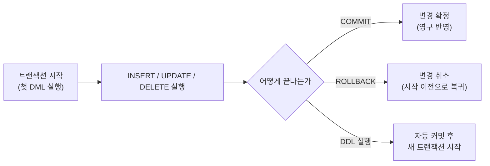

## 1. 트랜잭션이란 — 복습과 이번 편의 목표

09편에서 **트랜잭션**(transaction)을 "더 이상 나눌 수 없는 하나의 논리적 작업 단위"로 정의하고, ACID(Atomicity 원자성·Consistency 일관성·Isolation 격리성·Durability 지속성)라는 네 가지 특성을 다뤘습니다. 예를 들어 계좌 이체는 "A 계좌에서 돈을 빼는 것"과 "B 계좌에 돈을 넣는 것" 두 동작이 반드시 함께 성공하거나 함께 실패해야 하는 하나의 트랜잭션입니다.

이번 편의 **TCL**(Transaction Control Language, 트랜잭션 제어어)은 이 트랜잭션의 경계를 직접 다루는 명령어 그룹으로, `COMMIT`(확정)·`ROLLBACK`(취소)·`SAVEPOINT`(중간 저장점) 세 가지로 구성됩니다.

## 2. 트랜잭션의 시작과 끝

트랜잭션은 언제 시작될까요? 대부분의 데이터베이스(오라클 포함)에서 트랜잭션은 `BEGIN TRANSACTION` 같은 별도의 명령 없이, **데이터를 변경하는 첫 DML 문장(INSERT·UPDATE·DELETE·MERGE)이 실행되는 순간 묵시적으로 시작**됩니다. 그리고 다음 세 가지 방법 중 하나로 끝납니다.

1. **COMMIT**: 지금까지의 변경을 전부 영구히 확정한다.
2. **ROLLBACK**: 지금까지의 변경을 전부 취소하고 트랜잭션 시작 이전 상태로 되돌린다.
3. **DDL 실행**: 10편에서 다룬 대로, CREATE·ALTER·DROP·TRUNCATE 같은 DDL 문장이 실행되면 그 앞의 변경 내용이 자동으로 COMMIT되면서 트랜잭션이 끝난다.

여기에 더해 SQL*Plus 같은 도구에는 **자동 커밋(autocommit)** 모드가 있습니다. SQLD 시험에서 다루는 대부분의 문제는 **자동 커밋이 꺼진 상태**(문장을 실행해도 명시적으로 COMMIT하기 전까지는 확정되지 않는 상태)를 전제로 하므로, 이후 모든 예시도 이 전제를 따릅니다.


```mermaid
flowchart LR
    A["트랜잭션 시작<br/>(첫 DML 실행)"] --> B["INSERT / UPDATE / DELETE 실행"]
    B --> C{"어떻게 끝나는가"}
    C -->|"COMMIT"| D["변경 확정<br/>(영구 반영)"]
    C -->|"ROLLBACK"| E["변경 취소<br/>(시작 이전으로 복귀)"]
    C -->|"DDL 실행"| F["자동 커밋 후<br/>새 트랜잭션 시작"]
```

## 3. COMMIT — 변경을 영구히 확정하기

**COMMIT**은 트랜잭션 시작 이후 실행한 모든 DML 변경을 데이터베이스에 영구히 반영하는 명령어입니다. COMMIT이 실행되고 나면, 그 이전 내용은 더 이상 ROLLBACK으로 취소할 수 없습니다.

실행 전(재고 테이블, 아직 아무 변경도 하지 않은 상태):

| 상품코드 | 수량 |
|----------|------|
| A001 | 10 |

```sql
UPDATE 재고 SET 수량 = 20 WHERE 상품코드 = 'A001';
COMMIT;
```

실행 후(재고 테이블): 수량이 20으로 바뀐 상태가 영구히 확정됩니다.

| 상품코드 | 수량 |
|----------|------|
| A001 | 20 |

COMMIT 이후 `ROLLBACK;`을 입력해도 수량은 20으로 유지됩니다. 되돌릴 대상이 이미 사라졌기 때문입니다.

## 4. ROLLBACK — 변경을 취소하고 되돌리기

**ROLLBACK**은 트랜잭션 시작 이후 아직 COMMIT하지 않은 모든 변경을 취소하고, 트랜잭션이 시작되기 전 상태로 되돌리는 명령어입니다.

실행 전(재고 테이블, 앞선 COMMIT으로 수량 20이 확정된 상태에서 이어서 진행):

| 상품코드 | 수량 |
|----------|------|
| A001 | 20 |

```sql
UPDATE 재고 SET 수량 = 5 WHERE 상품코드 = 'A001';
-- 아직 COMMIT하지 않음
ROLLBACK;
```

실행 후(재고 테이블): UPDATE로 5까지 내려갔던 수량이 ROLLBACK에 의해 다시 20으로 되돌아갑니다.

| 상품코드 | 수량 |
|----------|------|
| A001 | 20 |

<Callout type="warning">
  **자주 틀리는 점 1 — ROLLBACK이 COMMIT된 내용까지 되돌린다는 착각.** "COMMIT이 완료된 변경 사항도 일반적으로 ROLLBACK으로 취소할 수 있다"는 문장이 옳은 설명처럼 오답 선택지에 등장합니다. 하지만 COMMIT은 "이 지점을 새로운 기준선으로 확정한다"는 뜻이므로, COMMIT 이후의 ROLLBACK은 그 COMMIT **이후**에 생긴 변경만 취소할 수 있을 뿐, COMMIT 이전으로는 절대 돌아가지 못합니다.
</Callout>

## 5. SAVEPOINT — 트랜잭션 중간에 저장점 찍기

트랜잭션이 길어지면 "전부 취소" 아니면 "전부 확정"이라는 두 선택지만으로는 부족한 경우가 생깁니다. 이때 쓰는 것이 **SAVEPOINT**입니다.

<Callout type="warning">
  **자주 틀리는 점 2 — SAVEPOINT가 트랜잭션을 끝낸다는 착각.** "SAVEPOINT를 지정하면 그 지점에서 트랜잭션 전체가 즉시 종료된다"는 설명은 틀렸습니다. SAVEPOINT는 트랜잭션 안에 표시만 남길 뿐, 트랜잭션 자체는 계속 진행 중인 상태로 남습니다. 트랜잭션을 실제로 끝내는 것은 오직 COMMIT과 (부분이 아닌 전체) ROLLBACK뿐입니다.
</Callout>

### 시나리오 1 — 저장점으로 되돌리면 그 뒤 변경만 사라진다

빈 `재고이력` 테이블(컬럼: `번호`)로 시작해 다음 순서를 실행합니다.

```sql
INSERT INTO 재고이력 VALUES (1);
INSERT INTO 재고이력 VALUES (2);
SAVEPOINT sv1;
UPDATE 재고이력 SET 번호 = 4 WHERE 번호 = 1;
SAVEPOINT sv2;
INSERT INTO 재고이력 VALUES (5);
SAVEPOINT sv3;
DELETE FROM 재고이력 WHERE 번호 >= 4;
ROLLBACK TO sv2;
INSERT INTO 재고이력 VALUES (6);
COMMIT;
```

각 단계에서 테이블이 어떻게 바뀌는지 순서대로 추적합니다.

| 실행 지점 | 재고이력 테이블 상태 |
|-----------|------------------------|
| 두 INSERT 직후(SAVEPOINT sv1 찍기 전) | `{1, 2}` |
| SAVEPOINT sv1 | `{1, 2}` (변화 없음, 저장점만 표시) |
| UPDATE 후 | `{4, 2}` (번호 1이 4로 바뀜) |
| SAVEPOINT sv2 | `{4, 2}` (변화 없음, 저장점만 표시) |
| INSERT(5) 후 | `{4, 2, 5}` |
| SAVEPOINT sv3 | `{4, 2, 5}` (변화 없음, 저장점만 표시) |
| DELETE(번호 대비 4 이상) 후 | `{2}` (4와 5가 모두 삭제됨) |
| **ROLLBACK TO sv2** 후 | `{4, 2}` (sv2 이후의 변경, 즉 INSERT(5)와 DELETE가 모두 취소됨) |
| INSERT(6) 후 | `{4, 2, 6}` |
| COMMIT 후 | `{4, 2, 6}`으로 영구 확정 |

여기서 가장 중요한 지점은 `ROLLBACK TO sv2`입니다. sv2를 찍은 시점 이후에는 "INSERT(5)"와 "SAVEPOINT sv3"와 "DELETE"까지 총 세 가지 사건이 있었습니다. `ROLLBACK TO sv2`는 이 세 가지를 전부 취소합니다.

### 시나리오 2 — 같은 이름의 SAVEPOINT를 다시 찍으면 무슨 일이 일어나는가

SAVEPOINT는 이름을 재사용할 수 있습니다. 그런데 이미 사용한 이름으로 SAVEPOINT를 다시 찍으면, **예전 저장점은 사라지고 가장 최근에 찍은 지점이 그 이름의 새 기준이 됩니다.**

```sql
INSERT INTO 재고이력 VALUES (1);
INSERT INTO 재고이력 VALUES (2);
SAVEPOINT sv1;
UPDATE 재고이력 SET 번호 = 4 WHERE 번호 = 1;
SAVEPOINT sv1;
DELETE FROM 재고이력 WHERE 번호 >= 2;
ROLLBACK TO sv1;
INSERT INTO 재고이력 VALUES (3);
COMMIT;
```

| 실행 지점 | 재고이력 테이블 상태 | sv1이 가리키는 지점 |
|-----------|------------------------|------------------------|
| 두 INSERT 직후 | `{1, 2}` | (아직 없음) |
| 첫 번째 SAVEPOINT sv1 | `{1, 2}` | 이 지점(구 sv1) |
| UPDATE 후 | `{4, 2}` | 이 지점(구 sv1) |
| 두 번째 SAVEPOINT sv1 | `{4, 2}` | **이 지점으로 갱신(구 sv1은 무효화)** |
| DELETE(번호 대비 2 이상) 후 | `{}` (4와 2 모두 삭제) | 신 sv1 지점 |
| **ROLLBACK TO sv1** 후 | `{4, 2}` (DELETE만 취소, UPDATE는 유지) | 신 sv1 지점 |
| INSERT(3) 후 | `{4, 2, 3}` | |
| COMMIT 후 | `{4, 2, 3}`으로 영구 확정 | |

만약 이름을 재사용하지 않고 sv1이 여전히 "두 INSERT 직후"를 가리킨다고 착각하면, `ROLLBACK TO sv1;`을 실행했을 때 UPDATE로 만든 4까지 전부 취소되어 `{1, 2}`로 돌아간다고 잘못 예상하게 됩니다. 하지만 실제로는 두 번째로 찍은 sv1(UPDATE 이후 지점)이 유효한 저장점이므로, UPDATE의 결과(번호 4)는 그대로 남고 그 뒤의 DELETE만 취소됩니다.

## 6. DDL의 자동 커밋과 SAVEPOINT — 복습

10편에서 다룬 대로, CREATE·ALTER·DROP·TRUNCATE 같은 DDL 문장이 실행되면 그 순간 이전까지의 모든 변경이 자동으로 COMMIT됩니다. DDL이 실행되면 그 앞에 찍어 둔 SAVEPOINT는 전부 의미를 잃고, 이후 `ROLLBACK TO 저장점이름;`을 시도해도 "저장점을 찾을 수 없다"는 오류만 발생합니다.

```sql
INSERT INTO 주문 VALUES (1, 100, 5000);
SAVEPOINT sv1;
INSERT INTO 주문 VALUES (2, 101, 12000);
CREATE TABLE 임시로그 (기록 VARCHAR2(50));
-- 이 순간 두 INSERT가 모두 자동 커밋되고, sv1도 함께 무효화된다
ROLLBACK TO sv1;
```

실행 전(주문 테이블 0건) → 실행 후(주문 테이블): 두 INSERT가 DDL 실행 시점에 이미 자동 커밋되었으므로, 마지막 줄의 `ROLLBACK TO sv1;`은 저장점을 찾지 못해 오류가 나고, 주문 테이블에는 두 건이 그대로 남습니다.

| 주문번호 | 회원번호 | 금액 |
|----------|----------|------|
| 1 | 100 | 5000 |
| 2 | 101 | 12000 |

## 핵심 정리

- 트랜잭션은 첫 DML 실행으로 묵시적으로 시작되며, COMMIT·ROLLBACK·DDL 실행(자동 커밋) 중 하나로 끝난다
- COMMIT은 그 시점까지의 변경을 영구히 확정해 이후 ROLLBACK으로도 되돌릴 수 없게 만든다
- ROLLBACK은 COMMIT하지 않은 변경만 취소한다. 이미 COMMIT된 내용은 어떤 ROLLBACK으로도 되돌릴 수 없다
- SAVEPOINT는 트랜잭션을 끝내지 않고 중간 저장점만 표시하며, `ROLLBACK TO 저장점`은 그 지점 이후의 변경과 그 이후에 찍힌 다른 SAVEPOINT까지 함께 무효화한다
- 같은 이름으로 SAVEPOINT를 다시 찍으면 예전 저장점은 사라지고 가장 최근 지점이 그 이름의 새 기준이 된다
- DDL은 실행 즉시 이전 변경을 자동 커밋시키며, 이때 그 이전에 찍은 SAVEPOINT도 함께 무효화된다

## 마무리 복습

<Quiz
  questionNumber={1}
  question={"트랜잭션의 종료 방법으로 옳지 않은 것은?"}
  options={["COMMIT을 실행해 변경을 확정한다","ROLLBACK을 실행해 변경을 취소한다","CREATE TABLE 같은 DDL을 실행하면 자동으로 커밋되며 트랜잭션이 종료된다","SAVEPOINT를 실행하면 그 지점에서 트랜잭션이 즉시 종료된다"]}
  correctAnswer={4}
  explanation={"SAVEPOINT는 트랜잭션 중간에 되돌아갈 지점을 표시할 뿐 트랜잭션을 종료시키지 않는다. 트랜잭션은 COMMIT, (전체) ROLLBACK, 또는 DDL의 자동 커밋으로만 종료된다."}
/>

<Quiz
  questionNumber={2}
  question={"COMMIT이 완료된 변경 사항에 대한 설명으로 옳은 것은?"}
  options={["이후 ROLLBACK을 실행하면 되돌릴 수 있다","ROLLBACK으로도 되돌릴 수 없다","SAVEPOINT를 지정하면 되돌릴 수 있다","COMMIT은 아직 확정된 상태가 아니므로 취소가 가능하다"]}
  correctAnswer={2}
  explanation={"COMMIT은 그 시점까지의 변경을 영구히 확정하는 명령이다. COMMIT 이후의 ROLLBACK은 그 COMMIT 이후에 생긴 변경만 취소할 수 있을 뿐, COMMIT 이전 내용은 어떤 방법으로도 되돌릴 수 없다."}
/>

<Quiz
  questionNumber={3}
  question={"빈 테이블에 다음을 순서대로 실행했다. 마지막 SELECT의 결과로 옳은 것은?\\n\\n```sql\\nINSERT VALUES(1);\\nINSERT VALUES(2);\\nSAVEPOINT sv1;\\nUPDATE 번호=4 WHERE 번호=1;\\nSAVEPOINT sv2;\\nINSERT VALUES(5);\\nDELETE WHERE 번호가 4 이상;\\nROLLBACK TO sv2;\\nINSERT VALUES(6);\\nCOMMIT;\\nSELECT * FROM 테이블;\\n```"}
  options={["1, 2, 6","4, 2, 6","4, 2, 5, 6","2, 6"]}
  correctAnswer={2}
  explanation={"sv2는 UPDATE(번호 1을 4로 변경) 이후에 찍혔으므로, ROLLBACK TO sv2는 그 이후의 INSERT(5)와 DELETE만 취소한다."}
/>

## 참고 자료

- [Oracle Database SQL Language Reference](https://docs.oracle.com/en/database/oracle/oracle-database/19/sqlrf/)
