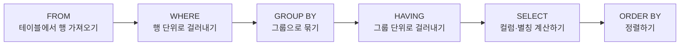

## SQL은 왜 "실행 순서"부터 알아야 하는가

SQL 문장을 처음 보면 `SELECT ... FROM ... WHERE ...` 순서로 **적기 때문에**, 많은 입문자가 데이터베이스도 이 순서대로, 즉 SELECT부터 실행한다고 착각한다. 하지만 실제로 데이터베이스 엔진(SQL 문장을 해석해 실제로 디스크의 데이터를 읽고 계산하는 프로그램)은 **적힌 순서와 전혀 다른 순서**로 문장을 처리한다.

이 순서를 모르면 이런 질문에 답할 수 없다.

- 왜 WHERE 절에서는 `SELECT 나이 AS 연령`처럼 SELECT 절에서 만든 별칭(alias, 컬럼이나 표현식에 붙이는 임시 이름)인 `연령`을 쓰면 오류가 나는데, ORDER BY 절에서는 `ORDER BY 연령`처럼 똑같은 별칭을 써도 되는가?
- 왜 `WHERE SUM(급여) > 1000`처럼 집계 함수(여러 행의 값을 하나로 요약하는 함수, 15편에서 본격적으로 다룬다)를 WHERE에 쓰면 오류가 나는가?

정답은 하나다. **SQL 엔진은 실제로 다음 순서로 실행한다.**



### 순서가 만드는 결과 1: WHERE는 별칭을 모른다

WHERE는 SELECT보다 **먼저** 실행된다. 그런데 별칭(`AS 연령` 같은 이름)은 SELECT 절이 실행되는 그 순간에 비로소 만들어지는 이름표다.

반대로 ORDER BY는 SELECT **다음에** 실행된다. SELECT가 이미 `연령`이라는 별칭을 만들어 결과 집합에 붙여 놓은 뒤이므로, ORDER BY 시점에는 `연령`이라는 이름이 이미 존재한다. 그래서 `ORDER BY 연령`은 문제없이 동작한다.

```sql
-- WHERE 절: 아직 별칭이 만들어지기 전 → 오류
SELECT 사원명, 나이 AS 연령
FROM 사원
WHERE 연령 > 20;   -- 오류: 연령이라는 이름을 아직 모른다

-- ORDER BY 절: 이미 SELECT가 별칭을 만든 뒤 → 정상
SELECT 사원명, 나이 AS 연령
FROM 사원
ORDER BY 연령;      -- 정상: SELECT가 만든 별칭을 재사용
```

### 순서가 만드는 결과 2: WHERE와 HAVING의 역할이 갈리는 이유

WHERE는 GROUP BY보다 **먼저** 실행되므로, WHERE가 걸러내는 대상은 아직 그룹으로 묶이지 않은 **개별 행(row)** 이다. 반면 HAVING은 GROUP BY **다음**에 실행되므로, HAVING이 걸러내는 대상은 이미 그룹으로 묶여 집계된 **그룹 단위의 결과**다.

**자주 틀리는 점**: "WHERE와 HAVING 둘 다 조건을 거는 절인데 왜 나눠져 있나"라는 질문에 "HAVING이 더 나중에 나온 문법이라서" 같은 근거 없는 답을 고르는 함정이 기출에 자주 나온다. 정답 근거는 항상 **실행 순서**(WHERE는 그룹화 이전, HAVING은 그룹화 이후)여야 한다.

## 비교 연산자

비교 연산자는 두 값의 크고 작음, 같고 다름을 판단해 참(TRUE) 또는 거짓(FALSE)을 반환한다. WHERE 절은 이 참·거짓 결과가 참인 행만 통과시킨다.

| 연산자 | 의미 | 예시 | 예시의 뜻 |
|---|---|---|---|
| `=` | 같다 | `부서 = '영업'` | 부서가 정확히 영업인 행 |
| `!=` 또는 `<>` | 다르다 | `부서 <> '영업'` | 부서가 영업이 아닌 행 |
| `>` | 크다 | `연봉 > 3000` | 연봉이 3000보다 큰(초과) 행 |
| `>=` | 크거나 같다 | `연봉 >= 3000` | 연봉이 3000 이상인 행 |
| `<` | 작다 | `연봉 < 3000` | 연봉이 3000보다 작은(미만) 행 |
| `<=` | 작거나 같다 | `연봉 <= 3000` | 연봉이 3000 이하인 행 |

**자주 틀리는 점**: `!=`와 `<>`는 표준 SQL에서 둘 다 "다르다"는 뜻으로 동일하게 동작한다(오라클·MySQL 모두 지원). 하지만 NULL과 비교할 때는 어느 쪽을 써도 결과가 달라진다.

## 논리 연산자: AND, OR, NOT

논리 연산자는 여러 개의 조건(각각 참 또는 거짓인 비교식)을 하나로 묶는다.

- **AND**: 두 조건이 모두 참일 때만 참이다.
- **OR**: 두 조건 중 하나라도 참이면 참이다.
- **NOT**: 조건의 참·거짓을 뒤집는다.

```sql
-- 부서가 영업이면서 동시에 연봉이 3000 초과인 행
SELECT 사원명 FROM 사원
WHERE 부서 = '영업' AND 연봉 > 3000;

-- 부서가 영업이거나 연봉이 3000 초과인 행(둘 중 하나만 맞아도 통과)
SELECT 사원명 FROM 사원
WHERE 부서 = '영업' OR 연봉 > 3000;
```

### 연산자 우선순위

한 WHERE 절에 AND와 OR가 섞이면 어떤 순서로 계산할지가 결과를 완전히 바꾼다. SQL의 연산자 우선순위는 다음과 같다. 숫자가 작을수록 먼저 계산된다.

| 우선순위 | 연산자 | 비고 |
|---|---|---|
| 1 | 산술 연산자(`+` `-` `*` `/`) | 값 계산이 조건 계산보다 먼저 |
| 2 | 비교 연산자(`=` `>` `<` 등), `BETWEEN`, `IN`, `LIKE`, `IS NULL` | 조건 하나하나를 먼저 판정 |
| 3 | `NOT` | 판정된 조건을 뒤집음 |
| 4 | `AND` | 조건을 곱하듯 결합 |
| 5 | `OR` | 조건을 더하듯 결합 |

**AND가 OR보다 먼저 계산된다**는 점이 실무·시험 모두에서 가장 자주 실수하는 지점이다.

```sql
-- 괄호 없이 쓰면 AND가 먼저 묶인다
WHERE 부서 = '영업' OR 부서 = '홍보' AND 연봉 > 3000;
```

이 조건은 사람이 왼쪽부터 순서대로 읽으면 "영업이거나 홍보인 사람 중 연봉이 3000 초과"로 오해하기 쉽다. 하지만 실제로는 AND가 먼저 묶여 `부서 = '영업' OR (부서 = '홍보' AND 연봉 > 3000)`으로 해석된다.

**자주 틀리는 점**: AND와 OR가 섞인 조건의 실행 결과를 묻는 문제는 SQLD에서 함수 문제 다음으로 자주 나오는 "실행 결과 예측형" 유형이다. 의도한 논리와 다르게 나올 수 있으므로, 원하는 그룹을 명확히 하려면 **항상 괄호를 명시**해야 한다.

```sql
-- 의도를 명확히 하려면 괄호로 묶는다
WHERE (부서 = '영업' OR 부서 = '홍보') AND 연봉 > 3000;
```

## SQL 전용 연산자: BETWEEN, IN, LIKE, IS NULL

비교·논리 연산자만으로는 "범위", "여러 값 중 하나", "패턴 일치", "값 없음"을 표현하기 번거롭다. SQL은 이를 위한 전용 연산자를 제공한다.

### BETWEEN A AND B: 범위 지정

`BETWEEN`은 두 값 사이의 범위를 지정하며, **양 끝값을 모두 포함**한다(이상·이하, 초과·미만이 아니다).

```sql
-- 연봉이 3000 이상 5000 이하인 행 (3000, 5000 포함)
SELECT 사원명 FROM 사원
WHERE 연봉 BETWEEN 3000 AND 5000;

-- 위와 완전히 같은 뜻(BETWEEN을 풀어 쓴 것)
SELECT 사원명 FROM 사원
WHERE 연봉 >= 3000 AND 연봉 <= 5000;
```

**자주 틀리는 점**: `BETWEEN A AND B`에서 A가 반드시 B보다 작거나 같아야 한다. `BETWEEN 5000 AND 3000`처럼 큰 값을 앞에 쓰면 논리적으로 성립하지 않는 범위가 되어 결과가 **항상 0건**이 된다(오류가 나지 않고 조용히 빈 결과를 반환하므로 더 위험한 실수다).

### IN: 여러 값 중 하나와 일치

`IN`은 목록에 나열된 값 중 하나와 일치하는 행을 찾는다. OR로 같은 컬럼을 여러 번 비교하는 것을 축약한 표현이다.

```sql
-- 부서가 영업, 홍보, 총무 중 하나인 행
SELECT 사원명 FROM 사원
WHERE 부서 IN ('영업', '홍보', '총무');

-- 위와 완전히 같은 뜻(OR를 반복한 것)
SELECT 사원명 FROM 사원
WHERE 부서 = '영업' OR 부서 = '홍보' OR 부서 = '총무';
```

**자주 틀리는 점**: `NOT IN`에 NULL이 섞인 목록을 쓰면 예상과 다르게 결과가 아예 나오지 않을 수 있다. `WHERE 부서 NOT IN ('영업', NULL)`은 "영업이 아닌 모든 행"을 기대하기 쉽지만, 목록 안의 NULL과 비교하는 순간 그 비교 결과가 알 수 없음이 되어 전체 조건이 참으로 확정되지 못하고 **행이 하나도 반환되지 않는다**.

### LIKE와 와일드카드: %와 _의 차이

`LIKE`는 문자열이 특정 패턴과 일치하는지 검사한다. 이때 두 가지 와일드카드(임의의 문자를 대신하는 특수 기호) 문자를 쓴다.

| 와일드카드 | 의미 | 예시 | 매칭되는 값 |
|---|---|---|---|
| `%` | 0글자 이상의 임의 문자열 | `'김%'` | `김`, `김철수`, `김` 뒤에 몇 글자가 오든 모두 |
| `_`(밑줄) | 정확히 1글자 | `'김_수'` | `김`과 `수` 사이에 정확히 1글자가 있는 값(예: `김철수`) |

**자주 틀리는 점 1**: `LIKE`가 아니라 `=`(등호)로 `%`나 `_`를 쓰면, 그 기호는 와일드카드로 동작하지 않고 **문자 그대로의 값**으로 취급된다. 와일드카드는 오직 `LIKE` 연산자와 함께일 때만 특수한 의미를 가진다.

```sql
-- LIKE와 함께: '연구소'로 끝나는 모든 값(0글자 이상 앞에 와도 됨)
WHERE 부서명 LIKE '%연구소';   -- 'A연구소', '화학연구소', '연구소' 모두 매칭

-- 등호와 함께: '%연구소'라는 문자 그대로의 값만
WHERE 부서명 = '%연구소';      -- 정확히 그 4글자로 된 부서명만 매칭(사실상 매칭 안 됨)
```

**자주 틀리는 점 2**: `%`와 `_`의 매칭 범위 차이다. `LIKE '_연구소'`는 앞에 **정확히 1글자만** 와야 매칭되므로 `A연구소`는 매칭되지만 `화학연구소`(앞 2글자)나 `연구소`(앞 0글자)는 매칭되지 않는다.

**이스케이프 처리**: 만약 찾으려는 문자열 안에 `%`나 `_` 자체가 진짜 문자로 들어 있다면(예: 할인율 `50%`라는 문자열 자체를 찾고 싶을 때), 그 기호를 와일드카드가 아닌 **문자 그대로** 인식시켜야 한다. 이때 `ESCAPE` 옵션으로 탈출 문자(escape character, 뒤에 오는 특수 기호의 의미를 없애고 문자 그대로 취급하게 만드는 기호)를 지정한다.

```sql
-- COL2 안에 별표(코드 스팬 `*`) 문자 자체가 들어 있는 행을 찾고 싶을 때
-- 별표 앞에 역슬래시를 탈출 문자로 지정하면, '\*'는 와일드카드가 아니라
-- 문자 그대로의 별표(코드 스팬 `*`) 한 글자를 의미하게 된다
SELECT * FROM TAB1
WHERE COL2 LIKE '%\*%' ESCAPE '\';
```

위 문장은 "임의의 문자열 + 별표(코드 스팬 `*`) 문자 그대로 + 임의의 문자열"을 뜻한다. `ESCAPE '\'`를 지정했기 때문에 `\*`의 별표는 와일드카드가 아니라 진짜 별표 한 글자로 해석된다.

## IS NULL / IS NOT NULL: 값이 없음을 확인하는 유일한 방법

NULL은 "0"이나 "빈 문자열"과 다르다. NULL은 **그 값이 아직 정해지지 않았거나 존재하지 않음**을 뜻하는 특수한 상태다(09편에서 다룬 개념을 이어 쓴다). 그래서 NULL인지 확인할 때는 `=`이 아니라 전용 연산자 `IS NULL`, `IS NOT NULL`을 반드시 써야 한다.

```sql
-- 올바른 방법: 보너스가 아직 정해지지 않은(NULL인) 사원 조회
SELECT 사원명 FROM 사원 WHERE 보너스 IS NULL;

-- 틀린 방법: 이 조건은 절대 참이 될 수 없다
SELECT 사원명 FROM 사원 WHERE 보너스 = NULL;   -- 항상 결과 없음
```

**자주 틀리는 점**: `WHERE 보너스 = NULL`이나 `WHERE 보너스 != NULL`은 문법 오류가 나지 않고 조용히 **항상 결과 없음(0건)** 을 반환한다. 오류 메시지가 없어서 원인을 찾기 어려운 실수다. NULL 관련 함수(NVL, NVL2)는 14편에서 다룬다.

## 핵심 정리

- SQL의 논리적 처리 순서는 FROM → WHERE → GROUP BY → HAVING → SELECT → ORDER BY다. 적힌 순서와 다르다.
- WHERE는 SELECT보다 먼저 실행되므로 SELECT에서 만든 별칭을 쓸 수 없다. ORDER BY는 SELECT 다음이라 별칭을 쓸 수 있다.
- WHERE는 그룹화 이전의 개별 행을, HAVING은 그룹화 이후의 집계 결과를 거른다. 이 차이도 실행 순서에서 나온다.
- AND가 OR보다 먼저 계산되므로, 섞어 쓸 때는 반드시 괄호로 의도를 명시한다.
- LIKE의 `%`는 0글자 이상, `_`는 정확히 1글자다. `=`으로 쓰면 와일드카드가 동작하지 않는다.
- NULL 비교는 `=`이 아니라 `IS NULL` / `IS NOT NULL`로만 한다.

## 마무리 복습

<Quiz
  questionNumber={1}
  question={"다음 중 SQL 문장의 논리적 처리 순서로 옳은 것은?"}
  options={["SELECT → FROM → WHERE → GROUP BY → HAVING → ORDER BY","FROM → WHERE → GROUP BY → HAVING → SELECT → ORDER BY","FROM → SELECT → WHERE → GROUP BY → HAVING → ORDER BY","WHERE → FROM → SELECT → GROUP BY → HAVING → ORDER BY"]}
  correctAnswer={2}
  explanation={"SQL 엔진은 데이터를 가져오는 FROM을 가장 먼저 처리하고, 그다음 개별 행을 거르는 WHERE, 그룹으로 묶는 GROUP BY, 그룹 결과를 거르는 HAVING, 최종 컬럼과 별칭을 계산하는 SELECT, 마지막으로 정렬하는 ORDER BY 순서로 처리한다."}
/>

<Quiz
  questionNumber={2}
  question={"WHERE 절에서 SELECT 절의 별칭을 사용할 수 없는 이유로 가장 적절한 것은?"}
  options={["별칭은 문법적으로 허용되지 않는 예약어이기 때문이다","WHERE 절이 SELECT 절보다 먼저 실행되어 그 시점에는 별칭이 아직 존재하지 않기 때문이다","별칭은 ORDER BY 절 전용 문법이기 때문이다","WHERE 절은 문자열만 조건으로 받을 수 있기 때문이다"]}
  correctAnswer={2}
  explanation={"실행 순서상 WHERE는 SELECT보다 먼저 처리된다. 별칭은 SELECT 절이 실행되는 시점에 만들어지므로, 그보다 앞서 실행되는 WHERE는 그 이름을 알지 못한다."}
/>

<Quiz
  questionNumber={3}
  question={"다음 중 연산자 우선순위가 잘못 설명된 것은?"}
  options={["산술 연산자는 비교 연산자보다 먼저 계산된다","NOT은 AND보다 먼저 계산된다","AND는 OR보다 먼저 계산된다","OR는 AND보다 먼저 계산된다"]}
  correctAnswer={4}
  explanation={"SQL의 연산자 우선순위는 산술 연산자, 비교 연산자, NOT, AND, OR 순으로 낮아진다. 즉 AND가 OR보다 먼저 계산되므로, 괄호 없이 AND와 OR를 섞어 쓰면 AND로 묶인 부분이 먼저 하나의 조건으로 합쳐진 뒤 OR로 연결된다."}
/>

## 참고 자료

- [Microsoft Learn — SELECT의 논리적 처리 순서와 물리적 실행](https://learn.microsoft.com/sql/t-sql/queries/select-transact-sql/)

- [Oracle Database SQL Language Reference - Conditions](https://docs.oracle.com/en/database/oracle/oracle-database/19/sqlrf/Conditions.html)
