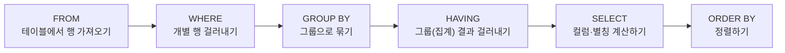

## 그룹 함수란 무엇인가

14편에서 다룬 문자·숫자·날짜 함수는 모두 **행 하나에 값 하나**를 대응시키는 단일행 함수였다. 이번 편에서 다루는 **그룹 함수(group function, 집계 함수(aggregate function)라고도 부른다)** 는 정반대다. 여러 행의 값을 **하나로 요약**해 결과 하나만 낸다.

| 함수 | 뜻 | NULL 처리 |
|---|---|---|
| `COUNT(*)` | 행의 개수 | NULL이 포함된 행도 카운트에 포함 |
| `COUNT(컬럼)` | 그 컬럼 값이 NULL이 아닌 행의 개수 | NULL인 값은 세지 않음 |
| `SUM(컬럼)` | 합계 | NULL은 계산에서 제외(0으로 취급하지 않고 아예 무시) |
| `AVG(컬럼)` | 평균 | NULL인 행은 평균을 구하는 분모(행 수)에서도 제외 |
| `MAX(컬럼)` | 최댓값 | NULL 제외하고 비교 |
| `MIN(컬럼)` | 최솟값 | NULL 제외하고 비교 |

### 작은 예시로 직접 계산해 보기

다음과 같은 `사원` 테이블이 있다고 하자.

| 사원명 | 부서 | 보너스 |
|---|---|---|
| 김민준 | 영업 | 100 |
| 이서연 | 영업 | 200 |
| 박도윤 | 홍보 | NULL |
| 최하은 | 홍보 | 150 |

```sql
SELECT COUNT(*) AS 전체행수,
       COUNT(보너스) AS 보너스있는행수,
       SUM(보너스) AS 보너스합계,
       AVG(보너스) AS 보너스평균
FROM 사원;
```

이 쿼리의 결과는 다음과 같다.

| 전체행수 | 보너스있는행수 | 보너스합계 | 보너스평균 |
|---|---|---|---|
| 4 | 3 | 450 | 150 |

**결과 해석**: `COUNT(*)`는 박도윤의 보너스가 NULL이어도 행 자체는 존재하므로 4를 센다. 반면 `COUNT(보너스)`는 NULL인 박도윤의 행을 세지 않아 3이다.

**자주 틀리는 점**: "테이블에 행이 하나도 없으면 `COUNT(*)`는 몇을 반환하는가"라는 질문에 NULL이라고 답하는 실수가 잦다. 실제로는 행이 0건이어도 `COUNT(*)`는 그룹 자체가 사라지는 것이 아니라 **0이라는 값**을 정상적으로 반환한다(단, GROUP BY 없이 그룹 함수만 쓸 때는 테이블 전체가 하나의 그룹으로 취급되므로, 행이 없어도 "빈 그룹"에 대한 COUNT 결과인 0이 한 행으로 나온다).

## GROUP BY: 값이 같은 행끼리 묶기

`GROUP BY`는 지정한 컬럼(들)의 값이 같은 행들을 하나의 그룹으로 묶는다. 그룹 함수는 이 그룹 하나하나에 대해 별도로 계산된다.

```sql
-- 부서별로 묶어서, 부서마다 보너스 합계를 구한다
SELECT 부서, SUM(보너스) AS 부서별보너스합계
FROM 사원
GROUP BY 부서;
```

| 부서 | 부서별보너스합계 |
|---|---|
| 영업 | 300 |
| 홍보 | 150 |

**GROUP BY가 없을 때**: `GROUP BY` 절 자체가 없어도 SELECT에 그룹 함수가 있으면, 오라클은 **테이블 전체를 하나의 그룹**으로 취급해 계산한다. 앞서 본 `SELECT COUNT(*), SUM(보너스) FROM 사원` 예시가 바로 이 경우다.

## SQL 실행 순서 복습: WHERE와 HAVING이 각각 언제 실행되는가

13편에서 SQL의 논리적 처리 순서를 다뤘다. 이번 편의 핵심 규칙 대부분이 바로 이 순서에서 나오므로 다시 한번 그림으로 짚고 넘어간다.



이 순서에서 알 수 있듯, **WHERE는 그룹이 만들어지기 전에** 실행되고 **HAVING은 그룹이 만들어진 후에** 실행된다. 이 실행 시점의 차이가 두 절의 역할을 완전히 갈라놓는다.

### WHERE vs HAVING 대조표

| 구분 | WHERE | HAVING |
|---|---|---|
| 실행 시점 | GROUP BY보다 먼저 | GROUP BY보다 나중 |
| 거르는 대상 | 개별 행(가공되지 않은 원본 데이터) | 그룹으로 묶인 집계 결과 |
| 집계 함수 사용 | 불가능(오류) | 가능(오히려 이것이 주된 용도) |
| 없는 경우 | 모든 행이 그룹화 대상이 됨 | 모든 그룹이 결과에 포함됨 |
| 조건 예시 | `WHERE 연봉 > 3000` | `HAVING SUM(보너스) > 200` |

### 집계 함수를 WHERE에 쓰면 왜 오류인가

```sql
-- 오류: WHERE 절에서 집계 함수 사용
SELECT 부서, SUM(보너스)
FROM 사원
WHERE SUM(보너스) > 200
GROUP BY 부서;
```

이 문장이 오류인 이유는 실행 순서를 따라가 보면 분명해진다. `SUM(보너스)`라는 값은 **여러 행을 하나로 합쳐야만** 계산할 수 있는데, WHERE가 실행되는 시점은 GROUP BY보다 **먼저**다.

반대로 HAVING은 GROUP BY **다음**에 실행되므로, 그 시점에는 이미 각 그룹의 `SUM(보너스)` 값이 계산되어 있다. 그래서 HAVING은 이 계산된 합계를 조건으로 쓸 수 있다.

```sql
-- 정상: HAVING 절에서 집계 함수로 그룹 결과 필터링
SELECT 부서, SUM(보너스) AS 부서별보너스합계
FROM 사원
GROUP BY 부서
HAVING SUM(보너스) > 200;
```

| 부서 | 부서별보너스합계 |
|---|---|
| 영업 | 300 |

**결과 해석**: 홍보 부서의 합계(150)는 200을 넘지 못해 걸러지고, 영업 부서(300)만 결과에 남는다. 만약 이 조건을 WHERE로 옮겨 개별 행에 걸려고 하면, "보너스 값 자체"가 200 초과인 행(이서연 200은 넘지 못함, 사실상 아무도 해당 없음)을 찾는 것이 되어 부서 합계라는 원래 의도와 전혀 다른 결과가 나온다.

**자주 틀리는 점**: "WHERE와 HAVING 둘 다 조건절인데 왜 구분되어 있는가"에 "문법이 오래됐다", "HAVING이 더 엄격하다" 같은 근거 없는 설명을 정답으로 착각하는 경우가 많다. 정답 근거는 항상 **실행 순서**(WHERE는 그룹화 이전의 개별 행, HAVING은 그룹화 이후의 집계 결과)여야 한다.

### COUNT(*)와 HAVING이 함께 만드는 헷갈리는 결과

```sql
SELECT COUNT(*) FROM DUAL
HAVING COUNT(*) > 4;
```

`DUAL`은 오라클이 기본으로 제공하는, 행이 딱 1개뿐인 특수한 테이블이다. 이 쿼리에서 `GROUP BY`가 없으므로 `DUAL` 테이블 전체(1행)가 하나의 그룹으로 취급되고, `COUNT(*)`는 1이 된다.

**결과 해석**: 이 쿼리의 실행 결과는 "0"이 아니라 **행이 하나도 없는 공집합(No rows selected)** 이다. "COUNT(*)가 조건에 안 맞으니 0을 반환하겠지"라고 생각하기 쉽지만, HAVING은 조건을 만족하지 못한 그룹을 아예 **삭제**하는 것이지, 그 자리에 0이라는 값을 채워 넣는 것이 아니다.

## GROUP BY를 쓸 때 SELECT에 올 수 있는 것

이 규칙은 SQLD에서 가장 자주 출제되는 함정 중 하나다. **GROUP BY를 쓴 SELECT 절에는 다음 두 가지만 올 수 있다.**

1. `GROUP BY`에 나열된 컬럼 (그대로)
2. 그룹 함수(`COUNT`, `SUM`, `AVG`, `MAX`, `MIN` 등)로 감싼 컬럼

```sql
-- 정상: 부서(GROUP BY에 나열됨)와 SUM(그룹 함수)만 SELECT에 사용
SELECT 부서, SUM(보너스)
FROM 사원
GROUP BY 부서;

-- 오류: 사원명은 GROUP BY에 없고 그룹 함수로 감싸지도 않았다
SELECT 부서, 사원명, SUM(보너스)
FROM 사원
GROUP BY 부서;
```

**이 규칙이 존재하는 이유**를 정확히 이해해야 한다. `GROUP BY 부서`로 묶으면 영업 부서에 속한 김민준, 이서연 두 사람의 행이 하나의 그룹(영업)으로 합쳐진다.

같은 원리로, **HAVING 절에도 이 규칙이 그대로 적용**된다. HAVING 조건 역시 그룹 단위로 판정되므로, `GROUP BY`에 나열된 컬럼이나 그룹 함수만 조건에 쓸 수 있다.

**자주 틀리는 점**: `GROUP BY 부서, 직급`처럼 여러 컬럼으로 묶었을 때 SELECT에 `부서`만 쓰고 `직급`은 빠뜨려도 문법 오류는 아니다. 다만 이 경우 같은 부서라도 직급이 다르면 서로 다른 그룹으로 나뉘어 있으므로, 결과 화면에는 같은 부서 이름이 여러 행에 걸쳐 중복 출력될 수 있다는 점에 유의해야 한다.

### 집계 함수가 포함된 뷰(VIEW)도 같은 제약을 받는다

이 규칙은 참고로만 알아두면 좋은 실무 연결점인데, `GROUP BY`와 집계 함수로 정의된 뷰(view, 자주 쓰는 SELECT문에 이름을 붙여 테이블처럼 쓰게 해주는 객체)는 조회(SELECT)는 자유롭게 할 수 있지만 `INSERT`, `UPDATE`, `DELETE` 같은 DML은 원칙적으로 허용되지 않는다(갱신 불가능한 뷰). 그 뷰의 각 행이 실제 원본 테이블의 행 하나와 1대1로 대응하지 않고, 여러 행을 요약한 결과이기 때문에 값을 거꾸로 써넣을 방법이 없기 때문이다.

## SELECT 절 작성 규칙 정리

GROUP BY가 있는 쿼리의 SELECT 절을 작성할 때 스스로 점검할 순서는 다음과 같다.

## 핵심 정리

- 그룹 함수(COUNT·SUM·AVG·MAX·MIN)는 여러 행을 하나의 값으로 요약한다. `COUNT(*)`는 NULL 포함 모든 행을, `COUNT(컬럼)`은 그 컬럼이 NULL이 아닌 행만 센다.
- SUM과 AVG는 NULL을 0으로 바꾸는 것이 아니라 계산 대상에서 완전히 제외한다.
- WHERE는 GROUP BY 이전의 개별 행을, HAVING은 GROUP BY 이후의 그룹(집계) 결과를 거른다. 이 차이는 SQL 실행 순서(FROM→WHERE→GROUP BY→HAVING→SELECT→ORDER BY)에서 나온다.
- 집계 함수를 WHERE에 쓰면 오류다. 그룹이 아직 만들어지지 않은 시점이라 집계값 자체가 존재하지 않기 때문이다.
- HAVING 조건이 거짓이면 그 그룹은 결과에서 제거된다("값 0"이 아니라 "행 없음"이 된다).
- GROUP BY가 있는 SELECT 절에는 GROUP BY에 나열된 컬럼과 그룹 함수로 감싼 표현식만 쓸 수 있다. 그룹으로 묶는 순간 개별 행의 정보는 대표값 없이는 확정할 수 없기 때문이다.

## 마무리 복습

<Quiz
  questionNumber={1}
  question={"사원 테이블에 4행이 있고 그중 보너스 컬럼 값이 NULL인 행이 1개 있을 때, COUNT(*)와 COUNT(보너스)의 결과를 순서대로 나열한 것은?"}
  options={["4, 4","3, 3","4, 3","3, 4"]}
  correctAnswer={3}
  explanation={"COUNT(*)는 NULL 여부와 관계없이 존재하는 행 전체 개수를 세므로 4가 된다. COUNT(컬럼)은 그 컬럼 값이 NULL이 아닌 행만 세므로, 보너스가 NULL인 1행을 제외한 3이 된다."}
/>

<Quiz
  questionNumber={2}
  question={"다음 중 WHERE 절에 집계 함수(SUM, COUNT 등)를 사용할 수 없는 이유로 가장 타당한 것은?"}
  options={["집계 함수는 문법적으로 예약어와 충돌하기 때문이다","WHERE는 GROUP BY보다 먼저 실행되어 그 시점에는 그룹과 집계값이 아직 존재하지 않기 때문이다","WHERE 절은 문자열 조건만 처리할 수 있기 때문이다","집계 함수는 ORDER BY 절에서만 사용하도록 설계되었기 때문이다"]}
  correctAnswer={2}
  explanation={"SQL의 실행 순서상 WHERE는 GROUP BY보다 먼저 처리된다. 집계 함수의 값은 그룹이 형성된 뒤에야 계산할 수 있으므로, 그룹화 이전 단계인 WHERE에서는 그 값 자체가 존재하지 않아 조건으로 쓸 수 없다."}
/>

<Quiz
  questionNumber={3}
  question={"GROUP BY로 묶은 쿼리에서 SELECT 절에 올 수 있는 것으로 옳은 것은?"}
  options={["GROUP BY에 나열된 컬럼과 그룹 함수로 감싼 표현식만","GROUP BY 여부와 관계없이 테이블의 모든 컬럼","WHERE 절에 사용된 컬럼만","ORDER BY에 사용된 컬럼만"]}
  correctAnswer={1}
  explanation={"GROUP BY로 여러 행을 하나의 그룹으로 묶으면 그룹 안 개별 행의 값은 대표할 방법이 없어진다. 따라서 SELECT에는 그룹을 구분하는 기준인 GROUP BY 나열 컬럼과, 그룹 전체를 요약한 그룹 함수 표현식만 쓸 수 있다."}
/>

## 참고 자료

- [Oracle Database SQL Language Reference - Aggregate Functions](https://docs.oracle.com/en/database/oracle/oracle-database/19/sqlrf/Aggregate-Functions.html)
