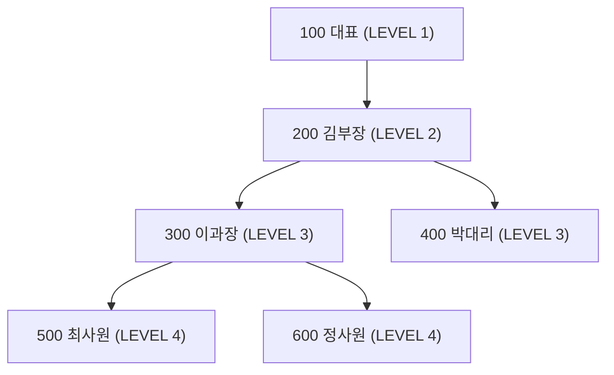

## 왜 필요한가: "상위 5명만 보여줘"라는 아주 흔한 요구

실무에서 가장 자주 나오는 요청 중 하나가 "매출 상위 5개 상품만", "급여 1등부터 3등까지만" 같은 상위 N개(Top N) 추출이다. 15편에서 배운 `ORDER BY`는 전체 결과를 정렬만 할 뿐, "몇 개까지만 보여줄지"는 별도로 지정해야 한다.

## ROWNUM이란 무엇인가

**ROWNUM**은 Oracle이 쿼리 결과의 각 행에 자동으로 부여하는 의사(pseudo) 컬럼이다. ROWNUM은 테이블을 만들 때 지정하는 것이 아니라, `SELECT` 문이 행을 하나씩 뽑아낼 때마다 1, 2, 3, ...

여기서 가장 중요한 사실 하나를 짚어야 한다. **ROWNUM은 결과 집합이 "완성된 뒤"에 매겨지는 번호가 아니라, 행을 하나씩 뽑아 결과에 담는 "그 순간"에 매겨지는 번호**다.

## ROWNUM의 함정: 왜 `WHERE ROWNUM = 2`는 항상 0건인가

여기서부터가 시험 단골 함정이다. 아래 사원 테이블 5행을 예로 들어보자.

| 사원번호 | 이름 | 급여 |
|----------|------|------|
| 101 | 김민준 | 3000 |
| 102 | 이서연 | 5000 |
| 103 | 박도윤 | 4000 |
| 104 | 최지우 | 2000 |
| 105 | 정하늘 | 4500 |

`SELECT * FROM 사원 WHERE ROWNUM = 2;`를 실행하면 어떻게 될까. 언뜻 "두 번째 행이 나오겠지"라고 생각하기 쉽지만, 결과는 **0건**이다. 이 결과를 이해하려면 데이터베이스가 이 쿼리를 처리하는 순서를 단계별로 따라가야 한다.

같은 원리로 `WHERE ROWNUM > 1`도 항상 0건이다. 첫 번째로 검사되는 행은 무조건 ROWNUM 1을 받는데, 조건이 `1 > 1`이라 거짓이 되어 탈락한다.

반대로 `WHERE ROWNUM <= 3`이나 `WHERE ROWNUM < 4`는 정상적으로 동작한다. 첫 행이 `1 <= 3`을 통과하고, 둘째 행이 `2 <= 3`을 통과하는 식으로 조건이 순차적으로 계속 참이 되기 때문에 번호가 끊기지 않고 1, 2, 3까지 순서대로 부여된다.

> **자주 틀리는 점:** "ROWNUM은 각 행이 원래 가지고 있던 순번"이라고 오해하면 이 함정에 빠진다. ROWNUM은 저장된 값이 아니라 조건 검사와 동시에 실시간으로 매겨지는 번호이며, 탈락한 행 다음에는 번호가 다시 1로 리셋된다는 점을 반드시 기억해야 한다.

## Top N을 구하려면 왜 인라인뷰로 감싸야 하는가

이번에는 "급여가 가장 높은 상위 3명"을 뽑는다고 해보자. 직관적으로 이렇게 쓰고 싶어진다.

```sql
SELECT * FROM 사원 WHERE ROWNUM <= 3 ORDER BY 급여 DESC;
```

이 쿼리는 문법적으로는 실행되지만 원하는 결과를 주지 않는다. 13편에서 다뤘듯 `WHERE`는 `ORDER BY`보다 먼저 처리된다.

이 문제를 해결하는 방법이 **인라인뷰**(inline view)다. 정렬을 먼저 끝낸 결과를 인라인뷰로 만들어 놓고, 그 바깥에서 `ROWNUM` 조건을 걸면 순서가 뒤바뀌지 않는다.

```sql
SELECT *
FROM (
  SELECT * FROM 사원 ORDER BY 급여 DESC
)
WHERE ROWNUM <= 3;
```

이 쿼리의 처리 순서는 다음과 같다.

**정렬이 끝난 결과를 인라인뷰로 한 번 감싸고, 그 바깥에서 ROWNUM 조건을 걸어야 한다**는 것이 Top N 쿼리의 핵심 원칙이다. `ORDER BY`와 `ROWNUM`을 같은 레벨의 `SELECT`에 나란히 써서는 안 된다.

### FETCH FIRST: 더 간단하고 안전한 대안

Oracle 12c부터는 표준 SQL의 **행 제한 절**(row limiting clause)인 `FETCH FIRST`를 지원한다.

```sql
SELECT * FROM 사원
ORDER BY 급여 DESC
FETCH FIRST 3 ROWS ONLY;
```

`FETCH FIRST`는 `ORDER BY` 바로 뒤에 붙어서 "정렬이 끝난 다음에 앞에서부터 N개만 가져와라"는 의미가 문장 그대로 지켜지므로, 인라인뷰로 감싸는 번거로움이 없고 ROWNUM의 함정에도 애초에 걸리지 않는다. 예를 들어 `OFFSET 3 ROWS FETCH FIRST 5 ROWS ONLY`는 4등부터 8등까지를 가져온다.

## 계층형 질의: 조직도처럼 자기 자신을 참조하는 데이터

이번에는 전혀 다른 문제를 보자. 사원 테이블에 "이 사원의 상사가 누구인지"를 나타내는 `상사사번` 컬럼이 있다고 하자.

다음과 같은 조직도 데이터를 예로 든다.

| 사번 | 이름 | 상사사번 |
|------|------|----------|
| 100 | 대표 | (NULL) |
| 200 | 김부장 | 100 |
| 300 | 이과장 | 200 |
| 400 | 박대리 | 200 |
| 500 | 최사원 | 300 |
| 600 | 정사원 | 300 |

대표(100번) 아래에 김부장(200번)이 있고, 김부장 아래에 이과장(300번)과 박대리(400번)가 있으며, 이과장 아래에 최사원(500번)과 정사원(600번)이 있는 3단계 조직도다.

### CONNECT BY와 START WITH

Oracle은 이런 구조를 `START WITH`와 `CONNECT BY PRIOR` 절로 조회한다.

```sql
SELECT LEVEL, 사번, 이름, 상사사번
FROM 사원
START WITH 상사사번 IS NULL
CONNECT BY PRIOR 사번 = 상사사번
ORDER BY LEVEL, 사번;
```

각 절의 역할을 하나씩 뜯어보자.

- **START WITH 상사사번 IS NULL**: 계층의 출발점(루트, root)을 정하는 조건이다. 상사가 없는 사람, 즉 최상위인 대표(100번)에서 시작하라는 뜻이다.
- **CONNECT BY PRIOR 사번 = 상사사번**: 부모 행과 자식 행을 어떻게 연결할지 정의한다. `PRIOR`가 붙은 쪽이 "이전 단계(부모)의 값"을 가리킨다.
- **LEVEL**: 역시 의사 컬럼으로, 루트를 1로 시작해 한 단계 내려갈 때마다 1씩 증가하는 계층 깊이를 나타낸다.

이 쿼리를 실행하면 다음과 같은 결과가 나온다.

| LEVEL | 사번 | 이름 | 상사사번 |
|-------|------|------|----------|
| 1 | 100 | 대표 | (NULL) |
| 2 | 200 | 김부장 | 100 |
| 3 | 300 | 이과장 | 200 |
| 3 | 400 | 박대리 | 200 |
| 4 | 500 | 최사원 | 300 |
| 4 | 600 | 정사원 | 300 |

LEVEL 값을 이용해 들여쓰기를 표현하면 조직도 모양이 그대로 눈에 보인다. `LPAD(' ', (LEVEL-1)*2) || 이름`처럼 LEVEL에 비례해 공백을 채워 넣는 방식이 시험에도 자주 나오는 응용이다.


```mermaid
graph TD
    A["100 대표 (LEVEL 1)"] --> B["200 김부장 (LEVEL 2)"]
    B --> C["300 이과장 (LEVEL 3)"]
    B --> D["400 박대리 (LEVEL 3)"]
    C --> E["500 최사원 (LEVEL 4)"]
    C --> F["600 정사원 (LEVEL 4)"]
```

### PRIOR의 위치가 방향을 결정한다

`CONNECT BY PRIOR 사번 = 상사사번`처럼 `PRIOR`가 **왼쪽**(사번)에 붙으면, "이전 단계 행의 사번이 = 현재 행의 상사사번"이라는 뜻이 된다. 즉 부모의 사번을 자식의 상사사번과 맞추는 것이므로 상위에서 하위로 내려가는 **순방향**(정방향, top-down) 조회가 된다.

반대로 `PRIOR`를 **오른쪽**(상사사번)에 붙여 `CONNECT BY 사번 = PRIOR 상사사번`이라고 쓰면, "현재 행의 사번이 = 이전 단계 행의 상사사번"이라는 뜻이 되어 방향이 뒤집힌다. 예를 들어 최사원(500번)에서 시작하면 이과장(300) → 김부장(200) → 대표(100) 순으로 조상을 타고 올라가는 결과가 나온다.

> **자주 틀리는 점:** "PRIOR는 무조건 순방향을 의미한다"고 외우면 틀린다. PRIOR는 방향을 정하는 게 아니라 **어느 쪽이 "이전 단계 값"인지**를 지정할 뿐이며, 등호의 좌우 어느 쪽에 붙느냐에 따라 순방향도 역방향도 될 수 있다. 기출에서는 `CONNECT BY PRIOR 자식컬럼 = 부모컬럼` 형태와 `CONNECT BY 자식컬럼 = PRIOR 부모컬럼` 형태를 뒤섞어 제시하고 방향을 맞히게 하는 문제가 반복적으로 나온다.

또한 `WHERE` 절을 계층형 질의에 함께 쓰면, `WHERE` 조건은 계층이 전개된 **이후**에 결과 행을 걸러낼 뿐, 계층을 전개하는 범위 자체를 제한하지 않는다는 점도 주의해야 한다. 특정 하위 트리(subtree)를 통째로 잘라내려면 `WHERE`가 아니라 `CONNECT BY` 절 안에 조건을 추가해야 한다.

## 핵심 정리

- ROWNUM은 행이 결과 집합에 포함되기로 확정되는 순간 1부터 순차 부여되는 의사 컬럼이며, 조건을 통과하지 못한 행 다음에는 번호가 다시 1로 리셋된다.
- 이 때문에 `WHERE ROWNUM = 2`, `WHERE ROWNUM > 1`처럼 시작값 1을 건너뛰는 조건은 항상 0건이 되고, `WHERE ROWNUM <= n`처럼 1부터 이어지는 상한 조건만 정상 동작한다.
- Top N을 정확히 구하려면 정렬을 먼저 끝낸 결과를 인라인뷰로 감싼 뒤, 바깥 쿼리에서 ROWNUM 조건을 걸어야 한다. `ORDER BY`와 ROWNUM 조건을 같은 SELECT에 나란히 쓰면 정렬 전 순서에서 잘려나간다.
- `FETCH FIRST n ROWS ONLY`는 인라인뷰 없이 정렬 직후 상위 n개를 안전하게 가져오는 표준 SQL 행 제한 절이다.
- 계층형 질의는 `START WITH`로 루트를 지정하고 `CONNECT BY PRIOR`로 부모-자식 연결 조건을 정의하며, `LEVEL`로 계층 깊이를 확인한다.
- PRIOR가 등호의 어느 쪽에 붙느냐에 따라 순방향(상위→하위) 조회와 역방향(하위→상위) 조회가 갈린다.

## 마무리 복습

<Quiz
  questionNumber={1}
  question={"사원 테이블에 10건의 데이터가 있을 때, SELECT * FROM 사원 WHERE ROWNUM = 3의 실행 결과로 옳은 것은?"}
  options={["3번째로 조회된 행 1건이 반환된다","0건이 반환된다","1번째부터 3번째까지 3건이 반환된다","오류가 발생한다"]}
  correctAnswer={2}
  explanation={"ROWNUM은 조건을 통과해 결과에 포함되는 순간 1부터 순차 부여되며, 통과하지 못한 행 다음에는 번호가 리셋되어 다시 1이 된다. 첫 행이 검사되는 순간 ROWNUM은 반드시 1이므로 3 = 3 비교는 항상 참이 될 기회가 없어 어떤 행도 3을 받지 못하고 결과는 0건이다."}
/>

<Quiz
  questionNumber={2}
  question={"급여 상위 2명을 정확히 조회하려는 의도로 작성한 다음 SQL 중, 실제로 항상 급여 1·2위를 반환하는 것은? A: SELECT * FROM 사원 WHERE ROWNUM 이하 2 ORDER BY 급여 DESC / B: SELECT * FROM (SELECT * FROM 사원 ORDER BY 급여 DESC) WHERE ROWNUM 이하 2"}
  options={["A만 항상 올바른 상위 2명을 반환한다","B만 항상 올바른 상위 2명을 반환한다","A와 B 모두 항상 올바른 상위 2명을 반환한다","A와 B 모두 문법 오류로 실행되지 않는다"]}
  correctAnswer={2}
  explanation={"SQL의 논리적 실행 순서상 WHERE는 ORDER BY보다 먼저 처리된다."}
/>

<Quiz
  questionNumber={3}
  question={"다음 조직도(대표 100 상사없음, 김부장 200 상사 100, 이과장 300 상사 200)에서 CONNECT BY PRIOR 사번 = 상사사번, START WITH 상사사번 IS NULL로 조회할 때 이과장(300) 행의 LEVEL 값은?"}
  options={["1","2","3","LEVEL은 계산되지 않는다"]}
  correctAnswer={3}
  explanation={"LEVEL은 START WITH로 지정한 루트 행을 1로 시작해 한 단계 내려갈 때마다 1씩 증가하는 의사 컬럼이다. 대표(100)가 LEVEL 1, 그 아래 김부장(200)이 LEVEL 2, 다시 그 아래 이과장(300)이 LEVEL 3이 된다."}
/>

## 참고 자료

- [Oracle Database SQL Language Reference - Hierarchical Queries](https://docs.oracle.com/en/database/oracle/oracle-database/19/sqlrf/Hierarchical-Queries.html)
- [Oracle Database SQL Language Reference - Pseudocolumns (ROWNUM)](https://docs.oracle.com/en/database/oracle/oracle-database/19/sqlrf/Pseudocolumns.html)
