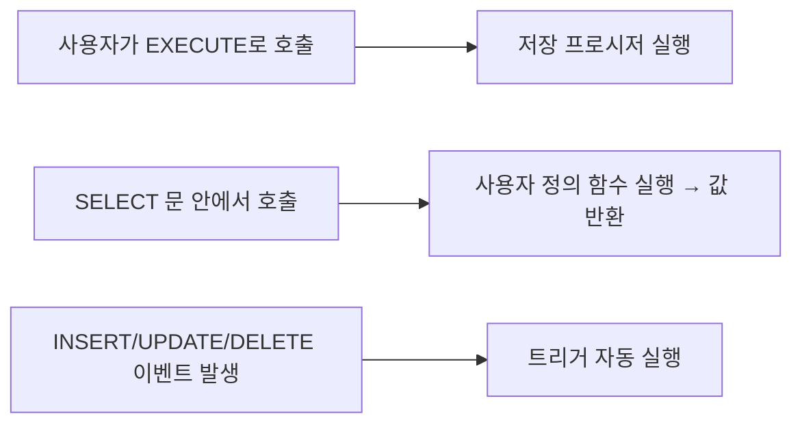

<Callout type="info">
  **이번 문서의 목표:** 이 파일을 다 읽으면 GRANT와 REVOKE로 사용자 권한을 부여·회수하는 원리를 설명하고, 저장 프로시저·함수·트리거가 어떤 상황에서 각각 쓰이는지 구분할 수 있다.
</Callout>

## 왜 필요한가: 아무나 아무 테이블이나 만지면 안 된다

지금까지 배운 DDL(10편), DML(11편), TCL(12편)은 모두 "데이터를 어떻게 정의하고 조작할 것인가"에 관한 것이었다. 그런데 실무 데이터베이스는 여러 사람이 함께 접속한다. 인사팀 직원이 회계 테이블을 마음대로 조회하거나, 신입 개발자가 실수로 운영 테이블을 삭제할 수 있다면 큰 사고로 이어진다. 이런 문제를 막기 위해 "누가 무엇을 할 수 있는지"를 통제하는 언어가 필요한데, 이를 **DCL**(Data Control Language, 데이터 제어어)이라 한다. DCL은 01편에서 SQL의 네 갈래(DDL·DML·DCL·TCL)를 소개할 때 이미 이름만 언급했던 마지막 조각이다.

> **쉽게 말하면:** DCL은 "이 사람은 이 테이블에서 무엇을 할 수 있다"는 출입증을 발급하고 회수하는 명령어다.

## GRANT: 권한을 부여한다

**GRANT**는 특정 사용자나 역할(ROLE)에게 특정 객체(테이블, 뷰 등)에 대한 권한을 부여하는 명령어다.

```sql
GRANT SELECT, INSERT ON 사원 TO 김대리;
```

이 문장은 "김대리라는 사용자에게 사원 테이블에 대한 조회(SELECT)와 삽입(INSERT) 권한을 준다"는 뜻이다. 권한을 부여할 때 `WITH GRANT OPTION`을 함께 쓰면, 권한을 받은 사람이 그 권한을 다시 제3자에게 넘겨줄 수 있게 된다.

```sql
GRANT SELECT ON 사원 TO 김대리 WITH GRANT OPTION;
```

이제 김대리는 사원 테이블을 조회할 수 있을 뿐 아니라, `GRANT SELECT ON 사원 TO 이과장;`처럼 그 SELECT 권한을 이과장에게도 넘겨줄 수 있다. `WITH GRANT OPTION` 없이 권한을 받은 사람은 그 권한을 다른 사람에게 넘겨줄 수 없다는 점이 핵심이다.

## REVOKE: 권한을 회수한다

**REVOKE**는 GRANT로 부여한 권한을 거두어들이는 명령어다.

```sql
REVOKE INSERT ON 사원 FROM 김대리;
```

여기서 시험에 자주 나오는 함정이 있다. REVOKE는 **명시한 권한만** 정확히 회수하며, 그 사용자가 가진 다른 권한에는 영향을 주지 않는다. 위 예시에서 김대리의 INSERT 권한만 사라지고, 이미 가지고 있던 SELECT 권한은 그대로 남는다.

더 복잡한 상황을 단계별로 따라가 보자. 다음과 같은 권한 부여 이력이 있다고 하자.

<Steps>

### 1단계: DBA가 U1에게 권한을 준다

`GRANT SELECT, INSERT, DELETE ON R TO U1;` — U1은 R 테이블에 대해 SELECT, INSERT, DELETE 세 가지 권한을 가진다.

### 2단계: DBA가 U2에게 재부여 가능한 권한을 준다

`GRANT SELECT ON R TO U2 WITH GRANT OPTION;` — U2는 SELECT 권한을 가지며, `WITH GRANT OPTION` 덕분에 이 권한을 제3자에게 다시 부여할 수 있다.

### 3단계: U2가 U3에게 권한을 넘긴다

`GRANT SELECT ON R TO U3;` — U2가 자신이 받은 SELECT 권한을 U3에게 재부여한다. 이제 U1, U2, U3 모두 SELECT 권한을 가진 상태다.

### 4단계: DBA가 U1의 DELETE 권한만 회수한다

`REVOKE DELETE ON R FROM U1;` — 이 REVOKE는 U1의 DELETE 권한만 정확히 대상으로 한다. U1의 SELECT·INSERT 권한, U2와 U3의 SELECT 권한에는 아무 영향을 주지 않는다.

</Steps>

최종적으로 R 테이블에 대해 SELECT 권한을 가진 사용자는 U1(1단계에서 받음), U2(2단계에서 받음), U3(3단계에서 U2로부터 받음) 세 명 모두다. DELETE 권한을 가진 사용자는 아무도 없다(U1의 DELETE만 회수됐고, 애초에 DELETE를 받은 사람은 U1뿐이었다). INSERT 권한은 U1만 여전히 가지고 있다.

> **자주 틀리는 점:** "REVOKE 한 번이면 그 사용자와 관련된 모든 권한 흐름이 정리된다"고 오해하기 쉽다. 하지만 REVOKE는 문장에 **명시한 권한만** 정확히 회수한다. 특히 `WITH GRANT OPTION`으로 파생된 권한(U2 → U3)은 U1에 대한 REVOKE와는 완전히 별개로 남아 있다는 점을 놓치면 오답을 고르게 된다.

## ROLE: 권한을 묶어서 관리한다

사용자가 수십, 수백 명이 되면 사용자 한 명 한 명에게 GRANT를 일일이 실행하는 일은 비효율적이다. 이때 쓰는 것이 **ROLE**(역할)이다. ROLE은 여러 권한을 하나의 이름으로 묶어 놓은 꾸러미다.

```sql
CREATE ROLE 인사팀롤;
GRANT SELECT, INSERT, UPDATE ON 사원 TO 인사팀롤;
GRANT 인사팀롤 TO 김대리, 이과장, 박부장;
```

이렇게 하면 인사팀에 새 직원이 들어올 때마다 SELECT, INSERT, UPDATE 권한을 하나씩 부여할 필요 없이 `GRANT 인사팀롤 TO 신입사원;` 한 줄이면 끝난다. 권한 내용을 바꿔야 할 때도 ROLE 하나만 수정하면 그 ROLE을 부여받은 모든 사용자에게 일괄 반영된다. ROLE은 "권한 관리의 그룹화"라는 관점에서, 여러 사용자에게 흩어져 있던 개별 GRANT 문을 하나의 관리 단위로 압축해주는 역할을 한다.

## 절차형 SQL 개요: 프로시저, 함수, 트리거

지금까지 다룬 SQL은 대부분 **선언형**(declarative), 즉 "무엇을 원하는가"만 기술하면 데이터베이스가 알아서 실행 방법을 찾아주는 방식이었다. 하지만 조건 분기(IF), 반복(LOOP), 변수 선언처럼 일반 프로그래밍 언어와 비슷한 절차적 로직이 필요할 때가 있다. 이런 로직을 데이터베이스 안에 저장해 두고 실행하는 것을 **절차형 SQL**(procedural SQL)이라 하며, Oracle에서는 PL/SQL(Procedural Language extension to SQL)이라는 확장 언어로 구현한다. SQLD 시험은 PL/SQL 문법 자체를 깊이 묻기보다, 프로시저·함수·트리거라는 세 가지 절차형 객체의 **개념적 차이**를 정확히 구분하는지를 주로 묻는다.

### 저장 프로시저

**저장 프로시저**(stored procedure)는 여러 SQL문과 절차적 로직을 하나의 이름으로 묶어 데이터베이스에 저장해 둔 것이다. 필요할 때 `EXECUTE 프로시저이름(인자)`처럼 명시적으로 호출해서 실행한다. 프로시저는 "이 작업을 수행하라"는 지시에 가까우며, 그 자체로 값을 돌려주는 것이 목적이 아니다(다만 OUT 매개변수를 통해 결과값을 밖으로 전달할 수는 있다). 또한 프로시저 내부에서 `COMMIT`이나 `ROLLBACK` 같은 트랜잭션 제어 명령을 직접 실행할 수 있다.

### 사용자 정의 함수

**사용자 정의 함수**(user-defined function)는 프로시저와 비슷하게 로직을 저장해 두지만, 결정적인 차이는 **반드시 하나의 값을 반환해야 한다**는 점이다. 그래서 `SELECT 함수이름(컬럼) FROM 테이블`처럼 `SELECT` 문 안에서 마치 내장 함수(`SUBSTR`, `SUM` 같은)처럼 사용할 수 있다. 함수는 값을 계산해서 돌려주는 것이 본질적인 목적이므로, 원칙적으로 함수 내부에서 `COMMIT`이나 `ROLLBACK` 같은 트랜잭션 제어를 수행하지 않는다(SELECT 문에 끼워 쓸 수 있어야 하므로 부작용을 최소화해야 한다는 설계 원칙 때문이다).

### 트리거

**트리거**(trigger)는 프로시저·함수와 근본적으로 다른 특징을 가진다. 앞의 둘은 사용자가 명시적으로 호출해야 실행되지만, 트리거는 **특정 이벤트가 발생하면 자동으로 실행**된다. 여기서 이벤트란 특정 테이블에 대한 `INSERT`, `UPDATE`, `DELETE` 같은 DML 작업을 뜻한다. 예를 들어 "사원 테이블에 새 행이 추가될 때마다 변경이력 테이블에 자동으로 기록을 남긴다"는 로직은 트리거로 구현한다. 트리거는 누가 호출하는 것이 아니라 이벤트에 반응해 스스로 작동하므로, 로그 기록이나 데이터 정합성 자동 검증처럼 "사람이 매번 신경 쓰지 않아도 항상 지켜져야 하는 규칙"을 구현하는 데 적합하다.



### 세 객체의 차이 한눈에 보기

| 구분 | 저장 프로시저 | 사용자 정의 함수 | 트리거 |
|------|---------------|------------------|--------|
| 호출 방식 | EXECUTE 등으로 명시적 호출 | SELECT 문 등 표현식 안에서 호출 | 이벤트(INSERT·UPDATE·DELETE) 발생 시 자동 실행 |
| 반환값 유무 | 필수 아님(OUT 매개변수로 전달 가능) | 반드시 하나의 값을 반환해야 함 | 반환값 없음(자동 실행되는 로직일 뿐) |
| 트랜잭션 제어 가능 여부 | 가능(COMMIT·ROLLBACK 직접 수행 가능) | 원칙적으로 지양(SELECT에 끼워 쓰이므로 부작용 최소화) | 대상 DML과 같은 트랜잭션 내에서 함께 처리됨(독립적인 COMMIT 지양) |

> **자주 틀리는 점:** "함수도 프로시저처럼 자유롭게 트랜잭션을 제어할 수 있다"거나 "트리거도 사용자가 원할 때 직접 호출해서 쓸 수 있다"고 착각하는 경우가 많다. 함수는 반환값이 필수라는 제약과 트랜잭션 제어 지양이라는 설계 원칙이, 트리거는 이벤트 기반 자동 실행이라는 근본적으로 다른 실행 방식이 각각의 정체성이라는 점을 구분해야 한다.

## 직접 해보기 1: GRANT로 열어 준 것만 열린다

<Callout type="info">
  00편에서 만든 컨테이너에서 진행합니다. 아직 안 만들었다면 00편을 먼저 보세요. 이번 실습은 계정을 새로 만들어야 하므로, DBeaver 접속 정보의 Username을 관리자 계정인 `system`으로 두고 진행합니다.
</Callout>

먼저 `system` 접속에서 실습용 계정을 만들고, `사원` 테이블에 조회 권한만 준다.

```sql
CREATE USER 실습생 IDENTIFIED BY zeno1234;
GRANT CREATE SESSION TO 실습생; -- 이 권한이 없으면 계정은 있어도 접속 자체가 안 된다
GRANT SELECT ON 사원 TO 실습생;
```

> Oracle 23ai는 버전·설정에 따라 일반 사용자 이름에 `C##` 접두어를 요구하기도 한다. `ORA-65096` 같은 오류가 나면 `CREATE USER C##실습생 IDENTIFIED BY zeno1234;`처럼 이름 앞에 `C##`을 붙여 다시 시도해 본다(정확한 조건은 설치 환경마다 다를 수 있으니 오류 메시지를 보고 판단한다).

이제 `system` 접속은 그대로 두고, DBeaver에 새 연결을 하나 더 만들어 Username을 `실습생`(접두어를 붙였다면 그 이름), Password를 `zeno1234`로 접속한다. 그 연결에서 아래를 실행한다.

```sql
SELECT * FROM SYSTEM.사원; -- 내 소유가 아닌 테이블이라 소유자(SYSTEM)를 앞에 붙여야 한다
INSERT INTO SYSTEM.사원 VALUES (999, '테스트', '영업', 10, '사원', 3000, 3000, 0, 0, 30);
```

**무엇을 보아야 하나**: `SELECT`는 사원 목록이 그대로 나오지만, `INSERT`는 `ORA-01031: insufficient privileges`로 막히는지 확인한다.

> **왜 이걸 해보나:** GRANT는 문장에 적은 권한만 정확히 여는 것이지 "그 테이블 전체에 대한 접근"을 여는 것이 아니다. SELECT만 준 상태에서 INSERT가 실제로 막히는 것을 직접 봐야 이 원칙이 몸에 남는다.

## 직접 해보기 2: REVOKE로 다시 잠그고 정리하기

`system` 접속으로 돌아가 방금 준 SELECT 권한을 회수한다.

```sql
REVOKE SELECT ON 사원 FROM 실습생;
```

다시 `실습생` 접속으로 가서 조금 전과 같은 조회를 실행해 본다.

```sql
SELECT * FROM SYSTEM.사원;
```

**무엇을 보아야 하나**: 같은 문장인데도 이번에는 `ORA-00942: table or view does not exist`가 나온다. 권한이 없으면 Oracle은 "권한이 없다"고 알려주는 대신 마치 테이블이 존재하지 않는 것처럼 보이는 오류를 낸다.

실습이 끝나면 `system` 접속으로 돌아와 실습용 계정을 정리한다.

```sql
DROP USER 실습생 CASCADE;
```

> **왜 이걸 해보나:** REVOKE 이후 조회가 막힐 때 뜨는 오류가 "권한 없음"이 아니라 "존재하지 않음"처럼 보인다는 것 자체가 시험에서 헷갈리기 쉬운 지점이다. 실제 화면으로 한 번 보면 그 오류를 만났을 때 당황하지 않는다.

## 핵심 정리

- DCL은 GRANT(권한 부여)와 REVOKE(권한 회수)로 사용자별 데이터 접근 권한을 통제하는 언어다.
- `WITH GRANT OPTION`으로 부여받은 권한은 제3자에게 재부여할 수 있으며, 이렇게 파생된 권한은 원래 부여자에 대한 REVOKE와 별개로 남는다. REVOKE는 명시한 권한만 정확히 회수한다.
- ROLE은 여러 권한을 하나의 이름으로 묶어 다수의 사용자에게 일괄 부여·관리할 수 있게 한다.
- 저장 프로시저는 명시적으로 호출해 실행하며 트랜잭션 제어가 가능하고, 사용자 정의 함수는 SELECT 문 안에서 호출되며 반드시 값을 반환해야 하고, 트리거는 DML 이벤트에 반응해 자동으로 실행된다.

## 마무리 복습

<Quiz
  questionNumber={1}
  question="DBA가 U1에게 SELECT, INSERT, DELETE 권한을 주고, U2에게 SELECT를 WITH GRANT OPTION으로 준 뒤 U2가 이 SELECT를 U3에게 재부여했다. 이후 DBA가 U1의 DELETE 권한만 회수했을 때, R 테이블에 대해 SELECT 권한을 가진 사용자를 모두 고르면?"
  options={['U1만 해당한다', 'U1과 U2만 해당한다', 'U1, U2, U3 모두 해당한다', '아무도 해당하지 않는다']}
  correctAnswer={3}
  explanation="REVOKE는 DELETE 권한만 명시적으로 대상으로 삼았으므로 U1의 SELECT, INSERT 권한과 U2의 SELECT 권한, 그리고 U2로부터 파생된 U3의 SELECT 권한 모두 영향을 받지 않고 그대로 유지된다."
  optionExplanations={['U2와 U3도 여전히 SELECT 권한을 가지고 있으므로 U1만이라는 설명은 불완전하다', 'U3도 U2로부터 SELECT 권한을 재부여받아 여전히 가지고 있으므로 U2까지만이라는 설명은 불완전하다', '정답. REVOKE는 DELETE만 대상으로 했으므로 U1, U2, U3 모두 SELECT 권한을 그대로 유지한다', 'REVOKE가 DELETE 권한만 회수했을 뿐 SELECT 권한에는 영향을 주지 않았으므로 이 설명은 틀렸다']}
/>

<Quiz
  questionNumber={2}
  question={"다음처럼 GRANT SELECT ON 사원 TO 김대리;를 WITH GRANT OPTION 없이 실행한 이후, 김대리가 이과장에게 권한을 재부여하려 하면 어떻게 되는가?\n\n```sql\nGRANT SELECT ON 사원 TO 김대리;\n\n-- 이후 김대리가 실행\nGRANT SELECT ON 사원 TO 이과장;\n```"}
  options={['정상적으로 이과장에게 SELECT 권한이 부여된다', 'WITH GRANT OPTION 없이 권한을 받았으므로 김대리는 이 권한을 재부여할 수 없어 오류가 발생한다', 'REVOKE 없이는 GRANT를 두 번 실행할 수 없다는 오류가 발생한다', '김대리 본인의 SELECT 권한이 자동으로 취소된다']}
  correctAnswer={2}
  explanation="WITH GRANT OPTION 없이 권한을 부여받은 사용자는 그 권한을 다른 사용자에게 재부여할 권한 자체가 없다. 따라서 김대리가 이과장에게 SELECT를 재부여하려는 시도는 권한 부족으로 실패한다."
  optionExplanations={['WITH GRANT OPTION이 없으므로 재부여 권한 자체가 없어 정상 처리되지 않는다', '정답. WITH GRANT OPTION 없이 받은 권한은 제3자에게 넘겨줄 수 없다', 'GRANT를 여러 번 실행하는 것 자체는 문제가 아니며, 문제는 재부여 권한의 유무다', '권한을 재부여하려는 시도가 실패한다고 해서 본인이 가진 권한이 취소되지는 않는다']}
/>

<Quiz
  questionNumber={3}
  question="ROLE을 사용하는 목적으로 가장 적절한 것은?"
  options={['개별 사용자마다 서로 다른 테이블 구조를 정의하기 위해', '여러 권한을 하나의 이름으로 묶어 다수의 사용자에게 일괄로 부여·관리하기 위해', '트랜잭션의 커밋 시점을 자동으로 결정하기 위해', 'SELECT 문의 실행 속도를 높이기 위해']}
  correctAnswer={2}
  explanation="ROLE은 SELECT, INSERT, UPDATE 같은 여러 권한을 하나의 이름으로 묶어두고, 이 ROLE을 여러 사용자에게 한꺼번에 부여하거나 회수할 수 있게 해 권한 관리를 단순화하는 목적으로 쓰인다."
  optionExplanations={['ROLE은 권한 관리 도구이며 테이블 구조 정의는 DDL(CREATE TABLE)의 역할이다', '정답. ROLE은 권한을 묶어서 여러 사용자에게 일괄 관리하기 위한 것이다', 'ROLE은 TCL의 커밋 시점과는 무관한 DCL 개념이다', 'ROLE은 권한 관리 편의를 위한 것이며 쿼리 성능과는 직접적인 관련이 없다']}
/>

<Quiz
  questionNumber={4}
  question="저장 프로시저와 사용자 정의 함수의 가장 근본적인 차이는?"
  options={['프로시저는 SELECT 문 안에서 호출할 수 있지만 함수는 EXECUTE로만 호출한다', '함수는 반드시 하나의 값을 반환해야 하며 이 때문에 SELECT 문 안에서 표현식처럼 쓸 수 있지만, 프로시저는 반환값이 필수가 아니다', '프로시저는 매개변수를 받을 수 없지만 함수는 매개변수를 받을 수 있다', '함수는 여러 SQL문을 포함할 수 없고 단일 SELECT문만 포함할 수 있다']}
  correctAnswer={2}
  explanation="사용자 정의 함수는 정의상 반드시 하나의 값을 반환해야 하며, 이 특성 덕분에 SELECT 문 안에서 내장 함수처럼 사용할 수 있다. 저장 프로시저는 반환값이 필수가 아니며 EXECUTE 등으로 명시적으로 호출해 실행하는 것이 기본 사용 방식이다."
  optionExplanations={['호출 방식이 반대로 서술되어 있다. SELECT 안에서 쓸 수 있는 쪽은 함수다', '정답. 반환값의 필수 여부가 두 객체의 호출 방식과 용도를 가르는 근본적인 차이다', '프로시저와 함수 모두 매개변수를 받을 수 있으므로 이 설명은 차이점이 아니다', '함수도 여러 절차적 로직과 SQL문을 포함할 수 있으며 단일 SELECT문으로 제한되지 않는다']}
/>

<Quiz
  questionNumber={5}
  question="트리거(trigger)의 실행 방식에 대한 설명으로 가장 적절한 것은?"
  options={['사용자가 EXECUTE 명령으로 명시적으로 호출해야 실행된다', 'SELECT 문 안에 포함시켜야만 실행된다', '특정 테이블에 대한 INSERT, UPDATE, DELETE 같은 이벤트가 발생하면 자동으로 실행된다', '데이터베이스 서버가 시작될 때 한 번만 실행된다']}
  correctAnswer={3}
  explanation="트리거는 프로시저·함수와 달리 사용자가 직접 호출하는 대상이 아니라, 지정된 테이블에 특정 DML 이벤트(INSERT·UPDATE·DELETE)가 발생할 때 데이터베이스가 자동으로 실행하는 절차형 객체다."
  optionExplanations={['EXECUTE로 명시적 호출을 하는 것은 저장 프로시저의 방식이며 트리거는 그렇게 호출되지 않는다', 'SELECT 문 안에서 호출되는 것은 사용자 정의 함수의 방식이다', '정답. 트리거는 DML 이벤트에 반응해 자동으로 실행되는 것이 핵심 특징이다', '트리거는 서버 시작 시점이 아니라 지정된 이벤트가 발생할 때마다 반복적으로 실행된다']}
/>

<Quiz
  questionNumber={6}
  question="저장 프로시저, 사용자 정의 함수, 트리거 중 트랜잭션 제어 명령(COMMIT, ROLLBACK)을 자유롭게 직접 수행하기 가장 적합한 것은?"
  options={['사용자 정의 함수', '저장 프로시저', '트리거만 가능하다', '셋 다 트랜잭션 제어가 불가능하다']}
  correctAnswer={2}
  explanation="저장 프로시저는 독립적으로 실행되는 작업 단위이므로 내부에서 COMMIT이나 ROLLBACK을 직접 수행할 수 있다. 반면 함수는 SELECT 문 안에 끼워 쓰이는 특성상 부작용을 최소화해야 해 트랜잭션 제어를 지양하고, 트리거는 자신을 유발한 DML과 같은 트랜잭션 안에서 함께 처리되는 것이 일반적이다."
  optionExplanations={['함수는 SELECT 문 안에서 값처럼 취급되므로 트랜잭션 제어 같은 부작용을 지양하는 것이 원칙이다', '정답. 프로시저는 독립적인 실행 단위로 호출되므로 트랜잭션 제어 명령을 직접 수행할 수 있다', '트리거는 오히려 자신을 유발한 DML과 트랜잭션을 공유하는 편이 일반적이라 독립적인 트랜잭션 제어에는 적합하지 않다', '프로시저는 트랜잭션 제어가 가능한 대표적인 절차형 객체이므로 이 설명은 틀렸다']}
/>

## 참고 자료

- [Oracle Database SQL Language Reference - GRANT](https://docs.oracle.com/en/database/oracle/oracle-database/19/sqlrf/GRANT.html)
- [Oracle Database PL/SQL Language Reference - Overview](https://docs.oracle.com/en/database/oracle/oracle-database/19/lnpls/overview.html)
