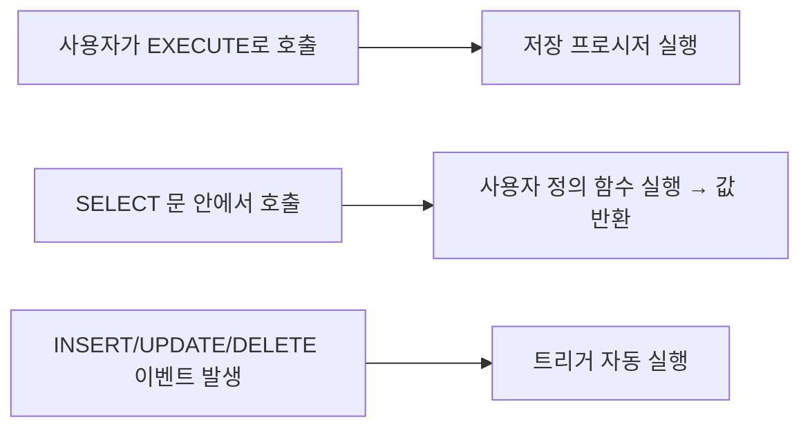

## 왜 필요한가: 아무나 아무 테이블이나 만지면 안 된다

지금까지 배운 DDL(10편), DML(11편), TCL(12편)은 모두 "데이터를 어떻게 정의하고 조작할 것인가"에 관한 것이었다. 이런 문제를 막기 위해 "누가 무엇을 할 수 있는지"를 통제하는 언어가 필요한데, 이를 **DCL**(Data Control Language, 데이터 제어어)이라 한다.

## GRANT: 권한을 부여한다

**GRANT**는 특정 사용자나 역할(ROLE)에게 특정 객체(테이블, 뷰 등)에 대한 권한을 부여하는 명령어다.

```sql
GRANT SELECT, INSERT ON 사원 TO 김대리;
```

이 문장은 "김대리라는 사용자에게 사원 테이블에 대한 조회(SELECT)와 삽입(INSERT) 권한을 준다"는 뜻이다. 권한을 부여할 때 `WITH GRANT OPTION`을 함께 쓰면, 권한을 받은 사람이 그 권한을 다시 제3자에게 넘겨줄 수 있게 된다.

```sql
GRANT SELECT ON 사원 TO 김대리 WITH GRANT OPTION;
```

이제 김대리는 사원 테이블을 조회할 수 있을 뿐 아니라, `GRANT SELECT ON 사원 TO 이과장;`처럼 그 SELECT 권한을 이과장에게도 넘겨줄 수 있다. `WITH GRANT OPTION` 없이 권한을 받은 사람은 그 권한을 다른 사람에게 넘겨줄 수 없다는 점이 핵심이다.

## REVOKE: 권한을 회수한다

**REVOKE**는 GRANT로 부여한 권한을 거두어들이는 명령어다.

```sql
REVOKE INSERT ON 사원 FROM 김대리;
```

여기서 시험에 자주 나오는 함정이 있다. REVOKE는 **명시한 권한만** 정확히 회수하며, 그 사용자가 가진 다른 권한에는 영향을 주지 않는다. 위 예시에서 김대리의 INSERT 권한만 사라지고, 이미 가지고 있던 SELECT 권한은 그대로 남는다.

더 복잡한 상황을 단계별로 따라가 보자. 다음과 같은 권한 부여 이력이 있다고 하자.

최종적으로 R 테이블에 대해 SELECT 권한을 가진 사용자는 U1(1단계에서 받음), U2(2단계에서 받음), U3(3단계에서 U2로부터 받음) 세 명 모두다. DELETE 권한을 가진 사용자는 아무도 없다(U1의 DELETE만 회수됐고, 애초에 DELETE를 받은 사람은 U1뿐이었다).

> **자주 틀리는 점:** "REVOKE 한 번이면 그 사용자와 관련된 모든 권한 흐름이 정리된다"고 오해하기 쉽다. 하지만 REVOKE는 문장에 **명시한 권한만** 정확히 회수한다. 특히 `WITH GRANT OPTION`으로 파생된 권한(U2 → U3)은 U1에 대한 REVOKE와는 완전히 별개로 남아 있다는 점을 놓치면 오답을 고르게 된다.

## ROLE: 권한을 묶어서 관리한다

사용자가 수십, 수백 명이 되면 사용자 한 명 한 명에게 GRANT를 일일이 실행하는 일은 비효율적이다. 이때 쓰는 것이 **ROLE**(역할)이다. ROLE은 여러 권한을 하나의 이름으로 묶어 놓은 꾸러미다.

```sql
CREATE ROLE 인사팀롤;
GRANT SELECT, INSERT, UPDATE ON 사원 TO 인사팀롤;
GRANT 인사팀롤 TO 김대리, 이과장, 박부장;
```

이렇게 하면 인사팀에 새 직원이 들어올 때마다 SELECT, INSERT, UPDATE 권한을 하나씩 부여할 필요 없이 `GRANT 인사팀롤 TO 신입사원;` 한 줄이면 끝난다. 권한 내용을 바꿔야 할 때도 ROLE 하나만 수정하면 그 ROLE을 부여받은 모든 사용자에게 일괄 반영된다.

## 절차형 SQL 개요: 프로시저, 함수, 트리거

지금까지 다룬 SQL은 대부분 **선언형**(declarative), 즉 "무엇을 원하는가"만 기술하면 데이터베이스가 알아서 실행 방법을 찾아주는 방식이었다. 하지만 조건 분기(IF), 반복(LOOP), 변수 선언처럼 일반 프로그래밍 언어와 비슷한 절차적 로직이 필요할 때가 있다.

### 저장 프로시저

**저장 프로시저**(stored procedure)는 여러 SQL문과 절차적 로직을 하나의 이름으로 묶어 데이터베이스에 저장해 둔 것이다. 필요할 때 `EXECUTE 프로시저이름(인자)`처럼 명시적으로 호출해서 실행한다.

### 사용자 정의 함수

**사용자 정의 함수**(user-defined function)는 프로시저와 비슷하게 로직을 저장해 두지만, 결정적인 차이는 **반드시 하나의 값을 반환해야 한다**는 점이다. 함수는 값을 계산해서 돌려주는 것이 본질적인 목적이므로, 원칙적으로 함수 내부에서 `COMMIT`이나 `ROLLBACK` 같은 트랜잭션 제어를 수행하지 않는다(SELECT 문에 끼워 쓸 수 있어야 하므로 부작용을 최소화해야 한다는 설계 원칙 때문이다).

### 트리거

**트리거**(trigger)는 프로시저·함수와 근본적으로 다른 특징을 가진다. 앞의 둘은 사용자가 명시적으로 호출해야 실행되지만, 트리거는 **특정 이벤트가 발생하면 자동으로 실행**된다.


```mermaid
graph LR
    A["사용자가 EXECUTE로 호출"] --> B["저장 프로시저 실행"]
    C["SELECT 문 안에서 호출"] --> D["사용자 정의 함수 실행 → 값 반환"]
    E["INSERT/UPDATE/DELETE 이벤트 발생"] --> F["트리거 자동 실행"]
```

### 세 객체의 차이 한눈에 보기

| 구분 | 저장 프로시저 | 사용자 정의 함수 | 트리거 |
|------|---------------|------------------|--------|
| 호출 방식 | EXECUTE 등으로 명시적 호출 | SELECT 문 등 표현식 안에서 호출 | 이벤트(INSERT·UPDATE·DELETE) 발생 시 자동 실행 |
| 반환값 유무 | 필수 아님(OUT 매개변수로 전달 가능) | 반드시 하나의 값을 반환해야 함 | 반환값 없음(자동 실행되는 로직일 뿐) |
| 트랜잭션 제어 가능 여부 | 가능(COMMIT·ROLLBACK 직접 수행 가능) | 원칙적으로 지양(SELECT에 끼워 쓰이므로 부작용 최소화) | 대상 DML과 같은 트랜잭션 내에서 함께 처리됨(독립적인 COMMIT 지양) |

> **자주 틀리는 점:** "함수도 프로시저처럼 자유롭게 트랜잭션을 제어할 수 있다"거나 "트리거도 사용자가 원할 때 직접 호출해서 쓸 수 있다"고 착각하는 경우가 많다. 함수는 반환값이 필수라는 제약과 트랜잭션 제어 지양이라는 설계 원칙이, 트리거는 이벤트 기반 자동 실행이라는 근본적으로 다른 실행 방식이 각각의 정체성이라는 점을 구분해야 한다.

## 핵심 정리

- DCL은 GRANT(권한 부여)와 REVOKE(권한 회수)로 사용자별 데이터 접근 권한을 통제하는 언어다.
- `WITH GRANT OPTION`으로 부여받은 권한은 제3자에게 재부여할 수 있으며, 이렇게 파생된 권한은 원래 부여자에 대한 REVOKE와 별개로 남는다. REVOKE는 명시한 권한만 정확히 회수한다.
- ROLE은 여러 권한을 하나의 이름으로 묶어 다수의 사용자에게 일괄 부여·관리할 수 있게 한다.
- 저장 프로시저는 명시적으로 호출해 실행하며 트랜잭션 제어가 가능하고, 사용자 정의 함수는 SELECT 문 안에서 호출되며 반드시 값을 반환해야 하고, 트리거는 DML 이벤트에 반응해 자동으로 실행된다.

## 마무리 복습

<Quiz
  questionNumber={1}
  question={"DBA가 U1에게 SELECT, INSERT, DELETE 권한을 주고, U2에게 SELECT를 WITH GRANT OPTION으로 준 뒤 U2가 이 SELECT를 U3에게 재부여했다. 이후 DBA가 U1의 DELETE 권한만 회수했을 때, R 테이블에 대해 SELECT 권한을 가진 사용자를 모두 고르면?"}
  options={["U1만 해당한다","U1과 U2만 해당한다","U1, U2, U3 모두 해당한다","아무도 해당하지 않는다"]}
  correctAnswer={3}
  explanation={"REVOKE는 DELETE 권한만 명시적으로 대상으로 삼았으므로 U1의 SELECT, INSERT 권한과 U2의 SELECT 권한, 그리고 U2로부터 파생된 U3의 SELECT 권한 모두 영향을 받지 않고 그대로 유지된다."}
/>

<Quiz
  questionNumber={2}
  question={"다음처럼 GRANT SELECT ON 사원 TO 김대리;를 WITH GRANT OPTION 없이 실행한 이후, 김대리가 이과장에게 권한을 재부여하려 하면 어떻게 되는가?\\n\\n```sql\\nGRANT SELECT ON 사원 TO 김대리;\\n\\n-- 이후 김대리가 실행\\nGRANT SELECT ON 사원 TO 이과장;\\n```"}
  options={["정상적으로 이과장에게 SELECT 권한이 부여된다","WITH GRANT OPTION 없이 권한을 받았으므로 김대리는 이 권한을 재부여할 수 없어 오류가 발생한다","REVOKE 없이는 GRANT를 두 번 실행할 수 없다는 오류가 발생한다","김대리 본인의 SELECT 권한이 자동으로 취소된다"]}
  correctAnswer={2}
  explanation={"WITH GRANT OPTION 없이 권한을 부여받은 사용자는 그 권한을 다른 사용자에게 재부여할 권한 자체가 없다. 따라서 김대리가 이과장에게 SELECT를 재부여하려는 시도는 권한 부족으로 실패한다."}
/>

<Quiz
  questionNumber={3}
  question={"ROLE을 사용하는 목적으로 가장 적절한 것은?"}
  options={["개별 사용자마다 서로 다른 테이블 구조를 정의하기 위해","여러 권한을 하나의 이름으로 묶어 다수의 사용자에게 일괄로 부여·관리하기 위해","트랜잭션의 커밋 시점을 자동으로 결정하기 위해","SELECT 문의 실행 속도를 높이기 위해"]}
  correctAnswer={2}
  explanation={"ROLE은 SELECT, INSERT, UPDATE 같은 여러 권한을 하나의 이름으로 묶어두고, 이 ROLE을 여러 사용자에게 한꺼번에 부여하거나 회수할 수 있게 해 권한 관리를 단순화하는 목적으로 쓰인다."}
/>

## 참고 자료

- [Oracle Database SQL Language Reference - GRANT](https://docs.oracle.com/en/database/oracle/oracle-database/19/sqlrf/GRANT.html)
- [Oracle Database PL/SQL Language Reference - Overview](https://docs.oracle.com/en/database/oracle/oracle-database/19/lnpls/overview.html)
