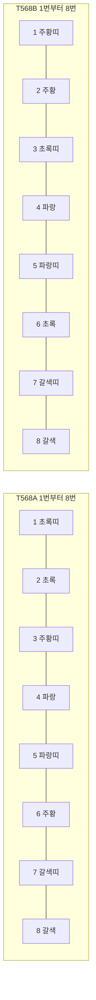
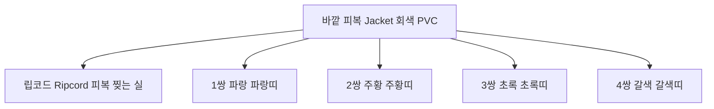

## 1. UTP 케이블이란 무엇인가

### 꼬임쌍선의 원리

**UTP**는 Unshielded Twisted Pair의 약자입니다. 단어를 하나씩 풀면 이렇습니다.

- **Unshielded** — 차폐(shield)되지 않은. 금속 호일로 감싸지 않았다는 뜻입니다.
- **Twisted** — 꼬인.
- **Pair** — 두 가닥이 한 쌍.

즉 "**차폐 없이 두 가닥씩 꼬아 놓은 선**"이 UTP입니다. 총 8가닥이 4쌍으로 묶여 있습니다.

왜 꼬면 잡음이 사라질까요? 한 쌍의 두 가닥은 **같은 신호를 서로 반대 극성으로** 실어 보냅니다. 이것을 차동 신호(differential signaling)라고 합니다. 외부 잡음이 들어오면 두 가닥에 **거의 똑같이** 실리는데, 받는 쪽에서 두 신호의 차이를 계산하면 공통으로 실린 잡음은 상쇄되어 사라집니다.

숫자로 확인해 봅니다. 보내려는 신호 크기를 5, 도중에 실린 잡음을 3이라고 두겠습니다.

- 첫째 가닥이 받은 값: 신호 5에 잡음 3이 더해져 **8**
- 짝 가닥이 받은 값: 뒤집힌 신호 -5에 같은 잡음 3이 더해져 **-2**
- 수신 측이 계산하는 값: 두 값의 차이, 즉 8에서 -2를 뺀 **10**

$$
8 - (-2) = 10 = 2 \times 5
$$

- 8: 첫째 가닥이 받은 값
- -2: 짝 가닥이 받은 값
- 10: 잡음 3이 서로 빼져 완전히 사라지고, 원래 신호 5의 두 배만 남은 결과

**결과 해석:** 잡음이 아무리 커도 두 가닥에 똑같이 실리기만 하면 결과에서 완전히 사라집니다.

두 가닥을 꼬아 두면 두 가닥이 겪는 전자기 환경이 거의 같아지므로, 이 상쇄 효과가 극대화됩니다. 게다가 **쌍마다 꼬임 간격을 일부러 다르게** 만들어 옆 쌍끼리의 누화도 줄입니다.

### 형제 규격들

| 약어 | 풀이 | 차폐 방식 | 특징 |
|------|------|----------|------|
| UTP | Unshielded Twisted Pair | 없음 | 가장 싸고 유연, 사무실 표준. 실기에서 쓰는 것 |
| FTP | Foiled Twisted Pair | 전체를 호일로 한 겹 | 잡음 많은 환경 |
| STP | Shielded Twisted Pair | 쌍마다 차폐 | 공장 등 극심한 잡음 환경, 비싸고 뻣뻣함 |

**카테고리**(Category, 줄여서 Cat)는 케이블의 성능 등급입니다.

| 등급 | 대역폭 | 지원 속도 | 비고 |
|------|--------|----------|------|
| Cat5 | 100MHz | 100Mbps | 사실상 퇴역 |
| Cat5e | 100MHz | 1Gbps | e는 enhanced 향상됨. 실기 연습용 대부분 |
| Cat6 | 250MHz | 1Gbps (10Gbps는 55m까지) | 현재 신규 배선의 기본 |
| Cat6a | 500MHz | 10Gbps 100m | a는 augmented 증강됨 |

UTP의 **최대 전송 거리는 100미터**입니다. 이 숫자는 필기·단답형에 잘 나옵니다. 100미터를 넘겨야 하면 중간에 신호를 되살리는 리피터(repeater)나 스위치를 넣거나, 광케이블로 바꿉니다.

## 2. 8가닥의 색을 읽는 법

### 색 이름 규칙

UTP를 벗기면 4쌍, 8가닥이 나옵니다. 각 쌍은 **단색 한 가닥 + 흰 바탕에 그 색 줄무늬 한 가닥**으로 이루어집니다.

| 쌍 번호 | 단색 가닥 | 줄무늬 가닥 | 이 문서의 표기 |
|--------|----------|------------|--------------|
| 1쌍 | 파랑 | 흰색에 파란 줄 | 파랑, 파랑띠 |
| 2쌍 | 주황 | 흰색에 주황 줄 | 주황, 주황띠 |
| 3쌍 | 초록 | 흰색에 초록 줄 | 초록, 초록띠 |
| 4쌍 | 갈색 | 흰색에 갈색 줄 | 갈색, 갈색띠 |

기출 해설에서 쓰는 "주황띠"는 **흰색 바탕에 주황 줄무늬가 있는 가닥**을 말합니다. 현장·교재에 따라 "흰주황", "백주황", "White-Orange"로도 씁니다. 전부 같은 가닥입니다.

**자주 틀리는 점:** "주황띠"를 "주황색 바탕에 흰 띠"로 착각하는 실수입니다. **바탕이 흰색인 쪽이 띠 가닥**입니다. 헷갈리면 "색이 옅은 쪽이 띠"라고 기억하십시오.

### RJ-45 커넥터의 핀 번호 세는 법

**RJ-45**는 Registered Jack 45의 약자로, 8개의 금속 접점을 가진 8P8C(8 Position 8 Contact) 커넥터입니다.

핀 번호를 세는 방향이 헷갈리면 배선이 통째로 뒤집힙니다. 규칙은 이렇습니다.

## 3. T568A와 T568B — 두 개의 색 순서 표준

### 왜 표준이 필요한가

케이블 양 끝을 각자 마음대로 배열하면, 내가 만든 케이블은 내 장비에서만 동작합니다. 세계 어디서 만든 케이블이든 어디서나 꽂히게 하려면 **1번 핀에는 무슨 색이 온다**는 약속이 있어야 합니다.

이 약속을 정한 것이 **TIA/EIA-568** 표준입니다. 이 표준 안에 **T568A**와 **T568B** 두 가지 배열이 들어 있습니다.

### 두 배열의 색 순서

| 핀 번호 | T568A | T568B |
|---------|-------|-------|
| 1 | 초록띠 | 주황띠 |
| 2 | 초록 | 주황 |
| 3 | 주황띠 | 초록띠 |
| 4 | 파랑 | 파랑 |
| 5 | 파랑띠 | 파랑띠 |
| 6 | 주황 | 초록 |
| 7 | 갈색띠 | 갈색띠 |
| 8 | 갈색 | 갈색 |

표를 세로로 훑으면 규칙이 보입니다. **T568A와 T568B는 주황 쌍과 초록 쌍의 자리만 서로 바뀐 것**이고, 파랑 쌍(4·5번)과 갈색 쌍(7·8번)은 완전히 같습니다.

```mermaid
graph LR
  subgraph A["T568A 1번부터 8번"]
    A1["1 초록띠"] --- A2["2 초록"] --- A3["3 주황띠"] --- A4["4 파랑"] --- A5["5 파랑띠"] --- A6["6 주황"] --- A7["7 갈색띠"] --- A8["8 갈색"]
  end
  subgraph B["T568B 1번부터 8번"]
    B1["1 주황띠"] --- B2["2 주황"] --- B3["3 초록띠"] --- B4["4 파랑"] --- B5["5 파랑띠"] --- B6["6 초록"] --- B7["7 갈색띠"] --- B8["8 갈색"]
  end
```

### T568B를 외우는 방법

실기 기출은 **거의 예외 없이 T568B**를 요구합니다. 그러니 T568B를 몸에 새겨야 합니다.

기출 해설이 쓰는 문장 그대로 읊습니다.

**주황띠 – 주황 – 초록띠 – 파랑 – 파랑띠 – 초록 – 갈색띠 – 갈색**

여덟 단어를 리듬으로 붙여 읽으면 외우기 쉽습니다. 구조로 이해하면 더 단단합니다.

**왜 초록 쌍이 찢어져 있을까요?** 옛 전화선(RJ-11) 규격과의 호환 때문입니다. 전화선은 가운데 두 핀(4·5번)을 씁니다. 그래서 랜 케이블도 가운데 두 자리를 파랑 쌍에 비워 주고, 초록 쌍이 그 바깥으로 밀려나 3번과 6번에 자리 잡았습니다. 이 배치 덕에 같은 배선에 전화기를 꽂아도 동작합니다.

**자주 틀리는 점:** 파랑 쌍을 "파랑띠 – 파랑" 순으로 배열하는 실수가 가장 흔합니다. 다른 세 쌍이 모두 "띠 먼저"라서 손이 관성으로 움직입니다. 4번은 **단색 파랑**입니다.

## 4. 8핀 각각이 하는 일

### 100Mbps에서는 4가닥만 일한다

100BASE-TX, 즉 100Mbps 이더넷은 8가닥 중 **4가닥만** 사용합니다.

| 핀 | T568B 색 | 신호 이름 | 뜻 |
|----|---------|----------|-----|
| 1 | 주황띠 | TX+ | Transmit 송신 플러스 |
| 2 | 주황 | TX- | Transmit 송신 마이너스 |
| 3 | 초록띠 | RX+ | Receive 수신 플러스 |
| 4 | 파랑 | 미사용 | 100Mbps에서는 놀고 있음 |
| 5 | 파랑띠 | 미사용 | 100Mbps에서는 놀고 있음 |
| 6 | 초록 | RX- | Receive 수신 마이너스 |
| 7 | 갈색띠 | 미사용 | 100Mbps에서는 놀고 있음 |
| 8 | 갈색 | 미사용 | 100Mbps에서는 놀고 있음 |

**TX**는 Transmit(송신), **RX**는 Receive(수신)입니다. 플러스와 마이너스는 앞에서 본 차동 신호의 두 극성입니다.

이 사실이 중요한 이유가 있습니다. **케이블 배선이 조금 틀려도 1·2·3·6번만 맞으면 100Mbps로는 통신이 됩니다.** 그래서 "왜 인터넷은 되는데 시험에서 오답이지?"라는 상황이 생깁니다. 채점은 통신 여부가 아니라 **규격 준수**를 봅니다.

### 1Gbps에서는 8가닥이 전부 일한다

1000BASE-T, 즉 기가비트 이더넷은 4쌍 8가닥을 모두 쓰고, 각 쌍이 동시에 송수신을 겸합니다.

| 핀 쌍 | T568B 색 | 1Gbps 역할 |
|-------|---------|-----------|
| 1–2 | 주황띠, 주황 | 양방향 데이터 A |
| 3–6 | 초록띠, 초록 | 양방향 데이터 B |
| 4–5 | 파랑, 파랑띠 | 양방향 데이터 C |
| 7–8 | 갈색띠, 갈색 | 양방향 데이터 D |

그래서 기가비트 환경에서는 **8가닥 중 하나만 잘못돼도 속도가 100Mbps로 떨어지거나 아예 링크가 서지 않습니다.** 실기에서 8핀을 전부 정확히 요구하는 이유이기도 합니다.

### PoE — 랜선으로 전기까지

**PoE**(Power over Ethernet, 이더넷 전력 공급)는 데이터 선에 전기까지 함께 실어 IP 전화기, 무선 AP(Access Point, 무선 접속 장치), IP 카메라 같은 장비를 별도 전원 없이 켭니다. 2026년 3회 기출에서 "공유기와 사내 IP Phone 연결"이 나왔는데, 실제 현장에서 IP Phone은 대체로 PoE로 전원을 받습니다.

## 5. 케이블 안쪽 구조와 제작 시 주의점

UTP 케이블을 잘라 단면을 보면 이런 구조입니다.

```mermaid
graph TD
  J["바깥 피복 Jacket 회색 PVC"] --> R["립코드 Ripcord 피복 찢는 실"]
  J --> P1["1쌍 파랑 파랑띠"]
  J --> P2["2쌍 주황 주황띠"]
  J --> P3["3쌍 초록 초록띠"]
  J --> P4["4쌍 갈색 갈색띠"]
```

제작에서 채점과 직결되는 물리적 조건이 세 가지 있습니다.

1. **피복 벗김 길이** — 바깥 피복을 약 13밀리미터 정도만 벗깁니다. 너무 길게 벗기면 꼬임이 풀린 구간이 길어져 누화가 늘고, 커넥터 안에 피복이 물리지 않아 선이 쉽게 빠집니다.
2. **꼬임 유지** — 꼬임을 푸는 구간은 **13밀리미터 이내**여야 합니다. 표준이 요구하는 값이고, 시험에서도 지나치게 풀린 케이블은 감점 대상입니다.
3. **피복 물림** — 커넥터를 압착할 때 **바깥 피복이 커넥터 안쪽까지 들어가** 함께 눌려야 합니다. 속선만 물리면 살짝만 당겨도 빠집니다.

**자주 틀리는 점:** 8가닥을 커넥터에 밀어 넣을 때 **끝까지 밀지 않아** 앞쪽 금속 접점에 닿지 않는 경우입니다. 압착 전에 커넥터 앞면 투명 부분을 눈으로 확인해, 8가닥이 모두 맨 앞까지 나란히 닿아 있는지 보십시오. 이 확인 한 번이 케이블 문제의 절반을 살립니다.

## 6. 이번 편이 03편으로 넘기는 것

여기까지가 "케이블은 무엇으로 되어 있고 색 순서 규격은 무엇인가"입니다. 다음 03편에서는 이 규격을 실제 문제 풀이로 옮깁니다.

- 문제 상황을 읽고 **다이렉트인지 크로스인지 판별**하는 규칙
- 탈피부터 압착까지 **제작 순서 전체**
- **케이블 테스터**의 램프가 어떻게 켜지면 어떤 불량인지 읽는 법

## 핵심 정리

- UTP는 Unshielded Twisted Pair, 차폐 없이 두 가닥씩 꼰 선 4쌍 8가닥이며 최대 전송 거리는 100미터다.
- 두 가닥을 꼬는 이유는 차동 신호로 외부 잡음을 상쇄하기 위해서다.
- T568B 순서는 주황띠 – 주황 – 초록띠 – 파랑 – 파랑띠 – 초록 – 갈색띠 – 갈색이며 실기는 거의 항상 이 배열을 요구한다.
- T568A와 T568B는 주황 쌍과 초록 쌍만 서로 바뀐 것이고 파랑·갈색 쌍은 동일하다.
- 파랑 쌍만 단색이 먼저(4번 파랑, 5번 파랑띠) 오는 예외이며, 초록 쌍은 3번과 6번으로 떨어져 있다.
- 100Mbps는 1·2·3·6번 네 가닥만 쓰지만, 1Gbps는 8가닥을 전부 쓴다. 통신이 되더라도 규격이 틀리면 오답이다.

## 마무리 복습

<Quiz
  questionNumber={1}
  question={"UTP 케이블에서 두 가닥을 서로 꼬아 놓는 가장 중요한 이유는?"}
  options={["케이블의 물리적 강도를 높이기 위해","두 가닥이 받는 외부 잡음을 서로 상쇄시키기 위해","전송 속도를 두 배로 올리기 위해","전기 저항을 낮추기 위해"]}
  correctAnswer={2}
  explanation={"꼬임쌍선은 한 쌍에 서로 반대 극성의 신호를 실어 보내는 차동 신호 방식을 쓴다. 외부 잡음이 두 가닥에 똑같이 실리므로 수신 측에서 차이를 계산하면 잡음이 상쇄된다."}
/>

<Quiz
  questionNumber={2}
  question={"T568B 배열에서 4번 핀에 오는 색은?"}
  options={["파랑띠","파랑","초록띠","주황"]}
  correctAnswer={2}
  explanation={"T568B는 주황띠 주황 초록띠 파랑 파랑띠 초록 갈색띠 갈색 순서다. 4번은 단색 파랑이고 5번이 파랑띠다."}
/>

<Quiz
  questionNumber={3}
  question={"T568A와 T568B의 차이를 바르게 설명한 것은?"}
  options={["파랑 쌍과 갈색 쌍의 자리가 서로 바뀐다","주황 쌍과 초록 쌍의 자리가 서로 바뀐다","8개 핀 순서가 모두 정반대로 뒤집힌다","사용하는 가닥 수 자체가 다르다"]}
  correctAnswer={2}
  explanation={"T568A와 T568B에서 파랑 쌍은 4번 5번 갈색 쌍은 7번 8번으로 동일하다. 차이는 1 2 3 6번 자리에서 주황 쌍과 초록 쌍이 서로 교체되는 것뿐이다."}
/>

## 참고 자료

- [ANSI/TIA-568 표준 개요](https://fr.wikipedia.org/wiki/ANSI/TIA-568)
- [TIA/EIA-568-B 개요](https://cs.wikipedia.org/wiki/TIA/EIA-568-B)
- [ICQA - 국가공인자격증 네트워크관리사 2급](https://www.icqa.or.kr/cn/page/network)
