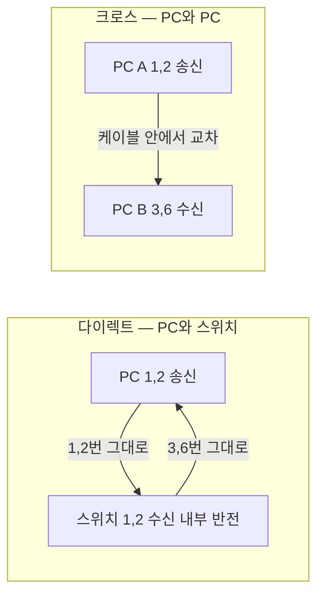
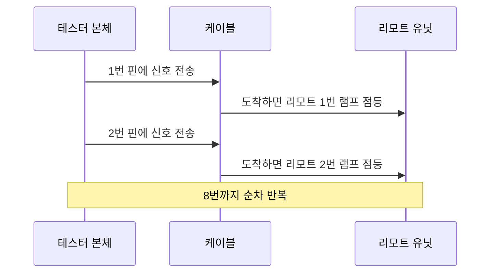

## 1. 왜 두 종류의 케이블이 필요한가

### 문제 상황 — 입과 귀가 마주 봐야 한다

02편에서 봤듯이 100Mbps 이더넷에서 1·2번은 **송신**(TX, Transmit), 3·6번은 **수신**(RX, Receive)입니다.

두 대의 PC를 랜선으로 직접 이었다고 생각해 봅시다. 양쪽 모두 1·2번이 송신입니다. 그러면 A의 입(1·2번)이 B의 입(1·2번)에 연결됩니다. **둘 다 말만 하고 아무도 듣지 않습니다.** 통신이 될 리가 없습니다.

### 해결책 두 가지

이 문제를 푸는 방법은 두 가지입니다.

**방법 1 — 케이블 안에서 꼬아 준다.** 한쪽 끝은 T568A, 반대쪽 끝은 T568B로 배열하면 1·2번과 3·6번이 서로 자리를 바꿔 연결됩니다. 이것이 **크로스 케이블**(crossover cable, 교차 케이블)입니다.

**방법 2 — 장비 안에서 꼬아 준다.** 허브와 스위치는 애초에 포트 내부에서 송수신이 뒤집혀 있습니다. 그래서 PC와 스위치를 이을 때는 케이블을 꼬을 필요가 없습니다. 양쪽 다 T568B로 만든 **다이렉트 케이블**(direct cable, 스트레이트 케이블 straight-through cable)을 씁니다.

```mermaid
graph LR
  subgraph D["다이렉트 — PC와 스위치"]
    PC1["PC 1,2 송신"] -->|1,2번 그대로| SW1["스위치 1,2 수신 내부 반전"]
    SW1 -->|3,6번 그대로| PC1
  end
  subgraph C["크로스 — PC와 PC"]
    PCA["PC A 1,2 송신"] -->|케이블 안에서 교차| PCB["PC B 3,6 수신"]
  end
```

## 2. 다이렉트와 크로스 판별 규칙

### 계층으로 나누는 전통 규칙

장비를 두 무리로 나눕니다.

| 무리 | 장비 | 특징 |
|------|------|------|
| 단말 쪽 (DTE) | PC, 라우터, 서버, IP Phone, 프린터, IP 카메라 | 1·2번으로 송신 |
| 중계 쪽 (DCE) | 허브, 스위치, 공유기의 LAN 포트, AP | 포트 내부에서 송수신 반전 |

DTE는 Data Terminal Equipment(데이터 단말 장치), DCE는 Data Circuit-terminating Equipment(회선 종단 장치)의 약자입니다.

판별 규칙은 딱 한 줄입니다.

> **서로 다른 무리끼리 연결하면 다이렉트, 같은 무리끼리 연결하면 크로스.**

| 연결 상황 | 무리 조합 | 케이블 |
|----------|----------|--------|
| PC ↔ 스위치 | 단말 + 중계 | 다이렉트 |
| PC ↔ 허브 | 단말 + 중계 | 다이렉트 |
| PC ↔ 공유기 LAN 포트 | 단말 + 중계 | 다이렉트 |
| 공유기 ↔ IP Phone | 중계 + 단말 | 다이렉트 |
| 라우터 ↔ 스위치 | 단말 + 중계 | 다이렉트 |
| 스위치 ↔ 허브 | 중계 + 중계 | 크로스 |
| PC ↔ PC | 단말 + 단말 | 크로스 |
| 라우터 ↔ 라우터 | 단말 + 단말 | 크로스 |
| 스위치 ↔ 스위치 | 중계 + 중계 | 크로스 |

**라우터를 단말 무리에 넣는 것**이 처음에는 어색합니다. 라우터는 크고 중요한 장비지만, 이더넷 포트의 전기적 배치만 놓고 보면 PC와 똑같이 1·2번으로 송신합니다. 그래서 "PC와 같은 편"이라고 외우면 됩니다.

### 기출 문장을 판별해 보기

기출 8회분에서 케이블 문제 상황이 어떻게 나왔는지, 각각을 판별해 봅니다.

**결과 해석:** 기출에서 요구된 것은 전부 다이렉트였습니다. 그렇다고 크로스를 버리면 안 됩니다. "두 대의 스위치를 직접 연결" 같은 문장이 언제든 나올 수 있고, 크로스 핀맵 자체가 단답형·선택형 소재이기도 합니다.

### Auto MDI/MDIX — 현실과 시험의 차이

요즘 장비는 대부분 **Auto MDI/MDIX** 기능이 있습니다. 그래서 **현실에서는 스위치끼리를 다이렉트로 이어도 통신이 됩니다.**

**시험에서는 이 사실을 근거로 답을 바꾸면 안 됩니다.** 실기 채점은 규격상 올바른 케이블 종류와 핀맵을 봅니다. "요즘은 아무거나 되니까"는 채점표에 없습니다.

## 3. 두 케이블의 핀맵을 눈으로 확인하기

### 다이렉트 케이블 — 양쪽 모두 T568B

| 핀 | A쪽 (T568B) | B쪽 (T568B) | 연결 |
|----|-----------|-----------|------|
| 1 | 주황띠 | 주황띠 | 1번 대 1번 |
| 2 | 주황 | 주황 | 2번 대 2번 |
| 3 | 초록띠 | 초록띠 | 3번 대 3번 |
| 4 | 파랑 | 파랑 | 4번 대 4번 |
| 5 | 파랑띠 | 파랑띠 | 5번 대 5번 |
| 6 | 초록 | 초록 | 6번 대 6번 |
| 7 | 갈색띠 | 갈색띠 | 7번 대 7번 |
| 8 | 갈색 | 갈색 | 8번 대 8번 |

같은 번호끼리 곧게(straight) 이어지므로 스트레이트 케이블이라고도 부릅니다.

### 크로스 케이블 — 한쪽 T568A, 반대쪽 T568B

| 핀 | A쪽 (T568A) | B쪽 (T568B) | 실제 연결 |
|----|-----------|-----------|----------|
| 1 | 초록띠 | 주황띠 | A의 1번이 B의 3번에 도달 |
| 2 | 초록 | 주황 | A의 2번이 B의 6번에 도달 |
| 3 | 주황띠 | 초록띠 | A의 3번이 B의 1번에 도달 |
| 4 | 파랑 | 파랑 | 4번 대 4번 |
| 5 | 파랑띠 | 파랑띠 | 5번 대 5번 |
| 6 | 주황 | 초록 | A의 6번이 B의 2번에 도달 |
| 7 | 갈색띠 | 갈색띠 | 7번 대 7번 |
| 8 | 갈색 | 갈색 | 8번 대 8번 |

여기서 "실제 연결" 열의 의미를 정확히 이해해야 합니다. 케이블 안의 **같은 색 가닥끼리** 이어져 있습니다. A쪽에서 초록띠는 1번 자리에 꽂혀 있고, B쪽에서 같은 초록띠 가닥은 3번 자리에 꽂혀 있습니다. 그래서 A의 1번 핀 신호가 B의 3번 핀으로 나옵니다.

**결과 해석:** A의 송신(1·2번)이 B의 수신(3·6번)에 정확히 닿습니다. 이것이 크로스가 하는 일 전부입니다.

### 롤오버 케이블 — 참고로만

**롤오버 케이블**(rollover cable)은 양 끝의 핀 순서를 완전히 뒤집은(1↔8, 2↔7, 3↔6, 4↔5) 케이블로, 라우터·스위치의 **콘솔 포트**에 PC를 연결해 CLI를 조작할 때 씁니다. 실기에서 직접 제작하라고 나오지는 않지만, 05편에서 라우터 CLI에 접속할 때 개념적으로 등장하므로 이름은 기억해 두십시오.

## 4. 제작 순서 — 탈피부터 압착까지

실기장에서 지급되는 도구는 보통 UTP 케이블, RJ-45 커넥터, **크림핑 툴**(crimping tool, 압착 공구), 케이블 테스터입니다. 크림핑 툴에는 대개 피복을 벗기는 칼날과 케이블을 자르는 칼날이 함께 달려 있습니다.

**자주 틀리는 점 정리**

| 실수 | 결과 | 예방법 |
|------|------|-------|
| 걸쇠 방향을 반대로 잡고 배열 | 8핀 전체가 좌우 반전 | 걸쇠를 아래로, 금속 면을 위로 고정 |
| 4번과 5번을 파랑띠–파랑 순으로 배열 | 규격 위반, 기가비트 링크 실패 | 4번은 단색 파랑 |
| 8가닥을 끝까지 밀지 않음 | 일부 핀 미접촉, 테스터에서 불 안 켜짐 | 압착 전 앞면 투명 부분 육안 확인 |
| 피복을 너무 많이 벗김 | 피복이 커넥터에 안 물려 선이 빠짐 | 피복 끝에서 약 13밀리미터 |
| 속선 피복까지 벗김 | 구리선 손상, 단선 | 탈피 시 힘을 약하게 |
| 반대쪽 배열을 확인 없이 진행 | 다이렉트를 만들려다 크로스가 됨 | 두 커넥터를 나란히 놓고 색 비교 |

## 5. 케이블 테스터 결과 읽기

### 테스터의 구조

**케이블 테스터**(cable tester)는 본체(마스터)와 리모트(원격 유닛) 두 조각으로 되어 있습니다. 케이블 한쪽 끝을 본체에, 반대쪽 끝을 리모트에 꽂고 전원을 켜면, 본체가 1번 핀부터 8번 핀까지 차례로 신호를 흘려보냅니다. 신호가 반대쪽에 도착하면 양쪽 램프가 그 번호에서 동시에 켜집니다.

```mermaid
sequenceDiagram
  participant M as 테스터 본체
  participant C as 케이블
  participant R as 리모트 유닛
  M->>C: 1번 핀에 신호 전송
  C->>R: 도착하면 리모트 1번 램프 점등
  M->>C: 2번 핀에 신호 전송
  C->>R: 도착하면 리모트 2번 램프 점등
  Note over M,R: 8번까지 순차 반복
```

### 정상 판정

- **다이렉트 케이블**: 본체와 리모트의 램프가 **1-1, 2-2, 3-3, … 8-8** 순서로 나란히 켜집니다.
- **크로스 케이블**: **1-3, 2-6, 3-1, 4-4, 5-5, 6-2, 7-7, 8-8** 순서로 켜집니다. 1·2·3·6번 자리가 교차하고 나머지는 그대로입니다.

크로스인데 1-1로 켜졌다면 다이렉트를 만든 것이고, 다이렉트인데 1-3으로 켜졌다면 크로스를 만든 것입니다.

### 불량 유형별 판정

| 램프 상태 | 불량 이름 | 원인 | 조치 |
|----------|----------|------|------|
| 특정 번호에서 양쪽 모두 불이 안 켜짐 | 단선 (Open) | 그 가닥이 접점에 닿지 않음, 압착 불량, 구리선 끊김 | 그쪽 커넥터를 잘라내고 재제작 |
| 아무 번호도 안 켜짐 | 전체 단선 | 커넥터가 덜 물림, 케이블 자체 절단 | 양쪽 재제작, 테스터 배터리도 확인 |
| 두 번호가 서로 뒤바뀌어 켜짐 | 오배선 (Miswire) | 색 순서를 잘못 배열 | 잘못된 쪽 재제작 |
| 두 가닥이 동시에 켜짐 | 단락 (Short) | 구리선끼리 닿음, 탈피 시 피복 손상 | 손상 구간 잘라내고 재제작 |
| 쌍 단위로 자리가 바뀜 (예: 1-3, 2-6이 아닌 1-2, 3-6 방식) | 스플릿 페어 (Split Pair) | 쌍을 지키지 않고 색만 자리 맞춤 | 쌍 구성부터 다시 확인 |

**스플릿 페어**를 조금 더 설명하겠습니다. 도통 검사만 하는 저가 테스터는 "1번 신호가 1번으로 나온다"까지만 봅니다.

**자주 틀리는 점:** 테스터에서 1·2·3·6번만 켜지는 것을 보고 "100Mbps는 이 네 가닥만 쓰니까 정상"이라고 판단하는 실수입니다. 실기 채점은 **8핀 전부**를 봅니다. 4·5·7·8번이 안 켜지면 불합격 케이블입니다.

## 핵심 정리

- 케이블 종류 판별은 무리 규칙 한 줄로 끝난다. 단말(PC·라우터·IP Phone)과 중계(허브·스위치·공유기 LAN 포트)가 서로 다르면 다이렉트, 같으면 크로스다.
- 다이렉트는 양쪽 모두 T568B, 크로스는 한쪽 T568A와 반대쪽 T568B다.
- 크로스는 1·2번 송신을 3·6번 수신에 연결해 준다. 4·5·7·8번은 그대로다.
- 제작 순서는 절단 → 탈피 → 꼬임 풀기 → 배열 → 길이 맞춰 자르기 → 삽입 → 육안 확인 → 압착 → 테스트다. 압착은 되돌릴 수 없으므로 확인이 먼저다.
- 테스터에서 다이렉트는 1-1부터 8-8까지, 크로스는 1-3, 2-6, 3-1, 6-2 형태로 켜져야 정상이다.
- Auto MDI/MDIX 덕에 현실에서는 아무 케이블이나 통해도, 채점은 규격만 본다.

## 마무리 복습

<Quiz
  questionNumber={1}
  question={"공유기의 LAN 포트와 사내 IP Phone을 연결할 때 제작해야 하는 케이블과 배열은?"}
  options={["크로스 케이블, 한쪽 T568A 반대쪽 T568B","다이렉트 케이블, 양쪽 모두 T568B","롤오버 케이블, 양쪽 핀 순서를 반대로","크로스 케이블, 양쪽 모두 T568A"]}
  correctAnswer={2}
  explanation={"공유기 LAN 포트는 내부가 스위치인 중계 장비이고 IP Phone은 단말 장비다. 서로 다른 무리를 연결하므로 다이렉트 케이블을 양쪽 T568B로 제작한다."}
/>

<Quiz
  questionNumber={2}
  question={"다음 중 크로스 케이블을 사용해야 하는 연결은?"}
  options={["PC와 스위치","라우터와 스위치","스위치와 스위치","PC와 공유기 LAN 포트"]}
  correctAnswer={3}
  explanation={"스위치와 스위치는 둘 다 중계 장비로 같은 무리이므로 크로스가 필요하다. 나머지는 모두 단말과 중계의 조합이라 다이렉트를 쓴다."}
/>

<Quiz
  questionNumber={3}
  question={"크로스 케이블에서 A쪽 1번 핀의 신호는 B쪽 몇 번 핀으로 도달하는가?"}
  options={["1번","2번","3번","6번"]}
  correctAnswer={3}
  explanation={"크로스는 송신 쌍 1번 2번을 수신 쌍 3번 6번에 연결한다. 1번은 3번으로 2번은 6번으로 간다."}
/>

## 참고 자료

- [ANSI/TIA-568 표준 개요](https://fr.wikipedia.org/wiki/ANSI/TIA-568)
- [TIA/EIA-568-B 개요](https://cs.wikipedia.org/wiki/TIA/EIA-568-B)
- [네트워크관리사 2급 실기 정리 자료](https://devbirdfeet.tistory.com/296)
