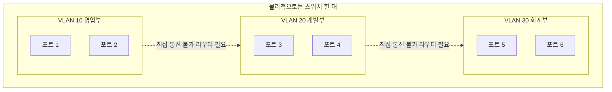
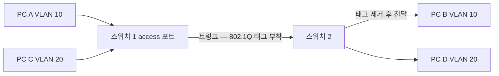
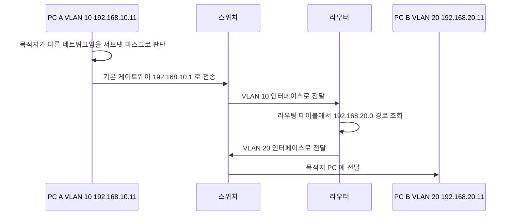

<Callout type="info">
  이 편의 Cisco 스위치·라우터 설정은 개념을 확인하는 보충 예시입니다. ICQA 라우터 에뮬레이터가 모든 명령을 지원하거나 VLAN·NAT 구성을 그대로 출제한다는 뜻은 아닙니다. Windows Server의 DHCP·DNS·IIS 화면 설정은 11편에서 별도로 연습합니다.
</Callout>

## 1. VLAN이 없던 시절의 문제

### 스위치는 브로드캐스트를 막지 못한다

04편에서 봤듯이 VLAN을 나누지 않은 일반적인 L2 스위치는 충돌 도메인은 나누지만 같은 VLAN 안의 **브로드캐스트 도메인은 나누지 않습니다.** 목적지가 브로드캐스트 주소(`FF-FF-FF-FF-FF-FF`)인 프레임은 모든 포트로 뿌려집니다.

24포트 스위치에 24대가 물려 있고 부서가 셋(영업·개발·회계)이라고 합시다. 영업부 PC가 ARP 요청을 뿌리면 개발부와 회계부의 22대가 전부 그 프레임을 받아 봉투를 뜯고 "나한테 온 게 아니네" 하고 버립니다.

문제는 두 가지입니다.

1. **성능** — 쓸데없는 트래픽이 모든 포트를 지나가고, 모든 PC의 랜카드와 CPU가 그것을 처리합니다.
2. **보안** — 회계부의 브로드캐스트가 영업부 PC에 그대로 도달합니다. 부서를 나누고 싶어도 물리적으로 나뉘어 있지 않습니다.

### 옛 해결책 — 스위치를 따로 산다

부서마다 스위치를 따로 사서 물리적으로 분리하면 해결됩니다. 하지만 이 방식은 비쌉니다.

- 부서마다 스위치 한 대씩, 포트가 남아도 낭비
- 사람이 자리를 옮기면 케이블 배선을 새로 해야 함
- 부서가 생기거나 없어질 때마다 장비를 사고 버려야 함

## 2. VLAN — 소프트웨어로 세우는 벽

### 정의

**VLAN**은 Virtual Local Area Network(가상 근거리 통신망)의 약자입니다. 단어를 풀면 "가상의 랜"입니다.

물리적으로는 스위치 한 대인데, 설정으로 **포트를 여러 그룹으로 나누어** 각 그룹이 서로 다른 독립된 스위치처럼 동작하게 만듭니다.


```mermaid
graph TD
  subgraph SW["물리적으로는 스위치 한 대"]
    subgraph V10["VLAN 10 영업부"]
      P1["포트 1"]
      P2["포트 2"]
    end
    subgraph V20["VLAN 20 개발부"]
      P3["포트 3"]
      P4["포트 4"]
    end
    subgraph V30["VLAN 30 회계부"]
      P5["포트 5"]
      P6["포트 6"]
    end
  end
  V10 -.->|직접 통신 불가 라우터 필요| V20
  V20 -.->|직접 통신 불가 라우터 필요| V30
```

### VLAN이 만들어 내는 결과

| 항목 | VLAN 적용 전 | VLAN 적용 후 |
|------|-------------|-------------|
| 브로드캐스트 도메인 | 스위치 전체가 1개 | VLAN 개수만큼 분리 |
| 부서 간 통신 | 자유롭게 가능 | 3계층 장비를 거쳐야 가능 |
| 자리 이동 시 작업 | 배선 변경 | 포트의 VLAN 번호만 변경 |
| 필요 장비 | 부서 수만큼의 스위치 | 스위치 한 대 |

**핵심 결론:** VLAN이 다르면 **같은 스위치에 꽂혀 있어도 서로 통신할 수 없습니다.** 통신하게 하려면 라우터나 L3 스위치를 거쳐야 하고, 이를 **VLAN 간 라우팅**(inter-VLAN routing)이라고 합니다.

### VLAN 번호 규칙

| 번호 범위 | 이름 | 용도 |
|----------|------|------|
| 0, 4095 | 예약 | 사용자가 쓸 수 없음 |
| 1 | 기본 VLAN (default) | 모든 포트의 초기 소속. 삭제 불가 |
| 2 – 1001 | 일반 범위 (normal range) | 사용자 정의 VLAN. 실기 범위 |
| 1002 – 1005 | 예약 | 옛 토큰링·FDDI용. 삭제 불가 |
| 1006 – 4094 | 확장 범위 (extended range) | 대규모 환경용 |

**VLAN 1**은 특별합니다. 아무 설정도 하지 않은 스위치의 모든 포트는 VLAN 1에 속합니다. 삭제할 수 없고, 관리 트래픽의 기본 통로이기도 합니다. 보안 관점에서는 **업무용으로 VLAN 1을 쓰지 않는 것**이 권장됩니다.

## 3. 포트의 두 가지 모드 — access와 trunk

### access 포트

**액세스 포트**(access port)는 **단 하나의 VLAN에만 속하는 포트**입니다. PC, 프린터, 서버처럼 VLAN을 모르는 최종 장치를 연결합니다.

액세스 포트로 들어온 프레임에는 아무 표시가 없습니다. 스위치가 "이 포트는 VLAN 10 소속"이라고 내부적으로 기억할 뿐입니다.

### trunk 포트

문제 상황을 봅시다. 스위치가 두 대이고 두 대 모두에 영업부(VLAN 10)와 개발부(VLAN 20) PC가 물려 있습니다. 1층 영업부 PC가 2층 영업부 PC와 통신하려면 두 스위치 사이에 선이 필요합니다.

VLAN마다 선을 따로 깔면 어떨까요? VLAN이 10개면 스위치 사이에 10가닥이 필요합니다. 낭비입니다.

**트렁크 포트**(trunk port)는 **여러 VLAN의 프레임을 한 가닥으로 실어 나르는 포트**입니다.

그 꼬리표가 **태그**(tag)이고, 태그를 붙이는 표준 방식이 **IEEE 802.1Q**입니다.


```mermaid
graph LR
  PCA["PC A VLAN 10"] --> SW1["스위치 1 access 포트"]
  SW1 -->|"트렁크 — 802.1Q 태그 부착"| SW2["스위치 2"]
  SW2 -->|"태그 제거 후 전달"| PCB["PC B VLAN 10"]
  PCC["PC C VLAN 20"] --> SW1
  SW2 --> PCD["PC D VLAN 20"]
```

### 802.1Q 태그의 구조

트렁크를 지나는 프레임에는 4바이트짜리 태그가 이더넷 헤더 안에 끼워집니다.

| 필드 | 크기 | 내용 |
|------|------|------|
| TPID (Tag Protocol Identifier) | 2바이트 | 고정값 0x8100. 이것이 802.1Q 태그임을 표시 |
| PCP (Priority Code Point) | 3비트 | 우선순위 0부터 7까지 |
| DEI (Drop Eligible Indicator) | 1비트 | 혼잡 시 버려도 되는지 표시 |
| VID (VLAN Identifier) | 12비트 | VLAN 번호 |

VID가 12비트이므로 표현 가능한 VLAN 개수는 다음과 같습니다.

$$
2^{12} = 4096
$$

- 12: VID 필드의 비트 수
- 4096: 0번부터 4095번까지의 개수

여기서 0번과 4095번이 예약되어 있으므로, 실제로 쓸 수 있는 VLAN은 1번부터 4094번까지입니다. 앞의 VLAN 번호 표에서 확장 범위가 4094에서 끝나는 이유가 바로 이 계산입니다.

### 네이티브 VLAN

트렁크에는 예외가 하나 있습니다. **네이티브 VLAN**(native VLAN)에 속한 프레임만은 **태그 없이** 통과합니다. 기본값은 VLAN 1입니다.

이 규칙은 옛 장비와의 호환을 위해 남아 있습니다. 양쪽 스위치의 네이티브 VLAN 번호가 서로 다르면 트래픽이 엉뚱한 VLAN으로 새므로, 실무에서는 반드시 양쪽을 맞춥니다.

## 5. 확인 명령 읽기

### show vlan brief

```text
Switch# show vlan brief
```

출력은 이런 형태입니다.

```text
VLAN Name                             Status    Ports
---- -------------------------------- --------- -------------------------------
1    default                          active    Fa0/5, Fa0/6, Fa0/7, Fa0/8
10   SALES                            active    Fa0/1, Fa0/2
20   DEVELOP                          active    Fa0/3, Fa0/4
```

읽는 법입니다.

- **VLAN** — 번호
- **Name** — 이름. 붙이지 않으면 `VLAN0010` 형태로 자동 생성됩니다
- **Status** — `active`가 정상입니다
- **Ports** — 그 VLAN에 속한 액세스 포트 목록

**주의:** **트렁크 포트는 이 목록에 나타나지 않습니다.** 트렁크는 특정 VLAN의 소속이 아니라 모든 VLAN을 실어 나르는 통로이기 때문입니다. 트렁크로 설정한 포트가 목록에서 사라졌다고 당황하지 마십시오. 오히려 정상 동작의 증거입니다.

### show interfaces trunk

```text
Switch# show interfaces trunk
```

```text
Port        Mode         Encapsulation  Status        Native vlan
Gi0/1       on           802.1q         trunking      1

Port        Vlans allowed on trunk
Gi0/1       10,20
```

- **Mode** — `on`이면 수동으로 트렁크 고정
- **Status** — `trunking`이 정상. `not-trunking`이면 협상 실패
- **Native vlan** — 태그 없이 지나가는 VLAN 번호. 양쪽이 같아야 합니다

### show interfaces switchport

특정 포트의 모드와 VLAN 소속을 자세히 봅니다.

```text
Switch# show interfaces fastethernet 0/1 switchport
```

주요 줄만 읽으면 됩니다.

- `Administrative Mode: static access` — 관리자가 지정한 모드
- `Operational Mode: static access` — 실제로 동작 중인 모드
- `Access Mode VLAN: 10 (SALES)` — 소속 VLAN

**관리자 모드와 동작 모드가 다르면** 협상이 실패한 것입니다. 상대 포트의 설정을 확인해야 합니다.

## 6. VLAN 간 통신 — 왜 라우터가 필요한가

VLAN 10의 PC(`192.168.10.11`)가 VLAN 20의 PC(`192.168.20.11`)와 통신하려 합니다.


```mermaid
sequenceDiagram
  participant A as PC A VLAN 10 192.168.10.11
  participant SW as 스위치
  participant R as 라우터
  participant B as PC B VLAN 20 192.168.20.11
  A->>A: 목적지가 다른 네트워크임을 서브넷 마스크로 판단
  A->>SW: 기본 게이트웨이 192.168.10.1 로 전송
  SW->>R: VLAN 10 인터페이스로 전달
  R->>R: 라우팅 테이블에서 192.168.20.0 경로 조회
  R->>SW: VLAN 20 인터페이스로 전달
  SW->>B: 목적지 PC 에 전달
```

**핵심:** VLAN을 나눈다는 것은 **네트워크 대역도 나눈다는 뜻**입니다. VLAN 10에 `192.168.10.0/24`, VLAN 20에 `192.168.20.0/24`를 배정하고, 각 VLAN의 PC는 자기 VLAN에 해당하는 라우터 인터페이스를 게이트웨이로 씁니다.

라우터 포트가 하나뿐인데 VLAN이 여러 개면 **서브인터페이스**(subinterface)를 만듭니다. 이 방식을 라우터의 팔에 여러 손이 달린 모습에 빗대어 **Router on a Stick**이라고 부릅니다.

```text
Router(config)# interface gigabitethernet 0/0
Router(config-if)# no shutdown
Router(config-if)# exit
Router(config)# interface gigabitethernet 0/0.10
Router(config-subif)# encapsulation dot1q 10
Router(config-subif)# ip address 192.168.10.1 255.255.255.0
Router(config-subif)# exit
Router(config)# interface gigabitethernet 0/0.20
Router(config-subif)# encapsulation dot1q 20
Router(config-subif)# ip address 192.168.20.1 255.255.255.0
Router(config-subif)# exit
Router(config)# exit
Router# copy running-config startup-config
```

- `gigabitethernet 0/0.10` — 점 뒤의 숫자가 서브인터페이스 번호입니다. 관례적으로 VLAN 번호와 같게 맞춥니다
- `encapsulation dot1q 10` — 이 서브인터페이스가 VLAN 10의 태그를 처리한다고 선언합니다
- **물리 인터페이스에 `no shutdown`을 먼저 해야** 서브인터페이스도 살아납니다

**자주 틀리는 점:** 서브인터페이스만 만들고 물리 인터페이스의 `no shutdown`을 빠뜨리는 실수입니다. 서브인터페이스는 물리 포트 위에 얹힌 논리적 존재이므로, 아래가 죽어 있으면 위도 죽습니다.

## 7. 감점 포인트 체크리스트

| 감점 유형 | 상황 | 예방책 |
|----------|------|-------|
| 저장 누락 | `copy running-config startup-config` 미실행 | 마지막 줄로 고정 |
| VLAN 미생성 | 만들지 않은 VLAN 번호를 포트에 지정 | `vlan 번호`로 먼저 생성 |
| 모드 미지정 | `switchport mode access` 생략 | 액세스 포트는 모드와 VLAN 두 줄 모두 |
| 트렁크 협상 실패 | 한쪽만 트렁크로 설정 | 양쪽 모두 `switchport mode trunk` |
| 네이티브 VLAN 불일치 | 양쪽 번호가 다름 | `show interfaces trunk`로 확인 |
| 서브인터페이스 미동작 | 물리 포트가 shutdown 상태 | 물리 포트 먼저 `no shutdown` |
| range 문법 오류 | `0/1-4`처럼 공백 없이 입력 | 하이픈 양옆에 공백 |

## 핵심 정리

- VLAN은 하나의 스위치를 논리적으로 나누어 각각 독립된 브로드캐스트 도메인을 만드는 2계층 기술이다.
- VLAN이 다르면 같은 스위치에 꽂혀 있어도 직접 통신할 수 없고, 3계층 장비를 거쳐야 한다.
- 액세스 포트는 하나의 VLAN에만 속하며 최종 장치를 연결한다. 트렁크 포트는 여러 VLAN의 프레임을 802.1Q 태그를 붙여 한 가닥으로 실어 나른다.
- 802.1Q의 VID는 12비트여서 이론상 4096개, 실제로는 1번부터 4094번까지 쓸 수 있다. 네이티브 VLAN만 태그 없이 지나간다.
- `show vlan brief`에는 액세스 포트만 나오고 트렁크 포트는 나오지 않는다. 이는 정상이다.
- 라우터 포트 하나로 여러 VLAN을 라우팅하려면 서브인터페이스에 `encapsulation dot1q`를 지정하고, 물리 포트를 먼저 활성화해야 한다.

## 마무리 복습

<Quiz
  questionNumber={1}
  question={"복수 개의 VLAN 프레임을 한 가닥의 링크로 전송할 수 있으며 주로 스위치 간 연결에 사용되는 것은?"}
  options={["액세스 링크","트렁크 링크","이더채널","콘솔 링크"]}
  correctAnswer={2}
  explanation={"트렁크 링크는 여러 VLAN 의 프레임에 802.1Q 태그를 붙여 한 물리 링크로 전달한다. 액세스 링크는 단 하나의 VLAN 만 담당한다."}
/>

<Quiz
  questionNumber={2}
  question={"VLAN 을 사용하는 가장 본질적인 효과로 알맞은 것은?"}
  options={["충돌 도메인을 포트마다 분리한다","브로드캐스트 도메인을 논리적으로 분리한다","케이블 최대 길이를 늘린다","라우팅 프로토콜을 자동으로 설정한다"]}
  correctAnswer={2}
  explanation={"충돌 도메인 분리는 스위치가 이미 수행하는 일이다. VLAN 의 고유한 효과는 하나의 스위치 안에서 브로드캐스트 도메인을 여러 개로 나누는 것이다."}
/>

<Quiz
  questionNumber={3}
  question={"스위치 포트를 VLAN 10 의 액세스 포트로 만들 때 필요한 두 명령의 조합으로 옳은 것은?"}
  options={["switchport mode trunk 와 switchport access vlan 10","switchport mode access 와 switchport access vlan 10","vlan 10 과 name SALES","switchport trunk allowed vlan 10 과 no shutdown"]}
  correctAnswer={2}
  explanation={"포트를 액세스 모드로 고정하는 명령과 소속 VLAN 을 지정하는 명령이 짝을 이룬다. 모드 지정을 빠뜨리면 포트가 자동 협상 상태로 남아 의도치 않게 트렁크가 될 수 있다."}
/>

## 참고 자료

- [Cisco IOS Commands 참조 자료](https://germanna.edu/sites/default/files/2026-02/Cisco%20IOS%20Commands.pdf)
- [Cisco IOS Command Reference 요약](https://courseiva.com/commands/cisco)
- [ICQA - 국가공인자격증 네트워크관리사 2급](https://www.icqa.or.kr/cn/page/network)
