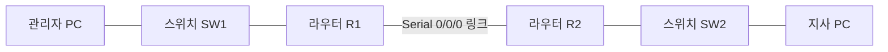
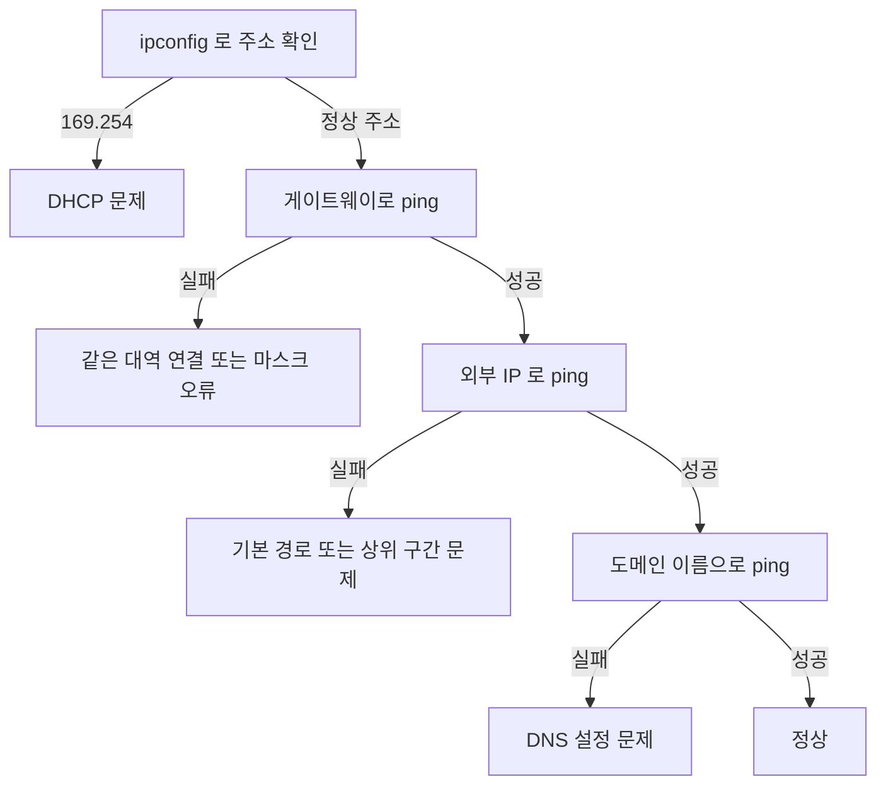

<Callout type="warning">
  **이 문서의 문제는 실제 기출문제를 그대로 옮긴 것이 아닙니다.** 공개된 회차별 출제 형식과 난이도를 참고해 값과 상황을 **새로 구성한 유사문제**이며, 원문에서 조건과 정답이 서로 어긋나거나 표기가 부정확했던 부분은 표준에 맞게 바로잡아 재구성했습니다. 실제 시험의 문항 수·배점·화면 구성은 반드시 ICQA 공식 안내에서 확인하십시오.
</Callout>

## 이 세트의 전제 구성도


```mermaid
graph LR
  PCA["관리자 PC"] --- SW1["스위치 SW1"]
  SW1 --- R1["라우터 R1"]
  R1 ---|"Serial 0/0/0 링크"| R2["라우터 R2"]
  R2 --- SW2["스위치 SW2"]
  SW2 --- PCB["지사 PC"]
```

| 구간 | 대역 | 비고 |
|-----|------|------|
| 본사 LAN (R1 쪽) | 210.100.50.128/27 | 과제 1에서 계산 |
| 라우터 간 시리얼 링크 | 10.10.10.0/30 | R1은 `.1`, R2는 `.2` |
| 지사 LAN (R2 쪽) | 192.168.70.0/24 | R2의 `Fa0/0`이 `.1` |
| OSPF 대상 대역 | 172.30.8.0/22 | 과제 4에서 사용 |

## 과제 1. 네트워크 속성 설정

### 문제

관리자 PC의 네트워크 속성을 아래 조건대로 설정하시오.

- 네트워크 범위: `210.100.50.128/27`
- IP 주소: 사용 가능한 **첫 번째** 주소
- 기본 게이트웨이: 사용 가능한 **마지막** 주소
- 추가 게이트웨이: `210.100.50.157`
- 기본 설정 DNS 서버: `168.126.63.1`
- 보조 DNS 서버: `210.220.163.82`

### 정답

| 입력칸 | 넣을 값 | 입력 위치 |
|-------|--------|----------|
| IP 주소 | 210.100.50.129 | 기본 화면 |
| 서브넷 마스크 | 255.255.255.224 | 기본 화면 |
| 기본 게이트웨이 | 210.100.50.158 | 기본 화면 |
| 추가 게이트웨이 | 210.100.50.157 | 고급 버튼 안 IP 설정 탭 |
| 기본 설정 DNS 서버 | 168.126.63.1 | 기본 화면 |
| 보조 DNS 서버 | 210.220.163.82 | 기본 화면 |

### 이 값이 나온 계산 과정

**1. 프리픽스를 마스크로 바꾼다.** `/27`은 마지막 토막에 1이 3개 남습니다.

| 토막 | 비트 배열 | 누적 1의 개수 | 십진수 |
|------|----------|-------------|--------|
| 1번째 | 11111111 | 8 | 255 |
| 2번째 | 11111111 | 16 | 255 |
| 3번째 | 11111111 | 24 | 255 |
| 4번째 | 11100000 | 27 | 224 |

$$
256 - 2^{5} = 256 - 32 = 224
$$

**2. 블록 크기를 구한다.** 호스트 비트가 5개이므로 다음과 같습니다.

$$
2^{5} = 32
$$

**3. 블록의 경계를 확인한다.** 네 번째 토막의 경계는 0, 32, 64, 96, 128, 160, 192, 224입니다. 주어진 네트워크 주소 128은 정확히 경계 위에 있으므로 이 블록은 **128부터 159까지**입니다.

**4. 브로드캐스트와 사용 범위를 구한다.**

$$
128 + 32 - 1 = 159
$$

| 항목 | 값 |
|-----|-----|
| 네트워크 주소 | 210.100.50.128 |
| 첫 사용 가능 주소 | 210.100.50.129 |
| 마지막 사용 가능 주소 | 210.100.50.158 |
| 브로드캐스트 주소 | 210.100.50.159 |

**5. 검산한다.** 마지막 주소를 두 방법으로 구해 일치하는지 봅니다.

$$
128 + 32 - 2 = 158
$$

$$
159 - 1 = 158
$$

두 값이 같으므로 계산이 맞습니다.

### 자주 하는 실수

| 실수 | 잘못된 값 | 왜 틀렸나 |
|-----|----------|----------|
| 대역 마지막을 습관적으로 씀 | 210.100.50.254 | `/27` 블록은 159에서 끝남 |
| 브로드캐스트를 게이트웨이로 씀 | 210.100.50.159 | 호스트에 배정할 수 없는 주소 |
| 네트워크 주소를 IP로 씀 | 210.100.50.128 | 호스트에 배정할 수 없는 주소 |
| 마스크를 `/28`로 계산 | 255.255.255.240 | 블록 크기가 16이 되어 범위가 어긋남 |
| 추가 게이트웨이를 기본 화면에서 찾음 | 입력 못 함 | 고급 버튼 안 IP 설정 탭에 있음 |

<Callout type="warning">
  **추가 게이트웨이는 기본 화면에 칸이 없습니다.** IPv4 속성 창에서 `고급` 버튼을 누르고 `IP 설정` 탭의 기본 게이트웨이 영역에서 `추가`를 눌러 넣은 뒤, 고급 창의 확인과 속성 창의 확인을 모두 눌러야 반영됩니다.
</Callout>

## 과제 2. 라우터 인터페이스와 정적 라우팅

### 문제

라우터 R1에 아래 조건을 설정하고 저장하시오.

- `FastEthernet 0/0`: 본사 LAN의 사용 가능한 마지막 주소, 마스크는 과제 1과 동일
- `Serial 0/0/0`: `10.10.10.1`, 마스크 `255.255.255.252`
- 지사 LAN `192.168.70.0/24`로 가는 정적 경로를 설정 (다음 홉은 `10.10.10.2`)
- 두 인터페이스 모두 활성화

### 정답

```text
Router> enable
Router# configure terminal
Router(config)# hostname R1
R1(config)# interface fastethernet 0/0
R1(config-if)# ip address 210.100.50.158 255.255.255.224
R1(config-if)# no shutdown
R1(config-if)# exit
R1(config)# interface serial 0/0/0
R1(config-if)# ip address 10.10.10.1 255.255.255.252
R1(config-if)# no shutdown
R1(config-if)# exit
R1(config)# ip route 192.168.70.0 255.255.255.0 10.10.10.2
R1(config)# exit
R1# copy running-config startup-config
```

### 각 값의 근거

### 자주 하는 실수

| 실수 | 결과 |
|-----|------|
| 다음 홉에 목적지 대역의 주소(`192.168.70.1`)를 씀 | 직접 닿지 않아 경로가 활성화되지 않음 |
| 목적지에 호스트 주소(`192.168.70.5`)를 씀 | 네트워크 주소가 아니면 의도와 다른 경로가 됨 |
| 마스크를 프리픽스로 씀 | 문법 오류 |
| 시리얼 쪽 `no shutdown` 누락 | 링크가 죽어 정적 경로가 무효 |
| 저장 누락 | 재부팅 시 소실 |

### R2에도 반대 방향 경로가 필요하다

**정적 경로는 한쪽만 설정하면 절반만 통합니다.** R1이 지사로 보낼 줄 알아도, R2가 본사로 돌아오는 길을 모르면 응답이 도착하지 못합니다.

```text
R2(config)# ip route 210.100.50.128 255.255.255.224 10.10.10.1
```

<Callout type="warning">
  **`ping`이 실패하는데 원인을 못 찾을 때 가장 먼저 의심할 자리가 이것입니다.** 요청은 갔는데 응답이 못 오는 상황도 사용자에게는 똑같이 "실패"로 보입니다. 경로는 항상 왕복으로 생각하십시오.
</Callout>

## 과제 3. 기본 경로 설정

### 문제

R1에서 라우팅 테이블에 없는 모든 목적지를 `10.10.10.2`로 보내도록 기본 경로를 설정하고 저장하시오.

### 정답

```text
R1> enable
R1# configure terminal
R1(config)# ip route 0.0.0.0 0.0.0.0 10.10.10.2
R1(config)# exit
R1# copy running-config startup-config
```

### 왜 0이 여덟 개인가

| 자리 | 값 | 의미 |
|-----|-----|------|
| 목적지 네트워크 | 0.0.0.0 | 어떤 주소든 |
| 서브넷 마스크 | 0.0.0.0 | 어떤 비트도 비교하지 않음 |
| 다음 홉 | 10.10.10.2 | 그럴 때 여기로 보냄 |

마스크가 전부 0이므로 **모든 주소가 이 경로에 일치**합니다. 라우터는 가장 자세히 일치하는 경로를 먼저 고르므로(longest match), 구체적인 경로가 있으면 그쪽이 이기고 아무것도 없을 때만 기본 경로가 쓰입니다.

### 비슷해 보이는 세 명령의 구분

| 명령 | 쓰는 장비 | 뜻 |
|-----|----------|-----|
| `ip route 0.0.0.0 0.0.0.0 다음홉` | 라우팅이 켜진 라우터 | 기본 경로. 가장 널리 쓰임 |
| `ip default-gateway 주소` | 라우팅이 꺼진 장비나 스위치 | 관리 트래픽이 나갈 문 |
| `ip default-network 주역대` | 옛 방식 | 특정 대역을 기본 후보로 지정 |

<Callout type="warning">
  **문제가 "Default Gateway를 설정하시오"라고 쓰면 `ip default-gateway`를, "라우팅 테이블에 없는 모든 트래픽"이라고 쓰면 `ip route 0.0.0.0 0.0.0.0`을 씁니다.** 기출에서 두 표현이 모두 등장했으므로 문장을 그대로 읽고 고르는 것이 안전합니다.
</Callout>

## 과제 4. OSPF 설정과 확인

### 문제

R1에 아래 조건으로 OSPF를 설정하고, 동작 중인 라우팅 프로토콜을 확인한 뒤 저장하시오.

- 프로세스 ID: `1`
- Area ID: `0`
- 포함할 네트워크: `172.30.8.0/22`, `10.10.10.0/30`

### 정답

```text
R1> enable
R1# configure terminal
R1(config)# router ospf 1
R1(config-router)# network 172.30.8.0 0.0.3.255 area 0
R1(config-router)# network 10.10.10.0 0.0.0.3 area 0
R1(config-router)# exit
R1(config)# exit
R1# show ip protocols
R1# copy running-config startup-config
```

### 와일드카드 마스크를 구하는 법

OSPF의 `network` 문은 서브넷 마스크가 아니라 **와일드카드 마스크**를 받습니다. 서브넷 마스크의 각 토막을 255에서 빼면 됩니다.

| 대역 | 서브넷 마스크 | 계산 | 와일드카드 마스크 |
|-----|--------------|------|-----------------|
| 172.30.8.0/22 | 255.255.252.0 | 255에서 각 토막을 뺌 | 0.0.3.255 |
| 10.10.10.0/30 | 255.255.255.252 | 255에서 각 토막을 뺌 | 0.0.0.3 |
| 192.168.70.0/24 | 255.255.255.0 | 255에서 각 토막을 뺌 | 0.0.0.255 |

세 번째 토막의 계산을 확인합니다.

$$
255 - 252 = 3
$$

$$
255 - 0 = 255
$$

### show ip protocols에서 볼 것

```text
Routing Protocol is "ospf 1"
  Router ID 210.100.50.158
  Routing for Networks:
    172.30.8.0 0.0.3.255 area 0
    10.10.10.0 0.0.0.3 area 0
```

| 항목 | 확인할 내용 |
|-----|-----------|
| 프로토콜 이름과 프로세스 ID | 문제가 준 값과 같은지 |
| Routing for Networks | 두 대역이 모두 올라왔는지 |
| area | 문제가 준 Area ID와 같은지 |

### 자주 하는 실수

| 실수 | 결과 |
|-----|------|
| 와일드카드 자리에 서브넷 마스크를 씀 | 의도한 인터페이스가 포함되지 않음 |
| `/22`의 와일드카드를 `0.0.0.255`로 씀 | 세 번째 토막을 계산하지 않은 오류 |
| Area ID를 생략 | 명령이 불완전해 거부됨 |
| 프로세스 ID를 이웃과 맞추려 함 | 프로세스 ID는 장비 내부용이라 달라도 됨 |
| 확인 명령을 빠뜨림 | 문제가 확인을 요구하면 그것도 채점 대상 |

**프로세스 ID는 이웃 라우터와 같을 필요가 없습니다.** 반대로 **Area ID는 반드시 같아야** 인접 관계가 맺어집니다. 이 둘을 뒤집어 아는 경우가 많습니다.

## 과제 5. VLAN과 트렁크

### 문제

스위치 SW1에 아래 조건을 설정하고 저장하시오.

- VLAN 10의 이름: `OFFICE`
- VLAN 20의 이름: `SERVER`
- `FastEthernet 0/1`을 VLAN 10의 액세스 포트로
- `FastEthernet 0/2`를 VLAN 20의 액세스 포트로
- `FastEthernet 0/24`를 트렁크 포트로

### 정답

```text
Switch> enable
Switch# configure terminal
Switch(config)# hostname SW1
SW1(config)# vlan 10
SW1(config-vlan)# name OFFICE
SW1(config-vlan)# exit
SW1(config)# vlan 20
SW1(config-vlan)# name SERVER
SW1(config-vlan)# exit
SW1(config)# interface fastethernet 0/1
SW1(config-if)# switchport mode access
SW1(config-if)# switchport access vlan 10
SW1(config-if)# exit
SW1(config)# interface fastethernet 0/2
SW1(config-if)# switchport mode access
SW1(config-if)# switchport access vlan 20
SW1(config-if)# exit
SW1(config)# interface fastethernet 0/24
SW1(config-if)# switchport mode trunk
SW1(config-if)# exit
SW1(config)# exit
SW1# copy running-config startup-config
```

### 액세스와 트렁크의 차이

| 구분 | 액세스 포트 | 트렁크 포트 |
|-----|-----------|-----------|
| 나르는 VLAN | 하나 | 여러 개 |
| 연결 대상 | PC, 프린터 등 단말 | 다른 스위치, 라우터 |
| 태그 | 붙이지 않음 | VLAN 번호 태그를 붙임 |
| 대표 명령 | `switchport access vlan 10` | `switchport mode trunk` |

2026년 3회 단답형이 그대로 물었습니다. **여러 VLAN의 프레임을 함께 전달하며 주로 스위치 사이를 잇는 링크**를 트렁크라고 합니다.

### 확인 명령

```text
SW1# show vlan brief
SW1# show interfaces trunk
```

`show vlan brief`에는 각 VLAN에 어떤 포트가 속했는지가 나옵니다. **트렁크 포트는 특정 VLAN에 속하지 않으므로 이 목록에 나타나지 않습니다.** 없다고 다시 설정하면 안 되고 `show interfaces trunk`로 확인해야 합니다.

## 과제 6. Windows 진단 명령 해석

### 문제

관리자 PC에서 아래 결과를 얻었다. 각 상황의 원인을 판단하고 다음에 실행할 명령을 쓰시오.

**상황 A**

```text
C:\> ipconfig

   IPv4 주소 . . . . . . . . : 169.254.88.12
   서브넷 마스크 . . . . . . : 255.255.0.0
   기본 게이트웨이 . . . . . :
```

**상황 B**

```text
C:\> ping 210.100.50.158
210.100.50.158의 응답: 바이트=32 시간=1ms TTL=255

C:\> ping 8.8.8.8
요청 시간이 만료되었습니다.
```

**상황 C**

```text
C:\> ping 8.8.8.8
8.8.8.8의 응답: 바이트=32 시간=32ms TTL=113

C:\> ping www.icqa.or.kr
www.icqa.or.kr을(를) 찾을 수 없습니다.
```

### 정답과 판단 근거

| 상황 | 원인 | 다음에 실행할 명령 |
|-----|------|-----------------|
| A | DHCP 서버 응답이 없어 APIPA 주소가 자동 부여됨 | `ipconfig /release` 다음 `ipconfig /renew` |
| B | 게이트웨이까지는 도달하나 외부로 나가는 경로가 없음 | `tracert 8.8.8.8`과 `route print` |
| C | 통신은 되나 이름 해석만 실패 | `nslookup www.icqa.or.kr`과 `ipconfig /all`의 DNS 항목 확인 |

**상황 A의 근거.** `169.254`로 시작하는 주소는 APIPA(Automatic Private IP Addressing)입니다. DHCP 서버를 찾지 못했을 때 윈도우가 스스로 붙이는 임시 주소이며, 게이트웨이 칸이 비어 있는 것도 같은 이유입니다. **이 주소로는 외부 통신이 되지 않습니다.**

**상황 B의 근거.** 게이트웨이 응답의 TTL이 255라는 점에 주목합니다. 초기 TTL이 255인 것은 네트워크 장비의 관례이므로 상대가 라우터임을 확인할 수 있습니다. 게이트웨이까지는 정상이므로 **문제는 그 너머**에 있습니다. R1의 기본 경로 누락이나 상위 링크 장애를 의심합니다.

**상황 C의 근거.** IP로는 응답이 오므로 물리·경로·게이트웨이 모두 정상입니다. 도메인 이름만 실패한다면 **이름을 IP로 바꾸는 단계**의 문제입니다.

### 진단의 뼈대


```mermaid
graph TD
  A["ipconfig 로 주소 확인"] -->|169.254| A1["DHCP 문제"]
  A -->|정상 주소| B["게이트웨이로 ping"]
  B -->|실패| B1["같은 대역 연결 또는 마스크 오류"]
  B -->|성공| C["외부 IP 로 ping"]
  C -->|실패| C1["기본 경로 또는 상위 구간 문제"]
  C -->|성공| D["도메인 이름으로 ping"]
  D -->|실패| D1["DNS 설정 문제"]
  D -->|성공| E["정상"]
```

**각 단계는 앞 단계가 성공했을 때만 의미가 있습니다.** 순서를 건너뛰면 엉뚱한 곳을 고치게 됩니다.

## 과제 7. Linux 진단 명령 해석

### 문제

지사 PC(리눅스)에서 아래 결과를 얻었다. 원인을 판단하고 필요한 조치 명령을 쓰시오.

```text
$ ip -br addr
lo      UNKNOWN   127.0.0.1/8
eth0    UP        192.168.70.50/24

$ ip route
192.168.70.0/24 dev eth0 proto kernel scope link src 192.168.70.50

$ ping -c 2 192.168.70.1
2 packets transmitted, 2 received, 0% packet loss

$ ping -c 2 210.100.50.129
connect: Network is unreachable
```

### 정답

| 항목 | 내용 |
|-----|------|
| 원인 | 라우팅 테이블에 `default` 경로가 없어 다른 대역으로 나갈 길이 없음 |
| 조치 명령 | `sudo ip route add default via 192.168.70.1` |
| 영구 적용 | 배포판 설정 파일에 게이트웨이 기록 후 서비스 재시작 |

### 판단 근거

### 두 오류 메시지의 구분

| 메시지 | 어디까지 진행되었나 | 의심할 곳 |
|-------|-------------------|----------|
| Network is unreachable | 패킷을 보내지도 못함 | 로컬 라우팅 테이블, 기본 경로 |
| Destination host unreachable | 보냈으나 중간에서 반송 | 경로상 라우터의 경로 부재 |
| Request timed out / 응답 없음 | 보냈으나 응답이 안 옴 | 목적지 상태, 방화벽, 돌아오는 경로 |

### 조치 후 검증 순서

```text
$ sudo ip route add default via 192.168.70.1
$ ip route
$ ping -c 3 210.100.50.129
$ traceroute 210.100.50.129
$ dig +short www.icqa.or.kr
```

<Callout type="warning">
  **`ip route add`로 넣은 경로는 재부팅하면 사라집니다.** 라우터에서 `copy running-config startup-config`를 하지 않은 것과 같은 상황입니다. 영구 적용은 RHEL 계열이면 `/etc/sysconfig/network-scripts/ifcfg-eth0`의 `GATEWAY` 항목, Ubuntu 최신이면 netplan 설정에 기록해야 합니다.
</Callout>

## 과제 8. 단답형 모음

| 문제 | 정답 | 근거 |
|-----|------|------|
| 여러 VLAN의 프레임을 함께 전달하며 주로 스위치 간을 잇는 링크 | 트렁크 | 액세스는 VLAN 하나만 나름 |
| 리눅스에서 즉시 시스템을 종료하는 `init` 뒤 런레벨 숫자 | 0 | 6은 재시작 |
| 리눅스에서 CPU와 메모리를 실시간 모니터링하는 명령 | top | ps는 한 번만 출력 |
| 경로를 추적하고 구간별 응답 시간을 재는 윈도우 명령 | tracert | 리눅스는 traceroute |
| 활성 연결과 포트 상태, 라우팅 테이블을 보여주는 명령 | netstat | 리눅스 대체 명령은 ss |
| 사설 IP를 공인 IP로 바꿔 주소를 절약하는 기술 | NAT | 포트까지 함께 바꾸면 PAT |
| Discover–Offer–Request–Ack 4단계로 IP를 자동 배정하는 프로토콜 | DHCP | DORA로 외움 |
| 링크 상태 알고리즘을 쓰고 코스트를 메트릭으로 쓰는 라우팅 프로토콜 | OSPF | RIP는 거리 벡터에 홉 수 |
| IP로 MAC 주소를 알아내는 프로토콜 | ARP | 반대 방향은 RARP |
| IPv4와 IPv6를 한 장비에서 동시에 쓰는 전환 기술 | 듀얼 스택 | 터널링과 구분 |

## 라우팅 프로토콜 비교 정리

선택형에서 반복 출제되는 표입니다.

| 프로토콜 | 방식 | 메트릭 | 특징 |
|---------|------|-------|------|
| RIP | 거리 벡터 | 홉 수 | 최대 15홉. 소규모 |
| IGRP | 거리 벡터 | 대역폭·지연 | 시스코 전용. 구형 |
| EIGRP | 하이브리드 | 대역폭·지연 등 | 시스코 계열. 빠른 수렴 |
| OSPF | 링크 상태 | 코스트(대역폭) | 대규모. Area 개념 |
| BGP | 경로 벡터 | 경로 속성 | 인터넷 사업자 간 |

## 세트 전체 최종 점검표

| 과제 | 마지막 한 동작 |
|-----|--------------|
| 1 네트워크 속성 | 고급 창의 확인까지 세 번 클릭 |
| 2 인터페이스·정적 경로 | 두 인터페이스 모두 `no shutdown`, 그리고 저장 |
| 3 기본 경로 | 0이 여덟 개인지 확인 후 저장 |
| 4 OSPF | 와일드카드 마스크 확인, `show ip protocols`, 저장 |
| 5 VLAN·트렁크 | 액세스 포트의 VLAN 번호 확인 후 저장 |
| 6 Windows 해석 | 판단 근거를 TTL과 오류 메시지에서 찾기 |
| 7 Linux 해석 | `default` 경로 유무 확인 |
| 8 단답형 | 철자와 대소문자 |

## 확인 문제

<Quiz
  questionNumber={1}
  question={"210.100.50.128/27 네트워크에서 사용 가능한 첫 번째 주소와 마지막 주소는?"}
  options={["210.100.50.128 과 210.100.50.159","210.100.50.129 과 210.100.50.158","210.100.50.129 과 210.100.50.159","210.100.50.1 과 210.100.50.254"]}
  correctAnswer={2}
  explanation={"프리픽스 27 은 블록 크기가 32 이므로 이 블록은 128 부터 159 까지다. 128 은 네트워크 주소 159 는 브로드캐스트이므로 사용 가능한 범위는 129 부터 158 까지다."}
/>

<Quiz
  questionNumber={2}
  question={"관리자 PC의 기본 게이트웨이를 210.100.50.158 로 설정했다면 라우터 FastEthernet 0/0 에 넣어야 할 IP 주소는?"}
  options={["210.100.50.129","210.100.50.158","210.100.50.159","10.10.10.1"]}
  correctAnswer={2}
  explanation={"기본 게이트웨이는 그 대역으로 나가는 문 즉 라우터의 LAN 쪽 인터페이스 주소다. PC 가 가리키는 주소와 라우터 인터페이스 주소가 다르면 통신되지 않는다."}
/>

<Quiz
  questionNumber={3}
  question={"192.168.70.0/24 로 가는 트래픽을 10.10.10.2 에게 넘기는 정적 경로 명령으로 옳은 것은?"}
  options={["ip route 192.168.70.0 255.255.255.0 10.10.10.2","ip route 192.168.70.0/24 10.10.10.2","ip route 10.10.10.2 255.255.255.0 192.168.70.0","ip default-gateway 10.10.10.2"]}
  correctAnswer={1}
  explanation={"ip route 는 목적지 네트워크 주소 목적지의 서브넷 마스크 다음 홉 주소를 순서대로 받는다. 프리픽스 표기는 문법 오류이며 목적지와 다음 홉의 순서를 바꾸면 전혀 다른 경로가 된다."}
/>


## 참고 자료

- [ICQA - 국가공인자격증 네트워크관리사 2급](https://www.icqa.or.kr/cn/page/network)
- [Cisco IOS Commands 요약 자료](https://germanna.edu/sites/default/files/2026-02/Cisco%20IOS%20Commands.pdf)
- [Cisco IOS Command Reference 요약](https://courseiva.com/commands/cisco)
- [네트워크관리사 2급 실기 정리 자료](https://devbirdfeet.tistory.com/296)
