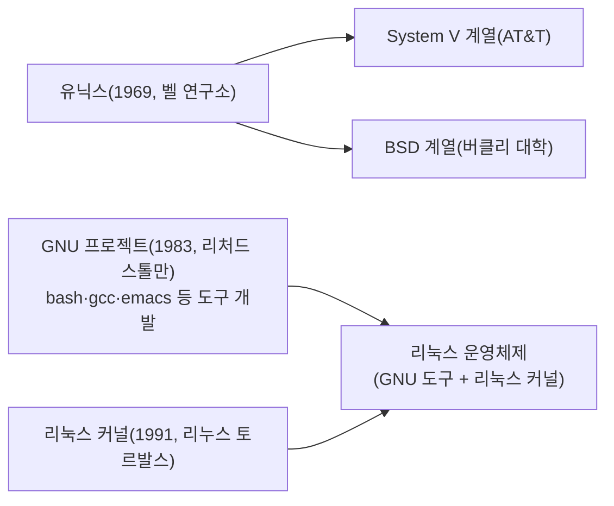

<Callout type="info">
  **이번 문서의 목표:** 리눅스가 어디서 왔고 무엇으로 이루어져 있는지 설명할 수 있고, GPL·LGPL·BSD·MIT 라이선스의 차이와 카피레프트 개념을 구분해 시험 문제를 풀 수 있다.
</Callout>

## 1. 왜 "리눅스"라는 이름을 알아야 하는가

지금 여러분 손에 있는 컴퓨터는 위도우(Windows)나 macOS를 쓰고 있을 가능성이 높습니다. 그런데 왜 굳이 "리눅스(Linux)"라는 낯선 운영체제(OS, Operating System — 컴퓨터의 하드웨어와 소프트웨어를 관리하며 사람과 기계 사이를 이어 주는 기본 프로그램)를 배워야 할까요?

이유는 간단합니다. 여러분이 매일 쓰는 인터넷 서비스 뒤편의 서버 대부분이 리눅스로 돌아가고, 스마트폰의 안드로이드(Android)도 리눅스 커널을 기반으로 만들어졌기 때문입니다. 리눅스마스터 2급 1차 시험은 이 리눅스라는 운영체제를 다루는 첫 관문이고, 이번 편은 그 관문의 첫 걸음 — "리눅스가 정확히 무엇인가"를 짚습니다.

> **쉽게 말하면:** 리눅스는 원래 있던 유닉스(UNIX)라는 운영체제의 정신을 이어받아, 한 사람이 처음부터 다시 만든 무료 운영체제의 핵심 부품(커널)입니다.

## 2. 유닉스에서 리눅스로 이어진 흐름

### 2.1 유닉스의 탄생 — 모든 것의 시작점

**유닉스**(UNIX)는 1969년 미국의 벨 연구소(Bell Labs)에서 켄 톰프슨(Ken Thompson)과 데니스 리치(Dennis Ritchie)가 만든 운영체제입니다. 당시 컴퓨터는 기종마다 완전히 다른 방식으로 프로그램을 짜야 했는데, 유닉스는 "여러 사람이 동시에 쓸 수 있고(다중 사용자, multi-user), 여러 작업을 동시에 처리할 수 있는(다중 작업, multi-tasking) 운영체제"라는 개념을 제시하며 큰 성공을 거뒀습니다.

유닉스가 중요한 이유는 그 설계 철학 때문입니다. "작은 프로그램 하나가 한 가지 일만 잘하게 만들고, 그 프로그램들을 파이프(pipe, 한 명령의 출력을 다른 명령의 입력으로 바로 연결하는 통로)로 연결해 복잡한 일을 해낸다"는 철학인데, 이 철학은 지금 여러분이 배울 리눅스 명령어 체계에도 그대로 남아 있습니다. (파이프는 20편에서 직접 다룹니다.)

유닉스는 처음엔 벨 연구소 안에서만 쓰였지만, 이후 여러 대학과 회사에 소스 코드(source code, 사람이 읽고 수정할 수 있는 원본 프로그램 문서)가 공유되면서 다양한 갈래로 갈라졌습니다. 이 시기에 나온 대표적인 두 흐름이 **AT&T 계열**(System V)과 **버클리 대학 계열**(BSD, Berkeley Software Distribution)입니다. BSD 진영에서 활동하던 빌 조이(Bill Joy)는 이 시기에 지금도 시험에 자주 나오는 vi 편집기(15편)와 csh 셸을 만들었습니다.

문제는 유닉스가 시간이 지나며 점점 "상용(유료) 소프트웨어"로 굳어졌다는 점입니다. 소스 코드를 마음대로 보거나 고칠 수 없게 되었고, 라이선스(license, 소프트웨어를 사용·수정·배포할 수 있는 권리와 조건을 정한 계약) 비용도 비쌌습니다.

### 2.2 GNU 프로젝트 — 자유로운 유닉스를 향한 시도

이런 상황에 반발해 1983년, 리처드 스톨만(Richard Stallman)이 **GNU 프로젝트**를 시작합니다. GNU는 "GNU's Not Unix"의 줄임말로, "유닉스와 호환되지만 완전히 자유로운(free) 소프트웨어로 이루어진 운영체제를 만들자"는 목표를 가진 프로젝트였습니다. 여기서 "자유(free)"는 "공짜"라는 뜻보다 "누구나 소스 코드를 보고, 고치고, 다시 배포할 수 있는 자유"라는 뜻에 가깝습니다.

GNU 프로젝트는 bash(Bourne-Again SHell, 리눅스의 기본 셸), gcc(GNU C 컴파일러), emacs(GNU 이맥스, 텍스트 에디터) 등 훌륭한 프로그램들을 여럿 만들어 냈습니다. 하지만 운영체제의 핵심 부품인 **커널**(kernel, 하드웨어를 직접 제어하고 메모리·프로세스·파일을 관리하는 운영체제의 심장부)만은 오랫동안 완성하지 못했습니다.

### 2.3 리눅스 커널의 등장

이 빈자리를 채운 사람이 핀란드의 대학생 **리누스 토르발스**(Linus Torvalds)입니다. 1991년, 그는 취미 삼아 만들던 커널을 인터넷 뉴스그룹에 공개하며 다른 사람들의 참여를 요청했습니다. 이 커널이 바로 **리눅스 커널**(Linux kernel)입니다.

여기서 시험에 자주 나오는 핵심을 짚고 갑니다. **"리눅스"라는 이름은 원래 커널 하나만을 가리키는 이름이었습니다.** 하지만 커널만으로는 컴퓨터를 쓸 수 없습니다. 파일을 복사하는 명령, 화면에 글자를 찍는 명령, 로그인을 처리하는 프로그램 같은 것들이 다 있어야 실제로 쓸 수 있는 운영체제가 됩니다. 마침 GNU 프로젝트가 만들어 둔 도구들이 이 빈틈에 딱 맞았고, 그래서 리눅스 커널과 GNU 도구들이 결합해 완전한 운영체제가 탄생했습니다. 그래서 정확한 명칭은 **GNU/Linux**라고 부르는 것이 옳다는 주장도 있지만, 실무에서는 그냥 "리눅스"라고 통칭합니다.



<Callout type="warning">
  **자주 틀리는 점 1 — 인물과 프로젝트를 뒤바꾸는 함정.** "리처드 스톨만이 리눅스 커널을 만들었다" 또는 "리누스 토르발스가 GNU 프로젝트를 시작했다"처럼 두 사람의 역할을 바꿔치기한 선택지가 매회 등장합니다. **스톨만 = GNU 프로젝트**(도구 모음), **토르발스 = 리눅스 커널**(핵심 부품)로 짝을 지어 외워야 헷갈리지 않습니다. 마찬가지로 vi와 csh는 스톨만이 아니라 **빌 조이**가 BSD 시절에 만든 프로그램이라는 점도 자주 섞여 나옵니다.
</Callout>

## 3. 커널과 배포판의 차이

여기가 2급 시험에서 개념 문제로 자주 나오는 지점입니다. "리눅스를 설치한다"고 할 때, 우리는 사실 커널 하나만 받는 게 아닙니다.

> **쉽게 말하면:** 커널이 자동차의 엔진이라면, 배포판은 그 엔진에 차체·바퀴·핸들·좌석까지 다 갖춰 바로 몰고 나갈 수 있게 만든 완성차입니다.

**커널**(kernel)은 하드웨어(CPU, 메모리, 디스크, 네트워크 장치 등)를 직접 제어하고, 여러 프로그램이 서로 방해하지 않고 자원을 나눠 쓰도록 관리하는 운영체제의 가장 안쪽 층입니다. 커널이 하는 대표적인 일은 다음과 같습니다.

- **프로세스 관리**: 어떤 프로그램에 CPU 시간을 얼마나 줄지 결정 (13, 14편에서 자세히 다룹니다)
- **메모리 관리**: 어떤 프로그램에 어느 메모리 영역을 배정할지 결정
- **파일시스템 관리**: 디스크에 저장된 파일을 찾고 읽고 쓰는 방법 관리 (09, 10편)
- **장치 드라이버**: 프린터·키보드·네트워크 카드 같은 주변장치와 통신하는 방법 관리

하지만 커널 하나만 컴퓨터에 넣어 두면 아무 것도 할 수 없습니다. 사용자가 명령을 입력할 셸(shell, 사용자의 명령을 받아 커널에 전달하는 프로그램, 06편에서 자세히 다룹니다)도 있어야 하고, 파일을 복사하는 `cp` 같은 기본 명령어들, 소프트웨어를 설치하는 패키지 관리 도구, 화면을 보여 주는 데스크톱 환경까지 있어야 실제로 쓸 수 있는 시스템이 됩니다.

**배포판**(distribution, 흔히 "디스트로(distro)"라고 줄여 부릅니다)은 이 리눅스 커널에 GNU 도구, 셸, 패키지 관리 도구, 각종 응용 프로그램을 한데 묶어 "설치하면 바로 쓸 수 있게" 배포하는 완성품입니다. 우분투(Ubuntu), 페도라(Fedora), 센트OS(CentOS) 같은 이름을 들어 보셨다면, 그게 다 배포판의 이름입니다. 배포판의 종류와 선택 기준은 03편에서 이어서 다룹니다.

| 구분 | 커널(Kernel) | 배포판(Distribution) |
|------|--------------|------------------------|
| 정체 | 운영체제의 핵심 부품 하나 | 커널 + 여러 도구를 묶은 완성품 |
| 만드는 주체 | 리눅스 커널 개발 커뮤니티(리누스 토르발스가 총괄) | 각 배포판 제작사·커뮤니티(레드햇, 캐노니컬 등) |
| 예시 | 리눅스 커널 버전 5.15, 6.1 등 | 우분투, 페도라, 데비안, 센트OS |
| 사용자가 직접 만지는 것 | 거의 없음(내부 동작) | 명령어, 화면, 패키지 관리자 등 전부 |

<Callout type="warning">
  **자주 틀리는 점 2 — "리눅스 = 배포판 하나의 이름"이라는 착각.** "우분투는 리눅스 커널의 한 종류다" 같은 설명이 오답 선택지로 자주 나옵니다. 정확히는 **우분투는 리눅스 커널을 담은 배포판**이고, 리눅스 커널 자체는 하나입니다(버전 차이는 있습니다). "커널은 하나, 배포판은 여럿"이라는 구조를 기억하세요.
</Callout>

## 4. 오픈소스 라이선스 — GPL·LGPL·BSD·MIT

리눅스와 그 위의 수많은 소프트웨어는 "오픈소스(open source, 소스 코드가 공개되어 있어 누구나 보고 고칠 수 있는 소프트웨어)" 방식으로 만들어집니다. 그런데 "공개되어 있다"는 것과 "마음대로 갖다 써도 된다"는 것은 다른 이야기입니다. 그 경계를 정하는 것이 **라이선스**(license)입니다.

### 4.1 왜 라이선스가 필요한가

소스 코드를 공짜로 공개했다고 해서 아무 조건도 없는 것은 아닙니다. 예를 들어 "이 코드를 가져다 상용 제품에 넣어 팔아도 되는가", "이 코드를 고쳤다면 고친 내용도 공개해야 하는가" 같은 질문에 답을 정해 두어야 분쟁이 생기지 않습니다. 오픈소스 라이선스는 바로 이런 규칙을 미리 문서로 정해 둔 것입니다.

### 4.2 카피레프트 — GPL의 핵심 개념

**카피레프트**(copyleft)는 "저작권(copyright)"이라는 단어를 살짝 비틀어 만든 말장난 같은 용어입니다. 저작권(copyright)이 "이 저작물을 함부로 복제하지 마라"는 권리라면, 카피레프트는 정반대로 **이 소프트웨어와 그것을 고쳐서 다시 배포하는 모든 파생물도 반드시 같은 조건으로 소스 코드를 공개해야 한다**는 규칙입니다.

> **쉽게 말하면:** 카피레프트는 "이 소스 코드는 자유롭게 쓰되, 고쳐서 배포할 거면 너도 소스를 공개해야 한다"는 전염성 있는 규칙입니다.

**GPL**(GNU General Public License, GNU 일반 공중 사용 허가서)은 이 카피레프트 개념을 대표하는 라이선스입니다. 리눅스 커널 자체가 GPL로 배포되고 있습니다. GPL의 핵심 조건은 이렇습니다.

- 소스 코드를 자유롭게 보고 실행하고 수정할 수 있다.
- 수정한 프로그램을 배포하려면, **수정한 버전의 소스 코드도 반드시 GPL로 공개해야 한다**.
- GPL 코드를 다른 프로그램과 결합해 하나의 실행 프로그램으로 만들어 배포하면, 그 결합된 전체도 GPL의 적용을 받는다(이 성질 때문에 카피레프트를 "전염성이 있다"고 표현하기도 합니다).

**LGPL**(GNU Lesser General Public License, GNU 약소 공중 사용 허가서)은 GPL의 조건을 조금 완화한 버전입니다. LGPL로 배포되는 라이브러리(library, 다른 프로그램이 가져다 쓰는 코드 묶음)를 가져다 쓰기만 하는 경우에는, 그 라이브러리를 사용하는 상위 프로그램까지 소스 코드를 공개할 필요는 없습니다. 다만 LGPL 라이브러리 자체를 고쳤다면 그 고친 부분은 공개해야 합니다. 그래서 상용 소프트웨어가 GPL 라이브러리는 부담스러워도 LGPL 라이브러리는 부담 없이 가져다 쓰는 경우가 많습니다. 대표적인 예가 리눅스 데스크톱 환경인 GNOME의 기반 라이브러리 **GTK+**로, LGPL 라이선스를 따릅니다.

### 4.3 허용적 라이선스 — BSD와 MIT

GPL·LGPL과 완전히 다른 성격의 라이선스가 **BSD 라이선스**와 **MIT 라이선스**입니다. 이 둘을 묶어 "**허용적(permissive) 라이선스**"라고 부릅니다.

허용적 라이선스의 핵심은 딱 하나입니다. **"원저작자를 표시하고 라이선스 문구만 남기면, 소스 코드를 공개하지 않고 상용 제품에 넣어 팔아도 상관없다."** 즉 카피레프트 조건이 아예 없습니다. 가져다 고쳐서 비공개 상용 소프트웨어로 만들어도 법적으로 문제가 없습니다.

- **BSD 라이선스**: 버클리 대학의 BSD 유닉스에서 유래한 라이선스로, 저작권 표시와 면책 조항(문제가 생겨도 원저작자는 책임지지 않는다는 조항)만 유지하면 자유롭게 재배포·수정·상용화할 수 있습니다.
- **MIT 라이선스**: 매사추세츠 공과대학(MIT)에서 만든 라이선스로, BSD와 사실상 같은 정신(저작권 표시만 남기면 자유 이용)을 담고 있지만 문구가 더 짧고 간결합니다. 현재 가장 널리 쓰이는 오픈소스 라이선스 중 하나입니다.

즉 GPL·LGPL이 "자유를 지키기 위해 다음 사람에게도 같은 자유를 강제하는" 방식이라면, BSD·MIT는 "일단 자유롭게 풀어 두고 그 다음은 가져간 사람 마음대로 하게 두는" 방식입니다. 이 방향의 차이가 시험에서 가장 자주 묻는 지점입니다.

| 라이선스 | 계열 | 소스 공개 의무 | 상용화·비공개 배포 | 대표 사례 |
|----------|------|------------------|------------------------|-----------|
| GPL | 카피레프트 | 수정본도 반드시 GPL로 공개 | 사실상 불가(공개 조건이 따라붙음) | 리눅스 커널, bash |
| LGPL | 완화된 카피레프트 | 라이브러리 자체 수정분만 공개 | 라이브러리를 그냥 가져다 쓰는 상위 프로그램은 비공개 가능 | GTK+ |
| BSD | 허용적 | 의무 없음(저작권 고지만 유지) | 자유롭게 가능 | BSD 계열 유닉스 코드 |
| MIT | 허용적 | 의무 없음(저작권 고지만 유지) | 자유롭게 가능 | 다수의 오픈소스 라이브러리 |

<Callout type="warning">
  **자주 틀리는 점 3 — GPL과 BSD/MIT를 정의만으로 헷갈리는 함정.** "오픈소스니까 다 비슷하다"고 생각하고 넘어가면, "소스 코드를 반드시 공개해야 하는 라이선스는?" 같은 문제에서 카피레프트 계열(GPL, LGPL)과 허용적 계열(BSD, MIT)을 구분하지 못해 틀립니다. **판별 기준은 "수정해서 재배포할 때 소스 공개 의무가 있는가"** 하나입니다. 의무가 있으면 GPL 쪽, 없으면 BSD·MIT 쪽입니다. 실제 기출에서도 GNOME의 기반 라이브러리 GTK+가 LGPL이라는 점, 데스크톱 환경 KDE는 GTK+가 아니라 Qt 기반이라는 점을 엮어 묻는 문제가 나온 적이 있으니, 라이선스 종류와 함께 "어떤 프로그램이 어떤 라이선스를 쓰는가"까지 짝을 지어 기억해야 합니다.
</Callout>

## 직접 해보기

<Callout type="info">
  00편에서 만든 Rocky Linux·Ubuntu 컨테이너에서 진행합니다. 아직 안 만들었다면 00편을 먼저 보세요.
</Callout>

"커널은 하나, 배포판은 여럿"이라는 말을 눈으로 확인합니다. `uname -r`은 지금 켜져 있는 리눅스의 **커널** 버전을, `cat /etc/os-release`는 그 위에 얹힌 **배포판** 정보를 보여 줍니다.

```bash
uname -r
cat /etc/os-release
```

Rocky 컨테이너에서 한 번, `docker exec -it ubuntu bash`로 들어간 Ubuntu 컨테이너에서 한 번 더 실행해 두 결과를 나란히 비교해 보세요.

**무엇을 보아야 하나**: `uname -r`의 커널 버전 형식(예: `5.15.x`)이 두 컨테이너에서 서로 어떤 관계인지, `os-release`의 `NAME`·`ID` 값이 두 컨테이너에서 어떻게 다른지 확인합니다.

> **왜 이걸 해보나:** "우분투는 리눅스 커널의 한 종류다" 같은 오답 선택지(자주 틀리는 점 2)는 커널과 배포판을 같은 층위로 착각할 때 나옵니다. `os-release`는 배포판마다 다른데 커널 명령은 계열과 무관하게 똑같이 동작한다는 것을 직접 보면 헷갈리지 않습니다.

## 핵심 정리

- **유닉스(1969)** → **GNU 프로젝트(1983, 스톨만, 도구 개발)** + **리눅스 커널(1991, 토르발스, 핵심 부품)** 이 결합해 리눅스 운영체제가 완성됐다
- **커널**은 하드웨어를 관리하는 핵심 부품 하나이고, **배포판**은 커널에 여러 도구를 묶어 설치 가능하게 만든 완성품이다 — 배포판은 여럿이지만 커널은 하나다
- **카피레프트**는 수정·재배포 시 소스 코드 공개를 강제하는 개념이며, **GPL**이 그 대표 라이선스다. **LGPL**은 라이브러리 사용만으로는 공개 의무가 없는 완화된 버전이다
- **BSD·MIT**는 허용적 라이선스로, 저작권 고지만 유지하면 비공개·상용화 배포가 자유롭다
- 판별 기준은 하나: **"수정해서 재배포할 때 소스 공개 의무가 있는가"** — 있으면 GPL·LGPL 계열, 없으면 BSD·MIT 계열

## 마무리 복습

<Quiz
  questionNumber={1}
  question="리눅스 커널을 최초로 만들어 공개한 사람은 누구인가?"
  options={['리처드 스톨만', '리누스 토르발스', '켄 톰프슨', '빌 조이']}
  correctAnswer={2}
  explanation="리눅스 커널은 1991년 핀란드의 대학생 리누스 토르발스가 만들어 공개했다. 리처드 스톨만은 GNU 프로젝트를 시작한 인물이고, 켄 톰프슨은 유닉스를 만든 인물이며, 빌 조이는 BSD 시절 vi와 csh를 만든 인물이다."
  optionExplanations={['GNU 프로젝트를 시작해 bash·gcc 등 도구를 만든 인물이라 오답이다', '1991년 리눅스 커널을 만들어 공개한 인물이 맞다', '1969년 유닉스를 만든 인물이라 오답이다', 'BSD 시절 vi 편집기와 csh 셸을 만든 인물이라 오답이다']}
/>

<Quiz
  questionNumber={2}
  question="커널과 배포판의 관계에 대한 설명으로 옳은 것은?"
  options={['배포판은 하나뿐이지만 커널은 여러 종류가 있다', '커널은 하드웨어를 관리하는 핵심 부품이고, 배포판은 커널과 여러 도구를 묶어 배포하는 완성품이다', '커널과 배포판은 같은 것을 부르는 다른 이름이다', '배포판을 설치하면 커널 없이도 컴퓨터를 쓸 수 있다']}
  correctAnswer={2}
  explanation="커널은 프로세스·메모리·파일시스템·장치를 관리하는 운영체제의 핵심 부품 하나이며, 배포판은 이 커널에 셸·패키지 관리자·응용 프로그램을 묶어 설치 가능한 형태로 배포한 완성품이다. 커널은 하나지만 배포판은 우분투·페도라·데비안 등 여럿이다."
  optionExplanations={['실제로는 정반대다. 커널은 사실상 하나이고 배포판이 여럿이다', '핵심 부품과 완성품의 관계를 정확히 설명한다', '완성품과 그 부품을 같은 것으로 혼동한 설명이라 틀렸다', '커널 없이는 배포판이 동작할 수 없으므로 틀렸다']}
/>

<Quiz
  questionNumber={3}
  question="'수정한 소프트웨어를 재배포할 때 그 수정본의 소스 코드도 반드시 같은 조건으로 공개해야 한다'는 성질을 가리키는 용어는?"
  options={['프리웨어(freeware)', '카피레프트(copyleft)', '셰어웨어(shareware)', '오픈소스(open source)']}
  correctAnswer={2}
  explanation="카피레프트는 저작권(copyright)을 비튼 용어로, 수정·재배포 시 같은 라이선스 조건으로 소스 코드 공개를 강제하는 개념이다. GPL이 이 개념을 대표하는 라이선스다."
  optionExplanations={['프리웨어는 무료로 쓸 수 있는 소프트웨어를 가리킬 뿐 소스 공개 의무와는 무관하다', '수정본의 소스 공개를 강제하는 개념이 카피레프트가 맞다', '셰어웨어는 일정 기간 무료 체험 후 결제를 유도하는 배포 방식이라 무관하다', '오픈소스는 소스가 공개되어 있다는 상위 개념일 뿐, 재배포 시 공개 의무를 강제하는지는 라이선스마다 다르다']}
/>

<Quiz
  questionNumber={4}
  question="다음 중 허용적(permissive) 라이선스로 분류되어, 수정 후 비공개 상용 제품으로 배포해도 문제가 없는 라이선스로만 짝지어진 것은?"
  options={['GPL, LGPL', 'BSD, MIT', 'GPL, MIT', 'LGPL, BSD']}
  correctAnswer={2}
  explanation="BSD와 MIT는 저작권 고지만 유지하면 소스 코드 공개 의무 없이 자유롭게 수정·상용화·재배포할 수 있는 허용적 라이선스다. GPL과 LGPL은 카피레프트 계열로 수정 시 소스 공개 의무가 남는다."
  optionExplanations={['GPL과 LGPL은 모두 카피레프트 계열로 소스 공개 의무가 있어 오답이다', 'BSD와 MIT가 저작권 고지만으로 자유 이용이 가능한 허용적 라이선스가 맞다', 'GPL은 카피레프트 계열이라 허용적 라이선스와 섞을 수 없어 오답이다', 'LGPL은 완화되었을 뿐 카피레프트 계열이라 허용적 라이선스로 분류되지 않아 오답이다']}
/>

<Quiz
  questionNumber={5}
  question="GNU 프로젝트에서 LGPL 라이선스를 따르는 GTK+ 라이브러리를 기반으로 만든 리눅스 데스크톱 환경은?"
  options={['KDE', 'GNOME', 'Xfce', 'Qt']}
  correctAnswer={2}
  explanation="GNOME은 GNU 프로젝트에서 LGPL 라이선스의 GTK+ 위젯 라이브러리를 기반으로 만든 데스크톱 환경이다. KDE는 GTK+가 아닌 Qt 라이브러리를 기반으로 한다."
  optionExplanations={['KDE는 데스크톱 환경이지만 GTK+가 아니라 Qt를 기반으로 하므로 오답이다', 'GTK+ 기반의 GNU 데스크톱 환경 GNOME이 정답이다', 'Xfce도 GTK+ 계열이지만 GNU 프로젝트를 대표하는 데스크톱 환경으로 가장 먼저 꼽히는 것은 GNOME이다', 'Qt는 데스크톱 환경이 아니라 KDE가 사용하는 위젯 라이브러리(툴킷)의 이름이라 오답이다']}
/>

<Quiz
  questionNumber={6}
  question="GPL과 LGPL의 차이에 대한 설명으로 옳은 것은?"
  options={['GPL은 소스 공개 의무가 없고 LGPL은 있다', 'LGPL 라이브러리를 그냥 가져다 쓰기만 하는 상위 프로그램은 소스를 공개하지 않아도 되지만, GPL 코드를 결합한 프로그램은 전체가 공개 의무를 진다', 'GPL과 LGPL은 완전히 동일한 조건의 라이선스다', 'LGPL은 상용 소프트웨어에 전혀 사용할 수 없다']}
  correctAnswer={2}
  explanation="LGPL은 GPL보다 완화된 카피레프트로, 라이브러리를 그냥 링크해 사용하는 상위 프로그램까지 공개를 강제하지 않는다. 반면 GPL 코드를 결합하면 결합된 전체 프로그램이 GPL의 적용을 받아 소스 공개 의무가 생긴다."
  optionExplanations={['정반대로 설명한 오답이다. GPL과 LGPL 모두 카피레프트 계열로 공개 의무가 있는 쪽이다', 'GPL과 LGPL의 결합 시 공개 범위 차이를 정확히 설명한다', '완화 정도가 다르므로 동일한 조건이라는 설명은 틀렸다', 'LGPL 라이브러리는 상용 소프트웨어가 소스 비공개로 가져다 쓸 수 있어 실제로 널리 쓰이므로 틀렸다']}
/>

## 참고 자료

- [GNU 라이선스 목록](https://www.gnu.org/licenses/license-list.html)
