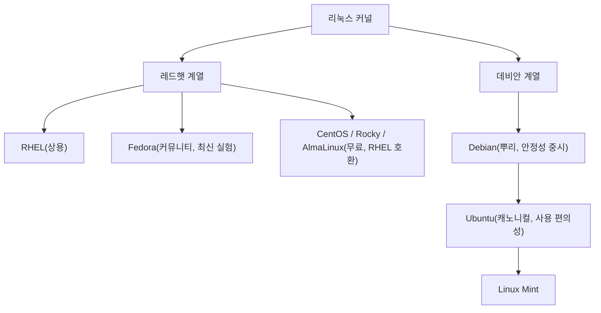

<Callout type="info">
  **이번 문서의 목표:** 리눅스 배포판이 왜 여러 갈래로 나뉘는지 설명하고, 레드햇 계열과 데비안 계열의 패키지 형식·명령어 차이를 구분하며, 용도에 맞는 배포판을 고를 수 있다.
</Callout>

## 1. 왜 배포판이 이렇게 많은가

02편에서 **배포판**(distribution)은 리눅스 커널에 셸·패키지 관리 도구·응용 프로그램을 묶어 설치 가능하게 만든 완성품이라고 했습니다. 그런데 리눅스 커널은 하나인데 왜 우분투(Ubuntu), 페도라(Fedora), 센트OS(CentOS), 데비안(Debian) 같은 이름이 이렇게나 많을까요?

이유는 커널은 무료로 누구나 가져다 쓸 수 있지만(02편의 GPL 라이선스 덕분입니다), 그 커널 위에 무엇을 얹고 어떻게 관리할지는 만드는 사람 마음이기 때문입니다. 어떤 회사는 안정성을 최우선으로 두고, 어떤 커뮤니티는 최신 기능을 빠르게 반영하는 데 집중합니다. 이런 목적의 차이가 서로 다른 배포판을 낳았습니다.

> **쉽게 말하면:** 배포판은 같은 리눅스 커널이라는 재료로 서로 다른 회사·커뮤니티가 각자의 방식으로 요리한 "완성 요리"입니다.

## 2. 레드햇 계열과 데비안 계열 — 두 개의 큰 갈래

수십 개의 배포판이 있지만, 시험에서 묻는 핵심은 대부분 두 계열로 정리됩니다. 배포판을 나누는 가장 중요한 기준은 **소프트웨어를 설치·관리하는 패키지 형식이 무엇인가**입니다.

### 2.1 레드햇 계열

**레드햇**(Red Hat)은 1993년 설립된 미국 회사로, 리눅스를 상업적으로 성공시킨 대표적인 기업입니다. 레드햇이 만든 패키지 형식과 관리 체계를 이어받은 배포판들을 통틀어 "레드햇 계열"이라 부릅니다.

- **RHEL**(Red Hat Enterprise Linux): 레드햇이 유료로 판매하는 기업용 배포판. 안정성과 장기 지원(보통 10년 단위)을 보장합니다.
- **CentOS**: RHEL의 소스 코드를 그대로 가져와 무료로 재배포한 배포판이었으나, 이후 정책이 바뀌어 지금은 RHEL의 다음 버전을 미리 테스트하는 "CentOS Stream"으로 성격이 바뀌었습니다. 기출 문제에는 여전히 옛 CentOS 환경(CentOS 7 등)이 자주 등장하니 알아 두어야 합니다.
- **Fedora**: 레드햇이 후원하는 커뮤니티 배포판으로, 최신 기술을 가장 먼저 실험적으로 반영합니다. 이후 검증된 기능이 RHEL로 옮겨가는 구조입니다.
- **Rocky Linux, AlmaLinux**: 옛 CentOS의 빈자리를 대신하기 위해 등장한, RHEL과 완전히 호환되는 무료 배포판입니다.

### 2.2 데비안 계열

**데비안**(Debian)은 1993년 이안 머독(Ian Murdock)이 시작한 비영리 커뮤니티 프로젝트로, 특정 회사가 아니라 전 세계 자원봉사자들이 함께 만듭니다.

- **Debian**: 계열의 뿌리가 되는 배포판. 안정성을 매우 중시해 새 기능 반영이 느린 대신 매우 신뢰할 수 있습니다.
- **Ubuntu**(우분투): 영국 회사 캐노니컬(Canonical)이 데비안을 기반으로 만든 배포판으로, 데스크톱과 서버 모두에서 가장 널리 쓰이는 배포판 중 하나입니다. 사용 편의성에 크게 신경 썼습니다.
- **Linux Mint**: 우분투를 다시 기반으로 삼아 만든 데스크톱 친화적 배포판입니다.



## 3. 패키지 형식과 배포판의 관계

여기가 이번 편의 핵심이자 시험에서 매회 등장하는 지점입니다. **패키지**(package)란 프로그램 실행 파일, 설정 파일, 그리고 그 프로그램이 동작하는 데 필요한 다른 프로그램 목록(의존성, dependency)을 하나로 묶은 설치 단위입니다. 리눅스는 윈도우처럼 설치 파일을 인터넷에서 아무 데서나 받는 대신, 신뢰할 수 있는 저장소(repository)에 등록된 패키지를 관리 도구로 설치하는 방식을 씁니다.

레드햇 계열과 데비안 계열은 이 패키지의 형식과 관리 도구가 서로 다릅니다.

### 3.1 레드햇 계열 — rpm

**rpm**(Red Hat Package Manager)은 레드햇 계열이 쓰는 패키지 파일 형식이자 그 파일을 다루는 명령어의 이름이기도 합니다. 확장자는 `.rpm`입니다.

`rpm` 명령은 로컬에 이미 받아 둔 패키지 파일을 설치·삭제·조회하는 "저수준(로컬)" 도구입니다. 저수준이라는 말은 "그 패키지가 필요로 하는 다른 패키지(의존성)를 자동으로 찾아 설치해 주지는 않는다"는 뜻입니다. 예를 들어 A라는 프로그램을 설치하려는데 B라는 프로그램이 먼저 깔려 있어야 한다면, `rpm` 명령은 "B가 없어서 설치할 수 없다"는 오류만 내고 B를 알아서 받아오지는 않습니다.

이 불편을 해결하기 위해 등장한 것이 **고수준(온라인) 도구**인 `yum`과 그 후속작 `dnf`입니다. `dnf`(Dandified YUM)는 인터넷 저장소에서 필요한 의존성 패키지까지 자동으로 찾아 함께 설치해 줍니다. 즉 실무에서는 `rpm`을 직접 쓰는 경우보다 `dnf install 패키지이름`처럼 고수준 도구를 쓰는 경우가 훨씬 많습니다.

`rpm` 명령에는 특정 패키지의 정보를 조회하는 다양한 옵션이 있는데, 시험에 자주 나오므로 방향을 명확히 구분해 기억해야 합니다.

| 옵션 | 의미 | 조회 방향 |
|------|------|-----------|
| `-qa` | 설치된 모든 패키지 목록 조회 | 전체 나열 |
| `-qi` | 패키지 정보(이름·버전·설명 등) 조회 | 패키지 → 정보 |
| `-ql` | 패키지가 설치한 파일 목록 조회 | 패키지 → 파일 |
| `-qf` | 특정 파일이 어느 패키지 소속인지 역으로 조회 | 파일 → 패키지 |

<Callout type="warning">
  **자주 틀리는 점 1 — `-ql`과 `-qf`의 방향을 뒤바꾸는 함정.** "`/bin/ls` 파일이 어느 패키지에 속하는지 알고 싶다"는 문제에서 `-ql`을 답으로 고르는 실수가 잦습니다. `-ql`은 "패키지 이름을 알 때 그 패키지가 설치한 파일 목록"을 보여 주는 옵션이고, 거꾸로 "파일 경로를 알 때 그 파일의 소속 패키지"를 찾는 옵션은 `-qf`(query file)입니다. **f는 파일(file)에서 출발한다**고 기억하면 헷갈리지 않습니다.
</Callout>

### 3.2 데비안 계열 — deb

**dpkg**(Debian Package)는 데비안 계열이 쓰는 패키지 관리 도구이며, 패키지 파일의 확장자는 `.deb`입니다. `dpkg`도 `rpm`과 마찬가지로 로컬 파일을 설치·삭제하는 저수준 도구이며, 의존성을 자동으로 해결해 주지 않습니다. `dpkg -i 패키지파일.deb`로 로컬 파일을 설치합니다.

이 의존성 문제를 자동으로 처리해 주는 고수준(온라인) 도구가 **apt**(Advanced Package Tool)이며, 흔히 `apt-get`이나 `apt` 명령으로 씁니다. `apt install 패키지이름`을 실행하면 저장소에서 해당 패키지는 물론 필요한 의존성 패키지까지 한꺼번에 내려받아 설치합니다.

| 구분 | 레드햇 계열 | 데비안 계열 |
|------|-------------|-------------|
| 패키지 파일 확장자 | `.rpm` | `.deb` |
| 저수준(로컬) 도구 | `rpm` | `dpkg` |
| 고수준(온라인) 도구 | `yum` / `dnf` | `apt-get` / `apt` |
| 의존성 자동 해결 | 저수준 도구는 불가, 고수준 도구는 가능 | 저수준 도구는 불가, 고수준 도구는 가능 |

<Callout type="warning">
  **자주 틀리는 점 2 — 계열이 다른 도구를 한데 묶는 함정.** "데비안 계열의 패키지 관리 도구 모음으로 알맞은 것은?"이라는 문제에서 `YaST`(SUSE 계열 도구), `zypper`(SUSE 계열 온라인 도구), `dnf`(레드햇 계열)가 오답 선택지로 섞여 나옵니다. 데비안 계열은 반드시 **dpkg + apt(apt-get)** 조합이어야 하고, SUSE 계열의 `zypper`·`YaST`나 레드햇 계열의 `dnf`·`yum`이 하나라도 섞이면 오답입니다. 소프트웨어 설치의 전체 흐름(소스 컴파일 포함)은 17편에서 더 깊이 다룹니다.
</Callout>

## 4. 용도별 배포판 선택 기준

배포판을 고를 때는 "어디에 쓸 것인가"를 먼저 정해야 합니다.

### 4.1 서버(server) 용도

서버는 한번 설치하면 오래 안정적으로 돌아가야 하는 컴퓨터입니다. 그래서 **잦은 업데이트보다 검증된 안정성**을 우선하는 배포판을 고릅니다. RHEL, CentOS Stream, Rocky Linux, AlmaLinux, 그리고 데비안 계열의 순수 Debian(안정 버전)이 대표적입니다. 기업 환경에서는 문제가 생겼을 때 제조사의 기술 지원을 받을 수 있는 RHEL 같은 상용 배포판을 선호하기도 합니다.

### 4.2 데스크톱(desktop) 용도

일반 사용자가 웹 브라우징, 문서 작업, 개발 등을 하는 컴퓨터입니다. 이 경우엔 **사용 편의성과 최신 하드웨어 지원**이 중요합니다. Ubuntu와 Linux Mint가 초보자에게 특히 많이 추천됩니다. 그래픽 설치 프로그램과 자동 하드웨어 인식이 잘 되어 있고, 커뮤니티 자료도 많아 문제 해결이 쉽습니다.

### 4.3 임베디드(embedded) 용도

임베디드란 세탁기, 공유기, IoT(Internet of Things, 사물인터넷) 기기처럼 특정 목적을 위해 만들어진 작은 컴퓨터에 들어가는 시스템을 말합니다. 이 경우엔 저장 공간과 메모리가 매우 작기 때문에 **가볍고 필요한 부분만 골라 담을 수 있는 배포판**이 필요합니다. 대표적으로 OpenWrt(공유기용), Yocto Project(맞춤형 임베디드 리눅스를 빌드하는 도구), Buildroot 등이 쓰입니다. 안드로이드도 리눅스 커널을 기반으로 하지만 GNU 도구 대신 자체 라이브러리를 쓰는, 임베디드 목적에 특화된 변형입니다.

| 용도 | 우선순위 | 대표 배포판 |
|------|----------|-------------|
| 서버 | 안정성, 장기 지원 | RHEL, CentOS Stream, Rocky Linux, Debian(안정 버전) |
| 데스크톱 | 사용 편의성, 최신 하드웨어 지원 | Ubuntu, Linux Mint |
| 임베디드 | 경량화, 최소 구성 | OpenWrt, Yocto Project, Buildroot |

<Callout type="warning">
  **자주 틀리는 점 3 — "인기 있는 배포판 = 모든 용도에 적합"이라는 착각.** Ubuntu가 데스크톱에서 인기가 많다고 해서 "서버에는 반드시 Ubuntu가 최적이다"라거나, 반대로 RHEL이 기업에서 많이 쓰인다고 "데스크톱 용도로도 가장 적합하다"고 단정하는 오답 선택지가 나올 수 있습니다. 시험에서는 **각 배포판의 설계 목적**(안정성 vs 편의성 vs 경량화)을 근거로 용도를 판단해야지, 인기도만으로 답을 고르면 안 됩니다.
</Callout>

## 직접 해보기

<Callout type="info">
  00편에서 만든 Rocky Linux·Ubuntu 컨테이너에서 진행합니다. 아직 안 만들었다면 00편을 먼저 보세요.
</Callout>

레드햇 계열과 데비안 계열이 서로 다른 패키지 도구를 쓴다는 것을, 도구가 아예 없다는 오류로 직접 확인합니다.

```bash
rpm -qa | head
apt
```

`rpm -qa | head`는 설치된 패키지 전체 목록 중 앞부분만(`head`) 보여 줍니다. 두 번째 줄은 **Rocky 컨테이너**에서 그대로 쳐 보세요. 그다음 `docker exec -it ubuntu bash`로 Ubuntu 컨테이너에 들어가 `dpkg -l | head`를 실행합니다.

**무엇을 보아야 하나**: Rocky에서 `apt`를 치면 어떤 메시지가 나오는지(명령 자체가 없다는 뜻인지), `rpm -qa`와 `dpkg -l`의 출력 형식이 서로 어떻게 다른지 확인합니다.

> **왜 이걸 해보나:** "자주 틀리는 점 2"처럼 계열이 다른 도구를 섞어 놓은 오답 선택지를 고르지 않으려면, 애초에 레드햇 계열 컨테이너에는 `apt`가 설치조차 안 되어 있다는 것을 몸으로 알아야 합니다.

## 핵심 정리

- 배포판은 크게 **레드햇 계열**(RHEL, Fedora, CentOS/Rocky/AlmaLinux)과 **데비안 계열**(Debian, Ubuntu, Linux Mint)로 나뉜다
- 레드햇 계열은 `.rpm` 패키지를 쓰며, 저수준 도구는 `rpm`, 고수준(의존성 자동 해결) 도구는 `yum`/`dnf`다
- 데비안 계열은 `.deb` 패키지를 쓰며, 저수준 도구는 `dpkg`, 고수준 도구는 `apt-get`/`apt`다
- `rpm -qf`는 파일에서 패키지를 역추적하고, `rpm -ql`은 패키지에서 파일 목록을 조회한다 — 방향이 반대다
- 배포판 선택은 서버(안정성), 데스크톱(편의성), 임베디드(경량화)라는 용도별 우선순위를 근거로 판단한다

## 마무리 복습

<Quiz
  questionNumber={1}
  question="다음 중 레드햇 계열 배포판으로만 짝지어진 것은?"
  options={['Ubuntu, Debian', 'Fedora, CentOS', 'Linux Mint, Ubuntu', 'Debian, Fedora']}
  correctAnswer={2}
  explanation="Fedora와 CentOS는 모두 레드햇이 후원하거나 뿌리를 둔 레드햇 계열 배포판이다. Ubuntu, Debian, Linux Mint는 모두 데비안 계열이다."
  optionExplanations={['Ubuntu와 Debian은 둘 다 데비안 계열이라 오답이다', 'Fedora와 CentOS 모두 레드햇 계열이 맞다', 'Linux Mint와 Ubuntu는 둘 다 데비안 계열이라 오답이다', 'Debian은 데비안 계열, Fedora는 레드햇 계열로 서로 다른 계열이 섞여 오답이다']}
/>

<Quiz
  questionNumber={2}
  question="데비안 계열 리눅스에서 사용되는 패키지 관리 도구 조합으로 가장 알맞은 것은?"
  options={['YaST, zypper', 'YaST, dpkg', 'dpkg, apt-get', 'dnf, zypper']}
  correctAnswer={3}
  explanation="데비안 계열은 저수준 도구 dpkg와 고수준 온라인 도구 apt-get(apt)을 사용한다. YaST와 zypper는 SUSE 계열 도구이고, dnf는 레드햇 계열 도구다."
  optionExplanations={['YaST와 zypper는 모두 SUSE 계열 도구라 오답이다', 'YaST는 SUSE 도구라 dpkg와 짝을 이룰 수 없어 오답이다', 'dpkg(저수준)와 apt-get(고수준)이 모두 데비안 계열 도구로 정답이다', 'dnf는 레드햇 계열, zypper는 SUSE 계열이라 데비안과 무관해 오답이다']}
/>

<Quiz
  questionNumber={3}
  question="rpm 명령으로 /usr/bin/zip 파일이 어느 패키지에 속하는지 역으로 조회하려 한다. 알맞은 옵션은?"
  options={['rpm -qi /usr/bin/zip', 'rpm -ql /usr/bin/zip', 'rpm -qa /usr/bin/zip', 'rpm -qf /usr/bin/zip']}
  correctAnswer={4}
  explanation="특정 파일이 어느 패키지에 속하는지 역으로 조회하는 옵션은 -qf(query file)다. -qi는 패키지 정보 조회, -ql은 패키지가 설치한 파일 목록 조회, -qa는 설치된 전체 패키지 목록 조회로 방향이 다르다."
  optionExplanations={['-qi는 패키지 이름을 알 때 그 패키지의 정보를 보여줄 뿐 파일로 역추적하지 않는다', '-ql은 패키지가 설치한 파일 목록을 보여줄 뿐 파일에서 패키지를 찾는 방향이 아니다', '-qa는 설치된 모든 패키지를 나열할 뿐 특정 파일과 무관하다', '-qf가 파일 경로로 소속 패키지를 역추적하는 옵션이 맞다']}
/>

<Quiz
  questionNumber={4}
  question="온라인 저장소에서 패키지와 그 의존성을 함께 자동으로 내려받아 설치하는 고수준 도구가 아닌 것은?"
  options={['dnf', 'apt-get', 'dpkg', 'zypper']}
  correctAnswer={3}
  explanation="dpkg는 로컬의 .deb 파일을 설치·제거하는 저수준(로컬) 도구로, 의존성을 자동으로 해결하지 않으며 저장소에서 내려받는 온라인 도구가 아니다. dnf, apt-get, zypper는 모두 온라인 저장소를 이용하는 고수준 도구다."
  optionExplanations={['dnf는 레드햇 계열의 온라인 패키지 관리 도구로 고수준 도구가 맞다', 'apt-get은 데비안 계열의 대표적인 온라인 고수준 도구다', 'dpkg는 로컬 .deb 파일 처리용 저수준 도구라 온라인 의존성 해결 기능이 없어 정답이다', 'zypper는 SUSE 계열의 온라인 패키지 관리 도구로 고수준 도구가 맞다']}
/>

<Quiz
  questionNumber={5}
  question="안정성과 장기 지원이 가장 중요한 회사 내부 서버용 배포판을 고를 때 우선적으로 고려할 특성으로 가장 알맞은 것은?"
  options={['최신 기능을 가장 먼저 반영하는가', '검증된 안정성과 장기간의 보안 업데이트가 제공되는가', '그래픽 설치 프로그램이 화려한가', '데스크톱 환경의 디자인이 세련되었는가']}
  correctAnswer={2}
  explanation="서버는 한번 구축하면 오래 안정적으로 운영되어야 하므로, 검증된 안정성과 장기 지원(보안 패치 등)을 최우선으로 고려해야 한다. RHEL, CentOS Stream, Rocky Linux, Debian 안정 버전 등이 이 기준에 맞는다."
  optionExplanations={['최신 기능을 가장 먼저 반영하는 것은 Fedora처럼 실험적 배포판의 특성이라 서버 선택 기준과 맞지 않는다', '안정성과 장기 지원이 서버 배포판 선택의 핵심 기준이 맞다', '그래픽 설치 프로그램의 화려함은 데스크톱 편의성과 관련될 뿐 서버 선택 기준이 아니다', '데스크톱 환경 디자인은 서버 운영과 직접적인 관련이 없다']}
/>

<Quiz
  questionNumber={6}
  question="레드햇 계열에서 의존성을 자동으로 해결하지 못하는 저수준 도구와, 그 문제를 해결하는 고수준 도구의 짝으로 알맞은 것은?"
  options={['dpkg — apt-get', 'rpm — dnf', 'rpm — apt-get', 'dpkg — dnf']}
  correctAnswer={2}
  explanation="레드햇 계열의 저수준 도구는 rpm이고, 이 도구가 해결하지 못하는 의존성 문제를 자동으로 처리해 주는 고수준 도구가 dnf(과거의 yum)다."
  optionExplanations={['dpkg와 apt-get은 모두 데비안 계열 도구로, 레드햇 계열 짝이 아니다', 'rpm(저수준)과 dnf(고수준)가 레드햇 계열의 정확한 짝이다', 'apt-get은 데비안 계열 도구라 레드햇 계열의 rpm과 짝을 이루지 않는다', 'dpkg는 데비안 계열 도구이고 dnf는 레드햇 계열 도구라 계열이 섞여 오답이다']}
/>

## 참고 자료

- [KAIT 리눅스마스터 자격안내](https://www.ihd.or.kr/introducesubject1.do)
