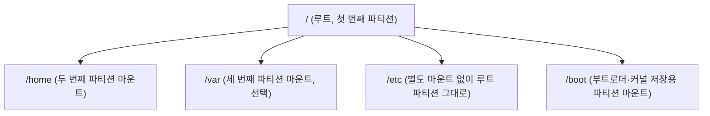

<Callout type="info">
  **이번 문서의 목표:** 리눅스 설치 절차의 큰 흐름을 말할 수 있고, 파티션이 왜 필요하며 마운트 포인트와 어떻게 연결되는지 설명할 수 있고, 스왑 영역과 GRUB 부트로더의 역할을 시험 문제로 풀 수 있다.
</Callout>

## 1. 설치 절차의 큰 흐름

03편에서 여러 배포판 중 목적에 맞는 것을 고르는 기준을 배웠습니다. 이제 그 배포판을 실제로 컴퓨터에 "설치"하는 과정을 개념 수준에서 짚어 봅니다. 2급 1차는 온라인 객관식 시험이므로 실제로 설치 프로그램의 화면을 클릭해 볼 일은 없지만, **설치 과정에서 어떤 결정을 내리게 되는지**, 그리고 그 결정이 왜 중요한지는 시험에서 개념 문제로 나옵니다.

> **쉽게 말하면:** 리눅스를 설치한다는 것은 "빈 디스크를 몇 개의 구역으로 나누고(파티션), 각 구역에 무엇을 담을지 정하고(파일시스템 생성과 마운트), 전원을 켰을 때 리눅스로 부팅되게 만드는(부트로더 설치)" 세 가지 결정을 내리는 과정입니다.

일반적인 리눅스 설치 과정은 다음과 같은 흐름으로 진행됩니다.

<Steps>

### 설치 매체 준비

배포판의 설치 이미지 파일(흔히 `.iso` 확장자)을 내려받아 USB 드라이브나 DVD 같은 설치 매체에 담습니다. 이 매체로 컴퓨터를 부팅하면 설치 프로그램이 시작됩니다.

### 언어·키보드·시간대 설정

가장 먼저 설치 과정에서 사용할 언어, 키보드 배열, 시간대(time zone)를 고릅니다. 큰 틀에는 영향을 주지 않는 기본 설정 단계입니다.

### 디스크 파티션 설계

설치할 디스크를 몇 개의 파티션으로 나눌지 결정합니다. 이 단계가 이번 편에서 가장 깊이 다룰 부분입니다. 자동으로 나눠 주는 옵션을 고를 수도 있고, 수동으로 직접 나눌 수도 있습니다.

### 패키지 선택

기본 설치에 포함할 소프트웨어 묶음을 고릅니다. 예를 들어 "서버용 최소 설치"를 고르면 그래픽 환경 없이 명령줄만 설치되고, "데스크톱 환경 포함 설치"를 고르면 GNOME이나 KDE 같은 그래픽 인터페이스까지 함께 설치됩니다.

### 네트워크·사용자 계정 설정

네트워크 인터페이스를 설정하고, 시스템을 관리할 root(최고 관리자) 계정의 비밀번호와 일반 사용자 계정을 만듭니다. (사용자와 그룹의 자세한 개념은 12편에서 다룹니다.)

### 부트로더 설치

디스크의 정해진 위치에 부트로더(GRUB)를 설치합니다. 이 단계가 빠지면 전원을 켰을 때 어떤 운영체제로 부팅할지 컴퓨터가 알 수 없습니다.

### 설치 완료와 재부팅

설정한 내용대로 실제 파일 복사와 시스템 구성이 끝나면 재부팅하고, 이후부터는 설치된 리눅스로 부팅됩니다.

</Steps>

## 2. 파티션과 마운트 포인트의 관계

### 2.1 왜 디스크를 하나로 안 쓰고 나누는가

컴퓨터에 디스크(하드디스크나 SSD)를 하나 꽂았다고 해서 그 공간 전체를 구분 없이 통째로 쓰지는 않습니다. **파티션**(partition)이란 물리적으로 하나인 디스크를 논리적으로 여러 구역으로 나눈 것을 말합니다. 윈도우에서 C 드라이브, D 드라이브를 나누는 것을 본 적이 있다면 비슷한 개념입니다.

리눅스에서 파티션을 나누는 이유는 여러 가지입니다.

- **문제 격리**: 로그 파일이 쌓이는 영역(`/var`)과 사용자 파일이 있는 영역(`/home`)을 분리해 두면, 한쪽 파티션이 꽉 차도 다른 쪽에는 영향이 적습니다.
- **운영체제 재설치의 용이성**: 사용자 데이터가 담긴 `/home`을 별도 파티션으로 분리해 두면, 운영체제만 다시 설치할 때 데이터를 지키기 쉽습니다.
- **성능과 관리**: 자주 쓰는 영역과 그렇지 않은 영역을 분리해 관리 효율을 높일 수 있습니다.

### 2.2 파티션을 어떻게 쓸 수 있게 만드는가 — 마운트

파티션을 나눴다고 바로 파일을 저장할 수 있는 것은 아닙니다. 파티션에는 먼저 **파일시스템**(filesystem, 파일을 어떤 형식으로 디스크에 기록하고 찾을지 정한 규칙 — 대표적으로 ext4, xfs가 있으며 자세한 내용은 09, 10편에서 다룹니다)을 "포맷"이라는 과정으로 새겨 넣어야 합니다.

파일시스템이 만들어진 파티션을 실제로 쓰려면, 그 파티션을 리눅스의 디렉터리 트리 어딘가에 "연결"해야 합니다. 이 연결 작업을 **마운트**(mount)라 하고, 연결되는 디렉터리 위치를 **마운트 포인트**(mount point)라고 부릅니다.

> **쉽게 말하면:** 파티션이 "새로 산 서랍"이라면, 마운트는 그 서랍을 기존 책상(디렉터리 트리)의 어느 칸에 끼워 넣을지 정하는 작업이고, 마운트 포인트는 그 서랍이 끼워지는 칸의 위치입니다.

리눅스의 모든 파일과 디렉터리는 **루트**(`/`)라는 단 하나의 뿌리에서 시작하는 트리 구조를 이룹니다(자세한 구조는 09편에서 다룹니다). 예를 들어 두 번째 파티션을 `/home`이라는 위치에 마운트하면, 그 뒤로 `/home` 아래에 저장되는 모든 파일은 실제로는 그 두 번째 파티션에 저장됩니다. 사용자 입장에서는 파티션이 여러 개로 나뉘어 있다는 사실이 전혀 드러나지 않고, 그저 하나로 이어진 디렉터리 트리처럼 보입니다.



설치 시점에 어느 파티션을 어느 마운트 포인트에 연결할지 정해 두면, 그 정보는 `/etc/fstab`이라는 설정 파일에 기록되어 이후 부팅할 때마다 자동으로 같은 위치에 마운트됩니다. `/etc/fstab`과 수동 마운트 명령(`mount`, `umount`)은 10편에서 실습 수준으로 자세히 다룹니다.

<Callout type="warning">
  **자주 틀리는 점 1 — `/etc/fstab`과 `/etc/mtab`을 혼동하는 함정.** "부팅 시 자동으로 마운트할 파티션 정보가 담긴 파일은?"이라는 질문에 `/etc/mtab`을 고르는 실수가 흔합니다. `/etc/fstab`은 "이렇게 마운트하라"는 **설정**(의도)을 담은 정적 파일이고, `/etc/mtab`이나 `/proc/mounts`는 "지금 실제로 무엇이 마운트되어 있는가"라는 **현재 상태**를 보여 주는 파일입니다. 시스템 설정을 바꾸는 파일과 현재 상태를 보여 주는 파일을 구분해야 합니다.
</Callout>

## 3. 스왑 영역의 역할

### 3.1 왜 필요한가

컴퓨터가 프로그램을 실행하려면 그 프로그램의 데이터를 **RAM**(Random Access Memory, 주기억장치 — 전원이 꺼지면 내용이 사라지지만 처리 속도가 매우 빠른 메모리)에 올려야 합니다. 그런데 실행 중인 프로그램이 많아지거나 하나의 프로그램이 메모리를 많이 요구하면, RAM이 부족해지는 상황이 생깁니다.

이때 리눅스 커널은 RAM에서 당장 쓰이지 않는 데이터를 디스크의 특별한 영역으로 잠시 밀어내고, 그 자리에 지금 필요한 데이터를 올립니다. 이렇게 RAM 대신 임시로 데이터를 보관하는 디스크 영역이 **스왑**(swap) 영역입니다.

> **쉽게 말하면:** 스왑은 책상(RAM)이 좁아 당장 안 쓰는 책들을 옆 서랍(디스크)에 잠시 치워 두는 공간입니다. 서랍에서 다시 꺼내 쓰려면 책상에서 바로 꺼내는 것보다 훨씬 느립니다.

### 3.2 스왑의 특징과 한계

디스크는 RAM보다 데이터를 읽고 쓰는 속도가 훨씬 느립니다. 그래서 스왑을 지나치게 자주 쓰게 되면(이런 상태를 "스와핑이 심하다"고 표현합니다) 시스템 전체가 눈에 띄게 느려집니다. 스왑은 어디까지나 "RAM이 부족할 때를 대비한 비상 공간"이지, RAM을 완전히 대체할 수는 없습니다.

스왑을 만드는 방법은 두 가지입니다.

- **스왑 파티션**: 디스크에 별도의 파티션을 만들어 통째로 스왑 용도로 씁니다. 설치 시점에 흔히 선택하는 전통적인 방식입니다.
- **스왑 파일**: 일반 파일시스템 안에 특정 크기의 파일을 하나 만들어 스왑처럼 쓰는 방식입니다. 설치 후에도 유연하게 만들거나 크기를 조정할 수 있어 최근에는 스왑 파일 방식도 널리 쓰입니다.

스왑 영역의 적정 크기는 시스템의 용도와 RAM 크기에 따라 다르며, "RAM의 몇 배" 같은 고정된 공식은 사실 상황에 따라 다르게 권장됩니다. 다만 리눅스마스터 시험에서는 "스왑이 무엇을 대신하는 공간인지", "RAM 부족 시 어떤 역할을 하는지" 같은 개념 수준의 이해를 주로 묻습니다.

<Callout type="warning">
  **자주 틀리는 점 2 — 스왑을 저장 공간 확장으로 착각하는 함정.** "스왑 영역을 늘리면 디스크 저장 공간이 늘어난다"거나 "스왑은 RAM을 완전히 대체해 성능에 영향이 없다"는 식의 설명은 틀렸습니다. 스왑은 **RAM이 부족할 때 그 부족분을 메우는 임시 대체재**일 뿐이며, 디스크 접근 속도의 한계 때문에 스왑을 많이 쓸수록 오히려 시스템 속도가 느려진다는 점이 핵심입니다.
</Callout>

## 4. 부트로더의 위치 — GRUB

### 4.1 부트로더가 하는 일

전원을 켠 컴퓨터는 처음엔 디스크에 무엇이 들었는지 전혀 모릅니다. 이 컴퓨터에게 "여기 리눅스 커널이 있고, 이렇게 실행하면 된다"고 알려 주는 첫 번째 프로그램이 **부트로더**(bootloader)입니다. 부팅 과정 전체의 흐름은 05편에서 순서도로 자세히 다루고, 이번 편에서는 부트로더가 디스크의 어느 위치에 자리 잡는지에 집중합니다.

현재 리눅스에서 가장 널리 쓰이는 부트로더는 **GRUB**(GRand Unified Bootloader)입니다. 지금 널리 쓰이는 버전은 GRUB2로, 이전 버전인 GRUB Legacy를 대체했습니다.

### 4.2 GRUB이 자리 잡는 위치

컴퓨터의 펌웨어(BIOS 또는 UEFI — 전원을 켰을 때 하드웨어를 초기화하고 부팅을 시작하는 가장 낮은 층의 프로그램)는 디스크의 정해진 위치에서 부트로더를 찾아 실행합니다.

- **BIOS(레거시) 방식**: 디스크의 맨 앞부분인 **MBR**(Master Boot Record, 디스크의 첫 512바이트)에 GRUB의 첫 단계 코드가 설치됩니다.
- **UEFI 방식**: 최신 컴퓨터에서는 **ESP**(EFI System Partition, EFI 시스템 파티션)라는 별도의 작은 파티션에 부트로더 파일이 설치됩니다.

두 경우 모두 GRUB의 세부 설정은 대개 `/boot` 디렉터리(별도 파티션으로 분리하는 경우가 많습니다) 아래에 저장됩니다.

### 4.3 GRUB2 설정을 바꾸는 올바른 절차

GRUB2를 쓰는 시스템에서 부팅 메뉴의 기본 선택 항목이나 대기 시간을 바꾸고 싶다면, 실제로 부팅에 쓰이는 파일인 `/boot/grub2/grub.cfg`(또는 배포판에 따라 `/boot/grub/grub.cfg`)를 직접 손으로 편집하는 것이 아니라, 다음과 같은 절차를 따라야 합니다.

<Steps>

### 1단계 — 설정 파일 편집

`/etc/default/grub` 파일에서 `GRUB_DEFAULT`(기본 부팅 항목), `GRUB_TIMEOUT`(대기 시간) 같은 값을 원하는 대로 고칩니다.

### 2단계 — 설정 재생성

`grub2-mkconfig`(데비안 계열은 `update-grub`) 명령을 실행해, 방금 고친 설정을 반영한 새 `grub.cfg` 파일을 자동으로 만들어 냅니다.

### 3단계 — 재부팅 확인

재부팅해 바뀐 메뉴가 반영되었는지 확인합니다.

</Steps>

<Callout type="warning">
  **자주 틀리는 점 3 — `grub.cfg`를 직접 손으로 고치는 함정.** "GRUB2 부팅 메뉴의 기본 항목을 바꾸는 가장 올바른 방법은?"이라는 문제에서 "`/boot/grub2/grub.cfg`를 직접 열어 수정한다"는 선택지가 그럴듯한 오답으로 자주 등장합니다. `grub.cfg`는 **자동으로 생성되는 파일**이라, 다음에 `grub2-mkconfig`가 다시 실행되면 직접 손으로 고친 내용이 덮어써져 사라집니다. 사람이 직접 편집해야 하는 파일은 `/etc/default/grub`이고, 그 뒤 반드시 `grub2-mkconfig`로 재생성하는 절차를 거쳐야 합니다. 마찬가지로 `/etc/grub.conf`나 `menu.lst`는 예전 GRUB Legacy 시절의 설정 파일이므로, GRUB2를 쓰는 최신 시스템 문제에서 이를 고르면 오답입니다.
</Callout>

## 직접 해보기(선택)

<Callout type="info">
  이 편은 읽는 것만으로 시험 대비가 됩니다. 아래는 실제로 해 보면 이해가 깊어지는 **선택 과정**이고, 컨테이너로는 안 되므로 00편의 가상 머신이 필요합니다.
</Callout>

디스크 하나를 통째로 쓰지 않고 왜 나누는지, 그리고 파티션을 나눈 것과 마운트가 별개의 작업이라는 것을 눈으로 확인해 봅니다. VirtualBox의 가상 머신 설정에서 하드디스크를 하나 더 추가한 뒤, Rocky Linux를 부팅해 다음을 입력합니다.

```bash
lsblk
fdisk /dev/sdb
```

- `lsblk`(1차): 새로 추가한 디스크가 `sdb`로 잡혔는지, 아직 그 밑에 파티션이 하나도 없는지 확인합니다.
- `fdisk /dev/sdb`: 대화형 화면이 뜹니다. `n`(새 파티션) → 기본값으로 몇 번 Enter → `w`(변경 사항을 디스크에 기록)까지 진행합니다.

```bash
lsblk
```

**무엇을 보아야 하나**: 두 번째 `lsblk`에서 `sdb` 아래에 `sdb1`이 새로 나타나는지 봅니다. 이 시점에는 파티션만 생겼을 뿐 `MOUNTPOINT` 열은 여전히 비어 있을 것입니다 — 파티션이 있다고 바로 쓸 수 있는 게 아니라는 뜻입니다.

> **왜 이걸 해보나:** 2.2절에서 "파티션 생성"과 "마운트"를 별개의 단계로 설명했는데, 글로만 읽으면 이 구분이 흐릿해지기 쉽습니다. `lsblk`의 `MOUNTPOINT` 열이 비어 있는 것을 직접 보면, 이후 10편에서 `mkfs`·`mount`가 왜 또 필요한 단계인지가 자연스럽게 이어집니다.

## 핵심 정리

- 설치 과정의 핵심 결정은 **파티션 설계 → 패키지 선택 → 부트로더 설치**로 요약된다
- **파티션**은 디스크를 논리적으로 나눈 구역이고, **마운트**는 그 파티션을 디렉터리 트리의 특정 위치(마운트 포인트)에 연결하는 작업이다. 부팅 시 자동 마운트 설정은 `/etc/fstab`에 저장된다
- **스왑**은 RAM이 부족할 때 디스크의 일부를 임시 메모리처럼 쓰는 공간이며, 디스크 속도의 한계 때문에 RAM을 완전히 대체하지는 못한다
- **GRUB**(GRUB2)은 BIOS에서는 MBR에, UEFI에서는 EFI 시스템 파티션(ESP)에 설치되는 부트로더다
- GRUB2 설정은 `/etc/default/grub`을 고친 뒤 `grub2-mkconfig`로 `grub.cfg`를 재생성하는 절차를 따라야 하며, `grub.cfg`를 직접 편집하면 다음 재생성 때 덮어써진다

## 마무리 복습

<Quiz
  questionNumber={1}
  question="파티션과 마운트 포인트의 관계에 대한 설명으로 옳은 것은?"
  options={['파티션을 나누면 자동으로 마운트 포인트가 정해진다', '마운트는 파티션을 디렉터리 트리의 특정 위치에 연결하는 작업이며, 그 위치가 마운트 포인트다', '마운트 포인트는 파티션과 무관하게 독립적으로 존재하는 디스크 영역이다', '하나의 파티션은 여러 개의 마운트 포인트에 동시에 연결되어야 한다']}
  correctAnswer={2}
  explanation="마운트는 파일시스템이 만들어진 파티션을 디렉터리 트리의 특정 위치에 연결하는 작업이며, 그 연결되는 위치를 마운트 포인트라고 부른다. 파티션 자체가 마운트 포인트를 자동으로 정하지는 않으며, 관리자가 어디에 연결할지 직접 정한다."
  optionExplanations={['파티션을 나누는 것과 마운트 포인트를 정하는 것은 별개의 작업이라 틀렸다', '연결 작업이 마운트이고 연결 위치가 마운트 포인트라는 설명이 정확하다', '마운트 포인트는 파티션이 연결되는 디렉터리 위치이므로 파티션과 무관할 수 없어 틀렸다', '하나의 파티션은 보통 하나의 마운트 포인트에 연결된다']}
/>

<Quiz
  questionNumber={2}
  question="현재 실제로 마운트되어 있는 파일시스템의 상태가 아니라, 부팅 시 자동으로 마운트할 파티션 정보를 담고 있는 설정 파일은?"
  options={['/etc/mtab', '/proc/mounts', '/etc/fstab', '/etc/partitions']}
  correctAnswer={3}
  explanation="/etc/fstab은 장치, 마운트 포인트, 파일시스템 유형, 옵션 등을 담아 부팅 시 자동으로 마운트할 파티션 정보를 기록한 설정 파일이다. /etc/mtab과 /proc/mounts는 현재 실제 마운트 상태를 보여줄 뿐 설정 파일이 아니다."
  optionExplanations={['/etc/mtab은 현재 마운트된 파일시스템의 실시간 상태를 담을 뿐 부팅 설정용이 아니다', '/proc/mounts도 현재 마운트 상태를 보여주는 가상 파일이라 부팅 설정과는 다르다', '/etc/fstab이 부팅 시 자동 마운트 대상을 정의하는 정적 설정 파일이 맞다', '/etc/partitions는 표준적으로 쓰이는 파일명이 아니다']}
/>

<Quiz
  questionNumber={3}
  question="스왑(swap) 영역에 대한 설명으로 옳은 것은?"
  options={['스왑은 RAM보다 빠른 속도로 데이터를 처리하는 보조 메모리다', 'RAM이 부족할 때 당장 쓰이지 않는 데이터를 디스크로 밀어내 저장하는 공간이다', '스왑 영역을 늘리면 디스크의 전체 저장 용량이 그만큼 늘어난다', '스왑은 RAM을 완전히 대체하므로 RAM 크기와 무관하게 성능이 동일하다']}
  correctAnswer={2}
  explanation="스왑은 RAM이 부족할 때 당장 필요하지 않은 데이터를 디스크의 스왑 영역으로 밀어내 임시로 저장하는 공간이다. 디스크는 RAM보다 느리기 때문에 스왑을 많이 쓸수록 시스템 속도가 느려진다."
  optionExplanations={['디스크 기반인 스왑은 RAM보다 훨씬 느리므로 틀렸다', 'RAM 부족 시 데이터를 디스크로 밀어내 임시 저장하는 공간이라는 설명이 정확하다', '스왑은 저장 공간이 아니라 임시 메모리 대체 용도이므로 저장 용량 확장과는 무관하다', '스왑을 많이 쓸수록 디스크 접근 속도의 한계로 오히려 성능이 떨어지므로 틀렸다']}
/>

<Quiz
  questionNumber={4}
  question="BIOS 방식 컴퓨터에서 GRUB 부트로더의 첫 단계 코드가 설치되는 위치는?"
  options={['/boot/grub2/grub.cfg 파일', 'MBR(디스크의 첫 512바이트)', 'EFI 시스템 파티션(ESP)', '/etc/default/grub 파일']}
  correctAnswer={2}
  explanation="BIOS(레거시) 방식에서는 디스크 맨 앞부분인 MBR에 GRUB의 첫 단계 코드가 설치된다. EFI 시스템 파티션은 UEFI 방식에서 부트로더 파일이 설치되는 위치다."
  optionExplanations={['grub.cfg는 GRUB의 세부 설정이 담긴 파일일 뿐, 펌웨어가 맨 처음 찾는 디스크 위치가 아니다', 'BIOS 방식에서는 디스크의 첫 512바이트인 MBR에 부트로더 코드가 설치되는 것이 맞다', 'EFI 시스템 파티션은 UEFI 방식에서 쓰이는 위치라 BIOS 방식과는 다르다', '/etc/default/grub은 GRUB2 설정을 사람이 편집하는 파일일 뿐 부트로더 코드가 설치되는 디스크 위치가 아니다']}
/>

<Quiz
  questionNumber={5}
  question="GRUB2를 사용하는 시스템에서 부팅 시 기본 선택되는 메뉴 항목을 변경하는 올바른 절차는?"
  options={['/boot/grub2/grub.cfg를 직접 손으로 수정한다', '/etc/default/grub의 GRUB_DEFAULT를 수정한 뒤 grub2-mkconfig로 grub.cfg를 재생성한다', '/etc/grub.conf의 default 값만 바꾸면 즉시 반영된다', 'menu.lst 파일의 항목 순서를 바꾼다']}
  correctAnswer={2}
  explanation="GRUB2에서는 사용자가 /etc/default/grub의 GRUB_DEFAULT 등을 편집하고 grub2-mkconfig(또는 update-grub)로 실제 부팅에 쓰이는 grub.cfg를 재생성하는 것이 표준 절차다."
  optionExplanations={['grub.cfg는 자동 생성 파일이므로 직접 수정해도 다음 재생성 시 덮어써져 오답이다', '/etc/default/grub 편집 후 grub2-mkconfig로 재생성하는 절차가 정확하다', '/etc/grub.conf와 default 값은 구버전 GRUB Legacy 방식이라 GRUB2와 맞지 않는다', 'menu.lst 역시 GRUB Legacy의 설정 파일이라 GRUB2 절차와 무관하다']}
/>

<Quiz
  questionNumber={6}
  question="리눅스 설치 과정에서 일어나는 일로 옳지 않은 것은?"
  options={['디스크를 파티션으로 나누고 각 파티션에 파일시스템을 생성한다', '설치할 소프트웨어 묶음(패키지)의 범위를 선택할 수 있다', '부트로더는 설치 마지막 단계와 무관하게 자동으로는 설치되지 않으므로 신경 쓰지 않아도 된다', 'root 계정의 비밀번호와 일반 사용자 계정을 설정한다']}
  correctAnswer={3}
  explanation="부트로더 설치는 설치 절차의 필수 단계로, 이 단계가 없으면 재부팅 후 어떤 운영체제로 부팅할지 컴퓨터가 알 수 없다. 대부분의 설치 프로그램은 이 단계를 자동으로 진행하지만 '신경 쓰지 않아도 된다'는 설명은 부트로더의 중요성을 무시한 틀린 설명이다."
  optionExplanations={['파티션 생성과 파일시스템 생성은 설치 과정의 핵심 단계로 옳은 설명이다', '서버용 최소 설치, 데스크톱 환경 포함 설치처럼 패키지 범위를 고르는 것은 실제 설치 과정에 포함된다', '부트로더 설치는 설치 절차의 필수 단계이며 빠지면 부팅 자체가 안 되므로 신경 쓰지 않아도 된다는 설명은 틀려 정답이다', 'root 계정과 일반 사용자 계정 설정은 설치 과정에 포함되는 실제 단계다']}
/>

## 참고 자료

- [The Linux Documentation Project](https://tldp.org)
