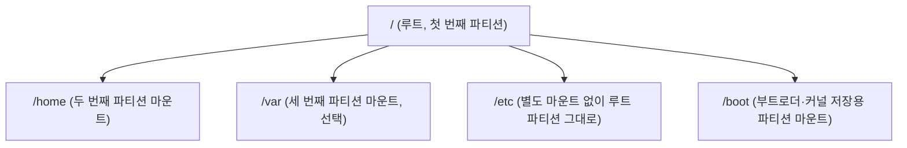

## 1. 설치 절차의 큰 흐름

02편에서 여러 배포판 중 목적에 맞는 것을 고르는 기준을 배웠습니다. 2급 1차는 온라인 객관식 시험이므로 실제로 설치 프로그램의 화면을 클릭해 볼 일은 없지만, **설치 과정에서 어떤 결정을 내리게 되는지**, 그리고 그 결정이 왜 중요한지는 시험에서 개념 문제로 나옵니다.

일반적인 리눅스 설치 과정은 다음과 같은 흐름으로 진행됩니다.

## 2. 파티션과 마운트 포인트의 관계

### 2.1 왜 디스크를 하나로 안 쓰고 나누는가

컴퓨터에 디스크(하드디스크나 SSD)를 하나 꽂았다고 해서 그 공간 전체를 구분 없이 통째로 쓰지는 않습니다. **파티션**(partition)이란 물리적으로 하나인 디스크를 논리적으로 여러 구역으로 나눈 것을 말합니다. 윈도우에서 C 드라이브, D 드라이브를 나누는 것을 본 적이 있다면 비슷한 개념입니다.

리눅스에서 파티션을 나누는 이유는 여러 가지입니다.

- **문제 격리**: 로그 파일이 쌓이는 영역(`/var`)과 사용자 파일이 있는 영역(`/home`)을 분리해 두면, 한쪽 파티션이 꽉 차도 다른 쪽에는 영향이 적습니다.
- **운영체제 재설치의 용이성**: 사용자 데이터가 담긴 `/home`을 별도 파티션으로 분리해 두면, 운영체제만 다시 설치할 때 데이터를 지키기 쉽습니다.
- **성능과 관리**: 자주 쓰는 영역과 그렇지 않은 영역을 분리해 관리 효율을 높일 수 있습니다.

### 2.2 파티션을 어떻게 쓸 수 있게 만드는가 — 마운트

파티션을 나눴다고 바로 파일을 저장할 수 있는 것은 아닙니다. 파티션에는 먼저 **파일시스템**(filesystem, 파일을 어떤 형식으로 디스크에 기록하고 찾을지 정한 규칙 — 대표적으로 ext4, xfs가 있으며 자세한 내용은 08, 09편에서 다룹니다)을 "포맷"이라는 과정으로 새겨 넣어야 합니다.

파일시스템이 만들어진 파티션을 실제로 쓰려면, 그 파티션을 리눅스의 디렉터리 트리 어딘가에 "연결"해야 합니다. 이 연결 작업을 **마운트**(mount)라 하고, 연결되는 디렉터리 위치를 **마운트 포인트**(mount point)라고 부릅니다.

리눅스의 모든 파일과 디렉터리는 **루트**(`/`)라는 단 하나의 뿌리에서 시작하는 트리 구조를 이룹니다(자세한 구조는 08편에서 다룹니다). 예를 들어 두 번째 파티션을 `/home`이라는 위치에 마운트하면, 그 뒤로 `/home` 아래에 저장되는 모든 파일은 실제로는 그 두 번째 파티션에 저장됩니다.

```mermaid
flowchart TD
    R["/ (루트, 첫 번째 파티션)"] --> HOME["/home (두 번째 파티션 마운트)"]
    R --> VAR["/var (세 번째 파티션 마운트, 선택)"]
    R --> ETC["/etc (별도 마운트 없이 루트 파티션 그대로)"]
    R --> BOOT["/boot (부트로더·커널 저장용 파티션 마운트)"]
```

설치 시점에 어느 파티션을 어느 마운트 포인트에 연결할지 정해 두면, 그 정보는 `/etc/fstab`이라는 설정 파일에 기록되어 이후 부팅할 때마다 자동으로 같은 위치에 마운트됩니다. `/etc/fstab`과 수동 마운트 명령(`mount`, `umount`)은 09편에서 예시 수준으로 자세히 다룹니다.

<Callout type="warning">
  **자주 틀리는 점 1 — `/etc/fstab`과 `/etc/mtab`을 혼동하는 함정.** "부팅 시 자동으로 마운트할 파티션 정보가 담긴 파일은?"이라는 질문에 `/etc/mtab`을 고르는 실수가 흔합니다. `/etc/fstab`은 "이렇게 마운트하라"는 **설정**(의도)을 담은 정적 파일이고, `/etc/mtab`이나 `/proc/mounts`는 "지금 실제로 무엇이 마운트되어 있는가"라는 **현재 상태**를 보여 주는 파일입니다. 시스템 설정을 바꾸는 파일과 현재 상태를 보여 주는 파일을 구분해야 합니다.
</Callout>

## 3. 스왑 영역의 역할

### 3.2 스왑의 특징과 한계

디스크는 RAM보다 데이터를 읽고 쓰는 속도가 훨씬 느립니다. 그래서 스왑을 지나치게 자주 쓰게 되면(이런 상태를 "스와핑이 심하다"고 표현합니다) 시스템 전체가 눈에 띄게 느려집니다. 스왑은 어디까지나 "RAM이 부족할 때를 대비한 비상 공간"이지, RAM을 완전히 대체할 수는 없습니다.

스왑을 만드는 방법은 두 가지입니다.

- **스왑 파티션**: 디스크에 별도의 파티션을 만들어 통째로 스왑 용도로 씁니다. 설치 시점에 흔히 선택하는 전통적인 방식입니다.
- **스왑 파일**: 일반 파일시스템 안에 특정 크기의 파일을 하나 만들어 스왑처럼 쓰는 방식입니다. 설치 후에도 유연하게 만들거나 크기를 조정할 수 있어 최근에는 스왑 파일 방식도 널리 쓰입니다.

스왑 영역의 적정 크기는 시스템의 용도와 RAM 크기에 따라 다르며, "RAM의 몇 배" 같은 고정된 공식은 사실 상황에 따라 다르게 권장됩니다. 다만 리눅스마스터 시험에서는 "스왑이 무엇을 대신하는 공간인지", "RAM 부족 시 어떤 역할을 하는지" 같은 개념 수준의 이해를 주로 묻습니다.

<Callout type="warning">
  **자주 틀리는 점 2 — 스왑을 저장 공간 확장으로 착각하는 함정.** "스왑 영역을 늘리면 디스크 저장 공간이 늘어난다"거나 "스왑은 RAM을 완전히 대체해 성능에 영향이 없다"는 식의 설명은 틀렸습니다. 스왑은 **RAM이 부족할 때 그 부족분을 메우는 임시 대체재**일 뿐이며, 디스크 접근 속도의 한계 때문에 스왑을 많이 쓸수록 오히려 시스템 속도가 느려진다는 점이 핵심입니다.
</Callout>

## 4. 부트로더의 위치 — GRUB

### 4.1 부트로더가 하는 일

전원을 켠 컴퓨터는 처음엔 디스크에 무엇이 들었는지 전혀 모릅니다. 이 컴퓨터에게 "여기 리눅스 커널이 있고, 이렇게 실행하면 된다"고 알려 주는 첫 번째 프로그램이 **부트로더**(bootloader)입니다.

현재 리눅스에서 가장 널리 쓰이는 부트로더는 **GRUB**(GRand Unified Bootloader)입니다. 지금 널리 쓰이는 버전은 GRUB2로, 이전 버전인 GRUB Legacy를 대체했습니다.

### 4.2 GRUB이 자리 잡는 위치

컴퓨터의 펌웨어(BIOS 또는 UEFI — 전원을 켰을 때 하드웨어를 초기화하고 부팅을 시작하는 가장 낮은 층의 프로그램)는 디스크의 정해진 위치에서 부트로더를 찾아 실행합니다.

- **BIOS(레거시) 방식**: 디스크의 맨 앞부분인 **MBR**(Master Boot Record, 디스크의 첫 512바이트)에 GRUB의 첫 단계 코드가 설치됩니다.
- **UEFI 방식**: 최신 컴퓨터에서는 **ESP**(EFI System Partition, EFI 시스템 파티션)라는 별도의 작은 파티션에 부트로더 파일이 설치됩니다.

두 경우 모두 GRUB의 세부 설정은 대개 `/boot` 디렉터리(별도 파티션으로 분리하는 경우가 많습니다) 아래에 저장됩니다.

### 4.3 GRUB2 설정을 바꾸는 올바른 절차

GRUB2를 쓰는 시스템에서 부팅 메뉴의 기본 선택 항목이나 대기 시간을 바꾸고 싶다면, 실제로 부팅에 쓰이는 파일인 `/boot/grub2/grub.cfg`(또는 배포판에 따라 `/boot/grub/grub.cfg`)를 직접 손으로 편집하는 것이 아니라, 다음과 같은 절차를 따라야 합니다.

<Callout type="warning">
  **자주 틀리는 점 3 — `grub.cfg`를 직접 손으로 고치는 함정.** "GRUB2 부팅 메뉴의 기본 항목을 바꾸는 가장 올바른 방법은?"이라는 문제에서 "`/boot/grub2/grub.cfg`를 직접 열어 수정한다"는 선택지가 그럴듯한 오답으로 자주 등장합니다. `grub.cfg`는 **자동으로 생성되는 파일**이라, 다음에 `grub2-mkconfig`가 다시 실행되면 직접 손으로 고친 내용이 덮어써져 사라집니다. 사람이 직접 편집해야 하는 파일은 `/etc/default/grub`이고, 그 뒤 반드시 `grub2-mkconfig`로 재생성하는 절차를 거쳐야 합니다. 마찬가지로 `/etc/grub.conf`나 `menu.lst`는 예전 GRUB Legacy 시절의 설정 파일이므로, GRUB2를 쓰는 최신 시스템 문제에서 이를 고르면 오답입니다.
</Callout>

## 핵심 정리

- 설치 과정의 핵심 결정은 **파티션 설계 → 패키지 선택 → 부트로더 설치**로 요약된다
- **파티션**은 디스크를 논리적으로 나눈 구역이고, **마운트**는 그 파티션을 디렉터리 트리의 특정 위치(마운트 포인트)에 연결하는 작업이다. 부팅 시 자동 마운트 설정은 `/etc/fstab`에 저장된다
- **스왑**은 RAM이 부족할 때 디스크의 일부를 임시 메모리처럼 쓰는 공간이며, 디스크 속도의 한계 때문에 RAM을 완전히 대체하지는 못한다
- **GRUB**(GRUB2)은 BIOS에서는 MBR에, UEFI에서는 EFI 시스템 파티션(ESP)에 설치되는 부트로더다
- GRUB2 설정은 `/etc/default/grub`을 고친 뒤 `grub2-mkconfig`로 `grub.cfg`를 재생성하는 절차를 따라야 하며, `grub.cfg`를 직접 편집하면 다음 재생성 때 덮어써진다

## 마무리 복습

<Quiz
  questionNumber={1}
  question={"파티션과 마운트 포인트의 관계에 대한 설명으로 옳은 것은?"}
  options={["파티션을 나누면 자동으로 마운트 포인트가 정해진다","마운트는 파티션을 디렉터리 트리의 특정 위치에 연결하는 작업이며, 그 위치가 마운트 포인트다","마운트 포인트는 파티션과 무관하게 독립적으로 존재하는 디스크 영역이다","하나의 파티션은 여러 개의 마운트 포인트에 동시에 연결되어야 한다"]}
  correctAnswer={2}
  explanation={"마운트는 파일시스템이 만들어진 파티션을 디렉터리 트리의 특정 위치에 연결하는 작업이며, 그 연결되는 위치를 마운트 포인트라고 부른다. 파티션 자체가 마운트 포인트를 자동으로 정하지는 않으며, 관리자가 어디에 연결할지 직접 정한다."}
/>

<Quiz
  questionNumber={2}
  question={"현재 실제로 마운트되어 있는 파일시스템의 상태가 아니라, 부팅 시 자동으로 마운트할 파티션 정보를 담고 있는 설정 파일은?"}
  options={["/etc/mtab","/proc/mounts","/etc/fstab","/etc/partitions"]}
  correctAnswer={3}
  explanation={"/etc/fstab은 장치, 마운트 포인트, 파일시스템 유형, 옵션 등을 담아 부팅 시 자동으로 마운트할 파티션 정보를 기록한 설정 파일이다. /etc/mtab과 /proc/mounts는 현재 실제 마운트 상태를 보여줄 뿐 설정 파일이 아니다."}
/>

<Quiz
  questionNumber={3}
  question={"스왑(swap) 영역에 대한 설명으로 옳은 것은?"}
  options={["스왑은 RAM보다 빠른 속도로 데이터를 처리하는 보조 메모리다","RAM이 부족할 때 당장 쓰이지 않는 데이터를 디스크로 밀어내 저장하는 공간이다","스왑 영역을 늘리면 디스크의 전체 저장 용량이 그만큼 늘어난다","스왑은 RAM을 완전히 대체하므로 RAM 크기와 무관하게 성능이 동일하다"]}
  correctAnswer={2}
  explanation={"스왑은 RAM이 부족할 때 당장 필요하지 않은 데이터를 디스크의 스왑 영역으로 밀어내 임시로 저장하는 공간이다. 디스크는 RAM보다 느리기 때문에 스왑을 많이 쓸수록 시스템 속도가 느려진다."}
/>

## 참고 자료

- [The Linux Documentation Project](https://tldp.org)
