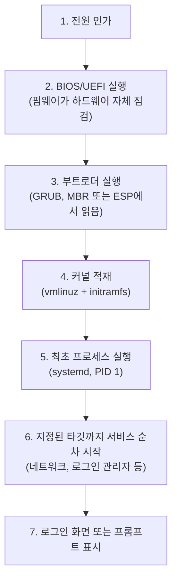

<Callout type="info">
  **이번 문서의 목표:** 전원을 켠 순간부터 로그인 화면이 뜨기까지 어떤 일이 순서대로 일어나는지 설명할 수 있고, 런레벨과 systemd 타깃의 대응표를 외워 시험 문제를 풀 수 있으며, 종료·재부팅 명령을 상황에 맞게 구분해 쓸 수 있다.
</Callout>

## 1. 왜 부팅 과정을 알아야 하는가

04편에서 부트로더 GRUB이 디스크의 어느 위치에 설치되는지 배웠습니다. 이제 그 부트로더가 실제로 무엇을 하는지, 그리고 그 뒤로 로그인 화면이 뜨기까지 어떤 프로그램들이 순서대로 실행되는지를 살펴봅니다.

이 흐름을 알아야 하는 실질적인 이유가 있습니다. 리눅스 서버를 운영하다 보면 "부팅이 안 된다", "특정 서비스가 자동으로 안 뜬다" 같은 문제를 마주치는데, 이때 문제가 부팅의 어느 단계에서 생겼는지 짚을 수 있어야 원인을 좁혀 갈 수 있습니다. 2급 1차 시험에서는 이 순서 자체를 묻는 문제와, 뒤에 나올 런레벨·systemd 타깃 대응 문제가 반복해서 출제됩니다.

> **쉽게 말하면:** 부팅은 "전원 → 하드웨어 점검 → 부트로더 → 커널 → 최초 프로세스 → 로그인 화면"이라는 정해진 순서로 진행되는 계주 경기입니다.

## 2. 전원부터 로그인까지 — 부팅 단계

### 2.1 전체 흐름



### 2.2 각 단계 자세히 보기

**1단계 — 전원 인가와 자체 점검(POST)**: 전원 버튼을 누르면 컴퓨터의 펌웨어인 **BIOS**(Basic Input Output System) 또는 그 후속 규격인 **UEFI**(Unified Extensible Firmware Interface)가 가장 먼저 동작합니다. 이 펌웨어는 POST(Power-On Self Test, 전원을 켰을 때 CPU·메모리·기본 장치가 정상인지 확인하는 자체 점검)를 수행합니다. 이 시점에는 아직 리눅스도, 어떤 운영체제도 실행되지 않은 상태입니다.

**2단계 — 부트로더 실행**: POST가 끝나면 펌웨어는 04편에서 배운 위치(BIOS 방식이면 MBR, UEFI 방식이면 EFI 시스템 파티션)에서 부트로더를 찾아 실행합니다. 부트로더인 GRUB은 설정된 메뉴를 보여 주고(또는 자동으로 기본 항목을 선택하고), 사용자가 고른 커널을 디스크에서 읽어 메모리에 올릴 준비를 합니다.

**3단계 — 커널 적재**: GRUB은 리눅스 커널 이미지 파일(흔히 `vmlinuz`로 시작하는 이름)과, 커널이 초기 구동에 필요로 하는 임시 파일시스템인 **initramfs**(initial RAM filesystem, 실제 디스크의 파일시스템 드라이버를 읽어 들이기 전 최소한의 환경을 제공하는 임시 메모리 파일시스템)를 함께 메모리에 올립니다. 이후 제어권이 커널로 넘어가면서, 커널이 하드웨어를 직접 인식하고 실제 루트 파일시스템(`/`)을 마운트합니다.

**4단계 — 최초 프로세스 실행**: 커널이 초기화를 마치면, 커널은 사용자 공간(user space, 커널이 아닌 일반 프로그램들이 실행되는 영역)에서 실행될 **최초의 프로세스**를 하나 띄웁니다. 이 프로세스의 **PID**(Process ID, 실행 중인 각 프로세스에 부여되는 고유 번호)는 항상 **1**입니다. 옛날 리눅스에서는 이 최초 프로세스가 `init`이었지만, 지금 대부분의 배포판(CentOS 7 이후, 최신 Ubuntu 등)은 **systemd**를 최초 프로세스로 씁니다.

**5, 6단계 — 타깃까지 서비스 순차 시작**: PID 1번인 systemd는 이후 필요한 데몬(daemon, 백그라운드에서 계속 실행되며 서비스를 제공하는 프로세스 — 13편에서 자세히 다룹니다)들을 **fork**(부모 프로세스를 복제해 자식 프로세스를 만드는 방식, 14편에서 다시 다룹니다) 방식으로 자신의 자식 프로세스로 하나씩 띄웁니다. 네트워크 서비스, 로그인 관리자 등이 이 단계에서 순서대로 올라옵니다. 어디까지 서비스를 띄우고 멈출지는 시스템에 설정된 **타깃**(target, 아래에서 자세히 다룹니다)이 정합니다.

**7단계 — 로그인 화면 표시**: 텍스트 모드라면 콘솔에 로그인 프롬프트가, 그래픽 모드라면 디스플레이 매니저가 그래픽 로그인 화면을 띄우며 부팅이 마무리됩니다.

<Callout type="warning">
  **자주 틀리는 점 1 — 최초 프로세스의 PID와 생성 방식을 혼동하는 함정.** "커널이 최초로 생성하는 프로세스의 이름과 PID"를 묻는 문제에서 **PID는 0번**이라는 오답 선택지가 자주 나옵니다. PID 0번은 스케줄러 같은 커널 내부용으로 예약된 번호이고, **사용자 공간의 최초 프로세스(systemd 또는 init)는 반드시 PID 1번**입니다. 또한 이후 서비스들이 PID 1의 자식으로 생성되는 방식은 **fork**이지 exec가 아닙니다. exec는 이미 존재하는 프로세스의 내용을 새 프로그램으로 통째로 바꿔치기하는 방식이라 "새 자식 프로세스를 만드는" 상황과는 다릅니다.
</Callout>

## 3. 런레벨과 systemd 타깃의 대응

### 3.1 런레벨이라는 옛 개념

옛 리눅스(System V 계열 init 방식)에서는 시스템이 "지금 어떤 상태로 동작해야 하는가"를 **런레벨**(runlevel)이라는 0에서 6까지의 숫자로 표현했습니다. 예를 들어 런레벨 3이면 "텍스트 모드로 다중 사용자가 쓸 수 있는 상태", 런레벨 5면 "그래픽 로그인까지 가능한 상태"를 뜻했습니다.

지금은 systemd가 이 역할을 대신하면서, 숫자 대신 의미를 알 수 있는 이름을 가진 **타깃**(target)이라는 단위를 씁니다. 예를 들어 런레벨 5에 대응하는 타깃은 `graphical.target`입니다. 그런데 시험에는 옛 런레벨 번호와 새 타깃 이름을 짝지어 묻는 문제가 매우 자주 나오므로, 이 대응 관계를 정확히 외워야 합니다.

### 3.2 런레벨 ↔ systemd 타깃 대응표

| 런레벨 | 의미 | systemd 타깃 |
|--------|------|----------------|
| 0 | 시스템 종료 | `poweroff.target` |
| 1 | 단일 사용자 모드(복구용, 최소 권한 관리 작업) | `rescue.target` |
| 2 | 다중 사용자, 텍스트 모드(NFS 네트워크 파일 공유 없이) | `multi-user.target`(2–4 모두 동일 타깃으로 취급) |
| 3 | 다중 사용자, 텍스트 모드(네트워크 포함, 서버에서 흔히 씀) | `multi-user.target` |
| 4 | 사용하지 않음(예약, 배포판마다 자유롭게 정의 가능) | `multi-user.target`(관례상) |
| 5 | 다중 사용자, 그래픽 모드(데스크톱 환경에서 흔히 씀) | `graphical.target` |
| 6 | 재부팅 | `reboot.target` |

<Callout type="warning">
  **자주 틀리는 점 2 — 0·1·6을 서로 바꿔치기하는 함정.** "런레벨 6 ↔ rescue.target"처럼, **재부팅(6)과 단일 사용자 복구 모드(1)를 뒤바꾸는 오답**이 실제 기출에서 반복해 등장했습니다. 숫자만 따로 외우지 말고 **0은 꺼짐, 1은 혼자 고치는 모드, 6은 다시 켜짐**을 뜻한다는 것을 영어 단어(순서대로 power-off, rescue, reboot)와 함께 짝지어 기억하면 헷갈리지 않습니다. 3과 5는 각각 텍스트(multi-user)와 그래픽(graphical)이라는 뜻 자체가 이름에 그대로 드러나 있으니 헷갈릴 일이 적지만, 0·1·6은 이름만 봐서는 뜻이 바로 안 떠오르기 때문에 특히 주의해야 합니다.
</Callout>

### 3.3 현재 타깃 확인하고 바꾸기

systemd 시스템에서는 다음 명령으로 기본 부팅 모드를 확인하고 바꿀 수 있습니다.

```bash
# 현재 기본 타깃(런레벨에 해당) 확인
systemctl get-default

# 기본 타깃을 그래픽 모드로 변경
systemctl set-default graphical.target
```

`get-default`는 "지금 무엇으로 설정되어 있는지 확인"하는 명령이고, `set-default`는 "설정 자체를 바꾸는" 명령입니다. 두 명령의 이름이 비슷해 시험에서 자리를 바꿔 놓는 함정이 나옵니다. 동사 부분(get은 조회, set은 변경)에 주목하면 구분하기 쉽습니다.

## 4. 종료와 재부팅 명령의 차이

### 4.1 왜 명령이 여러 개인가

시스템을 끄거나 다시 켜는 상황에도 몇 가지 명령이 있고, 이들은 **동작 방식**과 **여러 사용자에게 미리 알리는지 여부**에서 차이가 있습니다. 여러 사람이 동시에 접속해 쓰는 서버에서 예고 없이 전원을 내려 버리면 작업 중이던 데이터가 손상될 수 있으므로, 이 차이를 아는 것이 실무에서도 중요합니다.

| 명령 | 동작 | 특징 |
|------|------|------|
| `shutdown -h now` | 즉시 시스템 종료 | 접속한 다른 사용자에게 안내 메시지를 보낼 수 있고, 시간을 예약할 수도 있다(예: `shutdown -h +10`은 10분 뒤 종료) |
| `shutdown -r now` | 즉시 재부팅 | `-h`(halt, 종료) 대신 `-r`(reboot, 재부팅) 옵션만 다르고 사용법은 같다 |
| `halt` | 시스템 정지 | 전원을 직접 끄지 않고 CPU 동작만 멈추는 경우도 있어, 최근에는 대개 `poweroff`와 같은 동작으로 처리된다 |
| `poweroff` | 시스템 종료 후 전원 차단 | 실제로 전원까지 끄는 것을 보장하는 명령 |
| `reboot` | 즉시 재부팅 | `shutdown -r now`와 사실상 같은 결과 |
| `init 0` / `systemctl poweroff` | 런레벨 0(종료) 타깃으로 전환 | 런레벨 개념을 이용해 종료를 지시하는 방식 |
| `init 6` / `systemctl reboot` | 런레벨 6(재부팅) 타깃으로 전환 | 런레벨 개념을 이용해 재부팅을 지시하는 방식 |

### 4.2 정상 종료가 중요한 이유

리눅스는 디스크에 쓰기 작업을 할 때 성능을 위해 일단 메모리(캐시)에 먼저 기록해 두고, 나중에 한꺼번에 디스크에 실제로 반영하는 방식을 씁니다. 이 방식 때문에 전원을 그냥 뽑아 버리면, 아직 디스크에 반영되지 않은 데이터가 통째로 사라지거나 파일시스템 자체가 손상될 수 있습니다. `shutdown`, `halt`, `poweroff`, `reboot` 같은 명령은 이 마지막 반영 작업(동기화, sync)과 실행 중인 프로세스들의 정상 종료 절차를 거친 뒤 전원을 내리므로, 강제로 전원을 끄는 것보다 훨씬 안전합니다.

<Callout type="warning">
  **자주 틀리는 점 3 — halt와 poweroff를 완전히 같은 것으로 착각하는 함정.** 두 명령은 결과가 비슷해 보이지만, 전통적으로 **halt는 "CPU를 멈추는 것"에 가깝고, poweroff는 "전원 자체를 끄는 것"까지 보장**한다는 차이가 있었습니다. 요즘 배포판에서는 이 둘이 사실상 같은 동작을 하도록 통합된 경우가 많지만, 시험에서는 두 명령의 전통적인 개념 차이(정지 vs 전원 차단)를 구분해 묻는 문제가 나올 수 있습니다. 또한 `shutdown -h`와 `shutdown -r`처럼 **옵션 하나 차이로 종료와 재부팅이 갈리는 점**도 자주 헷갈리는 부분이니, `h`는 halt(종료), `r`은 reboot(재부팅)라고 알파벳 첫 글자로 기억해 두세요.
</Callout>

## 직접 해보기

<Callout type="info">
  **이 실습은 일반 `rocky` 컨테이너로는 안 됩니다.** 일반 컨테이너는 부팅 과정 없이 셸 하나만 바로 띄우기 때문에 systemd 자체가 켜져 있지 않아 `systemctl`이 실패합니다. 00편에서 만든 **`rocky-init` 컨테이너**(`-ubi-init` 태그, `--privileged`로 실행)로 들어가야 합니다. 아직 안 만들었다면 00편 6장을 먼저 보세요.
</Callout>

`rocky-init` 컨테이너 안에서 지금 기본 타깃이 무엇인지, 어떤 타깃들이 존재하는지, 지금 런레벨이 몇인지 차례로 확인합니다.

```bash
docker exec -it rocky-init bash
systemctl get-default
systemctl list-units --type=target | head
runlevel
```

**무엇을 보아야 하나**: `get-default`가 출력하는 타깃 이름이 3.2 대응표의 몇 번 런레벨과 짝인지, `list-units` 목록에 `multi-user.target`·`graphical.target` 같은 이름이 실제로 보이는지, `runlevel`이 출력하는 두 숫자(이전 런레벨, 현재 런레벨) 중 뒤 숫자가 대응표와 맞는지 눈으로 확인합니다.

> **왜 이걸 해보나:** 런레벨 숫자와 타깃 이름을 뒤바꾸는 문제(자주 틀리는 점 2)가 반복 출제됩니다. 표로 외운 대응 관계를 실제 명령 출력으로 한 번 보면 헷갈릴 여지가 줄어듭니다.

일반 `rocky` 컨테이너에서는 왜 안 되는지도 직접 오류로 확인해 봅니다.

```bash
docker exec -it rocky bash
systemctl get-default
```

**무엇을 보아야 하나**: "Failed to connect to bus" 같은 오류 메시지가 뜨는지 확인합니다. 이 오류가 바로 "일반 컨테이너는 부팅 과정을 거치지 않아 systemd(PID 1)가 아예 떠 있지 않다"는 사실을 증명합니다.

> **왜 이걸 해보나:** "`systemctl`은 아무 리눅스 환경에서나 된다"는 막연한 생각을 실제 오류로 깨는 것이 목적입니다. 시험에서도 systemd가 최초 프로세스로 반드시 실행되어 있어야 타깃 전환이 가능하다는 점이 함정으로 나옵니다.

## 핵심 정리

- 부팅은 **전원 → BIOS/UEFI(POST) → 부트로더(GRUB) → 커널 적재 → 최초 프로세스(PID 1, systemd) → 타깃까지 서비스 순차 시작 → 로그인 화면**의 순서로 진행된다
- 사용자 공간의 최초 프로세스는 반드시 **PID 1**이며, 이후 서비스는 **fork** 방식으로 그 자식 프로세스로 생성된다(PID 0이나 exec와 혼동하지 말 것)
- 런레벨과 systemd 타깃의 대응은 **0=poweroff, 1=rescue, 3=multi-user(텍스트), 5=graphical(그래픽), 6=reboot**이다
- `systemctl get-default`는 조회, `systemctl set-default 타깃`은 변경 명령이다
- 종료·재부팅 명령은 `shutdown -h`(종료)/`shutdown -r`(재부팅), `halt`/`poweroff`, `reboot`처럼 짝을 이루며, 강제 전원 차단 대신 정상 종료 절차를 거쳐야 데이터 손상을 막을 수 있다

## 마무리 복습

<Quiz
  questionNumber={1}
  question="CentOS 7 이후 리눅스에서 부팅 시 커널이 최초로 생성하는 프로세스와 그 PID로 알맞은 것은?"
  options={['init, PID 0', 'init, PID 1', 'systemd, PID 0', 'systemd, PID 1']}
  correctAnswer={4}
  explanation="CentOS 7 이후의 최신 리눅스에서는 커널이 최초로 생성하는 프로세스가 systemd이며, 사용자 공간의 최초 프로세스는 항상 PID 1을 부여받는다. PID 0은 커널 내부의 스케줄러 등에 예약된 번호다."
  optionExplanations={['init은 옛 System V 방식의 최초 프로세스 이름이라 최신 배포판 설명과 맞지 않고, PID도 0이 아니라 1이다', 'init이라는 이름은 옛 방식이라 최신 배포판(CentOS 7 이후)의 설명과 맞지 않는다', 'systemd는 맞지만 PID는 0이 아니라 1이다. PID 0은 커널 내부용으로 예약된 번호다', 'systemd이고 PID 1이라는 설명이 모두 정확하다']}
/>

<Quiz
  questionNumber={2}
  question="systemd 프로세스가 부팅 중 다른 서비스를 자식 프로세스로 새로 생성할 때 사용하는 방식은?"
  options={['exec', 'fork', 'kill', 'wait']}
  correctAnswer={2}
  explanation="새로운 자식 프로세스를 만들 때는 부모 프로세스를 복제하는 fork 방식을 쓴다. exec는 이미 존재하는 프로세스의 이미지를 새 프로그램으로 교체하는 방식이라 새 자식을 만드는 것과는 다르다."
  optionExplanations={['exec는 현재 프로세스 이미지를 새 프로그램으로 교체할 뿐 자식 프로세스를 새로 만들지 않는다', '부모를 복제해 자식 프로세스를 만드는 fork가 정답이다', 'kill은 프로세스에 시그널을 보내 종료 등을 요청하는 명령으로 생성과 무관하다', 'wait는 부모가 자식의 종료를 기다리는 동작으로 생성과 무관하다']}
/>

<Quiz
  questionNumber={3}
  question="SysV 런레벨과 systemd 타깃의 대응 관계로 옳지 않은 것은?"
  options={['런레벨 3 ↔ multi-user.target', '런레벨 5 ↔ graphical.target', '런레벨 0 ↔ poweroff.target', '런레벨 6 ↔ rescue.target']}
  correctAnswer={4}
  explanation="런레벨 6은 재부팅을 뜻하며 systemd의 reboot.target에 대응한다. rescue.target은 단일 사용자 복구 모드인 런레벨 1에 대응하는 타깃이다."
  optionExplanations={['런레벨 3(텍스트 다중 사용자)은 multi-user.target에 대응해 옳은 설명이다', '런레벨 5(그래픽)는 graphical.target에 대응해 옳은 설명이다', '런레벨 0(종료)은 poweroff.target에 대응해 옳은 설명이다', '런레벨 6은 재부팅이므로 reboot.target에 대응해야 하며, rescue.target은 런레벨 1(단일 사용자 복구)의 대응 타깃이라 틀렸다']}
/>

<Quiz
  questionNumber={4}
  question="현재 시스템의 기본 부팅 타깃을 그래픽 모드로 변경하는 올바른 명령은?"
  options={['systemctl get-default graphical.target', 'systemctl set-default graphical.target', 'systemctl status graphical.target', 'systemctl isolate get-default']}
  correctAnswer={2}
  explanation="기본 타깃을 변경하는 명령은 systemctl set-default 타깃이름이다. get-default는 조회 전용 명령이라 타깃 이름을 인자로 받지 않으며, 변경 용도로 쓸 수 없다."
  optionExplanations={['get-default는 현재 설정을 조회하는 명령이라 타깃 이름을 받아 변경하는 용도로 쓸 수 없다', 'set-default 타깃이름이 기본 타깃을 변경하는 정확한 명령이다', 'status는 서비스나 타깃의 현재 상태를 보여줄 뿐 기본값을 변경하지 않는다', 'isolate는 즉시 해당 타깃으로 전환하는 명령이며 get-default를 인자로 쓰는 것은 올바른 문법이 아니다']}
/>

<Quiz
  questionNumber={5}
  question="여러 사용자가 접속한 서버에서 10분 뒤 시스템을 종료하도록 예약하는 명령으로 알맞은 것은?"
  options={['shutdown -r +10', 'shutdown -h +10', 'reboot +10', 'halt -t 10']}
  correctAnswer={2}
  explanation="shutdown -h +10은 10분 뒤 시스템을 종료(halt)하도록 예약하는 명령이다. -h는 halt(종료)를, -r은 reboot(재부팅)를 뜻하므로 종료를 원한다면 -h를 써야 한다."
  optionExplanations={['-r 옵션은 종료가 아니라 재부팅을 뜻하므로 종료 예약이라는 질문과 맞지 않는다', '-h(halt, 종료)와 +10(10분 뒤 예약)의 조합이 정답이다', 'reboot 명령 자체는 시간 예약 문법을 지원하지 않으며 재부팅 전용 명령이다', 'halt -t 10은 shutdown 명령의 시간 예약 문법과 다르며 표준적인 예약 방법이 아니다']}
/>

<Quiz
  questionNumber={6}
  question="정상적인 종료 명령 대신 전원을 강제로 뽑아 껐을 때 발생할 수 있는 문제로 가장 알맞은 것은?"
  options={['다음 부팅 속도가 오히려 빨라진다', '캐시에만 기록되고 디스크에 아직 반영되지 않은 데이터가 사라지거나 파일시스템이 손상될 수 있다', 'CPU 온도가 비정상적으로 상승한다', '스왑 영역의 크기가 자동으로 줄어든다']}
  correctAnswer={2}
  explanation="리눅스는 성능을 위해 쓰기 작업을 먼저 메모리 캐시에 기록했다가 나중에 디스크에 반영한다. 정상 종료 절차 없이 전원을 강제로 끄면 아직 디스크에 반영되지 않은 데이터가 사라지거나 파일시스템이 손상될 수 있다."
  optionExplanations={['강제 종료와 부팅 속도는 직접적인 인과 관계가 없으며, 오히려 파일시스템 점검(fsck)으로 다음 부팅이 느려질 수 있다', '캐시에만 있던 데이터의 유실과 파일시스템 손상 위험이 강제 종료의 실제 문제다', 'CPU 온도는 종료 방식과 직접적인 관련이 없다', '스왑 영역 크기는 강제 종료와 무관하게 고정되어 있다']}
/>

## 참고 자료

- [KAIT 리눅스마스터 자격안내](https://www.ihd.or.kr/introducesubject1.do)
- [The Linux Documentation Project](https://tldp.org)
