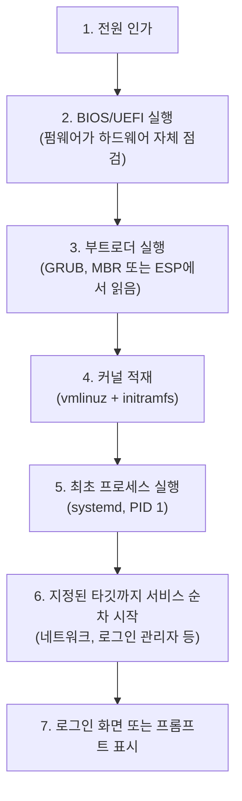

## 1. 왜 부팅 과정을 알아야 하는가

03편에서 부트로더 GRUB이 디스크의 어느 위치에 설치되는지 배웠습니다. 이제 그 부트로더가 실제로 무엇을 하는지, 그리고 그 뒤로 로그인 화면이 뜨기까지 어떤 프로그램들이 순서대로 실행되는지를 살펴봅니다.

이 흐름을 알아야 하는 실질적인 이유가 있습니다. 2급 1차 시험에서는 이 순서 자체를 묻는 문제와, 뒤에 나올 런레벨·systemd 타깃 대응 문제가 반복해서 출제됩니다.

## 2. 전원부터 로그인까지 — 부팅 단계

### 2.1 전체 흐름


```mermaid
flowchart TD
    A["1. 전원 인가"] --> B["2. BIOS/UEFI 실행<br/>(펌웨어가 하드웨어 자체 점검)"]
    B --> C["3. 부트로더 실행<br/>(GRUB, MBR 또는 ESP에서 읽음)"]
    C --> D["4. 커널 적재<br/>(vmlinuz + initramfs)"]
    D --> E["5. 최초 프로세스 실행<br/>(systemd, PID 1)"]
    E --> F["6. 지정된 타깃까지 서비스 순차 시작<br/>(네트워크, 로그인 관리자 등)"]
    F --> G["7. 로그인 화면 또는 프롬프트 표시"]
```

### 2.2 각 단계 자세히 보기

**1단계 — 전원 인가와 자체 점검(POST)**: 전원 버튼을 누르면 컴퓨터의 펌웨어인 **BIOS**(Basic Input Output System) 또는 그 후속 규격인 **UEFI**(Unified Extensible Firmware Interface)가 가장 먼저 동작합니다. 이 펌웨어는 POST(Power-On Self Test, 전원을 켰을 때 CPU·메모리·기본 장치가 정상인지 확인하는 자체 점검)를 수행합니다.

**2단계 — 부트로더 실행**: POST가 끝나면 펌웨어는 03편에서 배운 위치(BIOS 방식이면 MBR, UEFI 방식이면 EFI 시스템 파티션)에서 부트로더를 찾아 실행합니다. 부트로더인 GRUB은 설정된 메뉴를 보여 주고(또는 자동으로 기본 항목을 선택하고), 사용자가 고른 커널을 디스크에서 읽어 메모리에 올릴 준비를 합니다.

**3단계 — 커널 적재**: GRUB은 리눅스 커널 이미지 파일(흔히 `vmlinuz`로 시작하는 이름)과, 커널이 초기 구동에 필요로 하는 임시 파일시스템인 **initramfs**(initial RAM filesystem, 실제 디스크의 파일시스템 드라이버를 읽어 들이기 전 최소한의 환경을 제공하는 임시 메모리 파일시스템)를 함께 메모리에 올립니다. 이후 제어권이 커널로 넘어가면서, 커널이 하드웨어를 직접 인식하고 실제 루트 파일시스템(`/`)을 마운트합니다.

**4단계 — 최초 프로세스 실행**: 커널이 초기화를 마치면, 커널은 사용자 공간(user space, 커널이 아닌 일반 프로그램들이 실행되는 영역)에서 실행될 **최초의 프로세스**를 하나 띄웁니다. 이 프로세스의 **PID**(Process ID, 실행 중인 각 프로세스에 부여되는 고유 번호)는 항상 **1**입니다.

**5, 6단계 — 타깃까지 서비스 순차 시작**: PID 1번인 systemd는 이후 필요한 데몬(daemon, 백그라운드에서 계속 실행되며 서비스를 제공하는 프로세스 — 12편에서 자세히 다룹니다)들을 **fork**(부모 프로세스를 복제해 자식 프로세스를 만드는 방식, 13편에서 다시 다룹니다) 방식으로 자신의 자식 프로세스로 하나씩 띄웁니다. 어디까지 서비스를 띄우고 멈출지는 시스템에 설정된 **타깃**(target, 아래에서 자세히 다룹니다)이 정합니다.

**7단계 — 로그인 화면 표시**: 텍스트 모드라면 콘솔에 로그인 프롬프트가, 그래픽 모드라면 디스플레이 매니저가 그래픽 로그인 화면을 띄우며 부팅이 마무리됩니다.

<Callout type="warning">
  **자주 틀리는 점 1 — 최초 프로세스의 PID와 생성 방식을 혼동하는 함정.** "커널이 최초로 생성하는 프로세스의 이름과 PID"를 묻는 문제에서 **PID는 0번**이라는 오답 선택지가 자주 나옵니다. PID 0번은 스케줄러 같은 커널 내부용으로 예약된 번호이고, **사용자 공간의 최초 프로세스(systemd 또는 init)는 반드시 PID 1번**입니다. 또한 이후 서비스들이 PID 1의 자식으로 생성되는 방식은 **fork**이지 exec가 아닙니다. exec는 이미 존재하는 프로세스의 내용을 새 프로그램으로 통째로 바꿔치기하는 방식이라 "새 자식 프로세스를 만드는" 상황과는 다릅니다.
</Callout>

## 3. 런레벨과 systemd 타깃의 대응

### 3.1 런레벨이라는 옛 개념

옛 리눅스(System V 계열 init 방식)에서는 시스템이 "지금 어떤 상태로 동작해야 하는가"를 **런레벨**(runlevel)이라는 0에서 6까지의 숫자로 표현했습니다. 예를 들어 런레벨 3이면 "텍스트 모드로 다중 사용자가 쓸 수 있는 상태", 런레벨 5면 "그래픽 로그인까지 가능한 상태"를 뜻했습니다.

지금은 systemd가 이 역할을 대신하면서, 숫자 대신 의미를 알 수 있는 이름을 가진 **타깃**(target)이라는 단위를 씁니다. 예를 들어 런레벨 5에 대응하는 타깃은 `graphical.target`입니다.

### 3.2 런레벨 ↔ systemd 타깃 대응표

| 런레벨 | 의미 | systemd 타깃 |
|--------|------|----------------|
| 0 | 시스템 종료 | `poweroff.target` |
| 1 | 단일 사용자 모드(복구용, 최소 권한 관리 작업) | `rescue.target` |
| 2 | 다중 사용자, 텍스트 모드(NFS 네트워크 파일 공유 없이) | `multi-user.target`(2–4 모두 동일 타깃으로 취급) |
| 3 | 다중 사용자, 텍스트 모드(네트워크 포함, 서버에서 흔히 씀) | `multi-user.target` |
| 4 | 사용하지 않음(예약, 배포판마다 자유롭게 정의 가능) | `multi-user.target`(관례상) |
| 5 | 다중 사용자, 그래픽 모드(데스크톱 환경에서 흔히 씀) | `graphical.target` |
| 6 | 재부팅 | `reboot.target` |

<Callout type="warning">
  **자주 틀리는 점 2 — 0·1·6을 서로 바꿔치기하는 함정.** "런레벨 6 ↔ rescue.target"처럼, **재부팅(6)과 단일 사용자 복구 모드(1)를 뒤바꾸는 오답**이 실제 기출에서 반복해 등장했습니다. 숫자만 따로 외우지 말고 **0은 꺼짐, 1은 혼자 고치는 모드, 6은 다시 켜짐**을 뜻한다는 것을 영어 단어(순서대로 power-off, rescue, reboot)와 함께 짝지어 기억하면 헷갈리지 않습니다. 3과 5는 각각 텍스트(multi-user)와 그래픽(graphical)이라는 뜻 자체가 이름에 그대로 드러나 있으니 헷갈릴 일이 적지만, 0·1·6은 이름만 봐서는 뜻이 바로 안 떠오르기 때문에 특히 주의해야 합니다.
</Callout>

### 3.3 현재 타깃 확인하고 바꾸기

systemd 시스템에서는 다음 명령으로 기본 부팅 모드를 확인하고 바꿀 수 있습니다.

```bash
# 현재 기본 타깃(런레벨에 해당) 확인
systemctl get-default

# 기본 타깃을 그래픽 모드로 변경
systemctl set-default graphical.target
```

`get-default`는 "지금 무엇으로 설정되어 있는지 확인"하는 명령이고, `set-default`는 "설정 자체를 바꾸는" 명령입니다. 두 명령의 이름이 비슷해 시험에서 자리를 바꿔 놓는 함정이 나옵니다. 동사 부분(get은 조회, set은 변경)에 주목하면 구분하기 쉽습니다.

## 4. 종료와 재부팅 명령의 차이

### 4.1 왜 명령이 여러 개인가

시스템을 끄거나 다시 켜는 상황에도 몇 가지 명령이 있고, 이들은 **동작 방식**과 **여러 사용자에게 미리 알리는지 여부**에서 차이가 있습니다. 여러 사람이 동시에 접속해 쓰는 서버에서 예고 없이 전원을 내려 버리면 작업 중이던 데이터가 손상될 수 있으므로, 이 차이를 아는 것이 실무에서도 중요합니다.

| 명령 | 동작 | 특징 |
|------|------|------|
| `shutdown -h now` | 즉시 시스템 종료 | 접속한 다른 사용자에게 안내 메시지를 보낼 수 있고, 시간을 예약할 수도 있다(예: `shutdown -h +10`은 10분 뒤 종료) |
| `shutdown -r now` | 즉시 재부팅 | `-h`(halt, 종료) 대신 `-r`(reboot, 재부팅) 옵션만 다르고 사용법은 같다 |
| `halt` | 시스템 정지 | 전원을 직접 끄지 않고 CPU 동작만 멈추는 경우도 있어, 최근에는 대개 `poweroff`와 같은 동작으로 처리된다 |
| `poweroff` | 시스템 종료 후 전원 차단 | 실제로 전원까지 끄는 것을 보장하는 명령 |
| `reboot` | 즉시 재부팅 | `shutdown -r now`와 사실상 같은 결과 |
| `init 0` / `systemctl poweroff` | 런레벨 0(종료) 타깃으로 전환 | 런레벨 개념을 이용해 종료를 지시하는 방식 |
| `init 6` / `systemctl reboot` | 런레벨 6(재부팅) 타깃으로 전환 | 런레벨 개념을 이용해 재부팅을 지시하는 방식 |

### 4.2 정상 종료가 중요한 이유

리눅스는 디스크에 쓰기 작업을 할 때 성능을 위해 일단 메모리(캐시)에 먼저 기록해 두고, 나중에 한꺼번에 디스크에 실제로 반영하는 방식을 씁니다. `shutdown`, `halt`, `poweroff`, `reboot` 같은 명령은 이 마지막 반영 작업(동기화, sync)과 실행 중인 프로세스들의 정상 종료 절차를 거친 뒤 전원을 내리므로, 강제로 전원을 끄는 것보다 훨씬 안전합니다.

<Callout type="warning">
  **자주 틀리는 점 3 — halt와 poweroff를 완전히 같은 것으로 착각하는 함정.** 두 명령은 결과가 비슷해 보이지만, 전통적으로 **halt는 "CPU를 멈추는 것"에 가깝고, poweroff는 "전원 자체를 끄는 것"까지 보장**한다는 차이가 있었습니다. 요즘 배포판에서는 이 둘이 사실상 같은 동작을 하도록 통합된 경우가 많지만, 시험에서는 두 명령의 전통적인 개념 차이(정지 vs 전원 차단)를 구분해 묻는 문제가 나올 수 있습니다. 또한 `shutdown -h`와 `shutdown -r`처럼 **옵션 하나 차이로 종료와 재부팅이 갈리는 점**도 자주 헷갈리는 부분이니, `h`는 halt(종료), `r`은 reboot(재부팅)라고 알파벳 첫 글자로 기억해 두세요.
</Callout>

## 핵심 정리

- 부팅은 **전원 → BIOS/UEFI(POST) → 부트로더(GRUB) → 커널 적재 → 최초 프로세스(PID 1, systemd) → 타깃까지 서비스 순차 시작 → 로그인 화면**의 순서로 진행된다
- 사용자 공간의 최초 프로세스는 반드시 **PID 1**이며, 이후 서비스는 **fork** 방식으로 그 자식 프로세스로 생성된다(PID 0이나 exec와 혼동하지 말 것)
- 런레벨과 systemd 타깃의 대응은 **0=poweroff, 1=rescue, 3=multi-user(텍스트), 5=graphical(그래픽), 6=reboot**이다
- `systemctl get-default`는 조회, `systemctl set-default 타깃`은 변경 명령이다
- 종료·재부팅 명령은 `shutdown -h`(종료)/`shutdown -r`(재부팅), `halt`/`poweroff`, `reboot`처럼 짝을 이루며, 강제 전원 차단 대신 정상 종료 절차를 거쳐야 데이터 손상을 막을 수 있다

## 마무리 복습

<Quiz
  questionNumber={1}
  question={"CentOS 7 이후 리눅스에서 부팅 시 커널이 최초로 생성하는 프로세스와 그 PID로 알맞은 것은?"}
  options={["init, PID 0","init, PID 1","systemd, PID 0","systemd, PID 1"]}
  correctAnswer={4}
  explanation={"CentOS 7 이후의 최신 리눅스에서는 커널이 최초로 생성하는 프로세스가 systemd이며, 사용자 공간의 최초 프로세스는 항상 PID 1을 부여받는다. PID 0은 커널 내부의 스케줄러 등에 예약된 번호다."}
/>

<Quiz
  questionNumber={2}
  question={"systemd 프로세스가 부팅 중 다른 서비스를 자식 프로세스로 새로 생성할 때 사용하는 방식은?"}
  options={["exec","fork","kill","wait"]}
  correctAnswer={2}
  explanation={"새로운 자식 프로세스를 만들 때는 부모 프로세스를 복제하는 fork 방식을 쓴다. exec는 이미 존재하는 프로세스의 이미지를 새 프로그램으로 교체하는 방식이라 새 자식을 만드는 것과는 다르다."}
/>

<Quiz
  questionNumber={3}
  question={"SysV 런레벨과 systemd 타깃의 대응 관계로 옳지 않은 것은?"}
  options={["런레벨 3 ↔ multi-user.target","런레벨 5 ↔ graphical.target","런레벨 0 ↔ poweroff.target","런레벨 6 ↔ rescue.target"]}
  correctAnswer={4}
  explanation={"런레벨 6은 재부팅을 뜻하며 systemd의 reboot.target에 대응한다. rescue.target은 단일 사용자 복구 모드인 런레벨 1에 대응하는 타깃이다."}
/>

## 참고 자료

- [KAIT 리눅스마스터 자격안내](https://www.ihd.or.kr/introducesubject1.do)
- [The Linux Documentation Project](https://tldp.org)
