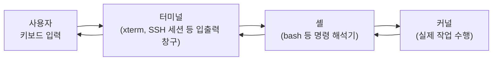

<Callout type="info">
  **이번 문서의 목표:** 이 문서를 다 읽으면 로그인 화면에 떠 있는 검은 화면이 정확히 무엇인지 설명하고, 지금 내가 어떤 셸(shell)을 쓰고 있는지 확인하며, 프롬프트(prompt) 한 줄만 보고 사용자·호스트·현재 위치·권한을 읽어낼 수 있다.
</Callout>

## 왜 "콘솔·터미널·셸"부터 구분해야 하는가

윈도(Windows)만 써 온 사람은 리눅스를 처음 켰을 때 나오는 검은 화면을 그냥 "터미널"이라고 뭉뚱그려 부르기 쉽다. 하지만 리눅스마스터 시험은 이 세 단어(콘솔, 터미널, 셸)를 서로 다른 계층으로 놓고 구분을 묻는다. 각 단어가 가리키는 대상이 다르기 때문에, 뭉뚱그려 외우면 "어느 것이 소프트웨어이고 어느 것이 하드웨어냐"를 묻는 문제에서 반드시 틀린다.

> **쉽게 말하면:** 콘솔은 컴퓨터에 직접 연결된 화면과 키보드(물리적 통로), 터미널은 그 통로를 통해 사용자와 컴퓨터가 문자를 주고받는 창구(프로그램 또는 장치), 셸은 그 창구 뒤에서 사용자가 입력한 명령을 실제로 해석해 실행하는 통역사(프로그램)다.

### 콘솔(console)

콘솔은 원래 컴퓨터 본체에 물리적으로 연결된 화면과 키보드를 뜻한다. 서버실에 가면 컴퓨터 옆에 모니터와 키보드가 놓여 있는데, 그 자리에서 로그인하는 것이 콘솔 로그인이다. 리눅스에서는 `Ctrl` + `Alt` + `F1`부터 `F6` 사이의 키 조합으로 전환할 수 있는 가상 콘솔(virtual console)이 여러 개 존재한다. 이 가상 콘솔은 그래픽 화면 없이 문자만 주고받는 텍스트 기반 로그인 화면으로, 커널이 직접 관리한다.

### 터미널(terminal)

터미널은 원래 메인프레임(mainframe, 대형 중앙 컴퓨터) 시절에 각 사용자가 앉아 입출력만 담당하던 물리적 단말기 장치를 가리키는 말이었다. 지금은 그 물리적 장치가 사라지고, 대신 소프트웨어가 그 역할을 흉내 낸다. 그래픽 데스크톱에서 실행하는 `xterm`, `gnome-terminal` 같은 프로그램을 **터미널 에뮬레이터**(terminal emulator, 터미널을 흉내 내는 프로그램)라 부르고, 원격 접속에 쓰는 `ssh` 세션도 내부적으로는 **가상 터미널**(pseudo terminal, 줄여서 pty)을 하나 만들어 그 위에서 동작한다. 즉 터미널은 "사용자의 입력을 받아 화면에 글자를 찍어 주는 창구" 역할을 하는 계층이며, 콘솔이든 SSH 세션이든 그 창구 노릇을 하는 소프트웨어·장치를 통틀어 터미널이라 부른다.

### 셸(shell)

터미널이 글자를 주고받는 창구일 뿐이라면, 그 글자를 실제로 해석해서 "무슨 명령인지" 판단하고 실행하는 프로그램이 셸이다. 셸(shell)은 원래 영어로 "껍데기"라는 뜻인데, 운영체제의 핵심인 커널(kernel, 핵)을 감싸는 바깥 껍데기라는 비유에서 이름이 나왔다. 사용자는 커널에 직접 명령을 내릴 수 없고, 반드시 셸을 통해 "이 파일을 지워라", "이 프로그램을 실행해라" 같은 요청을 전달한다. 셸은 그 요청을 해석해 커널에 전달하고, 커널이 실제 작업을 수행한 뒤 결과를 다시 셸을 거쳐 화면에 보여 준다.

세 계층의 관계를 그림으로 정리하면 다음과 같다.



콘솔은 이 그림에서 터미널이 얹히는 하드웨어·저수준 통로에 해당한다고 이해하면 된다. 그래픽 데스크톱이 없는 서버에서 콘솔에 로그인하면, 그 콘솔 위에서 로그인 셸이 곧바로 실행된다.

### 자주 틀리는 점

시험에서는 "터미널과 셸을 같은 것으로 서술한 보기"를 오답으로 즐겨 낸다. 예를 들어 "터미널은 명령어를 해석해서 실행하는 프로그램이다"라는 문장은 터미널이 아니라 셸에 대한 설명이므로 틀렸다. 반대로 "셸은 사용자와 컴퓨터 사이의 입출력 장치다"라는 문장도 셸이 아니라 터미널·콘솔에 대한 설명이라 틀렸다. **터미널 = 입출력 창구, 셸 = 명령 해석기**로 역할을 딱 나눠 기억해야 한다.

## 셸의 종류와 확인 방법

리눅스에는 여러 종류의 셸이 존재하고, 각 셸은 문법과 기능이 조금씩 다르다. 시험에서는 셸의 이름과 특징을 짝짓는 문제, 그리고 지금 내가 쓰는 셸이 무엇인지 확인하는 명령을 묻는 문제가 꾸준히 나온다.

| 셸 이름 | 정식 명칭 | 특징 |
|---|---|---|
| `sh` | Bourne Shell | 최초의 표준 셸. 1977년 스티븐 본(Stephen Bourne)이 만든 유닉스(UNIX) 최초의 셸로, 이후 모든 셸의 기준점이 되었다 |
| `bash` | Bourne Again SHell | 리눅스 배포판 대부분의 기본 셸. `sh`를 계승하면서 명령어 자동 완성, 히스토리(history, 이전 명령 기록) 검색 등 편의 기능을 더했다 |
| `csh` | C Shell | 문법이 C 언어와 비슷해 이름 붙었다. 반복문 등의 문법이 C 언어 개발자에게 친숙하다 |
| `tcsh` | TENEX C Shell | `csh`에 명령어 자동 완성 등을 더해 개선한 버전 |
| `ksh` | Korn SHell | 데이비드 콘(David Korn)이 만든 셸로, `sh`와 호환되면서 `csh`의 편의 기능도 흡수했다 |
| `zsh` | Z SHell | `bash`·`ksh`·`tcsh`의 장점을 모아 확장한 셸. 강력한 자동 완성과 테마 기능으로 최근 인기가 높다 |

### 지금 쓰는 셸을 확인하는 방법

로그인할 때 기본으로 배정되는 셸을 **로그인 셸**(login shell)이라 하며, 이 정보는 사용자 계정 정보를 담은 `/etc/passwd` 파일의 마지막 필드에 절대경로(예: `/bin/bash`)로 저장되어 있다(`/etc/passwd`의 필드 구조는 12편에서 자세히 다룬다). 다음 명령으로 확인할 수 있다.

```bash
$ echo $SHELL
/bin/bash
```

`$SHELL`은 로그인할 때 배정된 로그인 셸의 경로를 담은 환경변수(environment variable, 셸과 그 자식 프로세스가 공유하는 값)다. 다만 이 값은 로그인 셸을 나타낼 뿐, 로그인한 뒤 다른 셸로 임시 전환했을 때 **지금 실제로 실행 중인 셸**과는 다를 수 있다는 점이 함정으로 자주 나온다. 예를 들어 로그인 셸이 `bash`인 사용자가 터미널에서 `zsh`를 입력해 잠깐 `zsh`로 들어가도, `$SHELL`은 여전히 `/bin/bash`를 출력한다. 지금 실제로 실행 중인 셸을 정확히 확인하려면 다음 두 방법을 쓴다.

```bash
$ echo $0
-bash

$ ps -p $$
    PID TTY          TIME CMD
   4821 pts/0    00:00:00 bash
```

`$0`은 현재 실행 중인 프로그램(셸) 자신의 이름을 담은 특수 변수이고, `$$`는 현재 셸 프로세스의 PID(Process ID, 프로세스 식별 번호. 프로세스는 13편에서 자세히 다룬다)를 담은 특수 변수다. `ps -p $$`는 "현재 셸의 PID를 가진 프로세스 정보를 보여 달라"는 뜻이므로, `CMD` 열에 정확히 지금 실행 중인 셸의 이름이 찍힌다.

### 자주 틀리는 점

기출에서는 "`echo $SHELL`은 항상 지금 실행 중인 셸을 정확히 반영한다"는 보기를 오답으로 낸다. `$SHELL`은 로그인 셸(고정값)이고, 실제 실행 중인 셸을 정확히 반영하는 것은 `$0`이나 `ps -p $$`다. 또한 "`env` 명령이 현재 셸의 종류를 한 줄로 출력해 준다"는 보기도 틀렸다. `env`는 현재 설정된 환경변수 전체 목록을 출력하는 명령이지, 셸 종류만 콕 집어 보여 주는 명령이 아니다. `chsh`(change shell) 명령도 헷갈리기 쉬운데, 이 명령은 **로그인 셸을 변경**하는 명령이며 인자 없이 실행하면 현재 셸을 그냥 출력하는 것이 아니라 새 셸을 입력하라는 대화형 프롬프트를 띄운다.

## 프롬프트가 알려 주는 정보

셸이 명령을 입력받을 준비가 되면 화면에 프롬프트(prompt, 입력을 재촉하는 문자열)를 띄운다. `bash`의 기본 프롬프트는 다음과 같은 모습이다.

```bash
[posein@www ~]$
```

이 한 줄에는 생각보다 많은 정보가 들어 있다.

| 구성 요소 | 의미 |
|---|---|
| `posein` | 현재 로그인한 사용자 이름 |
| `@` | 사용자와 호스트를 구분하는 구분자 |
| `www` | 호스트명(hostname, 이 컴퓨터의 이름) |
| `~` | 현재 작업 디렉터리. 물결표(tilde)는 홈 디렉터리(home directory, 사용자마다 배정된 개인 저장 공간)를 뜻하는 특수 기호다 |
| `$` | 프롬프트의 맨 끝 기호. 일반 사용자는 `$`, 관리자 계정인 root는 `#`으로 표시되어, 이 기호 하나만 봐도 지금 관리자 권한인지 아닌지 즉시 구분할 수 있다 |

이 프롬프트 형식은 고정된 것이 아니라 `PS1`이라는 환경변수에 정의되어 있고, 사용자가 원하는 대로 바꿀 수 있다. `PS1` 안에는 실제 값이 아니라 값을 채워 넣을 자리를 나타내는 **이스케이프 시퀀스**(escape sequence, 백슬래시로 시작해 특별한 의미를 갖는 기호 조합)를 쓴다.

| 이스케이프 시퀀스 | 의미 |
|---|---|
| `\u` | 현재 사용자 이름 |
| `\h` | 호스트명(첫 번째 마침표 앞부분까지, 짧은 이름) |
| `\H` | 호스트명 전체(도메인 이름 포함) |
| `\w` | 현재 작업 디렉터리의 전체 경로 |
| `\W` | 현재 작업 디렉터리의 마지막 이름(basename)만 |
| `\d` | 오늘 날짜 |
| `\t` | 현재 시각 |
| `\$` | 일반 사용자는 `$`, root는 `#`을 표시 |

예를 들어 다음처럼 `PS1`을 바꾸면 프롬프트 모양이 즉시 달라진다.

```bash
[ihd@www ~]$ PS1='[\u@\h \W]\$ '
[ihd@www ~]$
```

여기서는 `\u`(사용자명), `\h`(호스트명), `\W`(디렉터리 마지막 이름), `\$`(권한별 기호)를 조합했으므로, 원래 프롬프트와 겉모습은 같지만 "이 네 가지 조각으로 이루어진 문자열"이라는 점을 이해해야 한다. 만약 `\W` 대신 `\w`를 썼다면 `~`(홈 디렉터리 축약형)가 아니라 홈 디렉터리의 전체 경로(예: `/home/ihd`)가 그대로 표시된다.

명령이 한 줄에 다 끝나지 않고 다음 줄로 이어질 때는 다른 프롬프트가 뜬다. 예를 들어 명령 끝에 역슬래시(`\`)를 붙여 다음 줄로 이어 쓰면, 기본값이 `>` 인 **2차 프롬프트**가 나타난다.

```bash
[posein@www ~]$ cp report.txt \
> backup/
```

이 2차 프롬프트의 모양을 정의하는 환경변수가 `PS2`다. `PS1`(1차 프롬프트)과 헷갈려서 "명령이 길어질 때 나오는 프롬프트도 `PS1`이 결정한다"고 잘못 고르는 것이 전형적인 함정이다. 참고로 `PS3`는 `select` 명령의 메뉴 프롬프트, `PS4`는 셸 스크립트를 디버그(`-x` 옵션 실행) 모드로 실행할 때 각 줄 앞에 붙는 프롬프트로, `PS1`·`PS2`보다는 출제 빈도가 낮지만 "프롬프트 관련 변수가 네 종류 있다"는 사실 자체는 함께 기억해 둔다.

## 명령어의 기본 형식

리눅스 명령어는 대부분 다음과 같은 공통된 형식을 따른다.

```bash
명령어 [옵션] [인자]
```

- **명령어**: 실행할 프로그램의 이름. 예를 들어 `ls`, `cp`, `grep` 같은 이름이다.
- **옵션**(option): 명령어의 동작 방식을 세부적으로 조정하는 부분. 짧은 형식은 하이픈 하나에 알파벳 한 글자(예: `-l`), 긴 형식은 하이픈 두 개에 단어(예: `--all`)로 쓴다. 짧은 옵션은 `-al`처럼 여러 개를 붙여 한 번에 쓸 수 있다.
- **인자**(argument): 명령어가 실제로 작업할 대상. 파일명이나 디렉터리 경로가 여기에 해당한다.

예를 들어 다음 명령을 뜯어보자.

```bash
$ ls -al /home/posein
```

`ls`가 명령어, `-al`이 옵션(짧은 옵션 `-a`와 `-l`을 붙여 쓴 것), `/home/posein`이 인자다. 대괄호(`[ ]`)로 표시한 부분은 생략 가능하다는 뜻으로, 옵션과 인자 없이 `ls`만 입력해도 정상적으로 동작한다(현재 디렉터리의 목록을 보여 준다).

명령어 앞에 특수 기호를 붙이면 셸의 부가 기능을 우회하거나 다르게 동작시킬 수 있다. 대표적으로 명령 앞에 역슬래시(`\`)를 붙이면(예: `\ls`) 별칭(alias, `ls` 같은 명령을 다른 명령의 축약형으로 재정의해 둔 것)을 무시하고 원본 명령을 그대로 실행한다. 이는 시험에서 "별칭 확장을 막는 방법"으로 자주 출제된다. 반면 `!`는 히스토리 이벤트 지시자(예: `!!`로 바로 직전 명령을 다시 실행)로 쓰이는 별개의 기호이며, 별칭 무시와는 관계가 없다.

명령을 백그라운드(background, 화면을 점유하지 않고 뒤에서 계속 실행되는 방식)로 곧바로 실행하려면 명령 끝에 앰퍼샌드(`&`)를 붙인다.

```bash
$ find / -name "*.txt" 2> /dev/null > list.txt &
[1] 5821
```

`&`가 붙은 명령은 즉시 프롬프트를 돌려주고 백그라운드에서 계속 실행되며, 대괄호 안의 숫자(`[1]`)는 작업 번호(job number), 그 뒤의 숫자(`5821`)는 이 작업을 실행하는 프로세스의 PID다. `&`를 붙이지 않고 `find`만 실행하면 명령이 끝날 때까지 프롬프트가 돌아오지 않는 포그라운드(foreground) 실행이 된다. 백그라운드·포그라운드 전환과 `jobs`·`fg`·`bg` 명령은 13–14편에서 프로세스 개념과 함께 자세히 다룬다.

## 직접 해보기

<Callout type="info">
  00편에서 만든 `rocky` 컨테이너에서 진행합니다. 아직 안 만들었다면 00편을 먼저 보세요.
</Callout>

로그인 셸(고정값)과 지금 실제로 실행 중인 셸이 다를 수 있다는 것을 직접 확인합니다.

```bash
echo $SHELL
ps -p $$
sh
ps -p $$
```

**무엇을 보아야 하나**: 첫 번째 `ps -p $$`의 `CMD` 열은 `bash`인데, `sh`를 입력해 셸을 바꾼 뒤 다시 실행한 두 번째 `ps -p $$`는 `CMD` 열이 `sh`로 바뀝니다. 반면 이 상태에서 `echo $SHELL`을 또 쳐 봐도 값은 처음 그대로입니다(직접 쳐서 확인하세요). 확인이 끝나면 `exit`로 `sh`에서 빠져나옵니다.

> **왜 이걸 해보나:** "`echo $SHELL`은 항상 지금 실행 중인 셸을 정확히 반영한다"는 기출 오답 문장을 직접 눈으로 반박하는 실습입니다.

설치된 셸 목록도 확인해 둡니다.

```bash
cat /etc/shells
```

**무엇을 보아야 하나**: 위 표에 나온 `bash`·`sh` 등 셸의 절대경로가 몇 개나 나열되어 있는지 봅니다.

## 핵심 정리

- 콘솔은 물리적 화면·키보드, 터미널은 입출력을 중개하는 창구(에뮬레이터·SSH 세션 등), 셸은 명령을 해석해 커널에 전달하는 프로그램이다. 세 계층을 뒤섞어 설명하는 보기는 오답이다.
- 대표 셸은 `sh`·`bash`·`csh`·`tcsh`·`ksh`·`zsh`이며, 로그인 셸은 `$SHELL`로, **지금 실제 실행 중인 셸**은 `$0`이나 `ps -p $$`로 확인한다. 둘을 혼동하지 않는다.
- 프롬프트(기본 `[사용자@호스트 디렉터리]$`)는 `PS1` 변수가 정의하며, `\u`·`\h`·`\w`·`\W`·`\$` 등의 이스케이프 시퀀스로 구성한다. 명령이 이어질 때의 2차 프롬프트는 `PS2`가 담당한다.
- 명령어의 기본 형식은 "명령어 [옵션] [인자]"이며, 짧은 옵션은 붙여 쓸 수 있다. `\명령어`는 별칭 무시, `명령 &`는 백그라운드 즉시 실행을 의미한다.

## 마무리 복습

<Quiz
  questionNumber={1}
  question="콘솔, 터미널, 셸에 대한 설명으로 가장 올바른 것은?"
  options={['셸은 사용자와 컴퓨터 사이의 물리적 입출력 장치이다', '터미널은 입력된 명령을 해석해 커널에 전달하는 프로그램이다', '셸은 사용자의 명령을 해석해 커널에 전달하는 프로그램이다', '콘솔은 SSH로 원격 접속했을 때 생성되는 가상 장치를 뜻한다']}
  correctAnswer={3}
  explanation="셸은 사용자가 입력한 명령을 해석해 커널에 전달하고 결과를 다시 보여 주는 명령 해석 프로그램이다. 콘솔은 물리적으로 연결된 화면과 키보드, 터미널은 입출력을 중개하는 창구(에뮬레이터나 pty)로 셸과는 역할이 다르다."
  optionExplanations={['물리적 입출력 장치 역할은 콘솔·터미널에 해당하며 셸의 역할이 아니다', '명령을 해석해 커널에 전달하는 것은 터미널이 아니라 셸의 역할이다', '정답. 셸은 명령 해석기로 커널과 사용자 사이를 중개한다', 'SSH 세션이 만드는 것은 가상 터미널(pty)이며, 콘솔은 물리적 화면·키보드 또는 그와 동등한 가상 콘솔을 가리킨다']}
/>

<Quiz
  questionNumber={2}
  question="다음 중 로그인 셸이 아니라 지금 실제로 실행 중인 셸을 가장 정확히 확인할 수 있는 방법은?"
  options={['echo $SHELL', 'echo $0', 'env', 'chsh (인자 없이 실행)']}
  correctAnswer={2}
  explanation="echo $0은 현재 실행 중인 프로그램 자신의 이름을 출력하므로 지금 동작 중인 셸을 정확히 반영한다. $SHELL은 로그인할 때 고정된 로그인 셸 경로이며, 도중에 다른 셸로 전환해도 값이 바뀌지 않는다."
  optionExplanations={['SHELL 변수는 로그인 셸 경로를 담을 뿐, 도중에 다른 셸로 전환해도 값이 그대로 유지되어 지금 실행 중인 셸과 다를 수 있다', '정답. $0은 지금 실행 중인 프로그램(셸) 자신의 이름을 반영하므로 셸을 전환하면 값도 함께 바뀐다', 'env는 현재 설정된 환경변수 전체 목록을 보여 주는 명령으로, 셸 종류만 콕 집어 알려 주지 않는다', 'chsh는 로그인 셸을 변경하는 명령이며, 인자 없이 실행하면 새 셸을 입력하라는 대화형 프롬프트를 띄울 뿐 현재 셸을 출력하지 않는다']}
/>

<Quiz
  questionNumber={3}
  question="C 언어와 비슷한 문법을 갖도록 설계되어 이름이 붙은 셸은 무엇인가?"
  options={['bash', 'ksh', 'csh', 'sh']}
  correctAnswer={3}
  explanation="csh(C Shell)는 반복문 등의 문법이 C 언어와 유사하게 설계되어 이름이 붙었다."
  optionExplanations={['bash는 Bourne Again SHell의 약자로 sh를 계승해 편의 기능을 더한 셸이다', 'ksh는 Korn SHell로 개발자 데이비드 콘의 이름을 딴 것이며 C 문법과는 무관하다', '정답. csh는 C Shell의 약자로 문법이 C 언어를 닮도록 설계되었다', 'sh는 Bourne Shell로 최초의 표준 셸이며 C 언어 문법을 본뜬 것이 아니다']}
/>

<Quiz
  questionNumber={4}
  question="사용자 posein이 호스트 www에서 로그인해 홈 디렉터리에 있을 때 기본 프롬프트가 [posein@www ~]$ 로 표시되었다. 물결표(~)가 의미하는 것은?"
  options={['호스트명의 축약형이다', '현재 사용자가 root임을 나타내는 기호이다', '현재 작업 디렉터리가 홈 디렉터리임을 나타낸다', '명령이 아직 완료되지 않았음을 나타낸다']}
  correctAnswer={3}
  explanation="물결표(tilde)는 홈 디렉터리를 가리키는 특수 기호로, 프롬프트의 디렉터리 표시 자리에 물결표만 나타나면 현재 위치가 그 사용자의 홈 디렉터리라는 뜻이다."
  optionExplanations={['호스트명은 @ 뒤의 www가 담당하며 물결표와는 무관하다', 'root 여부는 프롬프트 맨 끝의 기호($ 또는 #)로 구분하며 물결표와는 무관하다', '정답. 물결표는 홈 디렉터리를 축약해 나타내는 특수 기호다', '명령 미완료 시 나타나는 것은 2차 프롬프트(PS2, 기본값 >)이며 물결표와는 무관하다']}
/>

<Quiz
  questionNumber={5}
  question="다음 명령을 실행한 뒤 나타나는 프롬프트 모양에 대한 설명으로 가장 올바른 것은? PS1='[\u@\h \W]\$ '"
  options={['현재 작업 디렉터리의 전체 경로가 항상 표시된다', '사용자명, 호스트명, 현재 디렉터리의 마지막 이름, 권한별 기호가 순서대로 표시된다', '2차 프롬프트의 모양을 변경하는 설정이다', '날짜와 시각이 함께 표시된다']}
  correctAnswer={2}
  explanation="\u는 사용자명, \h는 호스트명, \W는 현재 디렉터리의 마지막 이름(전체 경로가 아님), \$는 일반 사용자면 달러 기호, root면 샵 기호를 표시하므로 이 네 조각이 순서대로 나타난다."
  optionExplanations={['전체 경로를 표시하는 것은 소문자 \\w이며, 여기 쓰인 대문자 \\W는 마지막 디렉터리 이름만 표시한다', '정답. \\u·\\h·\\W·\\$가 각각 사용자명·호스트명·디렉터리 마지막 이름·권한 기호를 나타낸다', '2차 프롬프트는 PS2 변수가 담당하며 이 설정은 PS1(1차 프롬프트)이다', '날짜·시각을 표시하려면 \\d나 \\t를 포함해야 하는데 이 설정에는 없다']}
/>

<Quiz
  questionNumber={6}
  question="명령 앞에 역슬래시를 붙여 \ls 처럼 실행했을 때 일어나는 일로 가장 올바른 것은?"
  options={['히스토리에 남은 이전 명령을 다시 실행한다', '해당 명령을 백그라운드로 실행한다', '별칭(alias) 확장을 무시하고 원본 명령을 그대로 실행한다', '명령을 다음 줄로 이어서 입력하겠다는 뜻이다']}
  correctAnswer={3}
  explanation="명령 앞의 역슬래시는 그 명령에 걸린 별칭(alias) 확장을 막고 원본 명령을 실행하라는 지시다. 예를 들어 ls가 ls --color=auto로 별칭이 걸려 있어도 \ls는 그 별칭을 무시한다."
  optionExplanations={['이전 명령을 다시 실행하는 것은 느낌표(!)로 시작하는 히스토리 이벤트 지시자의 역할이다', '백그라운드 실행은 명령 끝에 앰퍼샌드(&)를 붙이는 방식이다', '정답. 역슬래시는 별칭 확장을 막고 원본 명령을 그대로 실행하게 한다', '명령을 다음 줄로 잇는 것은 줄 끝에 역슬래시를 붙이는 것으로, 명령 맨 앞에 붙이는 것과는 다른 용법이다']}
/>

<Quiz
  questionNumber={7}
  question="find / -name file.txt & 처럼 명령 끝에 앰퍼샌드(&)를 붙여 실행했을 때 일어나는 일로 가장 올바른 것은?"
  options={['명령이 끝날 때까지 프롬프트가 반환되지 않는다', '명령이 즉시 백그라운드로 실행되고 프롬프트가 곧바로 반환된다', '명령이 일정 시간 뒤 예약 실행된다', '명령의 표준 출력이 자동으로 파일에 저장된다']}
  correctAnswer={2}
  explanation="명령 끝의 &는 그 명령을 백그라운드에서 실행하라는 지시로, 셸은 명령을 백그라운드로 넘긴 뒤 곧바로 프롬프트를 돌려주고 사용자는 다른 명령을 이어서 입력할 수 있다."
  optionExplanations={['프롬프트가 반환되지 않는 것은 &를 붙이지 않은 포그라운드 실행이다', '정답. &는 명령을 백그라운드로 즉시 실행하고 프롬프트를 바로 돌려준다', '예약 실행은 cron이나 at 명령의 역할이며 &와는 무관하다', '표준 출력을 파일로 저장하려면 리다이렉션(>) 기호를 별도로 써야 하며 &만으로는 저장되지 않는다']}
/>

## 참고 자료

- [KAIT 리눅스마스터 자격안내](https://www.ihd.or.kr/introducesubject1.do)
- [GNU Bash 매뉴얼](https://www.gnu.org/software/bash/manual/bash.html)
