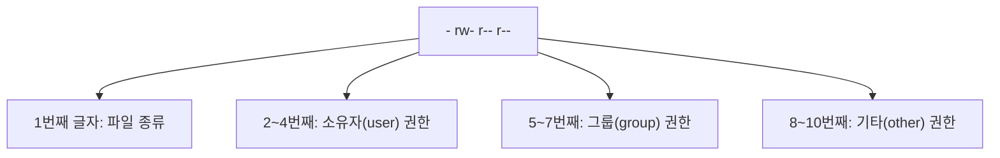

<Callout type="info">
  **이번 문서의 목표:** 이 문서를 다 읽으면 절대경로와 상대경로를 상황에 맞게 골라 쓰고, `ls -l` 출력의 10자리 권한 문자열을 포함한 각 열을 전부 해석하며, 하드링크와 심볼릭 링크의 차이를 원본 삭제 시나리오까지 포함해 설명할 수 있다.
</Callout>

## 절대경로와 상대경로

리눅스의 모든 파일과 디렉터리는 `/`(루트, root)라는 단 하나의 뿌리에서 시작하는 나무 구조(트리 구조)로 연결되어 있다(전체 구조는 09편에서 자세히 다룬다). 어떤 파일의 위치를 표현하는 방법은 두 가지다.

> **쉽게 말하면:** 절대경로는 "지도의 원점(루트)에서부터 찾아가는 길"이고, 상대경로는 "지금 서 있는 자리에서부터 찾아가는 길"이다.

**절대경로**(absolute path)는 루트 디렉터리 `/`에서 시작해 목적지까지의 전체 경로를 빠짐없이 적는 방식이다. 항상 `/`로 시작한다.

```bash
/home/posein/documents/report.txt
```

**상대경로**(relative path)는 현재 작업 디렉터리(current working directory, 지금 내가 있는 위치)를 기준으로 목적지까지의 경로를 적는 방식이다. `/`로 시작하지 않는다. 상대경로에는 두 가지 특수 기호가 자주 쓰인다.

| 기호 | 의미 |
|---|---|
| `.` | 현재 디렉터리 자기 자신 |
| `..` | 현재 디렉터리의 바로 위(부모) 디렉터리 |
| `~` | 현재 로그인한 사용자의 홈 디렉터리 |
| `-` | `cd` 명령에서 바로 직전에 있던 디렉터리 |

예를 들어 현재 위치가 `/home/posein`이고 `documents/report.txt`를 가리키고 싶다면, 절대경로로는 `/home/posein/documents/report.txt`, 상대경로로는 그냥 `documents/report.txt`라고 쓸 수 있다. 절대경로는 내가 어디에 있든 항상 같은 파일을 정확히 가리킨다는 장점이 있고, 상대경로는 입력이 짧아 지금 위치에서 가까운 파일을 다룰 때 편리하다는 장점이 있다. 이 둘을 구분하는 가장 확실한 기준은 "맨 앞 글자가 `/`인가 아닌가"이다.

## pwd — 현재 위치 확인

`pwd`(print working directory)는 지금 내가 어느 디렉터리에 있는지 절대경로로 출력하는 명령이다. 옵션 없이 그 자체로 완결된 정보를 준다.

```bash
$ pwd
/home/posein/documents
```

## cd — 디렉터리 이동

`cd`(change directory)는 작업 디렉터리를 옮기는 명령이다.

```bash
cd [이동할 경로]
```

| 사용법 | 동작 |
|---|---|
| `cd` (인자 없음) | 자신의 홈 디렉터리로 이동 |
| `cd ~` | 자신의 홈 디렉터리로 이동 (`cd`와 동일) |
| `cd ..` | 바로 위 디렉터리로 이동 |
| `cd -` | 바로 직전에 있던 디렉터리로 이동 |
| `cd /var/log` | 절대경로로 이동 |
| `cd ../etc` | 상대경로로 이동 (부모 디렉터리 아래의 etc로) |

`cd -`는 자주 놓치는 기능인데, 두 디렉터리를 왔다 갔다 반복할 때 매번 긴 경로를 입력하지 않아도 되게 해 준다.

## ls — 목록 보기와 10자리 권한 문자열 해석

`ls`(list)는 디렉터리 안의 파일 목록을 보여 주는, 리눅스에서 가장 많이 쓰는 명령이다.

```bash
ls [옵션] [경로]
```

| 옵션 | 의미 |
|---|---|
| `-a` | 숨김 파일(이름이 `.`으로 시작하는 파일)까지 전부 표시 |
| `-l` | 자세히 보기(long format) — 권한·소유자·크기·수정 시각 등을 표로 표시 |
| `-h` | `-l`과 함께 써서 파일 크기를 사람이 읽기 쉬운 단위(K·M·G)로 표시 |
| `-t` | 수정 시각 기준으로 최신순 정렬 |
| `-r` | 정렬 순서를 반대로(역순으로) 표시 |
| `-R` | 하위 디렉터리까지 재귀적으로 전부 표시 |
| `-i` | 각 파일의 inode 번호를 함께 표시 |

옵션 없이 `ls`만 실행하면 파일명만 나열되어 정보가 부족하다. 시험에서 정말 중요한 것은 `ls -l`의 출력을 한 줄 한 줄 해석하는 능력이다.

```bash
$ ls -l report.txt
-rw-r--r-- 1 posein posein 2048 3월  11 09:30 report.txt
```

이 한 줄은 공백을 기준으로 7개의 필드로 나뉜다.

| 필드 순서 | 예시 값 | 의미 |
|---|---|---|
| 1 | `-rw-r--r--` | 파일 종류(1자리) + 권한(9자리), 총 10자리 문자열 |
| 2 | `1` | 링크 수(link count) — 이 파일을 가리키는 하드링크의 개수 |
| 3 | `posein` | 소유자(owner) |
| 4 | `posein` | 소유 그룹(group) |
| 5 | `2048` | 파일 크기(바이트 단위) |
| 6 | `3월  11 09:30` | 최종 수정 시각 |
| 7 | `report.txt` | 파일(또는 디렉터리) 이름 |

### 10자리 권한 문자열 뜯어보기

가장 자주 출제되는 부분이 바로 첫 번째 필드, 10자리 문자열이다. 이 문자열은 "1자리 파일 종류 + 3자리씩 3묶음의 권한"으로 이루어진다.



첫 번째 글자는 파일의 종류를 나타낸다.

| 첫 글자 | 파일 종류 |
|---|---|
| `-` | 일반 파일 |
| `d` | 디렉터리(directory) |
| `l` | 심볼릭 링크(symbolic link) |
| `b` | 블록 장치 파일(block device, 하드디스크 등 블록 단위로 데이터를 주고받는 장치) |
| `c` | 문자 장치 파일(character device, 키보드 등 문자 단위로 데이터를 주고받는 장치) |
| `p` | 명명된 파이프(named pipe, FIFO) |
| `s` | 소켓(socket) |

나머지 9자리는 3자리씩 끊어 소유자(user)·그룹(group)·기타(other) 순서로 권한을 나타내며, 각 3자리는 항상 읽기(`r`, read)·쓰기(`w`, write)·실행(`x`, execute) 순서로 고정되어 있고 권한이 없으면 그 자리에 `-`가 채워진다. 위 예시 `-rw-r--r--`를 해석하면 다음과 같다.

- 첫 글자 `-`: 일반 파일이다.
- `rw-`(소유자): 읽기·쓰기 가능, 실행 불가.
- `r--`(그룹): 읽기만 가능.
- `r--`(기타): 읽기만 가능.

권한을 8진수(숫자) 표기로 바꾸는 계산 방법과 `chmod`·`umask`, 특수 권한(SetUID·SetGID·스티키 비트)은 11편에서 계산 과정까지 전부 다룬다. 이 편에서는 "10자리 문자열을 4개 구간(종류·소유자·그룹·기타)으로 나누어 읽는 법"까지만 확실히 잡아 둔다.

### 자주 틀리는 점

`ls -l`의 두 번째 필드(링크 수)를 소유자 수나 하위 파일 수로 착각하는 보기가 자주 나온다. 이 값은 어디까지나 "이 inode를 가리키는 하드링크의 개수"다. 일반 파일을 막 만들면 이 값은 1이고, 디렉터리는 기본적으로 2 이상인데(자기 자신을 가리키는 `.` 항목과, 하위 디렉터리에서 부모를 가리키는 `..` 항목 때문이다), 이는 뒤에 나올 하드링크 개념과 바로 연결된다.

## mkdir — 디렉터리 생성

```bash
mkdir [옵션] 디렉터리명
```

| 옵션 | 의미 |
|---|---|
| `-p` | 중간 경로가 없어도 필요한 상위 디렉터리까지 한꺼번에 생성 |
| `-m` | 생성과 동시에 권한을 지정 |

```bash
$ mkdir -p project/src/utils
```

`-p` 없이 `mkdir project/src/utils`를 실행했는데 `project`나 `project/src`가 아직 없다면 오류가 난다. `-p`는 중간 단계 디렉터리를 자동으로 만들어 주므로 실무에서도 거의 항상 함께 쓴다.

## rm — 파일과 디렉터리 삭제

```bash
rm [옵션] 대상
```

| 옵션 | 의미 |
|---|---|
| `-r` | 재귀적으로 디렉터리와 그 내용을 전부 삭제 |
| `-f` | 확인 메시지 없이 강제 삭제, 존재하지 않는 파일이어도 오류 없이 진행 |
| `-i` | 삭제 전마다 확인 질문 |

```bash
$ rm -rf old_project/
```

`rm`으로 지운 파일은 휴지통을 거치지 않고 곧바로 삭제된다는 점이 윈도의 "휴지통으로 이동"과 가장 크게 다르다. 특히 `rm -rf`는 되돌릴 수 없으므로, 경로를 한 글자라도 잘못 입력하면 의도하지 않은 위치를 통째로 지울 수 있다는 점이 실무에서도 자주 언급되는 위험이다.

## cp — 파일과 디렉터리 복사

```bash
cp [옵션] 원본 대상
```

| 옵션 | 의미 |
|---|---|
| `-r` | 디렉터리를 재귀적으로 복사(디렉터리 복사에는 필수) |
| `-p` | 원본의 권한·소유자·수정 시각까지 그대로 보존 |
| `-i` | 대상에 같은 이름의 파일이 있으면 덮어쓰기 전에 확인 |
| `-a` | 아카이브(archive) 모드 — 재귀 복사에 권한·소유자·시각·심볼릭 링크까지 모두 보존하는 여러 옵션의 묶음 |

```bash
$ cp -r documents/ backup/
```

디렉터리를 복사할 때 `-r` 옵션을 빠뜨리면 "생략된 디렉터리"라는 오류만 나고 복사되지 않는다는 점을 꼭 기억해 둔다.

## mv — 파일과 디렉터리 이동·이름 변경

```bash
mv [옵션] 원본 대상
```

| 옵션 | 의미 |
|---|---|
| `-i` | 덮어쓰기 전에 확인 |
| `-f` | 확인 없이 강제로 덮어쓰기 |
| `-n` | 대상이 이미 있으면 덮어쓰지 않음 |

`mv`는 파일을 옮기는 명령이면서 동시에 이름을 바꾸는 명령이기도 하다. 리눅스에는 "이름만 바꾸는" 별도 명령(`rename` 같은 명령이 배포판에 따라 있기는 하지만)이 표준으로 굳어져 있지 않고, 대신 `mv 원본 새이름`처럼 같은 디렉터리 안에서 이름만 다르게 지정하면 이름 변경으로 동작한다.

```bash
$ mv draft.txt final.txt
```

`cp`와 달리 `mv`로 디렉터리를 옮길 때는 `-r` 옵션이 필요 없다. `mv`는 디렉터리 안의 파일 하나하나를 복사하는 것이 아니라, 같은 파일시스템 안에서는 디렉터리 항목(엔트리)의 위치 정보만 바꾸는 방식으로 동작하기 때문이다(단, 서로 다른 파일시스템 사이로 옮길 때는 내부적으로 복사 후 삭제가 일어난다).

## 하드링크와 심볼릭 링크

파일 이름 하나에 파일 내용 하나가 무조건 1대1로 묶여 있다고 생각하기 쉽지만, 리눅스는 그렇게 동작하지 않는다. 이 차이를 이해하려면 먼저 **inode**(아이노드) 개념부터 잡아야 한다.

> **쉽게 말하면:** inode는 파일의 실제 알맹이(내용·권한·크기·소유자 등 메타데이터)를 저장한 "관리 카드"이고, 우리가 보는 파일 이름은 그 관리 카드를 가리키는 "이름표"에 불과하다.

리눅스 파일시스템은 파일의 실제 데이터와 메타데이터(metadata, 데이터를 설명하는 데이터 — 크기·권한·소유자·수정 시각 등)를 **inode**라는 자료구조에 저장하고, 각 inode에는 고유한 번호(inode 번호)가 매겨진다. 우리가 디렉터리에서 보는 "파일 이름"은 사실 그 자체로 데이터를 담고 있는 것이 아니라, "이 이름은 inode 몇 번을 가리킨다"는 연결 정보(디렉터리 엔트리)일 뿐이다. 즉 파일 이름과 실제 데이터 사이에는 inode 번호라는 한 단계가 끼어 있다.

```bash
$ ls -i report.txt
132491 report.txt
```

`ls -i`로 확인한 `132491`이 바로 이 파일의 inode 번호다.

### 하드링크(hard link)

**하드링크**는 이미 존재하는 inode에 새로운 이름(디렉터리 엔트리)을 하나 더 추가하는 것이다. `ln`(link, 옵션 없이) 명령으로 만든다.

```bash
$ ln 원본.txt 하드링크.txt
$ ls -i 원본.txt 하드링크.txt
132491 원본.txt
132491 하드링크.txt
```

두 파일의 inode 번호가 `132491`로 완전히 같다. 이는 "서로 다른 두 파일"이 아니라 "같은 데이터를 가리키는 두 개의 이름표"라는 뜻이다. 하드링크를 만들면 원본의 `ls -l` 두 번째 필드(링크 수)가 1 증가한다.

### 심볼릭 링크(symbolic link)

**심볼릭 링크**(줄여서 소프트 링크, soft link)는 전혀 다르게 동작한다. 이것은 새로운 inode를 가진 독립된 파일이며, 그 파일의 내용물은 "원본 파일까지의 경로 문자열"이다. `ln -s`(symbolic) 옵션으로 만든다.

```bash
$ ln -s 원본.txt 심볼릭.txt
$ ls -l 심볼릭.txt
lrwxrwxrwx 1 posein posein 8 3월  11 09:40 심볼릭.txt -> 원본.txt
```

`ls -l` 첫 글자가 `l`로 표시되고, 파일 이름 뒤에 `-> 원본.txt`처럼 가리키는 대상 경로가 함께 표시된다. 심볼릭 링크는 원본과 별개의 inode를 가지므로, 심볼릭 링크를 만들어도 **원본의 링크 수는 늘어나지 않는다.**

### 원본을 지웠을 때의 차이 — 시험 단골 포인트

이 주제가 리눅스마스터 2급 1차에서 가장 자주 반복 출제되는 지점이다. 하드링크와 심볼릭 링크는 원본 삭제에 대한 반응이 정반대다.

| 구분 | 하드링크 | 심볼릭 링크 |
|---|---|---|
| 가리키는 대상 | 원본과 동일한 inode(데이터 자체) | 원본의 경로 문자열(이름) |
| inode 번호 | 원본과 완전히 같다 | 원본과 다르다(독자적인 inode를 가진다) |
| 원본의 링크 수 | 하드링크 생성 시 1 증가 | 변화 없음 |
| 파일시스템 경계 | 같은 파일시스템(같은 파티션) 안에서만 생성 가능 | 다른 파일시스템·다른 디스크를 넘어서도 생성 가능 |
| 디렉터리에 적용 | 일반 사용자는 만들 수 없음(`.`, `..` 용도로 시스템만 예외적으로 사용) | 디렉터리에도 자유롭게 생성 가능 |
| 원본 삭제 시 | 데이터는 그대로 남아 하드링크로 계속 접근 가능 | 가리킬 대상이 사라져 깨진 링크(dangling link)가 됨 |

- **하드링크는 왜 원본을 지워도 살아남는가**: inode 안에는 "이 inode를 가리키는 이름이 몇 개 있는가"를 세는 링크 수(`ls -l`의 두 번째 필드)가 있다. 원본 이름을 지우는 것은 이름표 하나를 떼는 행위일 뿐이고, 실제 데이터는 링크 수가 0이 될 때 비로소 디스크에서 해제된다. 하드링크가 하나라도 남아 있으면 링크 수가 0이 아니므로 데이터는 그대로 보존되고, 남은 이름(하드링크)으로 여전히 같은 내용에 접근할 수 있다.
- **심볼릭 링크는 왜 깨지는가**: 심볼릭 링크 자신은 독립된 파일이라 원본을 지워도 사라지지 않지만, 그 안에 적힌 내용(경로 문자열)이 가리키는 대상이 없어져 버린다. 그 상태에서 심볼릭 링크를 열어 보려 하면 "그런 파일이나 디렉터리가 없다"는 오류가 난다. 이렇게 대상을 잃은 심볼릭 링크를 깨진 링크(dangling link)라 부른다.
- **왜 하드링크는 파일시스템 경계를 넘지 못하는가**: inode 번호는 파일시스템(파티션) 단위로 관리되는 값이라, 다른 파일시스템의 inode 번호와는 애초에 대응 관계를 맺을 수 없다. 반면 심볼릭 링크는 단순히 경로 문자열을 담을 뿐이므로 그 경로가 다른 디스크의 마운트 지점을 거쳐 가더라도 문제가 없다.
- **왜 디렉터리 하드링크는 막혀 있는가**: 디렉터리 사이에 하드링크를 자유롭게 허용하면 디렉터리 트리 구조에 순환 고리(loop)가 생길 수 있어 파일시스템의 무결성이 깨질 위험이 있다. 그래서 커널은 일반 사용자가 디렉터리에 하드링크를 만드는 것을 막아 둔다.

### 자주 틀리는 점

기출에서는 하드링크와 심볼릭 링크의 특징을 서로 뒤바꿔 서술한 보기가 반복해서 나온다. "하드링크는 서로 다른 파일시스템 간에도 자유롭게 생성할 수 있다"거나 "심볼릭 링크는 원본과 동일한 inode 번호를 공유한다"는 문장은 둘의 역할이 정반대로 뒤바뀐 전형적인 오답이다. 또한 "일반 파일 하나를 만든 뒤 하드링크 1개와 심볼릭 링크 1개를 각각 만들면 원본의 링크 수는 얼마인가"를 묻는 계산형 문제도 자주 나오는데, 정답은 처음 값 1에 하드링크 생성분 1만 더한 **2**이며, 심볼릭 링크는 원본의 링크 수를 전혀 늘리지 않는다는 점이 함정이다.

## find와 grep을 함께 쓸 때의 옵션은 08편에서

경로와 파일을 조작하는 명령을 배웠으니, 다음 08편에서는 그 파일들의 **내용**을 들여다보고 검색하는 명령(`cat`·`grep`·`find` 등)을 이어서 다룬다.

## 직접 해보기

<Callout type="info">
  00편에서 만든 `rocky` 컨테이너에서 진행합니다. 아직 안 만들었다면 00편을 먼저 보세요.
</Callout>

파일 하나를 만들고 하드링크·심볼릭 링크를 각각 만든 뒤, inode 번호와 10자리 권한 문자열을 비교합니다.

```bash
cd /root && echo hello > original.txt
ln original.txt hardlink.txt
ln -s original.txt symlink.txt
ls -li original.txt hardlink.txt symlink.txt
```

**무엇을 보아야 하나**: `ls -li`의 맨 앞 숫자(inode 번호)가 `original.txt`와 `hardlink.txt`는 같고 `symlink.txt`만 다른지 확인합니다. 10자리 권한 문자열의 첫 글자도 `symlink.txt`만 `l`로 시작하고 `-> original.txt`가 붙는지 봅니다.

이제 원본을 지우고 양쪽이 어떻게 되는지 봅니다.

```bash
rm original.txt
cat hardlink.txt
cat symlink.txt
```

**무엇을 보아야 하나**: `cat hardlink.txt`는 내용(`hello`)이 그대로 나오는데, `cat symlink.txt`는 "그런 파일이나 디렉터리가 없다"는 오류가 나는지 확인합니다.

> **왜 이걸 해보나:** 원본 삭제 시 하드링크는 살아남고 심볼릭 링크는 깨진다는, 이 편에서 가장 자주 출제되는 함정을 직접 눈으로 확인하는 실습입니다.

## 핵심 정리

- 절대경로는 `/`에서 시작해 어디서나 같은 대상을 가리키고, 상대경로는 현재 위치 기준이며 `.`·`..`·`~`·`-`를 함께 쓴다.
- `ls -l`의 첫 필드 10자리는 "1자리 파일 종류 + 소유자·그룹·기타 각 3자리 권한"이며, 두 번째 필드는 하드링크 개수다.
- `mkdir -p`, `rm -rf`, `cp -r`, `mv`는 각각 중간 경로 생성, 강제 재귀 삭제, 재귀 복사, 이동 및 이름 변경을 담당하며 옵션 조합이 시험에 자주 나온다.
- 하드링크는 같은 inode를 가리키는 또 다른 이름이라 원본을 지워도 데이터가 살아남고, 심볼릭 링크는 경로만 담은 별도 파일이라 원본을 지우면 깨진 링크가 된다. 하드링크는 같은 파일시스템 안에서만, 심볼릭 링크는 파일시스템 경계를 넘어서도 만들 수 있다.

## 마무리 복습

<Quiz
  questionNumber={1}
  question="현재 작업 디렉터리가 /home/posein일 때, 이 디렉터리의 바로 위 디렉터리로 이동하는 명령으로 알맞은 것은?"
  options={['cd ~', 'cd -', 'cd ..', 'cd .']}
  correctAnswer={3}
  explanation="두 개의 마침표(..)는 현재 디렉터리의 부모(바로 위) 디렉터리를 가리키는 특수 기호이므로 cd .. 을 실행하면 상위 디렉터리로 이동한다."
  optionExplanations={['물결표(~)는 홈 디렉터리를 가리키므로 cd ~는 홈 디렉터리로 이동한다', '하이픈(-)은 cd 명령에서 바로 직전에 있던 디렉터리를 가리키므로 부모 디렉터리 이동과는 무관하다', '정답. 두 개의 마침표는 부모 디렉터리를 가리킨다', '마침표 하나(.)는 현재 디렉터리 자기 자신을 가리키므로 이동해도 위치가 바뀌지 않는다']}
/>

<Quiz
  questionNumber={2}
  question="ls -l 명령으로 어떤 파일을 조회했더니 첫 필드가 -rwxr-xr--였다. 이 문자열에 대한 해석으로 옳은 것은?"
  options={['디렉터리이며 소유자만 모든 권한을 갖는다', '일반 파일이며 그룹에는 실행 권한이 있고 기타 사용자에게는 실행 권한이 없다', '심볼릭 링크이며 모든 사용자가 읽기만 가능하다', '일반 파일이며 소유자에게 쓰기 권한이 없다']}
  correctAnswer={2}
  explanation="첫 글자 -는 일반 파일을 뜻하고, 소유자 rwx(읽기·쓰기·실행), 그룹 r-x(읽기·실행), 기타 r--(읽기만)로 구성되어 있다. 그룹에는 실행 권한(x)이 있고 기타 사용자에게는 실행 권한이 없다는 설명이 정확히 일치한다."
  optionExplanations={['첫 글자가 -이므로 디렉터리(d)가 아니라 일반 파일이며, 그룹과 기타에도 읽기 권한이 있어 소유자만 권한을 갖는다는 설명도 틀렸다', '정답. 그룹 자리 r-x에 실행 권한이 있고 기타 자리 r--에는 실행 권한이 없다', '첫 글자가 -이므로 심볼릭 링크(l)가 아니며, 소유자에게는 실행 권한까지 있어 읽기만 가능하다는 설명도 틀렸다', '소유자 자리는 rwx로 쓰기 권한(w)이 포함되어 있으므로 쓰기 권한이 없다는 설명은 틀렸다']}
/>

<Quiz
  questionNumber={3}
  question="비어 있지 않은 하위 디렉터리까지 포함해 project 디렉터리 전체를 backup 디렉터리 아래로 복사하려고 한다. 가장 알맞은 명령은?"
  options={['cp project backup', 'cp -r project backup', 'mv project backup', 'rm -r project backup']}
  correctAnswer={2}
  explanation="cp는 기본적으로 디렉터리를 복사하지 못하며, 하위 내용까지 포함해 디렉터리를 복사하려면 재귀 옵션인 -r을 반드시 함께 써야 한다."
  optionExplanations={['-r 옵션 없이 cp로 디렉터리를 복사하려 하면 생략되었다는 오류가 나고 복사되지 않는다', '정답. -r 옵션이 재귀적으로 하위 파일과 디렉터리까지 모두 복사한다', 'mv는 복사가 아니라 이동(또는 이름 변경) 명령으로, 원본이 backup 아래로 옮겨지고 project 자리에는 남지 않는다', 'rm은 삭제 명령이며 두 개의 인자를 받아 복사하는 기능이 없다']}
/>

<Quiz
  questionNumber={4}
  question="일반 파일 original.txt를 하나 만든 뒤 ln original.txt hard.txt 와 ln -s original.txt soft.txt 를 각각 한 번씩 실행했다. 이후 ls -l original.txt 로 확인한 링크 수(두 번째 필드)는 얼마인가?"
  options={['1', '2', '3', '4']}
  correctAnswer={2}
  explanation="일반 파일을 처음 만들면 링크 수는 1이다. 하드링크(ln)를 하나 추가하면 같은 inode를 가리키는 이름이 하나 늘어 링크 수가 2가 된다. 심볼릭 링크(ln -s)는 별도의 inode를 가진 새 파일이므로 원본의 링크 수에 영향을 주지 않는다. 따라서 최종 링크 수는 2다."
  optionExplanations={['하드링크를 하나 추가한 효과가 반영되지 않은 값이다', '정답. 처음 값 1에 하드링크 생성분 1만 더해져 2가 된다', '심볼릭 링크까지 링크 수에 더한 잘못된 계산으로, 심볼릭 링크는 원본의 링크 수에 포함되지 않는다', '근거 없이 지나치게 큰 값을 고른 오답이다']}
/>

<Quiz
  questionNumber={5}
  question="하드링크와 심볼릭 링크를 비교한 설명으로 가장 알맞지 않은 것은?"
  options={['하드링크는 원본과 동일한 inode 번호를 공유한다', '하드링크는 서로 다른 파일시스템(다른 파티션) 간에도 자유롭게 생성할 수 있다', '심볼릭 링크는 경로 문자열을 저장하며 원본을 삭제하면 깨진 링크가 된다', '디렉터리에 대한 하드링크는 일반 사용자가 자유롭게 생성할 수 없다']}
  correctAnswer={2}
  explanation="하드링크는 원본과 동일한 inode를 가리켜야 하는데 inode 번호는 파일시스템 단위로 관리되는 값이라 다른 파일시스템의 inode와는 대응될 수 없다. 따라서 하드링크는 같은 파일시스템 안에서만 생성할 수 있으며, 파일시스템 경계를 넘어 생성할 수 있는 것은 심볼릭 링크다."
  optionExplanations={['하드링크는 원본과 동일한 inode를 가리키므로 옳은 설명이다', '정답(가장 알맞지 않은 설명). 파일시스템 경계를 넘어 생성할 수 있는 것은 심볼릭 링크이며 하드링크는 같은 파일시스템 안에서만 가능하다', '심볼릭 링크는 대상 경로 문자열을 담은 파일이므로 원본이 사라지면 깨진 링크가 되어 옳은 설명이다', '디렉터리 하드링크는 파일시스템 무결성 문제로 일반 사용자에게 허용되지 않아 옳은 설명이다']}
/>

<Quiz
  questionNumber={6}
  question="original.txt를 가리키는 심볼릭 링크 link.txt가 있는 상태에서 original.txt를 삭제했다. link.txt를 통해 파일을 열려고 할 때 일어나는 일로 가장 올바른 것은?"
  options={['원본 데이터가 그대로 열린다', '파일이나 디렉터리가 없다는 오류가 발생한다', 'link.txt가 자동으로 새로운 빈 파일이 된다', 'link.txt의 inode 번호가 자동으로 갱신되어 다른 파일을 가리킨다']}
  correctAnswer={2}
  explanation="심볼릭 링크는 원본의 경로 문자열만 담고 있으므로, 원본이 삭제되면 그 경로가 더 이상 유효하지 않게 되어 깨진 링크(dangling link) 상태가 된다. 이 상태에서 열려고 하면 대상이 없다는 오류가 발생한다."
  optionExplanations={['원본이 삭제되었으므로 데이터에 접근할 방법이 없어 열리지 않는다', '정답. 대상 경로가 사라졌으므로 파일이나 디렉터리가 없다는 오류가 발생한다', '심볼릭 링크가 자동으로 새 파일이 되는 동작은 없다', '심볼릭 링크는 정적인 경로 문자열을 담을 뿐 자동으로 다른 대상을 가리키도록 갱신되지 않는다']}
/>

<Quiz
  questionNumber={7}
  question="mkdir project/src/utils 를 실행했는데 project와 project/src 디렉터리가 아직 존재하지 않아 오류가 발생했다. 중간 경로를 한 번에 생성하도록 고친 명령으로 알맞은 것은?"
  options={['mkdir -r project/src/utils', 'mkdir -p project/src/utils', 'mkdir -a project/src/utils', 'mkdir -f project/src/utils']}
  correctAnswer={2}
  explanation="mkdir의 -p 옵션은 경로 중간에 없는 상위 디렉터리를 필요한 만큼 자동으로 생성해 준다."
  optionExplanations={['-r 옵션은 mkdir에 존재하지 않으며 rm이나 cp의 재귀 옵션과 혼동한 오답이다', '정답. -p 옵션이 없는 중간 경로를 모두 자동으로 만들어 준다', '-a 옵션은 mkdir의 표준 옵션이 아니라 cp의 아카이브 모드와 혼동한 오답이다', '-f 옵션은 mkdir의 표준 옵션이 아니라 rm의 강제 옵션과 혼동한 오답이다']}
/>

## 참고 자료

- [GNU Coreutils 매뉴얼](https://www.gnu.org/software/coreutils/manual/coreutils.html)
- [The Linux Documentation Project](https://tldp.org)
