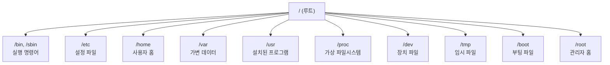
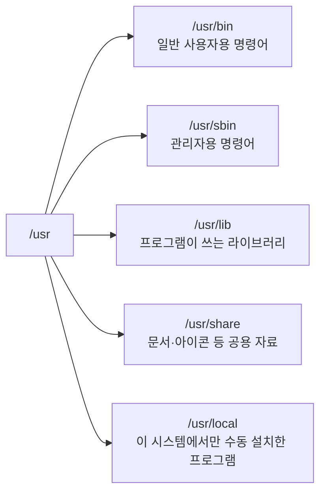

<Callout type="info">
  **이번 문서의 목표:** 이 파일을 다 읽으면 `/` 아래 각 디렉터리가 왜 그 자리에 있고 무엇을 담당하는지 설명할 수 있고, `/proc`·`/dev`가 일반 디렉터리와 무엇이 다른지 구분할 수 있다.
</Callout>

## 왜 디렉터리 구조를 표준으로 정했는가

Windows에서는 프로그램을 설치하면 보통 `C:\Program Files`에 실행 파일이, 사용자 문서는 `C:\Users\사용자이름`에 쌓인다. 이것도 일종의 관례지만, 배포사마다 조금씩 다르게 지켜도 큰 문제가 없다.

리눅스는 사정이 다르다. 레드햇(Red Hat) 계열, 데비안(Debian) 계열, 그 밖의 수많은 배포판(distribution, 커널에 여러 소프트웨어를 묶어 배포하는 하나의 패키지 — 자세한 내용은 03편)이 전 세계에서 독립적으로 만들어진다. 만약 배포판마다 "설정 파일은 여기, 로그는 저기"를 제멋대로 정한다면, 한 배포판에서 익힌 지식이 다른 배포판에서는 쓸모없어진다. 소프트웨어를 만드는 회사 입장에서도 "이 프로그램의 설정 파일은 반드시 `/etc` 아래 둔다"는 약속이 없으면, 배포판마다 설치 스크립트를 따로 짜야 한다.

이 문제를 풀기 위해 리눅스 재단(Linux Foundation)이 이어받아 관리하는 **FHS**(Filesystem Hierarchy Standard, 파일시스템 계층 표준)라는 규격이 있다. FHS는 "이런 종류의 파일은 이 디렉터리에 두어야 한다"는 규칙을 정해 둔 문서다. 모든 배포판이 FHS를 100퍼센트 그대로 따르지는 않지만, 핵심 디렉터리(`/etc`, `/var`, `/usr`, `/home` 등)의 용도는 사실상 모든 주요 배포판이 동일하게 지킨다. 그래서 우분투에서 배운 "설정 파일은 `/etc`에 있다"는 지식이 CentOS에서도 그대로 통한다.

> **쉽게 말하면:** FHS는 "리눅스라면 이 폴더에는 이런 파일을 넣자"는 전 세계 공통 약속이다.

## 루트(`/`)에서 시작하는 트리 구조

리눅스는 Windows처럼 `C:`, `D:` 같은 드라이브 문자를 여러 개 쓰지 않는다. 대신 모든 파일과 디렉터리가 **루트**(root, 뿌리라는 뜻으로 트리 구조의 맨 꼭대기)라는 단 하나의 최상위 디렉터리 아래 하나의 나무처럼 연결된다. 이 최상위 디렉터리는 슬래시(`/`) 기호 하나로 표기한다.

USB 메모리를 꽂거나 새 하드디스크를 추가해도 Windows처럼 `E:` 같은 새 드라이브 문자가 생기지 않는다. 대신 그 저장장치는 트리 안의 특정 디렉터리에 "연결"(마운트, mount — 자세한 계산과 명령어는 10편에서 다룬다)되어, 마치 원래부터 그 자리에 있던 폴더처럼 보이게 된다. 예를 들어 USB를 `/media/usb`라는 디렉터리에 마운트하면, `/media/usb` 안으로 들어가는 것이 곧 USB 안으로 들어가는 것이다.

이 구조를 그림으로 보면 다음과 같다.



> **쉽게 말하면:** Windows의 여러 드라이브(C:, D:)와 달리, 리눅스는 `/` 하나의 뿌리에서 모든 것이 가지처럼 뻗어 나간다. 새 저장장치도 새 드라이브 문자가 아니라 이 나무의 한 가지(디렉터리)로 끼워 넣는다.

경로를 표기하는 방법도 두 가지다. `/etc/passwd`처럼 루트부터 시작해 전체 경로를 다 쓰는 것을 **절대경로**(absolute path)라 하고, 지금 있는 위치를 기준으로 `../etc/passwd`처럼 쓰는 것을 **상대경로**(relative path)라 한다(자세한 사용법은 07편). 이 편에서는 각 디렉터리를 항상 루트부터 시작하는 절대경로로 표기한다.

## FHS가 정한 핵심 디렉터리들

### `/etc` — 시스템 전체의 설정 파일

`/etc`는 "et cetera(기타 등등)"에서 왔다는 설이 널리 알려져 있지만, 현재 FHS의 공식 정의는 "**호스트별로 고유한 시스템 설정 파일**을 담는 곳"이다. 여기서 "호스트별로 고유하다"는 말은, 같은 프로그램이라도 이 컴퓨터에서는 A라는 설정으로, 저 컴퓨터에서는 B라는 설정으로 동작하게 만드는 값이 여기 저장된다는 뜻이다.

`/etc` 안에는 실행 파일이 없다. 오직 텍스트로 된 설정 파일만 있다. 예를 들면 다음과 같다.

| 파일 경로 | 담는 내용 |
|---|---|
| `/etc/passwd` | 시스템에 등록된 사용자 계정 목록 (12편에서 필드별로 자세히 다룬다) |
| `/etc/fstab` | 부팅 시 자동으로 마운트할 파일시스템 목록 (10편) |
| `/etc/hosts` | 호스트 이름과 IP 주소를 미리 짝지어 두는 파일 |
| `/etc/hostname` | 이 컴퓨터 자신의 이름 |
| `/etc/profile` | 모든 사용자에게 적용되는 셸 환경설정 (19편) |

`/etc`의 파일들은 대부분 관리자(root)만 수정할 수 있다. 시스템 전체의 동작 방식을 바꾸는 파일이므로, 일반 사용자가 함부로 고치면 시스템 전체가 오동작할 수 있기 때문이다.

### `/var` — 시간이 지나며 계속 변하는 데이터

`/var`는 "variable(가변적인)"의 줄임말이다. `/etc`가 "관리자가 설정해 두면 잘 안 바뀌는 파일"을 담는다면, `/var`는 정반대로 **시스템이 돌아가는 동안 계속 내용이 늘어나거나 바뀌는 파일**을 담는다.

| 하위 디렉터리 | 담는 내용 |
|---|---|
| `/var/log` | 시스템과 각종 서비스가 남기는 로그(log, 발생한 사건을 시간 순서로 기록한 파일) |
| `/var/spool` | 아직 처리되지 않고 대기 중인 인쇄 작업, 메일, 예약 작업(cron, 21편) 등 |
| `/var/www` | 웹 서버가 사용자에게 보여줄 웹페이지 파일 (배포판에 따라 위치가 다를 수 있다) |
| `/var/cache` | 프로그램이 다시 계산하지 않도록 임시로 저장해 두는 캐시 데이터 |

시스템에 문제가 생겼을 때 가장 먼저 들여다보는 곳이 `/var/log`다. 예를 들어 로그인이 계속 실패한 기록, 어떤 서비스가 언제 멈췄는지 같은 정보가 시간 순서대로 여기 쌓인다.

### `/usr` — 배포판이 설치해 준 프로그램들

`/usr`는 "user"의 줄임말처럼 보이지만, 실제로는 사용자 개인 파일과 무관하다. 역사적으로는 "Unix System Resources"에 가까운 의미로 굳어졌다. 이 안에는 **배포판의 패키지 관리자(rpm, dnf, apt 등 — 17편)를 통해 설치된 프로그램들의 실행 파일, 라이브러리, 문서, 아이콘** 등이 들어간다.



헷갈리기 쉬운 것이 `/bin`과 `/usr/bin`의 관계다. 과거에는 "시스템을 부팅하는 데 반드시 필요한 최소한의 명령어"는 루트 파일시스템 바로 아래 `/bin`에, "부팅 이후 추가로 쓰는 명령어"는 `/usr/bin`에 나누어 두었다. 이는 `/usr`가 별도의 파티션에 있어 아직 마운트되지 않은 상태에서도 시스템이 부팅될 수 있게 하려는 설계였다. 하지만 최근 배포판(RHEL 7 이후, 우분투 최신 버전 등)은 이 구분을 없애고 `/bin`을 `/usr/bin`을 가리키는 심볼릭 링크(07편에서 다룬 바로가기 파일)로 통합했다. 시험에서는 "`/bin`과 `/usr/bin`이 최신 배포판에서 통합되는 추세"라는 사실 정도를 알아 두면 충분하다.

### `/home`과 `/root` — 사용자의 개인 공간

`/home`은 **일반 사용자 각자의 개인 파일**이 저장되는 디렉터리다. 사용자 `ihduser`를 새로 만들면 보통 `/home/ihduser`라는 디렉터리가 그 사용자의 개인 공간(홈 디렉터리, home directory)으로 자동 생성된다. 이 안에 바탕화면 설정, 다운로드한 파일, 개인 설정 파일(`.bashrc` 등 — 19편)이 쌓인다.

주의할 점은 **관리자 계정 root의 홈 디렉터리는 `/home` 안에 있지 않고 `/root`라는 별도의 디렉터리**라는 점이다. 이렇게 분리해 둔 이유는, 시스템이 정상적으로 부팅되지 않아 `/home`이 마운트되지 않는 응급 상황에서도, root는 자기 홈 디렉터리(`/root`)에 접근해 시스템을 복구할 수 있어야 하기 때문이다. `/home`이 별도 파티션인 경우가 흔한데, 그 파티션이 고장 나도 관리자 작업 공간만은 살아 있게 하려는 설계다.

> **쉽게 말하면:** `/home`은 일반 손님방들이 모인 층이고, `/root`는 그 층과 분리된 관리인 전용 방이다.

### 그 밖에 자주 나오는 디렉터리

| 디렉터리 | 용도 |
|---|---|
| `/bin`, `/sbin` | 기본 실행 명령어(`/sbin`은 관리자 전용 명령어) |
| `/boot` | 커널 파일과 부트로더(GRUB) 설정 — 04·05편에서 다룬 부팅 과정의 시작점 |
| `/tmp` | 누구나 쓸 수 있는 임시 파일 저장소. 재부팅하면 비워지는 경우가 많다 |
| `/opt` | 배포판 패키지 관리자를 거치지 않고 독립적으로 설치한 대형 소프트웨어 패키지 |
| `/mnt`, `/media` | 외부 저장장치나 임시 파일시스템을 마운트하는 관례적 위치 |
| `/lib`, `/lib64` | 시스템 부팅과 기본 명령어 실행에 필요한 공유 라이브러리 |

## 가상 파일시스템: `/proc`과 `/dev`

지금까지 본 디렉터리들은 모두 디스크 위에 실제로 저장된 파일이다. 그런데 `/proc`과 `/dev`는 성격이 완전히 다르다. 이 둘은 **가상 파일시스템**(virtual filesystem)이다.

> **쉽게 말하면:** `/proc`과 `/dev`는 디스크에 저장된 파일이 아니라, 커널이 메모리 위에서 "파일처럼 보이게" 실시간으로 만들어 내는 창구다.

### `/proc` — 커널과 프로세스의 실시간 정보 창구

`/proc`은 "process(프로세스)"의 줄임말이다. 리눅스 커널(kernel, 하드웨어와 소프트웨어 사이에서 자원을 관리하는 운영체제의 핵심 부분)은 현재 실행 중인 모든 프로세스(program이 실행되어 메모리에 올라간 상태 — 자세한 개념은 13편)의 정보와, CPU·메모리 같은 시스템 자원의 현재 상태를 `/proc` 아래에 마치 파일처럼 보여 준다.

예를 들어 `/proc/cpuinfo`를 열어 보면 이 컴퓨터의 CPU 정보가 텍스트로 나온다. 하지만 이 파일은 하드디스크 어딘가에 저장되어 있는 게 아니다. 이 파일을 읽는 순간, 커널이 "지금 이 순간의 CPU 정보"를 그 자리에서 만들어 응답으로 돌려준다. 그래서 `/proc/cpuinfo`의 파일 크기를 확인해 보면 0바이트로 나오는 경우가 많다 — 디스크에 저장된 실체가 없기 때문이다.

| 파일·디렉터리 | 담는 정보 |
|---|---|
| `/proc/cpuinfo` | CPU의 종류, 코어 수, 클럭 속도 |
| `/proc/meminfo` | 전체 메모리 용량과 현재 사용량 |
| `/proc/[PID]` | PID(프로세스 고유 번호)별로 그 프로세스의 상태 정보를 담은 디렉터리 |
| `/proc/version` | 커널 버전 정보 |

### `/dev` — 하드웨어 장치를 파일처럼 다루는 창구

리눅스의 근본 철학 중 하나가 "모든 것은 파일이다(everything is a file)"이다. 하드디스크, USB, 키보드, 마우스 같은 물리적 장치조차 `/dev` 아래에 파일처럼 표현해, 프로그램이 일반 파일을 읽고 쓰는 것과 똑같은 방식(`cat`, `>` 같은 명령)으로 장치에 접근할 수 있게 한다.

| 장치 파일 | 의미 |
|---|---|
| `/dev/sda` | 첫 번째로 인식된 SATA·SCSI 방식 저장장치 전체 |
| `/dev/sda1` | `/dev/sda`의 첫 번째 파티션 |
| `/dev/null` | 아무것도 저장하지 않고 그냥 버리는 가상 장치. 출력을 버리고 싶을 때 사용 |
| `/dev/tty` | 현재 사용 중인 터미널 |

`/dev` 역시 디스크에 실체 파일이 저장된 게 아니라, 커널이 인식한 장치 목록을 기반으로 실시간으로 채워지는 가상 파일시스템이다(정확히는 `devtmpfs`라는 방식으로 관리된다). 장치 설정에 대한 더 자세한 내용은 18편에서 다룬다.

## 직접 해보기

<Callout type="info">
  00편에서 만든 Rocky Linux 컨테이너에서 진행합니다. 아직 안 만들었다면 00편을 먼저 보세요.
</Callout>

`ls`로 최상위 구조와 `/etc`·`/var` 안을 직접 눈으로 확인하고, `/proc`이 디스크에 없는 가상 파일시스템이라는 것을 체감한다.

```bash
ls /
ls /etc | head
ls /var
cat /proc/cpuinfo | head
cat /proc/meminfo | head
```

**무엇을 보아야 하나**: `ls /`에서 이 편에서 배운 `etc`·`var`·`usr`·`home`·`proc`·`dev` 등이 실제로 나열되는지 본다. `/proc/cpuinfo`·`/proc/meminfo`가 마치 텍스트 파일처럼 읽히는지, 그런데도 이 파일이 디스크 어딘가에 저장된 실체가 아니라는 점을 떠올려 본다.

> **왜 이걸 해보나:** "`/proc`은 디스크에 저장된 설정 파일이다"는 기출 단골 오답이다. 직접 읽어 보면 진짜처럼 보이는 이 파일이 사실 커널이 그 순간 만들어 낸 정보라는 게 와닿는다.

## 자주 틀리는 점

reference 기출·모의고사 자료를 분석하면, 이 단원은 단순 암기형("이 디렉터리는 무슨 용도인가")보다 **여러 디렉터리를 동시에 제시하고 그중 틀린 설명을 고르는 형식**이 자주 나온다. 특히 다음 세 가지 착각을 노린 오답이 반복된다.

1. **`/etc`와 `/var`를 바꿔치기한 오답.** "`/etc`에는 로그 파일이 저장된다" 같은 문장은 틀렸다. 로그는 `/var/log`다. `/etc`는 "설정"(고정), `/var`는 "가변 데이터"(계속 변함)라는 대비로 기억해야 헷갈리지 않는다.
2. **`/root`와 `/home`을 혼동.** "관리자(root)의 홈 디렉터리는 `/home/root`다"는 틀린 설명이다. 관리자 홈은 `/home`과 별개인 `/root`다.
3. **`/proc`, `/dev`를 일반 디렉터리처럼 서술.** "`/proc/cpuinfo`는 디스크에 저장된 설정 파일이다" 같은 문장은 틀렸다. 가상 파일시스템이라는 성격 — 커널이 실시간으로 만들어 내는 정보라는 점 — 을 묻는 문항이 반복된다.

## 핵심 정리

- 리눅스는 `/`(루트) 하나의 트리 구조로 모든 파일시스템을 통합하며, 새 저장장치는 드라이브 문자가 아니라 트리의 한 지점에 마운트된다.
- FHS는 배포판이 달라도 `/etc`(설정)·`/var`(가변 데이터)·`/usr`(설치된 프로그램)·`/home`(사용자 개인 공간)의 역할이 같도록 정한 표준이다.
- 관리자(root)의 홈 디렉터리는 `/home`이 아니라 별도의 `/root`이며, 이는 `/home` 파티션 장애 시에도 복구 작업을 할 수 있게 하려는 설계다.
- `/proc`과 `/dev`는 디스크 파일이 아니라 커널이 실시간으로 만들어 내는 가상 파일시스템이다.

## 마무리 복습

<Quiz
  questionNumber={1}
  question="FHS(Filesystem Hierarchy Standard)가 존재하는 가장 근본적인 이유로 알맞은 것은?"
  options={['CPU 처리 속도를 높이기 위해서', '서로 다른 배포판 사이에서도 디렉터리 용도를 일관되게 유지하기 위해서', '디스크 용량을 절약하기 위해서', '네트워크 전송 속도를 높이기 위해서']}
  correctAnswer={2}
  explanation="FHS는 레드햇 계열, 데비안 계열 등 서로 다른 배포판이라도 핵심 디렉터리(/etc, /var, /usr, /home)의 용도를 통일해, 한 배포판에서 익힌 지식이 다른 배포판에서도 통하게 하려는 표준이다."
  optionExplanations={['FHS는 디렉터리 구조에 대한 표준이며 처리 속도와는 무관하다', '정답이다', 'FHS는 파일이 어디에 위치해야 하는지를 정할 뿐 압축이나 용량 절약과는 무관하다', 'FHS는 로컬 파일시스템 구조에 대한 표준으로 네트워크 전송과는 무관하다']}
/>

<Quiz
  questionNumber={2}
  question="다음 중 시스템이 실행되는 동안 계속 내용이 늘어나거나 바뀌는 로그·메일 대기열 등을 담는 디렉터리로 알맞은 것은?"
  options={['/etc', '/usr', '/var', '/boot']}
  correctAnswer={3}
  explanation="/var는 variable(가변적인)의 줄임말로, 시스템이 운영되는 동안 계속 변화하는 로그(/var/log), 예약 작업 대기열(/var/spool) 등을 담는다."
  optionExplanations={['/etc는 좀처럼 바뀌지 않는 설정 파일을 담는 곳이다', '/usr는 패키지 관리자로 설치된 프로그램의 실행 파일과 라이브러리를 담는 곳이다', '정답이다', '/boot는 커널과 부트로더 파일을 담는 곳으로 가변 데이터와는 성격이 다르다']}
/>

<Quiz
  questionNumber={3}
  question="관리자 계정 root의 홈 디렉터리 위치로 알맞은 것은?"
  options={['/home/root', '/root', '/usr/root', '/etc/root']}
  correctAnswer={2}
  explanation="root의 홈 디렉터리는 일반 사용자들이 모인 /home 안이 아니라, /home과 별개인 최상위 디렉터리 /root다. /home이 마운트되지 않는 응급 상황에서도 관리자가 작업할 수 있게 하려는 설계다."
  optionExplanations={['일반 사용자의 홈 디렉터리 위치와 헷갈린 오답이다. root는 /home 아래 있지 않다', '정답이다', '/usr는 설치된 프로그램을 담는 곳으로 사용자 홈 디렉터리와 무관하다', '/etc는 설정 파일을 담는 곳으로 홈 디렉터리와 무관하다']}
/>

<Quiz
  questionNumber={4}
  question="/proc 디렉터리에 대한 설명으로 옳은 것은?"
  options={['하드디스크에 실제로 저장된 일반 설정 파일의 모음이다', '커널이 프로세스와 시스템 자원의 정보를 실시간으로 만들어 보여 주는 가상 파일시스템이다', '사용자가 내려받은 프로그램을 설치하는 위치다', '삭제된 파일을 임시로 보관하는 휴지통이다']}
  correctAnswer={2}
  explanation="/proc은 디스크에 실체 파일이 있는 것이 아니라, 커널이 현재 실행 중인 프로세스와 CPU·메모리 등의 상태를 그 순간 만들어 파일처럼 보여 주는 가상 파일시스템이다."
  optionExplanations={['/proc의 파일은 디스크에 저장된 실체가 없다는 점이 핵심 특징이다', '정답이다', '프로그램 설치 위치는 /usr나 /opt 등이며 /proc과는 무관하다', '리눅스에는 Windows의 휴지통과 같은 개념이 기본으로 없으며 /proc과도 무관하다']}
/>

<Quiz
  questionNumber={5}
  question="다음 중 배포판의 패키지 관리자를 거치지 않고 관리자가 수동으로 내려받아 컴파일한 소프트웨어를 설치하는 관례적 위치로 가장 알맞은 것은?"
  options={['/usr/bin', '/opt', '/var/cache', '/proc']}
  correctAnswer={2}
  explanation="/opt는 rpm·dnf·apt 같은 패키지 관리자를 거치지 않고 독립적으로 설치하는 대형 소프트웨어 패키지를 담는 관례적 위치다."
  optionExplanations={['/usr/bin은 패키지 관리자로 설치된 프로그램의 실행 파일이 위치하는 곳이다', '정답이다', '/var/cache는 프로그램이 재계산을 피하려고 저장하는 캐시 데이터가 위치하는 곳이다', '/proc은 가상 파일시스템으로 소프트웨어 설치와는 무관하다']}
/>

<Quiz
  questionNumber={6}
  question="다음 설명 중 틀린 것은?"
  options={['/etc는 시스템 설정 파일을 담는 디렉터리다', '/dev는 하드웨어 장치를 파일처럼 다룰 수 있게 해 주는 디렉터리다', '/etc에는 시스템의 모든 로그 파일이 시간순으로 저장된다', '/home에는 일반 사용자 각자의 개인 파일이 저장된다']}
  correctAnswer={3}
  explanation="로그 파일은 /etc가 아니라 /var/log에 저장된다. /etc는 좀처럼 바뀌지 않는 설정 파일을 담고, /var가 계속 변화하는 데이터(로그 포함)를 담는다는 대비를 혼동시키는 전형적인 오답 패턴이다."
  optionExplanations={['옳은 설명이다', '옳은 설명이다', '틀린 설명이므로 정답이다 — 로그는 /var/log에 저장된다', '옳은 설명이다']}
/>

<Quiz
  questionNumber={7}
  question="`/bin`과 `/usr/bin`의 관계에 대한 설명으로 가장 알맞은 것은?"
  options={['/bin은 관리자 전용, /usr/bin은 일반 사용자 전용으로 완전히 분리되어 있다', '과거에는 부팅 필수 명령어와 그 외 명령어로 나뉘었으나, 최신 배포판은 /bin을 /usr/bin의 심볼릭 링크로 통합하는 추세다', '/bin은 가상 파일시스템이고 /usr/bin은 실제 디스크 파일시스템이다', '/bin은 로그 파일 전용, /usr/bin은 설정 파일 전용 디렉터리다']}
  correctAnswer={2}
  explanation="과거에는 부팅에 반드시 필요한 최소 명령어를 /bin에, 그 외 명령어를 /usr/bin에 나눠 두었지만, RHEL 7 이후·최신 우분투 등은 이 구분을 없애고 /bin을 /usr/bin을 가리키는 심볼릭 링크로 통합하는 추세다."
  optionExplanations={['관리자 전용 명령어는 /sbin이며 /bin과 /usr/bin의 구분 기준은 사용자 권한이 아니다', '정답이다', '/bin과 /usr/bin은 둘 다 디스크에 실제로 존재하는 파일시스템 경로다', '두 디렉터리 모두 로그나 설정 파일이 아닌 실행 명령어를 담는 곳이다']}
/>

## 참고 자료

- [Filesystem Hierarchy Standard (FHS)](https://refspecs.linuxfoundation.org/fhs.shtml)
- [The Linux Documentation Project](https://tldp.org)
