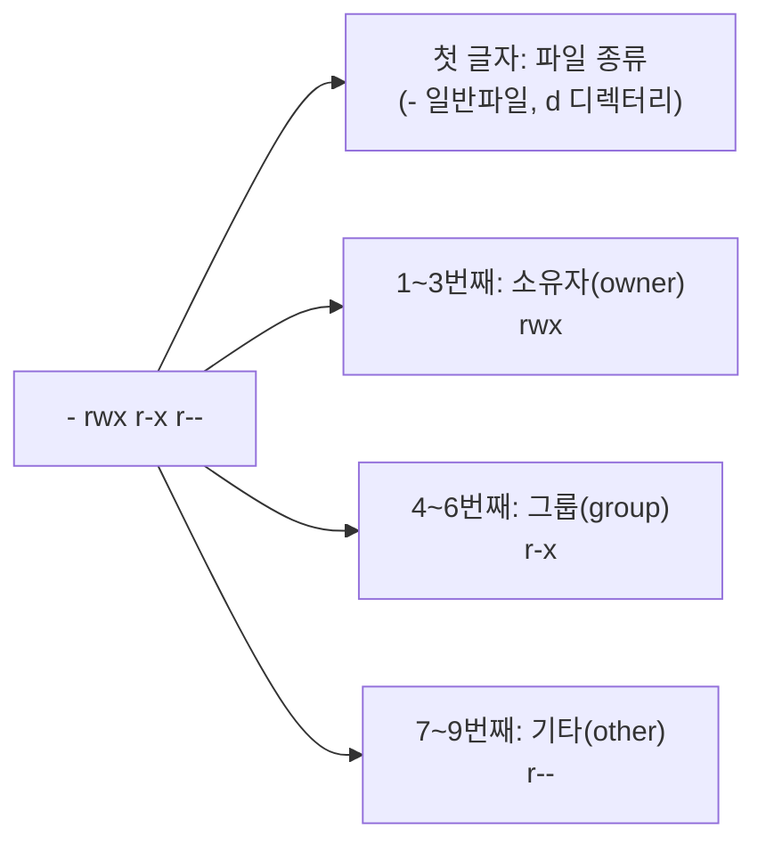

<Callout type="info">
  **이번 문서의 목표:** 이 파일을 다 읽으면 `rwxr-xr--` 같은 기호 표기를 8진수로, 8진수를 다시 기호 표기로 즉시 변환할 수 있고, 임의의 umask 값이 주어졌을 때 새로 생성되는 파일·디렉터리의 권한을 직접 계산할 수 있으며, SetUID·SetGID·스티키 비트가 각각 무엇을 바꾸는지 설명할 수 있다.
</Callout>

## 왜 권한이라는 개념이 필요한가

리눅스는 원래부터 **여러 사람이 하나의 컴퓨터를 함께 쓰는 것**을 전제로 설계되었다(다중 사용자 시스템, multi-user system). 학교 실습실의 리눅스 서버에 수십 명의 학생이 각자 계정으로 접속한다고 생각해 보자. 만약 아무런 제약이 없다면, 어떤 학생이 실수로(또는 고의로) 다른 학생의 과제 파일을 지우거나, 시스템 설정 파일(09편에서 다룬 `/etc` 아래 파일들)을 함부로 고쳐 서버 전체를 망가뜨릴 수 있다.

이 문제를 막기 위해 리눅스는 **모든 파일과 디렉터리에 "누가 무엇을 할 수 있는가"를 표시하는 권한(permission) 정보**를 붙여 둔다. `ls -l` 명령으로 파일 목록을 보면 맨 앞에 나오는 문자열이 바로 이 권한 정보다.

```bash
$ ls -l report.txt
-rwxr-xr-- 1 ihduser project 4096 Sep  1 10:00 report.txt
```

> **쉽게 말하면:** 권한은 "이 파일에 대해 누구는 읽기만, 누구는 읽고 쓰기까지, 누구는 아예 접근 불가"를 정해 두는 출입증 시스템이다.

## 소유자·그룹·기타의 3자 구조

리눅스는 파일에 접근하려는 사람을 딱 세 부류로만 나눈다. 이 셋을 넘어서는 세분화(예: "이 사람에게만 읽기 허용")는 기본 권한 체계로는 할 수 없다(더 세밀한 제어가 필요하면 ACL이라는 별도 기능을 쓰지만, 이는 2급 1차 범위를 넘어선다).

| 구분 | 영어 표현 | 의미 |
|---|---|---|
| 소유자 | owner (user) | 이 파일을 만들었거나 소유권을 넘겨받은 단 한 명의 사용자 |
| 그룹 | group | 소유자가 속한 그룹에 함께 속한 사용자들 (그룹의 개념은 12편에서 자세히 다룬다) |
| 기타 | other | 소유자도 아니고 그 그룹에도 속하지 않은, 그 밖의 모든 사용자 |

`ls -l`의 출력에서 `-rwxr-xr--` 문자열은 이 세 부류에 각각 3칸씩, 총 9칸으로 나뉜다. 맨 앞의 한 글자는 파일 종류를 나타내는 별도 칸이다(`-`는 일반 파일, `d`는 디렉터리, `l`은 심볼릭 링크).



각 3칸 안에서 순서는 항상 고정이다. 첫 칸이 **r**(read, 읽기), 둘째 칸이 **w**(write, 쓰기), 셋째 칸이 **x**(execute, 실행)다. 권한이 없으면 그 자리에 `-`가 온다.

| 기호 | 의미 | 파일에 적용될 때 | 디렉터리에 적용될 때 |
|---|---|---|---|
| `r` | 읽기 | 파일 내용을 볼 수 있다 | 디렉터리 안의 파일 목록을 볼 수 있다 (`ls`) |
| `w` | 쓰기 | 파일 내용을 수정·삭제할 수 있다 | 디렉터리 안에 파일을 생성·삭제할 수 있다 |
| `x` | 실행 | 그 파일을 프로그램으로 실행할 수 있다 | 그 디렉터리 안으로 들어가거나 안의 파일에 접근할 수 있다 (자세한 이유는 아래에서 다룬다) |

## 기호 표기와 8진수 표기 — 자리별로 완전히 펼쳐 보기

리눅스 명령어에서 권한을 다룰 때는 `rwxr-xr--`처럼 문자로 쓰는 **기호 표기**(symbolic notation)와, `754`처럼 숫자 세 자리로 쓰는 **8진수 표기**(octal notation) 두 가지를 함께 쓴다. 이 둘을 자유롭게 오가는 것이 이 단원에서 가장 중요한 계산 능력이다.

> **쉽게 말하면:** 기호 표기는 "읽기 있음, 쓰기 있음, 실행 없음"을 글자로 나열한 것이고, 8진수 표기는 같은 정보를 숫자 하나로 압축한 것이다.

### 왜 하필 8진수인가

각 칸(r, w, x)은 "있다/없다" 두 가지 상태만 가지는 하나의 스위치, 즉 **1비트**(bit)다. 한 부류(소유자·그룹·기타)당 스위치가 3개씩 있으므로, 한 부류의 상태는 3비트로 표현된다. 3비트로 표현할 수 있는 값의 범위는 2진수로 `000`부터 `111`까지, 즉 10진수로 0부터 7까지다. 그리고 이 3비트를 그대로 10진수처럼 다루면 8진수(0~7) 표기가 된다. 그래서 리눅스 권한은 "0부터 7까지의 숫자 하나가 정확히 3개의 온/오프 스위치 상태를 표현하는" 8진수 체계를 쓴다.

각 자리의 값은 다음 공식으로 계산한다.

$$
\text{8진수 값} = (r \times 4) + (w \times 2) + (x \times 1)
$$

- $r$, $w$, $x$는 각각 그 권한이 있으면 1, 없으면 0이다.
- $r$의 자리값이 4, $w$의 자리값이 2, $x$의 자리값이 1인 이유는 2진수 `100`(4) · `010`(2) · `001`(1)에서 그대로 온 것이다 — 세 스위치가 동시에 켜지는 경우가 없도록(자릿수가 겹치지 않도록) 이진법의 자리값을 그대로 쓴 것이다.

### 기호 → 8진수: `rwxr-xr--`를 자리별로 전부 펼치기

`rwxr-xr--`를 8진수로 바꾸는 과정을 소유자·그룹·기타 세 구간으로 나누어, 한 글자도 건너뛰지 않고 전부 펼쳐 본다.

**1단계 — 소유자(owner) 구간: `rwx`**

| 권한 | 있음/없음 | 자리값 |
|---|---|---|
| `r` | 있음(1) | 4 |
| `w` | 있음(1) | 2 |
| `x` | 있음(1) | 1 |

$$
4 + 2 + 1 = 7
$$

**2단계 — 그룹(group) 구간: `r-x`**

| 권한 | 있음/없음 | 자리값 |
|---|---|---|
| `r` | 있음(1) | 4 |
| `w` | 없음(0) | 0 |
| `x` | 있음(1) | 1 |

$$
4 + 0 + 1 = 5
$$

**3단계 — 기타(other) 구간: `r--`**

| 권한 | 있음/없음 | 자리값 |
|---|---|---|
| `r` | 있음(1) | 4 |
| `w` | 없음(0) | 0 |
| `x` | 없음(0) | 0 |

$$
4 + 0 + 0 = 4
$$

**4단계 — 세 구간을 순서대로 이어 붙인다.**

$$
7,\ 5,\ 4 \;\rightarrow\; 754
$$

즉 `rwxr-xr--`는 8진수 **754**다.

### 8진수 → 기호: 반대 방향으로 검산하기

방금 얻은 754가 맞는지 확인하려면, **거꾸로 754를 다시 기호 표기로 되돌려서** 원래 문자열과 일치하는지 봐야 한다.

**1단계 — 각 자리 숫자를 4, 2, 1로 다시 쪼갠다.**

| 자리 | 숫자 | 4로 나눈 몫 | 남은 값 | 2로 나눈 몫 | 남은 값 | 1로 나눈 몫|
|---|---|---|---|---|---|---|
| 소유자 | 7 | 1 (r 있음) | 3 | 1 (w 있음) | 1 | 1 (x 있음) |
| 그룹 | 5 | 1 (r 있음) | 1 | 0 (w 없음) | 1 | 1 (x 있음) |
| 기타 | 4 | 1 (r 있음) | 0 | 0 (w 없음) | 0 | 0 (x 없음) |

**2단계 — 있음(1)/없음(0)을 다시 r, w, x 글자로 바꾼다.**

- 소유자: r 있음, w 있음, x 있음 → `rwx`
- 그룹: r 있음, w 없음, x 있음 → `r-x`
- 기타: r 있음, w 없음, x 없음 → `r--`

**3단계 — 이어 붙인다.**

$$
rwx + r\text{-}x + r\text{--} \;\rightarrow\; rwxr\text{-}xr\text{--}
$$

원래 문자열 `rwxr-xr--`와 정확히 일치한다. **검산 완료.**

### 연습 하나 더 — 8진수 640을 기호로

이번에는 8진수에서 시작해 보자. `640`을 자리별로 4·2·1로 쪼갠다.

- 소유자 자리 `6` = 4(r) + 2(w) + 0(x 없음) → `rw-`
- 그룹 자리 `4` = 4(r) + 0(w 없음) + 0(x 없음) → `r--`
- 기타 자리 `0` = 권한 전혀 없음 → `---`

이어 붙이면 `rw-r-----`이다. **역방향 검산**: `rw-r-----`을 다시 8진수로 바꾸면 소유자 `rw-`=4+2=6, 그룹 `r--`=4, 기타 `---`=0이므로 640이 그대로 나온다. 일치한다.

## chmod·chown·chgrp — 권한과 소유권을 바꾸는 명령

### chmod — 권한 변경

**chmod**(change mode)는 권한을 바꾸는 명령이며, 8진수 방식과 기호 방식 두 가지로 쓸 수 있다.

```bash
# 8진수 방식 — 전체 권한을 한 번에 지정
chmod 754 report.txt

# 기호 방식 — 특정 부류의 특정 권한만 추가·제거
chmod u+x report.txt      # 소유자(u)에게 실행 권한 추가
chmod g-w report.txt      # 그룹(g)에서 쓰기 권한 제거
chmod o=r report.txt      # 기타(o)의 권한을 읽기 전용으로 지정(=은 있는 그대로 대입)
chmod a+r report.txt      # 모두(a, all)에게 읽기 권한 추가
```

기호 방식에서 대상 지정 문자는 `u`(user, 소유자), `g`(group, 그룹), `o`(other, 기타), `a`(all, 전체) 네 가지이고, 연산자는 `+`(추가), `-`(제거), `=`(지정한 값으로 대체) 세 가지다.

디렉터리와 그 안의 모든 파일·하위 디렉터리에 한꺼번에 권한을 적용하려면 `-R`(recursive, 재귀적) 옵션을 쓴다.

```bash
chmod -R 755 data
```

reference 기출에서 `-r`(소문자)과 `-R`(대문자)을 헷갈리게 하는 오답이 등장한다. `chmod`에서 재귀 옵션은 **반드시 대문자 `-R`**이다. 소문자 `-r`은 `chmod`에 존재하지 않는 옵션이다.

### chown·chgrp — 소유권 변경

**chown**(change owner)은 소유자를, 필요하면 그룹까지 동시에 바꾼다. **chgrp**(change group)는 그룹만 바꾼다.

```bash
# 소유자만 변경
chown ihduser report.txt

# 소유자와 그룹을 동시에 변경 (콜론으로 구분, 소유자가 앞)
chown ihduser:kait report.txt

# 그룹만 변경
chgrp kait report.txt
```

`chown 소유자:그룹` 형식에서 **콜론 앞이 소유자, 뒤가 그룹**이라는 순서를 정확히 기억해야 한다. reference 기출에서 "그룹 소유권을 kait, 소유자는 ihduser로 설정하라"는 지문에 대해 `chown ihduser:kait`와 `chown kait:ihduser`를 헷갈리게 하는 선택지가 나온다. 지문을 다시 우리말로 옮기면 "소유자는 ihduser, 그룹은 kait"이므로 정답은 `chown ihduser:kait`이고, 순서를 뒤집은 `chown kait:ihduser`는 그룹과 소유자가 뒤바뀐 오답이다. 또한 존재하지 않는 명령어 `charp`를 `chown`이나 `chgrp`인 것처럼 섞어 놓는 오답 패턴도 반복되므로, 명령어 철자 자체를 정확히 기억해야 한다.

## umask 계산 — 왜 뺄셈처럼 보이는가

새 파일이나 디렉터리를 만들 때, 매번 `chmod`로 권한을 일일이 지정하지 않아도 시스템이 **기본 권한**을 자동으로 부여한다. 이 기본 권한을 결정하는 값이 **umask**(user mask, 사용자 마스크)다.

> **쉽게 말하면:** umask는 "새로 만드는 파일·디렉터리에 자동으로 빼놓을 권한 비트를 미리 정해 두는 값"이다.

### 파일과 디렉터리의 기본값이 왜 다른가

umask를 적용하기 전, 리눅스가 정해 둔 **최대 기본값**(umask 0000일 때 부여될 값)은 파일과 디렉터리가 서로 다르다.

| 대상 | 최대 기본값 | 이유 |
|---|---|---|
| 파일(file) | `666` (`rw-rw-rw-`) | 실행(`x`) 비트가 처음부터 빠져 있다. 텍스트 편집기로 새 문서를 하나 만들었는데 그 문서가 곧바로 "실행 가능한 프로그램"으로 취급되면 위험하다 — 악성 스크립트가 파일로 내려받이자마자 실행될 여지를 원천 차단하는 설계다. 실행 권한이 꼭 필요하면 사용자가 `chmod +x`로 **의도적으로** 추가해야 한다 |
| 디렉터리(directory) | `777` (`rwxrwxrwx`) | 디렉터리는 애초에 `x` 없이는 그 안으로 들어갈 수조차 없다(아래 절에서 자세히 설명). 디렉터리를 만든 목적 자체가 "그 안에 들어가서 무언가를 하기 위함"이므로, 실행(진입) 권한이 처음부터 빠지면 디렉터리로서 쓸모가 없어진다 |

### umask가 실제로 하는 일: "빼기"가 아니라 "끄기"

umask 값 자체도 권한과 똑같이 8진수 세 자리로 표기한다. 예를 들어 umask가 `022`라면, 이 `022`에서 **1로 켜진 비트에 해당하는 권한을, 기본값에서 강제로 꺼 버린다.**

이 동작의 정확한 이름은 **비트 AND 연산**(정확히는 "기본값 AND NOT(umask)")이다. umask 값에서 1인 비트 자리는 기본값에서도 그 자리를 0으로 만들고, umask 값에서 0인 비트 자리는 기본값을 그대로 둔다.

> **왜 뺄셈처럼 보이는가**: 겉보기에는 "666에서 022를 뺀 644"처럼 마치 자릿수별 뺄셈을 한 것처럼 보인다. 하지만 실제 연산은 뺄셈이 아니라 **비트를 하나씩 끄는 것**이다. 우연히 두 방식의 결과가 같아 보이는 이유는, umask로 끄려는 비트가 항상 "기본값에서 이미 켜져 있던 비트"이기 때문이다. 이미 켜진 비트 하나를 끄는 것은 자리값을 그대로 빼는 것과 결과가 같다(예: 켜져 있던 `w`(2)를 끄면 6에서 2를 뺀 4와 정확히 일치). 다만 이는 자릿내림(borrow)이 필요 없는 특수한 상황이라 뺄셈처럼 "보이는" 것일 뿐, 원리는 어디까지나 "**기본값에서 umask가 지정한 비트를 하나씩 끈다**"는 것이다.

### 계산 예시 1 — umask 022

**파일 (기본값 666)**

| 구간 | 기본값 (2진수) | umask 자리 | umask (2진수) | 결과 (2진수) | 결과 (8진수) |
|---|---|---|---|---|---|
| 소유자 | `110` (rw-) | `0` | `000` | `110` (그대로) | 6 |
| 그룹 | `110` (rw-) | `2` | `010` | `100` (w가 꺼짐) | 4 |
| 기타 | `110` (rw-) | `2` | `010` | `100` (w가 꺼짐) | 4 |

$$
666 \rightarrow 644 \; (rw\text{-}r\text{--}r\text{--})
$$

**디렉터리 (기본값 777)**

| 구간 | 기본값 (2진수) | umask 자리 | umask (2진수) | 결과 (2진수) | 결과 (8진수) |
|---|---|---|---|---|---|
| 소유자 | `111` (rwx) | `0` | `000` | `111` (그대로) | 7 |
| 그룹 | `111` (rwx) | `2` | `010` | `101` (w가 꺼짐) | 5 |
| 기타 | `111` (rwx) | `2` | `010` | `101` (w가 꺼짐) | 5 |

$$
777 \rightarrow 755 \; (rwxr\text{-}xr\text{-}x)
$$

**검산**: 결과 `rw-r--r--`(파일)을 다시 8진수로 환산하면 소유자 6, 그룹 4, 기타 4 → 644로 원래 계산과 일치한다. 디렉터리 `rwxr-xr-x`도 소유자 7, 그룹 5, 기타 5 → 755로 일치한다.

### 계산 예시 2 — umask 0027 (reference 모의고사 실제 출제 방식)

reference 자료(모의고사 659번)에는 "현재 umask 값이 0027인 상태에서 사용자가 새 디렉터리를 생성하였다. 생성된 디렉터리의 권한을 8진수로 나타내면?"이라는 형태의 문제가 등장한다. 같은 방식으로 풀어 본다.

**디렉터리 (기본값 777, umask 027)**

| 구간 | 기본값 (2진수) | umask 자리 | umask (2진수) | 결과 (2진수) | 결과 (8진수) |
|---|---|---|---|---|---|
| 소유자 | `111` (rwx) | `0` | `000` | `111` (그대로) | 7 |
| 그룹 | `111` (rwx) | `2` | `010` | `101` (w가 꺼짐) | 5 |
| 기타 | `111` (rwx) | `7` | `111` | `000` (전부 꺼짐) | 0 |

$$
777 \rightarrow 750 \; (rwxr\text{-}x\text{---})
$$

**검산**: `rwxr-x---`을 다시 8진수로 바꾸면 소유자 `rwx`=7, 그룹 `r-x`=5, 기타 `---`=0 → 750으로 일치한다.

## 특수 권한: SetUID·SetGID·스티키 비트

지금까지 다룬 9개 비트(소유자·그룹·기타 각 3개)만으로는 표현할 수 없는 세 가지 특별한 동작이 있다. 이를 위해 8진수 표기 **맨 앞에 네 번째 자리**를 추가로 쓴다.

> **쉽게 말하면:** 특수 권한은 "이 파일을 실행하는 동안 잠깐 다른 사람인 척하게 해 주는" 또는 "이 디렉터리 안에서는 남의 파일을 함부로 못 지우게 막는" 특별 스위치다.

### 8진수 앞자리와 기호의 대응

| 이름 | 8진수 앞자리 값 | 기호 표기 자리 | 의미 |
|---|---|---|---|
| SetUID (Set User ID) | 4 | 소유자 실행(x) 자리에 `s` | 이 실행 파일을 누가 실행하든, 실행되는 동안만큼은 **파일 소유자의 권한**으로 동작한다 |
| SetGID (Set Group ID) | 2 | 그룹 실행(x) 자리에 `s` | 실행 파일이면 **파일 그룹의 권한**으로 동작하고, 디렉터리면 그 안에 새로 생성되는 파일·하위 디렉터리가 **부모 디렉터리의 그룹 소유권을 자동으로 상속**한다 |
| 스티키 비트 (Sticky-Bit) | 1 | 기타 실행(x) 자리에 `t` | 디렉터리에 설정하면, 그 안의 파일을 **자신이 만든 사람(또는 그 파일의 소유자, 혹은 root)만 삭제·이름변경**할 수 있게 제한한다 |

세 값을 합산해 8진수 네 자리로 쓸 수도 있다. 예를 들어 SetUID와 일반 권한 755를 함께 주려면 `4755`처럼 앞자리에 4를 붙인다.

```bash
# SetUID 부여
chmod 4755 program
chmod u+s program

# SetGID 부여 (디렉터리에 걸어 그룹 상속시키는 경우가 흔하다)
chmod 2775 /project
chmod g+s /project

# 스티키 비트 부여 (공유 디렉터리에 흔히 사용, /tmp가 대표적 예)
chmod 1777 /tmp
chmod o+t /tmp
```

### 실전 예시로 검산하기 — `/usr/bin/passwd`

reference 모의고사(659번)에 등장한 예시를 그대로 계산해 검산해 본다.

```text
-rwsr-xr-x. 1 root root 35000 Jun  1 10:00 /usr/bin/passwd
```

**기호 → 8진수 변환**

| 구간 | 기호 | 자리값 계산 |
|---|---|---|
| 소유자 | `rws` | r(4) + w(2) + x(1, s로 표시) = 7 |
| 그룹 | `r-x` | r(4) + x(1) = 5 |
| 기타 | `r-x` | r(4) + x(1) = 5 |
| 특수 권한 | 소유자 자리의 `s` | SetUID = 4 |

$$
4,\ 7,\ 5,\ 5 \;\rightarrow\; 4755
$$

**검산(역방향)**: `4755`를 다시 풀면, 앞자리 4는 SetUID, 나머지 755는 `rwxr-xr-x`인데 SetUID가 소유자의 실행(x) 자리를 `s`로 바꾸므로 최종 기호는 `rwsr-xr-x`가 된다. 원래 `ls -l` 출력과 정확히 일치한다.

이 파일이 왜 SetUID를 갖는지도 함께 이해해야 한다. `passwd` 명령은 `/etc/shadow`(사용자 비밀번호가 암호화되어 저장된 파일 — 12편)를 수정해야 하는데, 이 파일은 root만 쓸 수 있다. 만약 SetUID가 없다면 일반 사용자는 자기 비밀번호조차 바꿀 수 없다. SetUID 덕분에 일반 사용자가 `passwd`를 실행하는 순간만큼은 root 권한을 빌려 `/etc/shadow`를 수정할 수 있게 된다.

### 대문자 S·T와 소문자 s·t의 차이

특수 권한 기호가 표시되는 자리는 원래 실행(`x`) 권한이 표시되던 자리와 같다. 그래서 **그 자리에 실행 권한이 원래 있었는지 없었는지에 따라 대문자와 소문자가 갈린다.**

| 상황 | 표시 |
|---|---|
| 실행 권한(`x`)이 있는 상태에서 SetUID/SetGID/스티키 비트를 추가 | 소문자 `s` 또는 `t` (실행 권한과 특수 권한이 공존한다는 뜻) |
| 실행 권한(`x`)이 없는 상태에서 SetUID/SetGID/스티키 비트를 추가 | 대문자 `S` 또는 `T` (특수 권한만 있고 실행 권한은 없다는 뜻 — 사실상 의미 없는 조합인 경우가 많다) |

예를 들어 어떤 파일의 소유자 실행 권한이 애초에 꺼져 있는데(`rw-`) 거기에 SetUID를 걸면 `rwS`로 표시된다. 대문자 `S`는 "SetUID는 켜져 있지만, 정작 실행 권한이 없어 이 SetUID가 실질적인 효과를 내지 못한다"는 경고에 가깝다. reference 기출에서 "소유자에게 실행 권한(x)이 없다면 s 대신 대문자 S로 표시된다"는 서술이 옳은 설명으로 등장하는데, 정확히 이 규칙을 가리킨다.

## 왜 디렉터리에서는 `x`가 "실행"이 아니라 "진입"을 뜻하는가

일반 파일에서 `x`는 그 파일을 프로그램으로 실행할 수 있는지를 의미했다. 그런데 디렉터리는 애초에 "실행"할 수 있는 대상이 아니다(디렉터리 자체를 프로그램처럼 구동시킬 수는 없다). 그런데도 왜 디렉터리에 `x` 비트가 존재할까.

그 답은 디렉터리의 내부 구조에 있다. 디렉터리는 사실 "그 안에 어떤 파일 이름이 있고, 그 이름이 어떤 inode 번호(파일의 실제 위치와 메타데이터를 가리키는 고유 번호 — 09·10편에서 다룬 개념)와 연결되어 있는가"를 기록해 둔 특수한 종류의 파일이다.

- **`r`(읽기) 권한**은 이 디렉터리 안에 "어떤 이름들이 들어 있는지" 목록을 볼 수 있게 해 준다(`ls`로 파일 이름들이 보인다).
- **`x`(실행) 권한**은 이 디렉터리 안으로 **들어가서**(`cd`), 그 안의 특정 이름 하나를 실제로 **찾아 접근**할 수 있게 해 준다. 정확히는, 어떤 경로(path)든 그 경로에 포함된 각 디렉터리를 하나씩 거쳐 갈 때마다 그 디렉터리에 대한 `x` 권한이 있어야, 커널이 "이 이름이 가리키는 파일이 어디 있는지"를 알아낼 수 있다.

이 둘은 완전히 독립적으로 작동한다. 만약 어떤 디렉터리에 `r`은 있지만 `x`가 없다면(`r--------` 같은 상태), `ls`로 파일 이름 목록은 볼 수 있어도, 그 이름으로 실제 파일을 열거나 그 디렉터리 안으로 `cd`할 수는 없다 — 이름은 보이는데 그 이름이 가리키는 실체에는 접근할 수 없는 상태다. 반대로 `x`만 있고 `r`이 없다면(`--x------`), 안에 어떤 파일이 있는지 목록은 볼 수 없지만, **이름을 이미 정확히 알고 있는 파일**이라면 그 파일에는 접근할 수 있다.

> **쉽게 말하면:** 디렉터리의 `r`은 "방 안에 있는 물건 목록표를 볼 수 있는 권한"이고, `x`는 "그 방문을 실제로 열고 들어갈 수 있는 권한"이다. 목록표만 봤다고 방에 들어갈 수 있는 건 아니고, 문을 열 수 있다고 목록표가 저절로 보이는 것도 아니다.

그래서 디렉터리의 기본 최대 권한이 파일과 달리 `777`인 이유도 다시 확인할 수 있다 — 디렉터리는 `x`(진입) 없이는 애초에 그 존재 목적을 다하지 못하는 자원이기 때문에, 파일처럼 `x`를 기본에서 빼 두지 않는다.

## 직접 해보기 1 — 권한 표기 변환

<Callout type="info">
  00편에서 만든 Rocky Linux 컨테이너에서 진행합니다. 아직 안 만들었다면 00편을 먼저 보세요.
</Callout>

파일을 하나 만들어 `chmod 754`를 걸고, `ls -l`로 정말 `rwxr-xr--`가 나오는지 확인한다. 이어서 기호 표기로 바꿔 보고 8진수가 어떻게 변하는지 `stat`으로 확인한다.

```bash
touch perm.txt
chmod 754 perm.txt
ls -l perm.txt
chmod u+x,g-w perm.txt
stat -c '%a %A' perm.txt
```

`stat -c '%a %A'`는 그 파일의 권한을 8진수(`%a`)와 기호 표기(`%A`)로 나란히 보여 주는 옵션이다.

**무엇을 보아야 하나**: 첫 `ls -l`의 앞 10칸이 본문에서 계산한 `rwxr-xr--`와 일치하는지 본다. `u+x`(이미 있던 소유자 실행 권한이라 변화 없음)와 `g-w`(그룹 쓰기 제거)를 적용한 뒤 `stat`이 출력하는 8진수가 754에서 어떻게 바뀌었는지 확인한다.

> **왜 이걸 해보나:** 기호 표기와 8진수를 서로 변환하는 계산이 시험에서 가장 자주 나오는 문항 유형이다. 직접 명령으로 걸어 보고 눈으로 확인해야 자릿값 계산이 몸에 남는다.

## 직접 해보기 2 — umask

umask는 왜 뺄셈처럼 "보이는지"를 직접 몸으로 확인한다. 파일과 디렉터리를 만들어 권한을 비교하고, umask를 바꿔 다시 비교한다.

```bash
umask
touch f1.txt && mkdir d1
ls -ld f1.txt d1
umask 077
touch f2.txt && mkdir d2
ls -ld f2.txt d2
```

**무엇을 보아야 하나**: 첫 `ls -ld`에서 `f1.txt`(파일, 666 기준)와 `d1`(디렉터리, 777 기준)의 권한이 서로 다르게 나오는 이유를 처음 확인한 `umask` 값과 맞춰 본다. `umask 077`로 바꾼 뒤 만든 `f2.txt`·`d2`가 그룹·기타 권한이 전부 꺼진 채로 나오는지 비교한다.

> **왜 이걸 해보나:** "umask 022일 때 새 디렉터리 권한은?" 같은 계산 문제에서 파일 기준(666)과 디렉터리 기준(777)을 혼동하는 것이 기출 단골 함정이다. 같은 umask에서 파일과 디렉터리 결과가 다르게 나오는 것을 직접 봐야 헷갈리지 않는다.

## 자주 틀리는 점

reference 기출·모의고사를 분석하면 이 단원은 시험에서 **계산형 문항 비중이 가장 높은 단원**이다. 반복되는 함정을 정리한다.

1. **umask 계산을 파일과 디렉터리에 똑같이 적용.** umask가 같아도 파일은 666, 디렉터리는 777에서 시작하므로 최종 결과가 다르다. "umask 022일 때 새 파일의 권한은?"과 "새 디렉터리의 권한은?"을 같은 값으로 답하면 틀린다(파일 644, 디렉터리 755).
2. **SetUID(4)와 SetGID(2)를 헷갈림.** "소유자 권한으로 실행"은 SetUID(4), "그룹 권한으로 실행 또는 그룹 상속"은 SetGID(2)다. reference 모의고사에서 `2755`(SetGID)를 SetUID의 8진수인 것처럼 서술하는 오답이 실제로 등장했다 — SetUID는 반드시 `4`로 시작해야 한다.
3. **스티키 비트를 파일에 적용하려는 오답.** 스티키 비트는 "공유 디렉터리에서 남의 파일 삭제를 막는" 용도이므로 디렉터리에 걸어야 의미가 있다. "Sticky-Bit를 파일에 부여한다"는 선택지는 실효성이 없는 오답으로 자주 등장한다.
4. **`chmod`의 재귀 옵션을 소문자 `-r`로 착각.** 정답은 항상 대문자 `-R`이다.
5. **`chown 소유자:그룹` 순서를 반대로 씀.** 콜론 앞이 소유자, 뒤가 그룹이다.
6. **디렉터리의 `x`를 "그 디렉터리를 실행한다"는 뜻으로 잘못 서술.** 디렉터리의 `x`는 실행이 아니라 진입(그 안의 항목을 이름으로 찾아 접근하는 것)을 의미한다.

## 핵심 정리

- 권한은 소유자·그룹·기타 세 부류로 나뉘며, 각 부류는 r(4)·w(2)·x(1) 3비트로 표현되고 이를 이어 붙인 것이 8진수 표기다.
- 기호 표기와 8진수 표기는 자리별로 4·2·1을 더하고 빼는 과정을 통해 서로 완전히 변환할 수 있으며, 변환 후에는 반드시 반대 방향으로 검산한다.
- umask는 파일 기본값 666, 디렉터리 기본값 777에서 umask 값이 지정한 비트를 "끄는" 방식으로 동작하며, 우연히 결과가 뺄셈과 같아 보일 뿐 실제로는 비트 연산이다.
- 특수 권한은 8진수 앞자리 SetUID(4)·SetGID(2)·스티키 비트(1)로 표현되며, 원래 실행 권한이 있었으면 소문자(s, t), 없었으면 대문자(S, T)로 표시된다.
- 디렉터리의 `x`는 그 디렉터리 안의 항목에 이름으로 접근(진입)할 수 있는 권한이며, 목록을 보는 `r`과는 독립적으로 작동한다.

## 마무리 복습

<Quiz
  questionNumber={1}
  question="파일 권한이 rw-r--r--일 때 이를 8진수로 올바르게 변환한 것은?"
  options={['644', '640', '744', '664']}
  correctAnswer={1}
  explanation="소유자 rw-는 4+2=6, 그룹 r--는 4, 기타 r--는 4이므로 644가 된다. 역방향으로 644를 다시 풀면 6=rw-, 4=r--, 4=r--가 되어 원래 표기와 일치한다."
  optionExplanations={['정답이다', '기타 자리를 r--(4)가 아니라 ---(0)으로 잘못 계산한 값이다', '소유자 자리에 실행 권한(x)이 없는데 있는 것으로 잘못 계산한 값이다', '그룹 자리에 쓰기 권한(w)이 없는데 있는 것으로 잘못 계산한 값이다']}
/>

<Quiz
  questionNumber={2}
  question="8진수 권한 750을 기호 표기로 올바르게 변환한 것은?"
  options={['rwxr-x---', 'rwxr-xr--', 'rw-r-x---', 'rwxrwx---']}
  correctAnswer={1}
  explanation="7은 rwx(4+2+1), 5는 r-x(4+1), 0은 ---(권한 없음)이므로 rwxr-x---가 된다. 역방향 검산으로도 rwx=7, r-x=5, ---=0이 되어 750과 일치한다."
  optionExplanations={['정답이다', '기타 자리를 0(---)이 아니라 4(r--)로 잘못 해석한 값이다', '소유자 자리에서 실행 권한(x)을 빠뜨린 값이다', '그룹 자리에 쓰기 권한까지 있는 것으로 잘못 해석한 값이다']}
/>

<Quiz
  questionNumber={3}
  question="umask 값이 022일 때, 새로 생성되는 디렉터리의 최종 권한(8진수)으로 알맞은 것은?"
  options={['644', '755', '777', '700']}
  correctAnswer={2}
  explanation="디렉터리의 기본 최대값은 777이다. umask 022는 그룹과 기타 자리에서 쓰기(w, 자리값 2) 비트를 끄므로, 777에서 그룹·기타의 w가 꺼져 755(rwxr-xr-x)가 된다."
  optionExplanations={['이는 파일에 umask 022를 적용했을 때의 결과다. 디렉터리는 666이 아니라 777에서 시작한다', '정답이다', 'umask를 전혀 적용하지 않은 상태의 값이다', 'umask 022가 아니라 훨씬 강한 umask를 적용한 것처럼 계산한 값이다']}
/>

<Quiz
  questionNumber={4}
  question="umask 값이 0027인 상태에서 새 디렉터리를 생성했을 때 최종 권한(8진수)으로 알맞은 것은?"
  options={['750', '755', '700', '727']}
  correctAnswer={1}
  explanation="디렉터리 기본값 777에서 umask 027을 적용한다. 소유자 자리(0)는 그대로 7, 그룹 자리는 umask 2(w)가 꺼져 5, 기타 자리는 umask 7(rwx 전부)이 꺼져 0이 되므로 최종 결과는 750(rwxr-x---)이다."
  optionExplanations={['정답이다', '기타 자리의 umask를 2로 잘못 적용해 5가 남은 것으로 계산한 값이다', '그룹 자리까지 umask 7을 적용해 전부 꺼버린 잘못된 계산이다', '소유자 자리에도 umask가 적용된 것으로 잘못 계산한 값이다']}
/>

<Quiz
  questionNumber={5}
  question="파일 /usr/bin/passwd의 권한이 rwsr-xr-x이고 소유자가 root일 때, 이 권한을 8진수 네 자리(특수 권한 포함)로 올바르게 표현한 것은?"
  options={['4755', '2755', '1755', '0755']}
  correctAnswer={1}
  explanation="소유자 자리의 s는 실행 권한(x)이 있는 상태에서 SetUID가 추가된 것이므로 특수 권한 값은 4다. 나머지 rwx/r-x/r-x는 755이므로 합쳐서 4755가 된다."
  optionExplanations={['정답이다', '2는 SetGID를 의미하는데, 이 파일의 s는 그룹이 아니라 소유자 실행 자리에 있으므로 SetUID(4)가 맞다', '1은 스티키 비트를 의미하며 이 파일과 무관하다', '0은 특수 권한이 전혀 없다는 뜻인데 실제로는 SetUID가 설정되어 있다']}
/>

<Quiz
  questionNumber={6}
  question="어떤 실행 파일의 소유자 자리에 실행 권한(x)이 원래 없는 상태에서 SetUID를 부여하면 ls -l 출력에서 소유자 자리가 어떻게 표시되는가?"
  options={['소문자 s로 표시된다', '대문자 S로 표시된다', '표시에 변화가 없다', '오류가 발생해 SetUID를 설정할 수 없다']}
  correctAnswer={2}
  explanation="SetUID·SetGID·스티키 비트는 원래 그 자리에 실행 권한(x)이 있었는지에 따라 표시가 갈린다. 실행 권한이 없는 상태에서 특수 권한을 추가하면 대문자 S(또는 T)로 표시되어, 특수 권한은 켜져 있지만 실행 권한이 없어 실질적 효과가 없음을 알려 준다."
  optionExplanations={['소문자 s는 실행 권한이 이미 있던 자리에 특수 권한을 추가했을 때 표시된다', '정답이다', 'ls -l 출력은 실행 권한 유무에 따라 대문자와 소문자를 구분해 표시한다', 'SetUID는 실행 권한이 없어도 설정 자체는 가능하며, 다만 대문자로 표시되어 효과가 없음을 나타낼 뿐이다']}
/>

<Quiz
  questionNumber={7}
  question="디렉터리에서 실행 권한(x)이 하는 역할로 가장 정확한 것은?"
  options={['그 디렉터리 자체를 프로그램처럼 실행시킨다', '그 디렉터리 안의 파일 이름 목록을 볼 수 있게 해 준다', '그 디렉터리 안으로 들어가거나 이름을 아는 파일에 접근할 수 있게 해 준다', '그 디렉터리 안의 모든 파일에 자동으로 실행 권한을 부여한다']}
  correctAnswer={3}
  explanation="디렉터리는 실행할 수 있는 대상이 아니다. 디렉터리의 x 권한은 그 디렉터리로 진입(cd)하거나, 그 안의 항목을 이름으로 찾아 실제로 접근할 수 있게 해 주는 권한이다. 목록을 보는 것은 r 권한의 역할이며 서로 독립적이다."
  optionExplanations={['디렉터리는 실행 가능한 프로그램이 아니므로 이 설명은 성립하지 않는다', '목록을 보는 것은 r(읽기) 권한의 역할이다', '정답이다', 'x 권한은 디렉터리 자체에 대한 접근 권한이며, 그 안의 파일 각각의 권한을 바꾸지는 않는다']}
/>

<Quiz
  questionNumber={8}
  question="관리자가 chmod g+s /project를 실행했다. 이후 이 디렉터리 안에서 새로 생성되는 파일·디렉터리에 나타나는 동작으로 가장 알맞은 것은?"
  options={['생성된 파일이 항상 root 소유가 된다', '생성된 파일의 그룹 소유권이 디렉터리의 그룹으로 자동 상속된다', '생성된 파일을 소유자만 삭제할 수 있게 된다', '생성된 파일이 실행 시 소유자 권한으로 동작한다']}
  correctAnswer={2}
  explanation="SetGID를 디렉터리에 부여하면 그 안에서 새로 생성되는 파일과 하위 디렉터리가 생성한 사용자의 기본 그룹이 아니라 부모 디렉터리의 그룹 소유권을 자동으로 상속받는다. 이는 공동 작업 디렉터리에서 그룹 권한을 통일하는 대표적인 용도다."
  optionExplanations={['SetGID는 소유자를 root로 바꾸지 않으며, 소유자는 여전히 파일을 생성한 사용자다', '정답이다', '삭제 제한은 SetGID가 아니라 스티키 비트의 역할이다', '실행 시 소유자 권한으로 동작하는 것은 SetGID가 아니라 SetUID의 역할이다']}
/>

## 참고 자료

- [GNU Coreutils 매뉴얼](https://www.gnu.org/software/coreutils/manual/coreutils.html)
- [Filesystem Hierarchy Standard (FHS)](https://refspecs.linuxfoundation.org/fhs.shtml)
