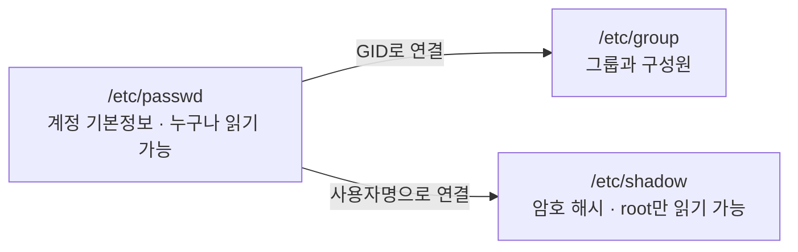

<Callout type="info">
  **이번 문서의 목표:** 이 파일을 다 읽으면 리눅스가 사용자를 어떻게 식별·관리하는지 설명하고, 계정 관련 파일의 특정 필드를 골라내는 문제와 계정 관리 명령어 문제를 풀 수 있다.
</Callout>

## 왜 사용자를 구분해야 하는가

리눅스는 원래 여러 사람이 한 대의 컴퓨터를 동시에 나눠 쓰던 시절(멀티유저 시스템)에 뿌리를 두고 있다. 지금은 개인용 노트북 한 대에서도 리눅스를 혼자 쓰는 경우가 많지만, 운영체제 안쪽 구조는 여전히 "여러 사용자가 같이 쓴다"는 전제를 그대로 유지한다. 그래서 리눅스는 파일 하나, 프로세스 하나에도 항상 "이건 누구 것인가"라는 소유자 정보를 붙여 둔다. 11편에서 다룬 권한(소유자·그룹·기타의 3자 구조)이 의미를 가지려면, 애초에 "사용자"와 "그룹"이라는 단위가 시스템 안에 명확히 등록되어 있어야 한다. 이 편은 그 등록 방식과 관리 명령을 다룬다.

> **쉽게 말하면:** 사용자 관리는 "이 컴퓨터를 쓸 수 있는 사람의 명부를 만들고 관리하는 일"이다.

## root와 일반 사용자

리눅스 시스템에는 root라는 특별한 계정이 하나 있다. root는 시스템 관리자(administrator) 계정으로, 파일 권한이나 프로세스 소유자에 상관없이 시스템의 거의 모든 것을 읽고 쓰고 실행할 수 있다. Windows에 비유하면 관리자(Administrator) 계정과 비슷한 위치지만, 리눅스의 root는 권한 제한이 훨씬 느슨해서 "슈퍼유저(superuser)"라고도 부른다. 커널은 사용자를 이름이 아니라 UID(User Identifier, 사용자 식별 번호)라는 숫자로 구별하는데, root의 UID는 항상 0이다. UID가 0이면 이름이 root가 아니어도 시스템은 그 계정을 슈퍼유저로 취급한다.

일반 사용자 계정은 UID 1 이상을 받는다. 배포판마다 조금씩 다르지만 대체로 1~999(또는 1~499)는 시스템이 서비스 실행용으로 자동 생성하는 시스템 계정에 배정하고, 그 이상(예: 1000번부터)을 사람이 로그인해서 쓰는 일반 사용자 계정에 배정한다. 시스템 계정은 데몬(daemon, 백그라운드에서 계속 실행되며 사용자의 직접 조작 없이 특정 서비스를 처리하는 프로세스 — 13편에서 자세히 다룬다)을 실행할 때 그 서비스 전용 소유자를 만들어 두려는 목적이며, 사람이 로그인하는 용도가 아니다. 예를 들어 웹 서버 데몬을 root 권한으로 그대로 돌리면 보안 사고가 났을 때 피해가 시스템 전체로 번지므로, 권한이 제한된 전용 계정(예: www-data, apache)으로 돌리는 것이 안전하다.

일반 사용자는 자신의 홈 디렉터리(home directory, 그 사용자에게 배정된 개인 작업 공간 디렉터리로 보통 `/home/사용자명`)와 자신이 소유한 파일만 자유롭게 다룰 수 있고, 시스템 설정 파일이나 다른 사용자의 파일은 권한이 막혀 있어 함부로 건드릴 수 없다. 이 제한 덕분에 여러 사람이 한 시스템을 같이 써도 서로의 작업을 실수로 망가뜨리지 않는다.

<Callout type="warning">
  root로 로그인한 채 일상적인 작업을 하는 것은 위험하다. 오타 하나로 시스템 파일을 지우거나 덮어써도 막아 줄 권한 장벽이 없기 때문이다. 그래서 실무에서는 평소에 일반 사용자로 작업하다가, 관리자 권한이 필요한 순간에만 su나 sudo로 잠깐 권한을 빌려 쓰는 방식을 권장한다(아래에서 다룬다).
</Callout>

## /etc/passwd — 사용자 계정 정보 파일

`/etc/passwd`는 시스템에 등록된 모든 사용자 계정의 기본 정보를 담은 텍스트 파일이다. 이름에 "passwd(패스워드)"가 들어가 있어 오해하기 쉽지만, 지금은 실제 암호(비밀번호)를 담고 있지 않다(왜 그런지는 바로 다음 절에서 설명한다). 파일을 열어 보면 한 사용자당 한 줄이며, 각 줄은 콜론(`:`)으로 구분된 7개의 필드로 이루어진다.

예시로 아래 한 줄을 보자.

```text
ihduser:x:1001:1001:IHD Test User:/home/ihduser:/bin/bash
```

이 한 줄을 필드별로 쪼개면 다음과 같다.

| 순서 | 필드명 | 예시 값 | 의미 |
|---|---|---|---|
| 1 | 사용자명(username) | `ihduser` | 로그인할 때 입력하는 계정 이름 |
| 2 | 암호 자리(password placeholder) | `x` | 실제 암호 해시는 없고, `/etc/shadow`를 보라는 표시 문자 `x`만 있음 |
| 3 | UID(User ID) | `1001` | 커널이 이 사용자를 구별하는 숫자. root는 항상 `0` |
| 4 | GID(Group ID) | `1001` | 이 사용자의 기본(주) 그룹 번호. `/etc/group`의 그룹 번호와 대응 |
| 5 | 설명(comment/GECOS) | `IHD Test User` | 사용자의 실제 이름이나 설명. 비워 둬도 됨 |
| 6 | 홈 디렉터리(home directory) | `/home/ihduser` | 로그인 직후 위치하게 되는 개인 작업 디렉터리 경로 |
| 7 | 로그인 셸(login shell) | `/bin/bash` | 로그인했을 때 실행되는 셸 프로그램의 경로 |

일곱 필드를 순서대로 외우는 요령은 "이름-암호자리-번호(UID)-소속(GID)-설명-집(홈)-일하는 도구(셸)"로 이어지는 흐름을 떠올리는 것이다. 특히 시험에서는 **마지막(7번째) 필드가 로그인 셸**이라는 점이 자주 나온다. 예를 들어 서비스 전용 계정처럼 대화형 로그인 자체를 막고 싶은 계정에는 이 필드를 `/sbin/nologin`으로 지정한다. 이 값을 셸로 지정해 두면, 누군가 그 계정으로 로그인을 시도해도 셸이 실행되지 않고 즉시 거부 메시지만 뜨고 연결이 끊긴다. `/bin/bash`처럼 진짜 셸이 아니라 "로그인 거부 전용 프로그램"을 셸 자리에 넣는 우회 기법인 셈이다.

셸이 무엇이고 어떤 종류가 있는지는 06편에서 이미 다뤘다. 이 필드는 "그 사용자가 로그인 직후 어떤 셸로 시작할지"를 결정할 뿐, 로그인 도중에 `bash` 같은 명령으로 잠깐 다른 셸을 실행하는 것과는 별개다. 그래서 시험에서는 "현재 로그인 셸을 바꾸려면 무엇을 수정해야 하는가"를 묻고, 답은 `chsh` 명령(또는 `usermod -s`)으로 이 파일의 7번째 필드를 갱신하는 것이다. 참고로 시스템이 로그인 셸로 허용하는 프로그램의 목록은 `/etc/passwd`가 아니라 별도 파일인 `/etc/shells`에 있다. `chsh`로 지정할 수 있는 셸은 반드시 `/etc/shells`에 등록된 것이어야 한다는 점, 그리고 파일명이 복수형 `shells`라는 점을 혼동하지 않아야 한다.

## /etc/shadow — 암호가 진짜로 저장되는 곳

`/etc/passwd`의 두 번째 필드가 암호 자체가 아니라 `x`라는 표시 문자만 담고 있다고 했다. 실제 암호는 별도 파일인 `/etc/shadow`에 암호화된 해시(hash, 원문을 복원할 수 없는 방식으로 변환한 값) 형태로 저장된다. `/etc/shadow`의 한 줄도 콜론으로 구분되며, 예시는 다음과 같다.

```text
ihduser:$6$abcd1234$Xy...:19800:0:90:7:14::
```

| 순서 | 필드명 | 예시 값 | 의미 |
|---|---|---|---|
| 1 | 사용자명 | `ihduser` | `/etc/passwd`와 동일한 계정 이름으로 서로 연결됨 |
| 2 | 암호화된 암호(hash) | `$6$abcd1234$Xy...` | 실제 암호를 해시 함수로 변환한 값. 잠금 상태면 `!` 또는 `*`로 표시 |
| 3 | 마지막 변경일 | `19800` | 1970년 1월 1일부터 며칠이 지났는지를 나타내는 일수 |
| 4 | 최소 사용 기간 | `0` | 암호 변경 후 다시 바꾸기까지 최소 며칠을 기다려야 하는지 |
| 5 | 최대 사용 기간 | `90` | 이 기간이 지나면 암호를 강제로 바꿔야 함 |
| 6 | 경고 기간 | `7` | 만료 며칠 전부터 경고 메시지를 띄울지 |
| 7 | 비활성 기간 | `14` | 만료 후 며칠이 지나면 계정을 비활성화할지 |
| 8 | 계정 만료일 | (비어 있음) | 계정 자체가 사라지는 날짜(일수). 없으면 무기한 |
| 9 | 예약 필드 | (비어 있음) | 향후 사용을 위해 남겨 둔 자리 |

`/etc/shadow`가 9개 필드로 `/etc/passwd`보다 많은 이유는, 암호 자체뿐 아니라 "이 암호를 언제까지 써도 되는가"라는 암호 정책(policy) 정보까지 함께 관리하기 때문이다. 회사에서 "비밀번호는 90일마다 바꾸세요"라는 규칙을 강제하는 것이 바로 이 4~7번 필드로 구현된다.

### 왜 암호가 passwd에서 shadow로 분리됐는가

초기 유닉스 시스템에서는 암호 해시가 `/etc/passwd` 안에 그대로 들어 있었다. 그런데 `/etc/passwd`는 로그인 셸 확인, 사용자 이름 조회 같은 매우 흔한 작업 때문에 시스템의 거의 모든 프로그램이 아무 제약 없이 읽을 수 있어야 한다(권한이 보통 `644`로, 모든 사용자가 읽기 가능). 문제는 "아무나 읽을 수 있다"는 조건이 암호 해시에도 그대로 적용된다는 점이었다. 해시 자체는 원문 암호로 즉시 복원되지는 않지만, 파일을 통째로 가져갈 수 있으면 공격자가 별도의 컴퓨터에서 시간 제약 없이 사전 대입 공격(dictionary attack, 흔한 단어들을 미리 해시로 바꿔 놓고 대조하는 공격)이나 무차별 대입 공격(brute-force attack)을 걸 수 있었다. 즉 파일을 읽을 수 있다는 것 자체가 이미 절반의 침입인 셈이었다.

그래서 암호 해시만 따로 떼어 내 별도 파일인 `/etc/shadow`로 옮기고, 이 파일은 root만 읽을 수 있도록 권한을 극단적으로 제한했다(대부분의 배포판에서 `000`에 가깝거나 root 전용). 이렇게 분리하면 `/etc/passwd`는 여전히 누구나 읽을 수 있어 시스템의 다른 기능은 그대로 작동하면서도, 정작 공격의 핵심 자산인 암호 해시는 일반 사용자의 눈에 아예 보이지 않게 된다. "누구나 읽어야 하는 정보"와 "root만 봐야 하는 민감한 정보"를 물리적으로 다른 파일에 나눠 둔 것이 이 분리의 핵심 설계 원리다.

이 배경 때문에 시험에서는 "`/etc/passwd`와 `/usr/bin/passwd` 중 어느 쪽이 SetUID가 걸린 특수 권한 파일인가"를 묻는 문제가 나온다. `/etc/passwd`와 `/etc/shadow`는 둘 다 데이터를 담은 일반 파일일 뿐 실행 파일이 아니므로 SetUID(11편에서 다룬, 실행 중에는 파일 소유자 권한으로 동작하게 하는 특수 권한)가 붙을 대상이 아니다. 반면 `passwd` 명령의 실행 파일인 `/usr/bin/passwd`에는 SetUID가 걸려 있다. 일반 사용자는 원래 `/etc/shadow`를 수정할 권한이 없지만, `passwd` 명령을 실행하는 순간만큼은 SetUID 덕분에 소유자인 root 권한으로 잠깐 동작해 자신의 암호 항목을 갱신할 수 있게 된다.

## /etc/group — 그룹 정보 파일

그룹(group)은 여러 사용자를 하나로 묶어 파일 접근 권한을 공유하게 하는 단위다. 예를 들어 팀 프로젝트 파일에 팀원 전체가 접근하게 하려면, 팀원들을 하나의 그룹으로 묶고 그 파일의 그룹 소유자를 그 그룹으로 지정하면 된다. 그룹 정보는 `/etc/group`에 저장되며, 한 줄이 콜론으로 구분된 4개 필드로 이루어진다.

```text
devteam:x:1002:ihduser,kim,park
```

| 순서 | 필드명 | 예시 값 | 의미 |
|---|---|---|---|
| 1 | 그룹명 | `devteam` | 그룹의 이름 |
| 2 | 암호 자리 | `x` | 그룹 암호 기능은 현재 거의 쓰이지 않아 보통 비어 있거나 `x` |
| 3 | GID(Group ID) | `1002` | 그룹을 구별하는 번호. `/etc/passwd`의 4번째 필드와 대응 |
| 4 | 구성원 목록 | `ihduser,kim,park` | 이 그룹에 속한 사용자 이름을 쉼표로 나열 |

여기서 헷갈리기 쉬운 점이 있다. `/etc/passwd`의 4번째 필드(GID)는 그 사용자의 **기본 그룹(primary group)** 하나만 가리킨다. 반면 `/etc/group`의 4번째 필드에 이름이 올라 있는 사용자는 그 그룹을 **부가 그룹(secondary group)** 으로 갖는다. 즉 어떤 사용자가 실제로 속한 그룹은 "`/etc/passwd`에 적힌 기본 그룹 1개" 더하기 "`/etc/group`의 구성원 목록에 이름이 올라간 부가 그룹들"을 모두 합친 것이다. `id 사용자명` 명령을 실행하면 이 전체 그룹 목록을 한 번에 확인할 수 있다.

앞서 나온 로그인 셸 변경 문제의 함정도 여기서 나온다. "로그인 셸을 바꾸면 `/etc/group`도 함께 바뀌는가"라는 식의 보기가 자주 등장하는데, `/etc/group`은 그룹 구성원만 관리할 뿐 로그인 셸과는 아무 관계가 없다. 파일 세 개(`passwd`, `shadow`, `group`)가 각각 어떤 정보의 담당인지 역할을 명확히 나눠 기억해야 이런 함정 보기를 바로 걸러낼 수 있다.



## 계정을 관리하는 명령어

지금까지 본 세 파일을 사람이 직접 텍스트 편집기로 고치는 것은 위험하다. 필드 순서를 하나만 밀려 써도 로그인이 통째로 안 되는 사고로 이어질 수 있다. 그래서 리눅스는 이 파일들을 안전하게 대신 고쳐 주는 전용 명령어를 제공한다.

### useradd — 계정 생성

`useradd 사용자명` 형태로 새 계정을 만든다. 기본 형태로 실행하면 `/etc/passwd`·`/etc/shadow`·`/etc/group`에 각각 해당 줄을 추가하고, 홈 디렉터리는 배포판 설정에 따라 자동으로 만들어지기도 하고 그렇지 않기도 하다(레드햇 계열은 기본으로 홈 디렉터리를 만들지만, 옵션 `-m`을 명시적으로 붙여야 하는 배포판도 있다). 주요 옵션은 다음과 같다.

| 옵션 | 의미 |
|---|---|
| `-u UID` | UID를 직접 지정 |
| `-g 그룹명` | 기본 그룹을 지정 |
| `-G 그룹1,그룹2` | 부가 그룹을 지정(쉼표로 여러 개) |
| `-d 경로` | 홈 디렉터리 경로를 지정 |
| `-s 셸경로` | 로그인 셸을 지정 |
| `-m` | 홈 디렉터리를 생성 |

계정을 갓 만들었을 때는 `/etc/shadow`의 암호 필드가 잠금 상태(`!` 등)이므로, 바로 다음에 설명할 `passwd` 명령으로 암호를 설정해야 실제로 로그인할 수 있게 된다.

### usermod — 계정 정보 수정

`usermod 옵션 사용자명` 형태로 이미 존재하는 계정의 정보를 바꾼다. 옵션 구성이 `useradd`와 상당히 비슷하다.

| 옵션 | 의미 |
|---|---|
| `-s 셸경로` | 로그인 셸 변경(`/etc/passwd` 7번째 필드 갱신) |
| `-d 경로` | 홈 디렉터리 경로 변경 |
| `-g 그룹명` | 기본 그룹 변경 |
| `-G 그룹1,그룹2` | 부가 그룹을 통째로 재설정 |
| `-aG 그룹명` | 기존 부가 그룹을 유지하면서 그룹을 추가(`a`는 append) |
| `-L` | 계정 잠금 |
| `-U` | 계정 잠금 해제 |

`-G`와 `-aG`를 혼동하는 문제가 잘 나온다. `-G`만 단독으로 쓰면 그 사용자가 기존에 갖고 있던 부가 그룹 소속이 모두 사라지고 새로 지정한 그룹으로 덮어써진다. 기존 소속을 유지한 채 그룹 하나를 추가로 얹고 싶다면 반드시 `-aG`(append)를 함께 써야 한다.

### userdel — 계정 삭제

`userdel 사용자명`으로 계정을 지운다. 이 명령은 기본적으로 `/etc/passwd`·`/etc/shadow`·`/etc/group`의 해당 항목만 지우고, 홈 디렉터리와 그 안의 파일은 그대로 남긴다. 홈 디렉터리까지 함께 지우려면 `-r` 옵션을 붙여야 한다(`userdel -r 사용자명`). "계정을 삭제하면 홈 디렉터리도 자동으로 함께 사라진다"는 보기는 옵션 없이 실행했을 때는 틀린 설명이다.

### passwd — 암호 설정과 변경

`passwd 사용자명`으로 특정 사용자의 암호를 설정하거나 바꾼다. 인자 없이 `passwd`만 실행하면 현재 로그인한 자신의 암호를 바꾼다. 일반 사용자는 자신의 암호만 바꿀 수 있고, root는 인자로 다른 사용자 이름을 지정해 그 사람의 암호를 대신 바꿔 줄 수 있다. 이 명령이 앞서 설명한 SetUID의 대표 사례라는 점, 그리고 실제로 값을 고치는 대상 파일이 `/etc/passwd`가 아니라 `/etc/shadow`라는 점이 함께 자주 출제된다.

주요 옵션도 함께 정리한다.

| 옵션 | 의미 |
|---|---|
| `-l` | 계정 잠금(lock, `/etc/shadow`의 암호 필드 앞에 `!` 추가) |
| `-u` | 잠금 해제(unlock) |
| `-e` | 다음 로그인 시 강제로 암호 변경을 요구 |
| `-S` | 계정의 암호 상태 요약 출력 |

## su와 sudo — 권한을 빌리는 두 가지 방법

일반 사용자로 작업하다가 관리자 권한이 잠깐 필요한 순간이 있다. 이때 쓰는 두 명령이 `su`와 `sudo`인데, 동작 방식이 근본적으로 다르다.

`su`(switch user)는 **다른 사용자로 아예 로그인을 전환**하는 명령이다. `su`만 인자 없이 실행하면 root의 암호를 물어보고, 맞으면 root로 완전히 전환되어 그 셸 세션 전체가 root 권한으로 계속 유지된다. `su -`(하이픈을 붙인 형태)로 실행하면 환경변수까지 root의 것으로 완전히 새로 불러와, 마치 root로 처음부터 로그인한 것과 똑같은 상태가 된다. 반면 하이픈 없이 `su`만 쓰면 현재 셸의 환경변수 일부(`PATH` 등)를 그대로 물려받아 root로 전환한 것치고는 어중간한 환경이 되는 경우가 있다. 이 차이도 시험에서 자주 다뤄진다.

`sudo`(superuser do)는 반대로 **로그인 자체는 그대로 유지한 채, 명령 하나만 관리자 권한으로 실행**하는 명령이다. `sudo 명령`을 실행하면 자기 자신의 암호를 확인한 뒤 그 명령 한 줄만 root 권한으로 처리하고, 끝나면 다시 원래의 일반 사용자로 돌아온다. `sudo`를 쓸 수 있는 사용자는 아무나가 아니라 `/etc/sudoers` 파일(또는 `visudo` 명령으로 편집하는 그 파일)에 미리 허가된 사용자로 한정된다.

| 구분 | su | sudo |
|---|---|---|
| 필요한 암호 | 전환하려는 대상 계정(대개 root)의 암호 | 실행하는 자기 자신의 암호 |
| 권한 유지 범위 | 셸을 빠져나가기(`exit`) 전까지 계속 root 상태 유지 | 지정한 명령 한 줄만 root 권한, 끝나면 즉시 원상복귀 |
| 권한 부여 대상 지정 | root 암호를 아는 사람이면 누구나 사용 가능 | `/etc/sudoers`에 등록된 사용자만 사용 가능(세밀한 권한 제어) |
| 로그 기록 | 기본적으로는 su 사용 자체만 기록 | 어떤 사용자가 어떤 명령을 언제 root로 실행했는지 상세히 기록 |

실무에서 `sudo`를 더 선호하는 이유가 바로 이 표에 담겨 있다. root 암호 자체를 여러 사람과 공유할 필요 없이, 각자 자기 암호로 정해진 범위의 명령만 관리자 권한으로 실행하게 할 수 있고, 누가 언제 무엇을 했는지 기록이 남기 때문에 여러 관리자가 함께 시스템을 운영할 때 책임 소재가 분명해진다.

## 직접 해보기

<Callout type="info">
  00편에서 만든 Rocky Linux 컨테이너에서 진행합니다. 아직 안 만들었다면 00편을 먼저 보세요.
</Callout>

`/etc/passwd`와 `/etc/shadow`의 필드가 실제로 어떻게 다른 줄로 저장되는지, 그리고 `useradd`가 무슨 파일을 건드리는지 눈으로 확인합니다.

```bash
useradd -m testuser
grep testuser /etc/passwd
grep testuser /etc/shadow
id testuser
```

**무엇을 보아야 하나**: `/etc/passwd` 줄이 콜론으로 몇 개 필드로 나뉘는지 직접 세어 보고, 7번째 필드(로그인 셸)까지 확인합니다. `/etc/shadow` 줄에는 `/etc/passwd`에 없던 암호 해시가 들어 있는지, 그리고 `id` 출력의 uid·gid 숫자가 `/etc/passwd`의 3·4번째 필드와 같은 값인지 대조합니다.

> **왜 이걸 해보나:** 두 파일의 필드 개수(7개 vs 9개)와 "암호가 왜 shadow로 분리됐는가"를 시험은 텍스트로만 묻는데, 실제 줄을 눈으로 보면 `/etc/passwd`엔 애초에 암호 해시를 넣을 자리(`x`)만 있고 진짜 값은 없다는 게 바로 이해된다.

`passwd testuser`로 암호를 설정한 뒤 `su - testuser`로 전환해 보면, `#`으로 끝나던 프롬프트가 `$`로 바뀌는 것을 볼 수 있습니다(`#`은 관리자, `$`는 일반 사용자라는 표시입니다). `exit`로 root로 돌아옵니다.

## 자주 틀리는 점

- `/etc/passwd`의 두 번째 필드를 "암호 그 자체"로 착각하는 경우가 많다. 지금은 `x`라는 표시 문자만 있고, 진짜 해시는 `/etc/shadow`에 있다.
- `/etc/passwd`의 필드 순서(특히 4번째가 GID, 7번째가 로그인 셸이라는 점)를 헷갈려, "로그인 셸이 기록된 파일"을 `/etc/shells`로 잘못 고르는 문제가 반복 출제된다. **셸 목록**은 `/etc/shells`, **그 사용자가 실제로 쓰는 셸**은 `/etc/passwd` 7번째 필드다.
- `usermod -G`와 `-aG`를 혼동해, 그룹을 추가하려다 기존 부가 그룹 소속을 전부 날리는 실수를 문제 상황으로 자주 낸다.
- `su`와 `sudo`가 확인하는 암호의 주체를 반대로 알기 쉽다. `su`는 전환 대상(root)의 암호, `sudo`는 실행하는 자기 자신의 암호를 물어본다.
- `userdel`만 실행하고 홈 디렉터리가 왜 안 지워졌는지 놀라는 경우가 실습에서 흔하다. `-r`을 붙여야 홈 디렉터리까지 삭제된다.

## 핵심 정리

- `/etc/passwd`는 사용자명·암호자리(`x`)·UID·GID·설명·홈 디렉터리·로그인 셸의 7개 필드로 구성되며 누구나 읽을 수 있다.
- `/etc/shadow`는 암호 해시와 만료 정책을 담고 root만 읽을 수 있다. 보안을 위해 `/etc/passwd`에서 분리되었다.
- `/etc/group`은 그룹명·암호자리·GID·구성원 목록의 4개 필드로 구성되며, 여기 이름이 오르면 부가 그룹 소속이 된다.
- `useradd`·`usermod`·`userdel`·`passwd`로 계정을 생성·수정·삭제·암호변경한다.
- `su`는 사용자 전환(대상 암호 필요), `sudo`는 명령 단위 권한 위임(자기 암호 필요)이다.

## 마무리 복습

<Quiz
  questionNumber={1}
  question="다음 중 /etc/passwd 파일의 필드 구성 순서로 알맞은 것은?"
  options={['사용자명-UID-암호자리-GID-홈디렉터리-설명-로그인셸', '사용자명-암호자리-UID-GID-설명-홈디렉터리-로그인셸', '사용자명-암호자리-GID-UID-설명-로그인셸-홈디렉터리', 'UID-사용자명-암호자리-GID-설명-홈디렉터리-로그인셸']}
  correctAnswer={2}
  explanation="/etc/passwd의 한 줄은 사용자명:암호자리(x):UID:GID:설명:홈디렉터리:로그인셸 순서로 콜론 구분 7개 필드다."
  optionExplanations={['UID와 암호자리, 설명과 홈디렉터리의 순서가 뒤바뀌어 틀렸다', '실제 필드 순서와 정확히 일치한다', 'GID와 UID의 순서, 로그인셸과 홈디렉터리의 순서가 뒤바뀌어 틀렸다', '첫 필드는 UID가 아니라 사용자명이므로 틀렸다']}
/>

<Quiz
  questionNumber={2}
  question="특정 사용자가 로그인 후에 사용할 수 있는 셸의 정보(그 사용자에게 지정된 로그인 셸)가 기록된 파일로 알맞은 것은?"
  options={['/etc/shells', '/etc/passwd', '/etc/bashrc', '/etc/profile']}
  correctAnswer={2}
  explanation="특정 사용자에게 배정된 로그인 셸은 /etc/passwd의 7번째(마지막) 필드에 기록된다. /etc/shells는 시스템이 허용하는 셸의 목록일 뿐 특정 사용자의 셸을 가리키지 않는다."
  optionExplanations={['이 파일은 시스템에서 로그인 셸로 쓸 수 있는 셸의 목록일 뿐, 특정 사용자의 셸을 담지 않아 틀렸다', '7번째 필드가 그 사용자의 로그인 셸이므로 옳다', 'bash의 전역 환경설정 파일로 로그인 셸 지정과 무관하여 틀렸다', '로그인 시 실행되는 전역 환경 설정 스크립트로 로그인 셸 지정과 무관하여 틀렸다']}
/>

<Quiz
  questionNumber={3}
  question="암호 해시 정보가 /etc/passwd에서 /etc/shadow로 분리된 가장 근본적인 이유로 알맞은 것은?"
  options={['/etc/passwd의 파일 크기가 너무 커지는 것을 막기 위해', '/etc/passwd는 여러 프로그램이 읽어야 해 권한을 열어 둘 수밖에 없는데, 암호 해시까지 함께 노출되면 사전 대입 공격에 취약해지기 때문에', 'GID와 UID를 서로 다른 파일에 저장해야 하는 규칙 때문에', '리눅스 커널이 shadow 형식의 파일만 인식하도록 설계되어서']}
  correctAnswer={2}
  explanation="/etc/passwd는 누구나 읽을 수 있어야 여러 시스템 기능이 정상 동작하는데, 암호 해시까지 그 안에 있으면 파일을 읽는 것만으로 공격자가 오프라인에서 무제한으로 대입 공격을 시도할 수 있다. 이를 막기 위해 해시만 root 전용 파일인 /etc/shadow로 분리했다."
  optionExplanations={['파일 크기는 분리의 동기가 아니며 암호 해시 몇 바이트로는 크기 문제가 생기지 않는다', '보안 취약점을 정확히 짚은 이유다', 'GID와 UID는 둘 다 /etc/passwd 안에 함께 있으며 분리 이유와 무관하다', '커널은 이 파일들의 형식을 직접 해석하지 않으며, 분리는 사용자 공간 보안 설계의 문제다']}
/>

<Quiz
  questionNumber={4}
  question="다음 중 SetUID가 설정되어, 일반 사용자가 실행하는 동안 소유자인 root 권한으로 동작해 자신의 암호를 바꿀 수 있게 해 주는 실행 파일로 가장 알맞은 것은?"
  options={['/etc/passwd', '/usr/bin/passwd', '/etc/shadow', '/etc/group']}
  correctAnswer={2}
  explanation="/usr/bin/passwd는 SetUID가 설정된 실행 파일이라, 일반 사용자가 실행해도 그 순간 root 권한으로 동작해 원래는 root만 쓸 수 있는 /etc/shadow를 갱신할 수 있다."
  optionExplanations={['데이터를 담은 일반 파일이지 실행 파일이 아니므로 SetUID 대상이 아니다', '실행 파일이며 SetUID가 설정되어 있어 옳다', '암호 해시를 담은 데이터 파일이지 실행 파일이 아니므로 SetUID 대상이 아니다', '그룹 정보를 담은 데이터 파일이지 실행 파일이 아니므로 SetUID 대상이 아니다']}
/>

<Quiz
  questionNumber={5}
  question="사용자 kim에게 기존 부가 그룹 소속을 그대로 유지하면서 devteam 그룹을 추가로 배정하려고 한다. 알맞은 명령은?"
  options={['usermod -G devteam kim', 'usermod -aG devteam kim', 'useradd -G devteam kim', 'groupadd -aG devteam kim']}
  correctAnswer={2}
  explanation="usermod -aG는 append 옵션으로, 기존 부가 그룹 소속을 유지한 채 지정한 그룹을 추가한다. -G만 단독으로 쓰면 기존 부가 그룹 소속이 모두 사라지고 새 그룹으로 덮어써진다."
  optionExplanations={['-G만 쓰면 기존 부가 그룹 소속이 전부 사라지고 devteam으로 덮어써지므로 틀렸다', '-aG로 기존 소속을 유지한 채 추가하므로 옳다', 'useradd는 이미 있는 사용자의 그룹을 바꾸는 명령이 아니라 새 계정을 만드는 명령이므로 틀렸다', 'groupadd는 그룹 자체를 새로 만드는 명령이지 사용자에게 그룹을 배정하는 명령이 아니므로 틀렸다']}
/>

<Quiz
  questionNumber={6}
  question="userdel kim 명령을 옵션 없이 실행했을 때의 결과로 알맞은 것은?"
  options={['kim 계정 정보와 홈 디렉터리가 모두 삭제된다', 'kim 계정 정보만 삭제되고 홈 디렉터리는 그대로 남는다', '계정은 잠기지만 삭제되지는 않는다', '홈 디렉터리만 삭제되고 계정 정보는 남는다']}
  correctAnswer={2}
  explanation="userdel은 기본적으로 /etc/passwd·/etc/shadow·/etc/group의 계정 항목만 지우고 홈 디렉터리는 남긴다. 홈 디렉터리까지 지우려면 -r 옵션을 붙여야 한다."
  optionExplanations={['-r 옵션 없이는 홈 디렉터리가 함께 삭제되지 않으므로 틀렸다', '계정 항목만 삭제되고 홈 디렉터리는 남는 것이 기본 동작이므로 옳다', 'userdel은 잠금이 아니라 삭제 명령이므로 틀렸다', '기본 동작은 반대로 계정 정보를 지우고 홈 디렉터리는 남기는 것이므로 틀렸다']}
/>

<Quiz
  questionNumber={7}
  question="su와 sudo의 차이에 대한 설명으로 옳은 것은?"
  options={['su는 자기 자신의 암호를, sudo는 전환 대상의 암호를 확인한다', 'su는 로그인 자체를 다른 사용자로 전환하고, sudo는 로그인은 유지한 채 지정한 명령 한 줄만 관리자 권한으로 실행한다', 'sudo를 쓰려면 반드시 root의 암호를 알아야 한다', 'su는 /etc/sudoers에 등록된 사용자만 사용할 수 있다']}
  correctAnswer={2}
  explanation="su는 다른 사용자로 로그인 세션 자체를 바꾸는 명령이고, sudo는 세션은 그대로 두고 명령 하나만 관리자 권한으로 실행한 뒤 원래 사용자로 돌아온다."
  optionExplanations={['확인하는 암호의 주체가 반대로 서술되어 틀렸다', 'su와 sudo의 동작 범위 차이를 정확히 설명했다', 'sudo는 실행하는 자기 자신의 암호를 확인하며 root 암호를 몰라도 사용할 수 있으므로 틀렸다', '/etc/sudoers에 등록된 사용자만 쓸 수 있는 것은 su가 아니라 sudo이므로 틀렸다']}
/>

<Quiz
  questionNumber={8}
  question="/etc/group 파일의 한 줄이 devteam:x:1002:ihduser,kim,park 일 때의 해석으로 알맞은 것은?"
  options={['ihduser, kim, park의 기본 그룹은 반드시 devteam이다', 'devteam의 GID는 1002이며, ihduser·kim·park는 devteam을 부가 그룹으로 갖는다', 'devteam 그룹의 암호는 x이다', 'devteam은 UID 1002번 사용자의 이름이다']}
  correctAnswer={2}
  explanation="세 번째 필드 1002가 devteam의 GID이고, 네 번째 필드에 이름이 오른 사용자는 devteam을 부가 그룹으로 갖는다. 기본 그룹인지 여부는 /etc/passwd의 GID 필드로 별도 확인해야 한다."
  optionExplanations={['/etc/group의 구성원 목록은 부가 그룹 소속을 나타낼 뿐, 그 사람들의 기본 그룹이 devteam이라고 단정할 수 없어 틀렸다', 'GID와 구성원의 관계를 정확히 설명했다', '두 번째 필드 x는 그룹 암호 자리 표시일 뿐 실제 암호 값이 아니므로 틀렸다', 'devteam은 그룹명이고 1002는 GID(그룹 번호)이지 UID가 아니므로 틀렸다']}
/>

## 참고 자료

- [Linux man-pages 프로젝트](https://www.kernel.org/doc/man-pages/)
- [The Linux Documentation Project](https://tldp.org)
