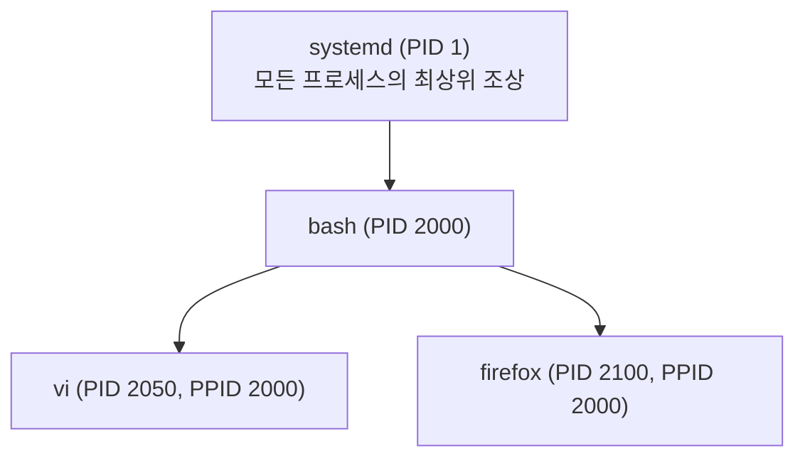

<Callout type="info">
  **이번 문서의 목표:** 이 파일을 다 읽으면 프로세스가 무엇인지, 프로세스끼리 어떤 관계를 맺는지, 좀비와 고아 프로세스가 왜 생기고 어떻게 다른지 설명할 수 있다.
</Callout>

## 프로그램과 프로세스는 왜 다른 말인가

컴퓨터를 쓰다 보면 "프로그램을 실행한다"는 말과 "프로세스가 돈다"는 말을 섞어 쓰기 쉽지만, 리눅스(그리고 대부분의 운영체제)는 이 둘을 엄격히 구분한다. 구분하지 않으면 "같은 프로그램을 두 번 실행했을 때 왜 서로 다른 것처럼 동작하는가"를 설명할 수 없기 때문이다.

> **쉽게 말하면:** 프로그램은 "요리 레시피"고, 프로세스는 "그 레시피를 보고 실제로 요리하고 있는 한 사람"이다.

**프로그램(program)** 은 디스크에 저장된, 아직 실행되지 않은 정적인 파일이다. 예를 들어 `/usr/bin/firefox`는 그 자체로는 그냥 디스크에 놓인 실행 파일 덩어리일 뿐, 실행되기 전까지는 CPU나 메모리를 전혀 쓰지 않는다. 레시피북에 적힌 레시피가 냉장고 속 재료를 실제로 소비하지 않는 것과 같다.

**프로세스(process)** 는 그 프로그램을 실행해서 메모리에 올라간, 살아 움직이는 작업 단위다. 사용자가 firefox 아이콘을 두 번 클릭하면, 운영체제는 디스크의 프로그램 파일을 읽어 메모리 공간을 할당하고, 그 안에 프로그램 코드를 올리고, CPU 시간을 배정해 실제로 명령어를 실행시키기 시작한다. 이 순간부터 그것은 더 이상 "프로그램"이 아니라 "프로세스"다. 같은 firefox를 창을 두 개 띄우면 프로그램 파일은 하나뿐이지만 프로세스는 각각 독립적으로 두 개(또는 그 이상) 생긴다. 각 프로세스는 서로 다른 메모리 공간을 갖고 서로 다른 상태(어떤 탭이 열려 있는지 등)를 유지하므로, 한쪽 창이 멈춰도 다른 쪽 창은 영향을 받지 않는 경우가 많다. 요리사 두 명이 같은 레시피를 보고 각자 자기 도마에서 따로 요리하는 것과 같다.

## PID와 PPID, 부모자식 관계

리눅스 커널은 시스템에서 동시에 돌아가는 수많은 프로세스를 구별하기 위해, 프로세스가 생성될 때마다 고유한 번호를 하나씩 붙인다. 이 번호가 **PID(Process Identifier, 프로세스 식별 번호)** 다. PID는 시스템이 켜져 있는 동안 프로세스마다 겹치지 않는 정수이며, 프로세스가 종료되면 그 번호는 나중에 새로 생기는 다른 프로세스에게 재활용될 수 있다.

리눅스에서 새 프로세스는 마법처럼 허공에서 생기지 않는다. 반드시 이미 존재하는 어떤 프로세스가 자기 자신을 복제하는 방식으로 새 프로세스를 만들어 낸다. 이 복제 동작을 시스템 콜(system call, 프로그램이 커널에게 특정 작업을 요청하는 표준화된 창구) 이름을 따서 **fork(포크)** 라고 부른다. 이렇게 새로 만들어진 프로세스를 **자식 프로세스(child process)**, 자식을 만들어 낸 원래 프로세스를 **부모 프로세스(parent process)** 라고 한다. 자식 프로세스는 자신을 만든 부모의 PID를 **PPID(Parent Process ID, 부모 프로세스 식별 번호)** 라는 값으로 기억해 둔다.

예를 들어 사용자가 bash 셸(PID 2000이라고 하자)에서 `vi memo.txt`라는 명령을 실행하면, bash는 fork로 자기 복제를 한 뒤 그 복제본이 `vi` 프로그램으로 자기 자신을 바꿔치기(exec라는 또 다른 시스템 콜)한다. 그 결과 새로 생긴 vi 프로세스(예: PID 2050)는 PPID로 2000을 갖게 되어, "나는 PID 2000인 bash가 낳은 자식이다"라는 관계가 기록된다.



이 부모-자식 관계를 계속 거슬러 올라가면 결국 시스템이 부팅될 때 커널이 가장 먼저 실행하는 단 하나의 프로세스에 도달한다. 이 최초의 프로세스는 항상 **PID 1**을 부여받으며, 오래된 시스템은 `init`이라는 이름을, 현재 대부분의 배포판은 `systemd`라는 이름을 쓴다(05편의 부팅 과정에서 다룬 내용과 이어진다). PID 1은 부모가 없는 유일한 프로세스이며, 다른 모든 프로세스는 fork를 반복해 가지를 뻗어 나간 이 트리(tree, 나무 모양 계층 구조)의 자손이다. `pstree` 명령을 실행하면 이 부모-자식 관계를 나무 모양 그림으로 바로 확인할 수 있다.

## 포그라운드와 백그라운드

셸에서 명령을 실행하는 방식에는 두 가지가 있다. 명령을 입력하고 그 명령이 끝날 때까지 셸이 다음 입력을 받지 않고 기다리는 방식이 **포그라운드(foreground, 전경) 실행**이다. 대부분의 명령을 그냥 입력하면 이 방식으로 동작한다. 예를 들어 `cp big_file.iso /backup/`처럼 시간이 걸리는 복사 명령을 그냥 실행하면, 복사가 끝날 때까지 프롬프트가 돌아오지 않고 다른 명령을 입력할 수 없다.

반면 명령 끝에 앰퍼샌드(`&`)를 붙여 실행하면, 셸은 그 명령을 뒤로 돌려보내고 곧바로 다음 명령을 입력할 수 있는 상태로 프롬프트를 돌려준다. 이렇게 실행되는 프로세스를 **백그라운드(background, 배경) 실행**이라 한다.

```text
$ cp big_file.iso /backup/ &
[1] 3210
$ ls
```

위 예시에서 `[1]`은 셸이 관리하는 작업 번호(job number)이고, `3210`은 그 백그라운드 프로세스의 PID다. 명령을 백그라운드로 돌려보낸 직후 곧바로 `$` 프롬프트가 다시 나타나 `ls`를 실행할 수 있었다는 점에 주목하자. 포그라운드로 실행 중인 작업을 백그라운드로 돌리고 싶을 때는 먼저 `[Ctrl] + [z]`를 눌러 작업을 일시 정지시킨 뒤, `bg` 명령으로 정지된 작업을 백그라운드에서 계속 이어 실행하게 만든다. 반대로 백그라운드 작업을 다시 포그라운드로 끌어오려면 `fg` 명령을 쓴다. 이 명령들의 구체적인 사용법과 `jobs` 목록 읽는 법은 다음 14편에서 이어서 다룬다.

<Callout type="warning">
  `[Ctrl] + [c]`와 `[Ctrl] + [z]`를 혼동하기 쉽다. `[Ctrl] + [c]`는 포그라운드 프로세스에 인터럽트 신호를 보내 그 자리에서 종료시키는 반면, `[Ctrl] + [z]`는 종료가 아니라 일시 정지(suspend)만 시킨다. 정지된 프로세스는 `bg`나 `fg`로 다시 깨울 수 있지만, `[Ctrl] + [c]`로 종료된 프로세스는 되살릴 수 없다.
</Callout>

## 데몬 — 백그라운드에서 계속 사는 프로세스

일반적인 백그라운드 프로세스(예: 위에서 본 `cp ... &`)는 작업이 끝나면 스스로 종료된다. 하지만 시스템에는 사용자가 로그아웃한 뒤에도, 애초에 아무도 대화형으로 로그인하지 않아도 계속 떠 있어야 하는 프로세스들이 있다. 예를 들어 웹 서버는 사용자가 요청을 보낼 때마다 즉시 응답할 수 있도록 항상 대기하고 있어야 하고, 프린터 관리 서비스는 언제 인쇄 요청이 들어올지 모르니 계속 떠서 기다려야 한다.

이렇게 특정 서비스를 처리하기 위해 백그라운드에서 무기한 상주하며 대기하는 프로세스를 **데몬(daemon)** 이라고 부른다. 데몬은 보통 터미널(제어 터미널, controlling terminal — 사용자가 명령을 입력하고 결과를 보는 화면 연결)과의 연결을 스스로 끊어서, 그 터미널을 닫아도 함께 종료되지 않도록 설계된다. 관례적으로 데몬 프로그램의 이름 끝에는 `d`를 붙인다. 예를 들어 SSH 접속을 처리하는 데몬은 `sshd`, 크론 작업을 처리하는 데몬은 `crond`(또는 `cron`)다. 부모 프로세스는 대개 PID 1(systemd)이거나 systemd가 직접 관리하는 상위 프로세스이며, `ps` 출력에서 명령 이름이 대괄호로 감싸여 있거나(`[kthreadd]`처럼 커널 스레드인 경우) 이름 끝의 `d`로 대략 구별할 수 있다.

## 좀비 프로세스와 고아 프로세스

프로세스의 생애 주기 중 마지막 단계에서 발생하는 두 가지 특이한 상태가 있다. 이름이 비슷하게 들릴 수 있지만 발생 원인이 정반대이므로 반드시 대조해서 기억해야 한다.

### 좀비 프로세스 — 자식이 죽었는데 부모가 뒤처리를 안 한 경우

프로세스가 실행을 마치고 종료되면, 그 프로세스가 사용하던 메모리나 파일 핸들 같은 자원은 대부분 커널이 즉시 회수한다. 하지만 딱 하나, "이 프로세스가 어떤 종료 코드(exit code, 정상 종료면 0, 비정상 종료면 다른 값)로 끝났는가"라는 정보는 곧바로 사라지지 않는다. 자식 프로세스가 왜, 어떻게 끝났는지를 부모 프로세스가 `wait()`이라는 시스템 콜로 물어봐서 회수해 가야 비로소 그 정보가 완전히 지워진다.

문제는 부모 프로세스가 이 `wait()` 호출을 하지 않고 방치하는 경우다. 자식은 이미 실행을 완전히 마쳐서 CPU도 메모리도 거의 쓰지 않지만, "종료 코드를 아직 아무도 가져가지 않았다"는 이유로 프로세스 목록(프로세스 테이블)에 껍데기만 남은 항목으로 계속 존재한다. 이 상태를 **좀비 프로세스(zombie process)** 라고 부른다. `ps` 명령으로 확인하면 상태(STAT) 열에 `Z`로 표시되고, 명령 이름 옆에 `<defunct>`(더 이상 기능하지 않는다는 뜻)라는 표시가 함께 나타난다.

좀비 프로세스는 실질적인 자원(CPU·메모리)을 거의 차지하지 않으므로 한두 개 있다고 시스템이 느려지지는 않는다. 하지만 PID라는 한정된 번호 자원 하나를 계속 붙잡고 있으므로, 부모 프로세스의 버그로 좀비가 대량으로 쌓이면 언젠가 시스템이 새 PID를 발급할 수 없는 지경까지 갈 수 있다. 좀비는 이미 죽은 프로세스이므로 `kill` 명령으로 다시 죽이는 것이 불가능하다. 해결 방법은 부모 프로세스가 정상적으로 `wait()`를 호출하도록 프로그램을 고치거나, 임시방편으로 그 부모 프로세스 자체를 종료시키는 것이다. 부모가 사라지면 좀비는 곧바로 설명할 "고아" 신세가 되어 PID 1(systemd 또는 init)에게 입양되고, PID 1은 주기적으로 자기 자식들의 종료 상태를 회수하도록 설계되어 있어 좀비가 곧 정리된다.

### 고아 프로세스 — 부모가 먼저 죽어 버린 경우

**고아 프로세스(orphan process)** 는 좀비와 정반대의 원인으로 생긴다. 자식 프로세스는 아직 멀쩡하게 실행 중인데, 오히려 그 자식을 낳은 부모 프로세스 쪽이 먼저 종료돼 버린 경우다. 예를 들어 어떤 프로그램이 작업을 백그라운드에 자식으로 띄워 놓은 채 자기 자신은 먼저 끝나 버리면, 그 자식은 갑자기 부모를 잃게 된다.

리눅스 커널은 이런 상황을 방치하지 않는다. 부모를 잃은 자식 프로세스는 즉시 PID 1(systemd 또는 init)의 양자로 자동 입양되어, PPID가 원래 부모의 PID에서 1로 바뀐다. 고아가 된 프로세스 자신은 실행을 계속하는 데 아무 지장이 없으며, 나중에 정상적으로 종료되면 새 부모가 된 PID 1이 그 종료 상태를 성실히 회수해 준다.

### 두 상태를 정면으로 비교하기

| 구분 | 좀비 프로세스(zombie) | 고아 프로세스(orphan) |
|---|---|---|
| 무엇이 먼저 죽었나 | 자식이 먼저 종료됨 | 부모가 먼저 종료됨 |
| 지금 살아 있는 쪽 | 부모(정상 실행 중이지만 회수를 안 함) | 자식(정상 실행을 계속함) |
| ps STAT 표시 | `Z`(및 `<defunct>`) | 특별한 상태 표시 없이 정상 실행 상태 |
| 실제로 실행 중인가 | 아니오 — 이미 종료됐고 껍데기만 남음 | 예 — 여전히 정상적으로 실행 중 |
| 시스템에 주는 영향 | PID 자원을 계속 점유(누적되면 문제) | 거의 없음 — 곧 PID 1에게 입양되어 정상 관리됨 |
| 해결·처리 | 부모의 wait 호출, 또는 부모 종료로 PID 1이 회수하게 유도 | 커널이 자동으로 PID 1에게 입양시켜 스스로 해결됨 |

정리하면, 좀비는 "이미 끝난 자식의 뒤처리가 안 된 상태"이고 고아는 "아직 살아 있는 자식이 보호자를 잃은 상태"다. 시험에서는 이 둘을 뒤섞어 "고아 프로세스는 부모가 회수하지 않아 생긴다"거나 "좀비 프로세스는 부모를 잃어 즉시 종료된다"처럼 정의를 서로 바꿔치기한 오답 보기가 자주 등장한다. "죽은 쪽이 자식이면 좀비, 죽은 쪽이 부모면 고아"라는 축으로 기억해 두면 헷갈리지 않는다.

## 직접 해보기

<Callout type="info">
  00편에서 만든 Rocky Linux 컨테이너에서 진행합니다. 아직 안 만들었다면 00편을 먼저 보세요.
</Callout>

지금 로그인한 셸도 결국 부모를 가진 프로세스라는 것을, PID와 PPID를 직접 찍어서 확인합니다.

```bash
ps -ef | head
echo $$
ps -p $$ -o pid,ppid,cmd
```

**무엇을 보아야 하나**: `ps -ef`의 PID·PPID 열에서 여러 줄의 PPID가 서로 겹치는지(같은 부모를 여러 자식이 공유하는지) 봅니다. `echo $$`(현재 셸 자신의 PID를 담고 있는 특수 변수)로 지금 셸의 번호를 확인한 뒤, 그 PID로 `ps -p`를 돌려 PPID가 무엇인지 봅니다.

> **왜 이걸 해보나:** "모든 프로세스는 부모를 갖는다"를 문장으로만 외우면 시험장에서 예외(PID 1)를 놓치기 쉬운데, 내 셸의 PPID가 실제 숫자로 찍히는 걸 보면 부모-자식 관계가 추상적 개념이 아니라 커널이 관리하는 실제 값이라는 게 체감된다.

## 직접 해보기 2

포그라운드·백그라운드의 차이를 직접 만들어 봅니다.

```bash
sleep 300 &
jobs
```

**무엇을 보아야 하나**: `sleep 300 &`을 실행하자마자 프롬프트가 곧바로 돌아오는지(포그라운드였다면 300초를 기다려야 함), `jobs` 출력에 작업 번호와 상태(Running)가 뜨는지 확인합니다.

> **왜 이걸 해보나:** `&`을 붙였을 때와 안 붙였을 때 프롬프트가 돌아오는 시점이 달라지는 걸 직접 겪어 봐야, "포그라운드는 셸이 끝날 때까지 기다린다"는 정의가 실감 난다.

## 자주 틀리는 점

- "프로그램을 두 개 실행한다"와 "프로세스가 두 개 생긴다"를 같은 말로 여기기 쉽지만, 프로그램은 디스크의 정적 파일 하나, 프로세스는 그것을 실행해 메모리에 올린 각각 독립된 실행 단위다.
- PID 1(init/systemd)이 예외적으로 부모가 없는 프로세스라는 점, 그리고 이 사실이 "모든 프로세스는 부모를 가진다"는 일반화에 대한 유일한 예외로 종종 출제된다.
- `[Ctrl] + [z]`를 프로세스 종료 단축키로 착각하는 경우가 많다. 이 조합은 정지(suspend)이지 종료가 아니다.
- 좀비와 고아의 정의를 서로 뒤바꿔 서술한 오답 보기에 특히 주의해야 한다. "누가 먼저 죽었는가"를 기준으로 구분한다.
- 좀비 프로세스를 `kill -9`로 종료할 수 있다고 착각하는 보기가 잘 나온다. 좀비는 이미 종료된 상태이므로 다시 죽일 대상 자체가 없다.

## 핵심 정리

- 프로그램은 디스크의 정적 파일, 프로세스는 그 프로그램이 메모리에 올라가 실행 중인 동적 단위다.
- 모든 프로세스는 fork로 생성되며 PID(자기 번호)와 PPID(부모 번호)를 갖는다. 최상위 조상은 PID 1(init/systemd)이다.
- 포그라운드는 셸이 명령 종료를 기다리는 실행, 백그라운드(`&`)는 셸이 곧바로 다음 명령을 받는 실행이다.
- 데몬은 특정 서비스를 위해 백그라운드에서 무기한 상주하는 프로세스다.
- 좀비는 자식이 먼저 죽었는데 부모가 회수하지 않은 상태, 고아는 부모가 먼저 죽어 자식이 PID 1에게 입양되는 상태다.

## 마무리 복습

<Quiz
  questionNumber={1}
  question="프로그램과 프로세스의 관계에 대한 설명으로 가장 알맞은 것은?"
  options={['프로그램과 프로세스는 완전히 같은 개념으로, 용어만 다르게 쓴다', '프로그램은 디스크에 저장된 정적인 실행 파일이고, 프로세스는 그 프로그램이 실행되어 메모리에 올라간 동적인 작업 단위다', '프로세스가 먼저 생성된 뒤 그 안에서 프로그램이 만들어진다', '하나의 프로그램은 동시에 하나의 프로세스로만 실행될 수 있다']}
  correctAnswer={2}
  explanation="프로그램은 디스크의 정적 파일이고, 프로세스는 그 프로그램을 실행해 메모리에 올라간 동적 실행 단위다. 같은 프로그램도 여러 개의 독립된 프로세스로 동시에 실행될 수 있다."
  optionExplanations={['정적 파일과 실행 중인 작업 단위는 명확히 다른 개념이므로 틀렸다', '프로그램과 프로세스의 관계를 정확히 설명했다', '순서가 반대다. 프로그램이 먼저 존재하고 그것을 실행해야 프로세스가 생긴다', '같은 프로그램(예: firefox)도 여러 창을 열면 여러 프로세스로 동시에 실행되므로 틀렸다']}
/>

<Quiz
  questionNumber={2}
  question="PID와 PPID에 대한 설명으로 틀린 것은?"
  options={['PID는 시스템 안에서 각 프로세스를 구별하는 고유한 번호다', 'PPID는 그 프로세스를 만들어 낸 부모 프로세스의 PID를 가리킨다', '시스템에서 부모 없이 존재할 수 있는 프로세스는 하나도 없다', '자식 프로세스는 부모 프로세스가 fork로 자기 자신을 복제해 만들어진다']}
  correctAnswer={3}
  explanation="PID 1(init 또는 systemd)은 부팅 시 커널이 가장 먼저 실행하는 프로세스로, 예외적으로 부모가 없는 유일한 프로세스다. 따라서 모든 프로세스가 부모를 가진다는 설명은 틀렸다."
  optionExplanations={['PID의 정의를 정확히 설명해 옳은 보기다', 'PPID의 정의를 정확히 설명해 옳은 보기다', 'PID 1은 예외적으로 부모가 없으므로 이 설명이 틀린 보기다(정답)', 'fork를 통한 프로세스 생성 방식을 정확히 설명해 옳은 보기다']}
/>

<Quiz
  questionNumber={3}
  question="다음 중 포그라운드 프로세스를 백그라운드로 전환하기 위해 누르는 키 조합으로 알맞은 것은?"
  options={['[Ctrl] + [c]', '[Ctrl] + [a]', '[Ctrl] + [z]', '[Ctrl] + [d]']}
  correctAnswer={3}
  explanation="[Ctrl] + [z]는 실행 중인 포그라운드 프로세스를 종료가 아니라 일시 정지시킨다. 정지된 작업은 이어서 bg 명령으로 백그라운드에서 계속 실행하게 만들 수 있다."
  optionExplanations={['이 조합은 프로세스에 인터럽트 신호를 보내 종료시키는 동작으로, 정지가 아니라 종료다', '이 조합은 표준 작업 제어 단축키가 아니다', '정지 후 bg로 이어 백그라운드 전환이 가능하므로 옳다', '이 조합은 표준입력의 끝(EOF)을 알리는 동작으로 작업 정지와 무관하다']}
/>

<Quiz
  questionNumber={4}
  question="데몬(daemon) 프로세스에 대한 설명으로 가장 알맞은 것은?"
  options={['사용자가 로그아웃하면 함께 종료되는 일반 백그라운드 프로세스다', '특정 서비스를 처리하기 위해 백그라운드에서 무기한 상주하며 대기하는 프로세스다', '반드시 포그라운드로만 실행할 수 있는 프로세스다', '실행이 끝나자마자 좀비 상태로 바뀌는 프로세스다']}
  correctAnswer={2}
  explanation="데몬은 로그아웃 이후에도, 대화형 로그인이 없어도 특정 서비스를 처리하기 위해 계속 대기하는 백그라운드 상주 프로세스다. sshd, crond 등이 대표적이다."
  optionExplanations={['데몬의 핵심 특징은 오히려 로그아웃과 무관하게 계속 살아 있는 것이므로 틀렸다', '데몬의 정의를 정확히 설명했다', '데몬은 정의상 백그라운드에서 상주하는 프로세스이므로 틀렸다', '정상적으로 서비스를 계속 처리하는 것이 데몬의 정상 상태이며 좀비화는 데몬의 일반적 특성이 아니므로 틀렸다']}
/>

<Quiz
  questionNumber={5}
  question="ps 출력에서 STAT 열이 Z로 표시되고 명령 이름 옆에 defunct가 붙어 있다. 이 상태에 대한 설명으로 알맞은 것은?"
  options={['부모 프로세스가 먼저 종료되어 이 프로세스가 고아가 된 상태다', '자식 프로세스는 이미 종료되었지만 부모가 종료 상태를 회수(wait)하지 않아 프로세스 테이블에 껍데기만 남은 상태다', 'CPU를 많이 점유하고 있어 우선순위를 낮춰야 하는 상태다', '커널 스레드로 항상 정상적으로 나타나는 상태다']}
  correctAnswer={2}
  explanation="STAT Z와 defunct 표시는 좀비 프로세스를 뜻한다. 자식은 이미 종료됐지만 부모가 wait()로 종료 상태를 회수하지 않아 프로세스 테이블 항목만 남아 있는 상태다."
  optionExplanations={['이 설명은 고아 프로세스에 대한 것으로, 좀비와 원인이 정반대이므로 틀렸다', '좀비 프로세스의 정의를 정확히 설명했다', '좀비는 이미 종료된 상태라 CPU나 메모리를 거의 점유하지 않으므로 틀렸다', '좀비는 정상 상태가 아니라 부모의 회수 누락으로 생기는 비정상적 잔여 상태이므로 틀렸다']}
/>

<Quiz
  questionNumber={6}
  question="좀비 프로세스와 고아 프로세스를 비교한 설명으로 옳은 것은?"
  options={['좀비는 부모가 먼저 죽어 자식이 혼자 남은 상태이고, 고아는 자식이 먼저 죽었는데 부모가 회수하지 않은 상태다', '좀비는 자식이 먼저 종료됐는데 부모가 회수하지 않은 상태이고, 고아는 부모가 먼저 종료되어 자식이 남겨진 상태다', '좀비와 고아는 같은 현상을 부르는 서로 다른 이름일 뿐이다', '좀비와 고아 모두 kill -9로 즉시 해결할 수 있다']}
  correctAnswer={2}
  explanation="좀비는 자식이 먼저 종료됐는데 부모의 wait 호출이 없어 생기고, 고아는 부모가 먼저 종료돼 자식이 PID 1에게 입양되는 경우다. 죽은 쪽이 자식이면 좀비, 죽은 쪽이 부모면 고아로 구분한다."
  optionExplanations={['좀비와 고아의 정의가 서로 뒤바뀌어 서술되었으므로 틀렸다', '두 상태의 원인을 정확히 대조해 설명했다', '두 상태는 원인이 정반대인 별개의 현상이므로 틀렸다', '좀비는 이미 종료된 상태라 kill로 다시 죽일 수 없고, 고아는 커널이 자동으로 PID 1에게 입양시켜 해결되므로 틀렸다']}
/>

<Quiz
  questionNumber={7}
  question="부모 프로세스가 먼저 종료되었을 때, 남은 자식 프로세스에 일어나는 일로 알맞은 것은?"
  options={['자식 프로세스도 커널에 의해 강제로 함께 종료된다', '자식 프로세스는 즉시 PID 1(init 또는 systemd)의 양자로 자동 입양되어 계속 실행된다', '자식 프로세스는 좀비 상태로 바뀌어 프로세스 테이블에만 남는다', '자식 프로세스의 PID가 사라지고 새 PID가 임의로 부여된다']}
  correctAnswer={2}
  explanation="부모를 잃은 자식(고아 프로세스)은 커널에 의해 PID 1에게 자동으로 입양되어 PPID가 1로 바뀌며, 실행 자체는 정상적으로 계속된다."
  optionExplanations={['부모의 종료가 자식의 강제 종료로 이어지지 않으므로 틀렸다', '고아 프로세스가 PID 1에게 입양되는 과정을 정확히 설명했다', '좀비는 자식이 먼저 죽었을 때 생기는 상태이지 부모가 먼저 죽었을 때 생기는 상태가 아니므로 틀렸다', 'PID는 프로세스가 살아 있는 동안 바뀌지 않으므로 틀렸다']}
/>

<Quiz
  questionNumber={8}
  question="다음 중 시스템 부팅 시 커널이 가장 먼저 실행하며, 예외적으로 부모 프로세스를 갖지 않는 프로세스에 대한 설명으로 알맞은 것은?"
  options={['PID는 매 부팅마다 무작위로 바뀐다', 'PID는 항상 1이며 init 또는 systemd라는 이름으로 실행된다', '이 프로세스는 좀비 상태로 시작해 점차 정상화된다', '이 프로세스의 PPID는 0이 아니라 반드시 존재하는 다른 프로세스를 가리킨다']}
  correctAnswer={2}
  explanation="부팅 시 커널이 최초로 실행하는 프로세스는 항상 PID 1을 부여받으며, 이름은 init 또는 systemd다. 모든 프로세스의 최상위 조상이자 유일하게 부모가 없는 프로세스다."
  optionExplanations={['PID 1은 매번 무작위로 바뀌지 않고 고정적으로 1번을 부여받으므로 틀렸다', 'PID 1과 그 이름(init 또는 systemd)을 정확히 설명했다', 'PID 1은 정상적으로 시작하며 좀비 상태로 시작하지 않으므로 틀렸다', 'PID 1은 부모가 없는 유일한 예외적 프로세스이므로 틀렸다']}
/>

## 참고 자료

- [Linux man-pages 프로젝트](https://www.kernel.org/doc/man-pages/)
- [The Linux Documentation Project](https://tldp.org)
