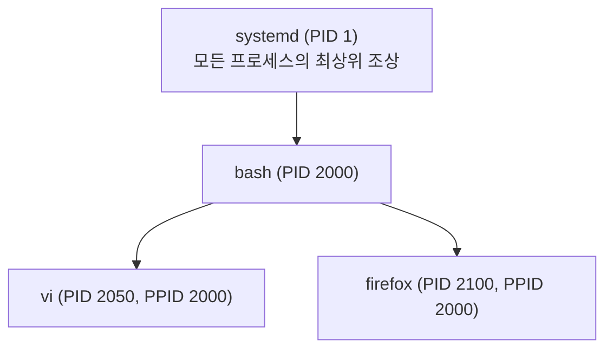

## 프로그램과 프로세스는 왜 다른 말인가

컴퓨터를 쓰다 보면 "프로그램을 실행한다"는 말과 "프로세스가 돈다"는 말을 섞어 쓰기 쉽지만, 리눅스(그리고 대부분의 운영체제)는 이 둘을 엄격히 구분한다. 구분하지 않으면 "같은 프로그램을 두 번 실행했을 때 왜 서로 다른 것처럼 동작하는가"를 설명할 수 없기 때문이다.

**프로그램(program)** 은 디스크에 저장된, 아직 실행되지 않은 정적인 파일이다. 예를 들어 `/usr/bin/firefox`는 그 자체로는 그냥 디스크에 놓인 실행 파일 덩어리일 뿐, 실행되기 전까지는 CPU나 메모리를 전혀 쓰지 않는다.

**프로세스(process)** 는 그 프로그램을 실행해서 메모리에 올라간, 살아 움직이는 작업 단위다. 사용자가 firefox 아이콘을 두 번 클릭하면, 운영체제는 디스크의 프로그램 파일을 읽어 메모리 공간을 할당하고, 그 안에 프로그램 코드를 올리고, CPU 시간을 배정해 실제로 명령어를 실행시키기 시작한다.

## PID와 PPID, 부모자식 관계

리눅스 커널은 시스템에서 동시에 돌아가는 수많은 프로세스를 구별하기 위해, 프로세스가 생성될 때마다 고유한 번호를 하나씩 붙인다. 이 번호가 **PID(Process Identifier, 프로세스 식별 번호)** 다.

리눅스에서 새 프로세스는 마법처럼 허공에서 생기지 않는다. 이 복제 동작을 시스템 콜(system call, 프로그램이 커널에게 특정 작업을 요청하는 표준화된 창구) 이름을 따서 **fork(포크)** 라고 부른다.

예를 들어 사용자가 bash 셸(PID 2000이라고 하자)에서 `vi memo.txt`라는 명령을 실행하면, bash는 fork로 자기 복제를 한 뒤 그 복제본이 `vi` 프로그램으로 자기 자신을 바꿔치기(exec라는 또 다른 시스템 콜)한다. 그 결과 새로 생긴 vi 프로세스(예: PID 2050)는 PPID로 2000을 갖게 되어, "나는 PID 2000인 bash가 낳은 자식이다"라는 관계가 기록된다.


```mermaid
graph TD
    A["systemd (PID 1)<br/>모든 프로세스의 최상위 조상"] --> B["bash (PID 2000)"]
    B --> C["vi (PID 2050, PPID 2000)"]
    B --> D["firefox (PID 2100, PPID 2000)"]
```

이 부모-자식 관계를 계속 거슬러 올라가면 결국 시스템이 부팅될 때 커널이 가장 먼저 실행하는 단 하나의 프로세스에 도달한다. 이 최초의 프로세스는 항상 **PID 1**을 부여받으며, 오래된 시스템은 `init`이라는 이름을, 현재 대부분의 배포판은 `systemd`라는 이름을 쓴다(04편의 부팅 과정에서 다룬 내용과 이어진다).

## 포그라운드와 백그라운드

셸에서 명령을 실행하는 방식에는 두 가지가 있다. 명령을 입력하고 그 명령이 끝날 때까지 셸이 다음 입력을 받지 않고 기다리는 방식이 **포그라운드(foreground, 전경) 실행**이다.

반면 명령 끝에 앰퍼샌드(`&`)를 붙여 실행하면, 셸은 그 명령을 뒤로 돌려보내고 곧바로 다음 명령을 입력할 수 있는 상태로 프롬프트를 돌려준다. 이렇게 실행되는 프로세스를 **백그라운드(background, 배경) 실행**이라 한다.

```text
$ cp big_file.iso /backup/ &
[1] 3210
$ ls
```

위 예시에서 `[1]`은 셸이 관리하는 작업 번호(job number)이고, `3210`은 그 백그라운드 프로세스의 PID다. 명령을 백그라운드로 돌려보낸 직후 곧바로 `$` 프롬프트가 다시 나타나 `ls`를 실행할 수 있었다는 점에 주목하자.

<Callout type="warning">
  `[Ctrl] + [c]`와 `[Ctrl] + [z]`를 혼동하기 쉽다. `[Ctrl] + [c]`는 포그라운드 프로세스에 인터럽트 신호를 보내 그 자리에서 종료시키는 반면, `[Ctrl] + [z]`는 종료가 아니라 일시 정지(suspend)만 시킨다. 정지된 프로세스는 `bg`나 `fg`로 다시 깨울 수 있지만, `[Ctrl] + [c]`로 종료된 프로세스는 되살릴 수 없다.
</Callout>

## 데몬 — 백그라운드에서 계속 사는 프로세스

일반적인 백그라운드 프로세스(예: 위에서 본 `cp ... &`)는 작업이 끝나면 스스로 종료된다. 예를 들어 웹 서버는 사용자가 요청을 보낼 때마다 즉시 응답할 수 있도록 항상 대기하고 있어야 하고, 프린터 관리 서비스는 언제 인쇄 요청이 들어올지 모르니 계속 떠서 기다려야 한다.

이렇게 특정 서비스를 처리하기 위해 백그라운드에서 무기한 상주하며 대기하는 프로세스를 **데몬(daemon)** 이라고 부른다. 데몬은 보통 터미널(제어 터미널, controlling terminal — 사용자가 명령을 입력하고 결과를 보는 화면 연결)과의 연결을 스스로 끊어서, 그 터미널을 닫아도 함께 종료되지 않도록 설계된다.

## 좀비 프로세스와 고아 프로세스

프로세스의 생애 주기 중 마지막 단계에서 발생하는 두 가지 특이한 상태가 있다. 이름이 비슷하게 들릴 수 있지만 발생 원인이 정반대이므로 반드시 대조해서 기억해야 한다.

### 좀비 프로세스 — 자식이 죽었는데 부모가 뒤처리를 안 한 경우

프로세스가 실행을 마치고 종료되면, 그 프로세스가 사용하던 메모리나 파일 핸들 같은 자원은 대부분 커널이 즉시 회수한다. 하지만 딱 하나, "이 프로세스가 어떤 종료 코드(exit code, 정상 종료면 0, 비정상 종료면 다른 값)로 끝났는가"라는 정보는 곧바로 사라지지 않는다.

문제는 부모 프로세스가 이 `wait()` 호출을 하지 않고 방치하는 경우다. 이 상태를 **좀비 프로세스(zombie process)** 라고 부른다.

좀비 프로세스는 실질적인 자원(CPU·메모리)을 거의 차지하지 않으므로 한두 개 있다고 시스템이 느려지지는 않는다. 좀비는 이미 죽은 프로세스이므로 `kill` 명령으로 다시 죽이는 것이 불가능하다.

### 고아 프로세스 — 부모가 먼저 죽어 버린 경우

**고아 프로세스(orphan process)** 는 좀비와 정반대의 원인으로 생긴다. 예를 들어 어떤 프로그램이 작업을 백그라운드에 자식으로 띄워 놓은 채 자기 자신은 먼저 끝나 버리면, 그 자식은 갑자기 부모를 잃게 된다.

리눅스 커널은 이런 상황을 방치하지 않는다. 부모를 잃은 자식 프로세스는 즉시 PID 1(systemd 또는 init)의 양자로 자동 입양되어, PPID가 원래 부모의 PID에서 1로 바뀐다.

### 두 상태를 정면으로 비교하기

| 구분 | 좀비 프로세스(zombie) | 고아 프로세스(orphan) |
|---|---|---|
| 무엇이 먼저 죽었나 | 자식이 먼저 종료됨 | 부모가 먼저 종료됨 |
| 지금 살아 있는 쪽 | 부모(정상 실행 중이지만 회수를 안 함) | 자식(정상 실행을 계속함) |
| ps STAT 표시 | `Z`(및 `<defunct>`) | 특별한 상태 표시 없이 정상 실행 상태 |
| 실제로 실행 중인가 | 아니오 — 이미 종료됐고 껍데기만 남음 | 예 — 여전히 정상적으로 실행 중 |
| 시스템에 주는 영향 | PID 자원을 계속 점유(누적되면 문제) | 거의 없음 — 곧 PID 1에게 입양되어 정상 관리됨 |
| 해결·처리 | 부모의 wait 호출, 또는 부모 종료로 PID 1이 회수하게 유도 | 커널이 자동으로 PID 1에게 입양시켜 스스로 해결됨 |

정리하면, 좀비는 "이미 끝난 자식의 뒤처리가 안 된 상태"이고 고아는 "아직 살아 있는 자식이 보호자를 잃은 상태"다. 시험에서는 이 둘을 뒤섞어 "고아 프로세스는 부모가 회수하지 않아 생긴다"거나 "좀비 프로세스는 부모를 잃어 즉시 종료된다"처럼 정의를 서로 바꿔치기한 오답 보기가 자주 등장한다.

## 자주 틀리는 점

- "프로그램을 두 개 실행한다"와 "프로세스가 두 개 생긴다"를 같은 말로 여기기 쉽지만, 프로그램은 디스크의 정적 파일 하나, 프로세스는 그것을 실행해 메모리에 올린 각각 독립된 실행 단위다.
- PID 1(init/systemd)이 예외적으로 부모가 없는 프로세스라는 점, 그리고 이 사실이 "모든 프로세스는 부모를 가진다"는 일반화에 대한 유일한 예외로 종종 출제된다.
- `[Ctrl] + [z]`를 프로세스 종료 단축키로 착각하는 경우가 많다. 이 조합은 정지(suspend)이지 종료가 아니다.
- 좀비와 고아의 정의를 서로 뒤바꿔 서술한 오답 보기에 특히 주의해야 한다. "누가 먼저 죽었는가"를 기준으로 구분한다.

## 핵심 정리

- 프로그램은 디스크의 정적 파일, 프로세스는 그 프로그램이 메모리에 올라가 실행 중인 동적 단위다.
- 모든 프로세스는 fork로 생성되며 PID(자기 번호)와 PPID(부모 번호)를 갖는다. 최상위 조상은 PID 1(init/systemd)이다.
- 포그라운드는 셸이 명령 종료를 기다리는 실행, 백그라운드(`&`)는 셸이 곧바로 다음 명령을 받는 실행이다.
- 데몬은 특정 서비스를 위해 백그라운드에서 무기한 상주하는 프로세스다.
- 좀비는 자식이 먼저 죽었는데 부모가 회수하지 않은 상태, 고아는 부모가 먼저 죽어 자식이 PID 1에게 입양되는 상태다.

## 마무리 복습

<Quiz
  questionNumber={1}
  question={"프로그램과 프로세스의 관계에 대한 설명으로 가장 알맞은 것은?"}
  options={["프로그램과 프로세스는 완전히 같은 개념으로, 용어만 다르게 쓴다","프로그램은 디스크에 저장된 정적인 실행 파일이고, 프로세스는 그 프로그램이 실행되어 메모리에 올라간 동적인 작업 단위다","프로세스가 먼저 생성된 뒤 그 안에서 프로그램이 만들어진다","하나의 프로그램은 동시에 하나의 프로세스로만 실행될 수 있다"]}
  correctAnswer={2}
  explanation={"프로그램은 디스크의 정적 파일이고, 프로세스는 그 프로그램을 실행해 메모리에 올라간 동적 실행 단위다. 같은 프로그램도 여러 개의 독립된 프로세스로 동시에 실행될 수 있다."}
/>

<Quiz
  questionNumber={2}
  question={"PID와 PPID에 대한 설명으로 틀린 것은?"}
  options={["PID는 시스템 안에서 각 프로세스를 구별하는 고유한 번호다","PPID는 그 프로세스를 만들어 낸 부모 프로세스의 PID를 가리킨다","시스템에서 부모 없이 존재할 수 있는 프로세스는 하나도 없다","자식 프로세스는 부모 프로세스가 fork로 자기 자신을 복제해 만들어진다"]}
  correctAnswer={3}
  explanation={"PID 1(init 또는 systemd)은 부팅 시 커널이 가장 먼저 실행하는 프로세스로, 예외적으로 부모가 없는 유일한 프로세스다. 따라서 모든 프로세스가 부모를 가진다는 설명은 틀렸다."}
/>

<Quiz
  questionNumber={3}
  question={"다음 중 포그라운드 프로세스를 백그라운드로 전환하기 위해 누르는 키 조합으로 알맞은 것은?"}
  options={["[Ctrl] + [c]","[Ctrl] + [a]","[Ctrl] + [z]","[Ctrl] + [d]"]}
  correctAnswer={3}
  explanation={"[Ctrl] + [z]는 실행 중인 포그라운드 프로세스를 종료가 아니라 일시 정지시킨다. 정지된 작업은 이어서 bg 명령으로 백그라운드에서 계속 실행하게 만들 수 있다."}
/>

## 참고 자료

- [Linux man-pages 프로젝트](https://www.kernel.org/doc/man-pages/)
- [The Linux Documentation Project](https://tldp.org)
