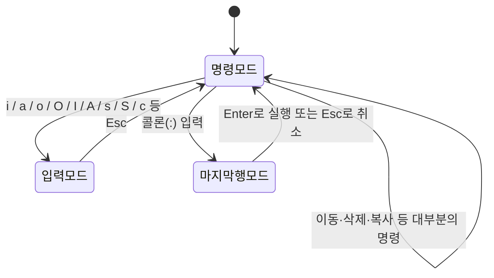

<Callout type="info">
  **이번 문서의 목표:** 이 파일을 다 읽으면 vi 편집기의 세 가지 모드를 정확히 전환할 수 있고, 이동·삭제·복사·검색·치환·저장 명령을 기능별로 구분해 쓸 수 있으며, `:wq`와 `ZZ`처럼 헷갈리기 쉬운 명령의 차이를 시험에서 바로 골라낼 수 있다.
</Callout>

## vi가 왜 아직도 시험에 나오는가

리눅스에는 GUI(Graphical User Interface, 그래픽 사용자 인터페이스) 없이 검은 화면(콘솔)만 뜨는 상황이 자주 생긴다. 서버에 원격 접속했는데 마우스도 없고 메뉴도 없는 상태에서 설정 파일 한 줄을 고쳐야 할 때, 어떤 리눅스 배포판에도 예외 없이 설치되어 있는 편집기가 바로 **vi**다. 그래서 리눅스마스터 시험은 vi를 "선택 가능한 여러 에디터 중 하나"가 아니라 "누구나 반드시 다룰 줄 알아야 하는 최소 공통 도구"로 취급하고, 실제로 리눅스마스터 2급 1차 기출에서 vi 관련 문항은 회차마다 빠지지 않고 등장한다.

> **쉽게 말하면:** vi는 마우스 없이 키보드만으로 글자를 넣고 지우고 저장하는, 리눅스라면 어디에나 있는 표준 텍스트 편집기(text editor)다.

vi라는 이름 자체도 뜻이 있다. "visual"의 앞 두 글자를 딴 이름으로, 한 줄씩만 보여주던 이전 세대 편집기 ed와 달리 화면 전체를 보면서 편집할 수 있다는 뜻에서 붙었다. 1976년 빌 조이(Bill Joy)가 BSD 유닉스용으로 만들었고, 이후 브람 몰레나르(Bram Moolenaar)가 기능을 크게 확장한 버전이 vim(Vi IMproved)이다. 리눅스 배포판 대부분은 `vi`라고 입력해도 실제로는 vim이 실행되도록 연결(alias)해 두었지만, 시험에서는 vi 자체의 기본 동작을 기준으로 묻는다.

## vi의 3가지 모드와 전환 — 시험 단골 개념

vi를 처음 켠 사람이 가장 당황하는 지점은 "글자를 입력했는데 화면이 이상하게 움직인다"는 것이다. 이유는 단 하나, **지금 어느 모드에 있는지 모르기 때문**이다. vi는 워드프로세서처럼 아무 때나 타이핑하면 바로 글자가 써지는 구조가 아니라, 지금 누른 키를 "명령"으로 볼지 "입력할 글자"로 볼지를 모드로 구분한다.

> **쉽게 말하면:** vi는 지금 키보드 입력을 "명령"으로 읽을지 "글자"로 읽을지를 세 가지 모드로 나눠서 관리한다.

### 세 모드의 정의

1. **명령 모드**(command mode) — vi를 처음 열면 항상 이 모드로 시작한다. 이 상태에서 키를 누르면 그 키는 글자가 아니라 "커서를 옮겨라", "한 줄을 지워라" 같은 명령으로 해석된다.
2. **입력 모드**(insert mode) — 실제로 글자를 타이핑해서 문서에 써 넣는 모드다. 명령 모드에서 `i`, `a` 같은 키를 눌러야 이 모드로 들어간다.
3. **마지막 행 모드**(last line mode, ex 모드라고도 부른다) — 화면 맨 아래 줄에 콜론(`:`)이 나타나고, 그 뒤에 저장·종료·치환·설정 같은 좀 더 복잡한 명령을 문자열로 입력하는 모드다.

### 전환 규칙

세 모드는 마음대로 아무 데로나 넘어가는 것이 아니라 정해진 경로로만 움직인다. 이 전환 규칙을 정확히 아는지가 기출의 핵심이다.

이 그림에서 꼭 기억해야 할 세 가지 화살표는 다음과 같다.

- **입력 모드에서 명령 모드로 돌아가는 유일한 키는 `Esc`다.** 다른 어떤 키로도 돌아갈 수 없다. 입력 모드에서 아무리 명령처럼 보이는 키(예: `x`)를 눌러도 그건 그냥 "x라는 글자가 입력됨"으로 처리된다.
- **명령 모드에서 입력 모드로 가는 문은 하나가 아니라 여러 개다.** `i`(insert), `a`(append), `o`(open) 등 커서가 어디에 어떻게 놓이는지가 각기 다르다. 자세한 키는 아래 이동·삽입 표에서 정리한다.
- **마지막 행 모드는 입력 모드에서 바로 갈 수 없다.** 입력 모드에서 콜론을 누르면 그냥 화면에 콜론이라는 글자가 써질 뿐이다. 반드시 먼저 `Esc`로 명령 모드로 나온 다음에 콜론을 눌러야 한다.

**자주 틀리는 점**: "입력 모드에서 저장하려면 `:wq`를 누르면 된다"고 착각하는 경우가 매우 많다. 실제로는 입력 모드에서 `Esc`를 먼저 눌러 명령 모드로 나온 뒤에야 `:wq`가 명령으로 인식된다. 이 순서(입력 모드 → `Esc` → 명령 모드 → `:` → 마지막 행 모드)를 묻는 문제가 반복해서 나온다.

## 명령 모드에서 입력 모드로 들어가는 키

같은 "입력 모드로 진입"이라도 커서가 어디에 놓이고 어떤 내용이 먼저 지워지는지가 키마다 다르다. 이 차이를 표로 정리한다.

| 키 | 동작 | 커서 위치 |
|----|------|-----------|
| `i` | 커서 앞(왼쪽)부터 입력 시작 | 현재 위치 |
| `a` | 커서 뒤(오른쪽)부터 입력 시작(append) | 현재 위치 다음 |
| `I` | 현재 줄의 맨 앞부터 입력 시작 | 줄의 시작 |
| `A` | 현재 줄의 맨 끝부터 입력 시작 | 줄의 끝 |
| `o` | 현재 줄 아래에 새 줄을 열어 입력 시작(open) | 아래 새 줄 |
| `O` | 현재 줄 위에 새 줄을 열어 입력 시작 | 위 새 줄 |
| `s` | 커서의 한 글자를 지우고 입력 시작(substitute) | 지워진 자리 |
| `cw` | 커서부터 한 단어를 지우고 입력 시작(change word) | 지워진 단어 자리 |

작은 예시로 감을 잡아 보자. 화면에 `Linux`라는 단어가 있고 커서가 `L` 위에 있다고 하자.

- `i`를 누르고 `The `를 입력하면 `The Linux`가 된다(L 앞에 삽입).
- 커서를 `x` 위로 옮긴 뒤 `a`를 누르고 ` OS`를 입력하면 `Linux OS`가 된다(x 뒤에 삽입).
- `A`를 누르면 커서 위치와 상관없이 그 줄 맨 끝으로 이동한 뒤 입력이 시작된다.

**자주 틀리는 점**: `i`와 `a`를 커서 위치 기준 "앞/뒤"로 헷갈리는 문제, `o`와 `O`를 "위/아래" 기준으로 반대로 아는 문제가 자주 나온다. o는 소문자가 아래(open below), O는 대문자가 위(open above)라고 "소문자는 아래로 열린다"는 식으로 짝지어 외우면 헷갈리지 않는다.

## 이동 명령

vi에서 화살표 키 없이도 커서를 자유자재로 옮기는 것이 숙련도의 기준이다. 방향키가 없던 초기 유닉스 단말기 환경에서 만들어졌기 때문에, 오른손이 자판 중앙에서 벗어나지 않도록 `h`, `j`, `k`, `l` 네 글자에 이동 기능을 배정한 것이 vi의 특징이다.

| 키 | 이동 | 비고 |
|----|------|------|
| `h` | 왼쪽으로 한 칸 | 방향키 왼쪽과 동일 |
| `l` | 오른쪽으로 한 칸 | 방향키 오른쪽과 동일 |
| `j` | 아래로 한 줄 | 방향키 아래와 동일 |
| `k` | 위로 한 줄 | 방향키 위와 동일 |
| `w` | 다음 단어의 시작으로 | word |
| `b` | 이전 단어의 시작으로 | back |
| `e` | 현재(또는 다음) 단어의 끝으로 | end |
| `0` | 그 줄의 맨 앞 칸으로 | 숫자 0 |
| `$` | 그 줄의 맨 끝으로 | |
| `^` | 그 줄에서 공백이 아닌 첫 글자로 | |
| `gg` | 문서의 첫 줄로 | |
| `G` | 문서의 마지막 줄로 | |
| `숫자G` | 해당 줄 번호로 이동(예: `10G`는 10번째 줄) | |
| `Ctrl+f` | 한 화면 아래로(forward) | 페이지 단위 |
| `Ctrl+b` | 한 화면 위로(backward) | 페이지 단위 |

**자주 틀리는 점**: `gg`(문서 맨 앞)와 `G`(문서 맨 끝)를 반대로 외우는 경우가 많다. `G`는 대문자라 "끝(Ground의 마지막, 혹은 그냥 큰 이동)"으로, `gg`는 소문자를 두 번 눌러야 하는 만큼 "처음으로 되돌아간다"고 연결 지으면 기억하기 쉽다. 또한 `0`(숫자 0, 줄의 맨 앞 칸)과 `^`(공백이 아닌 첫 글자)를 같은 것으로 착각하는 문제도 나온다. 들여쓰기가 있는 줄에서는 두 키의 결과가 달라진다.

## 삭제 명령

| 키 | 동작 |
|----|------|
| `x` | 커서 위치의 한 글자 삭제 |
| `X` | 커서 앞(왼쪽) 한 글자 삭제 |
| `dd` | 커서가 있는 줄 전체 삭제 |
| `dw` | 커서부터 단어 하나 삭제 |
| `D` | 커서부터 그 줄 끝까지 삭제 |
| `숫자dd` | 지정한 수만큼 줄 삭제(예: `3dd`는 3줄 삭제) |

vi에서 삭제 명령은 사실 "삭제"이면서 동시에 "잘라내기(cut)"다. 지운 내용은 사라지는 게 아니라 임시 저장 공간(레지스터)에 담기기 때문에, 뒤에서 다룰 붙여넣기 명령으로 바로 되살릴 수 있다. 그래서 시험에서는 `dd` 뒤에 `p`를 눌러 무엇이 되는지 실행 결과를 묻는 문제가 나온다.

**자주 틀리는 점**: 삭제를 취소하는 키는 `u`(undo)다. 참고 자료의 기출에서도 "직전에 삭제한 줄을 복원하는 명령"을 묻고 오답으로 `r`(문자 하나를 바꾸는 replace), `c`(변경 후 입력 모드로 진입하는 change), `dd`(오히려 또 삭제하는 명령)를 배치한 사례가 있다. u는 되돌리기, `Ctrl+r`은 되돌린 것을 다시 실행(redo)한다는 점까지 짝지어 기억해 둔다.

## 복사·붙여넣기 명령

| 키 | 동작 |
|----|------|
| `yy` | 커서가 있는 줄 전체 복사(yank) |
| `yw` | 커서부터 단어 하나 복사 |
| `숫자yy` | 지정한 수만큼 줄 복사(예: `3yy`는 3줄 복사) |
| `p` | 복사·삭제한 내용을 커서 다음(아래)에 붙여넣기(put) |
| `P` | 복사·삭제한 내용을 커서 앞(위)에 붙여넣기 |

복사는 `y`(yank, "잡아채다"는 뜻에서 온 이름)로 시작한다. 삭제(`dd`)든 복사(`yy`)든 결과물은 같은 임시 저장 공간에 들어가므로, `dd`로 줄을 지운 뒤 다른 위치에서 `p`를 누르면 "잘라내기 후 붙여넣기"가 되고, `yy` 뒤에 `p`를 누르면 "복사 후 붙여넣기"가 된다.

작은 예시로 확인해 보자. 세 줄짜리 문서 `1행`, `2행`, `3행`에서 커서가 `1행`에 있을 때 `yy`를 누르고 `3행`으로 이동해 `p`를 누르면, 결과는 `1행`, `2행`, `3행`, `1행` 순서가 된다. `p`는 현재 줄 "다음"에 붙기 때문에 `3행` 바로 아래에 복사본이 생긴다.

**자주 틀리는 점**: `p`(소문자, 아래·뒤)와 `P`(대문자, 위·앞)의 방향을 반대로 아는 문제가 자주 나온다. 앞의 `o`/`O` 삽입 규칙과 똑같이 "소문자는 아래쪽" 규칙으로 함께 묶어 외우면 헷갈리지 않는다.

## 검색과 치환 명령

| 명령 | 동작 |
|------|------|
| `/문자열` | 커서 아래쪽(뒤) 방향으로 문자열 검색 |
| `?문자열` | 커서 위쪽(앞) 방향으로 문자열 검색 |
| `n` | 방금 검색한 방향으로 다음 결과 찾기 |
| `N` | 방금 검색한 반대 방향으로 다음 결과 찾기 |
| `:s/old/new/` | 현재 줄에서 처음 나오는 old를 new로 치환 |
| `:s/old/new/g` | 현재 줄의 모든 old를 new로 치환(global) |
| `:%s/old/new/g` | 문서 전체의 모든 old를 new로 치환 |

치환 명령의 형식은 `콜론` + `범위` + `s`(substitute) + `/찾을 문자열/바꿀 문자열/` + `옵션`이다. 범위를 생략하면 커서가 있는 현재 줄에만 적용되고, `%`를 붙이면 문서 전체(1행부터 마지막 행까지)로 범위가 넓어진다. 끝에 `g`를 붙이지 않으면 한 줄에 여러 번 나오는 대상 문자열 중 **첫 번째 하나만** 바뀐다는 점이 시험에서 자주 노려진다.

검색에는 정규표현식의 기본 기호인 `^`(줄의 시작)과 `$`(줄의 끝)를 함께 쓸 수 있다. 예를 들어 한 줄 전체가 정확히 `linux`인 경우에만 `Linux`로 바꾸고 싶다면, 단순히 `:%s/linux/Linux/g`라고 쓰면 다른 단어 속에 섞인 `linux`(예: `linux-kernel`)까지 바뀌어 버린다. 이럴 때는 `:%s/^linux$/Linux/g`처럼 줄의 시작(`^`)과 끝(`$`) 사이에 정확히 `linux`만 있는 줄이라는 조건을 걸어야 한다.

**자주 틀리는 점**: 치환 명령의 슬래시 순서를 "old와 new의 위치"가 아니라 "화살표처럼 앞뒤가 바뀐 것"으로 착각해 `:%s/새단어/^옛단어$/g`처럼 앞뒤를 뒤집힌 형태로 제시하는 오답이 기출에 등장한 바 있다. 항상 `찾을 대상 → 바꿀 대상` 순서이며, 조건을 거는 `^`, `$` 같은 기호는 "찾을 대상" 쪽에만 붙는다는 점을 기억해야 한다.

## 저장과 종료 명령 — 가장 많이 틀리는 자리

vi 문제에서 정답률이 가장 낮은 영역이 바로 이 저장·종료 명령이다. 겉보기에 `:w`, `:q`, `:wq`, `:q!`, `:wq!`, `ZZ`는 전부 비슷해 보이지만 각각이 하는 일은 분명히 다르다.

| 명령 | 저장 여부 | 종료 여부 | 강제 여부 |
|------|-----------|-----------|-----------|
| `:w` | 저장한다 | 종료하지 않는다 | 해당 없음 |
| `:q` | 저장하지 않는다 | 종료한다(단, 수정 후 저장 안 했으면 거부됨) | 아니오 |
| `:wq` | 저장한다 | 종료한다 | 해당 없음 |
| `:q!` | 저장하지 않는다 | 강제로 종료한다 | 예 |
| `:wq!` | 저장한다 | 강제로 종료한다 | 예 |
| `ZZ` | 수정이 있었을 때만 저장한다 | 종료한다 | 해당 없음 |

이 표를 외우기보다 **원리로 이해**하는 편이 실수를 줄인다. vi는 "수정한 내용이 있는데 저장하지 않고 그냥 나가려 하면" 안전을 위해 경고를 띄우고 종료를 거부한다. 이때 사용자가 선택할 수 있는 길은 두 가지뿐이다. 저장하고 나가거나(`:wq`), 수정 내용을 버리고 강제로 나가거나(`:q!`)다. 뒤에 붙는 느낌표(`!`)는 "지금 뜨는 경고를 무시하고 강행하라"는 뜻의 강제 지정 기호로, `:q!`뿐 아니라 `:wq!`에도 같은 의미로 붙는다. 단, `:wq!`에서는 이미 저장하는 명령이라 경고가 뜰 상황 자체가 거의 없고, 주로 **읽기 전용(read-only)으로 열었던 파일을 강제로 덮어쓸 때** 쓰인다.

`ZZ`는 콜론 없이 명령 모드에서 대문자 Z를 두 번 눌러 실행하는 특수한 단축 명령이다. 동작은 "수정된 내용이 있으면 저장하고 종료, 수정된 내용이 없으면 저장 없이 그냥 종료"다. 즉 `:wq`와 결과가 같아 보이지만 **수정이 전혀 없었을 때는 파일을 다시 쓰지 않는다**는 미세한 차이가 있다. `:x`도 `ZZ`와 같은 동작(수정이 있을 때만 저장 후 종료)을 하는 마지막 행 모드 명령이다.

**자주 틀리는 점**: "저장만 하고 vi를 계속 쓰고 싶을 때 `:wq`를 쓴다"는 착각이 흔하다. `:wq`는 반드시 종료까지 함께 실행되므로, 저장만 하고 편집을 계속하려면 `:w`만 써야 한다. 또한 `:q!`가 "저장하고 강제 종료"라고 반대로 아는 경우도 많다. `:q!`는 **저장하지 않고** 버리는 명령이라는 점을 정확히 구분해야 한다.

## vi 옵션 설정 — 마지막 행 모드의 또 다른 쓰임

마지막 행 모드는 저장·종료·치환뿐 아니라 편집 환경을 조정하는 `:set` 명령에도 쓰인다. 시험에 자주 나오는 옵션은 다음과 같다.

| 명령 | 기능 |
|------|------|
| `:set number` (약어 `:set nu`) | 줄마다 행 번호를 표시 |
| `:set autoindent` (약어 `:set ai`) | 이전 줄과 같은 들여쓰기를 자동 적용 |
| `:set showmatch` (약어 `:set sm`) | 괄호를 닫을 때 짝이 되는 괄호를 강조 표시 |
| `:set ignorecase` (약어 `:set ic`) | 검색할 때 대소문자를 구분하지 않음 |

옵션을 끌 때는 이름 앞에 `no`를 붙인다. 예를 들어 행 번호를 끄려면 `:set nonumber`(약어 `:set nonu`)를 입력한다.

## 핵심 정리

- vi는 **명령 모드 → 입력 모드는 `i`/`a`/`o` 등으로**, **입력 모드 → 명령 모드는 오직 `Esc`로만**, **명령 모드 → 마지막 행 모드는 콜론으로** 이동한다.
- 이동은 `h`/`j`/`k`/`l`과 `w`/`b`/`e`, `0`/`$`/`^`, `gg`/`G`로 구분해 외운다.
- 삭제(`dd`, `x`)와 복사(`yy`)는 같은 임시 저장 공간을 쓰며, `p`(아래·뒤)/`P`(위·앞)로 붙여넣는다. 되돌리기는 `u`다.
- 치환은 `:%s/찾을것/바꿀것/g` 형식이며, `^`와 `$`로 줄 전체 일치 조건을 걸 수 있다.
- 저장·종료는 `:w`(저장만), `:q`(저장 없이 종료, 수정 있으면 거부), `:wq`(저장 후 종료), `:q!`(강제로 버리고 종료), `:wq!`(강제로 저장 후 종료), `ZZ`(수정 있을 때만 저장 후 종료)로 명확히 구분한다.

## 마무리 복습

<Quiz
  questionNumber={1}
  question="vi 편집기에서 입력 모드에 있을 때, 명령 모드로 돌아가기 위해 눌러야 하는 키로 알맞은 것은?"
  options={['콜론', 'Esc', 'Enter', 'Tab']}
  correctAnswer={2}
  explanation="입력 모드에서 명령 모드로 돌아가는 유일한 키는 Esc다. 콜론은 명령 모드에서만 마지막 행 모드로 넘어가는 키이며, 입력 모드에서 누르면 그냥 글자로 입력된다."
  optionExplanations={['콜론은 명령 모드에서 마지막 행 모드로 갈 때 쓰는 키이며 입력 모드에서는 그냥 문자로 입력된다', 'Esc가 입력 모드에서 명령 모드로 돌아가는 유일한 키다', 'Enter는 줄바꿈이나 마지막 행 모드 명령 실행에 쓰이며 모드 전환 키가 아니다', 'Tab은 들여쓰기 문자로 입력될 뿐 모드 전환과 무관하다']}
/>

<Quiz
  questionNumber={2}
  question="vi 명령 모드에서 커서가 있는 줄의 아래에 새 줄을 열어 바로 입력을 시작하는 명령으로 알맞은 것은?"
  options={['O', 'o', 'A', 'I']}
  correctAnswer={2}
  explanation="소문자 o는 현재 줄 아래에 새 줄을 열고 입력 모드로 들어간다. 대문자 O는 반대로 위에 새 줄을 연다."
  optionExplanations={['대문자 O는 현재 줄 위에 새 줄을 여는 명령이다', '소문자 o가 현재 줄 아래에 새 줄을 여는 명령으로 옳다', 'A는 현재 줄의 맨 끝에서 입력을 시작하는 명령으로 새 줄을 열지 않는다', 'I는 현재 줄의 맨 앞에서 입력을 시작하는 명령으로 새 줄을 열지 않는다']}
/>

<Quiz
  questionNumber={3}
  question="vi 명령 모드에서 방금 삭제한 줄을 되돌리기 위해 실행하는 명령으로 알맞은 것은?"
  options={['r', 'c', 'u', 'dd']}
  correctAnswer={3}
  explanation="u는 undo, 즉 직전 작업을 취소하는 명령이다. 삭제한 줄을 그대로 복원한다."
  optionExplanations={['r은 커서 위치의 한 글자를 다른 문자로 바꾸는 replace 명령이다', 'c는 대상을 지우고 입력 모드로 들어가는 change 명령이다', 'u가 직전 작업을 취소하는 undo 명령으로 옳다', 'dd는 오히려 현재 줄을 또 삭제하는 명령이라 복원과 반대다']}
/>

<Quiz
  questionNumber={4}
  question="vi 편집기에서 문서 전체의 apple을 모두 orange로 치환하는 마지막 행 모드 명령으로 알맞은 것은?"
  options={['첫 번째 apple을 orange로 바꾸는 콜론 s 명령', '전체 범위에서 첫 번째 apple만 orange로 바꾸는 콜론 퍼센트 s 명령', '전체 범위에서 모든 apple을 orange로 바꾸는 콜론 퍼센트 s 명령에 g 옵션을 붙인 것', '현재 줄의 모든 apple을 orange로 바꾸는 콜론 s 명령에 g 옵션을 붙인 것']}
  correctAnswer={3}
  explanation="문서 전체를 대상으로 하려면 범위 기호 퍼센트를 붙이고, 한 줄에 여러 번 나오는 대상을 모두 바꾸려면 g 옵션을 붙여야 한다. 두 조건을 모두 만족하는 것은 콜론 퍼센트 s 슬래시 apple 슬래시 orange 슬래시 g다."
  optionExplanations={['범위를 지정하지 않으면 현재 줄에만 적용되고, g 옵션이 없으면 줄마다 첫 번째 하나만 바뀐다', '퍼센트로 전체 범위는 맞지만 g 옵션이 없어 각 줄의 첫 번째 apple만 바뀐다', '퍼센트로 문서 전체를, g로 한 줄의 모든 대상을 바꾸므로 옳다', '현재 줄에만 적용되어 문서 전체를 바꾸지 못한다']}
/>

<Quiz
  questionNumber={5}
  question="vi 편집기에서 수정한 내용이 있을 때 저장하지 않고 변경 사항을 모두 버린 뒤 강제로 종료하는 명령으로 알맞은 것은?"
  options={[':wq', ':q!', ':w', 'ZZ']}
  correctAnswer={2}
  explanation="느낌표는 경고를 무시하고 강행하라는 뜻이며, q는 저장 없는 종료를 뜻한다. 따라서 콜론 q 느낌표가 수정 사항을 버리고 강제 종료하는 명령이다."
  optionExplanations={['콜론 wq는 저장한 뒤 종료하는 명령이라 수정 사항을 버리는 것과 반대다', '콜론 q 느낌표가 저장 없이 강제로 종료하는 명령으로 옳다', '콜론 w는 저장만 하고 종료하지 않는 명령이다', 'ZZ는 수정 사항이 있으면 오히려 저장한 뒤 종료하는 명령이다']}
/>

<Quiz
  questionNumber={6}
  question="vi 편집기에서 수정된 내용이 있을 때만 저장한 뒤 종료하고, 수정이 없었다면 저장하지 않고 그냥 종료하는 명령 모드 단축 명령으로 알맞은 것은?"
  options={[':wq!', 'ZZ', ':q', ':w']}
  correctAnswer={2}
  explanation="ZZ는 명령 모드에서 대문자 Z를 두 번 눌러 실행하는 명령으로, 문서가 수정되었을 때만 저장한 뒤 종료하고 수정이 없으면 저장 없이 종료한다."
  optionExplanations={['콜론 wq 느낌표는 항상 저장을 강제로 실행하는 명령이라 조건부 저장과 다르다', 'ZZ가 수정 여부에 따라 저장 여부를 결정한 뒤 종료하는 명령으로 옳다', '콜론 q는 저장을 하지 않는 종료 명령이며, 수정 사항이 있으면 오히려 종료가 거부된다', '콜론 w는 저장만 하고 종료하지 않는 명령이다']}
/>

<Quiz
  questionNumber={7}
  question="vi 명령 모드에서 커서를 문서의 맨 마지막 줄로 이동시키는 명령으로 알맞은 것은?"
  options={['gg', 'G', '$', '0']}
  correctAnswer={2}
  explanation="대문자 G는 문서의 마지막 줄로 이동한다. 소문자 두 번을 누르는 gg는 반대로 문서의 첫 줄로 이동한다."
  optionExplanations={['gg는 문서의 첫 줄로 이동하는 명령으로 방향이 반대다', 'G가 문서의 마지막 줄로 이동하는 명령으로 옳다', '기호 달러는 현재 줄의 끝으로 이동할 뿐 문서 전체의 마지막 줄과는 다르다', '숫자 0은 현재 줄의 맨 앞 칸으로 이동하는 명령이다']}
/>

<Quiz
  questionNumber={8}
  question="vi 명령 모드에서 yy로 복사한 줄을 커서가 있는 줄의 바로 위에 붙여넣는 명령으로 알맞은 것은?"
  options={['p', 'P', 'o', 'O']}
  correctAnswer={2}
  explanation="대문자 P는 복사하거나 삭제한 내용을 커서가 있는 줄의 위(앞)에 붙여넣는다. 소문자 p는 반대로 아래(뒤)에 붙여넣는다."
  optionExplanations={['소문자 p는 커서 다음, 즉 아래에 붙여넣는 명령이다', '대문자 P가 커서 앞, 즉 위에 붙여넣는 명령으로 옳다', 'o는 붙여넣기가 아니라 아래에 새 줄을 열어 입력 모드로 들어가는 명령이다', 'O는 붙여넣기가 아니라 위에 새 줄을 열어 입력 모드로 들어가는 명령이다']}
/>

## 참고 자료

- [Linux man-pages 프로젝트](https://www.kernel.org/doc/man-pages/)
- [The Linux Documentation Project](https://tldp.org)
