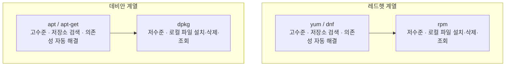

<Callout type="info">
  **이번 문서의 목표:** 이 파일을 다 읽으면 소스 코드를 직접 빌드해 설치하는 3단계 절차를 설명할 수 있고, rpm과 yum(dnf)의 관계, dpkg와 apt의 관계를 의존성 해결이라는 기준으로 정확히 구분할 수 있으며, rpm의 주요 옵션과 apt·yum의 주요 하위 명령을 시험에서 바로 골라낼 수 있다.
</Callout>

## 소프트웨어를 설치하는 세 가지 방법

03편에서 배운 것처럼 리눅스 배포판은 크게 레드햇 계열과 데비안 계열로 나뉘고, 이 갈래에 따라 쓰는 패키지 형식(rpm 또는 deb)이 갈린다. 리눅스에서 새 프로그램을 설치하는 방법은 크게 세 가지다. 첫째, 프로그램을 만든 사람이 배포한 원본 코드를 직접 내 컴퓨터에서 컴파일(compile, 사람이 읽는 코드를 컴퓨터가 실행할 수 있는 형태로 변환하는 작업)해서 설치하는 방법. 둘째, 이미 컴파일이 끝난 결과물을 압축해 둔 rpm·deb 같은 패키지 파일을 직접 설치하는 방법. 셋째, 인터넷 저장소(repository)에 있는 패키지를 명령 하나로 내려받아 설치하는 방법이다. 이 순서대로 하나씩 살펴본다.

> **쉽게 말하면:** 소프트웨어 설치는 "원본 재료로 직접 요리하기(소스 컴파일)", "완성된 반조리 식품 데우기(rpm·deb 직접 설치)", "배달 앱으로 시키기(yum·apt)" 세 방식으로 나눌 수 있다.

## 소스 컴파일 3단계 — configure, make, make install

프로그램을 만든 개발자가 소스 코드(사람이 작성한 원본 프로그램 파일들)만 배포하는 경우가 있다. 이 경우 설치하려는 컴퓨터에서 직접 컴파일해야 하는데, 이때 가장 널리 쓰이는 절차가 `./configure` → `make` → `make install` 세 단계다. 이 방식을 오토툴즈(autotools)라고 부르기도 한다.

> **쉽게 말하면:** configure는 "이 컴퓨터에서 빌드할 수 있는지 확인하고 설계도를 만드는" 단계, make는 "설계도대로 실제로 조립(컴파일)하는" 단계, make install은 "완성품을 정해진 자리에 가져다 놓는" 단계다.


각 단계가 하는 일을 순서대로 뜯어보자.

1. **`./configure`** — 이 프로그램을 컴파일하는 데 필요한 라이브러리(다른 프로그램이 공통으로 가져다 쓰는 코드 묶음)와 도구가 지금 시스템에 있는지 점검한다. 필요한 것이 빠져 있으면 오류를 내며 멈춘다. 점검이 끝나면 그 결과에 맞춰 **`Makefile`이라는 파일을 새로 만든다**. 이 파일에는 "무엇을, 어떤 순서로, 어떤 옵션으로 컴파일할지"가 적혀 있다.
2. **`make`** — 방금 만들어진 `Makefile`을 읽어서 실제로 컴파일을 수행한다. 소스 코드 파일들을 실행 가능한 이진 파일(바이너리)로 변환하는 단계이며, 아직 시스템의 정식 설치 위치로 옮기지는 않는다.
3. **`make install`** — `make`가 만들어 낸 결과물(실행 파일, 라이브러리, 문서 등)을 `/usr/local/bin` 같은 시스템의 정식 설치 경로로 복사한다. 이 단계가 끝나야 비로소 어디서든 그 프로그램을 실행할 수 있다.

**자주 틀리는 점**: "Makefile이 생성되는 단계"를 묻는 문제에서 `make` 단계를 고르는 실수가 잦다. `Makefile`을 **만드는** 것은 `configure`이고, `make`는 이미 만들어진 `Makefile`을 **읽어서 실행**할 뿐이다. 순서와 역할을 "환경 점검 및 설계도 작성(configure) → 조립(make) → 배치(make install)"로 명확히 구분해야 한다.

모든 프로젝트가 이 방식을 쓰는 것은 아니다. MySQL이나 KDE, LMMS 같은 프로젝트는 `cmake`라는 플랫폼 독립적인 빌드 구성 도구를 쓰기도 한다. `cmake`도 결국 컴파일에 필요한 설정 파일을 생성해 준다는 점에서 `configure`와 비슷한 역할을 하지만, 여러 운영체제·컴파일러 환경에 더 유연하게 대응하도록 설계된 별도의 도구다. PHP나 Apache처럼 전통적인 방식(autotools)을 쓰는 프로젝트와 구분해서 알아 두면 좋다.

소스 컴파일 방식은 최신 버전을 바로 쓸 수 있고 컴파일 옵션을 세밀하게 조정할 수 있다는 장점이 있지만, 필요한 라이브러리를 사람이 일일이 찾아서 먼저 설치해야 하고 시간도 오래 걸린다는 단점이 있다. 그래서 실무에서는 아래에서 다룰 패키지 관리자를 훨씬 더 많이 쓴다.

## 저수준 도구와 고수준 도구 — 패키지 관리의 두 층위

패키지 관리 도구를 이해하는 가장 중요한 축은 "저수준(로컬)"과 "고수준(온라인)"의 구분이다. 이 구분을 정확히 아는지가 리눅스마스터 시험에서 반복해서 나오는 핵심 포인트다.

> **쉽게 말하면:** 저수준 도구는 이미 손에 들고 있는 패키지 파일 하나를 설치·삭제·조회만 할 뿐이고, 고수준 도구는 인터넷 저장소를 뒤져서 필요한 다른 패키지까지 알아서 함께 받아 준다.

**저수준 도구**(rpm, dpkg)는 이미 다운로드해 둔 패키지 파일(`.rpm` 또는 `.deb`) 하나를 대상으로 설치·삭제·조회 작업만 수행한다. 이 패키지가 다른 어떤 패키지를 필요로 하는지는 알려줄 수 있지만, **그 필요한 패키지를 인터넷에서 찾아 자동으로 받아 오지는 못한다.** 예를 들어 A라는 프로그램을 rpm으로 설치하려는데 B라는 라이브러리가 먼저 설치되어 있어야 한다면, rpm은 "B가 없어서 설치할 수 없다"는 오류만 내고 멈춘다. B를 어디서 구해서 설치할지는 사용자가 직접 해결해야 한다. 이것이 바로 **의존성(dependency) 문제**다.

**고수준 도구**(yum·dnf, apt·apt-get)는 이 문제를 해결하기 위해 만들어졌다. 이 도구들은 인터넷에 있는 저장소(repository) 서버의 패키지 목록을 미리 갖고 있다가, 사용자가 어떤 패키지를 설치해 달라고 요청하면 그 패키지가 필요로 하는 다른 패키지들까지 저장소에서 자동으로 찾아 함께 내려받아 순서대로 설치해 준다. 내부적으로는 이 고수준 도구들도 결국 저수준 도구(rpm, dpkg)를 호출해서 실제 설치 작업을 시킨다. 즉 **고수준 도구는 저수준 도구 위에 "의존성 자동 해결"이라는 기능을 얹은 관리자**라고 이해하면 된다.



**자주 틀리는 점**: "온라인 패키지 관리 도구가 아닌 것을 고르시오" 같은 문제에서 `dpkg`나 `rpm`을 정답(저수준이라 온라인 도구가 아님)으로 골라야 하는데, 이름이 익숙하다는 이유로 `dnf`·`zypper` 같은 고수준 도구를 답으로 고르는 실수가 잦다. **저수준 도구 rpm·dpkg는 의존성 자동 해결·저장소 연동이 없다는 점이 곧 "온라인 도구가 아니다"라는 근거**가 된다.

## rpm — 레드햇 계열의 저수준 패키지 도구

rpm(Red Hat Package Manager)은 `.rpm` 확장자를 가진 패키지 파일을 직접 다루는 명령이다. 주요 옵션은 다음과 같다.

| 옵션 | 의미 | 예시 |
|------|------|------|
| `-i` | 새 패키지 설치(install) | `rpm -i nmap-7.9.rpm` |
| `-U` | 설치되어 있으면 업그레이드, 없으면 새로 설치(upgrade) | `rpm -U nmap-7.9.rpm` |
| `-e` | 패키지 삭제(erase) | `rpm -e nmap` |
| `-q` | 설치 여부·버전 조회(query) | `rpm -q nmap` |
| `-qa` | 설치된 모든 패키지 목록 조회(query all) | `rpm -qa` |
| `-V` | 패키지 파일의 무결성 검사(verify) | `rpm -V nmap` |

여기에 조회 관련 세부 옵션을 조합해서 쓰는 경우가 많다. `-qi`(패키지 정보), `-ql`(패키지가 설치한 파일 목록), `-qf`(어떤 파일이 어느 패키지 소속인지 역으로 조회), `-qc`(설정 파일 목록), `-qd`(문서 파일 목록)가 대표적이다.

작은 예시로 확인해 보자. 시스템에 이미 `/bin/ls` 파일이 있는데 이 파일이 어느 패키지가 설치한 것인지 알고 싶다면, `rpm -qf /bin/ls`를 실행한다. 결과로 `coreutils-8.22-24.el7.x86_64` 같은 패키지 이름이 출력된다. 반대로 `coreutils` 패키지가 설치한 파일 전체 목록이 궁금하다면 `rpm -ql coreutils`를 실행한다.

**자주 틀리는 점**: `-qf`(파일 → 패키지)와 `-ql`(패키지 → 파일)은 방향이 정반대인데, 이름이 비슷해서 자주 헷갈린다. **f는 file을 물어보는 방향(파일을 주면 패키지 이름을 알려줌)**, **l은 list, 즉 패키지가 가진 파일 목록을 보여주는 방향**이라고 짝지어 기억한다. 또한 `-i`(설치)와 `-U`(업그레이드 겸 설치)를 완전히 같은 것으로 착각하는 경우도 있다. `-i`는 해당 패키지가 이미 설치되어 있으면 오류를 내지만, `-U`는 있으면 덮어써 갱신하고 없으면 새로 설치하므로 더 유연하다.

`-i`, `-U`, `-e`는 rpm 스스로 의존성을 확인해 부족한 패키지가 있으면 설치·삭제를 거부한다. 앞서 설명한 대로 **rpm은 "부족하다"는 사실만 알려줄 뿐, 부족한 패키지를 인터넷에서 받아 오지는 못한다.** 이 한계를 메우는 것이 다음에 볼 yum·dnf다.

## yum과 dnf — 레드햇 계열의 고수준 패키지 도구

yum(Yellowdog Updater, Modified)은 레드햇 계열에서 오래 쓰인 고수준 패키지 관리 도구이고, dnf(Dandified YUM)는 그 후속으로 성능과 의존성 해결 알고리즘을 개선한 버전이다. 최신 배포판(RHEL 8 이후, Fedora 등)은 `yum`이라는 명령을 입력해도 실제로는 `dnf`가 실행되도록 연결해 둔 경우가 많지만, 두 도구의 하위 명령 체계는 거의 동일하다.

| 하위 명령 | 기능 |
|-----------|------|
| `install` | 패키지 설치(의존성 자동 해결) |
| `remove` (또는 `erase`) | 패키지 삭제 |
| `update` | 설치된 패키지를 최신 버전으로 갱신 |
| `search` | 패키지 이름·요약(summary)에서 키워드 검색 |
| `list` | 정확한 패키지 이름의 설치·설치 가능 상태 나열 |
| `provides` | 특정 파일이나 기능을 제공하는 패키지 찾기 |

설치 명령의 형식은 `yum install 패키지명`처럼 **하위 명령이 패키지명보다 앞**에 온다. 확인 절차 없이 곧바로 진행하고 싶다면 `-y`(자동으로 "예"라고 답하는 옵션)를 붙여 `yum install -y 패키지명`처럼 쓴다.

**자주 틀리는 점**: `yum nmap install`처럼 하위 명령과 패키지명의 순서를 뒤바꾸거나, `yum -i nmap`처럼 rpm의 옵션(`-i`)을 yum에도 그대로 쓸 수 있다고 착각하는 오답이 자주 나온다. yum·dnf는 **`옵션` 자리가 아니라 `하위 명령` 자리에 install·remove 같은 단어를 쓴다**는 점에서 rpm과 형식 자체가 다르다.

`search`와 `list`도 헷갈리기 쉽다. `search`는 이름이 정확히 기억나지 않을 때 이름이나 요약 문구에 포함된 키워드로 후보를 찾는 명령이고, `list`는 이미 정확한 이름을 알고 있을 때 그 패키지의 설치 상태를 확인하는 명령이다.

## dpkg와 apt — 데비안 계열의 짝

데비안 계열(우분투 등)의 구조도 레드햇 계열과 완전히 같은 논리로 짝을 이룬다. **dpkg**(Debian Package)가 저수준 도구로 `.deb` 파일 하나를 설치·삭제·조회하고, **apt**(Advanced Package Tool, 흔히 `apt-get`이라는 하위 명령 집합과 함께 쓰인다)가 고수준 도구로 저장소를 검색해 의존성까지 자동으로 해결한다.

| 저수준 (dpkg) | 고수준 (apt/apt-get) |
|---------------|------------------------|
| `dpkg -i package.deb` (설치) | `apt-get install 패키지명` (저장소에서 설치) |
| `dpkg -r 패키지명` (제거, 설정 파일은 남김) | `apt-get remove 패키지명` |
| `dpkg -P 패키지명` (설정 파일까지 완전 제거, purge) | `apt-get purge 패키지명` |
| `dpkg -l` (설치된 패키지 목록) | `apt list --installed` |

`apt`의 주요 하위 명령은 다음과 같다.

| 하위 명령 | 기능 |
|-----------|------|
| `update` | 저장소의 패키지 목록 정보를 최신으로 갱신(실제 설치는 아님) |
| `upgrade` | 설치된 패키지를 최신 버전으로 갱신 |
| `install` | 패키지 설치(의존성 자동 해결) |
| `remove` | 패키지 삭제(설정 파일은 남김) |
| `purge` | 설정 파일까지 포함해 완전 삭제 |
| `search` | 키워드로 패키지 검색 |

**자주 틀리는 점**: 이미 `.deb` 파일 하나를 손에 들고 있는 상황(예: 다른 사람에게 전달받은 패키지 파일)에서 이를 설치하는 명령을 고르라는 문제가 나오면, `apt-get install`이 아니라 **`dpkg -i package.deb`**가 정답이다. apt 계열 고수준 도구는 저장소를 대상으로 패키지 **이름**을 받아 동작하는 것이 기본이고, 이미 갖고 있는 로컬 `.deb` 파일 자체를 인자로 받는 것은 저수준 도구인 dpkg의 역할이다. 또한 `rpm -i package.deb`처럼 **rpm에 deb 파일을, 또는 dpkg에 rpm 파일을 지정하는 오답**도 자주 나온다. rpm은 `.rpm`만, dpkg는 `.deb`만 처리할 수 있으며 서로 호환되지 않는다.

## 배포판 계열별 패키지 도구 총정리

03편에서 다룬 배포판 계열 구분을 여기서 패키지 도구 관점으로 다시 정리하면 다음과 같다.

| 계열 | 저수준 도구 | 고수준 도구 | 대표 배포판 |
|------|-------------|-------------|-------------|
| 레드햇 계열 | rpm | yum, dnf | RHEL, CentOS, Fedora, Rocky Linux |
| 데비안 계열 | dpkg | apt, apt-get, aptitude | 데비안, 우분투 |
| SUSE 계열 | rpm | zypper, YaST | openSUSE, SUSE Linux Enterprise |

SUSE 계열은 저수준 파일 형식은 레드햇과 같은 rpm을 쓰면서도, 고수준 도구는 별도로 자체 개발한 zypper·YaST를 쓴다는 점이 시험에서 종종 함정으로 등장한다. "저수준 형식이 같다고 고수준 도구까지 같지는 않다"는 점을 함께 기억해 둔다.

## 직접 해보기

<Callout type="info">
  00편에서 만든 `rocky`와 `ubuntu` 컨테이너 양쪽에서 진행합니다. 아직 안 만들었다면 00편을 먼저 보세요.
</Callout>

먼저 `rocky` 컨테이너(`docker start rocky` → `docker exec -it rocky bash`)에서 확인합니다.

```bash
rpm -qa | wc -l
rpm -qf /bin/ls
rpm -ql bash | head
```

`-qa`(query all)는 설치된 패키지 전체 목록, `-qf`(query file)는 이 파일이 어느 패키지 소속인지, `-ql`(query list)은 그 패키지가 설치한 파일 목록이다.

**무엇을 보아야 하나**: `-qf`는 파일 하나를 넣으면 패키지 이름 하나가 나오고, `-ql`은 패키지 이름 하나를 넣으면 파일 목록이 줄줄이 나온다. 방향이 반대라는 것을 손으로 확인한다.

이제 `ubuntu` 컨테이너(`docker start ubuntu` → `docker exec -it ubuntu bash`)에서 같은 성격의 작업을 데비안 계열 명령으로 반복합니다.

```bash
dpkg -l | wc -l
dpkg -S /bin/ls
apt list --installed | head
```

`dpkg -l`은 설치된 패키지 전체 목록, `-S`(search)는 이 파일이 어느 패키지 소속인지 찾는다.

**무엇을 보아야 하나**: `rpm -qf` ↔ `dpkg -S`, `rpm -qa` ↔ `dpkg -l`이 같은 역할을 한다는 대응 관계를 확인한다. 또한 두 컨테이너 모두에서 `rpm`이나 `dpkg`만으로는 의존성이 자동으로 채워지지 않는다는 점(저수준 도구의 한계)이 실제로 어떤 오류로 나타나는지 살펴본다.

> **왜 이걸 해보나:** `-qf`(파일→패키지)와 `-ql`(패키지→파일)의 방향을 헷갈리는 문제가 기출 단골이다. 직접 쳐서 어느 쪽이 무엇을 받는지 손에 익혀 두면 시험장에서 헷갈리지 않는다.

## 핵심 정리

- 소스 설치는 **`./configure`(환경 점검, Makefile 생성) → `make`(컴파일) → `make install`(설치)** 순서로 진행된다. Makefile을 만드는 것은 configure다.
- **저수준 도구(rpm, dpkg)는 로컬 패키지 파일의 설치·삭제·조회만 하고 의존성을 자동으로 해결하지 못한다.** 이 한계를 해결하는 것이 고수준 도구(yum·dnf, apt·apt-get)의 존재 이유다.
- rpm 옵션은 `-i`(설치)·`-U`(업그레이드 겸 설치)·`-e`(삭제)·`-q`(조회)·`-qa`(전체 목록)·`-V`(무결성 검사)로 구분하고, `-qf`(파일→패키지)와 `-ql`(패키지→파일)의 방향을 헷갈리지 않는다.
- yum·dnf와 apt·apt-get은 `install`, `remove`, `update(upgrade)`, `search` 같은 하위 명령을 패키지명 앞에 쓰는 형식을 공유한다.
- 이미 갖고 있는 `.rpm`·`.deb` 파일을 직접 설치할 때는 저수준 도구(rpm, dpkg)를 쓴다.

## 마무리 복습

<Quiz
  questionNumber={1}
  question="소스 코드를 컴파일해 설치하는 과정에서 Makefile이 생성되는 단계로 알맞은 것은?"
  options={['make', './configure', 'make install', 'cmake']}
  correctAnswer={2}
  explanation="./configure 단계는 시스템 환경을 점검하고 그 결과에 맞는 Makefile을 생성한다. make는 이 Makefile을 읽어 컴파일만 수행한다."
  optionExplanations={['make는 이미 생성된 Makefile을 읽어 컴파일을 수행하는 단계이지 Makefile을 만드는 단계가 아니다', './configure가 환경을 점검하고 Makefile을 생성하는 단계로 옳다', 'make install은 컴파일된 결과물을 시스템에 설치하는 단계다', 'cmake는 configure와 별도인 플랫폼 독립적 빌드 구성 도구로, 이 흐름의 단계명이 아니다']}
/>

<Quiz
  questionNumber={2}
  question="rpm과 yum의 관계를 가장 정확하게 설명한 것은?"
  options={['rpm과 yum은 서로 다른 배포판 계열에서 각각 독립적으로 쓰인다', 'yum은 저수준 도구이고 rpm은 그 위에서 동작하는 고수준 도구다', 'yum은 저장소 검색과 의존성 자동 해결을 담당하며 내부적으로 rpm을 호출해 실제 설치를 수행한다', 'rpm과 yum은 완전히 동일한 기능을 제공하는 중복 도구다']}
  correctAnswer={3}
  explanation="yum은 고수준 도구로 저장소에서 패키지와 의존성을 찾아 자동으로 받아 오고, 실제 설치·삭제 작업은 내부적으로 저수준 도구인 rpm을 호출해 수행한다."
  optionExplanations={['rpm과 yum은 같은 레드햇 계열에서 저수준과 고수준으로 역할을 나눠 함께 쓰인다', '반대로 rpm이 저수준이고 yum이 그 위의 고수준 도구다', 'yum이 의존성을 자동으로 해결하며 내부적으로 rpm을 호출한다는 설명이 옳다', 'rpm은 로컬 파일 설치·삭제·조회만, yum은 저장소 연동과 의존성 해결까지 담당해 기능이 다르다']}
/>

<Quiz
  questionNumber={3}
  question="이미 내려받아 둔 특정 파일 하나(package.deb)를 지금 바로 설치하려고 할 때 가장 적절한 명령은?"
  options={['apt-get install package.deb', 'dpkg -i package.deb', 'rpm -i package.deb', 'yum localinstall package.deb']}
  correctAnswer={2}
  explanation="dpkg는 데비안 계열의 저수준 패키지 관리 도구로, -i(install) 옵션으로 단일 .deb 파일을 직접 설치한다."
  optionExplanations={['apt-get install은 저장소에서 패키지 이름으로 검색해 설치하는 명령으로, 로컬 파일 경로를 인자로 쓰는 방식과 다르다', 'dpkg -i가 로컬 .deb 파일을 직접 설치하는 명령으로 옳다', 'rpm은 레드햇 계열용 도구로 .deb 형식을 처리하지 못한다', 'yum 역시 레드햇 계열용이며 .deb를 다루지 않는다']}
/>

<Quiz
  questionNumber={4}
  question="rpm으로 설치된 어떤 패키지가 시스템의 특정 파일 슬래시usr슬래시bin슬래시zip을 제공했는지 역으로 조회하려고 한다. 가장 적절한 옵션은?"
  options={['rpm -qa', 'rpm -ql', 'rpm -qf', 'rpm -qi']}
  correctAnswer={3}
  explanation="rpm -qf(query file)는 지정한 파일이 어느 패키지에 의해 설치되었는지를 역으로 조회하는 옵션이다."
  optionExplanations={['rpm -qa는 설치된 전체 패키지 목록을 보는 옵션이다', 'rpm -ql은 특정 패키지가 설치한 파일 목록을 보여주는 것으로 방향이 반대다', 'rpm -qf가 파일에서 패키지를 역으로 조회하는 옵션으로 옳다', 'rpm -qi는 패키지 이름을 인자로 받아 정보를 출력하며 파일 경로를 받지 않는다']}
/>

<Quiz
  questionNumber={5}
  question="다음 중 리눅스에서 사용되는 온라인(고수준) 패키지 관리 도구로 거리가 먼 것은?"
  options={['dnf', 'dpkg', 'zypper', 'apt-get']}
  correctAnswer={2}
  explanation="dpkg는 로컬의 .deb 파일을 설치·제거하는 저수준 도구로, 의존성을 자동 해결하며 저장소에서 내려받는 온라인 도구가 아니다."
  optionExplanations={['dnf는 레드햇 계열의 온라인 패키지 관리 도구(yum 후속)다', 'dpkg가 저수준 로컬 도구라 온라인 도구와 거리가 먼 정답이다', 'zypper는 SUSE 계열의 온라인 패키지 관리 도구다', 'apt-get은 데비안 계열의 대표 온라인 패키지 관리 도구다']}
/>

<Quiz
  questionNumber={6}
  question="yum 명령을 이용해서 nmap 패키지를 설치하는 명령으로 알맞은 것은?"
  options={['yum nmap install', 'yum install nmap', 'yum -y nmap', 'yum -i nmap']}
  correctAnswer={2}
  explanation="yum으로 패키지를 설치하는 형식은 yum install 패키지명이다. 하위 명령 install이 패키지명보다 앞에 온다."
  optionExplanations={['하위 명령과 패키지명의 순서가 뒤바뀌어 잘못이다', 'yum install nmap이 표준 설치 형식으로 옳다', '-y는 확인을 자동으로 예로 답하는 옵션일 뿐 install 하위 명령 없이는 설치가 되지 않는다', '-i는 yum의 설치 옵션이 아니며 설치는 하위 명령 install로 한다']}
/>

<Quiz
  questionNumber={7}
  question="rpm 저수준 도구가 패키지 설치 시 의존성이 부족할 때 하는 동작으로 가장 알맞은 것은?"
  options={['부족한 패키지를 저장소에서 자동으로 찾아 함께 설치한다', '부족하다는 오류만 내고 설치를 중단하며, 부족분 해결은 사용자 몫으로 남긴다', '부족한 의존성을 무시하고 일단 설치를 강행한다', '부족한 패키지 이름을 자동으로 yum에 전달해 설치를 요청한다']}
  correctAnswer={2}
  explanation="rpm은 저수준 도구이므로 의존성이 부족하면 오류만 알려주고 설치를 중단한다. 부족한 패키지를 저장소에서 찾아 자동으로 받아 오는 기능은 고수준 도구인 yum·dnf가 담당한다."
  optionExplanations={['저장소 검색과 자동 설치는 고수준 도구인 yum·dnf의 역할이지 rpm의 기능이 아니다', 'rpm은 의존성 부족을 오류로 알리고 중단하는 것이 옳다', 'rpm은 기본적으로 의존성이 부족하면 설치를 거부하며 강행하지 않는다', 'rpm과 yum 사이에 그런 자동 연계 기능은 없다']}
/>

<Quiz
  questionNumber={8}
  question="데비안 계열에서 저수준 도구와 고수준 도구의 조합으로 알맞은 것은?"
  options={['YaST, zypper', 'YaST, dpkg', 'dpkg, apt-get', 'dnf, zypper']}
  correctAnswer={3}
  explanation="데비안 계열은 저수준 dpkg와 고수준 온라인 도구 apt-get(apt)을 사용한다."
  optionExplanations={['YaST·zypper는 SUSE(openSUSE) 계열 도구다', 'YaST는 SUSE 도구라 데비안 계열 조합이 아니다', 'dpkg(저수준)·apt-get(고수준)이 모두 데비안 계열 도구로 옳다', 'dnf는 레드햇 계열, zypper는 SUSE 계열 도구라 데비안과 무관하다']}
/>

## 참고 자료

- [KAIT 리눅스마스터 자격안내](https://www.ihd.or.kr/introducesubject1.do)
- [GNU Coreutils 매뉴얼](https://www.gnu.org/software/coreutils/manual/coreutils.html)
