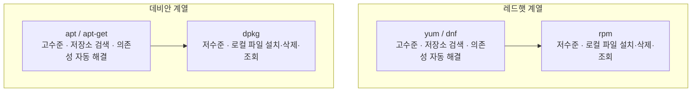

## 소프트웨어를 설치하는 세 가지 방법

02편에서 배운 것처럼 리눅스 배포판은 크게 레드햇 계열과 데비안 계열로 나뉘고, 이 갈래에 따라 쓰는 패키지 형식(rpm 또는 deb)이 갈린다. 둘째, 이미 컴파일이 끝난 결과물을 압축해 둔 rpm·deb 같은 패키지 파일을 직접 설치하는 방법.

## 소스 컴파일 3단계 — configure, make, make install

프로그램을 만든 개발자가 소스 코드(사람이 작성한 원본 프로그램 파일들)만 배포하는 경우가 있다. 이 경우 설치하려는 컴퓨터에서 직접 컴파일해야 하는데, 이때 가장 널리 쓰이는 절차가 `./configure` → `make` → `make install` 세 단계다.

```mermaid
flowchart LR
    A["소스 코드 압축 해제"] --> B["./configure<br/>환경 점검 후 Makefile 생성"]
    B --> C["make<br/>Makefile을 읽어 컴파일"]
    C --> D["make install<br/>결과물을 시스템 경로에 설치"]
```

각 단계가 하는 일을 순서대로 뜯어보자.

1. **`./configure`** — 이 프로그램을 컴파일하는 데 필요한 라이브러리(다른 프로그램이 공통으로 가져다 쓰는 코드 묶음)와 도구가 지금 시스템에 있는지 점검한다. 필요한 것이 빠져 있으면 오류를 내며 멈춘다. 점검이 끝나면 그 결과에 맞춰 **`Makefile`이라는 파일을 새로 만든다**. 이 파일에는 "무엇을, 어떤 순서로, 어떤 옵션으로 컴파일할지"가 적혀 있다.
2. **`make`** — 방금 만들어진 `Makefile`을 읽어서 실제로 컴파일을 수행한다. 소스 코드 파일들을 실행 가능한 이진 파일(바이너리)로 변환하는 단계이며, 아직 시스템의 정식 설치 위치로 옮기지는 않는다.
3. **`make install`** — `make`가 만들어 낸 결과물(실행 파일, 라이브러리, 문서 등)을 `/usr/local/bin` 같은 시스템의 정식 설치 경로로 복사한다. 이 단계가 끝나야 비로소 어디서든 그 프로그램을 실행할 수 있다.

**자주 틀리는 점**: "Makefile이 생성되는 단계"를 묻는 문제에서 `make` 단계를 고르는 실수가 잦다. `Makefile`을 **만드는** 것은 `configure`이고, `make`는 이미 만들어진 `Makefile`을 **읽어서 실행**할 뿐이다.

모든 프로젝트가 이 방식을 쓰는 것은 아니다. MySQL이나 KDE, LMMS 같은 프로젝트는 `cmake`라는 플랫폼 독립적인 빌드 구성 도구를 쓰기도 한다.

소스 컴파일 방식은 최신 버전을 바로 쓸 수 있고 컴파일 옵션을 세밀하게 조정할 수 있다는 장점이 있지만, 필요한 라이브러리를 사람이 일일이 찾아서 먼저 설치해야 하고 시간도 오래 걸린다는 단점이 있다. 그래서 실무에서는 아래에서 다룰 패키지 관리자를 훨씬 더 많이 쓴다.

## 저수준 도구와 고수준 도구 — 패키지 관리의 두 층위

패키지 관리 도구를 이해하는 가장 중요한 축은 "저수준(로컬)"과 "고수준(온라인)"의 구분이다. 이 구분을 정확히 아는지가 리눅스마스터 시험에서 반복해서 나오는 핵심 포인트다.

**저수준 도구**(rpm, dpkg)는 이미 다운로드해 둔 패키지 파일(`.rpm` 또는 `.deb`) 하나를 대상으로 설치·삭제·조회 작업만 수행한다. 이 패키지가 다른 어떤 패키지를 필요로 하는지는 알려줄 수 있지만, **그 필요한 패키지를 인터넷에서 찾아 자동으로 받아 오지는 못한다.** 예를 들어 A라는 프로그램을 rpm으로 설치하려는데 B라는 라이브러리가 먼저 설치되어 있어야 한다면, rpm은 "B가 없어서 설치할 수 없다"는 오류만 내고 멈춘다.

**고수준 도구**(yum·dnf, apt·apt-get)는 이 문제를 해결하기 위해 만들어졌다. 즉 **고수준 도구는 저수준 도구 위에 "의존성 자동 해결"이라는 기능을 얹은 관리자**라고 이해하면 된다.

```mermaid
flowchart TD
    subgraph 레드햇 계열
    R1["yum / dnf<br/>고수준 · 저장소 검색 · 의존성 자동 해결"] --> R2["rpm<br/>저수준 · 로컬 파일 설치·삭제·조회"]
    end
    subgraph 데비안 계열
    D1["apt / apt-get<br/>고수준 · 저장소 검색 · 의존성 자동 해결"] --> D2["dpkg<br/>저수준 · 로컬 파일 설치·삭제·조회"]
    end
```

**자주 틀리는 점**: "온라인 패키지 관리 도구가 아닌 것을 고르시오" 같은 문제에서 `dpkg`나 `rpm`을 정답(저수준이라 온라인 도구가 아님)으로 골라야 하는데, 이름이 익숙하다는 이유로 `dnf`·`zypper` 같은 고수준 도구를 답으로 고르는 실수가 잦다. **저수준 도구 rpm·dpkg는 의존성 자동 해결·저장소 연동이 없다는 점이 곧 "온라인 도구가 아니다"라는 근거**가 된다.

## rpm — 레드햇 계열의 저수준 패키지 도구

rpm(Red Hat Package Manager)은 `.rpm` 확장자를 가진 패키지 파일을 직접 다루는 명령이다. 주요 옵션은 다음과 같다.

| 옵션 | 의미 | 예시 |
|------|------|------|
| `-i` | 새 패키지 설치(install) | `rpm -i nmap-7.9.rpm` |
| `-U` | 설치되어 있으면 업그레이드, 없으면 새로 설치(upgrade) | `rpm -U nmap-7.9.rpm` |
| `-e` | 패키지 삭제(erase) | `rpm -e nmap` |
| `-q` | 설치 여부·버전 조회(query) | `rpm -q nmap` |
| `-qa` | 설치된 모든 패키지 목록 조회(query all) | `rpm -qa` |
| `-V` | 패키지 파일의 무결성 검사(verify) | `rpm -V nmap` |

여기에 조회 관련 세부 옵션을 조합해서 쓰는 경우가 많다. `-qi`(패키지 정보), `-ql`(패키지가 설치한 파일 목록), `-qf`(어떤 파일이 어느 패키지 소속인지 역으로 조회), `-qc`(설정 파일 목록), `-qd`(문서 파일 목록)가 대표적이다.

작은 예시로 확인해 보자. 시스템에 이미 `/bin/ls` 파일이 있는데 이 파일이 어느 패키지가 설치한 것인지 알고 싶다면, `rpm -qf /bin/ls`를 실행한다.

**자주 틀리는 점**: `-qf`(파일 → 패키지)와 `-ql`(패키지 → 파일)은 방향이 정반대인데, 이름이 비슷해서 자주 헷갈린다. **f는 file을 물어보는 방향(파일을 주면 패키지 이름을 알려줌)**, **l은 list, 즉 패키지가 가진 파일 목록을 보여주는 방향**이라고 짝지어 기억한다.

`-i`, `-U`, `-e`는 rpm 스스로 의존성을 확인해 부족한 패키지가 있으면 설치·삭제를 거부한다. 앞서 설명한 대로 **rpm은 "부족하다"는 사실만 알려줄 뿐, 부족한 패키지를 인터넷에서 받아 오지는 못한다.** 이 한계를 메우는 것이 다음에 볼 yum·dnf다.

## yum과 dnf — 레드햇 계열의 고수준 패키지 도구

yum(Yellowdog Updater, Modified)은 레드햇 계열에서 오래 쓰인 고수준 패키지 관리 도구이고, dnf(Dandified YUM)는 그 후속으로 성능과 의존성 해결 알고리즘을 개선한 버전이다. 최신 배포판(RHEL 8 이후, Fedora 등)은 `yum`이라는 명령을 입력해도 실제로는 `dnf`가 실행되도록 연결해 둔 경우가 많지만, 두 도구의 하위 명령 체계는 거의 동일하다.

| 하위 명령 | 기능 |
|-----------|------|
| `install` | 패키지 설치(의존성 자동 해결) |
| `remove` (또는 `erase`) | 패키지 삭제 |
| `update` | 설치된 패키지를 최신 버전으로 갱신 |
| `search` | 패키지 이름·요약(summary)에서 키워드 검색 |
| `list` | 정확한 패키지 이름의 설치·설치 가능 상태 나열 |
| `provides` | 특정 파일이나 기능을 제공하는 패키지 찾기 |

설치 명령의 형식은 `yum install 패키지명`처럼 **하위 명령이 패키지명보다 앞**에 온다. 확인 절차 없이 곧바로 진행하고 싶다면 `-y`(자동으로 "예"라고 답하는 옵션)를 붙여 `yum install -y 패키지명`처럼 쓴다.

**자주 틀리는 점**: `yum nmap install`처럼 하위 명령과 패키지명의 순서를 뒤바꾸거나, `yum -i nmap`처럼 rpm의 옵션(`-i`)을 yum에도 그대로 쓸 수 있다고 착각하는 오답이 자주 나온다. yum·dnf는 **`옵션` 자리가 아니라 `하위 명령` 자리에 install·remove 같은 단어를 쓴다**는 점에서 rpm과 형식 자체가 다르다.

`search`와 `list`도 헷갈리기 쉽다. `search`는 이름이 정확히 기억나지 않을 때 이름이나 요약 문구에 포함된 키워드로 후보를 찾는 명령이고, `list`는 이미 정확한 이름을 알고 있을 때 그 패키지의 설치 상태를 확인하는 명령이다.

## dpkg와 apt — 데비안 계열의 짝

데비안 계열(우분투 등)의 구조도 레드햇 계열과 완전히 같은 논리로 짝을 이룬다. **dpkg**(Debian Package)가 저수준 도구로 `.deb` 파일 하나를 설치·삭제·조회하고, **apt**(Advanced Package Tool, 흔히 `apt-get`이라는 하위 명령 집합과 함께 쓰인다)가 고수준 도구로 저장소를 검색해 의존성까지 자동으로 해결한다.

| 저수준 (dpkg) | 고수준 (apt/apt-get) |
|---------------|------------------------|
| `dpkg -i package.deb` (설치) | `apt-get install 패키지명` (저장소에서 설치) |
| `dpkg -r 패키지명` (제거, 설정 파일은 남김) | `apt-get remove 패키지명` |
| `dpkg -P 패키지명` (설정 파일까지 완전 제거, purge) | `apt-get purge 패키지명` |
| `dpkg -l` (설치된 패키지 목록) | `apt list --installed` |

`apt`의 주요 하위 명령은 다음과 같다.

| 하위 명령 | 기능 |
|-----------|------|
| `update` | 저장소의 패키지 목록 정보를 최신으로 갱신(실제 설치는 아님) |
| `upgrade` | 설치된 패키지를 최신 버전으로 갱신 |
| `install` | 패키지 설치(의존성 자동 해결) |
| `remove` | 패키지 삭제(설정 파일은 남김) |
| `purge` | 설정 파일까지 포함해 완전 삭제 |
| `search` | 키워드로 패키지 검색 |

**자주 틀리는 점**: 이미 `.deb` 파일 하나를 손에 들고 있는 상황(예: 다른 사람에게 전달받은 패키지 파일)에서 이를 설치하는 명령을 고르라는 문제가 나오면, `apt-get install`이 아니라 **`dpkg -i package.deb`**가 정답이다. apt 계열 고수준 도구는 저장소를 대상으로 패키지 **이름**을 받아 동작하는 것이 기본이고, 이미 갖고 있는 로컬 `.deb` 파일 자체를 인자로 받는 것은 저수준 도구인 dpkg의 역할이다. 또한 `rpm -i package.deb`처럼 **rpm에 deb 파일을, 또는 dpkg에 rpm 파일을 지정하는 오답**도 자주 나온다. rpm은 `.rpm`만, dpkg는 `.deb`만 처리할 수 있으며 서로 호환되지 않는다.

## 배포판 계열별 패키지 도구 총정리

02편에서 다룬 배포판 계열 구분을 여기서 패키지 도구 관점으로 다시 정리하면 다음과 같다.

| 계열 | 저수준 도구 | 고수준 도구 | 대표 배포판 |
|------|-------------|-------------|-------------|
| 레드햇 계열 | rpm | yum, dnf | RHEL, CentOS, Fedora, Rocky Linux |
| 데비안 계열 | dpkg | apt, apt-get, aptitude | 데비안, 우분투 |
| SUSE 계열 | rpm | zypper, YaST | openSUSE, SUSE Linux Enterprise |

SUSE 계열은 저수준 파일 형식은 레드햇과 같은 rpm을 쓰면서도, 고수준 도구는 별도로 자체 개발한 zypper·YaST를 쓴다는 점이 시험에서 종종 함정으로 등장한다. "저수준 형식이 같다고 고수준 도구까지 같지는 않다"는 점을 함께 기억해 둔다.

## 핵심 정리

- 소스 설치는 **`./configure`(환경 점검, Makefile 생성) → `make`(컴파일) → `make install`(설치)** 순서로 진행된다. Makefile을 만드는 것은 configure다.
- **저수준 도구(rpm, dpkg)는 로컬 패키지 파일의 설치·삭제·조회만 하고 의존성을 자동으로 해결하지 못한다.** 이 한계를 해결하는 것이 고수준 도구(yum·dnf, apt·apt-get)의 존재 이유다.
- rpm 옵션은 `-i`(설치)·`-U`(업그레이드 겸 설치)·`-e`(삭제)·`-q`(조회)·`-qa`(전체 목록)·`-V`(무결성 검사)로 구분하고, `-qf`(파일→패키지)와 `-ql`(패키지→파일)의 방향을 헷갈리지 않는다.
- yum·dnf와 apt·apt-get은 `install`, `remove`, `update(upgrade)`, `search` 같은 하위 명령을 패키지명 앞에 쓰는 형식을 공유한다.
- 이미 갖고 있는 `.rpm`·`.deb` 파일을 직접 설치할 때는 저수준 도구(rpm, dpkg)를 쓴다.

## 마무리 복습

<Quiz
  questionNumber={1}
  question={"소스 코드를 컴파일해 설치하는 과정에서 Makefile이 생성되는 단계로 알맞은 것은?"}
  options={["make","./configure","make install","cmake"]}
  correctAnswer={2}
  explanation={"./configure 단계는 시스템 환경을 점검하고 그 결과에 맞는 Makefile을 생성한다. make는 이 Makefile을 읽어 컴파일만 수행한다."}
/>

<Quiz
  questionNumber={2}
  question={"rpm과 yum의 관계를 가장 정확하게 설명한 것은?"}
  options={["rpm과 yum은 서로 다른 배포판 계열에서 각각 독립적으로 쓰인다","yum은 저수준 도구이고 rpm은 그 위에서 동작하는 고수준 도구다","yum은 저장소 검색과 의존성 자동 해결을 담당하며 내부적으로 rpm을 호출해 실제 설치를 수행한다","rpm과 yum은 완전히 동일한 기능을 제공하는 중복 도구다"]}
  correctAnswer={3}
  explanation={"yum은 고수준 도구로 저장소에서 패키지와 의존성을 찾아 자동으로 받아 오고, 실제 설치·삭제 작업은 내부적으로 저수준 도구인 rpm을 호출해 수행한다."}
/>

<Quiz
  questionNumber={3}
  question={"이미 내려받아 둔 특정 파일 하나(package.deb)를 지금 바로 설치하려고 할 때 가장 적절한 명령은?"}
  options={["apt-get install package.deb","dpkg -i package.deb","rpm -i package.deb","yum localinstall package.deb"]}
  correctAnswer={2}
  explanation={"dpkg는 데비안 계열의 저수준 패키지 관리 도구로, -i(install) 옵션으로 단일 .deb 파일을 직접 설치한다."}
/>

## 참고 자료

- [KAIT 리눅스마스터 자격안내](https://www.ihd.or.kr/introducesubject1.do)
- [GNU Coreutils 매뉴얼](https://www.gnu.org/software/coreutils/manual/coreutils.html)
