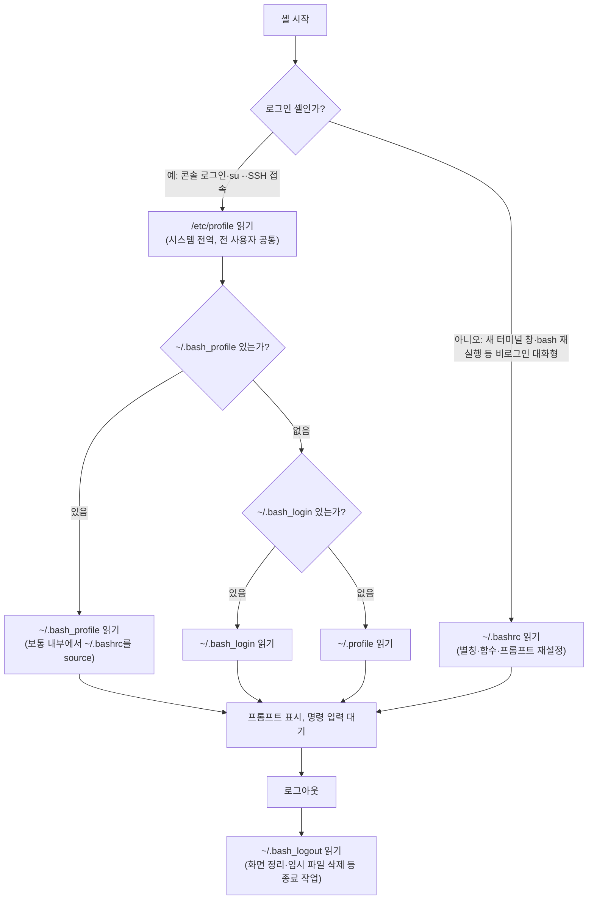

<Callout type="info">
  **이번 문서의 목표:** 이 파일을 다 읽으면 환경변수와 셸 변수를 구분하고, 로그인 여부에 따라 어떤 설정 파일이 어떤 순서로 읽히는지 그림으로 그릴 수 있으며, `alias`와 `export`를 상황에 맞게 쓸 수 있다.
</Callout>

## 셸 변수와 환경변수는 왜 나뉘어 있는가

06편에서 셸(shell)은 사용자의 명령을 해석해 커널에 전달하는 프로그램이라고 배웠다. 셸은 프로그램인 이상 자기만의 메모리 공간에 값을 저장해 둘 수 있는데, 이 값을 변수(variable)라고 부른다. 그런데 리눅스에서는 이 변수를 두 종류로 나눈다. 왜 굳이 나눴을까.

터미널에서 `bash`를 실행하면, 그 순간 새로운 bash 프로세스가 하나 태어난다(프로세스 개념은 13편 참고). 이 자식 bash는 부모 셸이 가진 변수를 그대로 물려받지 못한다. 기본적으로 자식 프로세스는 부모의 메모리를 들여다볼 수 없기 때문이다. 그런데 실무에서는 "이 값만큼은 자식 프로세스에도 자동으로 전달됐으면 좋겠다"는 경우가 자주 생긴다. 예를 들어 명령어를 어느 디렉터리에서 찾을지 정하는 `PATH` 값은, 셸이 실행하는 모든 프로그램에도 알려 줘야 그 프로그램이 또 다른 명령을 실행할 때 문제가 없다.

> **쉽게 말하면:** 셸 변수는 "이 셸 안에서만 기억하는 메모", 환경변수는 "이 셸이 자식에게 물려주는 유서"다.

**정의**

- **셸 변수(shell variable)**: 현재 실행 중인 셸 프로세스 내부에서만 쓰이는 변수다. `이름=값` 형태로 만들며, 이 셸이 새 프로그램을 실행해도 그 프로그램에는 전달되지 않는다.
- **환경변수(environment variable)**: 셸 변수 중에서 `export`로 표시(export flag를 켠 것)된 변수다. 이 셸이 자식 프로세스를 만들 때, 운영체제가 이 값들을 복사해 자식의 환경(environment)에 넘겨준다.

즉 모든 환경변수는 원래 셸 변수였다가 `export`를 거쳐 승격된 것이다. 반대로 셸 변수라고 해서 전부 환경변수가 되는 것은 아니다.

**작은 예시**

```bash
$ myvar="hello"
$ echo $myvar
hello
$ bash                 # 자식 셸 하나를 새로 실행
$ echo $myvar

$ exit                 # 자식 셸 종료, 원래 셸로 복귀
$ export myvar
$ bash
$ echo $myvar
hello
```

첫 번째 자식 셸에서는 `myvar`가 비어 있다. `export`를 하지 않았으므로 자식에게 전달되지 않았기 때문이다. `export myvar`를 실행한 뒤 다시 자식 셸을 열면 값이 그대로 보인다.

**확인 명령**

| 명령 | 보여 주는 것 |
|------|-------------|
| `set` | 현재 셸의 셸 변수 전체(함수 포함) |
| `env` 또는 `printenv` | 현재 프로세스의 환경변수 전체 |
| `echo $변수명` | 특정 변수 하나의 값 |
| `export -p` | 현재 export된(환경변수로 지정된) 변수 목록 |

**자주 틀리는 점**: "셸 변수와 환경변수는 완전히 다른 두 저장소다"라고 오해하기 쉽다. 실제로는 저장 공간이 같고, `export` 여부라는 속성(flag) 하나만 다르다. 그래서 `unset 변수명`으로 지우면 셸 변수든 환경변수든 똑같이 사라진다.

## 자주 쓰는 주요 변수들

셸과 프로그램이 동작하는 데 필요한 정보 상당수가 미리 정해진 이름의 환경변수에 들어 있다. 이 변수들은 로그인할 때 셸이 자동으로 채워 준다.

| 변수 | 의미 | 예시 값 |
|------|------|---------|
| `PATH` | 명령어를 찾아볼 디렉터리 목록(콜론으로 구분) | `/usr/local/bin:/usr/bin:/bin` |
| `HOME` | 현재 사용자의 홈 디렉터리 경로 | `/home/ihduser` |
| `SHELL` | 로그인 셸로 등록된 프로그램의 경로 | `/bin/bash` |
| `USER` | 현재 로그인한 사용자 이름 | `ihduser` |
| `PWD` | 현재 작업 디렉터리(present working directory) 경로 | `/home/ihduser/docs` |
| `PS1` | 기본 프롬프트(prompt) 모양을 정의하는 문자열 | `[\u@\h \W]\$ ` |
| `HISTSIZE` | 메모리에 보관할 명령 기록(history)의 최대 개수 | `1000` |
| `LANG` | 시스템이 사용할 언어와 문자 인코딩 | `ko_KR.UTF-8` |

### PATH를 깊게 봐야 하는 이유

`ls`라는 명령을 입력하면 셸은 그 이름의 실행 파일을 어디서 찾을까. 무작정 전체 디스크를 뒤지면 너무 느리다. 그래서 셸은 `PATH`에 콜론(`:`)으로 나열된 디렉터리들을 **왼쪽부터 순서대로** 뒤져 가장 먼저 찾은 실행 파일을 실행한다.

```bash
$ echo $PATH
/usr/local/bin:/usr/bin:/bin:/usr/local/sbin:/usr/sbin:/sbin
```

이 값을 읽는 순서는 `/usr/local/bin` → `/usr/bin` → `/bin` → … 순이다. 만약 `/usr/local/bin`과 `/usr/bin`에 똑같은 이름의 프로그램이 있다면, `PATH`에서 더 앞선(왼쪽) 디렉터리의 것이 실행된다.

> **쉽게 말하면:** PATH는 "명령어를 찾을 때 뒤질 서랍 순서표"다. 앞 서랍에서 찾으면 뒤 서랍은 보지 않는다.

새 디렉터리를 추가하려면 기존 값 뒤(또는 앞)에 이어 붙인다.

```bash
$ export PATH=$PATH:/home/ihduser/bin
```

**자주 틀리는 점**: `export PATH=/home/ihduser/bin`처럼 기존 `$PATH`를 빼고 새로 대입하면, 그 순간부터 `/bin`이나 `/usr/bin`에 있는 `ls`, `cat` 같은 기본 명령어조차 "찾을 수 없다"는 오류가 난다. 반드시 `$PATH`를 포함해 **덧붙이는** 형태로 써야 한다는 점이 시험에서 실행 결과 예측 문제로 자주 나온다.

## 로그인 셸과 비로그인 셸, 그리고 설정 파일이 읽히는 순서

이 주제는 리눅스마스터 2급 1차의 단골 함정이다. reference 기출·모의고사 자료를 보면 "로그인 셸에서 우선 읽히는 파일은?", "다음 중 틀린 설명은?" 형태로 반복해서 나온다. 정답의 핵심은 **로그인 셸인지 아닌지에 따라 읽는 파일이 다르다**는 것이다.

**정의**

- **로그인 셸(login shell)**: 사용자가 아이디·비밀번호로 시스템에 로그인할 때(콘솔 로그인, `su -`, SSH 원격 접속 등) 최초로 실행되는 셸이다. 프로세스 이름 앞에 하이픈이 붙어 `-bash`로 표시되는 관례가 있다.
- **비로그인 셸(non-login shell)**: 이미 로그인한 상태에서 터미널 창을 새로 열거나, `bash` 명령으로 셸 안에서 또 다른 셸을 실행했을 때 만들어지는 셸이다.

로그인 셸은 "환경을 처음부터 차려야" 하므로 전역 설정과 사용자별 프로필을 순서대로 읽는다. 비로그인 대화형 셸은 이미 부모로부터 환경변수를 물려받았다고 보고, 별칭(alias)이나 함수처럼 물려받지 못하는 셸 전용 설정만 다시 읽는다.



| 파일 | 적용 대상 | 주로 담는 내용 |
|------|-----------|----------------|
| `/etc/profile` | 로그인 셸, 시스템 전체 사용자 공통 | 시스템 전역 `PATH`, `umask`, 공통 환경변수 |
| `~/.bash_profile`(또는 `~/.bash_login`, `~/.profile`) | 로그인 셸, 사용자 개인 | 개인 환경변수, 로그인 시 한 번만 할 일 |
| `/etc/bashrc`(배포판에 따라 `/etc/bash.bashrc`) | 비로그인 대화형 셸, 시스템 전체 | 시스템 전역 별칭·함수·프롬프트 |
| `~/.bashrc` | 비로그인 대화형 셸, 사용자 개인 | 개인 별칭(`alias`), 함수, 프롬프트 커스터마이징 |
| `~/.bash_logout` | 로그인 셸 종료 시 | 화면 지우기, 임시 파일 정리 등 종료 작업 |

**중요한 함정**: `~/.bash_profile`, `~/.bash_login`, `~/.profile`은 **셋 다 매번 읽히는 것이 아니다**. bash는 로그인 셸을 시작할 때 이 세 파일을 **앞에서부터 순서대로 찾다가, 처음 발견되는 파일 딱 하나만** 읽고 나머지는 무시한다. `~/.bash_profile`이 있으면 나머지 둘은 아예 읽지 않는다.

그런데 실무에서는 로그인할 때도 별칭이나 함수 같은 `~/.bashrc`의 설정을 쓰고 싶은 경우가 많다. 그래서 관례적으로 `~/.bash_profile` 안에 다음과 같은 줄을 넣어 `~/.bashrc`를 **직접 불러들인다(source)**.

```bash
# ~/.bash_profile 안의 전형적인 내용
if [ -f ~/.bashrc ]; then
    . ~/.bashrc
fi
```

여기서 점(`.`)은 `source` 명령의 축약형으로, 지정한 파일의 내용을 마치 현재 셸에 직접 입력한 것처럼 그 자리에서 실행한다. 이 구조 덕분에 로그인 셸도 결과적으로 `~/.bashrc`의 별칭을 갖게 되지만, 이는 bash가 자동으로 해 주는 동작이 아니라 **설정 파일 안에 사람이 넣어 둔 한 줄** 때문이라는 점을 기억해야 한다.

**자주 틀리는 점**

- "로그인 셸도 `~/.bashrc`를 직접 읽는다"고 착각하기 쉽다. 직접 읽는 것이 아니라, `~/.bash_profile`이 그 안에서 `source`할 때만 결과적으로 반영된다.
- reference 기출에서는 "`~/.bash_logout`이 로그인 직후 실행된다"는 오답 선택지가 나온 적이 있다. `~/.bash_logout`은 **로그아웃 시점**에 실행되는 파일이지 로그인 시점이 아니다.
- SSH로 원격 접속해 얻는 셸도 로그인 셸이지만, `ssh 호스트 명령` 형태로 **명령 하나만 실행**하는 경우는 비로그인 셸로 취급되어 `~/.bash_profile`을 읽지 않는다. 이런 미묘한 조건은 심화 문제로 나올 수 있으므로 "로그인 절차를 완전히 거쳤는가"를 기준으로 판단한다.

## alias와 export

### alias — 명령어에 별명 붙이기

`alias`는 자주 쓰는 명령(옵션 포함)에 짧은 이름을 붙여 두는 기능이다.

```bash
$ alias ll='ls -alF'
$ ll
```

- `alias 이름='명령'` 형태로 등록한다.
- 등록만 하면 **현재 셸 세션에서만** 유효하다. 터미널을 닫으면 사라진다.
- 영구히 쓰려면 `~/.bashrc`에 이 줄을 추가해 둔다. 새 비로그인 셸을 열 때마다 `~/.bashrc`가 다시 읽히므로 별칭이 매번 자동으로 등록된다.
- 등록된 별칭 목록은 `alias` 명령만 입력하면 볼 수 있고, 삭제는 `unalias 이름`이다.
- 별칭을 무시하고 원래 명령을 쓰고 싶으면 `\ls`처럼 역슬래시를 앞에 붙이거나, `command ls`처럼 `command` 명령을 쓰거나, `/bin/ls`처럼 절대경로를 직접 쓴다.

> **비유:** `alias`는 전화번호부의 단축 번호와 같다. 단축 번호(별칭)는 내 휴대폰(현재 셸)에만 저장되어 있어서, 남의 휴대폰(다른 셸)에서는 그 번호를 눌러도 연결되지 않는다.

### export — 셸 변수를 환경변수로 승격

```bash
$ export MYAPP_HOME=/opt/myapp
```

이렇게 하면 `MYAPP_HOME`은 이제 이 셸이 실행하는 모든 자식 프로세스에 전달된다. 이미 만들어 둔 셸 변수를 나중에 export할 수도 있다.

```bash
$ count=3
$ export count
```

**자주 틀리는 점**: `export`는 그 시점 이후로 새로 만들어지는 자식 프로세스에만 영향을 준다. 이미 실행 중인 프로그램이나 이미 열려 있는 다른 터미널에는 소급 적용되지 않는다. "export하면 이미 실행 중이던 다른 셸에도 즉시 반영된다"는 설명이 나오면 틀린 설명이다.

## 직접 해보기

<Callout type="info">
  00편에서 만든 `rocky` 컨테이너에서 진행합니다. 아직 안 만들었다면 00편을 먼저 보세요.
</Callout>

셸 변수는 자식 프로세스로 전달되지 않고, `export`한 것만 전달된다는 것을 직접 눈으로 확인합니다.

```bash
MYVAR=hello
echo $MYVAR
bash
echo $MYVAR
exit
export MYVAR
bash
echo $MYVAR
exit
```

`bash`는 지금 셸 안에서 자식 셸 하나를 새로 여는 명령이고, `exit`로 그 자식 셸을 나오면 원래 셸로 돌아온다.

**무엇을 보아야 하나**: 첫 번째 자식 셸에서 `echo $MYVAR`는 빈 줄이 나오고, `export` 뒤 두 번째 자식 셸에서는 `hello`가 그대로 나온다. 이어서 `echo $PATH`와 `env | head`도 쳐서, `PATH`가 이미 환경변수로 전달되어 있는지 확인해 본다.

> **왜 이걸 해보나:** "셸 변수와 환경변수는 저장 공간이 다르다"는 오개념이 시험에서 자주 함정으로 나온다. 직접 자식 셸을 열고 닫으며 export 전후의 차이를 보면, export가 하는 일이 "복사"가 아니라 "전달 여부 표시"라는 것이 몸으로 이해된다.

## 핵심 정리

- 셸 변수는 현재 셸에만 존재하고, `export`로 표시된 셸 변수만 자식 프로세스로 전달되는 환경변수가 된다.
- `PATH`는 왼쪽부터 순서대로 뒤지는 디렉터리 목록이며, 새 경로는 반드시 `$PATH`를 포함해 덧붙여야 기존 명령어들이 계속 동작한다.
- 로그인 셸은 `/etc/profile` → `~/.bash_profile`(없으면 `~/.bash_login`, 그것도 없으면 `~/.profile`) 순으로 **딱 하나만** 읽고, 비로그인 대화형 셸은 `~/.bashrc`를 읽는다.
- `~/.bash_profile`이 로그인 시 `~/.bashrc`를 직접 읽지는 않으며, 관례적으로 그 안에 `source ~/.bashrc` 줄을 넣어 결과적으로 반영한다.
- `alias`는 현재 세션에만 유효하고, `~/.bashrc`에 등록해야 새 셸마다 자동 적용된다.

## 마무리 복습

<Quiz
  questionNumber={1}
  question="셸 변수와 환경변수의 관계를 가장 정확히 설명한 것은?"
  options={['셸 변수와 환경변수는 저장 공간 자체가 서로 다른 별개의 목록이다', '환경변수 중 일부를 export하면 셸 변수가 된다', '셸 변수 중 export로 표시된 것이 환경변수이며, 저장 공간은 같다', '환경변수는 로그인할 때만 만들 수 있고 셸 변수는 언제든 만들 수 있다']}
  correctAnswer={3}
  explanation="셸 변수와 환경변수는 별개의 저장소가 아니라, export 여부라는 속성 하나만 다르다. export된 셸 변수가 곧 환경변수이며, 자식 프로세스에 전달된다."
  optionExplanations={['저장 공간이 다르다는 설명은 틀렸다. export 여부만 다를 뿐 같은 셸 변수 공간을 공유한다', '방향이 반대다. 셸 변수를 export해야 환경변수가 되는 것이지, 환경변수를 export해서 셸 변수가 되는 것이 아니다', '정확한 설명이다. export 플래그가 켜진 셸 변수가 환경변수다', '셸 변수와 환경변수 모두 로그인 여부와 무관하게 어느 시점에서든 만들 수 있다']}
/>

<Quiz
  questionNumber={2}
  question="현재 PATH 값이 /usr/bin:/bin일 때, 사용자 홈의 bin 디렉터리(/home/ihduser/bin)를 추가하면서 기존 경로도 유지하려는 명령으로 알맞은 것은?"
  options={['export PATH=/home/ihduser/bin', 'export PATH=$PATH:/home/ihduser/bin', 'PATH=/home/ihduser/bin (export 생략)', 'alias PATH=$PATH:/home/ihduser/bin']}
  correctAnswer={2}
  explanation="기존 PATH 값을 유지하며 새 경로를 덧붙이려면 반드시 $PATH를 포함해 대입해야 한다. export PATH=$PATH:/home/ihduser/bin이 정확한 형태다."
  optionExplanations={['기존 PATH를 통째로 덮어써서 /usr/bin, /bin에 있던 기본 명령어를 모두 찾지 못하게 된다', '$PATH를 포함해 뒤에 새 경로를 이어 붙였으므로 기존 경로와 새 경로가 모두 유효하다', 'export를 생략하면 셸 변수로만 남아 자식 프로세스(새로 실행하는 프로그램)에 전달되지 않는다', 'PATH는 변수이지 명령어 별명이 아니므로 alias로 다룰 대상이 아니다']}
/>

<Quiz
  questionNumber={3}
  question="사용자가 콘솔에서 아이디와 비밀번호로 로그인해 bash를 시작할 때, 홈 디렉터리에 ~/.bash_profile과 ~/.profile이 둘 다 존재한다면 어떤 일이 일어나는가?"
  options={['두 파일이 모두 순서대로 읽힌다', '~/.bash_profile만 읽히고 ~/.profile은 무시된다', '~/.profile만 읽히고 ~/.bash_profile은 무시된다', '두 파일 모두 무시되고 /etc/profile만 읽힌다']}
  correctAnswer={2}
  explanation="bash 로그인 셸은 ~/.bash_profile, ~/.bash_login, ~/.profile 순서로 찾다가 가장 먼저 발견되는 파일 하나만 읽는다. ~/.bash_profile이 존재하면 그것만 읽고 나머지는 읽지 않는다."
  optionExplanations={['세 후보 파일 중 처음 찾은 것 하나만 읽으므로 둘 다 읽히지 않는다', '탐색 순서상 ~/.bash_profile이 먼저 발견되므로 이것만 읽고 ~/.profile은 무시된다', '~/.bash_profile이 존재하는 한 이 파일이 우선하므로 순서가 반대로 설명되어 틀렸다', '/etc/profile은 로그인 셸에서 항상 먼저 읽히지만, 그 뒤 사용자 홈의 후보 파일 중 하나도 반드시 이어서 읽는다']}
/>

<Quiz
  questionNumber={4}
  question="새 터미널 창을 열거나(이미 로그인된 상태) bash 명령으로 셸 안에서 또 다른 bash를 실행했을 때(비로그인 대화형 셸)의 설명으로 옳은 것은?"
  options={['/etc/profile과 ~/.bash_profile을 순서대로 읽는다', '~/.bashrc만 읽고 /etc/profile이나 ~/.bash_profile은 읽지 않는다', '아무 설정 파일도 읽지 않고 부모의 환경을 그대로 복사만 한다', '~/.bash_logout을 읽어 이전 설정을 초기화한다']}
  correctAnswer={2}
  explanation="비로그인 대화형 셸은 로그인 절차를 거치지 않으므로 profile 계열 파일을 읽지 않고, 별칭이나 함수처럼 상속되지 않는 설정을 다시 만들기 위해 ~/.bashrc만 읽는다."
  optionExplanations={['profile 계열 파일은 로그인 셸이 읽는 것으로, 비로그인 대화형 셸은 이 파일들을 읽지 않는다', '정확하다. 비로그인 대화형 셸은 ~/.bashrc만 읽어 별칭·함수·프롬프트 설정을 다시 적용한다', '환경변수는 부모에게서 상속받지만, 별칭이나 함수 같은 셸 전용 설정은 상속되지 않으므로 ~/.bashrc를 다시 읽어야 한다', '~/.bash_logout은 로그아웃 시점에 읽히는 파일이지 새 셸을 시작할 때 읽는 파일이 아니다']}
/>

<Quiz
  questionNumber={5}
  question="alias ll='ls -alF'를 터미널에서 직접 입력해 등록했을 때의 설명으로 옳은 것은?"
  options={['시스템을 재부팅해도 계속 남아 있다', '다른 사용자가 로그인해도 똑같이 사용할 수 있다', '현재 셸 세션에서만 유효하며 터미널을 닫으면 사라진다', '~/.bashrc에 자동으로 기록되어 영구 적용된다']}
  correctAnswer={3}
  explanation="alias는 메모리상 현재 셸 프로세스에만 등록되는 설정이다. 영구히 쓰려면 ~/.bashrc 같은 설정 파일에 직접 그 줄을 추가해야 한다."
  optionExplanations={['현재 세션에만 존재하는 설정이므로 터미널을 닫거나 재부팅하면 사라진다', '별칭은 그 별칭을 등록한 셸 프로세스에만 존재하며 다른 사용자의 셸과는 무관하다', '정확하다. 터미널(셸 프로세스)이 종료되면 함께 사라지는 임시 설정이다', 'alias 명령 자체는 파일에 자동으로 기록되지 않는다. 영구 적용은 사용자가 직접 설정 파일에 추가해야 한다']}
/>

<Quiz
  questionNumber={6}
  question="export count 실행 이전에 이미 실행되어 있던 다른 터미널(다른 셸 프로세스)에 count 값이 즉시 반영되는가?"
  options={['반영된다. export는 모든 실행 중인 셸에 즉시 적용된다', '반영되지 않는다. export는 그 시점 이후 새로 만들어지는 자식 프로세스에만 영향을 준다', '반영 여부는 root 권한이 있는지에 따라 달라진다', 'HOME 변수와 같은 이름일 때만 예외적으로 반영된다']}
  correctAnswer={2}
  explanation="export는 부모 프로세스가 자식 프로세스를 새로 만들 때 환경을 물려주는 방식으로 작동한다. 이미 독립적으로 실행 중인 다른 셸 프로세스에는 소급 적용되지 않는다."
  optionExplanations={['export는 프로세스 생성 시점에 환경을 물려주는 구조이지, 실행 중인 다른 프로세스에 실시간으로 값을 밀어넣는 기능이 아니다', '정확하다. export 이후 새로 태어나는 자식 프로세스부터 값이 전달되며, 이미 실행 중이던 독립 프로세스는 영향을 받지 않는다', 'root 권한 여부와는 무관한 프로세스 상속 구조의 문제다', '변수 이름과는 무관하게 모든 변수에 동일한 상속 규칙이 적용된다']}
/>

## 참고 자료

- [GNU Bash 매뉴얼](https://www.gnu.org/software/bash/manual/bash.html)
- [KAIT 리눅스마스터 자격안내](https://www.ihd.or.kr/introducesubject1.do)
