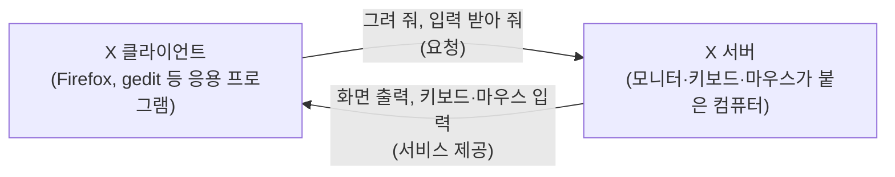
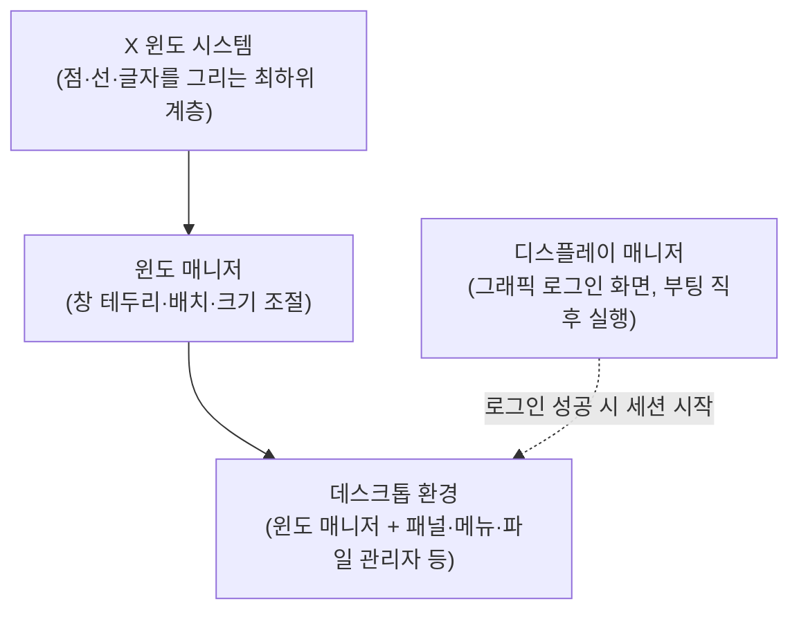

<Callout type="info">
  **이번 문서의 목표:** X 윈도의 클라이언트·서버 구조를 헷갈리지 않고 설명하고, 디스플레이 매니저·윈도 매니저·데스크톱 환경의 역할 차이를 구분하며, GNOME과 KDE의 기반 기술 차이를 안다.
</Callout>

## 왜 리눅스에는 "그래픽 화면"이 기본이 아닌가

윈도우(Windows)나 macOS를 쓰던 사람은 컴퓨터를 켜면 당연히 배경화면과 아이콘이 뜨는 화면을 본다. 하지만 리눅스는 원래 서버(server, 요청을 받아 처리해 주는 컴퓨터나 프로그램)를 돌리는 운영체제(OS, Operating System)로 자라났다. 서버는 화면 없이 검은 글자만 오가는 콘솔(console, 키보드와 화면만으로 컴퓨터를 직접 다루는 창구)로 관리하는 경우가 많다. 그래서 리눅스에서 그래픽 화면 — 마우스로 창을 움직이고 아이콘을 클릭하는 환경 — 은 운영체제에 원래 내장된 기능이 아니라, **X 윈도 시스템(X Window System)** 이라는 별도의 소프트웨어 계층이 그 위에 얹혀서 만들어진다.

> **쉽게 말하면:** X 윈도는 리눅스에 "마우스로 창을 다루는 그래픽 화면"을 붙여 주는 소프트웨어 계층이다.

X 윈도는 1984년 MIT(매사추세츠 공과대학)에서 시작된 프로젝트로, 지금은 X.Org 재단(X.Org Foundation)이 관리하는 X.Org 서버가 사실상 표준 구현체다. 리눅스마스터 2급 1차는 X.Org의 세부 설정 파일을 편집하는 문제는 내지 않는다. 대신 X 윈도의 **구조를 얼마나 정확히 이해했는지**를 개념 문제로 자주 묻는다. 그중에서도 가장 자주 틀리는 지점이 바로 다음 절의 클라이언트·서버 관계다.

## X 윈도의 클라이언트·서버 구조가 왜 거꾸로 느껴지는가

이 단원에서 가장 중요한 함정이다. 결론부터 말하면 다음과 같다.

> **쉽게 말하면:** 사용자가 앉아서 화면을 보고 있는 쪽의 컴퓨터가 X 서버(X server)이고, 실제로 계산을 하는 프로그램(예: 웹 브라우저, 문서 편집기)이 X 클라이언트(X client)다.

이게 왜 "거꾸로"로 느껴질까. 우리가 일상적으로 쓰는 서버·클라이언트(server-client) 개념은 보통 "서버는 저 멀리 어딘가에 있는 큰 컴퓨터, 클라이언트는 내 눈앞의 컴퓨터"라는 그림이다. 예를 들어 웹을 볼 때 내 노트북이 클라이언트이고, 웹사이트 데이터를 갖고 있는 원격 컴퓨터가 서버다. 이 구도에 익숙해진 채로 X 윈도를 배우면, "내 눈앞의 화면 = 클라이언트"라고 무의식중에 넘겨짚게 된다. 하지만 X 윈도의 서버·클라이언트 구분은 **누가 요청을 하고 누가 서비스를 제공하는가**로 정해지지, **누가 물리적으로 멀리 있는가**로 정해지지 않는다.

X 윈도가 정의하는 서비스는 "화면에 점을 찍고, 글자를 그리고, 마우스·키보드 입력을 전달하는 것"이다. 이 서비스를 제공하는 쪽 — 즉 모니터·키보드·마우스라는 실제 하드웨어를 붙잡고 "그림을 그려 주는" 쪽 — 이 X 서버다. 그리고 파이어폭스(Firefox)나 지에딧(gedit) 같은 응용 프로그램은 "이 위치에 이 색으로 사각형을 그려 줘", "이 글자를 출력해 줘"라고 X 서버에 **요청하는** 입장이므로 X 클라이언트가 된다. 서비스를 제공하는 쪽이 서버, 서비스를 요청하는 쪽이 클라이언트라는 원칙은 그대로 지켜지고 있다. 다만 그 서비스가 "그래픽을 그려 주는 것"이다 보니, 서비스 제공자가 하필 사용자 눈앞의 화면이 되어 버린 것뿐이다.



이 구조가 실전에서 의미를 갖는 상황은 **원격 실행**이다. A 컴퓨터에서 실행한 프로그램의 화면을 B 컴퓨터의 모니터에 띄우고 싶다고 하자. 이때 화면을 그려 주는 쪽, 즉 사용자가 앉아서 보고 있는 B가 X 서버가 되고, 실제로 프로그램이 돌아가는 A가 X 클라이언트가 된다. B에서는 자신의 X 서버에 "A의 접근을 허용한다"는 뜻으로 `xhost +A의주소` 같은 명령을 실행해 접근을 열어 주고, A 쪽에서는 환경변수 `DISPLAY`를 "그림을 그릴 목적지 화면"인 B로 지정한다(예: `B의주소:0`). 시험에는 "A에서 실행한 프로그램을 B의 화면에 띄우려 한다. B는 X 서버인가 클라이언트인가", "접근 허용은 어느 쪽에서 설정하는가" 같은 형태로 나온다. 답은 항상 "화면을 갖고 있는 쪽(B)이 서버이고, 서버 쪽에서 xhost로 접근을 허용한다"이다.

X 서버는 네트워크로 클라이언트의 요청을 받을 수 있도록 기본적으로 TCP 포트 6000번을 쓴다. 여러 개의 디스플레이(display, 화면 하나에 대응하는 논리적 단위)를 동시에 관리할 수도 있는데, 이때 디스플레이 번호 N은 포트 6000+N에 대응한다. 예를 들어 디스플레이 `:0`은 포트 6000, `:1`은 포트 6001이다. 앞서 설명한 `DISPLAY` 환경변수의 `:0`이라는 표기가 바로 이 포트 번호와 이어져 있다.

> **자주 틀리는 점:** "사용자가 보는 화면 쪽이 서버"라는 문장을 반대로 외워서 "눈앞의 컴퓨터가 클라이언트"라고 답하는 실수가 압도적으로 많다. X 서버는 항상 **디스플레이(모니터·키보드·마우스)를 갖고 그림을 그려 주는 쪽**이라고 그림으로 외우는 편이 안전하다. 또한 X 서버 포트를 "8080" 같은 웹 포트와 헷갈리는 오답도 자주 섞여 나온다. X 서버의 기본 포트는 **6000**(디스플레이 0번 기준)이다.

## 디스플레이 매니저·윈도 매니저·데스크톱 환경 — 세 층을 구분한다

X 윈도 자체는 "점을 찍고 그림을 그리는" 아주 기초적인 그리기 엔진일 뿐이다. 실제로 우리가 로그인 화면을 보고, 창에 테두리가 붙고, 시작 메뉴나 작업 표시줄을 쓸 수 있는 것은 X 윈도 위에 여러 층의 소프트웨어가 추가로 쌓였기 때문이다. 이 세 층을 헷갈리지 않고 구분하는 것이 시험에서 자주 나오는 포인트다.

> **쉽게 말하면:** 디스플레이 매니저는 "로그인 화면", 윈도 매니저는 "창 테두리와 배치 담당", 데스크톱 환경은 "이 둘을 포함한 전체 묶음"이다.

| 구분 | 역할 | 하는 일의 예 | 대표 예시 |
|------|------|--------------|-----------|
| 디스플레이 매니저(Display Manager, DM) | 그래픽 로그인 화면을 띄우고 인증을 처리 | 사용자 이름·비밀번호 입력창 표시, 로그인 성공 시 세션(session, 로그인 후 로그아웃까지 이어지는 작업 단위) 시작 | GDM(GNOME), KDM·SDDM(KDE), LightDM |
| 윈도 매니저(Window Manager, WM) | 창의 테두리·제목 표시줄·크기 조절·배치를 관리 | 창을 최소화·최대화하는 버튼 그리기, 여러 창을 겹치거나 나란히 배치, 가상 데스크톱 전환 | Mutter(GNOME), KWin(KDE), Openbox, Fluxbox |
| 데스크톱 환경(Desktop Environment, DE) | 윈도 매니저 + 파일 관리자 + 패널·메뉴 + 각종 응용 프로그램을 하나로 묶은 전체 세트 | 시작 메뉴, 작업 표시줄, 알림 영역, 설정 프로그램, 기본 텍스트 편집기·이미지 뷰어까지 포함 | GNOME, KDE Plasma, Xfce, LXDE |

세 층의 관계를 그림으로 보면 다음과 같다.



디스플레이 매니저는 로그인 **전**에 관여하고, 로그인에 성공하면 그 역할을 넘기고 물러난다는 점이 핵심이다. 반면 윈도 매니저는 로그인 **후** 세션이 끝날 때까지 계속 창을 관리한다. 그래서 "부팅 후 그래픽 로그인 화면을 띄우는 것은 무엇인가"라는 문제에는 디스플레이 매니저(GDM 등)가 정답이고, "창의 테두리를 그리고 최소화·최대화를 처리하는 것은 무엇인가"라는 문제에는 윈도 매니저(Mutter, KWin 등)가 정답이다. 이 둘을 바꿔 답하는 것이 대표적인 오답 패턴이다.

## GNOME과 KDE — 데스크톱 환경 비교

리눅스에서 가장 널리 쓰이는 두 데스크톱 환경은 GNOME과 KDE Plasma다. 시험에는 둘의 **기반 기술(위젯 툴킷)** 을 서로 바꿔서 묻는 문제가 반복적으로 나온다.

> **쉽게 말하면:** GNOME은 GTK 위에서, KDE는 Qt 위에서 돌아간다.

| 항목 | GNOME | KDE Plasma |
|------|-------|------------|
| 기반 위젯 툴킷(GUI 부품을 그리는 라이브러리) | GTK(GIMP Toolkit) | Qt |
| 개발 배경 | GNU 프로젝트가 GPL·LGPL 계열 라이선스로 개발 | KDE 커뮤니티가 개발, Qt 자체는 LGPL로 공개 | 
| 기본 창 관리 구성 요소 | Mutter | KWin |
| 사용 느낌 | 단순하고 정돈된 화면 구성을 지향 | 세부 설정이 많고 커스터마이징 폭이 넓음 |
| 대표 응용 프로그램 | 지에딧(GNOME 텍스트 편집기), 노틸러스(파일 관리자), Eog(이미지 뷰어), 토템(동영상 재생기) | 케이트·케이라이트(KDE 텍스트 편집기), 도우피시(파일 관리자) |

**위젯 툴킷(widget toolkit)** 이란 버튼·입력창·스크롤바 같은 화면 부품(위젯, widget)을 미리 만들어 둔 라이브러리로, 여러 프로그램이 이 부품을 가져다 쓰면 통일된 모양의 그래픽 화면을 쉽게 만들 수 있다. GTK와 Qt는 각각 GNOME 계열과 KDE 계열 응용 프로그램들이 공통으로 쓰는 위젯 툴킷이다. 그래서 "GNOME이 채택한 그래픽 툴킷은?"이라고 물으면 GTK가 정답이고, 오답 선택지에는 늘 Qt가 섞여 나와 반대로 답하게 만든다. Xfce나 LXDE 같은 경량 데스크톱 환경도 GTK 계열에 속한다는 점도 함께 기억해 두면 좋다.

응용 프로그램 몇 가지도 X 윈도 환경 전용인지 콘솔(텍스트 환경)에서도 동작하는지로 자주 갈린다.

| 분류 | X 윈도(GUI) 전용 | 콘솔에서도 동작 |
|------|-----------------|-----------------|
| 텍스트 편집기 | 지에딧(gedit, GNOME), 케이트·케이라이트(kate/kwrite, KDE) | vi/vim, nano, pico, emacs |
| 웹 브라우저 | 파이어폭스(Firefox), 크롬(Chrome), 오페라(Opera) | 링스(lynx), 링크스(links), w3m |
| 이미지 도구 | Eog(Eye of GNOME, 뷰어), Gimp(편집기) | ImageMagick(명령행 변환·처리 도구) |

**자주 틀리는 점**: "X 윈도 환경에서만 쓸 수 있고 윈도우 메모장처럼 손쉽게 쓸 수 있는 편집기"를 물으면 vi나 emacs를 답하는 실수가 나온다. vi와 emacs는 콘솔에서도 동작하는 데다 조작법이 결코 "메모장처럼 단순"하지 않다. 정답은 GNOME의 그래픽 전용 편집기인 gedit이다.

## X 윈도의 실행과 종료

X 윈도가 뜨는 경로는 크게 두 가지다. 하나는 부팅 시 자동으로 그래픽 로그인 화면(디스플레이 매니저)이 뜨는 방식이고, 다른 하나는 텍스트 로그인 상태에서 사용자가 직접 `startx` 명령으로 X 윈도를 켜는 방식이다. 어느 방식으로 부팅할지는 systemd(대부분의 현대 배포판이 쓰는 초기화·서비스 관리 시스템)의 **타깃(target)** 설정으로 정해진다. 부팅 과정과 런레벨의 전체 흐름은 05편에서 다뤘으므로, 여기서는 X 윈도와 직접 관련된 타깃만 짚는다.

| 확인·설정 대상 | 명령 | 의미 |
|----------------|------|------|
| 현재 기본 부팅 타깃 확인 | `systemctl get-default` | 지금 설정된 기본 타깃 이름을 출력 |
| 그래픽(X 윈도) 모드로 부팅하도록 설정 | `systemctl set-default graphical.target` | 부팅 시 그래픽 로그인 화면까지 자동 실행 |
| 텍스트 모드로 부팅하도록 설정 | `systemctl set-default multi-user.target` | 그래픽 없이 콘솔 로그인까지만 진행 |

`graphical.target`이 곧 "X 윈도까지 띄우는 목표 상태"이고, `multi-user.target`은 "네트워크와 다중 사용자 로그인은 되지만 그래픽은 띄우지 않는 목표 상태"다. 시험에서는 괄호 채우기 형태로 "다음 명령의 (ㄱ)에 들어갈 것은?"처럼 `systemctl get-default`나 `graphical.target`을 직접 채우게 하는 문제가 나온 적이 있으므로, 두 표현을 정확한 철자로 외워 두어야 한다.

X 윈도 세션을 끝내는 방법도 종류가 나뉜다. 데스크톱 환경의 메뉴에서 "로그아웃"을 선택하면 현재 세션만 끝나고 디스플레이 매니저의 로그인 화면으로 돌아간다. "시스템 종료"나 "재부팅"을 선택하면 X 윈도를 포함한 시스템 전체가 내려가거나 다시 시작된다. 콘솔에서 직접 X 윈도를 시작한 경우에는 실행 중인 윈도 매니저나 데스크톱 환경을 종료하면 `startx`를 실행했던 텍스트 셸로 돌아온다.

## 직접 해보기(선택)

<Callout type="info">
  이 편은 읽는 것만으로 시험 대비가 됩니다. 아래는 실제로 해 보면 이해가 깊어지는 **선택 과정**이고, 컨테이너로는 안 되므로 00편의 가상 머신이 필요합니다.
</Callout>

X 서버가 "화면을 갖고 있는 쪽"이라는 것과, 그래픽 타깃과 텍스트 타깃을 오가는 것을 데스크톱 환경이 설치된 가상 머신에서 확인합니다.

```bash
echo $DISPLAY
systemctl get-default
```

**무엇을 보아야 하나**: `$DISPLAY`가 `:0`처럼 나오는지(지금 로그인한 화면 번호), `get-default`가 `graphical.target`인지 확인합니다.

> **왜 이걸 해보나:** `$DISPLAY`에 값이 찍히는 컴퓨터가 바로 "그림을 그려 주는" X 서버 쪽입니다. 이걸 직접 보면 "눈앞의 컴퓨터가 서버"라는 거꾸로 된 구조가 훨씬 덜 헷갈립니다.

이어서 텍스트 모드로 내려갔다가 되돌아옵니다.

```bash
systemctl isolate multi-user.target
systemctl isolate graphical.target
```

**무엇을 보아야 하나**: 첫 명령 뒤 화면이 검은 텍스트 콘솔로 바뀌는지, 두 번째 명령 뒤 다시 그래픽 로그인 화면으로 돌아오는지 봅니다.

> **왜 이걸 해보나:** `graphical.target`과 `multi-user.target`을 헷갈리는 것이 이 편의 단골 함정입니다. 실제로 화면이 바뀌는 것을 보면 두 타깃이 "그래픽을 띄우느냐 마느냐"의 차이라는 것이 각인됩니다.

## 핵심 정리

- X 윈도에서는 **화면을 갖고 그림을 그려 주는 쪽이 서버**, 그림을 그려 달라고 요청하는 응용 프로그램이 클라이언트다. 일상적인 서버·클라이언트 개념과 반대로 느껴지는 것이 정상이며, 이 지점이 기출 단골 함정이다.
- X 서버는 기본적으로 TCP 6000번 포트를 쓰고, 디스플레이 번호 N은 포트 6000+N에 대응한다.
- 디스플레이 매니저(로그인 화면) → 윈도 매니저(창 테두리·배치) → 데스크톱 환경(전체 묶음)은 서로 다른 층이며, 역할을 바꿔 묻는 문제가 자주 나온다.
- GNOME은 GTK, KDE는 Qt를 기반 위젯 툴킷으로 쓴다.
- 부팅 시 그래픽 화면을 띄우려면 `systemctl set-default graphical.target`, 현재 설정 확인은 `systemctl get-default`다.

## 마무리 복습

<Quiz
  questionNumber={1}
  question="X 윈도 시스템에서 서버와 클라이언트를 구분하는 기준으로 가장 알맞은 것은?"
  options={['물리적으로 더 멀리 떨어진 컴퓨터가 서버다', '화면·키보드·마우스를 붙잡고 그림을 그려 주는 쪽이 서버다', '먼저 부팅된 컴퓨터가 서버다', '더 성능이 좋은 컴퓨터가 항상 서버다']}
  correctAnswer={2}
  explanation="X 윈도의 서버·클라이언트 구분은 서비스 제공자와 요청자로 정해진다. 화면에 그림을 그려 주는 서비스를 제공하는 쪽, 즉 사용자가 앉아 있는 디스플레이 쪽이 X 서버다."
  optionExplanations={['거리는 서버·클라이언트 구분 기준이 아니다', '정답이다. 그림을 그려 주는 서비스 제공자가 서버다', '부팅 순서와는 무관하다', '성능과는 무관하며 서비스 제공 여부로만 정해진다']}
/>

<Quiz
  questionNumber={2}
  question="A 컴퓨터에서 실행한 프로그램의 화면을 B 컴퓨터의 모니터에 띄우려 한다. 이때 B에서 A의 접근을 허용하기 위해 실행하는 명령으로 알맞은 것은?"
  options={['B에서 xhost +A의주소를 실행한다', 'A에서 xhost +B의주소를 실행한다', 'A에서 DISPLAY를 A자신으로 지정한다', 'B에서 프로그램을 직접 재실행한다']}
  correctAnswer={1}
  explanation="화면을 갖고 있는 B가 X 서버이므로, 접근 허용 설정은 서버인 B에서 xhost 명령으로 한다. A는 클라이언트이므로 DISPLAY 환경변수를 B로 지정해 그림을 그릴 목적지를 알려 준다."
  optionExplanations={['정답이다. 서버 쪽에서 접근을 허용한다', '접근 허용은 클라이언트가 아니라 서버에서 설정한다', 'DISPLAY는 그림을 그릴 목적지인 B로 지정해야 하며 A자신으로 지정하면 안 된다', '재실행이 아니라 DISPLAY 지정과 xhost 허용이 필요하다']}
/>

<Quiz
  questionNumber={3}
  question="X 서버가 디스플레이 :1을 통해 통신할 때 기본적으로 사용하는 TCP 포트 번호는?"
  options={['6000', '6001', '8001', '10001']}
  correctAnswer={2}
  explanation="X 서버의 기본 포트는 6000이며, 디스플레이 번호 N은 포트 6000+N에 대응한다. 디스플레이 :1은 6000+1인 6001번 포트를 쓴다."
  optionExplanations={['6000은 디스플레이 :0의 포트다', '정답이다. 디스플레이 :1은 6001번이다', 'X 윈도가 쓰는 포트 체계와 다르다', 'X 윈도가 쓰는 포트 체계와 다르다']}
/>

<Quiz
  questionNumber={4}
  question="부팅 직후 그래픽 로그인 화면(사용자 이름·비밀번호 입력창)을 띄우는 역할을 하는 것은?"
  options={['윈도 매니저', '디스플레이 매니저', '데스크톱 환경의 파일 관리자', '셸 프롬프트']}
  correctAnswer={2}
  explanation="로그인 전 그래픽 인증 화면을 담당하는 것은 디스플레이 매니저(GDM 등)다. 로그인에 성공하면 디스플레이 매니저는 물러나고 윈도 매니저·데스크톱 환경이 세션을 이어받는다."
  optionExplanations={['윈도 매니저는 로그인 이후 창 테두리·배치를 관리한다', '정답이다', '파일 관리자는 로그인 이후 실행되는 응용 프로그램이다', '셸 프롬프트는 텍스트 로그인과 관련된 것으로 그래픽 로그인 화면과 다르다']}
/>

<Quiz
  questionNumber={5}
  question="GNOME과 KDE Plasma가 각각 기반으로 삼는 위젯 툴킷을 올바르게 짝지은 것은?"
  options={['GNOME-Qt, KDE-GTK', 'GNOME-GTK, KDE-Qt', 'GNOME-Xlib, KDE-GTK', 'GNOME-Qt, KDE-Xlib']}
  correctAnswer={2}
  explanation="GNOME은 GTK(GIMP Toolkit)를 기반으로 하고, KDE Plasma는 Qt를 기반으로 한다. 이 조합을 반대로 외우는 것이 대표적인 오답 패턴이다."
  optionExplanations={['GNOME과 KDE의 툴킷이 뒤바뀌었다', '정답이다', 'GNOME은 Xlib이 아니라 GTK를 직접 사용한다', 'GNOME과 KDE 모두 짝이 틀렸다']}
/>

<Quiz
  questionNumber={6}
  question="다음 중 X 윈도 환경 없이 콘솔(텍스트 환경)에서도 실행할 수 있는 웹 브라우저로 알맞은 것은?"
  options={['lynx', '파이어폭스(Firefox)', '크롬(Chrome)', '오페라(Opera)']}
  correctAnswer={1}
  explanation="lynx는 텍스트 기반으로 동작하는 콘솔 전용 웹 브라우저다. 파이어폭스, 크롬, 오페라는 모두 그래픽 화면이 필요한 GUI 브라우저다."
  optionExplanations={['정답이다', 'GUI 환경이 있어야 실행되는 브라우저다', 'GUI 환경이 있어야 실행되는 브라우저다', 'GUI 환경이 있어야 실행되는 브라우저다']}
/>

<Quiz
  questionNumber={7}
  question="현재 시스템의 기본 부팅 타깃을 그래픽(X 윈도) 모드로 설정하는 명령으로 알맞은 것은?"
  options={['systemctl set-default multi-user.target', 'systemctl set-default graphical.target', 'systemctl get-default graphical.target', 'systemctl start graphical.target']}
  correctAnswer={2}
  explanation="기본 부팅 타깃을 영구적으로 그래픽 모드로 바꾸려면 systemctl set-default graphical.target을 실행한다. get-default는 현재 설정을 조회만 하는 명령이고, start는 지금 즉시 실행할 뿐 기본값을 바꾸지는 않는다."
  optionExplanations={['multi-user.target은 텍스트(콘솔) 모드로 설정하는 명령이다', '정답이다', 'get-default는 조회 명령이라 대상 타깃을 인자로 받지 않는다', 'start는 즉시 실행만 하고 재부팅 후 기본값은 바꾸지 않는다']}
/>

## 참고 자료

- [X.Org Foundation](https://www.x.org)
- [Linux man-pages 프로젝트](https://www.kernel.org/doc/man-pages/)
