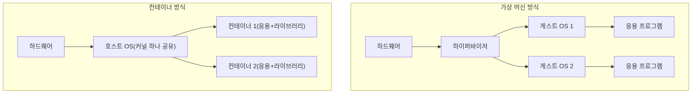

## 왜 리눅스는 이렇게 넓은 곳에서 쓰이는가

지금까지 이 시리즈에서 다룬 리눅스는 대부분 "명령어를 입력해 파일을 다루는 하나의 컴퓨터"였다. 이렇게 폭넓게 쓰일 수 있는 배경에는 리눅스가 **오픈소스(open source, 소스 코드가 공개되어 누구나 보고 수정할 수 있는 소프트웨어)** 라는 점과, 커널(kernel, 하드웨어를 직접 제어하는 운영체제의 핵심 부분)이 필요한 부분만 골라 가볍게 구성할 수 있는 **모듈화된 구조**를 갖췄다는 점이 있다.

## 서버에서의 리눅스

리눅스가 가장 오래, 가장 널리 쓰여 온 자리는 **서버(server)** 다. 웹사이트를 보여 주는 웹 서버, 메일을 주고받는 메일 서버, 데이터를 저장하는 데이터베이스 서버 등 23편에서 다룬 여러 서비스가 실제로 돌아가는 컴퓨터가 대부분 리눅스 위에서 운영된다.

## 클라우드에서의 리눅스

**클라우드(cloud)** 는 직접 서버를 사서 회사 안에 두는 대신, 인터넷 너머의 대규모 데이터센터가 제공하는 컴퓨터 자원을 필요한 만큼 빌려 쓰는 방식이다. 클라우드에서 빌려주는 자원의 범위에 따라 서비스 모델이 나뉜다.

| 서비스 모델 | 사용자가 직접 관리하는 범위 | 예시 |
|-------------|------------------------------|------|
| IaaS(Infrastructure as a Service, 인프라 서비스) | 운영체제부터 응용 프로그램까지 사용자가 설치·관리, 하드웨어만 빌림 | 가상 서버 임대 |
| PaaS(Platform as a Service, 플랫폼 서비스) | 운영체제·미들웨어(중간 소프트웨어)·실행 환경은 제공자가 관리, 사용자는 응용 프로그램 코드와 데이터만 배포 | 웹 애플리케이션 실행 플랫폼 |
| SaaS(Software as a Service, 소프트웨어 서비스) | 완성된 응용 프로그램을 그대로 사용, 사용자는 설정 값 정도만 관리 | 웹메일, 온라인 문서 도구 |

이 세 모델 중 어느 단계에서든 실제로 자원을 제공하는 물리 서버나 가상 서버의 운영체제로는 리눅스가 압도적으로 많이 쓰인다. 대표적인 클라우드 인프라 구축 플랫폼으로 **OpenStack**이 있는데, 이는 IaaS 방식으로 가상 서버·네트워크·저장소를 오픈소스로 구축할 수 있게 해 주는 소프트웨어 모음이다.

> **자주 틀리는 점:** "운영체제·미들웨어·런타임은 관리하지 않고 애플리케이션 코드와 데이터만 배포·관리하면 되는 모델"을 묻는 문제에서 IaaS를 답으로 고르는 실수가 나온다. 하드웨어만 빌리고 운영체제까지 직접 관리해야 하면 IaaS, 운영체제·실행 환경까지 이미 갖춰진 위에 코드만 올리면 PaaS라는 순서(IaaS → PaaS → SaaS로 갈수록 사용자가 관리할 범위가 줄어든다)로 기억해야 한다.

## 가상화와 컨테이너 — 한 대의 컴퓨터를 여러 개처럼 쓰기

클라우드가 가능해진 배경에는 **가상화(virtualization)** 기술이 있다. 가상화는 물리적으로 한 대인 컴퓨터를 소프트웨어로 여러 대인 것처럼 나눠 쓰는 기술이다. 가상화를 실제로 수행하는 소프트웨어를 **하이퍼바이저(hypervisor)** 라 하며, 두 가지 유형으로 나뉜다.

| 유형 | 특징 | 대표 예시 |
|------|------|-----------|
| 타입1(베어메탈, bare-metal) | 하드웨어에 직접 설치되어 그 위에서 바로 가상 머신을 실행 | VMware ESXi, Microsoft Hyper-V, KVM, Xen |
| 타입2(호스트형, hosted) | 윈도우·리눅스 같은 호스트 운영체제 위에 일반 응용 프로그램처럼 설치되어 실행 | VirtualBox, VMware Workstation |

**KVM(Kernel-based Virtual Machine)** 은 리눅스 커널에 내장된 모듈형 하이퍼바이저로, 커뮤니티 개발사 Qumranet이 시작했고 이후 레드햇(Red Hat)이 이어받아 가상화 사업의 핵심 기술로 삼았다. 커널에 통합되어 있다는 점에서 별도의 독립 하이퍼바이저인 Xen과 구분된다.

가상화보다 한 단계 더 가벼운 방식이 **컨테이너(container)** 가상화다. 가상 머신은 하드웨어까지 통째로 흉내 내며 각자 별도의 게스트 운영체제(guest OS)를 띄우는 반면, 컨테이너는 호스트의 커널 하나를 여러 컨테이너가 공유하면서 응용 프로그램을 실행에 필요한 파일·라이브러리와 함께 격리해 담아 둔다.

```mermaid
graph TD
    subgraph "가상 머신 방식"
        A1["하드웨어"] --> A2["하이퍼바이저"]
        A2 --> A3["게스트 OS 1"] --> A4["응용 프로그램"]
        A2 --> A5["게스트 OS 2"] --> A6["응용 프로그램"]
    end
    subgraph "컨테이너 방식"
        B1["하드웨어"] --> B2["호스트 OS(커널 하나 공유)"]
        B2 --> B3["컨테이너 1(응용+라이브러리)"]
        B2 --> B4["컨테이너 2(응용+라이브러리)"]
    end
```

컨테이너를 만들고 실행하는 대표 소프트웨어가 **Docker**다. 이 작업을 자동화해 주는 오픈소스 도구가 **Kubernetes(쿠버네티스, 줄여서 K8s)** 다.

> **자주 틀리는 점:** Docker(컨테이너를 만들고 실행하는 도구)와 Kubernetes(그 컨테이너들을 대규모로 자동 관리하는 오케스트레이션 도구)의 역할을 뒤바꿔 묻는 문제가 잦다. "컨테이너 자체를 만든다"는 Docker, "만들어진 컨테이너 다수를 자동으로 배포·확장·관리한다"는 Kubernetes로 구분해야 한다. Ansible(구성 관리·자동화 도구)이나 OpenStack(IaaS 클라우드 플랫폼)이 오답 선택지로 섞여 나와도, "컨테이너 오케스트레이션"이라는 표현이 있으면 Kubernetes임을 바로 떠올려야 한다.

## 임베디드와 모바일에서의 리눅스

**임베디드 시스템(embedded system)** 은 특정 기능 하나에 특화되어 다른 기기 속에 내장된 소형 컴퓨팅 장치를 말한다. 예를 들어 스마트 TV, 공유기(라우터), 자동차 내비게이션, 산업용 제어 장치 등이 모두 임베디드 시스템에 속한다.

**모바일(mobile)** 분야에서 가장 대표적인 사례는 구글의 **안드로이드(Android)** 운영체제로, 안드로이드는 리눅스 커널을 기반으로 그 위에 자바(Java) 계열 응용 프로그램 실행 환경을 얹은 구조다. 스마트폰 사용자는 리눅스를 직접 의식하지 못하지만, 화면 아래에서는 리눅스 커널이 하드웨어를 제어하고 있는 셈이다.

## 슈퍼컴퓨터와 빅데이터에서의 리눅스

**슈퍼컴퓨터(supercomputer)** 는 일반 컴퓨터로는 감당하기 어려운 대규모 과학 계산(기후 예측, 신약 개발 시뮬레이션, 물리 실험 데이터 분석 등)을 수행하기 위해 만들어진 초고성능 컴퓨터다. 세계 슈퍼컴퓨터 순위(TOP500)에 오르는 시스템의 대다수가 리눅스 기반으로 운영되는데, 그 이유는 여러 대의 컴퓨터를 하나로 묶어 계산 능력을 합치는 방식이 리눅스와 잘 맞기 때문이다.

**빅데이터(big data)** 는 기존 방식으로 처리하기 어려울 만큼 크고 다양하며 빠르게 쌓이는 데이터를 가리킨다. 이런 데이터를 저장·처리하기 위해 만들어진 대표적인 오픈소스 프레임워크가 **Hadoop**이다.

> **자주 틀리는 점:** "빅데이터 인프라 구축에 쓰이며 분산 파일시스템을 제공하는 프로그램"을 묻는 문제에서 NoSQL이나 R을 답으로 고르는 오답이 나온다. NoSQL은 특정 프로그램이 아니라 데이터베이스의 한 분류(범주) 이름이고, R은 통계 분석 언어이지 파일시스템이 아니다. "분산 파일시스템"이라는 표현이 나오면 Hadoop(HDFS)을 떠올려야 한다.

## 클러스터링 — 여러 대를 묶어 하나처럼 쓰기

**클러스터링(clustering)** 은 여러 대의 컴퓨터(노드, node)를 네트워크로 묶어 하나의 시스템처럼 동작하게 만드는 기술이다. 클러스터링을 왜 하는지, 즉 "묶어서 무엇을 얻으려 하는가"에 따라 세 가지로 나뉘며, 이 세 가지를 명확히 구분하는 것이 이 단원의 핵심이다.

| 종류 | 목적 | 동작 방식 | 대표 예시 |
|------|------|-----------|-----------|
| 고가용성 클러스터(HA, High Availability) | 서비스가 끊기지 않게 하기(무중단) | 평소 주 노드(Primary Node)가 서비스를 처리하고, 예비 노드(Backup Node)가 상태를 감시하다가 주 노드에 장애가 생기면 서비스를 즉시 이어받음(failover, 장애 조치) | 데이터베이스 이중화 구성 |
| 부하분산 클러스터(Load Balancing) | 많은 요청을 나눠서 빠르게 처리하기 | 여러 노드가 동시에 살아 있고, 들어오는 요청을 분산기(로드 밸런서)가 노드마다 나눠서 배분함 | 대규모 웹 서비스의 여러 대 웹 서버 |
| 고성능연산 클러스터(HPC, High Performance Computing) | 하나의 거대한 계산을 여러 대가 나눠서 함께 수행하기 | 계산 작업을 잘게 쪼개 여러 노드에 분배하고, 각 노드의 결과를 모아 하나의 답을 만듦 | 베어울프 클러스터, 과학 계산용 슈퍼컴퓨터 |

세 종류를 구분하는 핵심 열쇠는 "평소에 여러 노드가 무엇을 하고 있는가"다. 고가용성 클러스터는 평소 예비 노드가 **일을 하지 않고 감시만** 하다가 문제가 생겼을 때만 나선다.

> **자주 틀리는 점:** "주 노드가 서비스를 처리하고 예비 노드가 감시하다가 장애 시 서비스를 이어받는" 설명을 보고 부하분산 클러스터로 답하는 오답이 흔하다. 이 설명은 평소 두 노드가 같은 일을 나눠 하는 것이 아니라 한쪽이 감시만 하다가 대신하는 구조이므로 고가용성 클러스터가 정답이다. 반대로 "다수 노드에 요청을 나눠 처리량을 높인다"는 설명에는 부하분산 클러스터가 맞고, "저가 PC를 묶어 병렬 계산을 한다"는 설명에는 고성능연산(베어울프) 클러스터가 맞다.

## 핵심 정리

- 클라우드 서비스 모델은 IaaS(하드웨어만 빌림) → PaaS(실행 환경까지 제공, 코드만 배포) → SaaS(완성된 프로그램 그대로 사용) 순으로 사용자가 관리할 범위가 줄어든다.
- 가상 머신은 게스트 OS를 통째로 띄우고, 컨테이너는 호스트 커널을 공유해 더 가볍다. Docker는 컨테이너를 만들고, Kubernetes는 다수 컨테이너의 배포·확장·자가 치유를 자동화(오케스트레이션)한다.
- 임베디드는 특정 기능에 특화된 소형 장치, 모바일의 대표 사례는 리눅스 커널 기반의 안드로이드다.
- 빅데이터는 Hadoop(HDFS 분산 파일시스템)으로 저장·처리하며, NoSQL은 데이터베이스의 분류 이름이지 특정 프로그램이 아니다.
- 클러스터링은 고가용성(무중단, 감시-대체), 부하분산(요청 분산), 고성능연산(계산 분담) 세 가지로 구분하며, "평소 노드들이 무엇을 하고 있는가"로 판별한다.

## 마무리 복습

<Quiz
  questionNumber={1}
  question={"클라우드 컴퓨팅 서비스 모델 중, 사용자가 운영체제·미들웨어·런타임을 직접 관리하지 않고 애플리케이션 코드와 데이터만 배포·관리하면 되는 모델은?"}
  options={["IaaS","PaaS","SaaS","DaaS"]}
  correctAnswer={2}
  explanation={"PaaS(Platform as a Service)는 운영체제와 미들웨어, 실행 환경까지 제공자가 관리하고 사용자는 애플리케이션 코드와 데이터만 배포하면 되는 모델이다."}
/>

<Quiz
  questionNumber={2}
  question={"하드웨어에 직접 설치되어 그 위에서 바로 가상 머신을 실행하는 하이퍼바이저 유형과 그 예시로 옳은 것은?"}
  options={["타입2(호스트형), VirtualBox","타입1(베어메탈), KVM","타입2(호스트형), KVM","컨테이너 가상화, Docker"]}
  correctAnswer={2}
  explanation={"타입1(베어메탈) 하이퍼바이저는 하드웨어에 직접 설치되며 KVM, Xen, VMware ESXi, Hyper-V가 대표적이다. VirtualBox는 호스트 OS 위에서 실행되는 타입2(호스트형)다."}
/>

<Quiz
  questionNumber={3}
  question={"컨테이너화된 애플리케이션 다수의 배포·확장·자가 치유를 자동화하는 대표적인 오픈소스 컨테이너 오케스트레이션 플랫폼은?"}
  options={["Docker","Ansible","Kubernetes","Terraform"]}
  correctAnswer={3}
  explanation={"Kubernetes(K8s)는 컨테이너의 배포·스케일링·자가 치유·로드 밸런싱을 자동화하는 대표적인 컨테이너 오케스트레이션 플랫폼으로 CNCF가 관리한다."}
/>

## 참고 자료

- [KAIT 리눅스마스터 자격안내](https://www.ihd.or.kr/introducesubject1.do)
- [The Linux Documentation Project](https://tldp.org)
