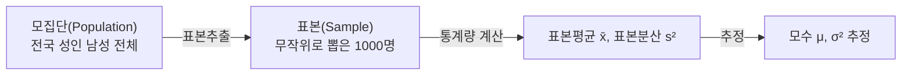

<Callout type="info">
  **이번 문서의 목표:** 시험에 나오는 수식 기호를 소리 내어 읽고, 평균·분산·표준편차·사분위수를 종이에 손으로 계산할 수 있으며, 모집단과 표본의 차이를 설명할 수 있게 된다.
</Callout>

## 왜 수학을 먼저 정리하는가

빅데이터분석기사 필기의 계산 문제는 어렵지 않습니다. 진짜 어려움은 **수식을 읽지 못해서 문제가 무엇을 요구하는지조차 모르는 상태**에서 옵니다. 예를 들어 아래 식이 나오면 많은 수험생이 그 자리에서 멈춥니다.

$$
s^2 = \frac{1}{n-1}\sum_{i=1}^{n}(x_i - \bar{x})^2
$$

이 식은 사실 "**각 값에서 평균을 빼고, 제곱하고, 다 더한 다음, 개수보다 하나 적은 수로 나눠라**"는 문장을 기호로 줄여 쓴 것뿐입니다. 이 편은 그 번역 능력을 만듭니다.

> **쉽게 말하면:** 수식은 외국어이고, 이 편은 그 외국어의 단어장입니다.

## 1. 기호 읽는 법 — 시험에 나오는 것만

| 기호 | 읽는 법 | 뜻 |
|------|---------|-----|
| $\sum$ | 시그마 | 모두 더하라 |
| $\bar{x}$ | 엑스 바 | 표본평균 |
| $\mu$ | 뮤 | 모평균 |
| $\sigma$ | 시그마(소문자) | 모표준편차 |
| $\sigma^2$ | 시그마 제곱 | 모분산 |
| $s$ | 에스 | 표본표준편차 |
| $s^2$ | 에스 제곱 | 표본분산 |
| $n$ | 엔 | 표본 크기(자료 개수) |
| $N$ | 대문자 엔 | 모집단 크기 |
| $x_i$ | 엑스 아이 | i번째 관측값 |
| $\alpha$ | 알파 | 유의수준 |
| $\rho$ | 로 | 모상관계수 |

### 시그마 기호를 직접 풀어 보기

$\sum$(시그마)는 그리스 문자 시그마의 대문자로, 영어 Sum(합)의 첫 글자에 해당합니다. 아래 첨자와 위 첨자가 "어디서부터 어디까지 더할지"를 알려 줍니다.

$$
\sum_{i=1}^{5} x_i = x_1 + x_2 + x_3 + x_4 + x_5
$$

- $i$: 세는 번호(index, 인덱스). 1번부터 시작합니다.
- 아래 첨자 $i=1$: 1번 값부터 더하기 시작
- 위 첨자 $5$: 5번 값까지 더하고 멈춤
- $x_i$: i번째 관측값

**예시:** 자료가 4, 7, 9, 10, 20이라면

$$
\sum_{i=1}^{5} x_i = 4 + 7 + 9 + 10 + 20 = 50
$$

생활 비유로는 장바구니에 담은 다섯 상품의 가격표를 하나씩 순서대로 읽으며 계산기에 더하는 행동이 곧 시그마입니다.

## 2. 지수와 로그 — 왜 데이터 분석에 나오나

### 지수

$a^n$은 $a$를 $n$번 곱하라는 뜻입니다. $2^3 = 2 \times 2 \times 2 = 8$입니다. 데이터 크기 단위가 지수로 표현됩니다.

$$
1\ \text{KB} = 2^{10}\ \text{B} = 1024\ \text{B}
$$

- 밑 $2$: 컴퓨터가 0과 1 두 가지 상태를 쓰기 때문에 2를 밑으로 씁니다
- 지수 $10$: 2를 열 번 곱함

같은 방식으로 MB는 $2^{20}$바이트, GB는 $2^{30}$, TB는 $2^{40}$, PB는 $2^{50}$바이트입니다. 빅데이터의 크기(Volume, 볼륨)를 말할 때 "테라바이트(TB)·페타바이트(PB) 이상"이라는 표현이 나오는데, 이 순서를 헷갈리지 않도록 **KB → MB → GB → TB → PB → EB** 를 외워 둡니다.

### 로그

로그(log, logarithm, 로가리듬)는 지수의 반대 연산입니다. "밑을 몇 번 곱해야 이 수가 되는가"를 답합니다.

$$
\log_{2} 8 = 3
$$

- 밑 $2$: 곱할 수
- 진수 $8$: 만들고 싶은 결과
- 값 $3$: 2를 세 번 곱하면 8이 되므로 3

**데이터 분석에서 로그를 쓰는 이유**는 12편의 로그 변환에서 자세히 다루지만, 직관은 여기서 잡아 둡니다. 소득처럼 **한쪽으로 심하게 치우친(오른쪽 꼬리가 긴)** 자료는 값이 100, 200, 300, 그리고 갑자기 100000처럼 벌어집니다. 로그를 씌우면 큰 값이 훨씬 크게 줄어들어 분포가 대칭에 가까워집니다.

| 원래 값 | 상용로그 값 |
|---------|-------------|
| 10 | 1 |
| 100 | 2 |
| 1000 | 3 |
| 100000 | 5 |

**해석:** 원래 값이 10배씩 커질 때 로그 값은 1씩만 커집니다. 값의 폭이 10만이었던 자료가 로그 후에는 폭이 4로 줄어듭니다. 이것이 "**로그 변환은 산포를 균일화한다**"는 문장의 실제 의미입니다.

## 3. 중심을 나타내는 값 — 평균·중앙값·최빈값

> **쉽게 말하면:** 자료 덩어리를 대표하는 숫자 하나를 고르는 세 가지 방법입니다.

이 세 가지를 **중심경향척도**(measure of central tendency)라고 부릅니다.

### 평균

$$
\bar{x} = \frac{1}{n}\sum_{i=1}^{n} x_i
$$

- $\bar{x}$: 표본평균(엑스 바)
- $n$: 자료 개수
- $\sum x_i$: 모든 값의 합

**예시 자료:** 4, 7, 9, 10, 20 (5개)

$$
\bar{x} = \frac{4+7+9+10+20}{5} = \frac{50}{5} = 10
$$

### 중앙값

자료를 **크기 순으로 정렬**한 뒤 가운데 있는 값입니다. 개수가 홀수면 정확히 가운데 값, 짝수면 가운데 두 값의 평균입니다.

위 자료를 정렬하면 4, 7, 9, 10, 20이고 개수가 5개(홀수)이므로 3번째 값인 **9**가 중앙값입니다.

자료가 하나 더 늘어 4, 7, 9, 10, 20, 30이 되면 개수가 6개(짝수)이므로 3번째와 4번째의 평균입니다.

$$
\text{중앙값} = \frac{9 + 10}{2} = 9.5
$$

### 최빈값

가장 자주 나타난 값 또는 범주입니다. 자료 3, 3, 5, 7, 7, 7, 9라면 7이 세 번으로 가장 많으므로 최빈값은 7입니다.

### 셋의 관계로 분포의 치우침을 읽는다 — 기출 단골

| 관계 | 분포 모양 | 대표 사례 |
|------|-----------|-----------|
| 평균 = 중앙값 = 최빈값 | 좌우 대칭 | 정규분포 |
| 평균 `>` 중앙값 | 오른쪽 꼬리가 김 (양의 왜도) | 소득, 매출 |
| 평균 `<` 중앙값 | 왼쪽 꼬리가 김 (음의 왜도) | 만점이 몰린 시험 점수 |

**왜 그런가:** 평균은 모든 값을 더해서 나누므로 **극단값에 끌려갑니다.** 반면 중앙값은 순서만 보므로 극단값이 아무리 커도 자리를 지킵니다. 그래서 아주 큰 값이 몇 개 섞이면 평균만 위로 끌려 올라가 "평균이 중앙값보다 크다"는 상태가 됩니다.

**계산으로 확인:** 자료 11, 12, 12, 13, 14, 15, 41을 봅시다.

$$
\bar{x} = \frac{11+12+12+13+14+15+41}{7} = \frac{118}{7} \approx 16.86
$$

정렬된 7개의 가운데(4번째) 값이 중앙값이므로 13입니다.

**해석:** 평균 약 16.86이 중앙값 13보다 큽니다. 41이라는 큰 값 하나가 평균만 끌어올린 것입니다. 따라서 이 분포는 **오른쪽으로 꼬리가 긴** 형태를 의심해야 합니다. 기출에서는 "높은 극단값이 있으므로 분포는 왼쪽으로 치우친다"는 보기를 틀린 설명으로 넣습니다. **높은 값 쪽에 꼬리 → 오른쪽 치우침(양의 왜도)** 이라는 방향을 반드시 고정해 두세요.

## 4. 흩어짐을 나타내는 값 — 분산·표준편차·범위

> **쉽게 말하면:** 값들이 평균 주위에 얼마나 몰려 있는지, 아니면 넓게 퍼져 있는지를 재는 자입니다.

중심만으로는 자료를 설명할 수 없습니다. 평균이 같은 두 반이 있어도, 한 반은 전원이 70점 근처이고 다른 반은 30점과 100점이 섞여 있을 수 있습니다. 이 차이를 재는 것이 **산포경향척도**(measure of dispersion)입니다.

### 편차와 분산

**편차**는 각 값에서 평균을 뺀 값 $(x_i - \bar{x})$ 입니다. 그런데 편차를 그냥 다 더하면 항상 0이 됩니다. 위쪽으로 벗어난 만큼과 아래쪽으로 벗어난 만큼이 상쇄되기 때문입니다. 그래서 **제곱해서** 부호를 없앤 뒤 평균을 냅니다. 이것이 분산입니다.

$$
s^2 = \frac{1}{n-1}\sum_{i=1}^{n}(x_i - \bar{x})^2
$$

- $s^2$: 표본분산
- $x_i - \bar{x}$: i번째 편차
- 제곱: 음수 부호를 없애고, 크게 벗어난 값에 더 큰 벌점을 준다
- $n-1$: 자유도(degree of freedom). 표본분산에서만 쓰는 나눗수

### 손으로 계산해 보기 — 중간 단계 전부

**자료:** 4, 7, 9, 10, 20 (앞에서 평균 10을 구했습니다)

**1단계 — 편차 구하기**

| $x_i$ | $x_i - \bar{x}$ | $(x_i - \bar{x})^2$ |
|------|------|------|
| 4 | –6 | 36 |
| 7 | –3 | 9 |
| 9 | –1 | 1 |
| 10 | 0 | 0 |
| 20 | 10 | 100 |
| 합계 | 0 | 146 |

**2단계 — 편차 제곱의 합**

$$
\sum (x_i - \bar{x})^2 = 36 + 9 + 1 + 0 + 100 = 146
$$

**3단계 — 표본분산**

$$
s^2 = \frac{146}{5-1} = \frac{146}{4} = 36.5
$$

**4단계 — 표본표준편차**(분산의 제곱근)

$$
s = \sqrt{36.5} \approx 6.04
$$

**해석:** 표준편차 약 6.04는 "값들이 평균 10에서 대체로 6 정도씩 벗어나 있다"는 뜻입니다. 분산 36.5는 제곱된 값이라 원래 자료와 단위가 다릅니다(자료가 '점'이면 분산은 '점의 제곱'). 그래서 해석할 때는 원래 단위로 돌아온 **표준편차**를 씁니다.

### 왜 표본분산은 $n$이 아니라 $n-1$로 나누는가

이 질문은 기출에 자주 등장하고, 대부분의 수험생이 "그냥 그렇다"로 넘겨서 함정에 걸립니다.

표본분산을 계산할 때 우리는 이미 **표본평균 $\bar{x}$ 를 자료로부터 계산해서 썼습니다.** 그런데 편차의 합은 반드시 0이 되어야 하므로, $n$개의 편차 중 $n-1$개를 알면 나머지 하나는 자동으로 결정됩니다. 위 표에서도 편차 –6, –3, –1, 0을 알면 마지막 편차는 합이 0이 되도록 반드시 10이어야 합니다.

> **쉽게 말하면:** 자유롭게 움직일 수 있는 값이 $n$개가 아니라 $n-1$개뿐이므로, $n-1$로 나눠야 모분산을 치우침 없이 추정합니다.

이 $n-1$을 **자유도**(degree of freedom, df)라고 부릅니다. 자유도는 뒤에서 t분포·카이제곱분포에서도 계속 나오는 개념이므로 여기서 확실히 잡아 둡니다.

| 구분 | 기호 | 나눗수 | 이유 |
|------|------|--------|------|
| 모분산 | $\sigma^2$ | $N$ | 모집단 전체를 알고 있으므로 보정 불필요 |
| 표본분산 | $s^2$ | $n-1$ | 표본평균을 이미 썼으므로 자유도 1 감소 |

### 변동계수

단위가 다른 두 자료의 흩어짐을 비교할 때는 표준편차를 그대로 비교할 수 없습니다. 키(cm)의 표준편차 5와 몸무게(kg)의 표준편차 5는 의미가 다르기 때문입니다. 그래서 평균 대비 비율로 봅니다.

$$
CV = \frac{s}{\bar{x}}
$$

- $CV$: 변동계수(Coefficient of Variation)
- $s$: 표준편차
- $\bar{x}$: 평균

위 자료라면 $CV = 6.04 \div 10 = 0.604$ 이고, 백분율로는 약 60.4퍼센트입니다.

## 5. 분위수와 사분위수 범위

> **쉽게 말하면:** 자료를 크기 순으로 세워 놓고 4등분하는 지점의 값입니다.

- **Q1**(제1사분위수): 아래에서 25퍼센트 지점
- **Q2**(제2사분위수): 50퍼센트 지점 = 중앙값
- **Q3**(제3사분위수): 아래에서 75퍼센트 지점

$$
IQR = Q_3 - Q_1
$$

- $IQR$: 사분위수 범위(Interquartile Range). 가운데 50퍼센트가 차지하는 폭

### 이상치 판정 기준 — 11편으로 이어지는 계산

상자그림(box plot, 박스플롯)이 이상치를 표시하는 규칙은 다음과 같습니다.

$$
\text{하한 경계} = Q_1 - 1.5 \times IQR
$$

$$
\text{상한 경계} = Q_3 + 1.5 \times IQR
$$

이 두 경계 밖의 값을 이상치 후보로 봅니다.

**계산 예시:** $Q_1 = 20$, $Q_3 = 40$ 인 자료에서

$$
IQR = 40 - 20 = 20
$$

$$
\text{하한} = 20 - 1.5 \times 20 = 20 - 30 = -10
$$

$$
\text{상한} = 40 + 1.5 \times 20 = 40 + 30 = 70
$$

**해석:** 값이 –10보다 작거나 70보다 크면 이상치 후보입니다. 값 75는 상한 70을 넘으므로 이상치 후보이고, 값 65는 경계 안이므로 정상 범위입니다. **1.5라는 배수는 관례이며 프로그램·상황에 따라 다르게 쓸 수 있다**는 점도 기출 함정으로 나옵니다.

## 6. 확률의 기초

### 확률의 뜻

확률은 어떤 사건이 일어날 가능성을 0과 1 사이 숫자로 나타낸 값입니다. 주사위 하나를 던져 짝수가 나올 확률은 짝수 눈이 2, 4, 6의 세 가지이므로

$$
P(\text{짝수}) = \frac{3}{6} = 0.5
$$

- $P$: 확률(Probability)의 첫 글자
- 분자 3: 조건을 만족하는 경우의 수
- 분모 6: 전체 경우의 수

### 조건부확률

**사건 B가 이미 일어났다는 정보가 있을 때** 사건 A가 일어날 확률입니다.

$$
P(A \mid B) = \frac{P(A \cap B)}{P(B)}
$$

- $P(A \mid B)$: "B가 주어졌을 때 A의 확률"이라고 읽습니다. 세로 막대는 조건 기호입니다
- $P(A \cap B)$: A와 B가 **동시에** 일어날 확률. $\cap$ 은 교집합(캡, cap) 기호
- $P(B)$: 조건이 되는 사건의 확률

**예시:** 주사위 눈이 짝수(B)라는 정보가 있을 때, 그 눈이 4(A)일 확률은?

$$
P(B) = \frac{3}{6}
$$

$$
P(A \cap B) = \frac{1}{6}
$$

$$
P(A \mid B) = \frac{1/6}{3/6} = \frac{1}{3}
$$

**해석:** 아무 정보 없이 4가 나올 확률은 6분의 1이지만, "짝수다"라는 정보가 들어오면 후보가 2, 4, 6 셋으로 줄어 확률이 3분의 1로 올라갑니다. **정보가 들어오면 분모(가능한 세계)가 줄어든다**는 것이 조건부확률의 핵심 직관입니다.

### 전체확률과 역방향 계산 — 기출 계산 유형

기출에는 다음 형태가 자주 나옵니다. "집단 A와 B의 비율이 각각 0.6, 0.4이고, 기준 초과가 나타날 확률이 A에서 0.25, B에서 0.10일 때, 기준 초과가 관찰된 사람이 A일 확률은?"

**1단계 — A이면서 초과일 확률**

$$
P(A \cap \text{초과}) = 0.6 \times 0.25 = 0.15
$$

**2단계 — B이면서 초과일 확률**

$$
P(B \cap \text{초과}) = 0.4 \times 0.10 = 0.04
$$

**3단계 — 초과가 나타날 전체 확률**

$$
P(\text{초과}) = 0.15 + 0.04 = 0.19
$$

**4단계 — 초과인 사람이 A일 확률**

$$
P(A \mid \text{초과}) = \frac{0.15}{0.19} \approx 0.789
$$

**해석:** 원래 A는 전체의 60퍼센트였는데, "기준 초과"라는 정보를 얻고 나니 A일 확률이 약 78.9퍼센트로 올라갔습니다. A에서 초과가 더 자주 일어나기 때문입니다. 이 계산의 뼈대는 **각 갈래의 확률을 곱해서 더하고(전체확률), 관심 갈래를 그 합으로 나눈다**는 두 단계뿐입니다.

## 7. 모집단과 표본

> **쉽게 말하면:** 알고 싶은 대상 전체가 모집단이고, 실제로 손에 넣은 일부가 표본입니다.

| 구분 | 대상 | 값의 이름 | 기호 |
|------|------|-----------|------|
| 모집단 | 관심 대상 전체 | 모수(parameter) | $\mu$, $\sigma^2$ |
| 표본 | 모집단에서 뽑은 일부 | 통계량(statistic) | $\bar{x}$, $s^2$ |

**왜 표본을 쓰는가:** 전국 성인 남성 전체의 키를 재는 것은 비용과 시간 면에서 불가능합니다. 그래서 1000명을 뽑아 재고, 그 표본평균으로 모평균을 **추정**합니다. 여기서 생기는 오차를 다루는 것이 15편의 추론통계입니다.

**자주 틀리는 점:** 모수와 통계량을 반대로 쓰는 실수가 잦습니다. **모수는 모집단의 값이라 보통 알 수 없는 미지수**이고, **통계량은 표본에서 실제로 계산해 낸 값**입니다. 기호로는 그리스 문자($\mu$, $\sigma$)가 모수, 로마 문자($\bar{x}$, $s$)가 통계량이라고 외우면 헷갈리지 않습니다.

## 핵심 정리

- $\sum$ 는 "모두 더하라"는 기호이며, 아래·위 첨자가 더하는 범위를 나타낸다. 수식은 문장을 줄여 쓴 것이므로 그대로 풀어 읽으면 된다.
- 중심경향척도는 평균·중앙값·최빈값이며, **평균이 중앙값보다 크면 오른쪽 꼬리(양의 왜도)** 를 의심한다. 평균만 극단값에 끌려간다.
- 표본분산은 $n$이 아니라 **$n-1$**(자유도)로 나눈다. 표본평균을 이미 썼기 때문에 자유롭게 움직일 값이 하나 줄기 때문이다.
- $IQR = Q_3 - Q_1$ 이고, 이상치 경계는 $Q_1 - 1.5 \times IQR$ 과 $Q_3 + 1.5 \times IQR$ 이다.
- 조건부확률은 "정보가 들어오면 분모가 줄어든다"는 계산이며, 전체확률로 분모를 만들고 관심 갈래를 나누면 역방향 확률을 얻는다.
- 모수는 모집단의 미지수(그리스 문자), 통계량은 표본에서 계산한 값(로마 문자)이다.

## 마무리 복습

<Quiz
  questionNumber={1}
  question="자료 4, 7, 9, 10, 20의 표본분산으로 옳은 것은?"
  options={['29.2', '36.5', '146', '6.04']}
  correctAnswer={2}
  explanation="평균은 50÷5=10이고 편차 제곱의 합은 36+9+1+0+100=146이다. 표본분산은 146을 n-1=4로 나눈 36.5다. 29.2는 n=5로 나눈 모분산 형태이고 146은 나누기 전 제곱합, 6.04는 표준편차다."
  optionExplanations={['146을 n=5로 나눈 값으로, 표본분산은 n-1로 나눠야 한다.', '146÷4=36.5로 표본분산이 맞다.', '146은 편차 제곱의 합일 뿐 아직 나누지 않은 값이다.', '6.04는 36.5의 제곱근으로 표준편차이지 분산이 아니다.']}
/>

<Quiz
  questionNumber={2}
  question="어떤 자료의 평균이 54, 중앙값이 49로 관찰되었다. 이로부터 가장 타당한 해석은?"
  options={['최댓값은 반드시 이상치다', '분포가 왼쪽으로 꼬리가 긴 형태다', '평균이 중앙값보다 커 오른쪽 꼬리 가능성을 의심할 수 있다', '해당 변수는 명목형 변수임이 확정된다']}
  correctAnswer={3}
  explanation="평균은 극단값에 끌려가고 중앙값은 순서만 보므로, 평균이 중앙값보다 크면 높은 쪽에 꼬리가 있을 가능성을 의심한다. 다만 이는 가능성이지 확정이 아니므로 분포를 직접 확인해야 하고, 최댓값이 이상치인지는 IQR 등 별도 기준으로 판단한다."
  optionExplanations={['최댓값이 이상치인지는 IQR 기준 등으로 별도 판정해야 하며 자동으로 확정되지 않는다.', '높은 쪽 극단값은 오른쪽 꼬리를 만들며 왼쪽 치우침으로 해석하지 않는다.', '평균이 중앙값보다 큰 패턴은 오른쪽 꼬리 가능성을 시사하므로 옳은 해석이다.', '평균과 중앙값을 계산했다는 것 자체가 이 변수가 수치형임을 의미한다.']}
/>

<Quiz
  questionNumber={3}
  question="표본분산을 계산할 때 관측치 개수 n이 아니라 n-1로 나누는 이유로 가장 적절한 것은?"
  options={['계산을 간단하게 만들기 위해서다', '표본평균을 이미 사용했으므로 자유롭게 결정되는 값이 하나 줄기 때문이다', '표본이 모집단보다 항상 작기 때문이다', '분산 값을 작게 만들어 해석을 쉽게 하기 위해서다']}
  correctAnswer={2}
  explanation="편차의 합은 반드시 0이 되므로 n개의 편차 중 n-1개가 정해지면 나머지 하나는 자동으로 결정된다. 이 자유도 감소를 반영해 n-1로 나눠야 모분산을 치우침 없이 추정할 수 있다. n-1로 나누면 값은 오히려 커진다."
  optionExplanations={['n-1로 나누는 것이 계산을 더 간단하게 만들지는 않는다.', '표본평균 사용으로 자유도가 1 줄기 때문이며 이것이 정확한 이유다.', '표본이 작다는 사실 자체는 나눗수를 결정하는 근거가 아니다.', 'n-1로 나누면 n으로 나눌 때보다 값이 커지므로 설명이 반대다.']}
/>

<Quiz
  questionNumber={4}
  question="어떤 변수의 제1사분위수가 20, 제3사분위수가 40이다. 1.5 IQR 규칙에 따른 상한 경계값은?"
  options={['60', '70', '50', '80']}
  correctAnswer={2}
  explanation="IQR은 40-20=20이고 상한 경계는 Q3+1.5×IQR=40+30=70이다. 60은 1.0배를 적용한 값이고 50은 Q3에 IQR의 절반만 더한 값이며 80은 Q3의 두 배를 잘못 계산한 값이다."
  optionExplanations={['1.5배가 아니라 1.0배를 적용한 값이다.', '40+1.5×20=70으로 상한 경계가 맞다.', 'IQR의 절반만 더한 값으로 규칙을 잘못 적용했다.', 'Q3를 두 배 한 값으로 IQR 규칙과 무관하다.']}
/>

<Quiz
  questionNumber={5}
  question="집단 A와 B의 비율이 각각 0.6과 0.4이고, 기준 초과가 나타날 확률이 A에서 0.25, B에서 0.10일 때 기준 초과가 관찰된 사람이 A에 속할 확률은?"
  options={['약 0.789', '0.15', '0.25', '0.60']}
  correctAnswer={1}
  explanation="A이면서 초과일 확률은 0.6×0.25=0.15, B이면서 초과일 확률은 0.4×0.10=0.04이므로 초과의 전체 확률은 0.19다. 0.15를 0.19로 나누면 약 0.789다. 0.15는 나누기 전 값이고 0.25는 A에서의 초과 확률, 0.60은 조건 없이 A일 확률이다."
  optionExplanations={['0.15÷0.19=0.789로 조건부확률이 맞다.', '0.15는 A이면서 초과일 확률로 아직 전체 초과 확률로 나누지 않았다.', '0.25는 A 안에서 초과가 나타날 확률이며 방향이 반대다.', '0.60은 초과 정보를 반영하기 전의 A 비율이다.']}
/>

<Quiz
  questionNumber={6}
  question="모수와 통계량에 대한 설명으로 옳은 것은?"
  options={['모수는 표본에서 계산한 값이고 통계량은 모집단의 값이다', '모수는 모집단의 특성값이고 통계량은 표본에서 계산한 값이다', '모수와 통계량은 항상 값이 같다', '통계량은 언제나 모수보다 크다']}
  correctAnswer={2}
  explanation="모집단 전체를 기준으로 계산한 값이 모수이고, 표본을 기준으로 계산한 값이 통계량이다. 모수는 보통 알 수 없어 표본의 통계량으로 추정하므로 두 값이 일치한다는 보장이 없고 대소 관계도 정해져 있지 않다."
  optionExplanations={['모수와 통계량의 정의를 서로 뒤바꿔 설명했다.', '모집단 기준이 모수, 표본 기준이 통계량이므로 옳다.', '통계량은 표본에 따라 달라지므로 모수와 일치한다는 보장이 없다.', '통계량이 모수보다 크거나 작을 수 있으며 방향이 정해져 있지 않다.']}
/>

<Quiz
  questionNumber={7}
  question="변동계수(CV)를 사용하는 가장 적절한 상황은?"
  options={['같은 단위의 두 자료 중 평균이 더 큰 쪽을 고를 때', '단위나 평균 크기가 서로 다른 두 자료의 상대적 산포를 비교할 때', '자료의 중심 위치를 하나의 값으로 요약할 때', '범주형 자료의 대표 범주를 정할 때']}
  correctAnswer={2}
  explanation="변동계수는 표준편차를 평균으로 나눈 상대적 산포 지표로, 단위나 평균 규모가 다른 자료를 비교할 때 쓴다. 중심 요약은 평균이나 중앙값이 담당하고 범주형 대표값은 최빈값이 담당한다."
  optionExplanations={['평균 크기 비교 자체에는 변동계수가 필요하지 않다.', '단위나 평균이 달라 표준편차를 직접 비교할 수 없을 때 쓰는 지표가 맞다.', '중심 위치 요약은 평균과 중앙값의 역할이다.', '범주형 대표값은 최빈값을 사용하며 변동계수는 수치형 산포 지표다.']}
/>

## 참고 자료

- [코리아IT아카데미 - 빅데이터 분석기사](https://www.koreaisacademy.com/2025/cer/datascience/bigdata.asp)
- [Statistics Playbook - 빅데이터분석기사 완전 가이드](https://statisticsplaybook.com/big-data-analysis-engineer-guide/)
- [Inflearn 가이드 - 빅데이터분석기사 어떻게 준비해야 할까?](https://www.inflearn.com/pages/bigdata-analysis-engineer-guide)
