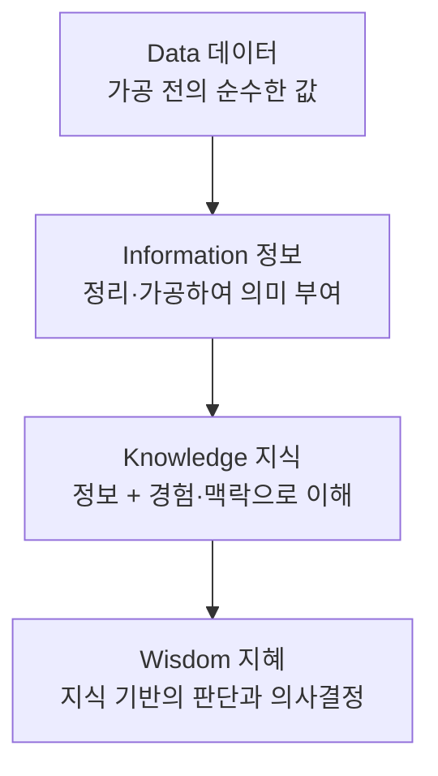

<Callout type="info">
  **이번 문서의 목표:** 시험에 나오는 데이터 관련 용어를 서로 헷갈리지 않게 구분하고, 특히 정형·반정형·비정형 데이터와 RDBMS·NoSQL·하둡의 경계, 빅데이터 3V·5V, DIKW 단계를 사례로 판정할 수 있게 된다.
</Callout>

## 왜 용어 지도부터 그리는가

1과목은 개념을 새로 만들어 내는 과목이 아니라 **정의를 정확히 구분하는 과목**입니다. 기출 문제는 대부분 "다음 중 반정형 데이터의 예로 가장 거리가 먼 것은?", "다음 중 비정형 데이터로 보기 어려운 것은?" 같은 형태로 나옵니다. 즉 답을 가르는 것은 **경계선을 얼마나 정확히 알고 있는가**입니다.

> **쉽게 말하면:** 이 편은 앞으로 24편 동안 계속 쓰일 단어들의 지도입니다. 여기서 경계선을 흐릿하게 잡으면 이후 모든 편에서 헷갈립니다.

## 1. 데이터란 무엇인가 — DIKW 피라미드

**데이터**(data, 데이터)는 가공되기 전의 순수한 수치나 값입니다. 그 자체로는 의미가 없습니다. 데이터가 의미를 얻고, 나아가 판단의 근거가 되는 과정을 네 단계로 나눈 것이 **DIKW 피라미드**입니다. DIKW는 Data(데이터), Information(정보), Knowledge(지식), Wisdom(지혜)의 머리글자를 이어 붙인 이름입니다.

| 단계 | 정의 | 편의점 매출 예시 |
|------|------|------------------|
| 데이터 | 가공 전의 순수한 수치나 값 | A점포 오늘 우산 판매 42개 |
| 정보 | 데이터를 정리·가공해 의미를 부여한 것 | 비 오는 날의 우산 판매가 평소보다 3배 많다 |
| 지식 | 정보를 분석하고 경험·맥락과 결합해 이해한 것 | 강수 예보가 있으면 우산 수요가 급증한다 |
| 지혜 | 지식을 바탕으로 올바른 판단과 의사결정을 내리는 능력 | 내일 비 예보가 있으니 우산을 미리 발주한다 |

**자주 틀리는 점:** 정보와 지식의 경계를 묻는 문제가 자주 나옵니다. 구분 기준은 **경험·맥락의 결합 여부**입니다. 단순 집계·가공까지는 정보이고, 그 정보에 인과나 규칙성을 부여해 "그러므로 이렇다"까지 가면 지식입니다. 그리고 그 지식으로 **실제 행동을 결정**하면 지혜입니다.

### 암묵지와 형식지

지식은 그 표현 형태로도 나뉩니다.

| 구분 | 정의 | 예시 |
|------|------|------|
| 암묵지(暗默知) | 학습이나 체험으로 개인에게 쌓이지만 겉으로 드러나지 않는 지식 | 숙련 정비공의 소리로 고장 진단하는 감각 |
| 형식지(形式知) | 암묵지가 문서·매뉴얼처럼 밖으로 표출되어 여러 사람이 공유할 수 있는 지식 | 정비 매뉴얼, 체크리스트 |

두 지식 사이의 전환에는 이름이 붙어 있고, 시험에서 이 방향을 뒤집어 함정으로 씁니다.

- **표출화**(externalization): 암묵지 → 형식지. 장인의 감각을 매뉴얼로 적는 일
- **내면화**(internalization): 형식지 → 암묵지. 매뉴얼을 읽고 반복해 몸에 익히는 일

## 2. 데이터의 세 가지 형태 — 정형·반정형·비정형

> **쉽게 말하면:** "정해진 칸이 있는가, 있다면 얼마나 엄격한가"로 나눕니다.

이 구분은 1과목 최다 출제 지점 중 하나입니다. 판정 기준은 **스키마**(schema, 데이터의 구조 정의)의 유무와 엄격함입니다.

| 구분 | 스키마 | 저장 형태 | 대표 예시 |
|------|--------|-----------|-----------|
| 정형(structured) | 명시적·고정적 | 행과 열의 표 | 관계형 데이터베이스 테이블, 정형화된 CSV |
| 반정형(semi-structured) | 있으나 표로 고정되지 않음 | 태그·키로 구조를 자체 포함 | JSON, XML, HTML, RDF |
| 비정형(unstructured) | 없음 | 내용 자체가 곧 데이터 | 이미지, 동영상, 음성, PDF, 자유 형식 문서 |

### 왜 반정형이 따로 있는가

반정형 데이터가 헷갈리는 이유는 "구조가 있는데 왜 정형이 아니냐"는 데 있습니다. 핵심은 **구조를 어디가 들고 있는가**입니다.

- 정형 데이터는 **데이터베이스가 미리 정의한 표 구조**에 값이 들어갑니다. 열 이름과 자료형이 데이터 바깥에 고정되어 있습니다.
- 반정형 데이터는 **데이터 파일 자체가 자기 구조를 들고 다닙니다.** JSON(JavaScript Object Notation, 제이슨) 메시지는 키 이름을 값과 함께 담고 있어, 미리 표를 만들어 두지 않아도 됩니다. 같은 종류의 메시지끼리도 어떤 것은 필드가 하나 더 있을 수 있습니다.

**기출 함정:** "다음 중 반정형 데이터의 예로 가장 거리가 먼 것은?"의 정답 보기로 **정규화된 관계형 데이터베이스 테이블**이 나옵니다. 열과 타입이 고정된 명시적 스키마를 가지므로 정형입니다. 반대로 "비정형 데이터로 보기 어려운 것은?"에는 **관계형 테이블의 일별 판매금액 열**이 정답으로 나옵니다.

**판정 요령:** 보기를 읽고 이렇게 물어보세요.

<Steps>

1. **표의 칸에 그대로 들어가는가?** → 예이면 정형
2. **표는 아니지만 태그나 키로 구조를 스스로 표시하는가?** → 예이면 반정형
3. **둘 다 아니고 내용 자체가 데이터인가?** → 비정형

</Steps>

## 3. 데이터를 저장·관리하는 시스템

### 관계형 데이터베이스(RDBMS)

**RDBMS**(Relational Database Management System, 관계형 데이터베이스 관리 시스템)는 표 형태의 데이터를 저장·수정·관리하도록 돕는 시스템입니다. 대표 제품으로 오라클(Oracle), MySQL, MariaDB, PostgreSQL이 있습니다.

관계형 데이터베이스의 기본 구성은 다음과 같습니다.

- **테이블**(table): 하나의 표. 행(row, 레코드)과 열(column, 필드)로 구성됩니다
- **기본키**(primary key, 기본키): 각 행을 유일하게 구분하는 열. 중복될 수 없고 비어 있을 수도 없습니다
- **외래키**(foreign key, 외래키): 다른 테이블의 기본키를 참조하는 열. 표와 표 사이의 **관계**를 만듭니다

**왜 이런 구조를 쓰는가:** 고객 정보와 주문 정보를 한 표에 넣으면, 고객이 열 번 주문할 때마다 고객 이름·주소가 열 번 반복 저장됩니다. 주소가 바뀌면 열 곳을 모두 고쳐야 하고, 한 곳이라도 빠뜨리면 데이터가 서로 어긋납니다. 표를 나누고 키로 연결하면 고객 정보는 한 곳에만 저장되므로 **중복이 최소화**되고 **일관성**이 지켜집니다.

RDBMS의 핵심 키워드로는 중복 최소화, 효율적인 검색, 데이터 무결성·일관성, 동시성 제어, 표와 표 사이의 관계가 함께 묶여 출제됩니다.

### NoSQL

**NoSQL**(Not only SQL)은 비정형·반정형 데이터를 저장·수정·관리하도록 돕는 시스템입니다. 고정된 표 구조를 요구하지 않아 **스키마가 유연**하고, 여러 서버로 나눠 저장하기 쉽습니다.

- **MongoDB**: 문서(document) 형태. JSON 비슷한 구조를 그대로 저장
- **Redis**: 키-값(key-value) 형태. 매우 빠른 조회
- **Cassandra**: 열 지향(column-family) 형태. 대량 쓰기에 강함
- **Neo4j**: 그래프(graph) 형태. 관계망 저장

**샤딩**(sharding)은 데이터를 키 범위에 따라 여러 서버에 나눠 저장하는 기법입니다. **자동 샤딩**을 지원하면 노드를 추가할 때 키 범위를 다시 나눠 배치하므로 쓰기 부하가 여러 서버로 분산되어 확장성이 좋아집니다. 기출은 이 기능을 "노드를 추가하면 키 범위를 자동으로 다시 나누어 배치한다"는 문장으로 표현합니다.

### 하둡

**하둡**(Hadoop)은 대용량 데이터를 여러 컴퓨터에 나눠 저장·처리하도록 돕는 시스템입니다. 두 축으로 이루어져 있습니다.

- **HDFS**(Hadoop Distributed File System, 하둡 분산 파일 시스템): 저장 담당
- **맵리듀스**(MapReduce): 처리 담당. 데이터를 잘게 나눠 각 노드에서 계산(Map)한 뒤 결과를 모읍니다(Reduce)

HDFS의 저장 방식은 기출 단골입니다. **파일을 상대적으로 큰 블록으로 나누고, 각 블록을 여러 노드에 복제해 둡니다.** 왜 이렇게 하는가를 두 가지로 나눠 이해합니다.

- **블록이 큰 이유:** 대용량 파일을 처음부터 끝까지 훑는 순차 처리에 유리합니다. 블록이 작으면 위치를 찾는 오버헤드가 커집니다
- **여러 노드에 복제하는 이유:** 값싼 일반 서버(commodity hardware)를 여러 대 쓰는 것을 전제하므로, 한 대가 고장 나도 다른 복제본으로 계속 서비스할 수 있습니다

**기출 함정:** "고가의 단일 서버를 전제하며 복제를 사용하지 않는다", "파일마다 한 노드만 지정해 네트워크 전송을 없앤다" 같은 보기는 모두 HDFS의 설계 철학과 정반대입니다.

### 세 시스템의 경계 — 비교표

| 구분 | 주 대상 데이터 | 스키마 | 강점 | 대표 제품 |
|------|----------------|--------|------|-----------|
| RDBMS | 정형 | 고정·엄격 | 무결성, 관계 질의 | Oracle, MySQL, MariaDB, PostgreSQL |
| NoSQL | 반정형·비정형 | 유연 | 확장성, 다양한 형태 수용 | MongoDB, Redis, Cassandra, Neo4j |
| Hadoop | 대용량 전 형태 | 파일 단위 | 분산 저장·병렬 처리 | HDFS, MapReduce |

## 4. 분석용 저장소 — 데이터 웨어하우스·마트·레이크

> **쉽게 말하면:** 업무를 돌리는 창고와, 분석을 위해 따로 모아 둔 창고는 다릅니다.

**데이터 웨어하우스**(Data Warehouse, DW, 데이터 창고)는 여러 시스템의 데이터를 한 곳에 모아 **분석용으로** 저장하는 저장소입니다. 판매 시스템, 회원 시스템, 물류 시스템이 각각 따로 있으면 "이번 달 지역별 매출과 반품률의 관계"를 볼 수 없기 때문에, 이들을 통합해 둡니다.

**데이터 마트**(Data Mart)는 데이터 웨어하우스의 한 분야로, 특정 부서·주제에 맞춰 잘라낸 작은 창고입니다. 마케팅팀 전용, 재무팀 전용처럼 씁니다.

**데이터 레이크**(Data Lake, 데이터 호수)는 정형·반정형·비정형 데이터를 **원본 형태 그대로** 대규모로 저장하는 저장소입니다. 웨어하우스가 "미리 정제해서 표로 만들어 넣는 창고"라면, 레이크는 "일단 원본 그대로 다 담아 두고 쓸 때 가공하는 호수"입니다.

| 구분 | 저장 형태 | 가공 시점 | 주 목적 |
|------|-----------|-----------|---------|
| 데이터 웨어하우스 | 정제·통합된 정형 | 저장 전에 가공 | 정기 분석·보고 |
| 데이터 마트 | 웨어하우스의 부분집합 | 저장 전에 가공 | 특정 부서·주제 분석 |
| 데이터 레이크 | 원본 그대로, 전 형태 | 사용할 때 가공 | 탐색적 분석, 다양한 활용 |

### OLTP와 OLAP

두 약어는 이름이 비슷해서 매 회차 함정으로 쓰입니다.

- **OLTP**(OnLine Transaction Processing, 온라인 거래 처리): **실시간으로 발생하는 거래**를 처리하는 시스템. 결제, 주문 입력, 좌석 예약처럼 짧고 잦은 읽기·쓰기를 다룹니다
- **OLAP**(OnLine Analytical Processing, 온라인 분석 처리): **대량의 데이터를 분석해 의사결정을 지원**하는 시스템. 기간별·지역별 집계처럼 크고 복잡한 조회를 다룹니다

> **쉽게 말하면:** OLTP는 계산대이고, OLAP는 회의실입니다. 계산대는 한 건을 빠르게, 회의실은 수백만 건을 한꺼번에 봅니다.

## 5. 빅데이터의 특징 — 3V에서 5V로

**빅데이터**(Big Data)는 기존 방식으로 저장·관리·분석하기 어려운 규모와 형태의 데이터, 그리고 그것을 다루는 기술과 활용까지를 포함하는 개념입니다. 그 특징은 전통적으로 세 가지 V로 설명합니다.

| 요소 | 영어 | 뜻 | 판정 단서 |
|------|------|-----|-----------|
| 크기 | Volume(볼륨) | 데이터의 양 | 보관 중인 총 바이트, TB·PB 규모 |
| 속도 | Velocity(벨로시티) | 생성·처리 속도 | 분당 새 레코드 수, 실시간 스트리밍 |
| 다양성 | Variety(버라이어티) | 데이터 형태의 다양성 | 지원하는 원천 형식의 수, 정형·반정형·비정형 포함 |

여기에 두 가지가 확장 요소로 더해져 **5V**가 됩니다.

| 요소 | 영어 | 뜻 | 판정 단서 |
|------|------|-----|-----------|
| 정확성 | Veracity(버래시티) | 데이터의 품질·신뢰도 | 오류·중복·잡음 관리, 신뢰성 확보 |
| 가치 | Value(밸류) | 데이터 활용으로 만드는 가치 | 분석으로 절감된 비용, 수익 창출 |

### 기출은 이렇게 묻는다

기출은 3V를 단순 정의로 묻지 않고 **지표를 주고 어느 V에 대응하는지 짝짓게** 합니다. 예를 들어 다음 네 지표가 주어집니다.

| 지표 | 내용 | 대응 |
|------|------|------|
| A | 보관 중인 총 바이트 | Volume |
| B | 분당 새 레코드 수 | Velocity |
| C | 지원하는 원천 형식의 수 | Variety |
| D | 분석으로 절감된 비용 | Value(확장 요소) |

**해석:** 여기서 결정적인 것은 **D를 3V에 넣지 않는 것**입니다. 비용 절감 효과는 데이터 자체의 성질이 아니라 활용의 결과이므로 Value에 해당하고, 고전적 3V와 분리해야 합니다. **"양·속도·형태"는 데이터의 성질, "정확성·가치"는 데이터를 다루고 쓰는 쪽의 문제**라고 축을 나눠 두면 헷갈리지 않습니다.

## 6. 데이터 품질 용어 — 8편으로 이어지는 다리

품질은 8편에서 본격적으로 다루지만, 용어의 뜻만 여기서 잡아 둡니다. 기출은 **상황을 주고 어느 품질 차원인지 고르게** 합니다.

| 품질 차원 | 뜻 | 판정 단서가 되는 상황 |
|-----------|-----|----------------------|
| 완전성(completeness) | 필요한 값이 빠짐없이 채워져 있는가 | 필수값 기록률 97퍼센트 |
| 정확성(accuracy) | 값이 실제 사실과 일치하는가 | 주소가 실제와 다르게 입력됨 |
| 일관성(consistency) | 같은 대상의 값이 시스템 간에 어긋나지 않는가 | A시스템은 남, B시스템은 여로 저장 |
| 무결성(integrity) | 저장·전송·가공 중 승인되지 않은 변경·훼손이 없는가 | 전송 중 값이 변조되지 않음 |
| 적시성(timeliness) | 필요한 시점에 최신 값이 제공되는가 | 갱신 주기가 하루 늦음 |
| 접근성(accessibility) | 필요한 사람이 필요한 방식으로 얻을 수 있는가 | 권한이 없어 조회 불가 |

**기출 사례 판단형 풀이:** "상품 등록 품질 카드에 필수값 기록률 97퍼센트, 운영 승인 기준 98퍼센트 이상이 제시되어 있다. 품질 차원과 게이트 결론을 짝지으면?"

<Steps>

1. **차원 판정:** 묻는 대상이 "필수값이 기록되었는가"이므로 **완전성**입니다. 값이 맞는지(정확성)나 언제 갱신되는지(적시성)가 아닙니다
2. **결론 판정:** 97퍼센트는 기준 98퍼센트에 **미달**이므로 승인을 보류하고 미기록 필수값을 보완합니다

</Steps>

**해석:** 이 유형은 차원과 결론 두 가지를 동시에 맞혀야 하므로, 보기 네 개 중 차원만 맞고 결론이 틀린 것, 결론만 맞고 차원이 틀린 것이 섞여 있습니다. **두 축을 따로 판정한 뒤 둘 다 맞는 보기를 고르는 습관**이 필요합니다.

## 7. 메타데이터

**메타데이터**(metadata)는 "데이터에 관한 데이터"입니다. meta는 "~에 대한, 한 단계 위의"라는 뜻의 접두사입니다. 어떤 열이 무슨 뜻인지, 단위는 무엇인지, 누가 언제 만들었고 어디서 왔는지를 기록합니다.

**왜 필요한가:** 열 이름이 `amt`라고만 되어 있으면, 그것이 세금 포함 금액인지 아닌지, 원화인지 달러인지 알 수 없습니다. 메타데이터가 없으면 같은 열을 부서마다 다르게 해석해 분석 결과가 어긋납니다. 그래서 **데이터 표준화**(용어·코드·형식을 조직 차원에서 통일)와 함께 관리합니다.

## 핵심 정리

- DIKW는 데이터 → 정보 → 지식 → 지혜 순이며, 경험·맥락이 결합되면 지식, 그로써 판단하면 지혜다. 암묵지에서 형식지로 가면 **표출화**, 반대는 **내면화**다.
- 데이터 형태는 **정형(고정된 표 구조), 반정형(JSON·XML처럼 스스로 구조를 담음), 비정형(이미지·영상·음성·문서)** 으로 나뉜다. 관계형 테이블은 언제나 정형이다.
- RDBMS는 정형·무결성, NoSQL은 반정형·비정형과 확장성, 하둡은 대용량 분산 저장(HDFS)과 병렬 처리(맵리듀스)를 맡는다. HDFS는 **큰 블록 + 다중 노드 복제**가 핵심이다.
- 웨어하우스는 정제 후 저장, 레이크는 원본 그대로 저장, 마트는 웨어하우스의 부분집합이다. **OLTP는 실시간 거래, OLAP는 의사결정 지원**이다.
- 3V는 Volume·Velocity·Variety이고, Veracity·Value는 확장 요소다. **분석으로 절감된 비용은 Value이지 3V가 아니다.**
- 품질 차원은 완전성·정확성·일관성·무결성·적시성·접근성이며, 기출은 상황을 주고 차원과 조치를 함께 판정하게 한다.

## 마무리 복습

<Quiz
  questionNumber={1}
  question="다음 중 반정형 데이터의 예로 가장 거리가 먼 것은?"
  options={['정규화된 관계형 데이터베이스 테이블', 'XML 문서', 'JSON 이벤트 메시지', 'RDF 그래프 데이터']}
  correctAnswer={1}
  explanation="관계형 테이블은 열 이름과 자료형이 데이터 바깥에 고정된 명시적 스키마를 가지므로 정형 데이터다. XML, JSON, RDF는 태그나 키로 구조를 데이터 자체가 담고 있으므로 반정형에 해당한다."
  optionExplanations={['고정된 열과 타입의 명시적 스키마를 가지므로 정형 데이터다.', 'XML은 태그로 구조를 표현하는 대표적 반정형 데이터다.', 'JSON은 키와 값으로 구조를 스스로 담는 반정형 데이터다.', 'RDF는 그래프 구조를 자체적으로 표현하는 반정형 데이터다.']}
/>

<Quiz
  questionNumber={2}
  question="용어 사전 검수자가 A는 보관 중인 총 바이트, B는 분당 새 레코드 수, C는 지원하는 원천 형식의 수, D는 분석으로 절감된 비용이라는 지표를 받았다. 고전적 3V와 확장 요소를 정확히 분리한 것은?"
  options={['Volume-A, Velocity-C, Variety-B / 확장 요소-D', 'Volume-A, Velocity-B, Variety-C / 확장 요소-D', 'Volume-B, Velocity-A, Variety-C / 확장 요소-D', 'Volume-C, Velocity-B, Variety-A / 확장 요소-D']}
  correctAnswer={2}
  explanation="총 바이트는 양이므로 Volume, 분당 레코드 수는 생성 속도이므로 Velocity, 원천 형식의 수는 형태의 다양성이므로 Variety다. 비용 절감 효과는 데이터 성질이 아니라 활용 결과이므로 Value에 해당해 3V와 분리한다."
  optionExplanations={['속도와 다양성 대응이 서로 바뀌었다.', '양-속도-형태 대응이 모두 맞고 D를 확장 요소로 분리했으므로 옳다.', '양과 속도 대응이 서로 바뀌었다.', '양과 다양성 대응이 서로 바뀌었다.']}
/>

<Quiz
  questionNumber={3}
  question="HDFS의 저장 구조에 대한 설명으로 가장 적절한 것은?"
  options={['작은 블록을 한 서버에만 집중해 저장한다', '상대적으로 큰 블록으로 나누고 여러 노드에 복제해 장애에 대비한다', '고가의 단일 서버를 전제하며 복제는 사용하지 않는다', '파일마다 한 노드만 지정해 네트워크 전송을 없앤다']}
  correctAnswer={2}
  explanation="HDFS는 값싼 일반 서버를 여러 대 사용하는 것을 전제로, 파일을 큰 블록으로 나눠 여러 노드에 복제 저장한다. 큰 블록은 순차 처리 효율을 높이고 다중 복제는 장애 내성을 제공한다."
  optionExplanations={['블록은 크게 잡으며 한 서버 집중은 장애에 취약해 설계 목적과 반대다.', '큰 블록과 다중 노드 복제가 HDFS 설계의 핵심이므로 옳다.', 'HDFS는 값싼 다수 서버를 전제하며 복제를 핵심 기능으로 사용한다.', '한 노드 지정은 복제를 포기하는 것이며 장애 대비가 불가능해진다.']}
/>

<Quiz
  questionNumber={4}
  question="상품 등록 품질 카드에 필수값 기록률 97퍼센트, 운영 승인 기준 98퍼센트 이상이 제시되었다. 품질 차원과 게이트 결론을 올바르게 짝지은 것은?"
  options={['완전성 — 승인을 보류하고 미기록 필수값을 보완한다', '정확성 — 승인을 보류하고 기록된 값의 오기입을 수정한다', '적시성 — 승인을 보류하고 데이터 갱신 주기를 단축한다', '완전성 — 승인하고 미기록 필수값은 보완하지 않는다']}
  correctAnswer={1}
  explanation="필수값이 기록되었는지를 보는 것은 완전성 차원이며, 97퍼센트는 기준 98퍼센트에 미달하므로 승인을 보류하고 미기록 값을 보완해야 한다. 정확성은 값이 사실과 맞는지, 적시성은 최신성을 보는 차원이다."
  optionExplanations={['차원 판정과 조치 판정이 모두 맞으므로 정답이다.', '차원 판정이 틀렸다. 기록 여부는 정확성이 아니라 완전성이다.', '차원 판정이 틀렸다. 갱신 주기 문제가 아니라 값의 누락 문제다.', '차원은 맞지만 기준 미달인데 승인한다는 결론이 틀렸다.']}
/>

<Quiz
  questionNumber={5}
  question="OLTP와 OLAP에 대한 설명으로 옳은 것은?"
  options={['OLTP는 대량 데이터 분석으로 의사결정을 지원한다', 'OLAP는 실시간 거래를 빠르게 처리한다', 'OLTP는 실시간 거래 처리, OLAP는 대량 데이터 분석에 의한 의사결정 지원이다', '둘 다 실시간 거래 처리를 목적으로 한다']}
  correctAnswer={3}
  explanation="OLTP는 결제나 예약처럼 짧고 잦은 거래를 실시간으로 처리하고, OLAP는 기간별·지역별 집계처럼 대량 데이터를 분석해 의사결정을 지원한다. 두 시스템은 목적과 질의 형태가 서로 반대다."
  optionExplanations={['대량 분석과 의사결정 지원은 OLAP의 역할이다.', '실시간 거래 처리는 OLTP의 역할이다.', '두 시스템의 역할을 정확히 구분했으므로 옳다.', 'OLAP는 거래 처리가 아니라 분석을 목적으로 한다.']}
/>

<Quiz
  questionNumber={6}
  question="데이터 레이크에 대한 설명으로 가장 적절한 것은?"
  options={['정형 데이터만 정제해 표 형태로 저장한다', '정형·반정형·비정형 데이터를 원본 형태 그대로 대규모로 저장한다', '특정 부서 전용으로 잘라낸 웨어하우스의 부분집합이다', '실시간 거래를 처리하기 위한 운영 데이터베이스다']}
  correctAnswer={2}
  explanation="데이터 레이크는 전 형태의 데이터를 원본 그대로 담아 두고 사용할 때 가공하는 저장소다. 정제 후 저장은 데이터 웨어하우스, 부서 전용 부분집합은 데이터 마트, 실시간 거래 처리는 OLTP 시스템의 역할이다."
  optionExplanations={['정제 후 정형으로 저장하는 것은 데이터 웨어하우스의 방식이다.', '원본 형태 그대로 전 형태를 저장하는 것이 데이터 레이크의 정의다.', '부서 전용 부분집합은 데이터 마트에 대한 설명이다.', '실시간 거래 처리는 OLTP 시스템이 담당한다.']}
/>

<Quiz
  questionNumber={7}
  question="DIKW 피라미드에서 지식(Knowledge) 단계에 가장 가까운 것은?"
  options={['오늘 A점포의 우산 판매량은 42개다', '비 오는 날의 우산 판매가 평소의 3배다', '강수 예보가 있으면 우산 수요가 급증한다', '내일 비 예보가 있으니 우산을 미리 발주한다']}
  correctAnswer={3}
  explanation="지식은 정보에 경험과 맥락을 결합해 규칙성으로 이해한 단계다. 단순 관측값은 데이터, 집계·가공된 의미는 정보, 그 규칙으로 실제 행동을 결정하면 지혜에 해당한다."
  optionExplanations={['가공 전의 순수한 관측값이므로 데이터 단계다.', '집계해 의미를 부여한 단계이므로 정보에 해당한다.', '정보에 인과와 규칙성을 부여해 이해했으므로 지식이 맞다.', '지식을 바탕으로 실제 의사결정을 내렸으므로 지혜 단계다.']}
/>

<Quiz
  questionNumber={8}
  question="노드를 추가하면 키 범위를 자동으로 다시 나누어 배치하고 쓰기 부하를 여러 서버로 분산하는 기능을 특히 강조한 NoSQL 설계는?"
  options={['수동 파티션만 허용하는 단일 노드 저장소', '로컬 파일 기반 내장형 데이터베이스', '읽기 전용 열 지향 파일', '자동 샤딩을 지원하는 분산 문서 데이터베이스']}
  correctAnswer={4}
  explanation="자동 샤딩은 키 범위를 여러 노드에 나누고 확장 시 재배치해 쓰기 확장성을 제공하는 기능으로, 분산 문서 데이터베이스의 대표적 특징이다. 나머지 보기는 단일 노드이거나 확장·쓰기 분산과 무관하다."
  optionExplanations={['단일 노드에서는 여러 서버로 부하를 분산할 수 없다.', '내장형 로컬 데이터베이스는 분산 확장을 목적으로 하지 않는다.', '읽기 전용 파일은 쓰기 부하 분산과 관계가 없다.', '자동 샤딩으로 키 범위를 재배치해 쓰기 확장성을 얻는 설계가 맞다.']}
/>

## 참고 자료

- [한국데이터산업진흥원 - 빅데이터분석기사 자격시험 안내](https://www.dataq.or.kr/www/sub/a_07.do)
- [코리아IT아카데미 - 빅데이터 분석기사](https://www.koreaisacademy.com/2025/cer/datascience/bigdata.asp)
- [YDDaily - 빅데이터 분석기사 완벽 가이드](https://yddaily.com/%EB%B9%85-%EB%8D%B0%EC%9D%B4%ED%84%B0-%EB%B6%84%EC%84%9D-%EA%B8%B0%EC%82%AC/)
- [데이터캠퍼스 - 빅데이터분석기사 필기 교재 소개](https://www.datacampus.co.kr/book/book_view.jsp?id=3197&)
