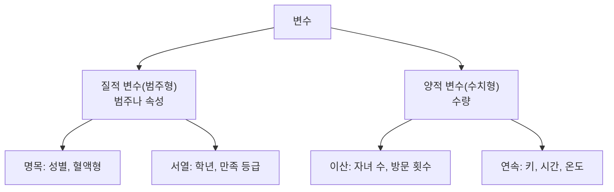
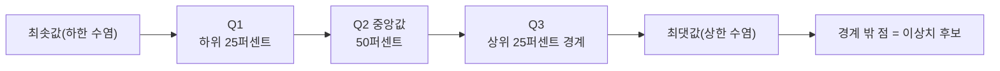

<Callout type="info">
  **이번 문서의 목표:** 요약표나 그래프를 보고 분포의 치우침·산포·이상치·관계를 말로 해석할 수 있고, 어떤 변수 조합에 어떤 그래프를 써야 하는지 고를 수 있게 된다.
</Callout>

## 왜 그래프를 먼저 보는가

데이터를 받으면 곧장 모형을 만들고 싶어집니다. 그런데 그렇게 하면 다음과 같은 일이 벌어집니다. 나이 열에 250이 들어 있는 줄 모르고 평균을 계산하고, 두 변수의 관계가 U자 곡선인데 상관계수가 0에 가깝다는 이유로 "관계가 없다"고 결론 내립니다. 숫자 요약만으로는 보이지 않는 것들이 있기 때문입니다.

> **쉽게 말하면:** EDA는 본격적인 분석 전에 데이터에게 "너는 어떻게 생겼니?"라고 물어보는 과정입니다.

**EDA**(Exploratory Data Analysis, 탐색적 자료 분석)는 데이터가 가지는 특성을 파악하기 위해 데이터를 **탐색·요약·시각화**하는 분석 과정입니다. Exploratory는 "탐험하는"이라는 뜻으로, 결론을 미리 정해 두고 검증하는 것이 아니라 **무엇이 있는지 열어 보는** 태도를 가리킵니다.

## 1. EDA의 목적과 절차

### 목적

<Steps>

1. **데이터의 구조 파악** — 몇 행 몇 열인가, 각 열은 어떤 유형인가
2. **분포 파악** — 값들이 어디에 몰려 있고 얼마나 퍼져 있는가, 어느 쪽으로 치우쳤는가
3. **문제 발견** — 결측(빠진 값)·이상치·중복·불일치가 있는가
4. **관계 발견** — 변수들이 서로 어떻게 움직이는가
5. **다음 단계 결정** — 어떤 전처리가 필요하고 어떤 모형이 적절한가

</Steps>

**왜 이 순서인가:** 구조를 모르면 분포를 볼 수 없고, 분포를 모르면 어떤 값이 이상한지 판단할 기준이 없으며, 문제를 정리하지 않은 채 관계를 보면 이상치 하나가 상관계수를 통째로 왜곡합니다.

### 기술통계는 EDA의 언어

EDA에서 쓰는 숫자 요약을 **기술통계**(descriptive statistics)라고 합니다. 자료의 특성을 특정 수치로 정리·요약해 표현하는 통계학의 갈래입니다(계산법은 02편과 14편).

- **중심경향척도:** 평균, 중앙값, 최빈값
- **산포경향척도:** 범위, 분산, 표준편차, 사분위수 범위(IQR)
- **모양:** 왜도(치우침), 첨도(뾰족함)

## 2. 변수의 종류 — 그래프 선택의 출발점

어떤 그래프를 쓸지는 **변수의 종류**가 결정합니다. 여기서 변수 유형을 잘못 판단하면 그래프 선택도 통째로 틀립니다.

| 구분 | 정의 | 예시 |
|------|------|------|
| 질적 변수 | 범주나 속성을 나타내며 수량화할 수 없는 변수 | 성별, 혈액형, 결제수단 |
| 양적 변수 | 수량으로 표시되는 변수 | 키, 몸무게, 소득 |
| 이산 변수 | 셀 수 있는 값을 가지는 변수 | 자녀 수, 불량 건수 |
| 연속 변수 | 특정 범위 안에서 무한히 많은 값을 가질 수 있는 변수 | 시간, 온도, 길이 |

### 척도 네 가지 — 기출 단골

같은 "숫자"라도 그 숫자가 무엇을 의미하는지에 따라 할 수 있는 계산이 달라집니다. 이것을 **척도**(scale)라고 합니다.

| 척도 | 정의 | 예시 | 순서 | 간격 | 비율 |
|------|------|------|------|------|------|
| 명목척도 | 구분만을 위해 수치를 부여한 것 | 성별, 국적, 혈액형 | X | X | X |
| 서열척도 | 서열은 있으나 간격이 동일하지 않음 | 학년, 호텔 등급, 영화 평점 | O | X | X |
| 등간척도 | 간격이 일정하나 절대적 0이 없음 | 온도(섭씨), IQ, 연도 | O | O | X |
| 비율척도 | 절대적 0이 존재하는 등간척도 | 무게, 키, 수익, 나이 | O | O | O |

**절대적 0이 없다는 말의 뜻:** 섭씨 0도는 "열이 전혀 없음"이 아니라 물이 어는 점이라는 약속입니다. 그래서 "20도는 10도의 두 배로 덥다"는 말은 성립하지 않습니다. 반면 무게 0kg은 정말 아무것도 없음이므로 "20kg은 10kg의 두 배"가 성립합니다. **비율 해석이 가능한가**가 등간과 비율을 가르는 유일한 기준입니다.

**기출 함정:** 브랜드 코드가 1, 2, 3이라고 해서 양적 변수가 아닙니다. 숫자로 적혀 있어도 **구분만을 위한 수치**이면 명목척도입니다. 반면 "배송에 걸린 시간(분)"은 차이와 비율 해석이 모두 가능한 양적 변수입니다.

## 3. 한 변수 보기 — 히스토그램과 상자그림

### 히스토그램

**히스토그램**(histogram)은 연속형 변수의 값 범위를 여러 구간(bin, 빈)으로 나누고, 각 구간에 몇 개의 값이 들어 있는지를 막대 높이로 그린 그래프입니다.

<DataBarChart
  title="배송 시간(분) 히스토그램 — 오른쪽 꼬리가 긴 분포"
  data={[
    { label: '0-20분', value: 42 },
    { label: '20-40분', value: 31 },
    { label: '40-60분', value: 14 },
    { label: '60-80분', value: 7 },
    { label: '80-100분', value: 4 },
    { label: '100분 이상', value: 2 },
  ]}
/>

**읽는 법:** 막대가 왼쪽에 높이 몰려 있고 오른쪽으로 길게 낮은 막대가 이어집니다. 이 모양이 **오른쪽 꼬리가 긴(양의 왜도)** 분포입니다. 이런 자료에서는 소수의 아주 느린 배송 건이 평균을 위로 끌어올리므로, 평균보다 **중앙값**이 "보통의 배송 시간"을 더 잘 대표합니다.

**주의:** 히스토그램은 **구간 폭(bin 너비)에 따라 모양이 달라집니다.** 구간을 너무 넓게 잡으면 봉우리가 뭉개져 하나로 보이고, 너무 좁게 잡으면 들쭉날쭉해서 패턴이 안 보입니다. 같은 데이터로 정반대의 인상을 줄 수 있으므로, 한 폭만 보고 결론을 내리면 안 됩니다.

**막대그래프와 다른 점:** 막대그래프(bar chart)는 **범주형** 변수의 빈도를 그리므로 막대 사이가 떨어져 있고 순서를 바꿔도 됩니다. 히스토그램은 **연속형**의 구간을 그리므로 막대가 붙어 있고 순서를 바꿀 수 없습니다.

### 상자그림

**상자그림**(box plot, 박스플롯)은 다섯 개 숫자로 분포를 요약합니다.

- **상자**: Q1부터 Q3까지. 가운데 50퍼센트가 여기에 들어 있습니다. 상자의 길이가 곧 IQR입니다
- **상자 안 선**: 중앙값(Q2)
- **수염**(whisker): 경계값까지 뻗은 선
- **점**: 경계 밖의 값, 즉 이상치 후보

이상치 경계 계산은 02편에서 다룬 그대로입니다.

$$
\text{하한 경계} = Q_1 - 1.5 \times IQR
$$

$$
\text{상한 경계} = Q_3 + 1.5 \times IQR
$$

**상자그림으로 읽어 내는 것:**

- 중앙값 선이 상자의 가운데가 아니라 아래쪽에 치우쳐 있으면 → 위쪽이 넓다는 뜻이므로 **오른쪽 꼬리** 가능성
- 상자가 짧으면 → 가운데 50퍼센트가 좁게 몰려 있음(산포 작음)
- 점이 위쪽에만 여럿 있으면 → 높은 쪽 극단값이 있음

**히스토그램과 상자그림 중 무엇을 쓰나:** 히스토그램은 **모양(봉우리가 몇 개인지, 어떻게 생겼는지)** 을 보여 주고, 상자그림은 **요약값과 이상치**를 보여 주며 **여러 집단을 나란히 비교**하기 좋습니다. 봉우리가 두 개인 분포는 상자그림으로는 절대 알 수 없다는 점이 상자그림의 한계입니다.

## 4. 두 변수 보기 — 산점도

**산점도**(scatter plot)는 두 수치형 변수를 각각 가로축·세로축에 두고 관측치 하나를 점 하나로 찍은 그래프입니다.

**읽는 법 세 가지:**

- **방향:** 점들이 오른쪽 위로 향하면 양의 관계, 오른쪽 아래로 향하면 음의 관계
- **강도:** 점들이 직선 가까이 모여 있을수록 강한 관계
- **형태:** 직선인가, 곡선인가, 무리가 나뉘어 있는가

**왜 상관계수만 보면 안 되는가:** 상관계수(16편에서 계산)는 **선형 관계의 세기만** 잽니다. 두 변수의 관계가 U자 곡선이면 왼쪽 절반은 음의 관계, 오른쪽 절반은 양의 관계라 서로 상쇄되어 상관계수가 0에 가깝게 나옵니다. 산점도를 보면 명백한 관계가 보이는데도 말입니다. **"상관계수 0 = 관계 없음"이 아니라 "선형 관계 없음"** 이라는 점이 시험 함정으로 자주 나옵니다.

**단변량인가 이변량인가 — 기출 판정 문제:** "다음 중 한 변수만을 이용한 이상치 탐지 방법으로 보기 어려운 것은?"에서 정답은 **산점도**입니다. 상자그림의 IQR 기준, 표준화 점수(z-score)의 절댓값, 단변량 히스토그램은 모두 한 변수만 봅니다. 산점도는 기본적으로 **두 변수의 좌표를 함께** 비교하는 이변량 도구입니다.

## 5. 어떤 그래프를 쓸 것인가 — 선택 규칙

| 보고 싶은 것 | 변수 조합 | 적절한 그래프 |
|--------------|-----------|---------------|
| 한 수치형 변수의 분포 모양 | 수치형 1개 | 히스토그램, 밀도 곡선 |
| 한 수치형 변수의 요약과 이상치 | 수치형 1개 | 상자그림 |
| 한 범주형 변수의 빈도 | 범주형 1개 | 막대그래프 |
| 두 수치형 변수의 관계 | 수치형 2개 | 산점도 |
| 집단별 분포 비교 | 범주형 1개 + 수치형 1개 | 집단별 상자그림 |
| 두 범주형 변수의 교차 빈도 | 범주형 2개 | 교차표, 누적 막대그래프 |
| 시간에 따른 변화 | 시간 + 수치형 | 선 그래프 |
| 여러 변수 간 상관 한눈에 | 수치형 다수 | 상관행렬 히트맵, 산점도 행렬 |

**자주 틀리는 점:** **파이 차트**(원 그래프)는 전체에 대한 구성비를 보여 주지만, 사람은 각도의 크기를 정확히 비교하지 못합니다. 조각이 다섯 개를 넘거나 값이 비슷하면 막대그래프가 언제나 더 낫습니다. 시험에서 "구성비를 정확히 비교해야 할 때 가장 적절한 그래프"를 물으면 파이 차트가 정답이 아닌 경우가 많습니다.

## 6. 시각적 함정 — 4과목으로 이어지는 핵심

같은 데이터로 정반대의 인상을 주는 것이 가능합니다. 4과목(23편)에서 "시각적 왜곡 방지"로 출제되는 내용의 뿌리가 여기입니다.

### 함정 1 — 잘린 축(truncated axis)

세로축을 0에서 시작하지 않고 잘라내면 작은 차이가 거대해 보입니다. 매출이 100에서 103으로 3퍼센트 올랐는데, 세로축을 99부터 104까지로 잡으면 막대 높이가 몇 배 차이로 보입니다.

**원칙:** **막대그래프의 세로축은 0에서 시작해야 합니다.** 막대의 길이가 곧 값을 의미하기 때문입니다. 반면 선 그래프는 변화 추세를 보는 것이 목적이므로 0에서 시작하지 않아도 되지만, 축의 범위를 반드시 표시해야 합니다.

### 함정 2 — 이중 축(dual axis)

한 그림에 세로축을 두 개 두고 서로 다른 단위의 두 계열을 겹쳐 그리면, 축의 범위를 어떻게 잡느냐에 따라 두 선이 "함께 움직인다"고도 "반대로 움직인다"고도 보이게 만들 수 있습니다. 상관을 주장하는 근거로 이중 축 그림을 쓰는 것은 부적절합니다.

### 함정 3 — 면적·부피 왜곡

값이 2배인 것을 표현하려고 원의 **지름**을 2배로 그리면 면적은 4배가 되어 훨씬 큰 차이로 보입니다. 원이나 아이콘의 크기로 값을 나타낼 때는 **면적을 값에 비례**시켜야 합니다.

### 함정 4 — 색상과 순서

- 순서가 있는 값(낮음→높음)에는 **한 색상의 밝기 단계**(순차형 팔레트)를 씁니다
- 순서가 없는 범주에는 **서로 다른 색상**(범주형 팔레트)을 씁니다
- 무지개 색상 배열은 밝기 순서가 직관과 어긋나 값의 크기 비교를 방해합니다
- 빨강·초록만으로 구분하면 색각 이상 사용자가 읽을 수 없습니다

### 함정 5 — 상관과 인과의 혼동

산점도에서 두 변수가 함께 움직인다고 해서 하나가 다른 하나의 원인이라는 뜻은 아닙니다. 아이스크림 판매량과 익사 사고 건수는 강한 양의 상관을 보이지만, 둘 다 **기온**이라는 제3의 변수 때문에 함께 오르는 것입니다. 이런 숨은 변수를 **교란변수**(confounding variable)라고 합니다.

> **쉽게 말하면:** 함께 움직인다(상관)와 하나가 다른 하나를 움직인다(인과)는 완전히 다른 주장입니다.

## 7. 요약표만 보고 해석하기 — 기출 유형 연습

기출은 그림 대신 **요약표**를 주고 해석을 고르게 하는 경우가 많습니다. 다음 표를 함께 읽어 봅시다.

| 요약 항목 | 값 |
|-----------|-----|
| 관측 수 | 120 |
| 결측 수 | 0 |
| 평균 | 54 |
| 중앙값 | 49 |
| 최소 | 12 |
| 제3사분위수 | 65 |
| 최대 | 98 |

**단계별 판정:**

<Steps>

1. **결측 판정:** 결측 수가 0이므로 "결측값이 있어 대체가 필요하다"는 해석은 틀립니다
2. **치우침 판정:** 평균 54가 중앙값 49보다 큽니다. 높은 쪽으로 꼬리가 있을 **가능성**을 의심할 수 있습니다
3. **이상치 판정:** 최댓값 98이 크지만, Q1이 주어지지 않아 IQR을 계산할 수 없으므로 **이상치라고 확정할 수 없습니다**
4. **유형 판정:** 평균·중앙값·사분위수를 계산했다는 것 자체가 이 변수가 수치형임을 뜻하므로 "명목형 변수임이 확정된다"는 해석은 틀립니다

</Steps>

**해석:** 정답은 2번 판정입니다. 이 유형에서 오답은 대부분 **"가능성"을 "확정"으로 바꾸거나**, **표에 없는 정보를 있다고 가정**해서 만들어집니다. 요약표 문제를 만나면 "이 보기가 주장하는 것을 이 표만으로 정말 알 수 있는가"를 매번 되물으세요.

## 핵심 정리

- EDA는 데이터를 탐색·요약·시각화해 구조·분포·문제·관계를 파악하는 과정이며, 전처리와 모델링의 방향을 결정한다.
- 척도는 명목(구분) → 서열(순서) → 등간(간격, 절대 0 없음) → 비율(절대 0 있음) 순으로 정보량이 늘어난다. 숫자로 적혀 있어도 구분용이면 명목이다.
- 히스토그램은 분포 모양, 상자그림은 요약값과 이상치, 산점도는 두 변수의 관계를 본다. **산점도는 이변량 도구**라 단변량 이상치 탐지 방법이 아니다.
- 상자그림의 이상치 경계는 $Q_1 - 1.5 \times IQR$ 과 $Q_3 + 1.5 \times IQR$ 이며 1.5는 관례적 배수다.
- 시각적 함정은 잘린 축, 이중 축, 면적 왜곡, 색상 선택, 상관과 인과의 혼동이다. **막대그래프의 축은 0에서 시작**해야 한다.
- 요약표 해석 문제는 "가능성"과 "확정"을 구분하고, 표에 없는 정보를 가정하지 않는 것이 관건이다.

## 마무리 복습

<Quiz
  questionNumber={1}
  question="다음 중 한 변수만을 이용한 이상치 탐지 방법으로 보기 어려운 것은?"
  options={['상자그림의 IQR 기준', '표준화 점수의 절댓값', '두 변수의 좌표를 함께 그린 산점도', '단변량 히스토그램']}
  correctAnswer={3}
  explanation="산점도는 두 변수를 각각 축에 두고 관계를 보는 이변량 도구이므로 단변량 이상치 탐지 방법으로 보기 어렵다. IQR 기준, 표준화 점수, 히스토그램은 모두 한 변수의 분포만으로 판단한다."
  optionExplanations={['상자그림은 한 변수의 사분위수만으로 이상치를 판정하는 단변량 도구다.', '표준화 점수는 한 변수의 평균과 표준편차만 사용하는 단변량 방법이다.', '두 변수의 좌표를 함께 비교하므로 이변량 도구이며 정답이다.', '히스토그램은 한 변수의 구간별 빈도를 그리는 단변량 도구다.']}
/>

<Quiz
  questionNumber={2}
  question="관측 수 120, 결측 수 0, 평균 54, 중앙값 49, 최소 12, 제3사분위수 65, 최대 98인 요약표만으로 가장 타당한 해석은?"
  options={['결측값이 존재하므로 대체가 필요하다', '최댓값 98은 반드시 이상치다', '평균이 중앙값보다 커 오른쪽 꼬리 가능성을 의심할 수 있다', '해당 변수는 명목형 변수임이 확정된다']}
  correctAnswer={3}
  explanation="평균이 중앙값보다 큰 패턴은 높은 값 쪽 꼬리 가능성을 시사한다. 결측 수는 0이고, Q1이 없어 IQR 기준 이상치 판정은 불가능하며, 평균과 사분위수를 계산했다는 것은 수치형 변수임을 뜻한다."
  optionExplanations={['결측 수가 0이므로 대체가 필요하다는 주장은 표와 모순된다.', 'Q1이 주어지지 않아 IQR 경계를 계산할 수 없으므로 이상치로 확정할 수 없다.', '평균이 중앙값보다 크면 오른쪽 꼬리를 의심할 수 있으므로 타당하다.', '평균과 사분위수를 계산한 변수이므로 수치형이며 명목형일 수 없다.']}
/>

<Quiz
  questionNumber={3}
  question="다음 중 측정값 자체가 양적 변수인 것은?"
  options={['고객이 선택한 결제수단', '배송에 걸린 시간(분)', '상품 만족 등급(불만·보통·만족)', '선호 브랜드 코드']}
  correctAnswer={2}
  explanation="시간은 차이와 비율 해석이 모두 가능한 비율척도의 양적 변수다. 결제수단과 브랜드 코드는 구분만을 위한 명목척도이고, 만족 등급은 순서는 있으나 간격이 동일하지 않은 서열척도다."
  optionExplanations={['결제수단은 구분을 위한 범주이므로 명목척도다.', '시간은 차이와 비율 해석이 가능한 양적 변수가 맞다.', '만족 등급은 순서만 있고 간격이 일정하지 않은 서열척도다.', '숫자로 적혀 있어도 구분용 코드이므로 명목척도다.']}
/>

<Quiz
  questionNumber={4}
  question="시각화 시 유의점에 대한 설명으로 옳지 않은 것은?"
  options={['막대그래프의 세로축은 0에서 시작하는 것이 원칙이다', '값이 두 배임을 원으로 표현할 때는 면적을 값에 비례시킨다', '순서가 있는 값에는 한 색상의 밝기 단계를 사용한다', '이중 축 그래프는 두 변수의 인과관계를 입증하는 근거로 적절하다']}
  correctAnswer={4}
  explanation="이중 축은 각 축의 범위를 어떻게 잡느냐에 따라 두 계열이 같이 움직이는 것처럼도 반대로 움직이는 것처럼도 보이게 만들 수 있어 인과의 근거가 될 수 없다. 나머지 세 설명은 왜곡을 막는 올바른 원칙이다."
  optionExplanations={['막대 길이가 값을 의미하므로 0에서 시작해야 한다는 것은 옳은 원칙이다.', '지름을 두 배로 하면 면적이 네 배가 되므로 면적을 비례시켜야 한다는 설명은 옳다.', '순서가 있는 값에 순차형 팔레트를 쓰는 것은 옳은 원칙이다.', '이중 축은 축 범위 조작으로 인상이 달라지므로 인과의 근거가 될 수 없다.']}
/>

<Quiz
  questionNumber={5}
  question="두 수치형 변수의 산점도가 뚜렷한 U자 형태를 보이는데 피어슨 상관계수는 0에 가깝게 계산되었다. 가장 적절한 해석은?"
  options={['두 변수는 아무 관계가 없다', '계산에 오류가 있으므로 다시 계산해야 한다', '선형 관계가 약할 뿐이며 비선형 관계는 존재할 수 있다', '한 변수가 다른 변수의 원인임이 확인되었다']}
  correctAnswer={3}
  explanation="피어슨 상관계수는 선형 관계의 세기만 측정하므로, U자처럼 방향이 바뀌는 관계에서는 양쪽이 상쇄되어 0에 가까워진다. 상관계수가 0이라는 것은 관계가 없다는 뜻이 아니라 선형 관계가 약하다는 뜻이다."
  optionExplanations={['산점도에 뚜렷한 형태가 보이므로 관계가 없다는 결론은 틀렸다.', '계산 오류가 아니라 지표의 성질에서 비롯된 정상적인 결과다.', '피어슨 상관계수는 선형성만 측정하므로 비선형 관계는 별도로 존재할 수 있다.', '상관은 인과의 근거가 되지 못하며 산점도만으로 인과를 말할 수 없다.']}
/>

<Quiz
  questionNumber={6}
  question="히스토그램에 대한 설명으로 옳지 않은 것은?"
  options={['연속형 변수의 구간별 빈도를 막대 높이로 표현한다', '구간 폭을 어떻게 정하느냐에 따라 분포의 인상이 달라질 수 있다', '막대의 순서를 임의로 바꿔도 해석에 문제가 없다', '봉우리가 여러 개인 분포를 발견하는 데 유용하다']}
  correctAnswer={3}
  explanation="히스토그램의 가로축은 값의 크기 순서를 나타내는 연속적인 구간이므로 막대 순서를 바꿀 수 없다. 순서를 바꿔도 되는 것은 범주형 자료를 그리는 막대그래프다. 나머지 세 설명은 모두 옳다."
  optionExplanations={['연속형 변수의 구간별 빈도 표현은 히스토그램의 정의이므로 옳다.', '구간 폭에 따라 모양이 달라지는 것은 히스토그램의 알려진 특성이다.', '가로축이 값의 순서를 나타내므로 순서를 바꾸면 안 되며 이 설명이 틀렸다.', '히스토그램은 상자그림이 보여주지 못하는 다봉 분포를 드러낸다.']}
/>

<Quiz
  questionNumber={7}
  question="척도에 대한 설명으로 옳은 것은?"
  options={['섭씨 온도는 절대적 0이 있으므로 비율척도다', '호텔 등급은 간격이 일정하므로 등간척도다', '나이는 절대적 0이 존재하므로 비율척도다', '혈액형은 A형을 1로 표기하면 서열척도가 된다']}
  correctAnswer={3}
  explanation="나이는 0이 실제로 없음을 의미하므로 비율 해석이 가능한 비율척도다. 섭씨 0도는 약속된 기준점이라 등간척도이고, 호텔 등급은 등급 간 간격이 일정하지 않은 서열척도이며, 혈액형은 숫자를 붙여도 구분용이므로 명목척도다."
  optionExplanations={['섭씨 0도는 열이 없음이 아니라 물의 어는 점이므로 등간척도다.', '호텔 등급은 등급 간 차이가 동일하다고 볼 수 없어 서열척도다.', '나이 0은 실제 없음을 뜻하므로 비율 해석이 가능한 비율척도가 맞다.', '숫자를 붙여도 순서 의미가 없으므로 명목척도에 머문다.']}
/>

## 참고 자료

- [코리아IT아카데미 - 빅데이터 분석기사](https://www.koreaisacademy.com/2025/cer/datascience/bigdata.asp)
- [Inflearn 가이드 - 빅데이터분석기사 어떻게 준비해야 할까?](https://www.inflearn.com/pages/bigdata-analysis-engineer-guide)
- [YDDaily - 빅데이터 분석기사 완벽 가이드](https://yddaily.com/%EB%B9%85-%EB%8D%B0%EC%9D%B4%ED%84%B0-%EB%B6%84%EC%84%9D-%EA%B8%B0%EC%82%AC/)
