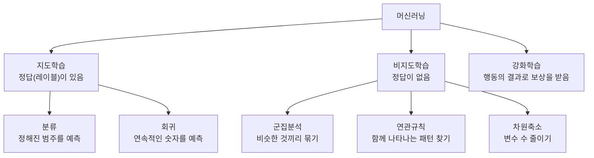
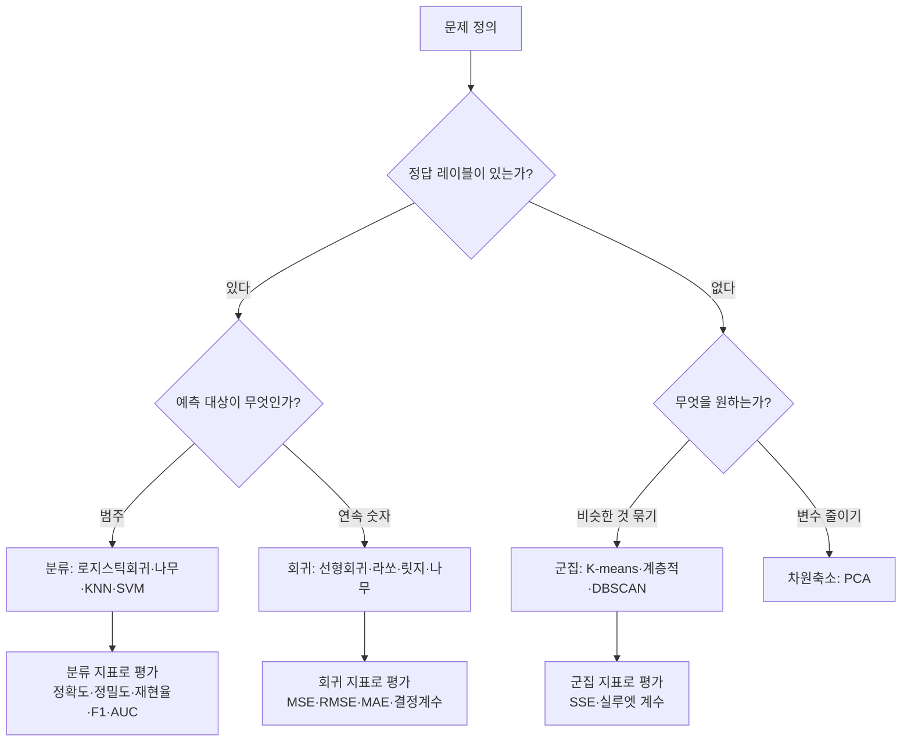

<Callout type="info">
  **이번 문서의 목표:** 어떤 문제 상황을 읽고 그것이 분류인지 회귀인지 군집인지 즉시 판정할 수 있고, 모델·알고리즘·파라미터·하이퍼파라미터라는 네 단어를 정확히 구분해 쓸 수 있게 된다.
</Callout>

## 왜 개념 지도가 먼저 필요한가

3과목과 4과목은 알고리즘 이름이 쏟아집니다. 로지스틱 회귀, 의사결정나무, 랜덤포레스트, KNN, SVM, K-means, DBSCAN, PCA. 이 이름들을 아무 뼈대 없이 외우면 시험장에서 "이 문제는 회귀인데 왜 정확도가 안 되지?" 같은 함정에 그대로 걸립니다.

기출은 알고리즘의 내부 수식을 묻지 않습니다. 대신 이렇게 묻습니다.

- "다음 중 분류 문제에 해당하는 것은?"
- "모델과 평가 지표의 연결로 옳지 않은 것은?"

두 문제 모두 **문제 유형을 판정하는 능력**만 있으면 풀립니다. 이 편은 그 판정 기준을 만듭니다.

> **쉽게 말하면:** 이 편은 알고리즘 백과사전이 아니라, 알고리즘들을 꽂아 넣을 **서랍장**을 짜는 편입니다.

## 1. 가장 큰 갈래 — 정답이 있는가

머신러닝(machine learning, 기계학습)을 나누는 첫 번째 기준은 **학습 데이터에 정답이 붙어 있는가**입니다.

| 학습 방식 | 정의 | 대표 과제 |
|-----------|------|-----------|
| 지도학습(supervised learning) | 문제와 답의 쌍으로 구성된 데이터로 학습 | 분류, 회귀 |
| 비지도학습(unsupervised learning) | 정답에 대한 명확한 기준이 없고 유사성으로 학습 | 군집, 연관규칙, 차원축소 |
| 강화학습(reinforcement learning) | 연속된 행동으로 결과가 나오면 그 결과로 각 행동을 평가하고 학습 | 게임 플레이, 로봇 제어 |

**생활 비유:**

- **지도학습**은 정답지가 딸린 문제집입니다. 풀고 나서 답을 맞춰 보며 틀린 방식을 고칩니다
- **비지도학습**은 정답지 없이 카드 뭉치를 받아 "비슷한 것끼리 모아 보라"는 과제를 받은 상황입니다. 정답이 없으므로 "잘 묶었는가"의 판단도 다른 기준(19편, 21편)이 필요합니다
- **강화학습**은 바둑을 두는 상황입니다. 한 수 한 수에 대한 정답은 없고, 판이 끝난 뒤 이겼는지 졌는지로 이전 수들을 평가합니다

## 2. 지도학습 안의 갈래 — 분류와 회귀

> **쉽게 말하면:** **예측하려는 값이 범주면 분류, 숫자면 회귀**입니다.

| 구분 | 예측 대상 | 답의 형태 | 예시 |
|------|-----------|-----------|------|
| 분류(classification) | 정해진 범주(카테고리) | 유한한 후보 중 하나, 그리고 각 범주의 확률 | 스팸 여부, 암 진단, 대출 승인·거절 |
| 회귀(regression) | 연속적인 숫자 값 | 실수 하나 | 집값, 내일 기온, 다음 달 매출 |

### 판정 연습 — 기출 그대로

다음 넷 중 분류 문제는 무엇일까요?

| 상황 | 예측 대상 | 판정 |
|------|-----------|------|
| 다음 달 전력 사용량(kWh) 예측 | 연속 숫자 | 회귀 |
| 대출 신청의 승인·거절 예측 | 두 범주 중 하나 | **분류** |
| 주택의 거래가격 예측 | 연속 숫자 | 회귀 |
| 배송 소요시간(분) 예측 | 연속 숫자 | 회귀 |

**판정 요령:** "답을 적어 보라고 하면 무엇을 쓰게 되는가"를 상상하세요. **숫자를 쓰게 되면 회귀**, **단어나 이름표를 쓰게 되면 분류**입니다.

### 헷갈리는 경계 세 가지

**① 범주가 숫자로 표시되는 경우**
별점 예측(1~5점)은 회귀일까요 분류일까요? 별점을 "1보다 2가 크다"는 연속적 크기로 다루면 회귀이고, "1점 그룹·2점 그룹"처럼 서로 구분되는 다섯 개의 이름표로 다루면 분류입니다. **숫자로 적혀 있는지가 아니라 그 숫자를 크기로 쓰는지가 기준**입니다.

**② 확률을 예측하는 경우**
"이 고객이 이탈할 확률"은 0과 1 사이의 연속 숫자입니다. 하지만 목적이 "이탈한다/안 한다"를 맞히는 것이라면 이것은 분류이고, 확률은 그 분류를 위한 중간 산출물입니다. 로지스틱 회귀(logistic regression)가 이름에 "회귀"가 들어 있는데도 **분류 알고리즘으로 분류되는 이유**가 여기 있습니다.

**③ 이름에 속지 않기**
로지스틱 회귀는 분류, 회귀나무(regression tree)는 회귀, 의사결정나무는 둘 다 가능합니다. **알고리즘 이름이 아니라 예측 대상의 형태**로 판정하세요.

### 문제 유형이 평가지표를 결정한다

기출은 "모델과 평가 지표의 연결로 옳지 않은 것은?"으로 이 개념을 묻습니다.

| 문제 유형 | 쓸 수 있는 지표 | 쓸 수 없는 지표 |
|-----------|-----------------|-----------------|
| 회귀 | MSE, RMSE, MAE, 결정계수 | 정확도, 정밀도, 재현율, F1 |
| 분류 | 정확도, 정밀도, 재현율, F1, AUC | MSE, RMSE, MAE |

**왜 그런가:** 정확도(accuracy)는 "예측 범주가 실제 범주와 일치한 비율"입니다. 배송 시간을 32.4분으로 예측했는데 실제가 32.5분이라면, 범주 일치 여부로는 "틀림"이 되어 **1분 차이와 100분 차이를 구분하지 못합니다.** 반대로 MSE(평균제곱오차)는 두 범주 사이의 "거리"를 요구하는데, 스팸과 정상 사이의 거리는 정의되지 않습니다.

**해석:** 그래서 "배송시간 회귀 – 정확도(accuracy)"라는 연결은 언제나 틀린 보기입니다. 지표 계산은 20편·21편에서 다루지만, **연결 판정만으로도 한 문제**를 벌 수 있습니다.

## 3. 비지도학습 안의 갈래

### 군집분석

**군집분석**(clustering)은 정답 없이 비슷한 데이터끼리 자동으로 묶는 방법입니다. "비슷하다"의 기준은 **거리**(distance)이며, 거리 계산은 19편에서 손계산으로 다룹니다.

**분류와 군집의 결정적 차이:** 둘 다 데이터를 그룹으로 나누는 것처럼 보이지만,

- **분류**는 그룹의 이름표가 **미리 정해져 있고**, 데이터에 그 이름표가 붙어 있습니다. 학습 후 새 데이터에 기존 이름표 중 하나를 붙입니다
- **군집**은 이름표가 **없고**, 알고리즘이 나눈 뒤 사람이 "1번 군집은 고가·저빈도 고객이구나"라고 해석해 이름을 붙입니다

> **쉽게 말하면:** 분류는 이미 있는 상자에 물건을 넣는 일이고, 군집은 상자부터 새로 만드는 일입니다.

### 연관규칙

**연관규칙**(association rule)은 함께 나타나는 패턴을 찾는 기법입니다. "기저귀를 사는 사람은 맥주도 함께 산다" 같은 규칙을 발견해 마트 진열이나 추천에 씁니다.

### 차원축소

**차원축소**(dimensionality reduction)는 모든 변수를 고려하면서 데이터의 차원(변수의 개수)을 줄이는 방법입니다. 대표 기법이 **주성분분석**(PCA, Principal Component Analysis)이며, 데이터의 분산을 가장 많이 설명하는 축을 찾아 그 축들로 데이터를 다시 표현합니다(19편에서 상세히 다룹니다).

## 4. 용어 정리 — 데이터 한 표의 각 부분을 뭐라 부르는가

아래는 이탈 예측을 위한 작은 학습 데이터입니다.

| 고객ID | 가입개월 | 월평균결제 | 최근접속일수 | 이탈여부 |
|--------|----------|------------|--------------|----------|
| C001 | 24 | 39000 | 2 | 유지 |
| C002 | 3 | 12000 | 41 | 이탈 |
| C003 | 18 | 55000 | 1 | 유지 |
| C004 | 5 | 9000 | 33 | 이탈 |
| C005 | 30 | 61000 | 4 | 유지 |

이 표를 부르는 이름들을 정리합니다.

| 용어 | 영어 | 이 표에서 무엇인가 |
|------|------|--------------------|
| 관측치·샘플 | instance, sample | 한 행. 고객 한 명 |
| 특징량·독립변수·설명변수 | feature, independent variable | 가입개월, 월평균결제, 최근접속일수 |
| 타깃·종속변수·반응변수 | target, dependent variable | 이탈여부 |
| 레이블 | label | 각 행에 붙은 정답 값. 예를 들어 C002의 "이탈" |
| 클래스 | class | 레이블이 가질 수 있는 후보 범주. 여기서는 유지·이탈 두 개 |
| 차원 | dimension | 특징량의 개수. 여기서는 3 |

**독립변수와 종속변수의 뜻:** 독립변수는 결과의 **원인이 되는** 변수이고, 종속변수는 독립변수의 영향을 받아 **변화하는** 변수입니다. 종속(從屬)이라는 말이 "따라 붙는다"는 뜻이라는 점을 생각하면 방향을 기억하기 쉽습니다.

**클래스 개수에 따른 이름:**

- 클래스가 2개면 **이진 분류**(binary classification). 예: 스팸 여부
- 클래스가 3개 이상이면 **다중 분류**(multiclass classification). 예: 동물 종류 판별

## 5. 모델·알고리즘·파라미터·하이퍼파라미터

네 단어는 시험에서 자주 섞여 나오고, 실제로 많은 수험생이 구분하지 못합니다.

| 용어 | 정의 | 비유 |
|------|------|------|
| 알고리즘(algorithm) | 데이터로부터 규칙을 찾아내는 **절차·방법** | 요리 레시피 |
| 모델(model) | 알고리즘이 특정 데이터로 학습을 마친 **결과물** | 그 레시피로 실제로 만든 요리 |
| 파라미터(parameter, 모수·계수) | 학습 과정에서 **데이터로부터 결정되는** 값 | 반죽하며 저절로 정해진 농도 |
| 하이퍼파라미터(hyperparameter) | 학습 전에 **사람이 지정하는** 설정값 | 오븐 온도, 굽는 시간 |

**구체적으로 보면:** 선형회귀에서 $y = a + bx$ 라는 식의 절편 $a$ 와 기울기 $b$ 는 데이터가 결정하므로 **파라미터**입니다. 반면 KNN에서 "이웃 몇 개를 볼 것인가"의 $k$, 의사결정나무의 "최대 깊이", K-means의 "군집 개수 K"는 사람이 먼저 정해야 하므로 **하이퍼파라미터**입니다.

> **쉽게 말하면:** **데이터가 정하면 파라미터, 사람이 정하면 하이퍼파라미터**입니다.

**하이퍼파라미터는 어디서 정하는가:** 학습 데이터로 정하면 안 됩니다. 학습 데이터에 가장 잘 맞는 설정을 고르면 과적합(21편)으로 가기 때문입니다. 그래서 **검증 데이터**(validation data)를 따로 두고 거기서 성능을 비교해 고릅니다(17편의 데이터 분할).

## 6. 대표 알고리즘 서랍장 — 어디에 꽂히는가

18편·19편에서 각 알고리즘의 원리를 다루므로, 여기서는 **어느 서랍에 들어가는지**만 잡습니다.

| 알고리즘 | 회귀 | 분류 | 군집 | 비고 |
|----------|------|------|------|------|
| 선형회귀 | O | X | X | 가장 기본 회귀 |
| 라쏘·릿지·엘라스틱넷 | O | X | X | 규제가 붙은 선형회귀 |
| 로지스틱 회귀 | X | O | X | 이름과 달리 분류 |
| 나이브베이즈 | X | O | X | 확률 기반 분류 |
| 의사결정나무 | O | O | X | 둘 다 가능 |
| 랜덤포레스트 | O | O | X | 나무 여러 개의 앙상블 |
| KNN | O | O | X | 이웃을 보고 결정 |
| SVM | O | O | X | 경계를 최대한 넓게 |
| 그라디언트 부스팅 계열 | O | O | X | XGBoost, LightGBM, CatBoost |
| K-means | X | X | O | 대표적 군집 |
| 계층적 군집 | X | X | O | 덴드로그램 |
| DBSCAN | X | X | O | 밀도 기반 군집 |
| PCA | X | X | X | 차원축소 |

**시험 포인트:** 이 표에서 가장 자주 출제되는 것은 **"둘 다 가능한" 알고리즘 목록**입니다. 의사결정나무, SVM, KNN, 랜덤포레스트, 부스팅 계열은 분류와 회귀 모두에 쓸 수 있고, **로지스틱 회귀와 나이브베이즈는 분류 전용**, **선형회귀와 라쏘·릿지는 회귀 전용**이라는 점을 구분해 외웁니다.

## 7. 전체 흐름 다시 보기

지금까지의 개념을 하나의 흐름으로 잇습니다. 이 흐름이 17편부터 21편까지의 목차 자체이기도 합니다.

**자주 틀리는 점 세 가지 정리:**

- **이름으로 판정하지 않기** — 로지스틱 "회귀"는 분류입니다
- **지표를 문제 유형과 어긋나게 쓰지 않기** — 회귀에 정확도, 분류에 RMSE는 언제나 오답 보기입니다
- **분류와 군집을 섞지 않기** — 레이블이 데이터에 있으면 분류, 없으면 군집입니다. "고객을 그룹으로 나눈다"는 표현만으로는 둘 중 어느 쪽인지 알 수 없고, **레이블 유무**를 봐야 합니다

## 핵심 정리

- 머신러닝은 **정답 레이블 유무**로 지도학습·비지도학습으로 나뉘고, 결과로 행동을 평가하는 강화학습이 별도로 있다.
- 지도학습은 예측 대상이 **범주면 분류, 연속 숫자면 회귀**다. 알고리즘 이름이 아니라 예측 대상의 형태로 판정한다.
- 비지도학습에는 군집(비슷한 것 묶기), 연관규칙(함께 나타나는 패턴), 차원축소(변수 줄이기)가 있다.
- 분류에는 정확도·정밀도·재현율·F1·AUC, 회귀에는 MSE·RMSE·MAE·결정계수를 쓴다. **회귀에 정확도를 붙이는 연결은 항상 오답**이다.
- **데이터가 정하면 파라미터, 사람이 학습 전에 정하면 하이퍼파라미터**이며 하이퍼파라미터는 검증 데이터로 고른다.
- 의사결정나무·랜덤포레스트·KNN·SVM·부스팅은 분류와 회귀 모두 가능하고, 로지스틱회귀·나이브베이즈는 분류 전용, 선형회귀·라쏘·릿지는 회귀 전용이다.

## 마무리 복습

<Quiz
  questionNumber={1}
  question="다음 중 분류 문제에 해당하는 것은?"
  options={['다음 달 전력 사용량(kWh) 예측', '대출 신청의 승인·거절 예측', '주택의 거래가격 예측', '배송 소요시간(분) 예측']}
  correctAnswer={2}
  explanation="승인과 거절은 유한한 범주 중 하나를 고르는 것이므로 분류다. 전력 사용량, 거래가격, 소요시간은 모두 연속적인 숫자를 예측하므로 회귀 문제에 해당한다."
  optionExplanations={['kWh는 연속적인 수치이므로 회귀 문제다.', '승인과 거절이라는 두 범주 중 하나를 예측하므로 분류가 맞다.', '가격은 연속적인 수치이므로 회귀 문제다.', '소요시간은 연속적인 수치이므로 회귀 문제다.']}
/>

<Quiz
  questionNumber={2}
  question="모델과 평가 지표의 연결로 옳지 않은 것은?"
  options={['연속 매출액 예측 — RMSE', '주택가격 예측 — MAE', '배송시간 회귀 — 정확도(accuracy)', '불량 여부 분류 — F1 점수']}
  correctAnswer={3}
  explanation="정확도는 예측 범주가 실제 범주와 일치한 비율이므로 연속값의 오차 크기를 평가할 수 없다. 배송시간처럼 연속값을 예측하는 회귀에는 RMSE, MAE, 결정계수 같은 오차 기반 지표를 써야 한다."
  optionExplanations={['연속값 회귀에 RMSE를 쓰는 것은 적절한 연결이다.', '주택가격 회귀에 MAE를 쓰는 것은 적절한 연결이다.', '회귀 문제에 범주 일치 비율인 정확도를 붙였으므로 잘못된 연결이다.', '불량 여부는 이진 분류이므로 F1 점수가 적절하다.']}
/>

<Quiz
  questionNumber={3}
  question="하이퍼파라미터에 해당하는 것으로 가장 적절한 것은?"
  options={['선형회귀에서 학습으로 구해진 기울기 계수', 'KNN에서 사람이 미리 정하는 이웃의 개수 k', '학습 데이터에서 계산된 각 변수의 평균값', '모델이 예측한 출력값']}
  correctAnswer={2}
  explanation="하이퍼파라미터는 학습 전에 사람이 지정하는 설정값이며 KNN의 k, 나무의 최대 깊이, K-means의 군집 수가 대표적이다. 회귀계수처럼 데이터로부터 학습되는 값은 파라미터다."
  optionExplanations={['회귀계수는 데이터로부터 학습되는 값이므로 파라미터다.', '이웃 개수 k는 학습 전에 사람이 정하는 값이므로 하이퍼파라미터가 맞다.', '변수 평균은 데이터에서 계산되는 값이며 사람이 정하는 설정이 아니다.', '예측 출력은 모델의 결과이지 설정값이 아니다.']}
/>

<Quiz
  questionNumber={4}
  question="분류와 군집분석의 차이에 대한 설명으로 옳은 것은?"
  options={['분류는 정답 레이블이 있는 지도학습, 군집은 레이블이 없는 비지도학습이다', '분류는 비지도학습, 군집은 지도학습이다', '둘 다 정답 레이블을 사용하지만 알고리즘만 다르다', '군집은 항상 두 개의 그룹만 만들 수 있다']}
  correctAnswer={1}
  explanation="분류는 미리 정해진 레이블이 데이터에 붙어 있는 지도학습이고, 군집은 레이블 없이 유사성만으로 묶는 비지도학습이다. 군집의 개수는 상황에 따라 정하며 두 개로 제한되지 않는다."
  optionExplanations={['레이블 유무로 지도와 비지도를 구분한 설명이 정확하다.', '두 방식의 학습 유형을 서로 뒤바꿔 설명했다.', '군집은 레이블을 사용하지 않으므로 틀린 설명이다.', '군집 수는 데이터와 목적에 따라 정하며 두 개로 제한되지 않는다.']}
/>

<Quiz
  questionNumber={5}
  question="로지스틱 회귀에 대한 설명으로 옳은 것은?"
  options={['이름에 회귀가 들어가므로 연속값 예측 전용 알고리즘이다', '범주에 속할 확률을 추정해 분류에 사용하는 알고리즘이다', '레이블 없이 유사성만으로 데이터를 묶는 알고리즘이다', '변수의 개수를 줄이는 차원축소 알고리즘이다']}
  correctAnswer={2}
  explanation="로지스틱 회귀는 각 범주에 속할 확률을 추정한 뒤 기준값으로 범주를 결정하는 분류 알고리즘이다. 이름에 회귀가 들어 있지만 예측 대상이 범주이므로 분류로 분류된다."
  optionExplanations={['이름과 달리 연속값 예측이 아니라 범주 예측에 사용한다.', '확률 추정을 통해 범주를 결정하므로 분류 알고리즘이 맞다.', '레이블을 사용하는 지도학습이므로 군집이 아니다.', '차원축소는 PCA 등이 담당하며 로지스틱 회귀의 역할이 아니다.']}
/>

<Quiz
  questionNumber={6}
  question="학습 방식에 따른 인공지능 구분으로 옳지 않은 것은?"
  options={['지도학습은 문제와 답의 쌍으로 구성된 데이터로 학습한다', '비지도학습은 명확한 정답 기준 없이 유사성으로 학습한다', '강화학습은 연속된 행동의 결과로 각 행동을 평가하며 학습한다', '비지도학습은 각 데이터에 정답 레이블이 반드시 부여되어야 한다']}
  correctAnswer={4}
  explanation="비지도학습은 정답 레이블이 없는 상태에서 데이터의 구조나 유사성을 찾는 방식이므로 레이블 부여가 필수라는 설명은 정의와 정면으로 어긋난다. 나머지 세 설명은 각 학습 방식의 정의 그대로다."
  optionExplanations={['문제와 답의 쌍으로 학습하는 것은 지도학습의 정의이므로 옳다.', '유사성으로 학습하는 것은 비지도학습의 정의이므로 옳다.', '결과로 이전 행동들을 평가하는 것은 강화학습의 정의이므로 옳다.', '비지도학습은 레이블이 없는 것이 전제이므로 이 설명이 틀렸다.']}
/>

<Quiz
  questionNumber={7}
  question="다음 데이터 표에서 용어 대응으로 옳지 않은 것은? (열: 고객ID, 가입개월, 월평균결제, 이탈여부)"
  options={['가입개월은 독립변수에 해당한다', '이탈여부는 종속변수에 해당한다', '한 행은 관측치 하나에 해당한다', '이탈여부는 특징량에 해당하므로 모델의 입력으로 사용한다']}
  correctAnswer={4}
  explanation="이탈여부는 예측하려는 대상이므로 타깃이자 종속변수이며 모델의 입력이 아니라 출력이다. 이를 입력 특징량으로 쓰면 정답을 그대로 보고 예측하는 셈이 되어 평가가 무의미해진다."
  optionExplanations={['가입개월은 예측에 사용하는 입력 변수이므로 독립변수가 맞다.', '이탈여부는 예측 대상이므로 종속변수가 맞다.', '데이터 표의 한 행은 관측치 하나이므로 옳다.', '이탈여부는 타깃이므로 입력 특징량으로 사용하면 안 되며 이 설명이 틀렸다.']}
/>

## 참고 자료

- [코리아IT아카데미 - 빅데이터 분석기사](https://www.koreaisacademy.com/2025/cer/datascience/bigdata.asp)
- [Inflearn 가이드 - 빅데이터분석기사 어떻게 준비해야 할까?](https://www.inflearn.com/pages/bigdata-analysis-engineer-guide)
- [Statistics Playbook - 빅데이터분석기사 완전 가이드](https://statisticsplaybook.com/big-data-analysis-engineer-guide/)
