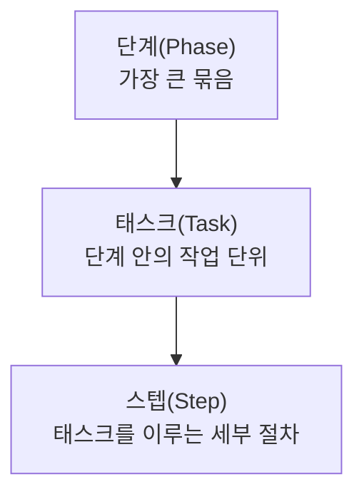
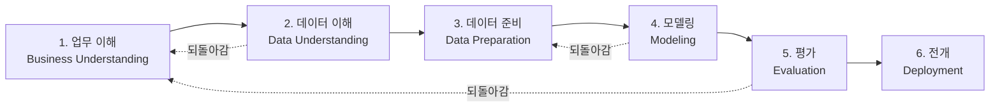

<Callout type="info">
  **이번 문서의 목표:** CRISP-DM의 단계 순서를 정확히 답하고, KDD·SEMMA와 단계별로 대응시킬 수 있으며, 어떤 활동이 기획 단계의 일이고 어떤 활동이 아닌지를 사례로 판정할 수 있게 된다.
</Callout>

## 왜 방법론을 배우는가

분석 프로젝트가 실패하는 가장 흔한 이유는 기술 부족이 아니라 **순서를 건너뛴 것**입니다. 데이터를 받자마자 모형부터 돌리면, 몇 주 뒤에 "그래서 이걸로 무슨 결정을 하죠?"라는 질문 앞에서 프로젝트가 멈춥니다. 무엇을 왜 하는지 정하지 않았기 때문입니다.

**방법론**(methodology)은 이런 실패를 막기 위해 **분석 프로젝트가 거쳐야 할 단계를 표준화한 절차**입니다. 시험은 이 절차의 **이름과 순서**, 그리고 **각 단계에서 하는 일**을 묻습니다.

> **쉽게 말하면:** 방법론은 요리로 치면 "재료를 씻고 → 손질하고 → 조리하고 → 간을 보고 → 담아낸다"는 순서표입니다. 순서를 바꾸면 결과가 망가집니다.

## 1. 빅데이터 분석 방법론의 구조

방법론은 세 단계의 계층으로 구성됩니다. 이 계층 이름 자체가 출제됩니다.

- **단계**(Phase, 페이즈): 프로젝트의 큰 마디. 각 단계가 끝나면 산출물과 검토가 이루어집니다
- **태스크**(Task, 태스크): 한 단계를 이루는 작업 단위
- **스텝**(Step, 스텝): 태스크를 실행하는 세부 절차

### 빅데이터 분석 절차 5단계

빅데이터 분석 방법론의 표준 절차는 다섯 단계입니다.

| 단계 | 하는 일 |
|------|---------|
| 분석 기획 | 비즈니스 이해, 범위 설정, 프로젝트 정의, 수행 계획 수립, 위험 계획 |
| 데이터 준비 | 필요 데이터 정의, 데이터 저장소 설계, 데이터 수집·정합성 점검 |
| 데이터 분석 | 분석용 데이터셋 준비, 텍스트·탐색적 분석, 모델링, 모델 평가·검증 |
| 시스템 구현 | 설계·구현, 시스템 테스트 및 운영 |
| 평가 및 전개 | 모델 발전 계획, 프로젝트 평가 및 보고 |

## 2. CRISP-DM — 가장 많이 출제되는 방법론

**CRISP-DM**(Cross-Industry Standard Process for Data Mining, 산업 교차 표준 데이터마이닝 프로세스)은 산업 분야를 가리지 않고 쓸 수 있도록 만든 표준 절차입니다. 이름을 그대로 풀면 "여러 산업(Cross-Industry)에 걸친 표준(Standard) 데이터마이닝(Data Mining) 프로세스(Process)"입니다.

### 6단계와 그 순서

| 단계 | 한국어 | 하는 일 |
|------|--------|---------|
| Business Understanding | 업무 이해 | 비즈니스 목적 파악, 분석 목표로 번역, 프로젝트 계획 수립 |
| Data Understanding | 데이터 이해 | 초기 데이터 수집, 데이터 기술·탐색, 품질 확인 |
| Data Preparation | 데이터 준비 | 데이터 선택·정제·변환·통합, 분석용 데이터셋 구성 |
| Modeling | 모델링 | 기법 선택, 검증 설계, 모형 생성, 모형 평가(기술적) |
| Evaluation | 평가 | 결과가 비즈니스 목적을 만족하는지 평가, 다음 단계 결정 |
| Deployment | 전개 | 실제 업무 적용, 모니터링·유지보수 계획, 최종 보고 |

**시험 포인트 ①: 순서를 뒤섞은 보기**

기출은 순서를 묻습니다. 예를 들어 "업무 이해 → 데이터 이해 → 평가 → 배포"가 정답 보기로 나오고, "데이터 이해 → 업무 이해 → 배포 → 평가"처럼 앞뒤를 뒤집은 보기가 오답으로 배치됩니다.

**왜 업무 이해가 먼저인가:** 무엇을 알고 싶은지 모르면 어떤 데이터를 봐야 하는지도 알 수 없습니다. "이탈률을 줄이고 싶다"는 업무 목적이 있어야 "그럼 이탈 정의부터 확인하고 접속 로그를 봐야겠다"는 데이터 이해로 넘어갈 수 있습니다. 순서를 뒤집으면 있는 데이터에 맞춰 문제를 만들어 내는 본말전도가 일어납니다.

**시험 포인트 ②: 되돌아갈 수 있다**

CRISP-DM은 **일방통행이 아닙니다.** 데이터를 이해해 보니 애초의 업무 목표가 데이터로 답할 수 없는 것이었다면 업무 이해로 돌아갑니다. 모델링 결과가 나쁘면 데이터 준비로 돌아가 변수를 다시 만듭니다. 평가에서 비즈니스 목적을 못 채우면 처음부터 다시 시작하기도 합니다. **순환·반복 구조**라는 점이 CRISP-DM의 특징입니다.

**시험 포인트 ③: 모델링의 평가와 Evaluation의 평가는 다르다**

- 모델링 단계 안의 평가: **기술적 평가**. 정확도가 몇인가, 오차가 얼마인가
- Evaluation 단계의 평가: **비즈니스 평가**. 이 성능이 실제로 목적을 달성하는가, 배포할 가치가 있는가

정확도 95퍼센트인 모형이라도 "이 정도로는 마케팅 비용을 줄일 수 없다"면 Evaluation에서 전개되지 않습니다.

## 3. KDD와 SEMMA — 나란히 비교하기

**KDD**(Knowledge Discovery in Databases, 데이터베이스에서의 지식 발견)는 데이터에서 지식을 찾아내는 전체 과정을 정리한 초기 방법론입니다. **SEMMA**는 Sample(추출), Explore(탐색), Modify(수정), Model(모델링), Assess(평가)의 머리글자로, 분석 도구 중심의 절차입니다.

세 방법론을 단계별로 나란히 놓으면 관계가 한눈에 보입니다.

| 흐름 | KDD | CRISP-DM | SEMMA |
|------|-----|----------|-------|
| 목적 파악 | 분석 대상 이해 | 업무 이해 | – |
| 데이터 선택 | 데이터셋 선택 | 데이터 이해 | Sample(추출) |
| 데이터 탐색 | 데이터 전처리 | 데이터 준비 | Explore(탐색) |
| 데이터 가공 | 데이터 변환 | 데이터 준비 | Modify(수정) |
| 모형 생성 | 데이터 마이닝 | 모델링 | Model(모델링) |
| 결과 평가 | 결과 평가 | 평가 | Assess(평가) |
| 실제 적용 | 활용 | 전개 | – |

**해석과 시험 포인트:** 이 표에서 가장 중요한 것은 **SEMMA에는 업무 이해와 전개 단계가 없다**는 점입니다. SEMMA는 분석 도구 안에서의 작업 흐름에 초점을 맞춘 절차라, 비즈니스 목적 정의와 실제 배포가 빠져 있습니다. 반면 **CRISP-DM은 업무 이해로 시작해 전개로 끝나므로 비즈니스와 가장 밀착**되어 있습니다. 기출은 "세 방법론 중 업무 이해 단계가 없는 것은?" 같은 형태로 이 차이를 묻습니다.

## 4. 상향식과 하향식 접근

분석 과제를 찾아내는 방향에도 두 가지가 있습니다. 이름이 헷갈리기 쉬우므로 **무엇이 먼저 오는가**로 기억합니다.

| 접근 | 순서 | 언제 쓰나 |
|------|------|-----------|
| 하향식(top-down) | 문제 정의 → 필요한 데이터 분석 | 풀어야 할 문제가 명확할 때 |
| 상향식(bottom-up) | 데이터 분석 → 패턴 발견 → 문제 정의 | 문제 자체가 불분명하고 탐색이 필요할 때 |

> **쉽게 말하면:** 하향식은 "이 문제를 풀자"로 시작하고, 상향식은 "이 데이터에 뭐가 있나 보자"로 시작합니다.

**하향식의 절차:** 문제 탐색 → 문제 정의 → 해결 방안 탐색 → 타당성 검토 순으로 진행합니다. 비즈니스 모델과 업무 프로세스에서 출발해 분석 과제를 뽑아냅니다.

**상향식의 성격:** 정답을 미리 정하지 않고 데이터를 탐색해 의미 있는 패턴을 찾습니다. 비지도학습(05편)과 성격이 통하며, **디자인 사고**(design thinking)의 발산적 사고와 연결해 설명하기도 합니다.

**자주 틀리는 점:** 두 접근은 우열 관계가 아닙니다. 문제가 명확하면 하향식이 효율적이고, 무엇이 문제인지조차 모를 때는 상향식이 필요합니다. "상향식이 언제나 우수하다" 같은 보기는 틀린 설명입니다.

## 5. 분석 기획 단계에서 하는 일과 하지 않는 일

이것이 1과목의 대표적인 사례 판단형 출제 지점입니다. 기출은 활동 네 개를 주고 **기획 단계의 활동이 아닌 것**을 고르게 합니다.

| 기획 단계에서 하는 일 | 기획 단계가 아닌 일(이후 단계) |
|----------------------|-------------------------------|
| 비즈니스 요구와 분석 범위를 정의한다 | 결측값을 실제로 대체하고 입력 테이블을 만든다 |
| 필요 자원과 위험 요소를 식별한다 | 모형을 학습시키고 하이퍼파라미터를 조정한다 |
| 성과 기준과 추진 일정을 세운다 | 대시보드를 개발해 배포한다 |
| 이해관계자와 업무 프로세스를 파악한다 | 예측 결과를 운영 시스템에 연동한다 |

**판정 기준:** 기획 단계는 **"무엇을, 왜, 어떤 자원으로, 언제까지"를 정하는 단계**입니다. **데이터를 실제로 만지기 시작하면** 그것은 이미 데이터 준비 단계입니다. 결측값 대체는 명백히 데이터를 만지는 일이므로 기획이 아닙니다.

**한 걸음 더:** 헷갈리는 경계가 하나 있습니다. "필요한 데이터가 무엇인지 정의한다"는 기획일까요 데이터 준비일까요? **정의만 하는 것은 기획**에 가깝고, **실제로 수집·적재하는 것은 데이터 준비**입니다. 동사가 "정의한다·계획한다"이면 기획, "수집한다·정제한다·생성한다"이면 실행이라고 판정하면 대부분 맞습니다.

## 6. 요구사항 분석과 목표 설정

### 비즈니스 목적을 분석 목표로 번역하기

기획에서 가장 어려운 일은 **모호한 업무 요구를 측정 가능한 분석 목표로 바꾸는 것**입니다.

| 비즈니스 요구(모호함) | 분석 목표(측정 가능) |
|----------------------|---------------------|
| 고객 이탈을 줄이고 싶다 | 향후 30일 내 이탈 가능성이 높은 고객을 예측해 상위 10퍼센트를 선별 |
| 재고를 효율적으로 관리하고 싶다 | 지점별 주간 수요를 예측해 평균 절대오차를 현행 대비 20퍼센트 감축 |
| 불량을 줄이고 싶다 | 공정 센서값으로 불량을 사전 판정하되 재현율 0.9 이상 확보 |

**해석:** 왼쪽 문장으로는 성공 여부를 판정할 수 없습니다. 오른쪽으로 번역해야 비로소 "예측 대상은 무엇인지(분류인지 회귀인지)", "어떤 지표로 평가할지", "얼마나 좋아야 성공인지"가 정해집니다. 이 번역이 곧 **10편의 성과지표 설정**으로 이어집니다.

### 이해관계자와 업무 프로세스 파악

**이해관계자**(stakeholder)는 프로젝트의 결과에 영향을 받거나 영향을 주는 사람·조직입니다. 현업 부서, 경영진, IT 운영팀, 법무·개인정보 담당자가 모두 포함됩니다.

**왜 파악해야 하는가:** 모형이 아무리 정확해도 그 결과를 받아 쓸 현업의 업무 흐름에 들어가지 못하면 아무 가치가 없습니다. 이탈 예측 결과를 매일 아침 콜센터가 받아야 한다면, 모형은 매일 새벽에 돌아야 하고 결과는 콜센터가 쓰는 시스템 화면에 떠야 합니다. 이런 제약은 **기획 단계에서 알아야** 설계에 반영됩니다.

## 7. 분석 프로젝트의 위험 관리

기획 단계에는 **위험 요소 식별**이 포함됩니다. 대표적인 위험과 대응 방향은 다음과 같습니다.

| 위험 | 내용 | 대응 방향 |
|------|------|-----------|
| 데이터 부족·품질 | 필요한 데이터가 없거나 품질이 낮음 | 사전 데이터 확보 가능성 점검, 대체 데이터 계획 |
| 범위 확대 | 요구가 계속 늘어남 | 범위 문서화, 변경 관리 절차 |
| 성능 미달 | 목표 성능에 도달하지 못함 | 최소 허용 성능 사전 합의, 단계별 검토 |
| 법·규제 | 개인정보 활용 제약 | 가명처리·동의 요건 사전 검토(8편, 24편) |
| 활용 실패 | 결과가 실제로 쓰이지 않음 | 이해관계자 참여, 업무 프로세스 내재화 계획 |

**해석:** 이 표에서 시험이 좋아하는 것은 마지막 줄입니다. **"기술적으로 성공했지만 아무도 쓰지 않는 프로젝트"** 가 빅데이터 프로젝트 실패의 대표 유형으로 자주 출제되며, 그 예방책이 "업무 프로세스에 내재화할 가능성"을 기획 단계에서 검토하는 것입니다.

## 핵심 정리

- 빅데이터 분석 방법론은 **단계(Phase) → 태스크(Task) → 스텝(Step)** 의 계층으로 구성되고, 표준 절차는 분석 기획 → 데이터 준비 → 데이터 분석 → 시스템 구현 → 평가 및 전개다.
- **CRISP-DM은 업무 이해 → 데이터 이해 → 데이터 준비 → 모델링 → 평가 → 전개**의 6단계이며 되돌아갈 수 있는 순환 구조다.
- KDD·CRISP-DM·SEMMA는 단계가 대응되지만, **SEMMA에는 업무 이해와 전개 단계가 없다.**
- 하향식은 문제 정의에서, 상향식은 데이터 분석에서 출발한다. 둘은 우열이 아니라 상황에 따른 선택이다.
- 기획 단계는 "무엇을·왜·어떤 자원으로·언제까지"를 정한다. **결측 대체처럼 데이터를 실제로 만지는 활동은 기획이 아니다.**
- 기획에서는 모호한 비즈니스 요구를 측정 가능한 분석 목표로 번역하고, 이해관계자·업무 프로세스·위험을 함께 식별한다.

## 마무리 복습

<Quiz
  questionNumber={1}
  question="CRISP-DM의 주요 단계를 올바른 순서로 나열한 것은?"
  options={['데이터 이해 → 업무 이해 → 전개 → 평가', '업무 이해 → 데이터 이해 → 평가 → 전개', '업무 이해 → 평가 → 데이터 이해 → 전개', '전개 → 평가 → 데이터 이해 → 업무 이해']}
  correctAnswer={2}
  explanation="CRISP-DM은 업무 이해로 시작해 데이터 이해, 데이터 준비, 모델링을 거쳐 평가하고 마지막에 전개한다. 무엇을 알고 싶은지 정해야 어떤 데이터를 볼지 정할 수 있으므로 업무 이해가 먼저이며, 실제 적용인 전개가 마지막이다."
  optionExplanations={['업무 이해가 데이터 이해보다 앞서야 하고 평가가 전개보다 앞서야 한다.', '업무 이해에서 시작해 데이터 이해를 거쳐 평가 후 전개하는 순서가 맞다.', '데이터 이해 없이 평가를 먼저 할 수 없으므로 순서가 잘못됐다.', '전개는 마지막 단계이므로 순서가 완전히 뒤집혔다.']}
/>

<Quiz
  questionNumber={2}
  question="분석 기획 단계의 활동으로 옳지 않은 것은?"
  options={['비즈니스 요구와 분석 범위를 정의한다', '필요 자원과 위험 요소를 식별한다', '성과 기준과 추진 일정을 세운다', '수집된 결측값을 실제로 대체하고 모델 입력 테이블을 만든다']}
  correctAnswer={4}
  explanation="결측값 대체와 입력 테이블 생성은 데이터를 실제로 가공하는 활동이므로 기획 이후의 데이터 준비 단계에 속한다. 기획 단계는 무엇을 왜 어떤 자원으로 언제까지 할지를 정하는 단계다."
  optionExplanations={['요구와 범위 정의는 기획 단계의 핵심 활동이다.', '자원과 위험 식별은 기획 단계에서 수행하는 활동이다.', '성과 기준과 일정 수립은 기획 단계의 활동이다.', '데이터를 실제로 가공하는 활동이므로 기획이 아니라 데이터 준비 단계다.']}
/>

<Quiz
  questionNumber={3}
  question="KDD, CRISP-DM, SEMMA에 대한 설명으로 옳은 것은?"
  options={['SEMMA는 업무 이해와 전개 단계를 명시적으로 포함한다', 'CRISP-DM은 업무 이해로 시작해 전개로 끝나며 비즈니스와 밀착되어 있다', 'KDD는 데이터 마이닝 단계를 포함하지 않는다', '세 방법론은 단계 수와 명칭이 완전히 동일하다']}
  correctAnswer={2}
  explanation="CRISP-DM은 업무 이해로 시작해 전개로 끝나 비즈니스 목적과 실제 적용을 모두 포함한다. SEMMA는 추출부터 평가까지 도구 안 작업 흐름에 집중해 업무 이해와 전개가 없고, KDD는 데이터 마이닝 단계를 핵심으로 포함한다."
  optionExplanations={['SEMMA에는 업무 이해와 전개 단계가 없다.', '업무 이해에서 전개까지 포괄하는 것이 CRISP-DM의 특징이므로 옳다.', 'KDD는 데이터 마이닝을 핵심 단계로 포함한다.', '세 방법론은 단계 수와 명칭이 서로 다르다.']}
/>

<Quiz
  questionNumber={4}
  question="상향식 접근과 하향식 접근에 대한 설명으로 가장 적절한 것은?"
  options={['하향식은 데이터를 먼저 분석해 패턴을 찾은 뒤 문제를 정의한다', '상향식은 문제를 먼저 정의하고 필요한 데이터를 분석한다', '하향식은 문제 정의에서 출발하고 상향식은 데이터 탐색에서 출발한다', '상향식이 하향식보다 항상 우수한 접근법이다']}
  correctAnswer={3}
  explanation="하향식은 풀어야 할 문제가 명확할 때 문제 정의에서 출발하고, 상향식은 문제 자체가 불분명할 때 데이터를 탐색해 패턴에서 문제를 도출한다. 두 접근은 상황에 따른 선택이며 우열 관계가 아니다."
  optionExplanations={['데이터를 먼저 보는 것은 상향식의 특징이다.', '문제를 먼저 정의하는 것은 하향식의 특징이다.', '두 접근의 출발점을 정확히 구분했으므로 옳다.', '상황에 따라 적합한 접근이 다르므로 항상 우수하다는 표현은 틀렸다.']}
/>

<Quiz
  questionNumber={5}
  question="CRISP-DM의 모델링 단계 내 평가와 Evaluation 단계의 평가 차이로 가장 적절한 것은?"
  options={['둘은 완전히 같은 활동이며 명칭만 다르다', '모델링 내 평가는 기술적 성능을, Evaluation은 비즈니스 목적 달성 여부를 본다', 'Evaluation은 정확도만 계산하는 단계다', '모델링 내 평가는 배포 후에 수행한다']}
  correctAnswer={2}
  explanation="모델링 단계 안의 평가는 정확도나 오차 같은 기술적 성능을 확인하고, Evaluation 단계는 그 성능이 애초의 비즈니스 목적을 달성하는지와 전개할 가치가 있는지를 판단한다. 성능이 높아도 목적을 못 채우면 전개되지 않는다."
  optionExplanations={['평가의 기준이 기술적인지 비즈니스적인지가 다르므로 같은 활동이 아니다.', '기술적 평가와 비즈니스 평가의 구분이 정확하므로 옳다.', 'Evaluation은 지표 계산이 아니라 목적 달성 여부를 판단하는 단계다.', '모델링 내 평가는 모델링 단계에서 수행하며 배포 후가 아니다.']}
/>

<Quiz
  questionNumber={6}
  question="빅데이터 분석 방법론의 구성 계층을 큰 단위부터 순서대로 나열한 것은?"
  options={['스텝 → 태스크 → 단계', '태스크 → 단계 → 스텝', '단계 → 태스크 → 스텝', '단계 → 스텝 → 태스크']}
  correctAnswer={3}
  explanation="방법론은 단계(Phase)가 가장 큰 묶음이고 그 안에 태스크(Task)가 있으며 태스크를 이루는 세부 절차가 스텝(Step)이다. 나머지 보기는 계층 순서를 뒤바꾼 것이다."
  optionExplanations={['가장 작은 단위인 스텝을 맨 앞에 두어 순서가 반대다.', '태스크는 단계의 하위 단위이므로 순서가 틀렸다.', '단계, 태스크, 스텝 순의 계층 구조가 맞다.', '스텝은 태스크의 하위 단위이므로 마지막 두 개의 순서가 틀렸다.']}
/>

<Quiz
  questionNumber={7}
  question="다음 중 비즈니스 요구를 분석 목표로 적절히 번역한 사례는?"
  options={['고객 이탈을 줄이고 싶다', '향후 30일 내 이탈 가능성 상위 10퍼센트 고객을 예측해 선별한다', '재고를 효율적으로 관리하고 싶다', '데이터를 활용해 회사를 성장시킨다']}
  correctAnswer={2}
  explanation="분석 목표는 예측 대상, 기간, 산출 형태가 구체적이어서 성공 여부를 판정할 수 있어야 한다. 나머지 보기는 방향만 제시할 뿐 무엇을 어떤 지표로 얼마나 달성해야 하는지가 정해지지 않아 목표로 쓸 수 없다."
  optionExplanations={['방향만 있을 뿐 측정 가능한 목표가 아니다.', '대상, 기간, 산출 형태가 구체적이어서 성공 판정이 가능하므로 옳다.', '효율적이라는 표현이 모호해 측정할 수 없다.', '가장 추상적인 표현으로 분석 목표가 될 수 없다.']}
/>

## 참고 자료

- [한국데이터산업진흥원 - 빅데이터분석기사 자격시험 안내](https://www.dataq.or.kr/www/sub/a_07.do)
- [코리아IT아카데미 - 빅데이터 분석기사](https://www.koreaisacademy.com/2025/cer/datascience/bigdata.asp)
- [Statistics Playbook - 빅데이터분석기사 완전 가이드](https://statisticsplaybook.com/big-data-analysis-engineer-guide/)
- [MyLifeGoal 블로그 - 빅데이터 분석기사 시험과목 총정리](https://mylifegoal.tistory.com/68)
