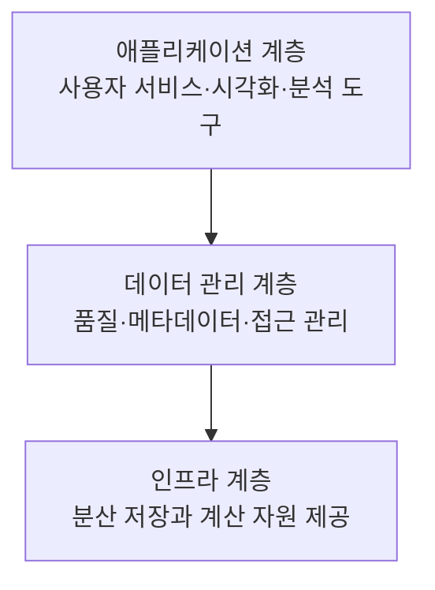

<Callout type="info">
  **이번 문서의 목표:** 상황을 읽고 어떤 수집 방식과 수집 기술이 적절한지 고를 수 있고, 저장 구조(웨어하우스·마트·레이크·NoSQL)의 선택 기준과 보존·백업 정책의 용어를 설명할 수 있게 된다.
</Callout>

## 왜 수집·저장이 기획의 일부인가

7편에서 CRISP-DM의 순서를 보며 "업무 이해 다음이 데이터 이해"라는 것을 확인했습니다. 그런데 실제 프로젝트에서 데이터를 이해하려면 그 전에 **데이터가 손에 들어와 있어야** 합니다. 그리고 데이터를 손에 넣는 일은 생각보다 어렵습니다.

- 필요한 데이터가 우리 회사에 없을 수 있습니다
- 있어도 형태가 제각각이고 시스템마다 흩어져 있습니다
- 실시간으로 쏟아지는 로그를 다 저장하면 비용이 감당되지 않습니다
- 개인정보가 섞여 있어 그대로 가져올 수 없습니다

그래서 **무엇을 어디서 어떻게 가져와 어디에 담을지**를 기획 단계에서 계획합니다. 이것이 1과목의 세 번째 주요 항목인 "데이터 수집 및 저장 계획"입니다.

> **쉽게 말하면:** 분석은 요리이고, 수집·저장은 장보기와 냉장고 관리입니다.

## 1. 데이터의 출처 — 내부 데이터와 외부 데이터

| 구분 | 정의 | 예시 | 특징 |
|------|------|------|------|
| 내부 데이터 | 조직이 자체 업무 시스템에서 생성·보유한 데이터 | 주문 이력, 회원 정보, 상담 기록, 서버 로그 | 접근이 쉽고 품질을 통제할 수 있음 |
| 외부 데이터 | 조직 밖에서 가져오는 데이터 | 공공데이터, 날씨, 소셜미디어, 구매한 시장 데이터 | 맥락 보강에 유용하나 형식·품질·권리 확인 필요 |

**왜 외부 데이터를 쓰는가:** 내부 데이터만으로는 "왜 그랬는가"를 설명하지 못하는 경우가 많습니다. 지난달 아이스크림 매출이 급락한 이유가 내부 데이터에는 없지만, 기상 데이터를 붙이면 이례적 한파가 보입니다. 이렇게 **바깥 맥락을 붙여 설명력을 높이는 것**이 외부 데이터의 역할입니다.

**주의할 점:** 외부 데이터는 **이용 약관·라이선스·개인정보 문제**를 먼저 확인해야 합니다. 공개되어 있다는 것이 자유롭게 써도 된다는 뜻은 아닙니다.

## 2. 데이터 수집 기술

| 기술 | 뜻 | 어디에 쓰나 |
|------|-----|-------------|
| 크롤링(crawling) | 웹 페이지를 자동으로 순회하며 문서를 수집 | 대량 웹 문서 확보 |
| 스크래핑(scraping) | 특정 페이지에서 필요한 부분만 추출 | 가격·리뷰 등 특정 항목 수집 |
| OpenAPI | 서비스 제공자가 공식적으로 열어 둔 데이터 요청 창구 | 날씨·지도·공공데이터 |
| FTP | 파일 전송 프로토콜로 파일 단위 수집 | 정기 배치 파일 수신 |
| ETL | Extract(추출) → Transform(변환) → Load(적재) | 여러 시스템 데이터를 통합 저장소에 적재 |
| 로그 수집기 | 서버·앱이 남기는 로그를 모아 전달 | 실시간 사용자 행동 수집 |
| 센서·IoT | 기기가 측정한 값을 주기적으로 전송 | 설비·환경 모니터링 |

### 크롤링과 스크래핑의 차이

두 용어는 자주 섞여 쓰이지만 초점이 다릅니다.

- **크롤링**은 "돌아다니는" 것에 초점이 있습니다. 링크를 따라가며 페이지를 **수집하는 범위**를 넓힙니다
- **스크래핑**은 "긁어내는" 것에 초점이 있습니다. 특정 페이지에서 **필요한 항목만 뽑아냅니다**

실무에서는 크롤러가 페이지를 모으고 스크래퍼가 항목을 추출하는 식으로 함께 씁니다.

### OpenAPI를 우선하는 이유

**API**(Application Programming Interface, 응용 프로그램 인터페이스)는 프로그램끼리 데이터를 주고받기 위해 정해 둔 약속입니다. **OpenAPI**는 그 약속을 외부에 공개한 것입니다.

크롤링보다 OpenAPI가 언제나 우선입니다. 이유는 셋입니다.

<Steps>

1. **형식이 안정적입니다.** 웹 페이지의 화면 구조는 자주 바뀌지만, API의 응답 형식은 버전으로 관리됩니다
2. **허용된 방식입니다.** 제공자가 공식적으로 연 창구이므로 이용 조건이 명확합니다
3. **서버 부담이 적습니다.** 필요한 데이터만 정확히 요청하므로 상대 서버에 과도한 부하를 주지 않습니다

</Steps>

### ETL과 ELT

**ETL**은 Extract(추출), Transform(변환), Load(적재)의 순서로 데이터를 통합 저장소에 넣는 절차입니다.

최근에는 **ELT**(Extract → Load → Transform)도 많이 씁니다. 원본을 **먼저 저장소에 넣고**, 필요할 때 변환하는 방식입니다.

| 구분 | 순서 | 어울리는 저장소 | 장점 |
|------|------|-----------------|------|
| ETL | 추출 → 변환 → 적재 | 데이터 웨어하우스 | 저장 시점에 이미 정제되어 조회가 빠름 |
| ELT | 추출 → 적재 → 변환 | 데이터 레이크 | 원본이 보존되어 나중에 다른 방식으로도 가공 가능 |

**해석:** ETL은 "정리해서 넣는" 방식이고 ELT는 "일단 넣고 나중에 정리하는" 방식입니다. 3편에서 다룬 웨어하우스(저장 전 가공)와 레이크(사용 시 가공)의 차이가 그대로 대응됩니다.

### 하둡 에코시스템의 보조 도구 — 이름과 역할 짝짓기

하둡(HDFS·맵리듀스)만으로는 실무가 돌아가지 않습니다. 주변에 붙는 보조 도구들의 **이름과 역할을 정확히 짝짓는 문제**가 자주 나오므로, 저장·수집이 끝난 데이터를 실제로 다루는 도구들을 여기서 함께 정리합니다.

| 도구 | 역할 | 헷갈리는 짝 |
|------|------|-------------|
| 스쿱(Sqoop) | 관계형 데이터베이스와 하둡 사이에서 **정형 자료를 양방향으로 이동** | 로그 수집으로 착각하기 쉬움 |
| 플룸(Flume) | 여러 서버에 흩어진 **로그 스트림을 실시간으로 모아 전달** | 파일 전송(FTP)이나 정형 자료 이동(Sqoop)과 혼동 |
| 하이브(Hive) | 하둡에 쌓인 자료를 SQL과 비슷한 질의어로 **조회·집계** | 실시간 로그 수집 도구로 오인되기 쉬움 |
| 마훗(Mahout) | 하둡 위에서 돌아가는 **대규모 통계·머신러닝 라이브러리** | 분산 코디네이션(ZooKeeper)과 혼동 |
| 주키퍼(ZooKeeper) | 여러 분산 노드의 **설정 정보 관리와 동기화**를 담당하는 코디네이터 | 머신러닝 라이브러리(Mahout)와 혼동 |

**기출 함정:** "플룸(Flume)이 관계형 데이터베이스와 하둡 사이의 정형 자료 이동을 전담한다"거나 "하이브(Hive)가 실시간 로그 수집을 담당한다"처럼 **역할을 서로 맞바꾼 보기**가 오답으로 나옵니다. 판정 순서는 다음과 같습니다.

<Steps>

1. **정형 데이터를 관계형 데이터베이스와 오갈 때** → 스쿱
2. **비정형·반정형 로그가 실시간으로 쏟아질 때** → 플룸
3. **저장된 자료를 SQL처럼 조회·집계할 때** → 하이브
4. **통계·머신러닝 계산을 대규모로 돌릴 때** → 마훗
5. **여러 노드의 설정을 동기화할 때** → 주키퍼

</Steps>

## 3. 수집 방식 — 배치·실시간·스트리밍

> **쉽게 말하면:** 데이터를 **모아서 한 번에** 가져올 것인가, **생기는 즉시** 가져올 것인가의 차이입니다.

| 방식 | 처리 단위 | 주기 | 적합한 상황 | 예시 |
|------|-----------|------|-------------|------|
| 배치(batch) | 일정 기간 모은 묶음 | 시간·일·주 단위 | 즉시성이 필요 없고 대량을 다룰 때 | 야간에 하루치 매출 집계 |
| 실시간(real-time) | 건 단위 | 발생 즉시 | 즉시 반응이 필요할 때 | 카드 이상거래 탐지 |
| 스트리밍(streaming) | 연속적으로 흐르는 데이터 | 지속적 | 끊임없이 들어오는 이벤트를 처리 | 클릭 로그, 센서 측정값 |

### 어떤 방식을 고를 것인가 — 판정 기준

기출은 상황을 주고 방식을 고르게 합니다. 판정은 두 질문으로 갈립니다.

<Steps>

1. **결과가 늦어도 되는가?** 하루 뒤에 알아도 문제없으면 배치로 충분합니다
2. **지연 1분의 비용이 큰가?** 이상거래를 1분 뒤에 알면 이미 결제가 끝났으므로 실시간이 필요합니다

</Steps>

**자주 틀리는 점:** "실시간이 언제나 더 좋다"는 판단은 틀렸습니다. 실시간 처리는 **인프라 비용과 운영 복잡도가 훨씬 큽니다.** 월간 보고서를 위해 실시간 파이프라인을 구축하는 것은 명백한 과잉 설계입니다. **필요한 만큼의 즉시성만 확보하는 것**이 올바른 설계입니다.

## 4. 저장 구조 설계

### 무엇을 어디에 담을 것인가

3편에서 정리한 저장소들을 **선택 기준**으로 다시 봅니다.

| 저장할 데이터 | 적합한 저장소 | 이유 |
|---------------|---------------|------|
| 정형이고 관계가 중요하며 무결성이 필수 | 관계형 데이터베이스(RDBMS) | 키·제약조건으로 일관성 보장 |
| 정제된 정형 데이터로 정기 분석·보고 | 데이터 웨어하우스 | 통합·집계 조회에 최적화 |
| 특정 부서·주제 전용 분석 | 데이터 마트 | 범위가 좁아 조회가 빠르고 관리가 쉬움 |
| 형태가 다양하고 나중에 어떻게 쓸지 모름 | 데이터 레이크 | 원본 보존, 사용 시 가공 |
| 스키마가 자주 바뀌고 대량 쓰기가 많음 | NoSQL | 유연한 스키마, 수평 확장 |
| 초대용량 파일의 분산 저장·병렬 처리 | 하둡(HDFS) | 큰 블록, 다중 복제, 맵리듀스 |

**설계에서 가장 흔한 실수:** 모든 것을 데이터 레이크에 부어 놓고 관리하지 않으면 **"데이터 늪"**(data swamp)이 됩니다. 무엇이 들어 있는지, 어느 열이 무슨 뜻인지 아무도 모르는 상태가 되어 결국 쓸 수 없게 됩니다. 그래서 레이크에도 **메타데이터 관리와 카탈로그**가 반드시 함께 있어야 합니다(8편의 거버넌스).

### 빅데이터 플랫폼의 계층 구조

플랫폼을 계층으로 나눠 보면 어떤 기능이 어디에 속하는지 판정할 수 있습니다.

| 계층 | 담당 기능 |
|------|-----------|
| 애플리케이션 계층 | 사용자 서비스, 시각화, 분석 도구 제공 |
| 데이터 관리 계층 | 수집 데이터의 품질·메타데이터·접근 관리 |
| 인프라 계층 | 분산 저장과 계산 자원 제공, 물리적 블록 복제 |

**기출 함정:** "애플리케이션 계층 — 원천 로그의 물리적 블록 복제 전담"이라는 연결이 오답으로 나옵니다. **물리 블록 복제는 저장 인프라의 기능**이지 애플리케이션 계층이 전담하는 기능이 아닙니다. 계층 문제는 **"이 기능이 사용자에게 보이는가, 데이터를 관리하는가, 하드웨어 자원을 다루는가"** 로 판정하면 됩니다.

### 관리 플랫폼과 분석 플랫폼

| 구분 | 역할 | 예시 |
|------|------|------|
| 빅데이터 관리 플랫폼 | 다량의 데이터 수집·저장·처리·관리를 지원 | 하둡, 스파크(Spark) |
| 빅데이터 분석 플랫폼 | 데이터를 활용해 분석과 인사이트 도출을 지원 | 태블로(Tableau), 파워BI(Power BI) |

**플랫폼이라는 말 자체의 뜻:** 여러 사용자나 서비스가 상호작용할 수 있도록 기반을 제공하는 환경이나 체계입니다. 배달 앱이 라이더·식당·고객을 연결하는 기반을 제공하는 것과 같은 구조입니다.

## 5. 데이터 정합성 점검

수집한 데이터를 저장소에 넣기 전에 **제대로 들어왔는지** 확인해야 합니다. 이 과정을 정합성 점검이라고 합니다.

| 점검 항목 | 확인 내용 |
|-----------|-----------|
| 건수 대사 | 원천의 건수와 적재된 건수가 일치하는가 |
| 형식 검증 | 자료형·자릿수·코드 값이 규격에 맞는가 |
| 범위 검증 | 값이 허용 범위 안에 있는가 (예: 나이가 0에서 120 사이) |
| 중복 검증 | 같은 키가 중복 적재되지 않았는가 |
| 참조 무결성 | 외래키가 가리키는 대상이 실제로 존재하는가 |

### 파싱 오류 — 기출 사례 판단형

기출은 이런 상황을 줍니다.

> CSV 파일의 상품명 필드에 쉼표가 포함되어 열이 잘못 나뉘었다. 가장 적절한 처리 방법은?

**CSV**(Comma-Separated Values, 쉼표로 구분된 값)는 쉼표로 열을 구분하는 텍스트 형식입니다. 그런데 상품명이 "노트북, 15인치"처럼 쉼표를 포함하면, 파일을 읽는 프로그램이 그 쉼표를 열 구분자로 착각해 한 상품명이 두 열로 쪼개집니다.

**보기별 판정:**

| 보기 | 판정 | 이유 |
|------|------|------|
| 모든 쉼표를 무조건 삭제 | 부적절 | 원본 상품명이 훼손됨 |
| 문제 레코드를 전부 버림 | 부적절 | 멀쩡한 데이터를 잃음 |
| 빈 열을 임의의 평균값으로 채움 | 부적절 | 파싱 문제를 결측 대체로 잘못 대응 |
| 인용부호와 이스케이프 규칙을 반영해 다시 파싱 | **적절** | 필드 내부 쉼표와 열 구분자를 구별할 수 있음 |

**해석:** CSV 규격은 이미 이 문제의 답을 갖고 있습니다. 필드를 큰따옴표로 감싸면 그 안의 쉼표는 구분자가 아니라 값의 일부로 읽힙니다. 즉 **데이터를 고치는 것이 아니라 읽는 방법을 고치는 것**이 정답입니다.

> **쉽게 말하면:** 책을 거꾸로 들고 읽으면서 "글자가 이상하다"고 글자를 지우면 안 됩니다. 책을 바로 드는 것이 답입니다.

**이 유형의 일반 원칙:** 데이터 문제를 만나면 **원인이 어느 층에 있는지**를 먼저 봅니다. 파싱 규칙 문제, 인코딩 문제, 원천 시스템 입력 문제는 각각 다른 곳을 고쳐야 하며, **결측 대체나 행 삭제는 원인을 해결하지 않고 증상만 지우는 대응**입니다.

## 6. 통합 시 지켜야 할 원칙

여러 시스템의 데이터를 통합할 때의 원칙도 사례 판단형으로 출제됩니다.

| 원칙 | 내용 |
|------|------|
| 코드 체계 통일 | 소스별로 다른 코드를 공통 기준에 맞춘다 |
| 규칙의 일관 적용 | 결측·중복 처리 규칙을 통합 데이터 전체에 동일하게 적용한다 |
| 이력 기록 | 정제 이력을 남겨 재현 가능하게 한다 |
| 전 원천 대상 | 특정 시스템만이 아니라 관련된 모든 원천을 대상으로 정제한다 |

**기출 오답 보기:** "오류 정제는 가장 오래된 원천 시스템에만 수행하고 다른 원천은 제외한다"는 설명이 틀린 것으로 나옵니다. 전처리는 **특정 레거시 시스템에만 한정되지 않고 모든 관련 원천을 대상으로** 합니다. 한 시스템만 정제하면 통합 후 두 기준이 뒤섞여 오히려 일관성이 깨집니다.

## 7. 보존·백업 정책

### 보존 기간

데이터를 영원히 보관할 수는 없습니다. 세 가지 힘이 서로 당깁니다.

- **법적 요구:** 특정 기록은 법으로 정해진 기간 동안 보관해야 합니다
- **개인정보 원칙:** 개인정보는 **보유·이용 기간이 끝나면 지체 없이 파기**해야 합니다. 8편의 필수 고지 사항에 "보유 및 이용 기간"이 들어 있는 이유입니다
- **비용과 활용:** 오래된 데이터는 저장 비용을 계속 발생시키지만 분석 가치는 떨어집니다

**해석:** 그래서 "무조건 오래 보관"도, "무조건 빨리 삭제"도 정답이 아닙니다. **데이터 종류별로 보존 기간을 정하고, 기간이 지나면 파기하거나 저비용 저장소로 옮기는 정책**을 세우는 것이 올바른 설계입니다.

### 백업과 아카이빙

| 구분 | 목적 | 특징 |
|------|------|------|
| 백업(backup) | 장애·손실로부터 **복구**하기 위한 사본 | 원본과 같은 내용을 별도 보관, 주기적 갱신 |
| 아카이빙(archiving) | 활용 빈도가 낮은 데이터를 **장기 보관** | 원본을 저비용 저장소로 이동, 즉시 조회 우선순위 낮음 |

**두 개념의 결정적 차이:** 백업은 **원본이 그대로 있으면서 사본을 두는 것**이고, 아카이빙은 **원본을 다른 곳으로 옮기는 것**입니다. 백업의 목적은 복구이고 아카이빙의 목적은 보관 비용 절감입니다.

**복제와 백업도 다릅니다.** HDFS의 블록 복제(3편)는 노드 장애에 대비한 **가용성** 장치이지 백업이 아닙니다. 실수로 파일을 지우면 복제본도 함께 지워지기 때문입니다. **사람의 실수나 논리적 오류로부터 지켜 주는 것은 백업뿐**입니다.

## 핵심 정리

- 데이터는 내부(자체 업무 시스템)와 외부(공공·구매·소셜)로 나뉘며, 외부 데이터는 라이선스·개인정보 확인이 선행되어야 한다.
- 수집 기술에는 크롤링·스크래핑·OpenAPI·FTP·ETL·로그 수집기가 있고, **가능하면 OpenAPI를 우선**한다.
- ETL은 변환 후 적재(웨어하우스), **ELT는 적재 후 변환(레이크)** 이다.
- 하둡 에코시스템 보조 도구는 역할로 구분한다. **스쿱은 정형 자료의 양방향 이동, 플룸은 실시간 로그 수집, 하이브는 SQL 방식 조회, 마훗은 통계·머신러닝, 주키퍼는 분산 노드 동기화**를 맡는다.
- 수집 방식은 배치·실시간·스트리밍으로 나뉘며, **필요한 만큼의 즉시성만 확보**하는 것이 올바른 설계다.
- 플랫폼 계층은 애플리케이션(서비스·시각화), 데이터 관리(품질·메타데이터·접근), 인프라(분산 저장·계산)이며 **물리 블록 복제는 인프라 계층**의 기능이다.
- CSV 파싱 오류는 데이터를 고치는 것이 아니라 **인용부호·이스케이프 규칙을 반영해 다시 읽는 것**이 정답이다.
- 백업은 복구를 위한 사본, 아카이빙은 저비용 장기 보관을 위한 이동이며, **분산 복제는 백업을 대체하지 못한다.**

## 마무리 복습

<Quiz
  questionNumber={1}
  question="CSV 파일의 상품명 필드에 쉼표가 포함되어 열이 잘못 나뉘었다. 가장 적절한 처리 방법은?"
  options={['모든 쉼표를 무조건 삭제한다', '문제 레코드를 전부 버린다', '빈 열을 임의의 평균값으로 채운다', '인용부호와 이스케이프 규칙을 반영해 구분자를 다시 파싱한다']}
  correctAnswer={4}
  explanation="CSV 규격은 큰따옴표로 감싼 필드 안의 쉼표를 값의 일부로 처리하도록 정의하고 있으므로, 읽는 방법을 바로잡으면 원본을 훼손하지 않고 해결된다. 쉼표 삭제나 레코드 폐기, 평균 대체는 원인을 두고 증상만 건드리는 대응이다."
  optionExplanations={['원본 상품명이 훼손되어 데이터의 의미가 손상된다.', '멀쩡한 데이터를 잃게 되어 정보 손실이 크다.', '파싱 문제를 결측 대체로 잘못 대응한 것이다.', '인용과 이스케이프 규칙을 적용하면 필드 내부 쉼표와 구분자를 구별할 수 있으므로 옳다.']}
/>

<Quiz
  questionNumber={2}
  question="빅데이터 플랫폼 계층과 기능의 연결로 옳지 않은 것은?"
  options={['애플리케이션 계층 — 원천 로그의 물리적 블록 복제 전담', '애플리케이션 계층 — 사용자 서비스와 시각화 제공', '데이터 관리 계층 — 수집 데이터의 품질·메타데이터·접근 관리', '인프라 계층 — 분산 저장과 계산 자원 제공']}
  correctAnswer={1}
  explanation="물리적 블록 복제는 분산 저장을 담당하는 인프라 계층의 기능이지 애플리케이션 계층이 전담하는 기능이 아니다. 애플리케이션 계층은 사용자에게 보이는 서비스와 시각화를 제공한다."
  optionExplanations={['블록 복제는 인프라 계층의 기능이므로 잘못된 연결이다.', '사용자 서비스와 시각화는 애플리케이션 계층의 기능이 맞다.', '품질과 메타데이터, 접근 관리는 데이터 관리 계층의 기능이 맞다.', '분산 저장과 계산 자원 제공은 인프라 계층의 기능이 맞다.']}
/>

<Quiz
  questionNumber={3}
  question="여러 시스템의 고객 데이터를 통합하는 전처리 원칙으로 옳지 않은 것은?"
  options={['소스별 코드 체계를 공통 기준에 맞춘다', '오류 정제는 가장 오래된 원천 시스템에만 수행하고 다른 원천은 제외한다', '결측과 중복 규칙을 전체 통합 데이터에 일관되게 적용한다', '정제 이력을 기록해 재현 가능하게 한다']}
  correctAnswer={2}
  explanation="전처리는 특정 레거시 시스템에만 한정되지 않고 관련된 모든 원천을 대상으로 수행해야 한다. 일부 원천만 정제하면 통합 후 서로 다른 기준이 섞여 오히려 일관성이 깨진다."
  optionExplanations={['코드 체계 통일은 통합 전처리의 기본 원칙이다.', '일부 원천만 정제하면 기준이 뒤섞이므로 잘못된 원칙이다.', '규칙을 전체에 일관 적용하는 것은 옳은 원칙이다.', '정제 이력 기록으로 재현성을 확보하는 것은 옳은 원칙이다.']}
/>

<Quiz
  questionNumber={4}
  question="ETL과 ELT에 대한 설명으로 옳은 것은?"
  options={['ETL은 적재 후 변환하고 ELT는 변환 후 적재한다', 'ETL은 변환 후 적재하며 데이터 웨어하우스에 어울린다', 'ELT는 원본을 보존하지 않아 재가공이 불가능하다', '두 방식은 순서가 같고 명칭만 다르다']}
  correctAnswer={2}
  explanation="ETL은 추출 후 변환해 적재하므로 저장 시점에 이미 정제된 데이터 웨어하우스에 어울리고, ELT는 원본을 먼저 적재한 뒤 필요할 때 변환하므로 데이터 레이크에 어울린다. ELT는 원본을 보존하므로 다른 방식으로 재가공할 수 있다."
  optionExplanations={['두 방식의 순서를 서로 뒤바꿔 설명했다.', '변환 후 적재라는 순서와 웨어하우스 적합성이 모두 맞다.', 'ELT는 원본을 그대로 적재하므로 재가공이 오히려 용이하다.', '변환과 적재의 순서가 다르므로 명칭만 다른 것이 아니다.']}
/>

<Quiz
  questionNumber={5}
  question="데이터 수집 방식 선택에 대한 설명으로 가장 적절한 것은?"
  options={['실시간 처리가 언제나 배치보다 우수하므로 모든 수집을 실시간으로 전환한다', '월간 보고용 집계는 배치로 충분하며 실시간 파이프라인은 과잉 설계다', '카드 이상거래 탐지는 다음 날 배치로 처리해도 충분하다', '스트리밍은 데이터가 적을 때만 사용할 수 있다']}
  correctAnswer={2}
  explanation="실시간 처리는 인프라 비용과 운영 복잡도가 크므로 필요한 만큼의 즉시성만 확보하는 것이 올바른 설계다. 월간 보고는 지연이 문제되지 않아 배치가 적절하고, 이상거래는 지연 시 이미 결제가 끝나므로 실시간이 필요하다."
  optionExplanations={['실시간은 비용과 복잡도가 크므로 언제나 우수하다고 볼 수 없다.', '즉시성이 필요 없는 집계에 실시간을 쓰는 것은 과잉 설계가 맞다.', '이상거래는 즉시 차단해야 하므로 다음 날 배치로는 목적을 달성할 수 없다.', '스트리밍은 오히려 지속적으로 대량 발생하는 이벤트 처리에 사용한다.']}
/>

<Quiz
  questionNumber={6}
  question="백업과 아카이빙에 대한 설명으로 옳은 것은?"
  options={['백업은 원본을 다른 저장소로 옮기는 것이고 아카이빙은 사본을 두는 것이다', '백업은 복구를 위한 사본 보관이고 아카이빙은 저비용 장기 보관을 위한 이동이다', '분산 파일 시스템의 블록 복제가 있으면 백업은 필요 없다', '아카이빙한 데이터는 어떤 경우에도 다시 조회할 수 없다']}
  correctAnswer={2}
  explanation="백업은 장애나 손실에서 복구하기 위해 원본과 별도로 사본을 두는 것이고, 아카이빙은 활용 빈도가 낮은 데이터를 저비용 저장소로 옮겨 장기 보관하는 것이다. 블록 복제는 노드 장애 대비 장치일 뿐 사람의 삭제 실수로부터 지켜주지 못하므로 백업을 대체할 수 없다."
  optionExplanations={['백업과 아카이빙의 방식을 서로 뒤바꿔 설명했다.', '복구용 사본과 저비용 장기 보관용 이동이라는 구분이 정확하다.', '복제본은 삭제 시 함께 사라지므로 백업을 대체할 수 없다.', '아카이빙 데이터도 조회할 수 있으며 다만 즉시성 우선순위가 낮을 뿐이다.']}
/>

<Quiz
  questionNumber={7}
  question="외부 데이터를 수집할 때 크롤링보다 OpenAPI를 우선하는 이유로 가장 적절하지 않은 것은?"
  options={['응답 형식이 버전으로 관리되어 안정적이다', '제공자가 공식적으로 연 창구이므로 이용 조건이 명확하다', '필요한 데이터만 요청해 상대 서버 부담이 적다', '수집한 데이터의 저작권과 개인정보 문제가 자동으로 해소된다']}
  correctAnswer={4}
  explanation="OpenAPI를 통해 받았다고 해서 저작권이나 개인정보 관련 제약이 사라지지는 않으며 이용 약관을 별도로 확인해야 한다. 형식 안정성, 이용 조건의 명확성, 서버 부담 감소는 실제 이점이 맞다."
  optionExplanations={['API 응답 형식은 버전 관리되어 화면 구조보다 안정적이므로 옳은 이유다.', '공식 창구라 이용 조건이 명확한 것은 옳은 이유다.', '필요한 데이터만 요청하므로 서버 부담이 적은 것은 옳은 이유다.', '권리와 개인정보 제약은 별도로 확인해야 하므로 자동 해소된다는 설명은 틀렸다.']}
/>

<Quiz
  questionNumber={8}
  question="다음 중 하둡 에코시스템 도구와 주요 역할의 연결로 옳은 것은?"
  options={['스쿱(Sqoop) — 관계형 데이터베이스와 하둡 사이의 정형 자료 이동', '플룸(Flume) — 통계·머신러닝 라이브러리 제공', '하이브(Hive) — 여러 분산 노드의 설정 정보 동기화', '주키퍼(ZooKeeper) — 대규모 데이터의 실시간 로그 수집']}
  correctAnswer={1}
  explanation="스쿱은 관계형 데이터베이스와 하둡 사이에서 정형 자료를 양방향으로 옮기는 도구다. 플룸은 로그 수집, 하이브는 SQL 방식 조회, 주키퍼는 분산 노드 동기화를 맡으므로 나머지 셋은 역할이 서로 바뀌어 있다."
  optionExplanations={['정답이다. 스쿱은 정형 자료의 양방향 이동을 전담한다.', '통계·머신러닝 라이브러리는 마훗의 역할이며 플룸은 실시간 로그 수집을 담당한다.', 'SQL 방식 조회·집계는 하이브의 역할이며 주키퍼는 분산 노드 동기화를 담당한다.', '실시간 로그 수집은 플룸의 역할이며 주키퍼는 분산 노드의 설정 동기화를 담당한다.']}
/>

## 참고 자료

- [한국데이터산업진흥원 - 빅데이터분석기사 자격시험 안내](https://www.dataq.or.kr/www/sub/a_07.do)
- [코리아IT아카데미 - 빅데이터 분석기사](https://www.koreaisacademy.com/2025/cer/datascience/bigdata.asp)
- [Inflearn 가이드 - 빅데이터분석기사 어떻게 준비해야 할까?](https://www.inflearn.com/pages/bigdata-analysis-engineer-guide)
- [데이터캠퍼스 - 빅데이터분석기사 필기 교재 소개](https://www.datacampus.co.kr/book/book_view.jsp?id=3197&)
