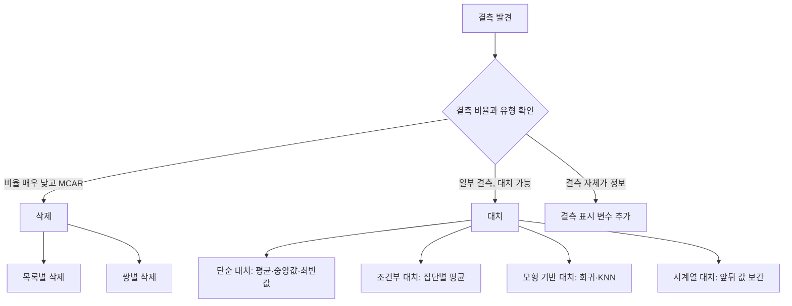

<Callout type="info">
  **이번 문서의 목표:** 결측이 왜 생겼는지에 따라 처리 방법을 다르게 고를 수 있고, IQR과 z-score로 이상치를 손으로 판정하며, "이상치는 무조건 제거"가 왜 틀린 답인지 설명할 수 있게 된다.
</Callout>

## 왜 전처리가 2과목의 첫 항목인가

현실의 데이터는 깨끗하지 않습니다. 나이 열에 250이 있고, 소득 열의 3분의 1이 비어 있으며, 같은 고객이 두 번 들어 있습니다. 이 상태로 평균을 내면 그 평균은 아무것도 대표하지 못합니다.

**전처리**(preprocessing)는 분석에 쓸 수 있는 상태로 데이터를 다듬는 모든 작업입니다. 그중 가장 먼저 마주치는 두 문제가 **결측치**(빠진 값)와 **이상치**(튀는 값)입니다.

> **쉽게 말하면:** 요리 전에 상한 재료를 골라내고, 빠진 재료를 어떻게 할지 정하는 일입니다.

시험에서 이 주제는 단순 정의보다 **"이 상황에서 가장 적절한/부적절한 조치는?"** 형태로 나옵니다. 그래서 이 편은 각 방법의 정의뿐 아니라 **언제 쓰고 언제 쓰면 안 되는지**를 함께 다룹니다.

## 1. 결측치란 무엇인가

**결측치**(missing value)는 누락되거나 관측되지 않은 값입니다. 표에서 비어 있는 칸이 결측입니다.

### 결측이 생기는 경로

<Steps>

1. **응답 거부** — 설문에서 소득 문항에 답하지 않음
2. **측정 실패** — 센서 고장으로 특정 시간대 값이 없음
3. **해당 없음** — 미혼자의 배우자 나이처럼 애초에 존재하지 않는 값
4. **시스템 오류** — 연동 실패로 일부 필드가 전달되지 않음
5. **처리 중 발생** — 조인(결합) 과정에서 짝이 없어 빈칸이 생김

</Steps>

**왜 경로를 따지는가:** 경로에 따라 올바른 처리가 달라지기 때문입니다. **"해당 없음"인 결측을 평균으로 채우면 존재하지 않는 사실을 만들어 내는 것**입니다. 미혼자에게 배우자 나이 평균값 42세를 채워 넣는 것은 명백한 오류입니다.

### 결측을 탐지하고 표시하기

결측이 항상 빈칸으로 오지는 않습니다. 다음과 같은 **위장된 결측**을 반드시 확인해야 합니다.

| 위장 형태 | 예시 | 위험 |
|-----------|------|------|
| 특수 숫자 | 나이 999, 소득 -1 | 그대로 계산하면 평균이 크게 왜곡됨 |
| 문자열 | "없음", "N/A", "미상", 공백 문자 | 수치형 열이 문자형으로 읽혀 계산 불가 |
| 기본값 | 날짜 1900-01-01 | 실제 값처럼 보여 탐지되지 않음 |
| 0 | 결측을 0으로 채워 둠 | 실제 0과 구분되지 않음 |

**가장 위험한 것은 마지막 줄입니다.** 결측을 0으로 채워 두면 이후에는 그것이 결측이었는지 실제 0이었는지 영원히 알 수 없습니다. 그래서 **결측은 결측으로 표시된 채 다음 단계로 넘겨야** 합니다.

## 2. 결측 유형 — MCAR·MAR·MNAR

> **쉽게 말하면:** **결측이 생긴 이유가 데이터와 관련이 있는가**로 세 가지로 나눕니다.

이름이 비슷해서 헷갈리므로, 소득 설문 예시 하나로 셋을 모두 설명하겠습니다.

| 유형 | 영어 원어 | 뜻 | 소득 설문 예시 |
|------|-----------|-----|----------------|
| MCAR | Missing Completely At Random | 결측이 **완전히 무작위**로 발생 | 설문지 일부가 우연히 인쇄가 번져 읽히지 않음 |
| MAR | Missing At Random | 결측 여부가 **관측된 다른 변수**와 관련 | 젊은 응답자일수록 소득 문항을 자주 건너뜀(나이는 관측됨) |
| MNAR | Missing Not At Random | 결측 여부가 **결측된 값 자체**와 관련 | 소득이 아주 높은 사람일수록 소득을 밝히지 않음 |

### 세 유형을 구분하는 판정 질문

<Steps>

1. **결측이 어떤 변수와도 관련이 없는가?** → 그렇다면 MCAR
2. **결측이 다른 관측된 변수(나이·지역 등)로 설명되는가?** → 그렇다면 MAR
3. **결측이 그 빠진 값 자체와 관련되는가?** → 그렇다면 MNAR

</Steps>

**왜 이 구분이 중요한가:** 처리의 안전성이 달라지기 때문입니다.

| 유형 | 결측 행을 그냥 삭제하면 | 이유 |
|------|------------------------|------|
| MCAR | 편향은 없고 표본만 줄어듦 | 남은 데이터가 여전히 전체를 대표 |
| MAR | 다른 변수를 고려한 대치가 필요 | 그냥 삭제하면 특정 집단이 과소 대표됨 |
| MNAR | **어떤 방법으로도 위험** | 빠진 값 자체가 원인이라 관측 데이터로 복원 불가 |

**MNAR이 가장 어려운 이유:** 고소득자가 소득을 밝히지 않는 상황에서, 관측된 소득만으로 평균을 내면 **실제보다 낮은 평균**이 나옵니다. 그런데 우리가 가진 데이터 안에는 "얼마나 낮게 나왔는지"를 알려 줄 정보가 없습니다. 데이터 바깥의 지식(예: 국세 통계)이 있어야 보정할 수 있습니다.

**자주 틀리는 점:** MAR의 "At Random"이라는 이름 때문에 "무작위니까 그냥 지워도 된다"고 오해하기 쉽습니다. **MAR은 "다른 변수를 조건으로 하면 무작위"라는 뜻**이지, 그냥 무작위라는 뜻이 아닙니다.

## 3. 결측 처리 방법

### 삭제

| 방법 | 내용 | 위험 |
|------|------|------|
| 목록별 삭제(listwise) | 결측이 하나라도 있는 **행 전체**를 제거 | 표본이 크게 줄고, MCAR이 아니면 편향 |
| 쌍별 삭제(pairwise) | 계산에 필요한 변수만 있으면 그 계산에는 사용 | 계산마다 표본 수가 달라져 결과 비교가 어려움 |
| 변수 삭제 | 결측이 너무 많은 **열 자체**를 제거 | 그 변수가 중요했다면 정보 손실 |

**언제 삭제가 정당한가:** 결측 비율이 매우 낮고(대략 5퍼센트 미만) MCAR로 볼 수 있을 때입니다. 결측이 40퍼센트인 열을 대치로 채우면, 그 열의 절반 가까이가 **우리가 만들어 낸 값**이 되어 분석 결과를 신뢰할 수 없습니다.

### 단순 대치

| 대상 변수 | 대표적 대치값 | 이유 |
|-----------|---------------|------|
| 수치형, 대칭 분포 | 평균 | 중심을 대표 |
| 수치형, 치우친 분포 | 중앙값 | 극단값에 끌리지 않음 |
| 범주형(명목) | 최빈값 | 가장 자주 나타난 범주 |

**기출 판정:** "순서가 없는 고객 선호 색상 변수의 결측값을 하나의 대표 범주로 대체하려 한다. 가장 일반적인 통계량은?"의 답은 **최빈값**입니다. 색상은 명목형이므로 산술평균이나 중앙값을 계산할 수 없고, 표준편차는 애초에 대체값이 아니라 산포 지표입니다.

**단순 대치의 부작용 — 반드시 알아야 할 것:** 평균으로 채우면 **그 변수의 분산이 작아집니다.** 채워 넣은 값들이 모두 평균과 같아서 편차가 0이기 때문입니다.

**작은 예로 확인해 봅시다.** 원래 자료가 10, 20, 30, 40, 50이고 평균이 30일 때, 만약 뒤의 두 값이 결측이어서 평균 15로 채웠다면 어떻게 될까요? 먼저 관측된 값 10, 20으로 평균을 냅니다.

$$
\bar{x} = \frac{10 + 20}{2} = 15
$$

결측 세 개를 15로 채우면 자료는 10, 20, 15, 15, 15가 됩니다. 이 자료의 표본분산을 구해 봅시다.

편차는 각각 –5, 5, 0, 0, 0이고 제곱은 25, 25, 0, 0, 0입니다.

$$
s^2 = \frac{25 + 25 + 0 + 0 + 0}{5 - 1} = \frac{50}{4} = 12.5
$$

**해석:** 채운 값 세 개가 편차 0을 만들어 분산을 끌어내렸습니다. 실제 자료의 산포보다 작게 나오므로, 이 데이터로 계산한 신뢰구간은 실제보다 좁아지고 통계적 유의성이 과대평가됩니다. **평균 대치는 간편하지만 산포를 왜곡한다**는 점이 이 방법의 근본적 한계입니다.

### 조건부·모형 기반 대치

- **집단별 대치:** 전체 평균 대신 **비슷한 집단 안의 평균**으로 채웁니다. 지역별·연령대별 소득 평균으로 채우면 전체 평균으로 채우는 것보다 훨씬 정확합니다. MAR 상황에 적합합니다
- **회귀 대치:** 다른 변수로 결측 변수를 예측하는 회귀모형을 만들어 예측값으로 채웁니다
- **KNN 대치:** 결측이 있는 행과 가장 비슷한 이웃 행들의 값으로 채웁니다
- **다중 대치**(multiple imputation): 여러 개의 그럴듯한 값을 만들어 여러 데이터셋을 생성하고, 각각 분석한 뒤 결과를 합칩니다. **대치로 인한 불확실성까지 반영**한다는 점에서 단순 대치보다 통계적으로 우수합니다

### 시계열 대치

시간 순서가 있는 데이터에서는 **앞뒤 값의 정보**를 쓸 수 있습니다.

| 방법 | 내용 |
|------|------|
| 이전 값 채우기 | 바로 앞 시점의 값으로 채움 |
| 선형 보간 | 앞뒤 시점 값을 잇는 직선 위의 값으로 채움 |
| 이동평균 | 주변 몇 개 시점의 평균으로 채움 |

**선형 보간 계산 예시:** 3월 값이 100, 4월이 결측, 5월이 140이라면

$$
\text{4월 추정값} = \frac{100 + 140}{2} = 120
$$

- 분자: 앞뒤 시점의 값
- 분모 2: 두 값의 평균

### 결측 자체를 정보로 쓰기

결측 여부가 의미를 가질 때가 있습니다. "소득을 밝히지 않은 사람"이라는 사실 자체가 예측에 유용할 수 있습니다. 이때는 **결측 표시 변수**(missing indicator)를 하나 추가합니다. 소득 결측 여부를 0과 1로 나타내는 새 열을 만드는 것입니다.

**언제 유용한가:** MNAR이 의심될 때 특히 유용합니다. 결측의 원인을 모형이 학습할 수 있게 해 주기 때문입니다.

## 4. 이상치란 무엇인가

**이상치**(outlier)는 현실적으로 관측될 수 없거나, 다른 값들과 현저하게 동떨어진 값입니다.

| 예시 | 성격 |
|------|------|
| 온도 300도, 나이 250세 | 물리적으로 불가능 → 오류가 거의 확실 |
| 30대 소득 중 소득 3억 | 가능하지만 드묾 → 진짜 값일 수 있음 |
| 강수량 300mm | 이례적이지만 실제 발생 가능 |

**이 구분이 핵심입니다.** 이상치에는 두 종류가 있습니다.

- **오류로 인한 이상치:** 입력 실수, 센서 고장, 단위 혼동. 이것은 고치거나 제거해야 합니다
- **진짜 극단값:** 실제로 존재하는 드문 사례. 이것은 **함부로 제거하면 안 됩니다**

> **쉽게 말하면:** 이상치를 봤을 때 첫 질문은 "제거할까?"가 아니라 **"이게 실제로 있을 수 있는 값인가?"** 입니다.

## 5. 이상치 탐지 방법

### 사분위수(IQR) 기준 — 상자그림

02편·04편에서 다룬 계산을 여기서 완결합니다.

$$
IQR = Q_3 - Q_1
$$

$$
\text{하한 경계} = Q_1 - 1.5 \times IQR
$$

$$
\text{상한 경계} = Q_3 + 1.5 \times IQR
$$

- $Q_1$: 제1사분위수, 아래에서 25퍼센트 지점
- $Q_3$: 제3사분위수, 아래에서 75퍼센트 지점
- $IQR$: 가운데 50퍼센트의 폭
- $1.5$: 관례적인 배수. **프로그램이나 상황에 따라 3을 쓰기도 합니다**

**손계산 예시.** 자료가 12, 15, 16, 18, 20, 22, 24, 28, 30, 62 (10개)라고 합시다.

**1단계 — 사분위수 위치를 잡습니다.** 정렬된 10개에서 아래 절반은 12, 15, 16, 18, 20이고 위 절반은 22, 24, 28, 30, 62입니다.

$$
Q_1 = 16
$$

$$
Q_3 = 28
$$

**2단계 — IQR 계산**

$$
IQR = 28 - 16 = 12
$$

**3단계 — 경계 계산**

$$
\text{하한} = 16 - 1.5 \times 12 = 16 - 18 = -2
$$

$$
\text{상한} = 28 + 1.5 \times 12 = 28 + 18 = 46
$$

**4단계 — 판정.** 값 62는 상한 46을 넘으므로 **이상치 후보**입니다. 나머지 값들은 모두 경계 안에 있습니다.

**해석:** 62 하나가 이 자료의 최댓값이면서 다른 값들과 크게 떨어져 있습니다. 다만 이것이 "제거해야 할 값"이라는 뜻은 아직 아닙니다. 이 값이 무엇의 측정값인지, 실제로 가능한 값인지를 확인해야 합니다.

### 표준화 점수(z-score) 기준

$$
z = \frac{x - \mu}{\sigma}
$$

- $z$: 표준화 점수. 평균에서 표준편차 몇 개만큼 떨어졌는지
- $x$: 관측값
- $\mu$ (뮤): 평균
- $\sigma$ (시그마): 표준편차

보통 $|z|$ 가 2 또는 3 이상이면 이상치 후보로 봅니다.

**기출 그대로의 손계산.** 온도 센서의 정상 측정값이 평균 50도, 표준편차 5도이고, 이번 측정값이 40도이며, $|z|$ 가 2 이상이면 경보를 울린다고 합시다.

$$
z = \frac{40 - 50}{5} = \frac{-10}{5} = -2
$$

**해석:** $z = -2$ 는 이 값이 평균보다 **표준편차 2개만큼 낮다**는 뜻입니다. 절댓값이 2이므로 기준 "2 이상"에 포함되어 경보가 울립니다. 그리고 부호가 음수이므로 **하한 경보**입니다.

**여기서 틀리는 세 지점:**

- **부호를 놓침** — $z = 2$ 로 답해 상한 경보를 고르는 실수
- **분모를 분산으로 씀** — 표준편차 5가 아니라 분산 25로 나누면 $-0.4$ 가 나옴
- **"2 이상"에 2가 포함되는지** — "이상"은 그 값을 포함하므로 경보가 울립니다

### 두 방법의 차이

| 기준 | 전제 | 강점 | 약점 |
|------|------|------|------|
| IQR | 없음 (순위 기반) | 분포 모양에 덜 민감 | 매우 치우친 분포에서 정상값도 이상치로 잡힘 |
| z-score | 대략 정규분포 | 계산이 간단하고 해석이 직관적 | **이상치가 평균과 표준편차를 오염**시켜 탐지력이 떨어짐 |

**z-score의 근본적 약점:** 이상치를 찾으려고 계산하는 평균과 표준편차 자체가 **그 이상치 때문에 이미 왜곡되어 있습니다.** 아주 큰 값 하나가 표준편차를 크게 만들면, 정작 그 값의 z가 작아져 탐지되지 않는 역설이 생깁니다. 그래서 순위 기반인 IQR이 더 안정적입니다.

### 다변량 이상치

한 변수씩 보면 정상인데 **조합이 이상한** 경우가 있습니다. 키 190cm는 정상이고 몸무게 45kg도 정상이지만, 그 둘이 같은 사람의 값이면 이상합니다.

**탐지 방법:** 산점도(이변량), 마할라노비스 거리, 군집 기반 방법(DBSCAN에서 어느 군집에도 속하지 않는 점) 등이 있습니다. 다만 **단변량 방법으로는 절대 잡히지 않는다**는 점이 시험 포인트입니다. 4편에서 본 "산점도는 이변량 도구"라는 판정이 여기서도 그대로 적용됩니다.

## 6. 이상치 처리 전략 — 사례 판단형의 핵심

이상치를 발견했을 때 선택지는 넷입니다.

| 처리 | 내용 | 적절한 상황 |
|------|------|-------------|
| 수정 | 원인을 확인해 올바른 값으로 고침 | 입력 실수·단위 오류가 확인될 때 |
| 제거 | 해당 관측치를 분석에서 제외 | 명백한 오류이고 원래 값을 알 수 없을 때 |
| 대체 | 경계값이나 대표값으로 바꿈 | 극단값의 영향만 줄이고 싶을 때 |
| 유지 | 그대로 두고 분석 | 실제 가능한 값이며 그 자체가 중요할 때 |

### "무조건 제거"가 왜 틀린 답인가

이상치 제거가 부적절한 대표 사례를 보겠습니다.

- **부정거래 탐지:** 이상하게 큰 결제 건이 바로 **찾아내려는 대상**입니다. 이상치를 제거하면 탐지할 것이 없어집니다
- **설비 고장 예측:** 이례적인 진동값이 고장의 전조입니다
- **고액 고객 분석:** 소득 3억인 고객은 오류가 아니라 VIP입니다

> **쉽게 말하면:** **이상치가 곧 분석의 목적일 때가 있습니다.**

**시험에서의 판정 요령:** "이상치를 발견하면 항상 제거한다", "이상치는 분석에 방해되므로 우선 삭제한다" 같은 절대적 표현이 들어간 보기는 **거의 언제나 오답**입니다. 올바른 서술은 **"원인을 확인한 뒤 분석 목적에 따라 처리 방법을 정한다"** 입니다.

### 극단값의 영향을 줄이는 다른 방법

제거하지 않고도 영향을 줄일 수 있습니다.

| 방법 | 내용 |
|------|------|
| 윈저화(winsorizing) | 경계 밖 값을 경계값으로 바꿈. 예를 들어 상위 1퍼센트를 99퍼센타일 값으로 |
| 로그 변환 | 큰 값을 크게 압축해 분포를 대칭에 가깝게(12편) |
| 구간화 | 값을 구간으로 묶어 극단값의 영향을 없앰(12편) |
| 강건한 통계량 사용 | 평균 대신 중앙값, 표준편차 대신 IQR |

**해석:** 마지막 방법이 특히 실용적입니다. 이상치를 건드리지 않고도, 극단값에 덜 흔들리는 통계량을 쓰면 요약값이 왜곡되지 않습니다. 02편에서 "평균은 극단값에 끌려가고 중앙값은 순서만 본다"고 한 성질이 여기서 쓰입니다.

## 7. 처리 순서와 기록

전처리 순서에도 원칙이 있습니다.

<Steps>

1. **먼저 구조·형식 문제를 해결한다** — 파싱 오류, 자료형, 인코딩(9편)
2. **위장된 결측을 정식 결측으로 표시한다** — 999, "N/A"를 결측으로 변환
3. **이상치를 탐지하되, 곧바로 제거하지 않는다** — 원인 확인 먼저
4. **결측을 처리한다** — 유형에 따라 삭제·대치·표시 변수
5. **모든 처리 이력을 기록한다** — 무엇을 왜 어떻게 바꿨는지

</Steps>

**왜 2번이 3번보다 먼저인가:** 999가 결측으로 표시되지 않은 채 이상치 탐지를 하면, 999가 평균과 표준편차를 오염시켜 다른 정상값의 판정까지 망가집니다.

**5번이 왜 중요한가:** 9편에서 본 통합 원칙 중 "정제 이력을 기록해 재현 가능하게 한다"와 같은 이유입니다. 나중에 결과가 이상할 때, 어느 전처리 단계에서 문제가 생겼는지 추적할 수 있어야 합니다. 기록이 없으면 **처음부터 다시 해야 합니다.**

**주의 — 데이터 누수:** 대치에 쓰는 평균·중앙값은 **학습 데이터에서만 계산**해야 합니다. 전체 데이터의 평균으로 채운 뒤 학습·검증으로 나누면, 검증 데이터의 정보가 학습에 스며들어 성능이 부풀려집니다(17편의 데이터 누수).

## 핵심 정리

- 결측 유형은 **MCAR(완전 무작위), MAR(다른 관측 변수와 관련), MNAR(빠진 값 자체와 관련)** 이며, MNAR은 관측 데이터만으로 보정할 수 없다.
- 결측 처리는 삭제·단순 대치·조건부 대치·모형 기반 대치·시계열 보간·결측 표시 변수 추가가 있으며, **명목형은 최빈값**으로 대치한다.
- **평균 대치는 분산을 축소**시켜 산포를 왜곡한다. 다중 대치는 대치의 불확실성까지 반영한다.
- 이상치 탐지는 **IQR 기준**($Q_1 - 1.5 IQR$, $Q_3 + 1.5 IQR$)과 **z-score 기준**($|z| \ge 2$ 또는 3)이 대표적이며, z-score는 이상치 자신이 평균·표준편차를 오염시키는 약점이 있다.
- **이상치를 항상 제거한다는 서술은 오답**이다. 원인을 확인한 뒤 수정·제거·대체·유지 중에서 분석 목적에 맞게 고른다.
- 전처리는 구조 문제 → 위장 결측 표시 → 이상치 탐지 → 결측 처리 → 이력 기록 순으로 진행하며, 대치 통계량은 학습 데이터에서만 계산한다.

## 마무리 복습

<Quiz
  questionNumber={1}
  question="정상 작동 중인 온도 센서의 측정값은 평균 50도, 표준편차 5도다. 이번 측정값이 40도이고 표준화 점수의 절댓값이 2 이상이면 경보를 울릴 때, 올바른 표준화 결과와 판정은?"
  options={['z=2, 상한 경보', 'z=-8, 하한 경보', 'z=10, 경보 없음', 'z=-2, 하한 경보']}
  correctAnswer={4}
  explanation="표준화 점수는 (40-50)÷5=-2다. 평균보다 표준편차 2개만큼 낮고 절댓값 2가 경보 기준에 포함되므로 하한 경보가 맞다. 부호를 빼먹으면 상한 경보로 잘못 판단하게 되고, 분산 25로 나누거나 표준편차를 빼면 다른 값이 나온다."
  optionExplanations={['부호를 빠뜨린 결과로 실제 값은 음수이며 하한 경보다.', '분모를 잘못 사용해 계산한 값이다.', '뺄셈과 나눗셈 순서를 잘못 적용한 값이며 경보 기준에도 맞지 않는다.', '(40-50)÷5=-2이며 절댓값 2가 기준에 포함되므로 하한 경보가 맞다.']}
/>

<Quiz
  questionNumber={2}
  question="순서가 없는 고객 선호 색상 변수의 결측값을 하나의 대표 범주로 대체하려 한다. 가장 일반적인 통계량은?"
  options={['산술평균', '최빈값', '중앙값', '표준편차']}
  correctAnswer={2}
  explanation="선호 색상은 순서가 없는 명목형 변수이므로 평균이나 중앙값을 계산할 수 없고, 가장 자주 나타난 범주인 최빈값이 유일하게 적절한 대표값이다. 표준편차는 대체값이 아니라 산포를 나타내는 지표다."
  optionExplanations={['명목형 범주는 더하고 나눌 수 없으므로 평균을 구할 수 없다.', '가장 자주 나타난 범주이므로 명목형 대치에 적절하다.', '중앙값은 순서가 있어야 정의되므로 명목형에 쓸 수 없다.', '표준편차는 산포 지표이지 대체값이 아니다.']}
/>

<Quiz
  questionNumber={3}
  question="자료 12, 15, 16, 18, 20, 22, 24, 28, 30, 62에서 Q1이 16, Q3가 28일 때 1.5 IQR 규칙으로 판정한 결과로 옳은 것은?"
  options={['상한 경계는 34이고 62는 정상값이다', '상한 경계는 46이고 62는 이상치 후보다', '상한 경계는 40이고 이상치는 없다', '하한 경계는 4이고 12가 이상치 후보다']}
  correctAnswer={2}
  explanation="IQR은 28-16=12이고 상한 경계는 28+1.5×12=46, 하한 경계는 16-1.5×12=-2다. 62는 46을 넘으므로 이상치 후보이고 12는 하한 -2보다 크므로 정상 범위에 있다."
  optionExplanations={['1.5배가 아니라 0.5배를 적용한 값이다.', '상한 46을 넘는 62가 이상치 후보라는 판정이 정확하다.', 'IQR 계산이나 배수 적용이 잘못된 값이다.', '하한 경계는 -2이며 12는 정상 범위에 속한다.']}
/>

<Quiz
  questionNumber={4}
  question="결측 유형에 대한 설명으로 옳은 것은?"
  options={['MCAR는 결측 여부가 빠진 값 자체와 관련된 경우다', 'MAR는 결측 여부가 관측된 다른 변수로 설명되는 경우다', 'MNAR는 결측이 완전히 무작위로 발생한 경우다', '세 유형 모두 결측 행을 삭제해도 편향이 생기지 않는다']}
  correctAnswer={2}
  explanation="MAR는 나이나 지역처럼 관측된 다른 변수와 결측 여부가 관련된 경우다. MCAR가 완전 무작위이고 MNAR가 빠진 값 자체와 관련된 경우이며, MAR와 MNAR에서 행을 그냥 삭제하면 편향이 발생한다."
  optionExplanations={['빠진 값 자체와 관련된 것은 MNAR다.', '관측된 다른 변수로 설명되는 경우가 MAR이므로 옳다.', '완전 무작위는 MCAR다.', 'MAR와 MNAR에서는 단순 삭제가 편향을 만든다.']}
/>

<Quiz
  questionNumber={5}
  question="결측값을 해당 변수의 평균으로 대체할 때 발생하는 문제로 가장 적절한 것은?"
  options={['평균값 자체가 크게 변해 중심 위치가 왜곡된다', '채워 넣은 값들의 편차가 0이 되어 분산이 축소된다', '결측이 늘어나 표본 크기가 줄어든다', '범주형 변수의 최빈값이 바뀐다']}
  correctAnswer={2}
  explanation="평균으로 채운 값들은 평균과의 편차가 0이므로 분산 계산에 기여하지 않아 산포가 실제보다 작게 나온다. 이로 인해 신뢰구간이 좁아지고 통계적 유의성이 과대평가될 수 있다. 평균 자체는 거의 변하지 않는다."
  optionExplanations={['평균으로 채우면 평균 자체는 거의 유지되므로 중심 왜곡이 주된 문제가 아니다.', '편차 0인 값들이 추가되어 분산이 축소되는 것이 핵심 문제다.', '대치는 오히려 표본을 보존하는 방법이므로 표본이 줄지 않는다.', '수치형 변수의 평균 대치는 범주형 최빈값과 무관하다.']}
/>

<Quiz
  questionNumber={6}
  question="이상치 처리에 대한 설명으로 가장 적절한 것은?"
  options={['이상치를 발견하면 분석에 방해되므로 항상 제거한다', '원인을 확인한 뒤 분석 목적에 따라 수정·제거·대체·유지 중에서 선택한다', '이상치는 반드시 평균값으로 대체해야 한다', '이상치가 있으면 해당 변수 전체를 분석에서 제외한다']}
  correctAnswer={2}
  explanation="부정거래 탐지나 설비 고장 예측처럼 이상치 자체가 분석 대상인 경우가 있으므로 무조건 제거는 부적절하다. 오류로 인한 값인지 실제 극단값인지 원인을 먼저 확인한 뒤 목적에 맞는 처리를 선택해야 한다."
  optionExplanations={['이상치가 분석 목적 자체인 경우가 있으므로 항상 제거는 틀렸다.', '원인 확인 후 목적에 맞게 처리를 선택하는 것이 올바른 원칙이다.', '평균 대체는 여러 선택지 중 하나일 뿐 필수 방법이 아니다.', '이상치 몇 건 때문에 변수 전체를 버리는 것은 과도한 정보 손실이다.']}
/>

<Quiz
  questionNumber={7}
  question="표준화 점수 방식의 이상치 탐지가 갖는 한계로 가장 적절한 것은?"
  options={['순위만 사용하므로 값의 크기를 반영하지 못한다', '탐지하려는 이상치가 평균과 표준편차 자체를 왜곡시켜 탐지력이 떨어진다', '범주형 변수에도 적용할 수 있어 기준이 모호해진다', '계산이 복잡해 손으로 구할 수 없다']}
  correctAnswer={2}
  explanation="큰 이상치는 평균을 끌어올리고 표준편차를 키우므로, 정작 그 값의 표준화 점수가 작아져 탐지되지 않는 역설이 생긴다. 순위 기반인 IQR 기준이 이 점에서 더 안정적이다."
  optionExplanations={['순위 기반은 IQR 방식의 특징이며 표준화 점수는 값의 크기를 사용한다.', '이상치가 평균과 표준편차를 오염시키는 것이 이 방식의 근본적 약점이다.', '표준화 점수는 수치형에만 적용되며 범주형에는 쓸 수 없다.', '뺄셈과 나눗셈만 필요하므로 손계산이 가능하다.']}
/>

<Quiz
  questionNumber={8}
  question="결측 처리 시 데이터 누수를 피하기 위한 올바른 방법은?"
  options={['전체 데이터의 평균을 계산해 채운 뒤 학습과 검증으로 나눈다', '학습 데이터에서 계산한 통계량으로 학습과 검증 데이터를 모두 채운다', '검증 데이터의 평균으로 학습 데이터를 채운다', '결측이 있는 행은 검증 데이터에만 남겨 둔다']}
  correctAnswer={2}
  explanation="대치에 사용하는 통계량은 학습 데이터에서만 계산해야 검증 데이터의 정보가 학습에 스며들지 않는다. 전체 데이터로 계산한 평균을 쓰면 검증 성능이 실제보다 부풀려진다."
  optionExplanations={['전체 평균에는 검증 데이터 정보가 포함되므로 누수가 발생한다.', '학습 데이터 기준 통계량을 적용하는 것이 누수를 막는 올바른 방법이다.', '검증 데이터 정보를 학습에 직접 사용하는 것이므로 명백한 누수다.', '결측 행의 배치를 조작하는 것은 누수 방지와 무관하며 평가를 왜곡한다.']}
/>

## 참고 자료

- [코리아IT아카데미 - 빅데이터 분석기사](https://www.koreaisacademy.com/2025/cer/datascience/bigdata.asp)
- [Inflearn 가이드 - 빅데이터분석기사 어떻게 준비해야 할까?](https://www.inflearn.com/pages/bigdata-analysis-engineer-guide)
- [YDDaily - 빅데이터 분석기사 완벽 가이드](https://yddaily.com/%EB%B9%85-%EB%8D%B0%EC%9D%B4%ED%84%B0-%EB%B6%84%EC%84%9D-%EA%B8%B0%EC%82%AC/)
- [데이터캠퍼스 - 빅데이터분석기사 필기 교재 소개](https://www.datacampus.co.kr/book/book_view.jsp?id=3197&)
