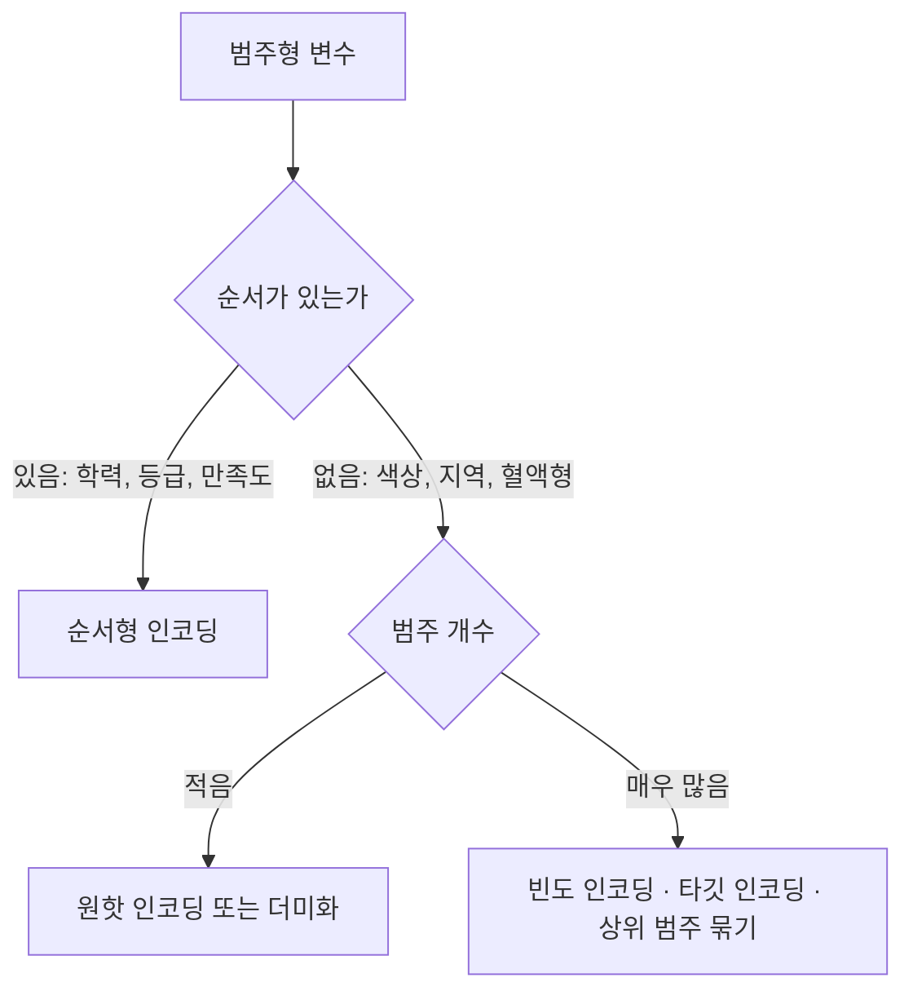

<Callout type="info">
  **이번 문서의 목표:** 표준화와 정규화를 손으로 계산해 구분하고, 순서가 있는 범주와 없는 범주에 어떤 인코딩을 써야 하는지 판정하며, 스케일링이 필요한 알고리즘과 필요 없는 알고리즘을 근거를 들어 나눌 수 있게 된다.
</Callout>

## 왜 값을 그대로 쓰면 안 되는가

11편에서 결측과 이상치를 정리했습니다. 이제 데이터에 빈칸도 없고 말이 안 되는 값도 없습니다. 그런데 아직 모델에 넣을 수 없습니다. 두 가지 문제가 남아 있기 때문입니다.

- **단위가 제각각입니다.** 나이는 20에서 70 사이인데 연소득은 2000만에서 1억 사이입니다. 두 변수의 거리를 함께 계산하면 소득의 숫자가 커서 나이는 사실상 무시됩니다
- **범주는 숫자가 아닙니다.** 성별이 "남", "여"로 들어 있으면 덧셈도 거리 계산도 할 수 없습니다

**변수 변환**(transformation)은 이 두 문제를 해결해, 값의 의미는 유지하면서 모델이 다룰 수 있는 형태로 바꾸는 작업입니다.

> **쉽게 말하면:** 재료를 다 손질했으니 이제 **같은 크기로 썰고, 숫자가 아닌 것은 숫자로 바꾸는** 단계입니다.

시험에서 이 주제는 계산 문제와 판정 문제가 반반입니다. 계산은 표준화·정규화 공식 대입이고, 판정은 "이 상황에서 어떤 인코딩·스케일링이 적절한가"입니다.

## 1. 수치형 변수 변환 — 분포의 모양을 바꾸기

### 변환의 목적

합격 노트에 적힌 표현 그대로, 수치형 변수 변환의 목적은 **분포를 대칭화하고 산포를 균일화**하는 것입니다.

**왜 대칭이 좋은가:** 소득·매출·조회수처럼 오른쪽으로 길게 늘어진 분포에서는 평균이 소수의 큰 값에 끌려가고, 회귀모형의 잔차가 한쪽으로 몰립니다. 대칭에 가까워지면 평균이 중심을 제대로 대표하고 많은 통계 기법의 가정이 충족됩니다.

### 로그 변환

$$
x' = \log(x)
$$

- $x$: 원래 값 (반드시 양수)
- $x'$: 변환된 값

**손계산으로 압축 효과를 확인해 봅시다.** 자료가 1, 10, 100, 1000이라고 합시다. 상용로그를 취하면

$$
\log_{10} 1 = 0
$$

$$
\log_{10} 10 = 1
$$

$$
\log_{10} 100 = 2
$$

$$
\log_{10} 1000 = 3
$$

**해석:** 원래 자료에서 1과 10의 간격은 9이고 100과 1000의 간격은 900이었습니다. 무려 100배 차이입니다. 변환 후에는 두 간격이 모두 1로 같아졌습니다. **로그는 큰 값 쪽의 간격을 훨씬 강하게 압축**합니다. 그래서 오른쪽 꼬리가 긴 분포가 대칭에 가까워집니다.

**로그 변환의 함정 — 시험에 나옵니다:**

- $\log 0$ 은 정의되지 않고 음수의 로그도 정의되지 않습니다. 0이 포함된 자료에는 그대로 쓸 수 없습니다
- 해결책으로 $x + 1$ 에 로그를 취하는 방법을 씁니다. 이때 원래 0이던 값은 $\log 1 = 0$ 이 되어 안전하게 처리됩니다
- **왼쪽으로 꼬리가 긴 분포에는 로그가 도움이 되지 않습니다.** 로그는 오른쪽 꼬리를 줄이는 도구입니다

### 주요 변환 기법 비교

| 기법 | 수식 | 주 용도 | 제약 |
|------|------|---------|------|
| 로그 변환 | $\log x$ | 오른쪽 꼬리가 긴 분포를 대칭화 | 0 이하 값 불가 |
| 제곱근 변환 | $\sqrt{x}$ | 로그보다 약한 압축, 도수 자료에 적합 | 음수 불가 |
| 지수 변환 | $e^{x}$ | 왼쪽으로 치우친 분포를 늘림 | 값이 급격히 커짐 |
| 제곱 변환 | $x^{2}$ | 왼쪽 꼬리가 긴 분포 보정 | 큰 값이 더 커짐 |
| 박스콕스 변환 | 생략 | 분포를 정규분포에 가깝게, **분산 안정화** | 양수만 가능 |

**박스콕스**(Box–Cox) **변환의 위치:** 로그와 제곱근을 하나의 모수 $\lambda$ (람다)로 묶은 일반화된 변환입니다. 데이터에 가장 잘 맞는 $\lambda$ 를 자동으로 찾아 줍니다. 시험에서는 정의만 물어봅니다. **"분포를 정규분포에 가깝게 만들고 분산을 안정화하는 변환"** 이 핵심 서술입니다.

## 2. 스케일링 — 값의 범위를 맞추기

변환이 **모양**을 바꾸는 일이라면, 스케일링은 **크기**를 맞추는 일입니다. 둘은 다른 목적이므로 함께 쓰이기도 합니다.

### 표준화

$$
z = \frac{x - \mu}{\sigma}
$$

- $z$: 표준화된 값
- $x$: 원래 값
- $\mu$ (뮤): 평균
- $\sigma$ (시그마): 표준편차

**결과의 성질:** 변환된 변수의 평균은 0, 분산은 1이 됩니다. 값의 범위는 정해지지 않습니다. 극단값이 있으면 표준화 후에도 5나 6 같은 큰 값이 남습니다.

**손계산.** 자료가 2, 4, 4, 4, 5, 5, 7, 9 (8개)라고 합시다.

**1단계 — 평균**

$$
\mu = \frac{2 + 4 + 4 + 4 + 5 + 5 + 7 + 9}{8} = \frac{40}{8} = 5
$$

**2단계 — 편차와 제곱.** 각 값에서 5를 뺍니다.

편차: –3, –1, –1, –1, 0, 0, 2, 4
편차의 제곱: 9, 1, 1, 1, 0, 0, 4, 16

**3단계 — 모분산과 모표준편차**

$$
\sigma^2 = \frac{9 + 1 + 1 + 1 + 0 + 0 + 4 + 16}{8} = \frac{32}{8} = 4
$$

$$
\sigma = \sqrt{4} = 2
$$

**4단계 — 표준화.** 값 9를 표준화하면

$$
z = \frac{9 - 5}{2} = \frac{4}{2} = 2
$$

값 2를 표준화하면

$$
z = \frac{2 - 5}{2} = \frac{-3}{2} = -1.5
$$

**해석:** 9는 평균보다 표준편차 2개만큼 위, 2는 평균보다 표준편차 1.5개만큼 아래입니다. 표준화된 값은 **단위가 사라진 상대적 위치**입니다. 그래서 키(cm)와 몸무게(kg)를 같은 자로 비교할 수 있게 됩니다.

### 표준화를 일차식으로 보기 — 기출 유형

기출에는 "표본평균이 30, 표본표준편차가 6인 변수 $x$ 를 $z = ax + b$ 로 표준화할 때 $a$ 와 $b$ 는?"이라는 형태가 나옵니다. 정의를 그대로 풀어쓰면 됩니다.

$$
z = \frac{x - 30}{6} = \frac{x}{6} - \frac{30}{6}
$$

$$
z = \frac{1}{6}x - 5
$$

- 기울기 $a = \frac{1}{6}$ — 표준편차의 역수
- 절편 $b = -5$ — 평균을 표준편차로 나눈 값에 음수 부호

**여기서 틀리는 지점:** $a$ 에 표준편차 6을 그대로 넣는 실수가 가장 많습니다. 표준화는 표준편차로 **나누는** 것이므로 계수는 역수입니다.

### 정규화 (최소–최대 스케일링)

$$
x' = \frac{x - x_{min}}{x_{max} - x_{min}}
$$

- $x_{min}$: 해당 변수의 최솟값
- $x_{max}$: 해당 변수의 최댓값
- $x'$: 0과 1 사이로 조정된 값

**손계산.** 키 자료의 최솟값이 150, 최댓값이 190일 때 키 160을 정규화하면

$$
x' = \frac{160 - 150}{190 - 150} = \frac{10}{40} = 0.25
$$

**해석:** 160은 전체 범위의 아래에서 25퍼센트 지점입니다. 최솟값은 항상 0, 최댓값은 항상 1이 됩니다.

**정규화의 치명적 약점:** 분모와 분자가 모두 **최솟값·최댓값에만 의존**합니다. 자료에 극단값이 하나 섞여 있으면 그 값이 1을 차지하고 나머지 값들은 0 근처에 뭉칩니다. 이상치가 있는 자료에 최소–최대 정규화를 그대로 쓰면 안 되는 이유입니다.

### 로버스트 스케일링

$$
x' = \frac{x - M}{IQR}
$$

- $M$: 중앙값
- $IQR$: 사분위범위, 곧 $Q_3 - Q_1$

**왜 필요한가:** 중앙값과 IQR은 11편에서 본 대로 극단값에 흔들리지 않는 순위 기반 통계량입니다. 이상치가 남아 있는 자료에 가장 안전한 스케일링입니다.

### 세 방법을 언제 쓰는가

| 방법 | 중심 | 척도 | 결과 범위 | 이상치에 | 적합한 상황 |
|------|------|------|-----------|----------|-------------|
| 표준화 | 평균 | 표준편차 | 제한 없음 | 민감 | 정규분포에 가깝고 이상치가 정리된 자료 |
| 정규화 | 최솟값 | 범위 | 0–1 고정 | **매우 민감** | 값의 상한·하한이 분명한 자료, 신경망 입력 |
| 로버스트 | 중앙값 | IQR | 제한 없음 | 강건 | 이상치가 남아 있는 자료 |

**판정 요령:** 문제에 "극단값이 존재한다", "소득처럼 치우친 자료"라는 단서가 있으면 **로버스트 스케일링 또는 로그 변환 후 표준화**가 답입니다. "0과 1 사이로 맞춰야 한다"는 단서가 있으면 정규화입니다.

### 스케일링이 필요한 알고리즘과 필요 없는 알고리즘

이 구분이 사례 판단형으로 자주 나옵니다.

| 필요함 | 이유 |
|--------|------|
| KNN, K-means | **거리**로 판단하므로 큰 단위의 변수가 거리를 독점함 |
| SVM | 마진 계산이 거리 기반 |
| 주성분분석 | 분산이 큰 변수가 주성분을 독점함 |
| 신경망, 규제 회귀 | 학습 안정성과 벌점의 공정성 |

| 필요 없음 | 이유 |
|-----------|------|
| 의사결정나무 | 각 변수를 **한 번에 하나씩 기준값과 비교**할 뿐이라 단위와 무관 |
| 랜덤포레스트, 부스팅 계열 | 나무 기반이므로 같은 이유 |
| 나이브 베이즈 | 변수별 확률을 따로 계산 |

**해석:** 나무 계열이 스케일링에 영향받지 않는 이유는 분할 기준이 "소득이 5000만 이상인가?" 같은 **순서 비교**이기 때문입니다. 소득을 표준화해도 값들의 순서는 바뀌지 않으므로 분할도 그대로입니다.

## 3. 범주형 변수 인코딩

### 그 범주에 순서가 있는가

인코딩 선택의 첫 질문은 언제나 이것입니다.

### 레이블 인코딩과 그 위험

**레이블 인코딩**(label encoding)은 각 범주에 숫자를 붙입니다. 빨강은 1, 파랑은 2, 초록은 3.

**여기에 함정이 있습니다.** 모델은 이 숫자를 **크기**로 읽습니다. 그러면 초록(3)이 빨강(1)보다 3배 크고, 빨강과 초록의 중간이 파랑이라는 뜻이 됩니다. 색상에는 그런 관계가 없습니다.

> **쉽게 말하면:** 순서 없는 범주에 번호를 매기면, **없던 순서를 모델에게 거짓으로 알려 주는 것**입니다.

**그러면 언제 써도 되는가:**

- 원래 순서가 있는 범주일 때 — 초졸 1, 중졸 2, 고졸 3, 대졸 4는 실제 순서를 반영합니다
- 나무 계열 모델을 쓸 때 — 나무는 크기 비교로 분할하므로 순서 없는 범주에도 상대적으로 피해가 적습니다. 다만 이상적이지는 않습니다

### 원핫 인코딩과 더미화

**원핫 인코딩**(one-hot encoding)은 범주 개수만큼 열을 만들어, 해당하는 열에만 1을 넣고 나머지는 0을 넣습니다.

| 원래 색상 | 빨강 여부 | 파랑 여부 | 초록 여부 |
|-----------|-----------|-----------|-----------|
| 빨강 | 1 | 0 | 0 |
| 파랑 | 0 | 1 | 0 |
| 초록 | 0 | 0 | 1 |

**해석:** 이제 어떤 두 범주 사이의 거리도 같습니다. 빨강과 파랑의 거리나 빨강과 초록의 거리나 동일합니다. 가짜 순서가 사라졌습니다.

**더미화와의 미묘한 차이:** 위 표에서 앞의 두 열만 봐도 색상을 완전히 알 수 있습니다. 둘 다 0이면 초록이기 때문입니다. 그래서 회귀모형에서는 범주 개수보다 **하나 적은** 열만 만듭니다. 이것이 **더미 변수**(dummy variable) 방식입니다.

**왜 하나를 빼는가:** 모든 열을 다 넣으면 열들의 합이 항상 1이 되어 **완전한 다중공선성**이 생깁니다. 회귀계수를 유일하게 추정할 수 없습니다. 이것을 **더미 변수 함정**(dummy variable trap)이라 부릅니다. 반면 나무 계열이나 거리 기반 모델에서는 모든 열을 쓰는 원핫이 자연스럽습니다.

### 원핫 인코딩의 대가 — 차원 폭발

우편번호처럼 범주가 수천 개인 변수를 원핫 인코딩하면 열이 수천 개 생깁니다. 대부분의 칸이 0인 **희소한**(sparse) 행렬이 되어 메모리를 낭비하고 학습이 느려지며 과적합 위험이 커집니다.

| 대안 | 내용 |
|------|------|
| 빈도 인코딩 | 각 범주를 그 범주의 등장 횟수 또는 비율로 치환 |
| 타깃 인코딩 | 각 범주를 그 범주에서의 목표변수 평균으로 치환 |
| 상위 범주 묶기 | 드문 범주들을 하나의 기타 범주로 통합 |
| 도메인 기반 축약 | 우편번호를 시·도 단위로 올려서 범주 수를 줄임 |

**타깃 인코딩의 위험:** 목표변수 정보를 입력에 넣는 것이므로 **데이터 누수**가 발생하기 쉽습니다. 반드시 학습 데이터 안에서만, 그것도 교차검증 방식으로 계산해야 합니다.

## 4. 구간화와 파생변수

### 구간화

**구간화**(binning)는 연속형 값을 구간으로 묶어 범주로 만드는 작업입니다. 나이를 연령대로 바꾸는 것이 대표 예입니다.

| 장점 | 단점 |
|------|------|
| 극단값의 영향을 없앰 | 구간 안의 세부 정보가 사라짐 |
| 비선형 관계를 표현할 수 있음 | 경계 바로 양쪽의 두 값이 다른 범주가 됨 |
| 결과 해석과 보고가 쉬움 | 구간을 어떻게 나누느냐에 결과가 좌우됨 |

**경계 문제의 예:** 29세와 30세는 하루 차이지만 20대와 30대로 갈라집니다. 반면 30세와 39세는 아홉 살 차이인데 같은 범주입니다. 구간화는 **정보를 버리는 대가로 안정성을 얻는** 거래입니다.

### 파생변수

**파생변수**(derived variable)는 기존 변수를 조합·가공해 만든 새 변수입니다.

| 원래 변수 | 파생변수 |
|-----------|----------|
| 날짜 | 요일, 주말 여부, 공휴일 여부, 분기 |
| 키, 몸무게 | 체질량지수 |
| 시간 단위 기온 | 월평균 기온 |
| 주소 | 위도, 경도 |
| 주문 이력 여러 건 | 최근 90일 누적구매액, 평균 주문 간격 |

**기출 판정:** "주문 원천 테이블에서 고객별 최근 90일 주문금액을 합산해 만든 90일 누적구매액은 어떤 변수인가?"의 답은 **파생변수**입니다. 원천 필드를 그대로 쓴 것이 아니라 **기간 조건으로 묶어 합계 연산을 거쳐 만들어진** 값이기 때문입니다. 원시 입력 변수는 원천에 그대로 존재하는 값이고, 식별자 변수는 행을 구별하는 열이며, 결측 표시값은 값의 부재를 나타내는 표식입니다.

**왜 파생변수가 중요한가:** 모델의 성능을 좌우하는 것은 알고리즘보다 **어떤 변수를 넣었느냐**인 경우가 많습니다. 원본에 없던 업무 지식을 변수로 만들어 넣는 작업이 특징 공학의 핵심입니다.

## 5. 변수 선택과 차원 축소

변수를 늘리기만 하면 안 됩니다. 변수가 많아지면 계산이 무거워지고, 데이터가 희박해지며(차원의 저주), 과적합이 심해집니다.

### 변수 선택 세 방식

| 방식 | 절차 | 특징 |
|------|------|------|
| 전진선택 | 변수 0개에서 시작해 매 단계 하나씩 **추가** | 개선이 없으면 중단. 한 번 넣은 변수는 빼지 않음 |
| 후진제거 | 모든 변수에서 시작해 매 단계 하나씩 **제거** | 변수가 매우 많으면 계산 부담이 큼 |
| 단계적 방법 | 매 단계 추가와 제거를 모두 검토 | 앞 단계 결정을 되돌릴 수 있어 유연 |

**여기서 틀리는 지점:** 전진선택과 후진제거의 방향을 바꿔 서술한 보기가 자주 나옵니다. **전진은 비어 있는 데서 채워 가고, 후진은 가득 찬 데서 덜어 낸다**로 외우면 헷갈리지 않습니다.

### 차원 축소

**차원 축소**는 변수를 골라내는 것이 아니라, **모든 변수의 정보를 고려하면서 더 적은 수의 새 축으로 요약**하는 방법입니다.

- **주성분분석**(PCA): 데이터의 분산을 가장 많이 설명하는 축을 차례로 찾습니다. 첫 번째 주성분이 전체 분산의 71퍼센트를 설명하고 두 번째가 22퍼센트를 설명한다면, 두 개만으로 전체의 93퍼센트를 설명하는 셈입니다
- **스크리 플롯**(엘보우 플롯): 설명되는 분산이 급격히 꺾이는 지점을 보고 주성분 개수를 정합니다. K-means의 군집 수 결정에도 같은 도구를 씁니다
- 그 밖에 다차원척도법, 요인분석, 특이값분해, t-SNE, 라쏘·릿지 등이 차원 축소·축약 계열로 함께 묶여 출제됩니다

**변수 선택과 차원 축소의 결정적 차이:** 변수 선택 후에는 남은 변수의 **원래 의미가 그대로 살아 있습니다.** 차원 축소 후의 주성분은 여러 원변수가 섞인 조합이라 **해석이 어렵습니다.** 해석이 중요한 과제에서는 변수 선택을 선호하는 이유입니다.

## 6. 불균형 데이터 처리

이상거래가 전체의 1퍼센트뿐인 자료에서는 "모두 정상"이라고만 답해도 정확도가 99퍼센트입니다. 그런데 정작 잡아야 할 것은 하나도 못 잡습니다.

| 기법 | 내용 | 부작용 |
|------|------|--------|
| 언더샘플링 | 다수 클래스의 일부를 삭제해 비율을 맞춤 | 다수 클래스의 정보 손실 |
| 오버샘플링 | 소수 클래스를 복원추출로 늘림 | **같은 행이 여러 번** 들어가 과적합 위험 |
| SMOTE | 소수 사례와 가까운 소수 이웃 사이의 특징값을 **보간해 새 관측치를 생성** | 잡음이 있으면 이상한 합성값 생성 |
| 가중치 부여 | 소수 클래스의 오분류에 더 큰 벌점 | 데이터는 그대로 두므로 가장 간편 |

**기출에서 반드시 걸러야 할 오답:** "SMOTE의 합성 행은 기존 소수 사례를 값 변경 없이 복제한 것이다"는 **틀린 서술**입니다. 값을 그대로 복제하는 것은 단순 오버샘플링이고, SMOTE는 이웃과의 사이를 **보간**해 원본에 없던 새 값을 만듭니다. 두 기법의 차이가 정확히 이 지점입니다.

## 7. 순서와 데이터 누수

변환·인코딩·스케일링에도 순서 원칙이 있습니다.

<Steps>

1. **결측·이상치를 먼저 정리한다** — 결측이 있는 채로 평균·표준편차를 계산할 수 없습니다
2. **학습과 검증 데이터를 나눈다**
3. **학습 데이터에서만 변환 기준을 계산한다** — 평균, 표준편차, 최솟값, 최댓값, 범주 목록
4. **그 기준을 학습과 검증 데이터에 똑같이 적용한다**

</Steps>

**3번이 왜 이 위치인가:** 전체 데이터로 평균과 표준편차를 구한 뒤 나누면, 검증 데이터의 정보가 변환 기준에 섞여 들어갑니다. 검증 성능이 실제보다 좋게 나오고, 실제 서비스에서는 그만큼 나오지 않습니다. 11편에서 본 결측 대치의 누수와 완전히 같은 구조입니다.

**실무에서 자주 터지는 문제:** 검증 데이터에만 나타나는 새 범주가 있으면 원핫 인코딩 열이 어긋납니다. 학습 시점의 범주 목록을 고정해 두고, 새 범주는 기타로 처리해야 합니다.

## 핵심 정리

- **표준화**는 평균 0·분산 1로 맞추고, **정규화**(최소–최대)는 0과 1 사이로 맞추며, **로버스트 스케일링**은 중앙값과 IQR을 써서 이상치에 강건하다.
- $z = ax + b$ 형태로 물으면 $a$ 는 **표준편차의 역수**, $b$ 는 평균을 표준편차로 나눈 값의 음수다.
- **거리 기반**(KNN·K-means·SVM)과 PCA·신경망은 스케일링이 필요하고, **나무 계열**은 순서 비교만 하므로 필요 없다.
- 순서 없는 범주에 레이블 인코딩을 쓰면 **없던 순서를 만들어** 낸다. 원핫 인코딩이 원칙이며, 회귀에서는 다중공선성을 피하려 하나 적은 더미 변수를 쓴다.
- 로그 변환은 **오른쪽 꼬리**를 압축하고 0 이하 값에는 쓸 수 없으며, 박스콕스는 분포를 정규에 가깝게 하고 분산을 안정화한다.
- 전진선택은 비어 있는 데서 추가, 후진제거는 가득 찬 데서 제거, 단계적 방법은 둘을 병행한다. 차원 축소는 새 축으로 요약하므로 해석이 어렵다.
- **SMOTE는 복제가 아니라 이웃 사이의 보간**이며, 단순 오버샘플링과 구분해야 한다.
- 변환 기준은 반드시 **학습 데이터에서만** 계산해 검증 데이터에 적용한다.

## 마무리 복습

<Quiz
  questionNumber={1}
  question="표본평균이 30, 표본표준편차가 6인 변수 x를 z=ax+b 형태로 표준화할 때 a와 b의 순서쌍으로 옳은 것은?"
  options={['(6, -5)', '(1/6, 5)', '(1/6, -5)', '(1/30, -6)']}
  correctAnswer={3}
  explanation="표준화 정의에 따라 z=(x-30)÷6이며 이를 전개하면 z=(1/6)x-5다. 따라서 기울기는 표준편차의 역수인 1/6이고 절편은 평균을 표준편차로 나눈 값에 음수 부호를 붙인 -5다."
  optionExplanations={['표준편차로 나누어야 하므로 계수는 6이 아니라 그 역수다.', '절편의 부호가 반대이며 평균을 빼는 연산이므로 음수여야 한다.', '(x-30)÷6=(1/6)x-5이므로 정확하다.', '평균과 표준편차의 역할을 서로 뒤바꾼 값이다.']}
/>

<Quiz
  questionNumber={2}
  question="자료 2, 4, 4, 4, 5, 5, 7, 9의 평균은 5, 모표준편차는 2다. 값 9를 표준화한 결과와 최솟값 2를 최소-최대 정규화한 결과를 바르게 짝지은 것은?"
  options={['표준화 2, 정규화 0', '표준화 4, 정규화 0.25', '표준화 2, 정규화 1', '표준화 0.5, 정규화 0']}
  correctAnswer={1}
  explanation="표준화는 (9-5)÷2=2다. 최소-최대 정규화는 (2-2)÷(9-2)=0이며, 정규화에서 최솟값은 언제나 0이 되고 최댓값은 언제나 1이 된다."
  optionExplanations={['표준화 2와 최솟값의 정규화 결과 0이 모두 맞다.', '표준편차로 나누지 않고 편차만 쓴 값이며 정규화 값도 최솟값 결과와 다르다.', '정규화에서 1이 되는 것은 최댓값이지 최솟값이 아니다.', '표준편차와 편차를 뒤바꿔 나눈 값이다.']}
/>

<Quiz
  questionNumber={3}
  question="소득처럼 소수의 극단적으로 큰 값이 포함된 변수를 스케일링하려 한다. 가장 적절하지 않은 방법은?"
  options={['중앙값과 사분위범위를 사용하는 로버스트 스케일링', '최솟값과 최댓값을 사용하는 최소-최대 정규화', '로그 변환을 먼저 적용한 뒤 표준화', '이상치의 원인을 확인한 뒤 처리 방식을 정하고 스케일링']}
  correctAnswer={2}
  explanation="최소-최대 정규화는 분모와 분자가 모두 최솟값과 최댓값에만 의존하므로 극단값 하나가 1을 차지하고 나머지 값이 0 근처로 몰린다. 중앙값과 사분위범위는 순위 기반이라 극단값에 강건하고 로그 변환은 큰 값 쪽 간격을 압축한다."
  optionExplanations={['중앙값과 사분위범위는 극단값에 흔들리지 않으므로 적절하다.', '극단값에 가장 취약한 방법이므로 이 상황에 부적절하다.', '로그 변환은 오른쪽 꼬리를 압축해 이후 표준화를 안정시킨다.', '원인 확인 후 처리하는 것은 전처리의 기본 원칙이다.']}
/>

<Quiz
  questionNumber={4}
  question="범주형 변수 인코딩에 대한 설명으로 가장 적절한 것은?"
  options={['순서가 없는 색상 변수에 1, 2, 3을 부여하면 모델이 크기 관계를 학습할 수 있어 유리하다', '원핫 인코딩은 범주 사이의 거리를 모두 동일하게 만들어 가짜 순서를 없앤다', '원핫 인코딩은 범주가 수천 개여도 열이 늘지 않아 효율적이다', '학력처럼 순서가 있는 범주에는 원핫 인코딩만 사용할 수 있다']}
  correctAnswer={2}
  explanation="원핫 인코딩은 각 범주를 서로 독립된 0과 1 열로 표현하므로 어떤 두 범주 사이의 거리도 같아지고, 레이블 인코딩이 만들어 내는 인위적 크기 관계가 사라진다."
  optionExplanations={['없던 순서를 모델에 거짓으로 알려 주는 것이므로 불리하다.', '거리가 균등해져 인위적 순서가 제거되므로 옳다.', '범주 수만큼 열이 생겨 차원이 폭발하는 것이 원핫의 대표적 단점이다.', '순서가 있는 범주에는 순서를 보존하는 순서형 인코딩이 오히려 적합하다.']}
/>

<Quiz
  questionNumber={5}
  question="스케일링의 영향을 사실상 받지 않는 알고리즘으로 가장 적절한 것은?"
  options={['K-최근접 이웃', '의사결정나무', 'K-평균 군집', '주성분분석']}
  correctAnswer={2}
  explanation="의사결정나무는 각 변수를 기준값과 비교하는 순서 비교로 분할하므로, 단조 변환인 스케일링을 해도 값들의 순서가 바뀌지 않아 분할 결과가 동일하다. 나머지 셋은 거리나 분산의 크기를 직접 사용하므로 단위 차이에 크게 영향받는다."
  optionExplanations={['거리를 계산하므로 큰 단위 변수가 거리를 독점한다.', '순서 비교만 하므로 단위와 무관하다.', '중심과의 거리로 군집을 나누므로 스케일에 민감하다.', '분산이 큰 변수가 주성분을 독점하므로 스케일링이 필요하다.']}
/>

<Quiz
  questionNumber={6}
  question="이상거래가 1퍼센트인 학습 자료의 재표본화에 대한 설명 중 옳지 않은 것은?"
  options={['다수 클래스를 무작위로 줄이면 정상 거래의 일부 정보를 잃을 수 있다', '소수 클래스를 복원추출하면 같은 이상거래 행이 여러 번 포함될 수 있다', 'SMOTE의 합성 행은 선택된 기존 소수 사례를 값 변경 없이 복제한 것이다', 'SMOTE는 소수 사례와 가까운 소수 이웃 사이에서 특징값을 보간한다']}
  correctAnswer={3}
  explanation="SMOTE는 소수 사례와 그 이웃 사이의 특징값을 보간해 원본에 없던 새 관측치를 만드는 기법이다. 값 변경 없이 그대로 복제하는 것은 단순 오버샘플링이며 두 기법을 구분해야 한다."
  optionExplanations={['언더샘플링은 다수 클래스 정보 손실을 동반하므로 옳은 설명이다.', '복원추출 오버샘플링의 정확한 특징이다.', '단순 복제는 오버샘플링의 특징이며 SMOTE는 보간으로 새 값을 만든다.', 'SMOTE의 핵심 원리를 정확히 서술했다.']}
/>

<Quiz
  questionNumber={7}
  question="주문 원천 테이블에서 고객별 최근 90일 주문금액을 합산해 만든 90일 누적구매액은 어떤 변수에 해당하는가?"
  options={['식별자 변수', '원시 입력 변수', '파생 변수', '결측 표시값']}
  correctAnswer={3}
  explanation="여러 주문 레코드를 기간 조건으로 묶어 합계 연산으로 만든 값이므로 원천 필드를 그대로 쓴 것이 아니라 계산으로 생성한 파생 변수다."
  optionExplanations={['식별자는 행을 구별하기 위한 키 역할의 열이다.', '원시 입력 변수는 원천에 그대로 존재하는 값을 뜻한다.', '기간 조건과 합계 연산으로 새로 만든 값이므로 파생 변수가 맞다.', '결측 표시값은 값의 부재를 나타내는 표식이지 계산 결과가 아니다.']}
/>

<Quiz
  questionNumber={8}
  question="회귀분석에서 범주가 3개인 변수를 더미 변수로 처리할 때 열을 2개만 만드는 이유로 가장 적절한 것은?"
  options={['열이 적을수록 계산이 빨라지기 때문이다', '세 열을 모두 넣으면 합이 항상 1이 되어 완전한 다중공선성이 생기기 때문이다', '세 번째 범주는 분석에서 제외해야 하기 때문이다', '원핫 인코딩은 회귀분석에서 사용할 수 없기 때문이다']}
  correctAnswer={2}
  explanation="세 열의 합이 항상 1인 완전한 선형종속이 생기면 회귀계수를 유일하게 추정할 수 없다. 이것이 더미 변수 함정이며, 앞의 두 열이 모두 0이라는 사실만으로 세 번째 범주가 표현되므로 정보 손실도 없다."
  optionExplanations={['계산 속도는 부차적인 효과일 뿐 근본 이유가 아니다.', '완전한 다중공선성으로 계수 추정이 불가능해지는 것이 핵심 이유다.', '세 번째 범주는 제외되는 것이 아니라 기준 범주로 남아 표현된다.', '나무 계열이나 거리 기반 모델에서는 원핫을 그대로 쓰며 회귀에서만 하나를 뺀다.']}
/>

## 참고 자료

- [코리아IT아카데미 - 빅데이터 분석기사](https://www.koreaisacademy.com/2025/cer/datascience/bigdata.asp)
- [Inflearn 가이드 - 빅데이터분석기사 어떻게 준비해야 할까?](https://www.inflearn.com/pages/bigdata-analysis-engineer-guide)
- [YDDaily - 빅데이터 분석기사 완벽 가이드](https://yddaily.com/%EB%B9%85-%EB%8D%B0%EC%9D%B4%ED%84%B0-%EB%B6%84%EC%84%9D-%EA%B8%B0%EC%82%AC/)
- [김앤북 - 내일은 빅데이터분석기사 필기 핵심 요약집](https://www.kimnbook.co.kr/book/detail/100)
