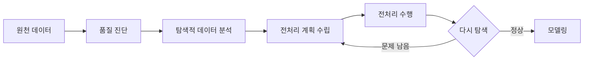

<Callout type="info">
  **이번 문서의 목표:** 데이터 품질 요소를 사례에 대고 정확히 판정하고, 변수 개수와 자료 유형에 따라 어떤 탐색 도구를 써야 하는지 고르며, 상관계수를 손으로 계산하고 그 한계를 설명할 수 있게 된다.
</Callout>

## 진단이 먼저인가, 처리가 먼저인가

11편과 12편에서 결측·이상치·변환을 다뤘습니다. 그런데 순서를 생각해 보면 이상합니다. **무엇이 문제인지 모르는 채로 어떻게 처리 방법을 고를 수 있을까요?**

실제 순서는 이렇습니다.

**진단과 탐색이 전처리 앞뒤를 감쌉니다.** 전처리 전에는 무엇을 고칠지 알기 위해, 전처리 후에는 제대로 고쳐졌는지 확인하기 위해 탐색합니다. 이 편은 그 진단과 탐색의 도구를 정리합니다.

> **쉽게 말하면:** 요리 전에 재료를 살펴보고, 손질한 뒤에 다시 살펴보는 일입니다.

## 1. 데이터 품질 요소 — 정의를 사례로 구분하기

시험에서 품질 요소는 **연결 짝짓기**나 **잘못된 설명 고르기**로 나옵니다. 정의를 외우는 것보다 **각 요소가 어떤 종류의 문제를 잡아내는지**를 아는 것이 빠릅니다.

| 요소 | 정의 | 위반 사례 |
|------|------|-----------|
| 정확성 | 값이 실제 대상의 상태를 바르게 반영하는 정도 | 서울 거주 고객의 주소가 부산으로 입력됨 |
| 완전성 | 필요한 레코드와 필수 값이 **빠짐없이** 존재하는 정도 | 주문 10만 건 중 3만 건에 결제수단이 비어 있음 |
| 일관성 | 서로 다른 시스템의 동일 항목이 **모순되지 않는** 정도 | 회원 시스템은 남성, 주문 시스템은 여성으로 기록됨 |
| 적시성 | 필요한 업무 시점에 데이터를 사용할 수 있는 정도 | 오늘 판매 대응에 필요한데 어제 마감분까지만 있음 |
| 유일성 | 같은 대상이 **중복 없이** 한 번만 존재하는 정도 | 같은 고객이 회원번호 두 개로 등록됨 |
| 유효성 | 값이 정해진 형식·범위·규칙을 지키는 정도 | 나이 열에 250, 이메일 열에 골뱅이표 없는 문자열 |

**기출에서 실제로 나온 함정:** "완전성 — 분석자가 선호하는 열만 골라 남긴 정도"라는 보기가 **틀린 연결**로 출제되었습니다. 완전성은 **필요한 값이 빠짐없이 있는지**를 뜻하지, 분석자가 주관적으로 열을 고르는 행위가 아닙니다. 이런 문제는 "주관적", "분석자가 원하는", "임의로"라는 단어가 정의에 끼어들면 거의 오답입니다.

**정확성과 유효성을 구분하는 요령:** 나이 250은 **형식·범위 규칙**을 어겼으므로 유효성 문제입니다. 실제로는 35세인데 45로 입력된 것은 규칙은 지켰지만 사실과 다르므로 **정확성** 문제입니다. 유효성은 데이터만 보고 잡을 수 있고, **정확성은 현실과 대조해야만 잡을 수 있습니다.**

## 2. 품질 진단에서 실제로 확인하는 것

<Steps>

1. **구조 확인** — 행 수, 열 수, 각 열의 자료형이 의도대로인가
2. **결측 진단** — 열별 결측 비율, 결측이 특정 행·집단에 몰려 있는가
3. **이상치 진단** — 최솟값·최댓값이 현실적인가, 상자그림에서 튀는 값이 있는가
4. **중복 진단** — 완전히 같은 행, 키는 같은데 값이 다른 행
5. **불일치 진단** — 같은 뜻인데 표기가 다른 값, 시스템 간 값 충돌
6. **규칙 위반 진단** — 가입일보다 이른 주문일, 합계와 항목별 값의 불일치

</Steps>

### 중복의 두 얼굴

중복에는 성격이 다른 두 종류가 있어 처리도 다릅니다.

| 종류 | 상황 | 처리 |
|------|------|------|
| 완전 중복 | 모든 열의 값이 동일한 행이 두 번 | 하나만 남기고 제거 |
| 키 중복, 값 불일치 | 같은 회원번호인데 주소가 다름 | **함부로 지우면 안 됨** — 어느 쪽이 맞는지 확인 필요 |
| 의미상 중복 | 같은 사람이 다른 회원번호로 두 번 가입 | 개체 해소 작업 필요, 자동 제거 불가 |

**왜 두 번째 줄이 위험한가:** 자동으로 앞의 행만 남기면 최신 주소를 버리게 될 수 있습니다. 갱신 시각 같은 기준 없이 중복을 제거하면 **어느 정보가 살아남았는지 통제할 수 없습니다.**

### 표기 불일치

같은 뜻인데 표기가 다르면 집계할 때 다른 범주로 갈라집니다.

| 문제 | 예시 |
|------|------|
| 대소문자 | Seoul, seoul, SEOUL |
| 공백 | 서울, 서울 뒤 공백 한 칸 |
| 표기 방식 | 서울, 서울시, 서울특별시 |
| 단위 | 매출을 어떤 행은 원, 어떤 행은 천원 단위로 |
| 날짜 형식 | 2025-03-01, 2025/03/01, 03-01-2025 |

**단위 불일치가 가장 무섭습니다.** 형식 오류는 눈에 보이지만, 천원 단위로 들어온 매출은 그냥 작은 숫자로 보일 뿐이라 **탐지되지 않은 채 통과합니다.** 그래서 열마다 단위를 명시한 메타데이터가 필요합니다.

## 3. 탐색적 데이터 분석이란

**탐색적 데이터 분석**(EDA)은 데이터가 가지는 특성을 파악하기 위해 데이터를 탐색·요약·시각화하는 분석 과정입니다.

**핵심 성격:** 가설을 세워 검증하는 것이 아니라, **데이터가 무엇을 말하는지 먼저 들어 보는** 단계입니다. 어떤 결과가 나올지 정해 두지 않고 봅니다.

### EDA의 네 가지 원칙

| 원칙 | 뜻 |
|------|-----|
| 저항성 | 일부 값이 극단적으로 튀어도 결과가 크게 흔들리지 않아야 함. 평균보다 중앙값을 보는 태도 |
| 잔차 해석 | 요약값으로 설명되지 않고 남은 부분에 주목. 왜 그 값이 벗어났는지 |
| 자료 재표현 | 로그·제곱근 등으로 축을 바꿔 보면 안 보이던 구조가 드러남 |
| 현시성 | 숫자표보다 그림이 구조를 더 잘 드러냄 |

**해석:** 네 원칙은 결국 하나를 말합니다. **평균 하나로 요약하고 끝내지 말고, 튀는 값과 남은 부분까지 그림으로 확인하라**는 것입니다.

## 4. 단변량 탐색 — 한 변수씩 보기

### 자료 유형에 따른 도구

| 변수 유형 | 요약 통계량 | 그래프 |
|-----------|-------------|--------|
| 수치형(연속) | 평균, 중앙값, 표준편차, 사분위수, 왜도, 첨도 | 히스토그램, 상자그림, 밀도 곡선 |
| 범주형(명목) | 빈도, 비율, 최빈값 | 막대그래프, 원그래프 |
| 범주형(순서) | 빈도, 중앙값, 사분위수 | 막대그래프 |

**히스토그램과 막대그래프를 구분하는 시험 포인트:** 히스토그램은 **연속형**을 구간으로 나눠 그리므로 막대가 붙어 있고, 막대그래프는 **범주형**을 그리므로 막대가 떨어져 있습니다. 막대의 순서를 바꿔도 되는 쪽은 막대그래프입니다.

### 히스토그램에서 읽어야 할 네 가지

<Steps>

1. **중심이 어디인가** — 봉우리의 위치
2. **퍼짐이 어느 정도인가** — 폭이 넓은가 좁은가
3. **모양은 어떤가** — 대칭인가, 한쪽으로 꼬리가 긴가
4. **봉우리가 몇 개인가** — 두 개라면 성격이 다른 두 집단이 섞여 있을 수 있음

</Steps>

**4번이 특히 중요합니다.** 봉우리가 둘인 분포에서 평균을 내면, 그 평균은 두 봉우리 **어느 쪽에도 해당하지 않는 골짜기 값**이 되곤 합니다. 남성과 여성의 키를 합쳐 평균을 내면 아무도 그 키가 아닌 것과 같습니다. 이럴 때는 집단을 나눠 따로 봐야 합니다.

### 상자그림에서 읽을 수 있는 것과 없는 것

| 읽을 수 있음 | 읽을 수 없음 |
|--------------|--------------|
| 중앙값, 사분위수, IQR | **봉우리가 몇 개인지** |
| 이상치 후보의 존재 | 각 구간에 몇 개의 값이 있는지 |
| 좌우 치우침의 방향 | 분포의 세부 모양 |

**시험 포인트:** 상자그림은 다섯 개의 요약값만 그리므로, 봉우리가 두 개인 분포와 하나인 분포를 **구분하지 못합니다.** 그래서 상자그림과 히스토그램을 함께 봐야 합니다.

## 5. 이변량 탐색 — 두 변수의 관계

### 조합에 따른 도구

| 변수 조합 | 도구 | 요약 통계량 |
|-----------|------|-------------|
| 수치형 + 수치형 | 산점도 | 공분산, 상관계수 |
| 범주형 + 수치형 | 집단별 상자그림, 집단별 평균 막대 | 집단별 평균·중앙값의 차이 |
| 범주형 + 범주형 | 교차표, 누적 막대그래프 | 비율 비교, 카이제곱 통계량 |

**판정 요령:** 문제에 변수 두 개가 나오면 먼저 **각각이 수치형인지 범주형인지**를 확인합니다. 이것만으로 답이 대부분 결정됩니다. 산점도는 수치형 두 개일 때만 의미가 있고, 교차표는 범주형 두 개일 때만 만들 수 있습니다.

### 공분산

$$
s_{xy} = \frac{\sum (x_i - \bar{x})(y_i - \bar{y})}{n - 1}
$$

- $x_i, y_i$: 각 관측치의 두 변수 값
- $\bar{x}, \bar{y}$: 두 변수의 표본평균
- $n$: 관측치 개수
- 분모 $n - 1$: 표본에서 계산할 때의 자유도

**공분산의 결정적 한계:** 값의 범위에 제한이 없고 **단위에 따라 크기가 달라집니다.** 키를 cm로 재면 공분산이 커지고 m로 재면 작아집니다. 그래서 "공분산이 50이다"만으로는 관계가 강한지 알 수 없습니다.

### 피어슨 상관계수

$$
r = \frac{s_{xy}}{s_x \cdot s_y}
$$

- $s_{xy}$: 두 변수의 공분산
- $s_x, s_y$: 각 변수의 표본표준편차
- $r$: –1과 1 사이의 값

**해석:** 공분산을 두 표준편차로 나눠 **단위를 지운** 것이 상관계수입니다. 이제 어떤 단위로 재도 값이 같습니다.

### 상관계수 손계산 — 중간 단계 전부

자료가 다음 다섯 쌍이라고 합시다.

| $x$ | 1 | 2 | 3 | 4 | 5 |
|-----|---|---|---|---|---|
| $y$ | 3 | 4 | 2 | 5 | 6 |

**1단계 — 두 평균**

$$
\bar{x} = \frac{1 + 2 + 3 + 4 + 5}{5} = \frac{15}{5} = 3
$$

$$
\bar{y} = \frac{3 + 4 + 2 + 5 + 6}{5} = \frac{20}{5} = 4
$$

**2단계 — 편차.** $x$ 의 편차는 –2, –1, 0, 1, 2이고 $y$ 의 편차는 –1, 0, –2, 1, 2입니다.

**3단계 — 곱편차의 합.** 같은 자리끼리 곱합니다.

곱편차: $(-2)(-1) = 2$, $(-1)(0) = 0$, $(0)(-2) = 0$, $(1)(1) = 1$, $(2)(2) = 4$

$$
\sum (x_i - \bar{x})(y_i - \bar{y}) = 2 + 0 + 0 + 1 + 4 = 7
$$

**4단계 — 각 편차 제곱의 합**

$$
\sum (x_i - \bar{x})^2 = 4 + 1 + 0 + 1 + 4 = 10
$$

$$
\sum (y_i - \bar{y})^2 = 1 + 0 + 4 + 1 + 4 = 10
$$

**5단계 — 상관계수**

$$
r = \frac{7}{\sqrt{10 \times 10}} = \frac{7}{10} = 0.7
$$

**검산 — 공분산 경로로도 같은 값이 나오는지 확인합니다.**

$$
s_{xy} = \frac{7}{5 - 1} = 1.75
$$

$$
s_x^2 = \frac{10}{4} = 2.5
$$

$$
s_x \cdot s_y = \sqrt{2.5} \times \sqrt{2.5} = 2.5
$$

$$
r = \frac{1.75}{2.5} = 0.7
$$

**해석:** 두 경로가 같은 0.7을 줍니다. 분모의 $n-1$ 이 분자와 분모 양쪽에 들어가 상쇄되기 때문입니다. **그래서 상관계수 계산에서는 $n-1$ 을 나누는 단계를 건너뛰어도 됩니다.** 이것이 실전에서 시간을 아끼는 요령입니다.

$r = 0.7$ 은 꽤 강한 양의 선형관계입니다. 다만 세 번째 쌍 $(3, 2)$ 가 추세에서 아래로 벗어나 1이 되지 않았습니다.

### 세 가지 상관계수 비교

| 종류 | 사용 가능 척도 | 성격 | 무엇을 보는가 |
|------|----------------|------|---------------|
| 피어슨 | 등간척도 이상 | 모수적 | 값 자체의 **선형** 관계 |
| 스피어만 | 서열척도 이상 | 비모수적 | **순위**가 비슷하게 움직이는지 |
| 켄달 | 서열척도 이상 | 비모수적 | 순서가 일치하는 **쌍**이 많은지 |

**기출에서 반드시 걸러야 할 오답:** "피어슨 상관계수는 극단값의 영향을 거의 받지 않는 강건한 척도다"는 **틀린 서술**입니다. 피어슨은 평균과 표준편차, 곱편차를 모두 쓰므로 극단값 하나에 크기와 방향이 크게 달라집니다. **강건한 쪽은 순위를 쓰는 스피어만·켄달입니다.**

### 상관계수 해석의 세 가지 함정

- **상관이 0이어도 관계가 없는 것은 아닙니다.** U자 모양처럼 완벽한 곡선 관계가 있어도 피어슨 상관은 0에 가까울 수 있습니다. 공분산과 피어슨 상관은 **선형 관계만** 잡아냅니다
- **상관은 인과가 아닙니다.** 아이스크림 판매량과 익사 사고는 함께 늘지만 서로의 원인이 아닙니다. 기온이라는 제3의 변수가 둘 다에 영향을 줍니다
- **상관계수는 개별 관측치의 속성이 아닙니다.** 고객 한 명마다 한 행이 있는 자료에서, 나이와 구매액의 상관계수는 특정 고객에게 붙는 값이 아니라 **표본 전체를 하나의 수로 요약한 통계량**입니다. 나이·월 구매 횟수·가입 지역은 각 고객에게 관측된 변수이지만 상관계수는 그렇지 않습니다

**세 번째 함정이 기출로 나왔습니다.** "개별 고객에게 직접 관측된 변수가 아니라 두 변수의 관계를 전체적으로 요약한 통계량은?"의 답이 상관계수입니다.

## 6. 다변량 탐색

변수가 셋 이상이 되면 한 화면에 다 그릴 수 없으므로 도구가 달라집니다.

| 도구 | 내용 |
|------|------|
| 산점도 행렬 | 모든 변수 쌍의 산점도를 격자로 배열 |
| 상관행렬 히트맵 | 변수 쌍마다 상관계수를 색으로 표시 |
| 평행좌표그림 | 변수를 세로축으로 늘어놓고 관측치를 선으로 연결 |
| 주성분분석 | 여러 변수를 적은 수의 축으로 요약해 2차원에 투영(12편) |
| 색·크기 활용 | 산점도에 세 번째 변수를 색이나 점 크기로 얹음 |

**상관행렬 히트맵의 실전 용도:** 서로 상관이 매우 높은 변수 쌍을 찾아냅니다. 이런 쌍을 그대로 회귀에 넣으면 **다중공선성**이 생겨 계수 해석이 불안정해집니다(16편). 즉 EDA 단계의 발견이 곧 모델링 단계의 조치로 이어집니다.

**심슨의 역설 — 다변량 탐색이 필요한 이유:** 전체로 보면 A가 B보다 낫지만, 집단을 나눠 보면 모든 집단에서 B가 A보다 나은 상황이 실제로 존재합니다. 집단 크기가 불균형할 때 생깁니다. **한 변수씩만 봐서는 절대 발견할 수 없습니다.**

## 7. 시각적 함정

EDA는 그림에 의존하므로, 그림이 잘못 그려지면 결론도 잘못됩니다.

| 함정 | 내용 | 대응 |
|------|------|------|
| 잘린 세로축 | 0에서 시작하지 않아 작은 차이가 크게 보임 | 막대그래프는 0 기준을 지킴 |
| 비율 왜곡 | 3차원 원그래프에서 앞쪽 조각이 커 보임 | 원그래프 대신 막대그래프 |
| 구간 폭 조작 | 히스토그램 구간 폭에 따라 봉우리 수가 달라짐 | 여러 폭으로 그려 확인 |
| 과잉 색상 | 의미 없는 색 구분이 주의를 분산 | 강조할 대상에만 색을 씀 |
| 이중 세로축 | 두 축의 눈금을 조절해 없는 상관을 만듦 | 가급적 피함 |

**히스토그램 구간 폭 문제가 가장 실질적입니다.** 폭을 아주 좁게 하면 모든 값이 따로 떨어져 봉우리가 여러 개로 보이고, 아주 넓게 하면 하나의 뭉텅이가 되어 두 봉우리가 합쳐집니다. **봉우리 개수는 그림 하나로 단정하면 안 됩니다.**

## 8. EDA 결과를 전처리·모델링으로 잇기

| EDA에서 발견한 것 | 이어지는 조치 |
|-------------------|---------------|
| 특정 열의 결측 비율이 40퍼센트 | 열 삭제 또는 결측 표시 변수 추가(11편) |
| 소득 분포가 오른쪽으로 크게 치우침 | 로그 변환 후 스케일링(12편) |
| 변수 단위가 제각각 | 표준화 또는 정규화(12편) |
| 두 변수의 상관이 0.95 | 하나를 제거하거나 주성분으로 축약(12·16편) |
| 목표 클래스 비율이 99대 1 | 재표본화 또는 가중치 부여(12편) |
| 봉우리가 두 개 | 집단을 나눠 따로 모형화하거나 집단 변수를 추가 |

**핵심:** EDA는 감상이 아닙니다. 발견 하나하나가 **다음 단계의 구체적인 조치**로 연결되어야 합니다. 시험에서도 "탐색 결과 이러이러했다. 다음 조치로 적절한 것은?" 형태로 이 연결을 묻습니다.

## 핵심 정리

- 품질 요소는 **정확성·완전성·일관성·적시성·유일성·유효성**이며, 완전성은 필요한 값이 빠짐없이 있는지를 뜻하지 분석자가 원하는 열만 고르는 것이 아니다.
- **유효성은 데이터만 보고 잡히고, 정확성은 현실과 대조해야 잡힌다.** 키 중복에 값이 다른 경우는 자동 제거하면 안 된다.
- EDA의 네 원칙은 **저항성·잔차 해석·자료 재표현·현시성**이다.
- 히스토그램은 연속형, 막대그래프는 범주형이며, **상자그림은 봉우리 개수를 보여 주지 못한다.**
- 이변량 도구는 조합으로 정해진다. 수치형 둘은 산점도, 범주형과 수치형은 집단별 상자그림, 범주형 둘은 교차표다.
- 상관계수는 공분산을 두 표준편차로 나눠 **단위를 지운** 값이며 –1과 1 사이다. **피어슨은 극단값에 민감**하고 스피어만·켄달이 순위 기반으로 강건하다.
- 상관 0이 무관계를 뜻하지 않고, 상관은 인과가 아니며, 상관계수는 개별 관측치의 속성이 아니라 **표본 전체의 요약 통계량**이다.
- EDA의 발견은 반드시 전처리·모델링의 구체적 조치로 이어져야 한다.

## 마무리 복습

<Quiz
  questionNumber={1}
  question="데이터 품질 요소와 설명의 연결 중 올바르지 않은 것은?"
  options={['완전성 - 분석자가 선호하는 열만 골라 남긴 정도', '정확성 - 값이 실제 대상의 상태를 바르게 반영하는 정도', '일관성 - 서로 다른 시스템의 동일 항목이 모순되지 않는 정도', '적시성 - 필요한 업무 시점에 데이터를 사용할 수 있는 정도']}
  correctAnswer={1}
  explanation="완전성은 필요한 레코드와 필수 값이 빠짐없이 존재하는지를 뜻한다. 분석자가 주관적으로 원하는 열만 선택하는 행위는 품질 요소가 아니라 분석 범위를 정하는 일이다."
  optionExplanations={['완전성은 빠짐없이 존재하는 정도이며 주관적 열 선택과 무관하다.', '정확성의 정의로 옳다.', '일관성의 정의로 옳다.', '적시성의 정의로 옳다.']}
/>

<Quiz
  questionNumber={2}
  question="고객 한 명마다 한 행을 갖는 자료에서, 개별 고객에게 직접 관측된 변수가 아니라 두 변수의 관계를 전체적으로 요약한 통계량은?"
  options={['고객의 나이', '나이와 구매액의 상관계수', '월 구매 횟수', '가입 지역']}
  correctAnswer={2}
  explanation="상관계수는 각 행에 붙는 관측 속성이 아니라 표본 전체에서 두 변수 값들의 공동 변화를 하나의 수로 요약한 통계량이다. 나머지 셋은 모두 고객 개인에게 직접 관측되어 행마다 값이 존재한다."
  optionExplanations={['각 고객에게 직접 관측되는 개인 속성이다.', '표본 전체를 하나의 수로 요약한 통계량이므로 옳다.', '고객별로 셀 수 있는 개인 관측값이다.', '고객별로 기록되는 범주형 관측값이다.']}
/>

<Quiz
  questionNumber={3}
  question="x가 1, 2, 3, 4, 5이고 y가 3, 4, 2, 5, 6일 때 피어슨 상관계수는?"
  options={['0.5', '0.7', '0.9', '1.0']}
  correctAnswer={2}
  explanation="두 평균은 3과 4이고 곱편차의 합은 7, 각 편차 제곱의 합은 모두 10이다. 따라서 7을 10과 10의 곱의 제곱근인 10으로 나눈 0.7이다. 세 번째 쌍이 추세에서 벗어나 있어 1이 되지 않는다."
  optionExplanations={['곱편차의 합을 잘못 계산했을 때 나오는 값이다.', '7을 10으로 나눈 값으로 정확하다.', '편차 제곱의 합을 과소 계산했을 때 나오는 값이다.', '완전한 직선 관계일 때의 값이며 여기서는 벗어난 점이 있다.']}
/>

<Quiz
  questionNumber={4}
  question="상관계수에 관한 설명으로 옳지 않은 것은?"
  options={['피어슨 상관계수의 범위는 -1에서 1 사이다', '피어슨 상관은 극단값의 영향을 거의 받지 않는 강건한 척도다', '스피어만 상관은 관측값의 순위를 활용한다', '상관계수가 0이어도 비선형 의존관계가 존재할 수 있다']}
  correctAnswer={2}
  explanation="피어슨 상관계수는 평균과 표준편차 및 곱편차에 기반하므로 극단값 하나에도 크기와 방향이 크게 달라진다. 극단값에 강건한 쪽은 순위를 사용하는 스피어만과 켄달이다."
  optionExplanations={['공분산을 두 표준편차로 나눈 값이므로 범위가 맞다.', '평균과 표준편차 기반이라 극단값에 오히려 민감하므로 틀린 설명이다.', '스피어만은 순위를 사용하는 비모수 척도가 맞다.', 'U자 형태처럼 선형이 아닌 관계는 피어슨 상관이 잡아내지 못한다.']}
/>

<Quiz
  questionNumber={5}
  question="범주형 변수 두 개의 관계를 탐색하려 한다. 가장 적절한 도구는?"
  options={['산점도', '교차표와 누적 막대그래프', '히스토그램', '집단별 상자그림']}
  correctAnswer={2}
  explanation="범주형 두 개는 값의 조합별 빈도를 세는 교차표와 그것을 시각화한 누적 막대그래프가 적절하다. 산점도는 수치형 두 개, 히스토그램은 수치형 한 개, 집단별 상자그림은 범주형과 수치형의 조합에 쓰인다."
  optionExplanations={['산점도는 수치형 두 개일 때 의미가 있다.', '범주 조합별 빈도를 보는 데 적합하므로 옳다.', '히스토그램은 연속형 한 변수의 분포를 그리는 도구다.', '집단별 상자그림은 범주형과 수치형을 함께 볼 때 쓴다.']}
/>

<Quiz
  questionNumber={6}
  question="상자그림만으로는 확인할 수 없는 것은?"
  options={['중앙값과 사분위범위', '이상치 후보의 존재 여부', '분포의 봉우리가 몇 개인지', '분포가 어느 쪽으로 치우쳤는지']}
  correctAnswer={3}
  explanation="상자그림은 최솟값 쪽 수염, Q1, 중앙값, Q3, 최댓값 쪽 수염이라는 다섯 요약값과 이상치 점만 표시하므로 분포 내부의 봉우리 개수를 나타내지 못한다. 봉우리를 보려면 히스토그램이나 밀도 곡선이 필요하다."
  optionExplanations={['상자의 선과 폭으로 직접 읽을 수 있다.', '수염 밖의 점으로 표시되므로 확인 가능하다.', '다섯 요약값만 그리므로 봉우리 개수는 알 수 없어 정답이다.', '중앙값이 상자 안에서 치우친 위치로 방향을 읽을 수 있다.']}
/>

<Quiz
  questionNumber={7}
  question="회원 시스템의 성별과 주문 시스템의 성별이 같은 고객에 대해 서로 다르게 기록되어 있다. 이때 위반된 데이터 품질 요소는?"
  options={['적시성', '일관성', '유일성', '유효성']}
  correctAnswer={2}
  explanation="일관성은 서로 다른 시스템이나 위치에 있는 동일 항목이 모순되지 않는 정도를 뜻하므로 이 사례에 정확히 해당한다. 두 값 모두 형식은 올바르므로 유효성 위반이 아니고 중복 등록 문제도 아니다."
  optionExplanations={['적시성은 필요한 시점에 데이터를 쓸 수 있는지의 문제다.', '시스템 간 동일 항목의 모순이므로 일관성 위반이 맞다.', '유일성은 같은 대상이 중복 없이 한 번만 존재하는지의 문제다.', '두 값 모두 허용된 형식이므로 형식 규칙 위반은 아니다.']}
/>

<Quiz
  questionNumber={8}
  question="탐색 결과 두 설명변수의 상관계수가 0.95로 나타났다. 이후 회귀분석을 진행할 때 가장 우려되는 문제는?"
  options={['결측치가 늘어난다', '다중공선성으로 회귀계수 해석이 불안정해진다', '종속변수의 분포가 정규성을 잃는다', '표본 크기가 자동으로 줄어든다']}
  correctAnswer={2}
  explanation="설명변수끼리 매우 강하게 상관되면 각 변수의 고유한 기여를 분리할 수 없어 회귀계수의 부호와 크기가 표본에 따라 크게 흔들린다. 이를 다중공선성이라 하며 변수 제거나 주성분 축약으로 대응한다."
  optionExplanations={['상관이 높다고 결측이 생기지는 않는다.', '설명변수 간 강한 상관은 다중공선성의 전형적 신호이므로 옳다.', '설명변수 간 상관은 종속변수의 분포와 직접 관련이 없다.', '표본 크기는 상관 정도와 무관하게 유지된다.']}
/>

## 참고 자료

- [코리아IT아카데미 - 빅데이터 분석기사](https://www.koreaisacademy.com/2025/cer/datascience/bigdata.asp)
- [Inflearn 가이드 - 빅데이터분석기사 어떻게 준비해야 할까?](https://www.inflearn.com/pages/bigdata-analysis-engineer-guide)
- [데이터캠퍼스 - 빅데이터분석기사 필기 교재 소개](https://www.datacampus.co.kr/book/book_view.jsp?id=3197&)
- [Statistics Playbook - 빅데이터분석기사 완전 가이드](https://statisticsplaybook.com/big-data-analysis-engineer-guide/)
