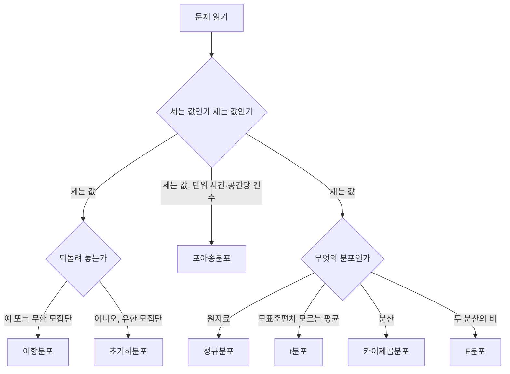

<Callout type="info">
  **이번 문서의 목표:** 평균·중앙값·최빈값의 순서만 보고 분포가 어느 쪽으로 치우쳤는지 판정하고, 이항분포의 평균과 분산을 즉시 계산하며, 문제 속 단서에서 어떤 확률분포를 써야 하는지 골라낼 수 있게 된다.
</Callout>

## 이 편이 2과목의 계산 문제를 담당한다

빅분기 필기 2과목에서 계산 문제는 대부분 이 편의 범위에서 나옵니다. 분산 계산, 표준화, 기대값, 이항분포의 분산, 사분위범위 같은 것들입니다.

**좋은 소식:** 유형이 정해져 있고 숫자가 작습니다. 공식을 알면 30초 안에 풀립니다.
**나쁜 소식:** 공식을 헷갈리면 손도 못 댑니다. 특히 **분산인지 표준편차인지, 모집단인지 표본인지**를 놓치면 그대로 오답입니다.

> **쉽게 말하면:** 이 편은 **외워서 즉시 대입하는 공식 창고**입니다. 다만 왜 그 공식인지도 함께 봐 둬야 변형 문제에 대응할 수 있습니다.

## 1. 중심경향 척도

### 세 가지 대표값

| 척도 | 정의 | 계산 가능한 자료 | 극단값에 |
|------|------|------------------|----------|
| 평균 | 모든 값의 합을 개수로 나눔 | 등간척도 이상 | **매우 민감** |
| 중앙값 | 정렬했을 때 가운데 순위의 값 | 서열척도 이상 | 강건 |
| 최빈값 | 가장 자주 나타난 값 | 명목척도 이상 | 강건 |

**아래로 갈수록 쓸 수 있는 자료가 넓어집니다.** 최빈값은 색상 같은 명목형에도 쓸 수 있고, 중앙값은 순서가 있어야 하며, 평균은 더하고 나눌 수 있어야 합니다. 11편에서 "명목형 결측은 최빈값으로 대치"한 이유가 여기 있습니다.

### 손계산 — 하나의 자료로 전부 구하기

자료가 2, 4, 4, 4, 5, 5, 7, 9 (8개, 이미 정렬됨)라고 합시다. 이 편 내내 이 자료를 씁니다.

**평균**

$$
\bar{x} = \frac{2 + 4 + 4 + 4 + 5 + 5 + 7 + 9}{8} = \frac{40}{8} = 5
$$

**중앙값.** 개수가 8개로 짝수이므로 4번째와 5번째 값의 평균입니다. 4번째는 4, 5번째는 5입니다.

$$
M = \frac{4 + 5}{2} = 4.5
$$

**최빈값.** 4가 세 번, 5가 두 번, 나머지는 한 번씩입니다.

$$
\text{최빈값} = 4
$$

**결과를 나란히 놓아 봅시다.**

$$
4 < 4.5 < 5
$$

곧 **최빈값 < 중앙값 < 평균** 입니다.

### 세 값의 순서로 치우침을 판정하기 — 기출 핵심

이 순서는 우연이 아닙니다. 자료에 9라는 큰 값이 하나 있어서 **평균만 오른쪽으로 끌려갔습니다.** 최빈값은 봉우리에 그대로 있고, 중앙값은 순위만 보므로 조금만 움직였습니다.

| 분포 모양 | 세 값의 순서 | 꼬리 방향 | 왜도 부호 |
|-----------|--------------|-----------|-----------|
| 오른쪽 꼬리가 김 | 최빈값 → 중앙값 → 평균 | 오른쪽 | 양수 |
| 좌우 대칭 | 세 값이 거의 같음 | 없음 | 0에 가까움 |
| 왼쪽 꼬리가 김 | 평균 → 중앙값 → 최빈값 | 왼쪽 | 음수 |

**기출 그대로의 사례 판단.** "정비센터의 장비 수리시간은 2시간대에 봉우리가 하나 있고 대부분 1–4시간이지만, 드물게 12–18시간이 걸린 작업도 있다. 히스토그램에 왼쪽부터 A, B, C 세로선을 표시했을 때 최빈값·중앙값·평균의 대응은?"

**풀이 과정:**

<Steps>

1. **봉우리 위치를 찾습니다** — 2시간대에 봉우리가 있으므로 최빈값은 왼쪽인 A
2. **꼬리 방향을 봅니다** — 12–18시간이라는 드문 긴 작업이 오른쪽으로 뻗어 있으므로 오른쪽 꼬리
3. **평균이 끌려가는 방향을 정합니다** — 평균은 값의 크기를 모두 쓰므로 오른쪽 꼬리에 끌려 가장 오른쪽인 C
4. **남은 자리** — 중앙값은 그 사이인 B

</Steps>

**답: A는 최빈값, B는 중앙값, C는 평균.**

**여기서 틀리는 지점:** "드물게 긴 작업이 있으니 중앙값이 커지겠지"라고 생각해 중앙값과 평균을 바꿔 답하는 경우입니다. 중앙값은 **가운데 순위**만 보므로 그 몇 건이 아무리 길어도 거의 움직이지 않습니다. 크기에 반응하는 것은 평균뿐입니다.

## 2. 산포 척도

| 척도 | 정의 | 단위 | 극단값에 |
|------|------|------|----------|
| 범위 | 최댓값 – 최솟값 | 원자료와 같음 | 극단값 두 개만 사용해 **매우 불안정** |
| 사분위범위 | $Q_3 - Q_1$ | 원자료와 같음 | 강건 |
| 분산 | 편차 제곱의 평균 | 원자료 단위의 **제곱** | 민감 |
| 표준편차 | 분산의 제곱근 | 원자료와 같음 | 민감 |
| 변동계수 | 표준편차를 평균으로 나눈 값 | **단위 없음** | 민감 |

**기출 함정:** "범위 — 극단값 두 개만 사용하므로 안정적이다"라는 보기는 **틀린 서술**입니다. 극단값 두 개**만** 쓰기 때문에 오히려 가장 불안정합니다. 안정적인 것은 순서의 가운데를 쓰는 중앙값과 IQR입니다.

### 분산 손계산 — 모분산과 표본분산

같은 자료 2, 4, 4, 4, 5, 5, 7, 9의 평균은 5입니다.

**1단계 — 편차.** 각 값에서 5를 빼면 –3, –1, –1, –1, 0, 0, 2, 4입니다.

**편차의 합은 항상 0입니다.** 확인해 봅시다. $-3-1-1-1+0+0+2+4 = 0$ 입니다. 그래서 편차를 그냥 더하면 산포를 잴 수 없고, **제곱해서** 더합니다.

**2단계 — 편차 제곱.** 9, 1, 1, 1, 0, 0, 4, 16이 되고 그 합은 다음과 같습니다.

$$
\sum (x_i - \bar{x})^2 = 9 + 1 + 1 + 1 + 0 + 0 + 4 + 16 = 32
$$

**3단계 — 모분산 (n으로 나눔)**

$$
\sigma^2 = \frac{32}{8} = 4
$$

$$
\sigma = \sqrt{4} = 2
$$

**4단계 — 표본분산 (n–1로 나눔)**

$$
s^2 = \frac{32}{8 - 1} = \frac{32}{7} \approx 4.571
$$

$$
s = \sqrt{4.571} \approx 2.138
$$

**해석:** 같은 자료인데 답이 둘입니다. **이 자료를 전체로 볼 것인가, 더 큰 모집단에서 뽑은 표본으로 볼 것인가**에 따라 갈립니다. 문제에 "모집단", "전체"가 있으면 $n$, "표본", "확률표본"이 있으면 $n-1$ 입니다.

**변동계수**

$$
CV = \frac{\sigma}{\bar{x}} = \frac{2}{5} = 0.4
$$

곧 40퍼센트입니다.

**변동계수를 언제 쓰는가:** 평균이 크게 다른 두 집단의 산포를 비교할 때입니다. 성인 몸무게의 표준편차 10kg과 신생아 몸무게의 표준편차 0.5kg 중 어느 쪽이 더 흩어져 있을까요? 절댓값으로는 성인이지만, 평균 대비로 보면 신생아 쪽이 더 클 수 있습니다. **표준편차를 평균으로 나눠 단위를 지우면** 비교가 가능해집니다.

### 왜 표본분산은 n–1로 나누는가

표본평균 $\bar{x}$ 를 이미 계산해 알고 있으면, 관측값 $n$ 개 중 $n-1$ 개를 알게 되는 순간 나머지 하나가 자동으로 정해집니다. 편차의 합이 0이어야 하기 때문입니다.

**위 자료로 확인해 봅시다.** 편차 8개 중 앞의 7개가 –3, –1, –1, –1, 0, 0, 2로 주어지면, 합이 0이 되려면 마지막 편차는 반드시 4여야 합니다. **선택의 여지가 없습니다.**

곧 자유롭게 정할 수 있는 값이 $n$ 개가 아니라 $n-1$ 개입니다. 이 개수를 **자유도**(degrees of freedom)라 하고, 이것으로 나눠야 모분산을 치우침 없이 추정합니다. $n$ 으로 나누면 모분산보다 **체계적으로 작게** 나옵니다.

## 3. 왜도와 첨도

| 통계량 | 무엇을 재는가 | 판정 |
|--------|---------------|------|
| 왜도 | 분포의 **비대칭** 정도 | 0보다 크면 오른쪽 꼬리가 김, 0보다 작으면 왼쪽 꼬리가 김 |
| 첨도 | 분포의 **뾰족한** 정도와 꼬리의 두께 | 정규분포보다 뾰족하면 큼, 납작하면 작음 |

**왜도 부호를 외우는 요령:** **부호가 가리키는 쪽으로 꼬리가 뻗습니다.** 양의 왜도면 오른쪽(양의 방향)으로 꼬리, 음의 왜도면 왼쪽(음의 방향)으로 꼬리입니다. 소득 분포는 대표적인 양의 왜도이고, 시험 점수가 대부분 만점 근처에 몰려 있으면 음의 왜도입니다.

**첨도의 기준값 주의:** 정규분포의 첨도는 정의에 따라 3입니다. 다만 많은 통계 프로그램이 여기서 3을 빼서 정규분포가 0이 되게 표시합니다. **문제에 "정규분포의 첨도가 3", "정규분포 기준 0" 중 어느 표현이 나왔는지**를 보고 따라가면 됩니다.

## 4. 모집단과 표본

| 구분 | 대상 | 계산된 수치의 이름 | 기호 |
|------|------|--------------------|------|
| 모집단 | 관심 있는 대상 **전체** | **모수**(parameter) | $\mu$, $\sigma^2$, $p$ |
| 표본 | 모집단에서 뽑은 **일부** | **통계량**(statistic) | $\bar{x}$, $s^2$, $\hat{p}$ |

**핵심:** 모수는 정해진 상수이지만 우리는 그 값을 모릅니다. 통계량은 표본을 뽑을 때마다 값이 달라지는 **확률변수**입니다. 이 구분이 15편 추론통계의 출발점입니다.

### 표본추출 방법

| 방법 | 절차 | 구분 요령 |
|------|------|-----------|
| 단순임의추출 | 모든 개체가 같은 확률로 뽑힘 | 아무 조건 없이 무작위 |
| 계통추출 | 첫 번째만 무작위로 고르고 이후 일정 간격으로 | "매 $k$ 번째"라는 말이 나옴 |
| 층화추출 | 집단으로 나눈 뒤 **각 집단에서 일부씩** 뽑음 | 집단이 서로 이질적, 집단 내부는 동질적 |
| 군집추출 | 집단을 나눈 뒤 **일부 집단을 통째로** 조사 | 집단 내부에 전체 특성이 골고루 들어 있음 |

**층화와 군집을 가르는 한 문장:** 층화는 **모든 집단에서 조금씩**, 군집은 **일부 집단을 전부**입니다.

**기출 사례 판단.** "각 학교가 지역 전체 학생 구성을 잘 반영하도록 군집을 정의하고, 학교 20곳을 무작위로 고른 뒤 선택된 학교의 **모든 학생**을 조사했다." 선택된 집단을 통째로 조사했으므로 **1단계 군집추출**입니다. 층화추출이라면 모든 학교에서 몇 명씩 뽑았을 것입니다.

### 표본평균의 성질 — 반드시 나오는 유형

크기 $n$ 의 확률표본에서 얻은 표본평균 $\bar{X}$ 에 대해 다음이 성립합니다.

$$
E(\bar{X}) = \mu
$$

$$
Var(\bar{X}) = \frac{\sigma^2}{n}
$$

- $\mu$: 모평균
- $\sigma^2$: 모분산
- $n$: 표본 크기

**첫 식의 뜻:** 표본평균은 평균적으로 모평균과 같습니다. 이것을 **불편추정량**이라 합니다. 어떤 분포 가정도 필요 없이 항상 성립합니다.

**둘째 식의 뜻:** 표본이 커질수록 표본평균이 흔들리는 폭이 **작아집니다.** 분모에 $n$ 이 있기 때문입니다. 여기에 제곱근을 씌운 것이 **표준오차**입니다.

$$
SE = \frac{\sigma}{\sqrt{n}}
$$

**손계산.** 모표준편차가 6이고 표본 크기가 9라면

$$
SE = \frac{6}{\sqrt{9}} = \frac{6}{3} = 2
$$

**해석:** 표본 크기를 9에서 36으로 **4배** 늘리면 분모의 제곱근이 3에서 6이 되어 표준오차가 절반이 됩니다. **정밀도를 2배로 올리려면 표본을 4배 모아야 한다**는 뜻입니다.

**기출에서 걸러야 할 오답 세 개:**

- "$Var(\bar{X}) = \sigma^2$ 이다" — 아닙니다. $n$ 으로 나눠야 합니다
- "$\bar{X}$ 는 모든 $n$ 에서 정확히 정규분포다" — 아닙니다. 모집단이 정규분포일 때만 그렇고, 그렇지 않으면 $n$ 이 클 때 **근사적으로** 정규에 가까워집니다
- "$\bar{X}$ 는 $\mu$ 와 항상 같은 값이다" — 아닙니다. 평균적으로 같을 뿐 매번 다릅니다

### 중심극한정리

**모집단이 어떤 분포를 따르든**, 표본 크기가 충분히 크면 표본평균의 분포가 정규분포에 가까워집니다.

**왜 중요한가:** 우리는 모집단의 분포를 모릅니다. 그런데도 표본평균에 대해서는 정규분포를 써서 신뢰구간을 만들고 검정을 할 수 있게 해 주는 것이 이 정리입니다. 15편 전체가 이 위에 서 있습니다.

**정확히 읽어야 할 지점:** 정규에 가까워지는 것은 **표본평균의 분포**이지 원자료의 분포가 아닙니다. 소득 자료를 아무리 많이 모아도 소득 자체는 여전히 오른쪽으로 치우쳐 있습니다.

## 5. 확률변수와 기대값

**확률변수**는 표본공간의 각 결과에 실수를 대응시키는 함수입니다. 주사위 눈, 동전 앞뒤를 0과 1로 나타낸 것 등이 해당합니다.

$$
E(X) = \sum x_i \cdot P(x_i)
$$

- $x_i$: 확률변수가 가질 수 있는 값
- $P(x_i)$: 그 값을 가질 확률

**손계산.** 확률변수 $Y$ 가 확률 0.7로 4를, 확률 0.3으로 –6을 갖습니다.

$$
E(Y) = 4 \times 0.7 + (-6) \times 0.3
$$

$$
E(Y) = 2.8 - 1.8 = 1
$$

**해석:** 가능한 값 두 개 중 어느 것도 1이 아닙니다. 기대값은 **실제로 나올 값이 아니라 장기 평균**입니다. 이 시행을 수없이 반복하면 평균이 1에 가까워진다는 뜻입니다.

**여기서 틀리는 지점:** –6의 부호를 빠뜨려 $2.8 + 1.8 = 4.6$ 으로 답하거나, 확률을 곱하지 않고 값만 평균 내어 $(4 - 6) \div 2 = -1$ 로 답하는 경우입니다. **각 값에 자기 확률을 가중해야** 합니다.

**분산도 같은 방식입니다.** 제곱의 기대값 $E(Y^2)$ 은 $16 \times 0.7 + 36 \times 0.3 = 22$ 이고, 여기서 기대값의 제곱 $1^2$ 을 빼면 분산은 21입니다.

## 6. 이산확률분포

| 분포 | 언제 쓰는가 | 문제 속 단서 |
|------|-------------|--------------|
| 이항분포 | 성공확률 $p$ 인 시행을 $n$ 번 **독립적으로** 반복했을 때의 성공 횟수 | "각각 독립", "확률이 일정", "n개 중 몇 개" |
| 포아송분포 | 일정한 시간·공간에서 사건이 발생한 **횟수** | "1시간당 평균 몇 건", "단위 면적당" |
| 초기하분포 | **유한 모집단**에서 **비복원**추출할 때의 성공 개수 | "되돌려 놓지 않는다", "상자에서 꺼내" |
| 기하분포 | 첫 성공이 나올 때까지 필요한 시행 횟수 | "처음 성공할 때까지" |

### 이항분포 — 계산 문제의 단골

$$
E(X) = np
$$

$$
Var(X) = np(1 - p)
$$

- $n$: 시행 횟수
- $p$: 각 시행의 성공확률

**손계산.** 각 부품이 불량일 확률이 0.2이고 서로 독립일 때, 50개 중 불량품 수 $X$ 의 분산을 구합니다.

**1단계 — 분포 확인.** 독립이고 확률이 일정하며 50번 시행이므로 이항분포입니다.

**2단계 — 기대값**

$$
E(X) = 50 \times 0.2 = 10
$$

**3단계 — 분산**

$$
Var(X) = 50 \times 0.2 \times 0.8 = 8
$$

**4단계 — 표준편차**

$$
\sigma = \sqrt{8} \approx 2.83
$$

**여기서 틀리는 지점 세 개:**

- $1 - p$ 를 빼먹고 $np = 10$ 을 답하는 경우 — 10은 **분산이 아니라 기대값**입니다
- $p^2$ 를 써서 $50 \times 0.04 = 2$ 로 계산하는 경우
- $p(1-p) = 0.16$ 만 답하는 경우 — $n$ 을 곱하지 않았습니다

**선택지에 8, 10, 0.16, 40이 함께 놓이는 이유가 바로 이 세 실수를 잡기 위해서입니다.**

### 초기하분포 판정 — 사례형

"불량품 12개가 포함된 60개 납품 상자에서 8개를 검사하며, 검사한 제품은 **되돌려 놓지 않는다.**"

**왜 이항이 아닌가:** 이항분포는 각 시행이 독립이고 성공확률이 일정해야 합니다. 그런데 되돌려 놓지 않으면 첫 번째로 불량을 꺼낸 순간 남은 상자의 불량 비율이 12/60에서 11/59로 **바뀝니다.** 다음 추출의 확률이 앞의 결과에 의존하므로 독립이 아닙니다.

**따라서 답:** 유한 모집단에서 비복원추출해 추출 간 의존성과 성공확률 변화가 생기기 때문에 초기하분포를 씁니다.

**실전 요령:** "되돌려 놓는다"가 보이면 이항, "되돌려 놓지 않는다"가 보이면 초기하입니다. 이 한 문장이 문제 전체를 결정합니다.

## 7. 연속확률분포

| 분포 | 무엇의 분포인가 |
|------|-----------------|
| 정규분포 | 평균과 표준편차가 주어진 자료가 따르는 종 모양 분포 |
| t분포 | 모표준편차를 모른 채 표본표준편차를 쓸 때 표본평균이 따르는 분포 |
| 카이제곱분포 | 자료가 $N$ 개 있을 때 **분산**이 따르는 분포 |
| F분포 | 두 개의 분산이 주어졌을 때 **분산비**가 따르는 분포 |

**t분포의 성질:** 정규분포보다 꼬리가 두껍고 봉우리가 낮습니다. 모표준편차를 모르는 불확실성이 더해졌기 때문입니다. **표본이 커지면 정규분포에 가까워집니다.**

**카이제곱분포와 F분포의 성질:** 분산은 음수가 될 수 없으므로 두 분포 모두 **0 이상에서만 정의**되고 오른쪽으로 꼬리가 깁니다.

### 정규분포의 68–95–99.7 규칙

| 구간 | 포함 비율 |
|------|-----------|
| 평균 기준 표준편차 1개 이내 | 약 68퍼센트 |
| 평균 기준 표준편차 2개 이내 | 약 95퍼센트 |
| 평균 기준 표준편차 3개 이내 | 약 99.7퍼센트 |

**11편의 z-score 기준이 여기서 나옵니다.** $|z|$ 가 2 이상이면 정규분포에서 상하위 합쳐 약 5퍼센트에만 해당하는 드문 값이고, 3 이상이면 약 0.3퍼센트입니다. 그래서 2나 3을 이상치 기준으로 씁니다.

**표준정규분포:** 평균 0, 표준편차 1인 정규분포입니다. 어떤 정규분포도 12편의 표준화를 거치면 표준정규분포가 됩니다.

## 8. 어떤 분포를 쓸지 고르는 흐름

## 핵심 정리

- 대표값은 **최빈값 → 중앙값 → 평균** 순으로 적용 가능한 자료가 좁아지고, 극단값에 민감해진다.
- 세 값의 순서가 **최빈값 < 중앙값 < 평균**이면 오른쪽 꼬리가 긴 양의 왜도이고, 반대면 음의 왜도다. 평균만 크기에 반응한다.
- **범위는 극단값 두 개만 쓰므로 가장 불안정**하고, 중앙값과 IQR이 강건하다. 변동계수는 표준편차를 평균으로 나눠 단위를 없앤 상대적 산포다.
- 모분산은 $n$, 표본분산은 **자유도** $n-1$ 로 나눈다. 표본평균을 이미 썼기 때문에 자유롭게 정할 수 있는 값이 하나 줄어든다.
- $E(\bar{X}) = \mu$ 는 분포 가정 없이 항상 성립하고, $Var(\bar{X}) = \sigma^2 / n$ 이므로 표본을 4배 늘려야 표준오차가 절반이 된다.
- **중심극한정리가 정규에 가깝게 만드는 것은 표본평균의 분포**이지 원자료가 아니다.
- 기대값은 각 값에 **자기 확률을 가중한 합**이며 실제로 나올 값이 아니라 장기 평균이다.
- 이항분포는 $E = np$, $Var = np(1-p)$ 다. **되돌려 놓지 않으면 초기하분포**로 바뀐다.
- 층화추출은 모든 집단에서 조금씩, 군집추출은 일부 집단을 통째로 조사한다.

## 마무리 복습

<Quiz
  questionNumber={1}
  question="각 부품이 불량일 확률이 0.2이고 서로 독립일 때, 50개 중 불량품 수 X의 분산은?"
  options={['8', '0.16', '10', '40']}
  correctAnswer={1}
  explanation="독립이고 성공확률이 일정한 50회 시행이므로 이항분포이며 분산은 n×p×(1-p)=50×0.2×0.8=8이다. 10은 기대값 np이고, 0.16은 n을 곱하지 않은 p(1-p)이며, 40은 n(1-p)를 계산한 값이다."
  optionExplanations={['50×0.2×0.8=8로 정확하다.', 'n을 곱하지 않고 p(1-p)만 계산한 값이다.', '이것은 분산이 아니라 기대값 np의 값이다.', 'n에 (1-p)만 곱한 값으로 p를 빠뜨렸다.']}
/>

<Quiz
  questionNumber={2}
  question="정비센터의 장비 수리시간은 2시간대에 봉우리가 하나 있고 대부분 1–4시간이지만, 드물게 12–18시간이 걸린 작업도 있다. 히스토그램에 왼쪽부터 A, B, C 세로선을 표시했을 때 최빈값·중앙값·평균의 대응으로 옳은 것은?"
  options={['평균 - 중앙값 - 최빈값', '중앙값 - 평균 - 최빈값', '최빈값 - 중앙값 - 평균', '최빈값 - 평균 - 중앙값']}
  correctAnswer={3}
  explanation="봉우리가 있는 2시간대가 최빈값이므로 가장 왼쪽 A이고, 드물게 나타나는 12시간 이상 작업이 평균을 오른쪽으로 끌어당겨 가장 오른쪽 C가 된다. 중앙값은 순위의 가운데라 그 사이인 B에 놓인다."
  optionExplanations={['오른쪽 꼬리 분포에서 평균은 가장 왼쪽이 아니라 가장 오른쪽에 놓인다.', '중앙값이 최빈값보다 왼쪽에 올 수 없다.', '오른쪽 꼬리가 긴 분포의 전형적 순서로 옳다.', '평균과 중앙값의 위치가 서로 바뀌어 있다.']}
/>

<Quiz
  questionNumber={3}
  question="평균이 μ이고 분산이 σ제곱인 모집단에서 크기 n의 확률표본을 뽑아 표본평균을 구했다. 추가 분포 가정 없이 항상 성립하는 것은?"
  options={['표본평균의 분산은 모분산과 같다', '표본평균은 모든 n에서 정확히 정규분포를 따른다', '표본평균은 모평균과 항상 같은 값을 갖는다', '표본평균의 기대값은 모평균과 같다']}
  correctAnswer={4}
  explanation="독립 동일분포 확률표본의 표본평균은 모평균의 불편추정량이므로 기대값이 모평균과 같고 이는 분포 가정 없이 성립한다. 표본평균의 분산은 모분산을 n으로 나눈 값이며, 정규분포를 정확히 따르는 것은 모집단이 정규일 때뿐이다."
  optionExplanations={['모분산을 n으로 나눈 값이므로 표본이 클수록 작아진다.', '모집단이 정규분포일 때만 정확히 성립하며 일반적으로는 근사다.', '표본을 뽑을 때마다 값이 달라지며 평균적으로 같을 뿐이다.', '분포 가정 없이 항상 성립하는 불편성의 정의다.']}
/>

<Quiz
  questionNumber={4}
  question="확률변수 Y가 확률 0.7로 4를, 확률 0.3으로 -6을 갖는다. Y의 기대값은?"
  options={['2.8', '1', '4.6', '-1.8']}
  correctAnswer={2}
  explanation="기대값은 각 값에 해당 확률을 가중해 더한 값이므로 4×0.7+(-6)×0.3=2.8-1.8=1이다. 두 항 중 하나만 계산하거나 음수 부호를 빠뜨리면 다른 값이 나온다."
  optionExplanations={['첫 번째 항 4×0.7만 계산하고 두 번째 항을 더하지 않은 값이다.', '2.8과 -1.8을 더한 값으로 정확하다.', '-6의 음수 부호를 빠뜨리고 더한 값이다.', '두 번째 항 (-6)×0.3만 계산한 값이다.']}
/>

<Quiz
  questionNumber={5}
  question="불량품 12개가 포함된 60개 납품 상자에서 8개를 검사하며 검사한 제품은 상자에 되돌려 놓지 않는다. 불량품 수에 초기하분포를 적용해야 하는 이유로 가장 적절한 것은?"
  options={['각 추출이 독립이고 불량 확률이 일정하기 때문이다', '연속형 측정값의 평균을 구하기 때문이다', '유한 모집단에서 비복원추출해 추출 간 의존성과 성공확률 변화가 생기기 때문이다', '불량 여부가 정규분포를 따르기 때문이다']}
  correctAnswer={3}
  explanation="제품을 되돌려 놓지 않으면 앞의 추출 결과에 따라 남은 상자의 불량 비율이 달라지므로 성공확률이 일정하지 않고 추출들이 독립이 아니다. 이 조건에서 성공 개수가 따르는 분포가 초기하분포다."
  optionExplanations={['독립이고 확률이 일정한 경우는 이항분포의 조건이다.', '초기하분포는 개수를 세는 이산분포이며 연속형 측정과 무관하다.', '비복원추출로 인한 의존성과 확률 변화가 정확한 이유다.', '불량 여부는 두 값만 갖는 이산 결과이므로 정규분포와 무관하다.']}
/>

<Quiz
  questionNumber={6}
  question="자료 2, 4, 4, 4, 5, 5, 7, 9의 평균, 중앙값, 최빈값을 바르게 구한 것은?"
  options={['평균 5, 중앙값 4.5, 최빈값 4', '평균 5, 중앙값 5, 최빈값 5', '평균 4.5, 중앙값 5, 최빈값 4', '평균 5, 중앙값 4, 최빈값 5']}
  correctAnswer={1}
  explanation="합이 40이고 개수가 8이므로 평균은 5다. 값이 짝수 개이므로 중앙값은 4번째 값 4와 5번째 값 5의 평균인 4.5이고, 세 번 나타난 4가 최빈값이다."
  optionExplanations={['세 값을 모두 정확히 계산했다.', '중앙값과 최빈값이 모두 잘못되었다.', '평균과 중앙값을 서로 뒤바꾼 값이다.', '짝수 개일 때 가운데 두 값의 평균을 취하지 않았고 최빈값도 틀렸다.']}
/>

<Quiz
  questionNumber={7}
  question="소득 자료에 매우 큰 극단값이 몇 개 포함되어 있다. 중심 위치를 비교적 강건하게 요약하는 통계량과 그 이유의 연결로 가장 적절한 것은?"
  options={['분산 - 자료의 중심 위치를 직접 나타낸다', '범위 - 극단값 두 개만 사용하므로 안정적이다', '중앙값 - 순서의 가운데를 사용해 극단값 영향이 제한적이다', '최빈값 - 연속형 자료에는 어떤 경우에도 정의할 수 없다']}
  correctAnswer={3}
  explanation="중앙값은 정렬된 위치에 기반하므로 극단값의 크기가 아무리 커져도 가운데 순위가 유지되면 값이 거의 변하지 않는다. 분산은 산포 지표이고, 범위는 극단값 두 개만 쓰기 때문에 오히려 가장 불안정하다."
  optionExplanations={['분산은 중심이 아니라 산포를 나타내는 지표다.', '극단값 두 개에만 의존하므로 안정적이 아니라 매우 불안정하다.', '순위 기반이라 극단값의 크기에 흔들리지 않으므로 옳다.', '연속형도 구간화하면 최빈 구간을 정의할 수 있으므로 단정이 틀렸다.']}
/>

<Quiz
  questionNumber={8}
  question="모표준편차가 6인 모집단에서 크기 9의 표본을 뽑았을 때 표본평균의 표준오차와, 표준오차를 절반으로 줄이기 위해 필요한 표본 크기를 바르게 짝지은 것은?"
  options={['표준오차 2, 표본 크기 18', '표준오차 2, 표본 크기 36', '표준오차 0.67, 표본 크기 18', '표준오차 4, 표본 크기 36']}
  correctAnswer={2}
  explanation="표준오차는 모표준편차를 표본 크기의 제곱근으로 나눈 값이므로 6÷3=2다. 분모가 제곱근이므로 표준오차를 절반으로 줄이려면 표본 크기를 4배인 36으로 늘려야 한다."
  optionExplanations={['표본을 2배로 늘리면 표준오차는 절반이 아니라 약 0.71배가 된다.', '표준오차 2와 4배 증가한 36이 모두 정확하다.', '표본 크기를 제곱근이 아닌 그대로 나눈 값이다.', '모표준편차를 제곱근이 아닌 다른 값으로 나눈 결과다.']}
/>

## 참고 자료

- [코리아IT아카데미 - 빅데이터 분석기사](https://www.koreaisacademy.com/2025/cer/datascience/bigdata.asp)
- [Statistics Playbook - 빅데이터분석기사 완전 가이드](https://statisticsplaybook.com/big-data-analysis-engineer-guide/)
- [Inflearn 가이드 - 빅데이터분석기사 어떻게 준비해야 할까?](https://www.inflearn.com/pages/bigdata-analysis-engineer-guide)
- [김앤북 - 내일은 빅데이터분석기사 필기 핵심 요약집](https://www.kimnbook.co.kr/book/detail/100)
