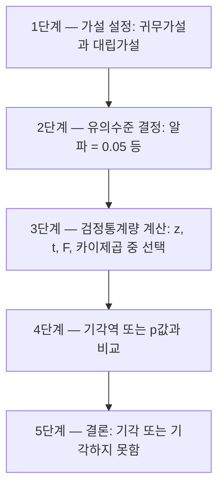
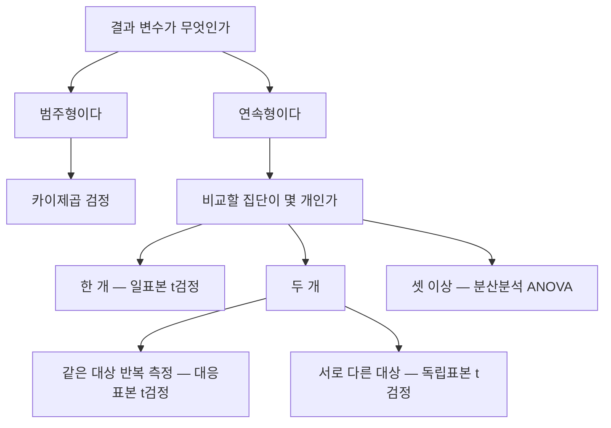

<Callout type="info">
  **이번 문서의 목표:** 이 파일을 다 읽으면 표본 하나로 모집단의 평균을 추정해 신뢰구간을 손으로 계산하고, 귀무가설과 대립가설을 세워 검정통계량과 p값으로 결론을 내리며, 문제에 주어진 상황을 보고 z검정·t검정·F검정·분산분석(ANOVA)·카이제곱검정·비모수 검정 중 무엇을 써야 하는지 골라낼 수 있게 된다.
</Callout>

## 0. 14편에서 가져오는 것 — 딱 이만큼만

14편(기술통계와 확률분포)에서 다룬 내용 중, 이번 편을 읽는 데 필요한 것만 세 줄로 정리합니다. 자세한 내용은 14편을 참고하세요.

- **평균**(mean, 평균)은 데이터의 중심 위치, **분산**(variance, 분산)은 흩어진 정도의 제곱 평균, **표준편차**(standard deviation, 표준편차)는 분산의 제곱근입니다. 기호로 모집단 평균은 $\mu$ (뮤), 모집단 표준편차는 $\sigma$ (시그마), 표본평균은 $\bar{x}$ (엑스바), 표본표준편차는 $s$ (에스)라고 씁니다.
- **정규분포**(normal distribution, 정규분포)는 평균을 중심으로 좌우대칭인 종 모양 분포입니다. 여기에서 파생된 **t분포**(t-distribution), **카이제곱분포**(chi-square distribution, $\chi^2$ 분포), **F분포**(F-distribution)가 이번 편의 도구입니다.
- **중심극한정리**(Central Limit Theorem, CLT, 중심극한정리): 표본 크기 $n$ 이 충분히 크면(보통 30 이상) **모집단의 분포가 무엇이든 표본평균의 분포는 정규분포에 가까워진다**는 정리입니다. 이번 편의 거의 모든 계산이 이 정리 위에 서 있습니다.

## 1. 왜 추론통계가 필요한가

여론조사 기관이 "대한민국 성인의 평균 수면시간"을 알고 싶다고 합시다. 성인 4천만 명을 전부 조사하려면 비용도 시간도 감당이 안 됩니다. 그래서 1,000명만 뽑아 재고, 그 결과로 4천만 명 전체를 말합니다. 이렇게 **일부를 보고 전체를 말하는 통계**를 **추론통계**(inferential statistics, 추론통계)라고 부릅니다.

> **쉽게 말하면:** 추론통계는 국 한 숟갈을 떠먹어 보고 솥 전체의 간을 판정하는 기술입니다.

용어를 정확히 잡고 갑시다.

| 용어 | 영어 | 뜻 | 기호 |
| --- | --- | --- | --- |
| 모집단 | population | 알고 싶은 대상 전체 | – |
| 모수 | parameter | 모집단의 특성값(고정된 미지의 상수) | $\mu$, $\sigma^2$, $p$ |
| 표본 | sample | 모집단에서 실제로 뽑아 관측한 일부 | – |
| 통계량 | statistic | 표본으로 계산한 값(뽑을 때마다 달라짐) | $\bar{x}$, $s^2$ |
| 추정량 | estimator | 모수를 맞히려고 쓰는 통계량 | $\hat{\mu}$ (뮤햇) |

여기서 시험이 가장 자주 노리는 지점이 있습니다. **모수는 고정된 값이고 통계량은 뽑을 때마다 흔들리는 값**입니다. 국 솥의 실제 짠맛은 하나로 정해져 있고, 숟갈로 뜬 맛은 뜰 때마다 조금씩 다릅니다. 우리가 확률로 말하는 대상은 숟갈이지 솥이 아닙니다. 이 문장 하나가 뒤에 나올 신뢰구간 해석과 p값 해석의 함정을 전부 설명해 줍니다.

## 2. 점추정 — 값 하나로 찍기

> **쉽게 말하면:** 점추정은 "모평균은 대략 52입니다"처럼 숫자 하나로 모수를 찍는 것입니다.

**점추정**(point estimation, 점추정)은 표본으로 계산한 값 하나를 모수의 추정치로 내놓는 방법입니다. 모평균 $\mu$ 의 점추정치로는 표본평균 $\bar{x}$ 를, 모비율 $p$ 의 점추정치로는 표본비율 $\hat{p}$ (피햇)을, 모분산 $\sigma^2$ 의 점추정치로는 표본분산 $s^2$ 을 씁니다.

좋은 추정량이 갖춰야 할 성질은 네 가지로 정리됩니다.

| 성질 | 영어 | 뜻 |
| --- | --- | --- |
| 불편성 | unbiasedness | 추정량의 기댓값이 모수와 같다. 평균적으로 빗나가지 않는다 |
| 효율성 | efficiency | 추정량의 분산이 작다. 뽑을 때마다 덜 흔들린다 |
| 일치성 | consistency | 표본 크기가 커질수록 모수에 가까워진다 |
| 충분성 | sufficiency | 표본이 가진 모수 정보를 남김없이 담고 있다 |

표본분산을 계산할 때 $n$ 이 아니라 $n-1$ 로 나누는 이유가 바로 **불편성**(unbiasedness, 불편성) 때문입니다. $n$ 으로 나누면 모분산보다 체계적으로 작게 나오는데, $n-1$ 로 나누면 그 편향이 정확히 사라집니다. 이때 $n-1$ 을 **자유도**(degrees of freedom, 자유도, df)라고 부릅니다. 자유도는 "자유롭게 움직일 수 있는 값의 개수"입니다. 표본평균을 이미 써 버렸기 때문에 $n$ 개의 편차 중 마지막 하나는 나머지가 정해지면 자동으로 결정됩니다. 그래서 자유롭게 놀 수 있는 값이 하나 줄어듭니다.

점추정의 결정적인 약점은 **얼마나 믿을 만한지를 말해 주지 않는다**는 것입니다. 1,000명을 조사해 얻은 52와 5명을 조사해 얻은 52는 신뢰도가 전혀 다른데, 점추정치만 보면 똑같이 52입니다. 그래서 구간추정이 필요합니다.

## 3. 표준오차 — 추정치가 흔들리는 폭

> **쉽게 말하면:** 표준오차는 "표본을 다시 뽑으면 표본평균이 평균적으로 이만큼 달라진다"는 흔들림의 크기입니다.

**표준오차**(Standard Error, SE, 표준오차)는 통계량의 표준편차입니다. 표본평균의 표준오차 공식은 이렇습니다.

$$
SE(\bar{x}) = \frac{s}{\sqrt{n}}
$$

- $SE(\bar{x})$ : 표본평균의 표준오차. 표본평균이 표본마다 흔들리는 폭
- $s$ : 표본표준편차. 데이터 하나하나가 흩어진 폭
- $n$ : 표본 크기(관측치 개수)
- $\sqrt{\ }$ : 제곱근 기호(루트)

여기서 초보자가 가장 많이 헷갈리는 것이 표준편차와 표준오차의 차이입니다.

| 구분 | 표준편차 (standard deviation) | 표준오차 (standard error) |
| --- | --- | --- |
| 무엇의 흩어짐인가 | 개별 데이터의 흩어짐 | 통계량(표본평균)의 흩어짐 |
| 표본을 키우면 | 거의 그대로 | 계속 작아진다 |
| 기호 | $s$ 또는 $\sigma$ | $s / \sqrt{n}$ |
| 쓰임 | 데이터 설명 | 추정의 정밀도 표현 |

키가 흩어진 정도(표준편차)는 100명을 재든 10,000명을 재든 비슷합니다. 사람 키가 다양한 건 표본 크기와 무관하니까요. 하지만 **평균 키를 얼마나 정확히 맞혔는지**(표준오차)는 사람을 많이 잴수록 좋아집니다. 분모에 $\sqrt{n}$ 이 있으므로 정밀도를 2배로 높이려면 표본을 **4배**로 늘려야 합니다. 이 제곱근의 벽은 시험에도 나오고 실무 예산 회의에도 나옵니다.

## 4. 구간추정과 신뢰구간 — 끝까지 손으로 계산하기

> **쉽게 말하면:** 신뢰구간은 "모평균은 대략 51.0에서 53.0 사이일 것이다"처럼 폭을 가진 구간으로 모수를 찍는 것입니다.

**구간추정**(interval estimation, 구간추정)은 모수가 들어 있을 법한 구간을 제시하는 방법이고, 그 구간을 **신뢰구간**(Confidence Interval, CI, 신뢰구간)이라고 부릅니다. **신뢰수준**(confidence level, 신뢰수준)은 그 구간이 모수를 담아낼 것으로 기대하는 비율이고, 보통 90퍼센트, 95퍼센트, 99퍼센트를 씁니다.

모평균의 신뢰구간 공식은 이렇습니다. 모표준편차 $\sigma$ 를 모르는 보통의 상황에서는 t분포를 씁니다.

$$
\bar{x} \pm t_{\alpha/2,\ n-1} \times \frac{s}{\sqrt{n}}
$$

- $\bar{x}$ : 표본평균(구간의 중심)
- $t_{\alpha/2,\ n-1}$ : 자유도 $n-1$ 인 t분포에서 양쪽 꼬리에 각각 $\alpha/2$ 만큼을 남기는 임계값
- $\alpha$ (알파) : 유의수준. 신뢰수준이 95퍼센트면 $\alpha = 0.05$
- $s / \sqrt{n}$ : 표준오차
- $t \times SE$ 부분 전체를 **오차한계**(margin of error, 오차한계)라고 부릅니다

### 손계산 — 표본 101명, 평균 52, 표본표준편차 5

한 통신사가 고객 101명의 월 데이터 사용량을 조사했더니 표본평균 52기가바이트, 표본표준편차 5기가바이트가 나왔습니다. 전체 고객의 평균 사용량에 대한 95퍼센트 신뢰구간을 구합니다.

**1단계 — 주어진 값 정리**

- $n = 101$, $\bar{x} = 52$, $s = 5$, 신뢰수준 95퍼센트이므로 $\alpha = 0.05$

**2단계 — 자유도 구하기**

$$
df = n - 1 = 101 - 1 = 100
$$

**3단계 — 표준오차 계산**

먼저 분모의 제곱근을 구합니다.

$$
\sqrt{101} \approx 10.0499
$$

$$
SE = \frac{5}{10.0499} \approx 0.4975
$$

**4단계 — 임계값 찾기**

자유도 100, 양측 95퍼센트일 때 t분포표의 값은 다음과 같습니다.

$$
t_{0.025,\ 100} \approx 1.984
$$

**5단계 — 오차한계 계산**

$$
1.984 \times 0.4975 \approx 0.9871
$$

**6단계 — 구간의 아래 끝**

$$
52 - 0.9871 = 51.0129
$$

**7단계 — 구간의 위 끝**

$$
52 + 0.9871 = 52.9871
$$

**결론 해석:** 95퍼센트 신뢰구간은 약 51.01기가바이트에서 52.99기가바이트입니다. 말로 옮기면 "이런 방식으로 표본을 뽑아 구간을 만드는 절차를 무한히 반복하면, 그렇게 만들어진 구간들 중 약 95퍼센트가 진짜 모평균을 품는다"입니다.

참고로 표본이 충분히 커서 정규근사를 쓰면 임계값이 $z_{0.025} = 1.96$ 이 되어 오차한계가 $1.96 \times 0.4975 \approx 0.9751$ 로 아주 조금 줄어듭니다. 자유도가 100 정도면 t분포와 정규분포가 거의 겹치기 때문입니다. **자유도가 커질수록 t분포는 표준정규분포에 수렴**하고, **자유도가 작을수록 꼬리가 두꺼워져 임계값이 커지고 구간이 넓어집니다.**

### 신뢰구간의 폭을 결정하는 세 가지

$$
\text{오차한계} = t_{\alpha/2,\ n-1} \times \frac{s}{\sqrt{n}}
$$

이 식을 보면 구간의 폭을 결정하는 요인이 정확히 셋입니다.

- **신뢰수준을 높이면** 임계값이 커져 구간이 **넓어집니다**. 99퍼센트 구간은 95퍼센트 구간보다 항상 넓습니다. 더 확실하게 잡으려면 더 큰 그물을 던져야 합니다.
- **표본 크기를 키우면** 분모가 커져 구간이 **좁아집니다**.
- **데이터가 원래 많이 흩어져 있으면** 즉 $s$ 가 크면 구간이 **넓어집니다**.

"신뢰수준을 99퍼센트로 올렸더니 구간이 좁아졌다"는 보기가 나오면 틀린 진술입니다. 시험에서 자주 나오는 함정입니다.

### 신뢰구간의 올바른 해석 — 가장 많이 틀리는 부분

95퍼센트 신뢰구간 51.01에서 52.99를 보고 다음처럼 말하면 **틀립니다.**

- "모평균이 이 구간에 있을 확률이 95퍼센트다." — 틀림
- "이 구간 안의 모든 값이 모평균이 될 수 있는 정확한 값이다." — 틀림
- "전체 데이터의 95퍼센트가 이 구간 안에 들어간다." — 틀림

왜 틀릴까요? 앞에서 짚었듯 **모평균은 흔들리지 않는 고정된 상수**입니다. 이미 계산이 끝난 구간의 두 끝점도 고정된 숫자입니다. 고정된 값이 고정된 구간 안에 있거나 없거나 둘 중 하나이므로, 확률이 낄 자리가 없습니다. 95퍼센트라는 숫자는 **구간을 만드는 절차**에 붙는 성질입니다.

- "같은 방법으로 표본을 뽑아 구간을 만드는 일을 100번 반복하면, 그렇게 만든 100개의 구간 중 약 95개가 모평균을 포함한다." — 옳음

이것을 **장기 포함률**(long-run coverage, 장기 포함률)이라고 부릅니다. 활쏘기에 비유하면, 과녁(모평균)은 가만히 있고 화살(구간)이 매번 다른 자리에 꽂힙니다. 95퍼센트는 화살이 과녁을 꿰뚫는 비율이지, 과녁이 특정 위치에 있을 확률이 아닙니다. 실제 2025년 10회차 기출에도 "점추정값이 52이고 같은 표본으로 95퍼센트 신뢰구간을 계산했다"는 상황에서 이 해석을 고르는 문항이 나왔습니다.

## 5. 가설검정의 전체 절차

> **쉽게 말하면:** 가설검정은 "우연이라고 보기엔 너무 이상한가?"를 정해진 절차로 판정하는 재판입니다.

**가설검정**(hypothesis testing, 가설검정)은 모집단에 대한 주장을 세우고, 표본 증거로 그 주장을 기각할지 결정하는 절차입니다. 절차는 다섯 단계로 고정되어 있고, 시험에서 순서를 뒤섞어 물어봅니다.

### 1단계 — 귀무가설과 대립가설

**귀무가설**(null hypothesis, 귀무가설, $H_0$)은 "차이가 없다, 효과가 없다, 원래대로다"라는 기본 주장입니다. 한자로 돌아갈 귀, 없을 무를 써서 차이가 없는 상태로 돌아간다는 뜻입니다. 형태는 항상 등호를 포함합니다.

**대립가설**(alternative hypothesis, 대립가설, $H_1$)은 연구자가 주장하고 싶은 내용입니다. "차이가 있다, 크다, 작다"의 형태입니다.

$$
H_0: \mu = 50
$$

$$
H_1: \mu \neq 50
$$

- $\mu$ : 모집단의 평균
- $\neq$ : 같지 않다는 기호

여기가 시험 단골 함정입니다. **가설검정은 대립가설을 증명하는 절차가 아닙니다.** 재판에서 무죄 추정으로 시작해 검사가 유죄를 입증하지 못하면 무죄가 되는 것과 같습니다. 귀무가설은 무죄 추정이고, 표본 증거가 충분히 강하면 그 추정을 뒤집습니다. 증거가 약하면 "무죄가 입증됐다"가 아니라 "유죄라고 하기엔 증거가 부족하다"로 끝납니다. 2023년 07회차 기출에도 "연구자가 참이라고 믿는 주장을 증명하기 위해 귀무가설을 세운다"가 **틀린 진술**로 출제되었습니다.

### 2단계 — 유의수준과 기각역

**유의수준**(significance level, 유의수준, $\alpha$)은 "어디까지를 우연으로 볼 것인가"를 정하는 기준선입니다. 보통 0.05를 씁니다. **기각역**(rejection region, 기각역)은 검정통계량이 그 안에 떨어지면 귀무가설을 버리기로 미리 정해 둔 극단적인 영역입니다. 반대로 기각역 바깥은 **채택역**(acceptance region, 채택역)이라고 부릅니다.

### 3단계 — 검정통계량

**검정통계량**(test statistic, 검정통계량)은 "표본에서 관측된 차이가 표준오차 기준으로 몇 배나 되는가"를 나타내는 값입니다. 대부분 다음 뼈대를 공유합니다.

$$
\text{검정통계량} = \frac{\text{관측된 차이}}{\text{표준오차}}
$$

### 4단계 — p값

**p값**(p-value, 유의확률)은 **귀무가설이 참이라고 가정했을 때, 지금 관측된 결과 이상으로 극단적인 결과가 나올 확률**입니다. 판정 규칙은 다음과 같습니다.

- p값이 유의수준보다 **작으면** 귀무가설을 **기각**합니다. 통계적으로 유의하다고 말합니다.
- p값이 유의수준보다 **크면** 귀무가설을 **기각하지 못합니다**.

암기 문구로 "p가 작으면 귀무를 판다"를 쓰면 편합니다.

### 5단계 — 결론의 말투

결론은 반드시 유의수준을 밝히고 씁니다. "유의수준 0.05 하에서 모평균이 50이라고 할 수 없다"가 정확한 표현입니다. 그리고 기각하지 못했을 때는 "귀무가설을 채택했다"가 아니라 "**기각하지 못했다**"라고 써야 합니다. 증거 부족과 무죄 입증은 다르기 때문입니다.

## 6. p값의 흔한 오해 — 시험에서 반드시 나온다

p값은 정의가 한 줄인데 오해는 다섯 가지입니다. 표로 정리합니다.

| 잘못된 이해 | 왜 틀렸나 |
| --- | --- |
| p값은 귀무가설이 참일 확률이다 | p값은 귀무가설을 가정한 뒤 계산한 데이터의 확률이다. 가설의 확률이 아니다 |
| p값은 대립가설이 참일 확률이다 | p값은 대립가설에 대해 아무 확률도 말하지 않는다 |
| p값이 크면 귀무가설이 참임이 증명된다 | 증거가 부족한 것일 뿐이다. 표본이 작아서 못 잡았을 수도 있다 |
| p값이 작으면 효과 크기가 크다 | 표본이 아주 크면 사소한 차이도 p값이 작아진다. 유의성과 중요성은 다르다 |
| p가 0.049면 유의하고 0.051이면 무의미하다 | 0.05는 인위적인 관습선이다. 두 값의 증거 강도는 사실상 같다 |

핵심 문장 하나만 외우면 됩니다. **p값은 귀무가설이 참일 확률이 아니라, 귀무가설이 참일 때 이런 데이터가 나올 확률입니다.** 조건이 걸린 방향이 정반대입니다. "비가 오면 땅이 젖을 확률"과 "땅이 젖었을 때 비가 왔을 확률"이 서로 다른 것과 똑같습니다.

## 7. 단측검정과 양측검정

**양측검정**(two-tailed test, 양측검정)은 대립가설이 "같지 않다"처럼 양쪽 방향을 모두 주장하는 검정이고, **단측검정**(one-tailed test, 단측검정)은 "크다" 또는 "작다"처럼 한쪽만 주장하는 검정입니다.

| 구분 | 대립가설 | 유의수준 0.05를 어디에 배분하나 | 정규분포 임계값 |
| --- | --- | --- | --- |
| 양측검정 | 같지 않다 | 양쪽 꼬리에 0.025씩 | 1.96 |
| 단측검정(우측) | 크다 | 오른쪽 꼬리에 0.05 전부 | 1.645 |
| 단측검정(좌측) | 작다 | 왼쪽 꼬리에 0.05 전부 | –1.645 |

같은 유의수준이라면 **단측검정의 임계값이 더 작으므로 귀무가설을 기각하기가 더 쉽습니다.** 이것을 "단측검정이 더 민감하다"고 표현합니다. 대신 방향을 데이터 본 뒤에 정하면 안 됩니다. 결과를 보고 유리한 쪽으로 단측을 고르는 것은 유의수준을 몰래 두 배로 쓰는 부정행위입니다.

## 8. 1종 오류, 2종 오류, 검정력

재판 비유를 그대로 이어갑니다. 무죄인 사람을 유죄로 판결하는 실수와, 유죄인 사람을 놓아 주는 실수는 성격이 다릅니다.

| 판정 | 실제로 귀무가설이 참 | 실제로 귀무가설이 거짓 |
| --- | --- | --- |
| 귀무가설을 기각함 | **1종 오류** (확률 $\alpha$) | 올바른 판단 (확률 $1-\beta$, 검정력) |
| 귀무가설을 기각 못 함 | 올바른 판단 (확률 $1-\alpha$) | **2종 오류** (확률 $\beta$) |

- **1종 오류**(Type I error, 1종 오류): 귀무가설이 참인데 기각하는 오류. 확률은 $\alpha$ (알파). 멀쩡한 사람을 감옥에 보내는 실수. 없는 효과를 있다고 발표하는 **거짓 양성**(false positive)입니다.
- **2종 오류**(Type II error, 2종 오류): 귀무가설이 거짓인데 기각하지 못하는 오류. 확률은 $\beta$ (베타). 진범을 놓아 주는 실수. 있는 효과를 놓치는 **거짓 음성**(false negative)입니다.
- **검정력**(power, 검정력): 거짓인 귀무가설을 제대로 기각할 확률.

$$
\text{검정력} = 1 - \beta
$$

**유의수준을 낮추면** 예를 들어 0.05에서 0.01로 낮추면 함부로 기각하지 않게 되므로 1종 오류는 줄지만, 진짜 효과도 놓치기 쉬워져 **2종 오류는 늘어납니다.** 둘은 시소 관계라 하나를 공짜로 줄일 수 없습니다. 다만 **표본 크기를 키우면** 표준오차가 줄어들어 $\alpha$ 를 유지한 채 $\beta$ 를 줄일 수 있습니다. 검정력을 높이는 가장 정직한 방법이 표본 확대인 이유입니다.

2024년 08회차 기출에는 "대립가설 아래 검정통계량이 평균 2, 분산 1인 정규분포를 따르고 채택역이 1.645 미만일 때 2종 오류 확률을 구하라"는 계산 문항이 나왔습니다. 2종 오류는 **대립가설이 참인 세계에서 채택역에 떨어질 확률**이므로, 표준화하면 다음과 같이 계산합니다.

$$
z = \frac{1.645 - 2}{1} = -0.355
$$

그다음 표준정규분포에서 이 값보다 작을 확률을 읽으면 됩니다. **어느 가설 아래에서 확률을 재는지**를 헷갈리면 통째로 틀립니다.

## 9. 어떤 검정을 쓸 것인가 — 모수 검정 비교표

**모수 검정**(parametric test, 모수 검정)은 데이터가 특정 분포, 주로 정규분포를 따른다고 가정하는 검정입니다.

| 검정 | 귀무가설 | 언제 쓰나 | 사용하는 분포 |
| --- | --- | --- | --- |
| z검정 | 모평균이 특정 값과 같다 | 모표준편차를 알거나 표본이 아주 클 때 평균 검정 | 표준정규분포 |
| 일표본 t검정 | 모평균이 특정 값과 같다 | 모표준편차를 모를 때 한 집단의 평균 검정 | t분포 |
| 독립표본 t검정 | 두 집단의 모평균이 같다 | 서로 다른 두 집단의 평균 비교 | t분포 |
| 대응표본 t검정 | 차이의 평균이 0이다 | 같은 대상의 사전–사후 비교 | t분포 |
| F검정 | 두 모분산이 같다 | 두 집단의 분산(산포) 비교 | F분포 |
| 분산분석(ANOVA) | 모든 그룹의 평균이 같다 | 셋 이상 그룹의 평균 비교 | F분포 |
| 카이제곱 검정 | 독립이다 또는 적합하다 | 범주형 자료의 독립성·적합도·동질성 | 카이제곱분포 |

실무에서는 **모표준편차를 알면서 모평균만 모르는 상황이 거의 없기 때문에** z검정보다 t검정을 압도적으로 많이 씁니다. 이것도 시험에 나옵니다.

분산분석(Analysis of Variance, ANOVA, 분산분석)에 대해 한 가지만 덧붙입니다. 세 집단 평균을 비교할 때 t검정을 세 번 반복하면 1종 오류가 누적되어 실제 오류율이 0.05를 훌쩍 넘습니다. 그래서 **전체 F검정을 먼저** 하고, 유의할 때만 사후 비교로 내려갑니다. 2025년 10회차 기출에도 네 가지 코팅 방식의 강도를 비교하는 상황에서 일원분산분석의 전체 F검정을 먼저 하는 것이 정답으로 출제되었습니다.

## 10. 손계산 ① — 일표본 t검정

앞의 통신사 데이터를 그대로 씁니다. $n = 101$, $\bar{x} = 52$, $s = 5$ 일 때 모평균이 50인지를 유의수준 0.05로 검정합니다.

**1단계 — 가설 설정**

$$
H_0: \mu = 50
$$

$$
H_1: \mu \neq 50
$$

**2단계 — 검정통계량 공식**

$$
t = \frac{\bar{x} - \mu_0}{s / \sqrt{n}}
$$

- $\bar{x}$ : 표본평균
- $\mu_0$ : 귀무가설이 주장하는 모평균 값
- $s / \sqrt{n}$ : 표준오차

**3단계 — 분자 계산**

$$
52 - 50 = 2
$$

**4단계 — 분모(표준오차) 계산**

$$
\frac{5}{\sqrt{101}} \approx \frac{5}{10.0499} \approx 0.4975
$$

**5단계 — 검정통계량 계산**

$$
t = \frac{2}{0.4975} \approx 4.02
$$

**6단계 — 임계값과 비교**

자유도 100, 양측 유의수준 0.05의 임계값은 약 1.984입니다.

$$
4.02 > 1.984
$$

**결론 해석:** 검정통계량이 기각역에 들어갔으므로 귀무가설을 기각합니다. 유의수준 0.05 하에서 모평균이 50이라고 할 수 없습니다. 말로 풀면 "관측된 차이 2기가바이트는 표준오차의 약 4배로, 우연히 나오기엔 너무 큰 차이"라는 뜻입니다.

여기서 4절의 신뢰구간과 연결해 봅시다. 95퍼센트 신뢰구간이 51.01에서 52.99였고 여기에 50이 들어 있지 않습니다. **양측검정에서 신뢰구간이 귀무가설 값을 포함하지 않으면 기각, 포함하면 기각하지 못함**입니다. 신뢰구간과 가설검정은 같은 계산을 다른 각도에서 본 것입니다.

## 11. 손계산 ② — 대응표본 t검정

교육 프로그램 전후로 같은 직원 5명의 처리 건수를 측정했습니다.

| 직원 | 사전 | 사후 | 차이(사후 – 사전) |
| --- | --- | --- | --- |
| A | 20 | 23 | 3 |
| B | 18 | 23 | 5 |
| C | 25 | 27 | 2 |
| D | 21 | 25 | 4 |
| E | 22 | 28 | 6 |

**대응표본 t검정**(paired t-test, 대응표본 t검정)은 두 집단을 비교하는 게 아니라 **차이 값 하나의 집단**을 놓고 일표본 t검정을 하는 것입니다.

**1단계 — 차이의 평균**

$$
\bar{d} = \frac{3 + 5 + 2 + 4 + 6}{5} = \frac{20}{5} = 4
$$

**2단계 — 편차 제곱합**

편차는 각각 –1, 1, –2, 0, 2입니다.

$$
(-1)^2 + 1^2 + (-2)^2 + 0^2 + 2^2 = 1 + 1 + 4 + 0 + 4 = 10
$$

**3단계 — 차이의 표본분산**

$$
s_d^2 = \frac{10}{5 - 1} = 2.5
$$

**4단계 — 차이의 표본표준편차**

$$
s_d = \sqrt{2.5} \approx 1.5811
$$

**5단계 — 표준오차**

$$
SE = \frac{1.5811}{\sqrt{5}} \approx \frac{1.5811}{2.2361} \approx 0.7071
$$

**6단계 — 검정통계량**

$$
t = \frac{4 - 0}{0.7071} \approx 5.66
$$

**7단계 — 임계값 비교**

자유도는 $5 - 1 = 4$ 이고, 양측 0.05 임계값은 약 2.776입니다.

$$
5.66 > 2.776
$$

**결론 해석:** 귀무가설, 즉 차이의 평균이 0이라는 주장을 기각합니다. 유의수준 0.05 하에서 교육 전후 처리 건수에 차이가 있다고 판단합니다.

**자주 틀리는 점:** 같은 사람을 두 번 측정한 자료에 독립표본 t검정을 쓰면 안 됩니다. 짝지어진 관측치는 서로 상관되어 있어서, 짝을 무시하면 개인차라는 잡음이 그대로 남아 검정력이 떨어집니다. **같은 대상을 두 번 재면 대응, 서로 다른 대상을 재면 독립**이 판별 기준입니다.

## 12. 비율 검정과 분산 검정

### 모비율 검정

한 쇼핑몰이 재구매율이 50퍼센트라고 주장합니다. 고객 200명 중 90명이 재구매했습니다.

**1단계 — 표본비율**

$$
\hat{p} = \frac{90}{200} = 0.45
$$

**2단계 — 표준오차 (귀무가설의 비율 0.5 사용)**

$$
SE = \sqrt{\frac{0.5 \times 0.5}{200}} = \sqrt{0.00125} \approx 0.0354
$$

**3단계 — 검정통계량**

$$
z = \frac{0.45 - 0.5}{0.0354} \approx -1.41
$$

**결론 해석:** 절댓값 1.41은 양측 임계값 1.96보다 작으므로 귀무가설을 기각하지 못합니다. 유의수준 0.05 하에서 재구매율이 50퍼센트가 아니라고 말할 증거가 부족합니다. **비율의 표준오차는 표준편차를 따로 주지 않아도 비율 값만으로 계산된다**는 점이 평균 검정과 다릅니다.

### 모분산 검정

모분산에 대한 검정은 카이제곱분포를 씁니다.

$$
\chi^2 = \frac{(n-1) s^2}{\sigma_0^2}
$$

- $n$ : 표본 크기
- $s^2$ : 표본분산
- $\sigma_0^2$ : 귀무가설이 주장하는 모분산

두 집단의 분산이 같은지를 볼 때는 **F검정**(F-test, F검정)을 쓰고, 검정통계량은 두 표본분산의 비율입니다.

$$
F = \frac{s_1^2}{s_2^2}
$$

분산이 같다는 가정은 독립표본 t검정과 분산분석의 전제이기도 해서, 등분산 검정인 Levene 검정과 Bartlett 검정이 사전 절차로 자주 등장합니다.

## 13. 비모수 검정 — 분포 가정을 못 쓸 때

> **쉽게 말하면:** 데이터가 정규분포를 따른다고 믿기 어려우면, 값 대신 순위로 비교합니다.

**비모수 검정**(nonparametric test, 비모수 검정)은 모집단이 특정 분포를 따른다고 가정하지 않는 검정입니다. 표본이 아주 작거나, 이상치가 심하거나, 자료가 서열척도일 때 씁니다. 모수 검정마다 짝이 되는 비모수 검정이 있고, 시험은 이 대응 관계를 그대로 물어봅니다.

| 모수 검정 | 대응하는 비모수 검정 | 비모수 검정의 귀무가설 |
| --- | --- | --- |
| 일표본 t검정 | 부호검정 (Sign test) | 중앙값이 특정 값과 같다 |
| 독립표본 t검정 | 만–휘트니 U 검정 (Mann–Whitney U test) | 두 집단의 중앙값이 같다 |
| 대응표본 t검정 | 윌콕슨 부호순위 검정 (Wilcoxon signed-rank test) | 차이의 중앙값이 0이다 |
| 분산분석(ANOVA) | 크루스칼–왈리스 검정 (Kruskal–Wallis test) | 모든 그룹의 분포가 동일하다 |

비모수 검정의 성질도 자주 나옵니다.

- 분포 가정이 필요 없어 적용 범위가 넓습니다.
- 이상치의 영향을 덜 받습니다. 순위만 쓰기 때문입니다.
- 다만 **가정이 실제로 맞는 상황에서는 모수 검정보다 검정력이 낮습니다.** "비모수 검정은 언제나 검정력이 높다"는 보기는 틀린 진술입니다. 2024년 08회차 기출에 그대로 출제되었습니다.

## 14. 시험에서 어떻게 물어보나

빅데이터분석기사 필기에서 이 단원은 2과목(빅데이터 탐색)의 통계기법 이해 항목에 해당하며, 매 회차 꾸준히 출제됩니다. 유형은 다섯 가지로 정리됩니다.

**유형 1 — 정의와 개념의 옳고 그름 고르기**

"가설검정에 관한 설명으로 옳지 않은 것은?" 형태입니다. 함정 보기는 거의 정해져 있습니다. 연구자의 주장을 귀무가설로 세운다, 유의수준은 2종 오류의 확률이다, p값은 귀무가설이 참일 확률이다, 귀무가설을 기각하지 못하면 귀무가설이 참으로 증명된다 — 이 네 가지가 대표적인 오답 보기입니다.

**유형 2 — 상황을 주고 검정 기법 고르기**

"세 가지 교육 방식의 평균 반응시간을 비교하려 한다", "같은 환자의 투약 전후 혈압을 비교한다", "성별과 선호 브랜드가 관련 있는지 본다" 같은 문장을 주고 적절한 검정을 고르게 합니다. 판별 순서를 이렇게 잡으면 거의 틀리지 않습니다.

**유형 3 — 검정통계량과 p값 계산**

표본평균, 표본표준편차, 표본 크기를 주고 t값을 구하게 하거나, p값과 유의수준을 주고 결론을 고르게 합니다. 계산 자체는 어렵지 않지만 **분모에 $\sqrt{n}$ 을 빠뜨리는 실수**가 압도적으로 많습니다. 표본표준편차 $s$ 를 그대로 분모에 넣으면 나오는 값이 오답 보기에 반드시 놓여 있습니다.

**유형 4 — 결론 해석의 말투 고르기**

"유의확률이 0.03이고 유의수준이 0.05일 때 옳은 결론은?"에서 "귀무가설이 참일 확률이 3퍼센트다"나 "대립가설이 97퍼센트 확률로 옳다" 같은 보기가 함정으로 깔립니다. 정답은 언제나 "유의수준 0.05 하에서 귀무가설을 기각한다" 계열입니다.

**유형 5 — 신뢰구간 해석**

95퍼센트 신뢰구간을 주고 올바른 해석을 고르게 합니다. 정답은 반복 절차의 장기 포함률을 말하는 보기이고, "모평균이 구간에 있을 확률이 95퍼센트"는 항상 오답입니다.

## 15. 헷갈리는 짝 정리

| 헷갈리는 짝 | 구분 기준 |
| --- | --- |
| 유의수준 vs 유의확률 | 유의수준은 내가 미리 정한 기준선, 유의확률(p값)은 데이터에서 나온 결과 |
| 1종 오류 vs 2종 오류 | 1종은 없는 걸 있다고 함(거짓 양성), 2종은 있는 걸 없다고 함(거짓 음성) |
| 표준편차 vs 표준오차 | 표준편차는 데이터의 흩어짐, 표준오차는 통계량의 흩어짐 |
| z검정 vs t검정 | 모표준편차를 알면 z, 모르면 t. 실전은 거의 t |
| 독립표본 vs 대응표본 | 서로 다른 대상이면 독립, 같은 대상 두 번이면 대응 |
| F검정 vs 분산분석 | F검정은 두 분산의 비교, 분산분석은 셋 이상 평균의 비교(도구가 F분포일 뿐) |
| 기각한다 vs 채택한다 | 기각의 반대는 채택이 아니라 기각하지 못함 |

## 핵심 정리

- **점추정**은 값 하나로, **구간추정**은 폭을 가진 신뢰구간으로 모수를 추정한다. 신뢰구간은 표본평균에 임계값 곱하기 표준오차를 더하고 뺀 구간이며, 신뢰수준을 높이거나 표본이 작을수록 넓어진다.
- 95퍼센트 신뢰구간의 뜻은 **절차를 반복했을 때의 장기 포함률**이지, 모평균이 그 구간에 있을 확률이 아니다. 모수는 고정된 상수라 확률이 붙지 않는다.
- 가설검정은 가설 설정, 유의수준 결정, 검정통계량 계산, 기각역·p값 비교, 결론의 5단계다. **p값은 귀무가설이 참일 때 이런 데이터가 나올 확률**이며, 귀무가설이 참일 확률이 아니다.
- **1종 오류**는 참인 귀무가설을 기각하는 실수, **2종 오류**는 거짓인 귀무가설을 못 버리는 실수, **검정력**은 1에서 2종 오류 확률을 뺀 값이다. 유의수준을 줄이면 2종 오류가 늘고, 표본을 키우면 둘 다 개선된다.
- 검정 선택은 결과 변수의 종류와 집단 수로 결정한다. 범주형이면 카이제곱, 연속형이면 집단 1개는 일표본 t, 2개는 독립·대응 t, 3개 이상은 분산분석이며, 분포 가정이 어려우면 부호검정·만–휘트니 U·윌콕슨 부호순위·크루스칼–왈리스로 갈아탄다.

## 마무리 복습

<Quiz
  questionNumber={1}
  question="표본 크기 101, 표본평균 52, 표본표준편차 5인 자료로 모평균의 95퍼센트 신뢰구간을 구할 때 표준오차 값으로 가장 가까운 것은? (루트101은 약 10.05)"
  options={['① 약 0.05', '② 약 0.4975', '③ 약 5.0', '④ 약 50.25']}
  correctAnswer={2}
  explanation="표준오차는 표본표준편차를 표본 크기의 제곱근으로 나눈 값이다. 5를 10.05로 나누면 약 0.4975다. 표준편차 5를 그대로 쓰거나 n으로 나누는 것이 대표적인 함정이다."
  optionExplanations={['5를 101로 나눈 값에 가까워 제곱근을 쓰지 않은 오답이다.', '5를 루트101로 나눈 약 0.4975가 올바른 표준오차다.', '표본표준편차 자체이며 제곱근으로 나누는 단계를 빠뜨린 값이다.', '5에 10.05를 곱한 값으로 나눗셈을 곱셈으로 잘못한 결과다.']}
/>

<Quiz
  questionNumber={2}
  question="모평균의 95퍼센트 신뢰구간이 51.01에서 52.99로 계산되었다. 이 구간에 대한 해석으로 가장 적절한 것은?"
  options={['① 모평균이 이 구간에 들어 있을 확률이 95퍼센트다', '② 같은 절차로 표본을 뽑아 구간을 만드는 일을 반복하면 그 구간들의 약 95퍼센트가 모평균을 포함한다', '③ 전체 데이터의 95퍼센트가 이 구간 안에 들어 있다', '④ 구간 안의 모든 값이 모평균이 될 수 있는 정확한 값이다']}
  correctAnswer={2}
  explanation="빈도주의 신뢰구간의 95퍼센트는 구간을 만드는 절차의 장기 포함률을 뜻한다. 모평균은 고정된 상수이고 이미 계산된 구간도 고정된 숫자이므로 둘 사이에 확률이 개입할 자리가 없다."
  optionExplanations={['모수를 확률변수로 취급한 서술로 빈도주의 해석에서 틀린 문장이다.', '반복 절차의 장기 포함률을 말한 올바른 해석이다.', '개별 관측치가 퍼져 있는 범위와 모평균의 신뢰구간을 혼동한 서술이다.', '신뢰구간은 후보 범위일 뿐이며 안의 값이 모두 참값이라는 뜻이 아니다.']}
/>

<Quiz
  questionNumber={3}
  question="가설검정에서 p값에 대한 설명으로 옳지 않은 것은?"
  options={['① 귀무가설이 참이라는 가정 아래 관측된 결과 이상으로 극단적인 결과가 나올 확률이다', '② p값이 유의수준보다 작으면 귀무가설을 기각한다', '③ p값은 귀무가설이 참일 확률을 직접 나타낸다', '④ 표본 크기가 매우 크면 작은 차이에도 p값이 작아질 수 있다']}
  correctAnswer={3}
  explanation="p값은 귀무가설을 가정한 뒤 계산한 데이터의 확률이지 가설 자체의 확률이 아니다. 조건이 걸린 방향이 정반대라서 3번이 틀린 설명이다."
  optionExplanations={['p값의 정의를 정확히 서술한 옳은 문장이다.', '판정 규칙을 바르게 적은 옳은 문장이다.', '가설의 확률과 데이터의 조건부 확률을 뒤바꾼 틀린 설명으로 정답이다.', '표본이 크면 사소한 차이도 통계적으로 유의해지는 현상을 바르게 설명한 문장이다.']}
/>

<Quiz
  questionNumber={4}
  question="귀무가설이 실제로는 거짓인데 이를 기각하지 못한 경우에 해당하는 오류와, 그 오류를 범하지 않을 확률을 부르는 이름을 바르게 짝지은 것은?"
  options={['① 1종 오류 – 유의수준', '② 1종 오류 – 신뢰수준', '③ 2종 오류 – 검정력', '④ 2종 오류 – 유의수준']}
  correctAnswer={3}
  explanation="거짓인 귀무가설을 기각하지 못하는 실수가 2종 오류이고 그 확률이 베타다. 거짓인 귀무가설을 제대로 기각할 확률인 1에서 베타를 뺀 값을 검정력이라 부른다."
  optionExplanations={['1종 오류는 참인 귀무가설을 기각하는 경우이므로 상황이 맞지 않는다.', '오류 종류가 틀렸고 신뢰수준은 구간추정에서 쓰는 용어다.', '2종 오류와 검정력의 관계를 바르게 짝지은 정답이다.', '오류 종류는 맞지만 유의수준은 1종 오류의 확률이라 짝이 맞지 않는다.']}
/>

<Quiz
  questionNumber={5}
  question="같은 참가자 20명을 대상으로 훈련 프로그램 전과 후의 기록을 각각 측정하여 평균 차이가 있는지 검정하려 한다. 가장 적절한 방법은?"
  options={['① 독립표본 t검정', '② 대응표본 t검정', '③ 일원분산분석', '④ 카이제곱 독립성 검정']}
  correctAnswer={2}
  explanation="같은 대상을 두 번 측정해 짝지어진 자료이므로 차이 값을 만들어 검정하는 대응표본 t검정이 적절하다. 짝을 무시하고 독립표본으로 다루면 개인차 잡음이 남아 검정력이 떨어진다."
  optionExplanations={['서로 다른 두 집단을 비교할 때 쓰는 방법으로 짝지어진 자료에는 맞지 않는다.', '사전과 사후처럼 짝지어진 두 측정의 평균 차이를 검정하는 올바른 방법이다.', '셋 이상의 집단 평균을 비교할 때 쓰는 방법이다.', '두 범주형 변수의 관련성을 볼 때 쓰는 방법이며 연속형 기록 비교에 맞지 않는다.']}
/>

<Quiz
  questionNumber={6}
  question="독립표본 t검정에 대응하는 비모수 검정으로 가장 적절한 것은?"
  options={['① 부호검정 (Sign test)', '② 만-휘트니 U 검정 (Mann-Whitney U test)', '③ 윌콕슨 부호순위 검정 (Wilcoxon signed-rank test)', '④ 크루스칼-왈리스 검정 (Kruskal-Wallis test)']}
  correctAnswer={2}
  explanation="서로 독립인 두 집단의 중앙값을 순위로 비교하는 만-휘트니 U 검정이 독립표본 t검정의 비모수 대응이다. 나머지는 각각 일표본, 대응표본, 분산분석의 대응 검정이다."
  optionExplanations={['일표본 t검정에 대응하는 검정으로 한 집단의 중앙값을 본다.', '두 독립 집단의 중앙값을 순위로 비교하는 올바른 대응 검정이다.', '대응표본 t검정에 대응하며 짝지어진 차이의 중앙값을 본다.', '셋 이상 그룹을 비교하는 분산분석의 비모수 대응이다.']}
/>

<Quiz
  questionNumber={7}
  question="유의수준을 0.05에서 0.01로 낮추었을 때 나타나는 변화로 가장 적절한 것은? (표본 크기는 그대로다)"
  options={['① 1종 오류 확률과 2종 오류 확률이 모두 감소한다', '② 1종 오류 확률은 감소하지만 2종 오류 확률은 증가하는 경향이 있다', '③ 같은 자료로 만든 신뢰구간의 폭이 좁아진다', '④ 검정력이 항상 높아진다']}
  correctAnswer={2}
  explanation="유의수준을 낮추면 기각 기준이 엄격해져 참인 귀무가설을 잘못 기각할 확률은 줄지만, 실제 효과도 놓치기 쉬워져 2종 오류는 늘어난다. 두 오류를 동시에 줄이려면 표본 크기를 키워야 한다."
  optionExplanations={['두 오류는 표본 크기가 고정된 상태에서 시소 관계이므로 동시에 줄지 않는다.', '엄격한 기준이 가져오는 상충 관계를 바르게 설명한 정답이다.', '유의수준이 낮아지면 임계값이 커져 신뢰구간은 오히려 넓어진다.', '검정력은 1에서 2종 오류 확률을 뺀 값이므로 2종 오류가 늘면 오히려 낮아진다.']}
/>

## 참고 자료

- [한국데이터산업진흥원 - 빅데이터분석기사 자격시험 안내](https://www.dataq.or.kr/www/sub/a_07.do)
- [이패스코리아 - 빅데이터분석기사 시험정보](https://www.epasskorea.com/public_html/Examinfo/info_bd.asp?cate_idx=13280110&type=C&link_idx=11112)
- [Inflearn 가이드 - 빅데이터분석기사 어떻게 준비해야 할까?](https://www.inflearn.com/pages/bigdata-analysis-engineer-guide)
- [Statistics Playbook - 빅데이터분석기사 완전 가이드](https://statisticsplaybook.com/big-data-analysis-engineer-guide/)
- [SQLDpass - 빅데이터분석기사 필기 기출·복원](https://www.sqldpass.com/past-exams?cert=BIGDATA_ANALYST)
