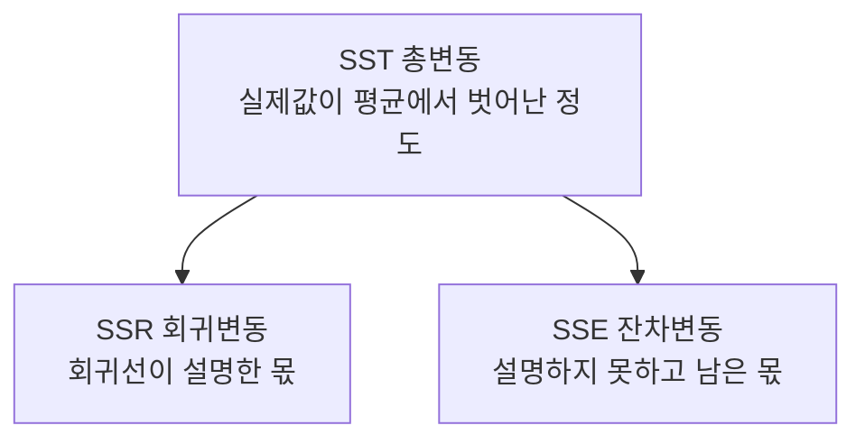
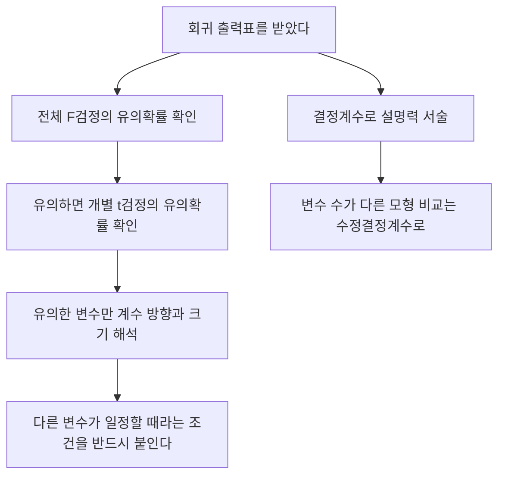

<Callout type="info">
  **이번 문서의 목표:** 이 파일을 다 읽으면 데이터 다섯 점으로 공분산과 피어슨 상관계수, 회귀계수, 결정계수 $R^2$ 를 손으로 끝까지 계산하고, 회귀 출력표의 계수·유의확률·결정계수를 문장으로 해석하며, 다중공선성(VIF)과 회귀 네 가지 가정의 진단 방법을 골라낼 수 있게 된다.
</Callout>

## 0. 앞 편에서 가져오는 것

15편(추론통계와 가설검정)에서 다룬 **귀무가설**(null hypothesis, 귀무가설), **유의수준**(significance level, 유의수준), **p값**(p-value, 유의확률), **F검정**(F-test, F검정)은 이번 편의 회귀 유의성 판정에 그대로 쓰입니다. "p값이 유의수준보다 작으면 귀무가설을 기각한다"는 규칙만 기억하고 오면 됩니다. 자세한 내용은 15편을 참고하세요. 14편의 평균·분산·표준편차 정의도 그대로 씁니다.

## 1. 왜 두 변수의 관계를 재는가

지금까지는 변수를 하나씩만 봤습니다. 평균 키, 매출의 분산처럼요. 그런데 현장의 질문은 거의 항상 **둘 이상의 변수 사이**를 묻습니다. "광고비를 더 쓰면 매출이 오르나?", "공부 시간과 성적은 얼마나 붙어 다니나?", "나이가 많을수록 최대 심박수가 낮아지나?"

이 질문에 답하는 도구가 둘입니다.

- **상관분석**(correlation analysis, 상관분석): 두 변수가 **얼마나 같이 움직이는지** 그 강도와 방향을 하나의 숫자로 요약합니다. 어느 쪽이 원인인지는 묻지 않습니다.
- **회귀분석**(regression analysis, 회귀분석): 한 변수로 다른 변수를 **예측하는 식**을 세웁니다. 방향이 정해져 있습니다.

> **쉽게 말하면:** 상관은 "둘이 얼마나 친한가"를 재고, 회귀는 "하나를 알면 다른 하나를 얼마로 예측할까"를 식으로 씁니다.

## 2. 공분산 — 함께 움직이는 정도

### 왜 필요한가

두 변수가 함께 움직이는 정도를 재려면, 각 변수가 자기 평균에서 얼마나 벗어났는지를 곱해서 살펴보면 됩니다. 광고비가 평균보다 높은 달에 매출도 평균보다 높다면, 두 편차의 곱은 양수(플러스 곱하기 플러스)입니다. 광고비가 평균보다 낮은 달에 매출도 낮아도 곱은 양수(마이너스 곱하기 마이너스)입니다. 반대로 움직이면 곱이 음수가 됩니다. 이 곱들을 평균 내면 "같이 움직이는 정도"가 나옵니다.

> **쉽게 말하면:** 공분산은 두 변수의 편차를 곱해서 평균 낸 값으로, 부호가 방향을 알려 줍니다.

### 정의

**공분산**(covariance, 공분산)의 표본 공식은 다음과 같습니다.

$$
S_{xy} = \frac{\sum (x_i - \bar{x})(y_i - \bar{y})}{n - 1}
$$

- $x_i$, $y_i$ : $i$ 번째 관측치의 두 변수 값
- $\bar{x}$ (엑스바), $\bar{y}$ (와이바) : 각 변수의 표본평균
- $\sum$ (시그마) : 모두 더하라는 기호
- $n$ : 관측치 개수
- $n-1$ : 자유도. 표본평균을 이미 썼기 때문에 하나를 뺍니다

공분산의 부호가 양수면 **같은 방향**, 음수면 **반대 방향**, 0에 가까우면 선형 관계가 거의 없다는 뜻입니다.

### 공분산의 치명적 약점

공분산에는 단위가 그대로 붙어 있습니다. 광고비를 원 단위로 재면 공분산이 백만 배로 커집니다. 값이 커졌다고 관계가 강해진 것이 아닌데도 숫자만 커집니다. 그래서 **공분산 값의 크기만으로는 관계의 강도를 비교할 수 없습니다.** 이 문제를 없애려고 만든 것이 다음 절의 상관계수입니다.

또 하나. 공분산과 상관계수는 **선형적인 관계만** 잡아냅니다. U자 모양처럼 휘어진 관계는 편차의 곱이 양수 구간과 음수 구간에서 서로 상쇄되어 0에 가깝게 나옵니다. "상관계수가 0이면 아무 관계가 없다"는 말이 틀린 이유입니다.

## 3. 피어슨 상관계수 — 단위를 지운 관계의 강도

> **쉽게 말하면:** 상관계수는 공분산을 두 표준편차로 나눠 단위를 지우고, 값을 –1과 1 사이로 눌러 담은 것입니다.

**피어슨 상관계수**(Pearson correlation coefficient, 피어슨 상관계수, 기호 $r$)의 공식입니다.

$$
r = \frac{S_{xy}}{s_x \times s_y}
$$

- $S_{xy}$ : 두 변수의 공분산
- $s_x$, $s_y$ : 각 변수의 표본표준편차

계산에 편한 형태로는 다음과 같이도 씁니다. 분모·분자의 $n-1$ 이 약분되기 때문입니다.

$$
r = \frac{\sum (x_i - \bar{x})(y_i - \bar{y})}{\sqrt{\sum (x_i - \bar{x})^2 \times \sum (y_i - \bar{y})^2}}
$$

값의 의미는 이렇습니다.

| 상관계수 값 | 해석 |
| --- | --- |
| 1에 가까움 | 강한 양의 선형관계. 한쪽이 오르면 다른 쪽도 오른다 |
| 0.7 부근 | 뚜렷한 양의 관계 |
| 0 부근 | 선형관계가 거의 없음(휘어진 관계는 있을 수 있음) |
| –0.7 부근 | 뚜렷한 음의 관계 |
| –1에 가까움 | 강한 음의 선형관계 |

## 4. 손계산 ① — 공분산·상관계수·회귀계수를 데이터 5점으로

한 카페가 5개월 동안 쓴 월 광고비와 그 달의 매출을 기록했습니다. 단위는 둘 다 백만원입니다.

| 월 | 광고비 $x$ | 매출 $y$ |
| --- | --- | --- |
| 1월 | 1 | 6 |
| 2월 | 2 | 9 |
| 3월 | 3 | 9 |
| 4월 | 4 | 11 |
| 5월 | 5 | 15 |

**1단계 — 광고비의 평균**

$$
\bar{x} = \frac{1 + 2 + 3 + 4 + 5}{5} = \frac{15}{5} = 3
$$

**2단계 — 매출의 평균**

$$
\bar{y} = \frac{6 + 9 + 9 + 11 + 15}{5} = \frac{50}{5} = 10
$$

**3단계 — 편차표 만들기**

각 달의 편차와 그 곱, 그리고 제곱을 표로 펼칩니다. 여기서 한 칸이라도 틀리면 뒤의 모든 값이 틀어지니 천천히 채웁니다.

| 월 | $x_i - \bar{x}$ | $y_i - \bar{y}$ | 곱 | $x$ 편차의 제곱 | $y$ 편차의 제곱 |
| --- | --- | --- | --- | --- | --- |
| 1월 | –2 | –4 | 8 | 4 | 16 |
| 2월 | –1 | –1 | 1 | 1 | 1 |
| 3월 | 0 | –1 | 0 | 0 | 1 |
| 4월 | 1 | 1 | 1 | 1 | 1 |
| 5월 | 2 | 5 | 10 | 4 | 25 |
| 합계 | 0 | 0 | 20 | 10 | 44 |

편차의 합이 둘 다 0이 되는지 반드시 확인하세요. 0이 아니면 평균 계산이 틀린 것입니다.

**4단계 — 곱의 합**

$$
\sum (x_i - \bar{x})(y_i - \bar{y}) = 8 + 1 + 0 + 1 + 10 = 20
$$

**5단계 — 공분산**

$$
S_{xy} = \frac{20}{5 - 1} = \frac{20}{4} = 5
$$

**6단계 — 광고비의 분산**

$$
s_x^2 = \frac{10}{4} = 2.5
$$

**7단계 — 광고비의 표준편차**

$$
s_x = \sqrt{2.5} \approx 1.5811
$$

**8단계 — 매출의 분산**

$$
s_y^2 = \frac{44}{4} = 11
$$

**9단계 — 매출의 표준편차**

$$
s_y = \sqrt{11} \approx 3.3166
$$

**10단계 — 피어슨 상관계수**

$$
r = \frac{5}{1.5811 \times 3.3166} \approx \frac{5}{5.2440} \approx 0.9535
$$

**결론 해석:** 상관계수가 약 0.95로 1에 매우 가깝습니다. 광고비가 많은 달에 매출도 확실하게 높았다는 뜻입니다. 다만 이 숫자는 **광고가 매출을 올렸다는 증거가 아닙니다.** 매출이 잘 나오는 달에 마케팅 예산을 더 쓴 것일 수도 있고, 성수기라는 제3의 요인이 둘을 동시에 밀어 올렸을 수도 있습니다.

### 이어서 회귀계수 구하기

**최소제곱법**(Ordinary Least Squares, OLS, 최소제곱법)은 잔차의 제곱합이 가장 작아지는 직선을 찾는 방법입니다. 그 해가 다음 두 식입니다.

$$
b_1 = \frac{\sum (x_i - \bar{x})(y_i - \bar{y})}{\sum (x_i - \bar{x})^2}
$$

- $b_1$ : 기울기(회귀계수). 설명변수가 1 늘 때 반응변수가 평균적으로 얼마나 변하는지
- 분자는 4단계에서 구한 곱의 합, 분모는 편차표의 $x$ 편차 제곱합

**11단계 — 기울기**

$$
b_1 = \frac{20}{10} = 2
$$

**12단계 — 절편**

$$
b_0 = \bar{y} - b_1 \bar{x} = 10 - 2 \times 3 = 4
$$

**13단계 — 회귀식 완성**

$$
\hat{y} = 4 + 2x
$$

- $\hat{y}$ (와이햇) : 모형이 예측한 매출값
- $4$ : 절편. 광고비가 0일 때의 예측 매출
- $2$ : 기울기. 광고비를 100만원 더 쓰면 매출이 평균 200만원 늘어난다고 추정

**결론 해석:** 광고비를 1백만원 늘리면 매출이 평균 2백만원 증가하는 관계로 추정되었습니다. 절편 4는 "광고비가 0인 달의 예상 매출 4백만원"이지만, 실제 데이터에 광고비 0인 달이 없다면 **관측 범위 밖의 외삽**이라 그대로 믿으면 안 됩니다. 절편 해석을 그대로 신뢰하게 만드는 보기가 시험 함정으로 자주 나옵니다.

## 5. 잔차 — 모형이 못 맞힌 부분

> **쉽게 말하면:** 잔차는 실제값에서 예측값을 뺀 나머지, 즉 모형이 설명하지 못하고 남긴 오차입니다.

**잔차**(residual, 잔차)의 정의입니다.

$$
e_i = y_i - \hat{y}_i
$$

- $y_i$ : 실제 관측된 값
- $\hat{y}_i$ : 회귀식이 예측한 값

앞의 회귀식 $\hat{y} = 4 + 2x$ 로 다섯 달의 예측값과 잔차를 구해 봅시다.

| 월 | $x$ | 실제 $y$ | 예측 $\hat{y}$ | 잔차 $e$ | 잔차의 제곱 |
| --- | --- | --- | --- | --- | --- |
| 1월 | 1 | 6 | 6 | 0 | 0 |
| 2월 | 2 | 9 | 8 | 1 | 1 |
| 3월 | 3 | 9 | 10 | –1 | 1 |
| 4월 | 4 | 11 | 12 | –1 | 1 |
| 5월 | 5 | 15 | 14 | 1 | 1 |
| 합계 | – | 50 | 50 | 0 | 4 |

**잔차의 합은 항상 0입니다.** 최소제곱법이 직선을 데이터의 한가운데를 지나가게 맞추기 때문입니다. 그래서 잔차를 그냥 더해서는 모형의 나쁨을 잴 수 없고, 반드시 **제곱해서** 더합니다. 여기서 오차와 잔차를 구분해 둡시다. **오차**(error, 오차)는 알 수 없는 참 모형과의 차이이고, **잔차**(residual, 잔차)는 우리가 추정한 모형과의 차이입니다. 우리가 눈으로 볼 수 있는 것은 잔차뿐입니다.

## 6. 변동의 분해와 결정계수

### 왜 필요한가

기울기가 2라는 사실만으로는 "이 모형이 쓸 만한가"를 알 수 없습니다. 매출이 원래 들쭉날쭉하던 것 중에서 **광고비로 설명해 낸 몫이 얼마나 되는지**를 재야 합니다. 그 몫이 결정계수입니다.

> **쉽게 말하면:** 결정계수는 매출이 흔들리던 전체 폭 중 회귀선이 설명해 낸 비율입니다.

매출의 총 변동은 다음처럼 정확히 두 조각으로 쪼개집니다.

$$
SST = SSR + SSE
$$

- $SST$ (Total Sum of Squares, 총제곱합) : 실제값과 전체 평균의 차이를 제곱해 더한 값
- $SSR$ (Regression Sum of Squares, 회귀제곱합) : 예측값과 전체 평균의 차이를 제곱해 더한 값
- $SSE$ (Error Sum of Squares, 잔차제곱합) : 실제값과 예측값의 차이, 즉 잔차를 제곱해 더한 값

결정계수의 정의는 이렇습니다.

$$
R^2 = \frac{SSR}{SST} = 1 - \frac{SSE}{SST}
$$

### 손계산 ② — 결정계수를 SSR 나누기 SST로 직접

**1단계 — SST 구하기**

편차표에서 이미 구한 매출 편차의 제곱합이 그대로 SST입니다.

$$
SST = 16 + 1 + 1 + 1 + 25 = 44
$$

**2단계 — SSE 구하기**

잔차표의 잔차 제곱합입니다.

$$
SSE = 0 + 1 + 1 + 1 + 1 = 4
$$

**3단계 — SSR 구하기**

$$
SSR = SST - SSE = 44 - 4 = 40
$$

**4단계 — 결정계수**

$$
R^2 = \frac{40}{44} \approx 0.9091
$$

**5단계 — 검산: 단순회귀에서는 상관계수의 제곱과 같다**

$$
r^2 = 0.9535^2 \approx 0.9091
$$

**결론 해석:** 매출이 가지는 총 변동의 약 90.9퍼센트를 광고비 하나로 설명했습니다. 나머지 약 9.1퍼센트는 이 모형이 설명하지 못한 부분입니다. 그리고 **설명변수가 하나인 단순회귀에서만** 결정계수가 상관계수의 제곱과 일치합니다. 설명변수가 여럿인 다중회귀에서는 개별 상관계수의 제곱을 더한다고 결정계수가 나오지 않습니다. 이것도 자주 나오는 함정입니다.

### 수정결정계수

결정계수에는 고약한 성질이 하나 있습니다. **아무 의미 없는 변수를 넣어도 결정계수는 절대 떨어지지 않고 오르기만 합니다.** 변수를 넣을수록 직선이 데이터에 더 잘 붙기 때문입니다. 그래서 변수 개수가 다른 두 모형의 설명력을 비교할 때는 벌점을 매긴 **수정결정계수**(adjusted R-squared, 수정결정계수)를 씁니다.

$$
R_{adj}^2 = 1 - \frac{(1 - R^2)(n - 1)}{n - p - 1}
$$

- $n$ : 관측치 개수
- $p$ : 설명변수의 개수
- $R^2$ : 원래의 결정계수

앞 예시에 넣어 보면 $n = 5$, $p = 1$ 이므로 다음과 같습니다.

$$
R_{adj}^2 = 1 - \frac{(1 - 0.9091) \times 4}{3} \approx 1 - 0.1212 = 0.8788
$$

수정결정계수는 쓸모없는 변수를 넣으면 **오히려 내려갑니다.** 정리하면 다음과 같습니다.

| 상황 | 결정계수 | 수정결정계수 |
| --- | --- | --- |
| 의미 있는 변수 추가 | 오른다 | 오른다 |
| 의미 없는 변수 추가 | 오른다(또는 그대로) | 내려간다 |
| 설명력 해석용 | 이쪽을 쓴다 | – |
| 변수 수가 다른 모형 비교 | – | 이쪽을 쓴다 |

## 7. 회귀모형 전체의 유의성 — ANOVA F검정

회귀선이 그럴듯해 보여도, 그것이 우연히 그렇게 보이는 것일 수 있습니다. 그래서 15편의 가설검정을 그대로 가져와 모형 전체를 검정합니다.

- 귀무가설: 모든 회귀계수가 0이다. 즉 이 모형은 아무것도 설명하지 못한다.
- 대립가설: 적어도 하나의 회귀계수는 0이 아니다.

검정통계량은 **평균제곱의 비율**입니다.

$$
F = \frac{MSR}{MSE}
$$

- $MSR$ (Mean Square Regression, 회귀평균제곱) : $SSR$ 을 설명변수 개수 $p$ 로 나눈 값
- $MSE$ (Mean Squared Error, 평균제곱오차) : $SSE$ 를 $n - p - 1$ 로 나눈 값

앞 예시로 계산하면 이렇습니다.

$$
MSR = \frac{40}{1} = 40
$$

$$
MSE = \frac{4}{5 - 1 - 1} = \frac{4}{3} \approx 1.333
$$

$$
F = \frac{40}{1.333} \approx 30
$$

**결론 해석:** F값이 30으로 충분히 크므로, 유의수준 0.05에서 "모든 회귀계수가 0"이라는 귀무가설을 기각합니다. 즉 광고비는 매출을 설명하는 데 통계적으로 의미가 있습니다.

한편 **개별 변수의 유의성**은 각 계수의 t통계량과 그 유의확률로 판정합니다. 귀무가설은 "해당 계수가 0이다"입니다. F검정과 t검정의 역할을 구분해 두세요.

| 검정 | 귀무가설 | 무엇을 판정하나 |
| --- | --- | --- |
| 전체 F검정 | 모든 회귀계수가 0이다 | 모형이 통째로 쓸모 있는가 |
| 개별 t검정 | 그 변수의 계수가 0이다 | 그 변수 하나가 쓸모 있는가 |

## 8. 다중회귀 — 변수가 여럿일 때

**다중회귀**(multiple regression, 다중회귀)는 설명변수가 둘 이상인 회귀입니다.

$$
\hat{y} = b_0 + b_1 x_1 + b_2 x_2 + \cdots + b_p x_p
$$

- $b_0$ : 절편
- $b_1 \sim b_p$ : 각 설명변수의 회귀계수
- $x_1 \sim x_p$ : 설명변수들

여기서 계수 해석이 단순회귀와 결정적으로 달라집니다. 다중회귀의 $b_1$ 은 **다른 설명변수들의 값이 모두 일정하게 고정되었을 때** $x_1$ 이 1 늘면 $y$ 가 평균적으로 얼마나 변하는지를 뜻합니다. 이 조건을 빼먹은 해석이 시험 오답 보기로 늘 등장합니다.

예를 들어 카페 매출을 좌석수, 역까지거리, 사무실수, 광고비로 설명한 회귀 출력이 있다고 합시다. 2023년 06회차 기출에 나온 형태입니다.

| 변수 | 계수 | 유의확률 | 해석 |
| --- | --- | --- | --- |
| 상수항 | 12.40 | 0.001 | 모든 변수가 0일 때의 기준값 |
| 좌석수 | 0.85 | 0.000 | 다른 변수가 같을 때 좌석 1석당 매출 0.85 증가 |
| 역까지거리 | –0.60 | 0.001 | 멀수록 매출이 낮아지는 방향 |
| 사무실수 | 0.03 | 0.455 | 유의확률이 크므로 유의하지 않음 |
| 광고비 | 1.60 | 0.003 | 다른 변수가 같을 때 광고비 1단위당 매출 1.6 증가 |

이 표를 읽을 때 함정은 세 가지입니다.

- **계수의 크기로 중요도를 비교하면 안 됩니다.** 변수마다 단위가 다르기 때문입니다. 좌석수는 석 단위, 광고비는 백만원 단위라서 0.85와 1.60을 직접 비교할 수 없습니다.
- **개별 변수가 유의하지 않다고 해서 그 변수군 전체가 무의미한 것은 아닙니다.** "역까지거리와 사무실수는 둘 다 입지 변수이므로 입지 요인 전체가 유의하다" 같은 진술은 근거 없는 비약입니다.
- **유의확률이 크다고 계수가 정확히 0인 것은 아닙니다.** 0이라는 주장을 기각할 증거가 부족할 뿐입니다.

## 9. 다중공선성과 VIF

### 왜 문제인가

설명변수끼리 서로 강하게 상관되어 있으면, 회귀는 "이 효과가 어느 변수 때문인지" 구분하지 못합니다. 키와 팔길이를 동시에 넣고 몸무게를 예측한다고 상상해 보세요. 둘은 거의 같은 정보를 담고 있어서, 모형은 키에 큰 양수 계수를 주고 팔길이에 큰 음수 계수를 주는 식으로 아무렇게나 균형을 맞출 수 있습니다.

> **쉽게 말하면:** 다중공선성은 설명변수끼리 너무 닮아서 누구 공인지 가릴 수 없게 된 상태입니다.

**다중공선성**(multicollinearity, 다중공선성)이 심하면 나타나는 증상은 다음과 같습니다.

- 회귀계수의 **표준오차가 커지고** 계수 추정치가 불안정해집니다. 데이터가 조금만 바뀌어도 부호가 뒤집힙니다.
- 모형 전체의 F검정은 유의한데 **개별 변수는 아무것도 유의하지 않은** 이상한 결과가 나옵니다.
- 상식과 반대 부호의 계수가 나옵니다.
- 다만 **예측 자체의 정확도는 크게 손상되지 않을 수도 있습니다.** 문제는 계수 해석입니다.

### VIF로 진단하기

**분산팽창요인**(Variance Inflation Factor, VIF, 분산팽창요인)은 각 설명변수를 나머지 설명변수들로 회귀했을 때의 설명력을 이용해 계산합니다.

$$
VIF_j = \frac{1}{1 - R_j^2}
$$

- $VIF_j$ : $j$ 번째 설명변수의 분산팽창요인
- $R_j^2$ : $j$ 번째 변수를 나머지 설명변수들로 회귀했을 때의 결정계수

예를 들어 어떤 변수가 다른 변수들로 90퍼센트 설명된다면 다음과 같습니다.

$$
VIF = \frac{1}{1 - 0.9} = 10
$$

관례상 **VIF가 10을 넘으면 다중공선성이 심각하다**고 보고, 5를 넘으면 주의합니다. 대처 방법은 상관이 높은 변수 중 하나를 제거하거나, 주성분분석(PCA)으로 변수를 합치거나, 뒤에서 볼 릿지 회귀 같은 규제를 쓰는 것입니다.

**자주 틀리는 점:** 기존 변수와 비슷한 변수를 하나 더 추가하면 다중공선성은 **완화되는 것이 아니라 심해집니다.** 2025년 10회차 기출에 그대로 출제되었습니다.

## 10. 회귀분석의 네 가지 가정과 진단 방법

회귀 결과를 믿으려면 모형이 전제한 조건이 지켜져야 합니다. 시험은 **가정 이름과 진단 방법의 짝**을 그대로 물어봅니다. 표를 통째로 외우는 편이 빠릅니다.

| 가정 | 내용 | 진단·검정 방법 |
| --- | --- | --- |
| 선형성 | 설명변수와 반응변수 사이에 선형 관계가 있다 | 산점도, 잔차그림, Ramsey RESET 검정 |
| 등분산성 | 예측값이 크든 작든 오차의 분산이 일정하다 | 잔차그림, Levene 검정, Bartlett 검정 |
| 독립성 | 잔차가 시점과 무관하게 서로 독립이다 | Durbin–Watson 검정 |
| 정규성 | 오차가 정규분포를 따른다 | Shapiro–Wilk 검정, Kolmogorov–Smirnov 검정, Anderson–Darling 검정, Q–Q 도표 |
| 비다중공선성 | 설명변수끼리 강한 상관이 없다 | 분산팽창요인 VIF |

각 항목을 감각적으로 붙잡아 둡시다.

- **선형성**(linearity, 선형성): 잔차를 예측값에 대해 그렸을 때 곡선 패턴이 보이면 위반입니다. 곡선이 보이면 로그 변환이나 제곱항 추가를 검토합니다.
- **등분산성**(homoscedasticity, 등분산성): 잔차 그림이 오른쪽으로 갈수록 부채꼴로 벌어지면 위반입니다. 매출처럼 규모가 커질수록 오차도 커지는 자료에서 흔합니다.
- **독립성**(independence, 독립성): 시계열 자료에서 잔차가 오늘과 어제 서로 닮아 있으면 위반입니다. 이를 **자기상관**(autocorrelation, 자기상관)이라고 합니다.
- **정규성**(normality, 정규성): 오차가 정규분포를 따라야 t검정과 F검정의 유의확률을 믿을 수 있습니다.

**더빈–왓슨 통계량**(Durbin–Watson statistic)에는 시험이 좋아하는 특징이 있습니다.

- 값의 범위가 0에서 4 사이입니다.
- **2에 가까우면 자기상관이 없다**고 봅니다. 0에 가까우면 양의 자기상관, 4에 가까우면 음의 자기상관입니다.
- 다른 검정과 달리 **유의확률이 따로 나오지 않습니다.** 상한과 하한 표를 보고 판정합니다.

또 하나 자주 나오는 함정. **Shapiro–Wilk 검정과 Kolmogorov–Smirnov 검정은 정규성 진단 도구**이고, **독립표본 t검정은 두 집단 평균 비교 도구**입니다. 2025년 10회차 기출에서 "정규성 평가를 주된 목적으로 하지 않는 것"을 고르는 문항으로 나왔습니다.

그리고 **지레점**(leverage point, 지레점)과 **영향점**(influential point, 영향점)도 함께 정리해 둡니다. 지레점은 설명변수 값이 다른 관측치들에서 멀리 떨어진 점이고, 영향점은 그 점 하나를 빼면 회귀 추정 결과가 크게 달라지는 점입니다. 지레점이라고 항상 영향점인 것은 아닙니다.

**쿡의 거리**(Cook's distance)는 이 영향점을 숫자 하나로 재는 대표 지표입니다. 관측치 하나를 뺐을 때 나머지 자료로 다시 적합한 회귀식의 적합값 전체가 얼마나 달라지는지를 계산합니다. 값이 크게 튀는 관측치가 있으면 그 하나가 계수 추정을 과도하게 흔들고 있다는 신호이므로, 제거·재조사 여부를 검토합니다. **자주 틀리는 점:** 다중공선성을 재는 분산팽창지수(VIF)나 모형 간 비교에 쓰는 아카이케 정보기준(AIC)을 쿡의 거리와 헷갈리는 보기가 나옵니다. VIF는 변수끼리의 관계, AIC는 모형 전체의 적합도-복잡도 균형을 재는 것이지 개별 관측치의 영향력을 재는 지표가 아닙니다.

## 11. 스피어만·켄달 — 순위로 재는 상관

피어슨 상관계수는 평균과 편차의 곱에 기반하기 때문에 **극단값 하나에도 크게 흔들립니다.** 2025년 10회차 기출에도 "피어슨 상관은 극단값의 영향을 거의 받지 않는 강건한 척도다"가 **틀린 진술**로 나왔습니다. 또한 피어슨은 등간척도 이상에서만 쓸 수 있고, 관계가 직선일 때만 제대로 작동합니다.

그래서 순위를 쓰는 상관계수가 있습니다.

| 상관계수 | 무엇을 재나 | 사용 가능한 척도 | 모수/비모수 |
| --- | --- | --- | --- |
| 피어슨 (Pearson) | 직선 관계의 강도 | 등간척도 이상 | 모수 |
| 스피어만 (Spearman) | 순위가 비슷하게 움직이는지 | 서열척도 이상 | 비모수 |
| 켄달 (Kendall) | 순서가 일치하는 쌍이 얼마나 많은지 | 서열척도 이상 | 비모수 |

### 스피어만이 빛나는 상황

학생 5명의 공부시간과 성적이 다음과 같다고 합시다.

| 학생 | 공부시간 | 성적 | 공부시간 순위 | 성적 순위 |
| --- | --- | --- | --- | --- |
| A | 1 | 2 | 1 | 1 |
| B | 2 | 4 | 2 | 2 |
| C | 3 | 9 | 3 | 3 |
| D | 4 | 25 | 4 | 4 |
| E | 5 | 100 | 5 | 5 |

성적이 폭발적으로 휘어져 오르기 때문에 피어슨 상관계수는 1보다 꽤 작게 나옵니다. 직선이 아니니까요. 그러나 **순위는 완벽하게 일치**하므로 **스피어만 상관계수**(Spearman rank correlation, 스피어만 순위상관)는 정확히 1이 됩니다. 관계의 방향이 한결같이 증가하기만 하면(이를 **단조 관계**, monotonic relationship이라고 합니다) 스피어만은 1을 돌려줍니다.

**켄달 타우**(Kendall tau, 켄달 타우)는 모든 쌍을 훑어 순서가 일치하는 쌍(일치쌍)과 뒤집힌 쌍(불일치쌍)의 개수를 세는 방식입니다.

$$
\tau = \frac{C - D}{n(n-1)/2}
$$

- $C$ : 순서가 일치하는 쌍의 개수
- $D$ : 순서가 뒤집힌 쌍의 개수
- $n(n-1)/2$ : 만들 수 있는 전체 쌍의 개수

위 표에서는 모든 쌍이 일치하므로 $D = 0$ 이고 타우는 1입니다.

시험에서는 계산보다 **선택 문제**로 나옵니다. "두 서열척도 변수의 단조 관계를 측정하기에 가장 적절한 상관계수는?"이면 스피어만입니다. 2024년 08회차 기출 그대로입니다. 참고로 **편상관계수**(partial correlation coefficient, 편상관계수)는 제3의 변수 영향을 통제한 뒤 남는 선형 연관을 재는 것으로, 같은 회차에 별도 문항으로 출제되었습니다.

## 12. 변수선택 — 어떤 변수를 넣을 것인가

변수를 많이 넣을수록 결정계수는 오르지만 과적합이 심해지고 다중공선성도 늘어납니다. 그래서 변수를 골라야 합니다.

| 방법 | 절차 | 특징 |
| --- | --- | --- |
| 전진선택법 (forward selection) | 아무 변수도 없는 상태에서 시작해 가장 도움되는 변수를 하나씩 추가 | 한번 들어온 변수는 빠지지 않는다 |
| 후진제거법 (backward elimination) | 모든 변수를 넣고 시작해 가장 쓸모없는 변수를 하나씩 제거 | 변수가 아주 많으면 계산 부담이 크다 |
| 단계적선택법 (stepwise selection) | 추가와 제거를 번갈아 반복 | 전진과 후진의 절충. 실무에서 가장 흔하다 |

선택 기준으로는 유의확률, 수정결정계수, **AIC**(Akaike Information Criterion, 아카이케 정보기준), **BIC**(Bayesian Information Criterion, 베이즈 정보기준) 등을 씁니다. AIC와 BIC는 **값이 작을수록 좋은 모형**입니다. 결정계수와 방향이 반대라서 헷갈리기 쉽습니다.

## 13. 규제 — 과적합을 벌점으로 누르기

### 왜 필요한가

관측치 수에 비해 설명변수를 너무 많이 넣으면, 모형이 훈련 데이터의 잡음까지 외워 버립니다. 이것이 **과적합**(overfitting, 과대적합)입니다. 규제는 회귀계수가 커지는 것 자체에 벌점을 매겨 모형을 얌전하게 만듭니다.

> **쉽게 말하면:** 규제는 "틀리지 않게 맞춰라, 단 계수를 함부로 키우지는 마라"는 조건을 하나 더 거는 것입니다.

**규제**(regularization, 규제 또는 정규화)의 세 가지 방식입니다.

| 이름 | 벌점의 형태 | 특징 |
| --- | --- | --- |
| 라쏘 (Lasso, L1) | 회귀계수 절댓값의 합 | 계수를 정확히 0으로 만들어 **변수 선택 효과**가 있다 |
| 릿지 (Ridge, L2) | 회귀계수 제곱의 합 | 계수를 0에 가깝게 줄이지만 0으로 만들지는 않는다. 다중공선성 완화에 강하다 |
| 엘라스틱넷 (Elastic Net) | 절댓값 합과 제곱 합의 혼합 | 라쏘와 릿지의 장점을 섞는다 |

일반 선형회귀는 잔차제곱합 $SSE$ 만 최소화하지만, 규제 회귀는 여기에 벌점 항을 더한 값을 최소화합니다. 라쏘의 목적함수는 다음과 같습니다.

$$
SSE + \lambda \sum_{j=1}^{p} |b_j|
$$

- $\lambda$ (람다) : 벌점의 세기를 조절하는 하이퍼파라미터
- $|b_j|$ : $j$ 번째 회귀계수의 절댓값

릿지는 절댓값 대신 제곱을 씁니다.

$$
SSE + \lambda \sum_{j=1}^{p} b_j^2
$$

$\lambda$ 가 0이면 일반 회귀와 같아지고, $\lambda$ 가 커질수록 계수들이 강하게 눌립니다. **라쏘는 변수를 골라 주고, 릿지는 골고루 줄인다**는 한 줄만 확실히 잡아 두면 시험에서는 충분합니다.

## 14. 시험에서 어떻게 물어보나

이 단원은 2과목(빅데이터 탐색)의 상관분석과 3과목·4과목의 회귀 모형 해석에 걸쳐 매 회차 여러 문항이 나옵니다. 유형은 여섯 가지입니다.

**유형 1 — 상관계수 성질의 옳고 그름**

"상관계수에 관한 설명으로 옳지 않은 것은?"이 대표 형태입니다. 함정 보기는 정해져 있습니다. 피어슨이 극단값에 강건하다, 상관계수가 0이면 아무 관계가 없다, 상관계수가 크면 인과관계가 있다, 상관계수는 단위에 따라 달라진다 — 네 가지 모두 틀린 진술입니다.

**유형 2 — 상황을 주고 상관계수 고르기**

서열척도 두 변수면 스피어만, 제3의 변수를 통제하면 편상관계수, 등간척도의 직선 관계면 피어슨입니다. "나이가 많을수록 최대 심박수가 낮아진다"처럼 방향만 주고 타당한 값을 고르게 하는 문항도 있습니다. 이때는 **부호가 음수이고 절댓값이 1을 넘지 않는 값**을 고르면 됩니다.

**유형 3 — 회귀 출력표 해석**

계수·표준오차·t값·유의확률이 담긴 표를 주고 옳은 진술을 고르게 합니다. 판정 순서를 이렇게 잡으세요.

**유형 4 — 결정계수 계산과 의미**

$SSR$, $SSE$, $SST$ 중 두 개를 주고 결정계수를 구하게 하거나, 결정계수의 성질을 묻습니다. "결정계수는 변수를 추가하면 감소할 수 있다"는 보기는 틀렸습니다. 감소할 수 있는 것은 수정결정계수입니다.

**유형 5 — 가정과 진단 방법 짝짓기**

"잔차의 시계열 자기상관을 진단하는 통계량은?"이면 더빈–왓슨, "정규성 검정은?"이면 샤피로–윌크, "다중공선성 진단은?"이면 VIF입니다. 2024년 08회차와 2025년 10회차에 모두 나왔습니다.

**유형 6 — 규제와 변수선택**

"계수를 정확히 0으로 만들어 변수 선택 효과가 있는 규제 기법은?"이면 라쏘입니다. "회귀 ANOVA 표에서 F 통계량을 구하는 식은?"이면 회귀평균제곱을 잔차평균제곱으로 나눈 값입니다.

## 15. 헷갈리는 짝 정리

| 헷갈리는 짝 | 구분 기준 |
| --- | --- |
| 공분산 vs 상관계수 | 공분산은 단위가 남아 크기 비교 불가, 상관계수는 –1에서 1로 표준화 |
| 상관 vs 인과 | 상관은 함께 움직임만 말한다. 원인과 결과를 주장하지 않는다 |
| 오차 vs 잔차 | 오차는 참 모형과의 차이(관측 불가), 잔차는 추정 모형과의 차이(관측 가능) |
| 결정계수 vs 수정결정계수 | 설명력 해석은 결정계수, 변수 수가 다른 모형 비교는 수정결정계수 |
| SSR vs SSE | SSR은 모형이 설명한 몫, SSE는 설명 못 한 잔차의 몫 |
| 전체 F검정 vs 개별 t검정 | F는 모형 전체, t는 변수 하나 |
| 라쏘 vs 릿지 | 라쏘는 계수를 0으로 만들어 변수 선택, 릿지는 0에 가깝게만 줄임 |
| 지레점 vs 영향점 | 지레점은 설명변수가 멀리 있는 점, 영향점은 빼면 결과가 크게 바뀌는 점 |
| 쿡의 거리 vs VIF·AIC | 쿡의 거리는 개별 관측치의 영향력, VIF는 변수 간 다중공선성, AIC는 모형 전체의 적합도-복잡도 균형을 잰다 |

## 핵심 정리

- **공분산**은 두 변수 편차의 곱의 평균으로 방향을 알려 주지만 단위가 남아 강도 비교가 불가능하다. 이를 두 표준편차로 나눠 –1에서 1로 표준화한 것이 **피어슨 상관계수**다. 서열척도이거나 단조 관계면 스피어만·켄달을 쓴다.
- 최소제곱 회귀의 기울기는 곱편차합을 $x$ 편차제곱합으로 나눈 값이고, 절편은 $\bar{y}$ 에서 기울기 곱하기 $\bar{x}$ 를 뺀 값이다. 잔차의 합은 항상 0이므로 모형의 나쁨은 반드시 제곱해서 잰다.
- 총변동 $SST$ 는 회귀변동 $SSR$ 과 잔차변동 $SSE$ 로 정확히 분해되고, **결정계수는 $SSR$ 을 $SST$ 로 나눈 값**이다. 단순회귀에서는 상관계수의 제곱과 같다. 변수 수가 다른 모형 비교에는 수정결정계수를 쓴다.
- 다중회귀 계수는 **다른 변수를 고정했을 때**의 효과이며, 단위가 달라 계수 크기로 중요도를 비교할 수 없다. 설명변수끼리 닮으면 다중공선성이 생기고 VIF가 10을 넘으면 심각하다고 본다.
- 회귀 가정은 선형성·등분산성·독립성·정규성이며, 각각 잔차그림, Levene 검정, Durbin–Watson 검정, Shapiro–Wilk 검정으로 진단한다. 과적합은 라쏘(L1), 릿지(L2), 엘라스틱넷으로 억제한다.

## 마무리 복습

<Quiz
  questionNumber={1}
  question="광고비 x가 1, 2, 3, 4, 5이고 매출 y가 6, 9, 9, 11, 15인 5개월 자료에서 x 평균은 3, y 평균은 10이다. 편차 곱의 합이 20이고 x 편차 제곱합이 10일 때 표본 공분산과 회귀 기울기를 바르게 짝지은 것은?"
  options={['① 공분산 4, 기울기 2', '② 공분산 5, 기울기 2', '③ 공분산 5, 기울기 4', '④ 공분산 20, 기울기 10']}
  correctAnswer={2}
  explanation="공분산은 편차 곱의 합 20을 자유도 4로 나눈 5이고, 기울기는 편차 곱의 합 20을 x 편차 제곱합 10으로 나눈 2다. 공분산은 n-1로 나누지만 기울기는 x 편차 제곱합으로 나눈다는 점이 다르다."
  optionExplanations={['공분산을 n으로 나눈 값으로 자유도를 잘못 쓴 결과다.', '공분산 5와 기울기 2를 모두 바르게 구한 정답이다.', '기울기를 구할 때 분모를 잘못 잡은 결과다.', '나누는 단계를 아예 생략하고 합만 적은 값이다.']}
/>

<Quiz
  questionNumber={2}
  question="어떤 단순회귀에서 총제곱합 SST가 44, 잔차제곱합 SSE가 4로 계산되었다. 결정계수로 가장 가까운 값은?"
  options={['① 약 0.091', '② 약 0.500', '③ 약 0.909', '④ 약 1.100']}
  correctAnswer={3}
  explanation="회귀제곱합 SSR은 44에서 4를 뺀 40이고 결정계수는 40을 44로 나눈 약 0.909다. 총 변동의 약 90.9퍼센트를 모형이 설명했다는 뜻이다."
  optionExplanations={['SSE를 SST로 나눈 값으로 설명하지 못한 비율이다.', '분해 과정과 무관한 값이다.', 'SSR 40을 SST 44로 나눈 올바른 결정계수다.', '결정계수는 0과 1 사이여야 하므로 있을 수 없는 값이다.']}
/>

<Quiz
  questionNumber={3}
  question="결정계수와 수정결정계수에 대한 설명으로 가장 적절한 것은?"
  options={['① 설명변수를 추가하면 결정계수는 감소할 수 있다', '② 수정결정계수는 의미 없는 변수를 추가하면 감소할 수 있다', '③ 다중회귀에서도 결정계수는 항상 개별 상관계수의 제곱과 같다', '④ 설명변수 개수가 다른 두 모형은 결정계수로 비교하는 것이 원칙이다']}
  correctAnswer={2}
  explanation="결정계수는 변수를 추가하면 절대 감소하지 않지만, 수정결정계수는 변수 개수에 벌점을 주므로 쓸모없는 변수를 넣으면 감소한다. 그래서 변수 개수가 다른 모형 비교에는 수정결정계수를 쓴다."
  optionExplanations={['결정계수는 변수를 넣으면 유지되거나 증가하며 감소하지 않는다.', '벌점 항 때문에 감소할 수 있다는 올바른 설명이다.', '상관계수 제곱과 일치하는 것은 설명변수가 하나인 단순회귀뿐이다.', '변수 개수가 다르면 수정결정계수로 비교해야 한다.']}
/>

<Quiz
  questionNumber={4}
  question="다중회귀 모형의 다중공선성에 대한 설명으로 옳지 않은 것은?"
  options={['① 회귀계수의 표준오차가 커져 추정이 불안정해질 수 있다', '② 분산팽창요인(VIF)으로 진단할 수 있으며 보통 10을 넘으면 심각하다고 본다', '③ 기존 설명변수와 매우 유사한 변수를 추가하면 다중공선성이 완화된다', '④ 모형 전체 F검정은 유의한데 개별 변수는 유의하지 않은 현상이 나타날 수 있다']}
  correctAnswer={3}
  explanation="비슷한 변수를 더 넣으면 중복 정보가 늘어 다중공선성은 오히려 심해진다. 완화하려면 상관 높은 변수를 제거하거나 주성분분석 또는 릿지 회귀를 쓴다."
  optionExplanations={['다중공선성의 대표 증상을 바르게 서술했다.', 'VIF 진단 기준을 바르게 서술했다.', '유사 변수 추가는 공선성을 악화시키므로 틀린 설명이며 정답이다.', '전체는 유의한데 개별은 유의하지 않은 전형적 증상을 바르게 서술했다.']}
/>

<Quiz
  questionNumber={5}
  question="회귀분석의 가정과 진단 방법의 연결로 가장 적절하지 않은 것은?"
  options={['① 잔차의 독립성 – 더빈-왓슨 검정', '② 오차의 정규성 – 샤피로-윌크 검정', '③ 오차의 등분산성 – 르빈 검정', '④ 설명변수의 다중공선성 – 콜모고로프-스미르노프 검정']}
  correctAnswer={4}
  explanation="콜모고로프-스미르노프 검정은 분포 적합도와 정규성을 보는 검정이며, 다중공선성 진단에는 분산팽창요인 VIF를 쓴다."
  optionExplanations={['잔차 자기상관을 보는 올바른 연결이다.', '정규성 검정으로 널리 쓰이는 올바른 연결이다.', '등분산성 검정으로 쓰이는 올바른 연결이다.', '정규성 계열 검정을 다중공선성에 붙인 잘못된 연결로 정답이다.']}
/>

<Quiz
  questionNumber={6}
  question="서비스 등급과 재구매 의향 순위처럼 두 서열척도 변수의 단조 관계를 측정하기에 가장 적절한 상관계수는?"
  options={['① 피어슨 상관계수', '② 스피어만 상관계수', '③ 결정계수', '④ 편상관계수']}
  correctAnswer={2}
  explanation="스피어만 상관계수는 값 대신 순위를 사용해 단조 관계를 측정하므로 서열척도 자료에 적합하다. 피어슨은 등간척도 이상에서 직선 관계를 잴 때 쓴다."
  optionExplanations={['등간척도 이상에서 직선 관계를 재는 지표라 서열척도에 부적합하다.', '순위를 이용해 단조 관계를 재는 올바른 선택이다.', '회귀모형의 설명력을 나타내는 지표이며 상관계수가 아니다.', '제3의 변수를 통제한 뒤의 선형 연관을 재는 지표다.']}
/>

<Quiz
  questionNumber={7}
  question="회귀계수의 크기에 벌점을 주어 과적합을 억제하는 기법 중, 일부 계수를 정확히 0으로 만들어 변수 선택 효과를 내는 것은?"
  options={['① 릿지 회귀 (L2 규제)', '② 라쏘 회귀 (L1 규제)', '③ 최소제곱법 (OLS)', '④ 주성분분석 (PCA)']}
  correctAnswer={2}
  explanation="라쏘는 회귀계수 절댓값의 합에 벌점을 주기 때문에 일부 계수를 정확히 0으로 만들어 변수 선택 효과를 낸다. 릿지는 제곱합에 벌점을 주어 0에 가깝게 줄이지만 0으로 만들지는 않는다."
  optionExplanations={['계수를 0에 가깝게 줄이지만 정확히 0으로 만들지는 않는다.', '절댓값 벌점으로 계수를 0으로 만드는 올바른 답이다.', '벌점이 없는 기본 회귀 추정법이라 과적합 억제 기능이 없다.', '변수를 합쳐 차원을 줄이는 기법으로 계수에 벌점을 주는 규제가 아니다.']}
/>

<Quiz
  questionNumber={8}
  question="주택 실거래가 회귀모형을 적합한 뒤, 특정 거래 한 건을 제외하면 회귀계수 추정치가 크게 달라지는지 진단하려 한다. 이 목적에 가장 적절한 지표는?"
  options={['① 분산팽창지수(VIF)', '② 쿡의 거리(Cooks distance)', '③ 아카이케 정보기준(AIC)', '④ 결정계수']}
  correctAnswer={2}
  explanation="쿡의 거리는 관측치 하나를 제외했을 때 나머지 자료로 다시 적합한 회귀식의 적합값 전체가 얼마나 달라지는지를 재는 지표로, 개별 관측치의 영향력을 진단하는 데 쓰인다."
  optionExplanations={['분산팽창지수는 설명변수 사이의 다중공선성을 재는 지표이지 개별 관측치의 영향력을 재지 않는다.', '정답이다. 관측치 하나를 뺐을 때 적합값이 얼마나 흔들리는지를 재는 영향력 진단 지표다.', '아카이케 정보기준은 여러 모형의 적합도와 복잡도를 함께 견주는 모형 비교 지표이지 개별 관측치의 영향력을 재지 않는다.', '결정계수는 모형 전체의 설명력을 나타낼 뿐 개별 관측치가 계수 추정에 미치는 영향력과는 관련이 없다.']}
/>

## 참고 자료

- [한국데이터산업진흥원 - 빅데이터분석기사 자격시험 안내](https://www.dataq.or.kr/www/sub/a_07.do)
- [이패스코리아 - 빅데이터분석기사 시험정보](https://www.epasskorea.com/public_html/Examinfo/info_bd.asp?cate_idx=13280110&type=C&link_idx=11112)
- [Statistics Playbook - 빅데이터분석기사 완전 가이드](https://statisticsplaybook.com/big-data-analysis-engineer-guide/)
- [Inflearn 가이드 - 빅데이터분석기사 어떻게 준비해야 할까?](https://www.inflearn.com/pages/bigdata-analysis-engineer-guide)
- [SQLDpass - 빅데이터분석기사 필기 기출·복원](https://www.sqldpass.com/past-exams?cert=BIGDATA_ANALYST)
